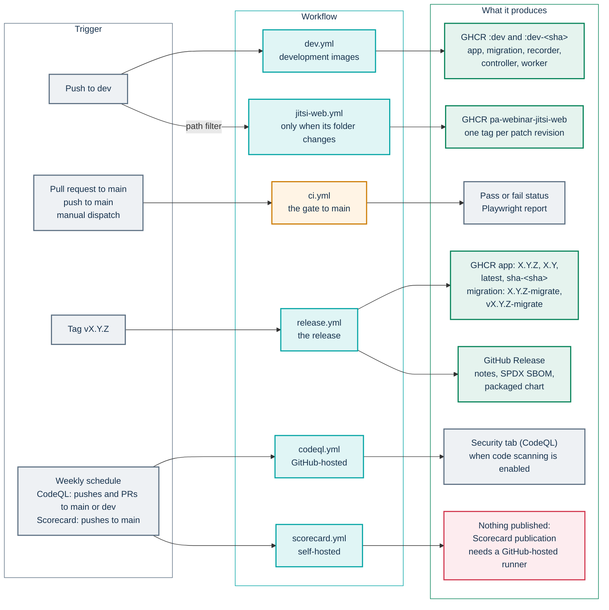
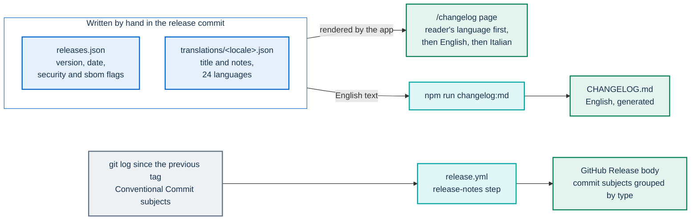
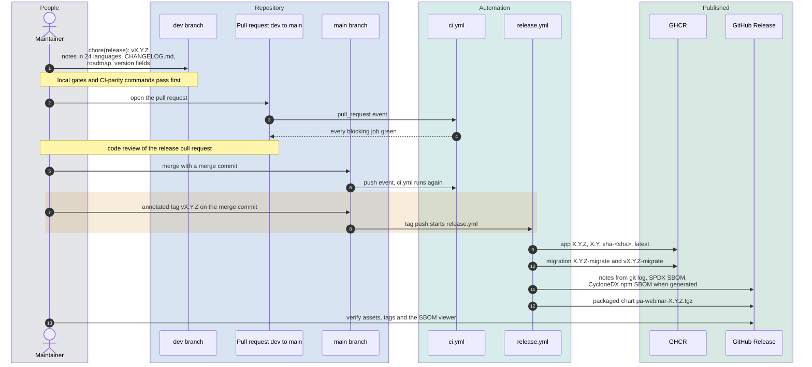

# CI, images and releases

This page describes the automation around the PA Webinar repository. It covers what each GitHub Actions workflow does, when it runs and what it produces; which image tags exist and what each one means; and how a release is cut. It is written for maintainers, for contributors who want to know what happens to their change after the merge, for supply-chain auditors, and for operators who need to know what a release contains.

Other pages own the neighboring topics:

- the local commands that reproduce each CI job, and the review rules: [How we develop PA Webinar](methodology.md);
- the test layers and what they cover: [Testing](testing.md);
- the supply-chain controls (runner isolation, pinned actions, token permissions, Dependabot, scanners): [SECURITY.md](../../SECURITY.md#supply-chain-and-ci);
- installing a release on a cluster: [Upgrades and rollback](../operations/upgrades.md).

## In short

- **`ci.yml` is the gate on the way to `main`.** It runs on pull requests into `main`, on pushes to `main` and on manual dispatch. It does not run on `dev`. A red run stops a merge by project rule, not by anything in the workflow files (see [What a red check blocks](#what-a-red-check-blocks)).
- **`dev.yml` publishes development images** on every push to `dev`: moving `:dev` tags plus an immutable `:dev-<sha>` per build. No SBOM, chart or GitHub Release comes out of it.
- **`release.yml` publishes a release** when a `vX.Y.Z` tag is pushed: the app and migration images, an SPDX SBOM, the packaged Helm chart and a GitHub Release.
- **Three components have no numbered releases.** The recorder bot, the recorder controller and the AI post-production worker are published only from `dev`. The patched Jitsi web image has its own workflow and its own tags.
- **Published images are never scanned.** Trivy scans the repository and a local build of the app image in `ci.yml`, never what reaches the registry (see [What is not scanned](#what-is-not-scanned)).
- **CI builds and never deploys.** No workflow applies anything to a cluster.

## Workflows

### From trigger to artifact



| Workflow | Trigger | Runner | Produces | A failure means |
|---|---|---|---|---|
| [`ci.yml`](../../.github/workflows/ci.yml) | Pull requests into `main`, pushes to `main`, manual dispatch | GitHub-hosted for pull requests, self-hosted otherwise | Check results and a Playwright report | A red check on the pull request or on `main`. E2E is non-blocking |
| [`dev.yml`](../../.github/workflows/dev.yml) | Pushes to `dev`, manual dispatch | Self-hosted | Development images in GHCR | The `:dev` images were not updated |
| [`release.yml`](../../.github/workflows/release.yml) | Any pushed tag matching `v*` | Self-hosted | Release images, SBOM, chart, GitHub Release | The release is incomplete (see [If something goes wrong](#if-something-goes-wrong)) |
| [`jitsi-web.yml`](../../.github/workflows/jitsi-web.yml) | Pushes to `dev` that change `infra/jitsi-web-patched/` or the workflow itself, manual dispatch | Self-hosted | The patched Jitsi web image | The image was not published |
| [`codeql.yml`](../../.github/workflows/codeql.yml) | Pushes and pull requests to `main` or `dev`, weekly | GitHub-hosted | Code-scanning results | Nothing: the job is non-blocking |
| [`scorecard.yml`](../../.github/workflows/scorecard.yml) | Pushes to `main`, weekly | Self-hosted | Nothing, as configured: publication needs a GitHub-hosted runner (see [below](#codeqlyml-and-scorecardyml-code-analysis)) | Nothing: the Scorecard step is non-blocking |

The only GitHub Actions artifact any workflow uploads is the Playwright report of the E2E job. SBOMs and the chart are attached to the GitHub Release instead.

### What a red check blocks

"Blocking" on this page means that a failing job turns the workflow run red. The workflow files make no check required. A red run blocks a merge only if the repository's branch protection or rulesets list these jobs as required status checks. The project rule is that nothing merges into `main` while a blocking job is red ([Governance](../../GOVERNANCE.md#everyday-changes)). A fork that wants the rule enforced must configure required status checks itself.

### `ci.yml`: the gate on the way to `main`

`ci.yml` runs the full set of checks. Pull requests into `dev` do not trigger it, and neither do pushes to `dev`. Until a change travels from `dev` to `main`, it gets no lint, tests, coverage, Trivy scan, license check or migration check. It gets only CodeQL, plus whatever breaks an image build in `dev.yml`: the Next.js build fails on TypeScript errors, because `app/next.config.ts` skips only ESLint during builds. Changes under `infra/jitsi-web-patched/` also get the bundle checks of `jitsi-web.yml`. That is why the [local gates](methodology.md#local-gates-before-every-commit) are mandatory before every commit.

| Job, as named in the checks list | What it runs | Waits for | Blocking |
|---|---|---|---|
| Lint & Typecheck | `npm run lint --workspace=app` and `npx tsc --noEmit --project app/tsconfig.json` | | Yes |
| Unit Tests | `npm run test:coverage --workspace=app` against a PostgreSQL service container. It fails when coverage falls below the thresholds in `app/vitest.config.ts`, which work as a ratchet | | Yes |
| Unit Tests (recorder, controller) | For `infra/recorder` and `infra/recorder-controller`, which sit outside the npm workspaces: `npm ci`, `npx tsc --noEmit -p tsconfig.json`, `npm test` | | Yes |
| Typecheck (lobby) | `npx tsc --noEmit -p lobby/tsconfig.json` | | Yes |
| Helm Chart | Builds the subcharts at the versions pinned in `Chart.lock`, runs `./scripts/validate-chart.sh`, then renders the `simple`, `standard` and `full` example values and applies each result with `kubectl apply --dry-run=server` to a throwaway kind cluster | | Yes |
| Unit Tests (worker AI) | In `infra/ai/worker`: `pip install -r requirements-test.txt`, then `pytest -q`. No GPU is involved: tests that need models skip themselves | | Yes |
| Security Scan | Trivy filesystem scan of the repository for CRITICAL and HIGH findings. `.trivyignore` at the root records the accepted ones | | Yes |
| License Compliance | `license-checker` fails on forbidden licenses among production dependencies. The job then regenerates `license-report.json` and fails if the committed file differs | | Yes |
| Migration Integrity | `prisma migrate deploy` on an empty database, then `prisma migrate diff --from-migrations app/prisma/migrations --to-schema-datamodel app/prisma/schema.prisma --shadow-database-url <the same throwaway database> --exit-code` | | Yes |
| E2E Smoke Tests | Starts the Docker Compose stack, runs the `db-migrate` service and runs Playwright on Chromium. It uploads the `playwright-report` artifact | Lint & Typecheck, Unit Tests | No (`continue-on-error`) |
| Docker Build & Scan | Builds the app image from the checkout with `push: false`, then scans that local image with Trivy for CRITICAL and HIGH findings | Lint & Typecheck, Unit Tests | Yes |

Details worth knowing:

- **Where the jobs run.** Every job chooses its runner with a conditional `runs-on`: `pull_request` events go to GitHub-hosted `ubuntu-latest`, and pushes and dispatches go to the self-hosted runner. The reason is in [Runner and permission policy](#runner-and-permission-policy).
- **The chart job pins its tools.** Helm is pinned to the lowest version the chart supports (`azure/setup-helm` in the workflow), and the kind node image is pinned by digest. The Kubernetes version behind the server-side dry run therefore changes only when the workflow changes. The Prometheus Operator resources are switched off for the dry run, because a bare cluster does not have their definitions. `validate-chart.sh`, which also runs `helm lint`, covers them instead.
- **Docker Hub credentials are optional.** The Helm Chart and E2E jobs log in to Docker Hub when the repository secrets `DOCKERHUB_USERNAME` and `DOCKERHUB_TOKEN` exist, to avoid the anonymous pull limit. Without them the login step is skipped. The E2E job also retries `docker compose up` with a back-off, because a pull limit is not a code regression.
- **Manual dispatch** exists for the case where a pull request's checks did not start.

The local command for each job, and when a job may be skipped, are in [CI parity before every push](methodology.md#ci-parity-before-every-push). What each test layer covers is in [Testing](testing.md).

### `dev.yml`: development images

`dev.yml` turns every push to `dev` into images for the maintainers' test environment. The images are not meant for installations: `:dev` moves with every push, and nothing about a development build is versioned.

| Job | Runs when | Publishes to `ghcr.io/italia/` |
|---|---|---|
| Build & Push Dev Image | Every push to `dev` and every dispatch | `pa-webinar:dev` and `:dev-<sha>`; the migration image as `pa-webinar:dev-migrate` and `:dev-migrate-<sha>` |
| Build & Push Postprod Worker Image | The push changed `infra/ai/` (except `infra/ai/local-out/`, a development tool that is not part of the image) or `infra/helm/pa-webinar/templates/cronjob-postprod-*`, or the dispatch set `force_worker_build` | `pa-webinar-postprod-worker:dev` and `:dev-<sha>` |
| Build & Push Recorder Image | The push changed `infra/recorder/`, or the dispatch set `force_recorder_build` | `pa-webinar-recorder:dev` and `:dev-<sha>` |
| Build & Push Recorder Controller Image | The push changed `infra/recorder-controller/`, or the dispatch set `force_recorder_controller_build` | `pa-webinar-recorder-controller:dev` and `:dev-<sha>` |

`<sha>` is the first seven characters of the commit SHA.

- **Change detection covers the whole push.** Each `Detect … changes` job compares the commit before the push (`github.event.before`) with the new head, so a push of several commits, or a merge, is judged on all of its changes. On the first push of a new branch, and on a dispatch, it compares with the previous commit instead.
- **A newer push cancels an older run.** The workflow uses the concurrency group `dev-build` with `cancel-in-progress`. If push A changes `infra/ai/` and push B arrives before A's worker build finishes, A's run is canceled, and B's change detection sees only B's commits. The worker is then not rebuilt. When that happens, dispatch the workflow with the matching `force_*` input.
- **A dispatch publishes whatever ref it runs on as `:dev`.** Dispatch it on `dev` unless you intend otherwise.
- **`no_cache` has no effect.** It is declared as a dispatch input, but as the cache expressions are written (`inputs.no_cache && '' || 'type=gha,…'`), an empty string on the true branch falls through to the cache spec: every job uses its GitHub Actions cache scope whatever the input says. To force a clean build, delete the workflow's caches (the `dev*` scopes) from the repository's Actions caches page, or with `gh cache delete`, before dispatching.
- **The build identity says `dev`.** The app image is built with `NEXT_PUBLIC_BUILD_VERSION=dev`, `NEXT_PUBLIC_BUILD_CHANNEL=dev`, the short SHA and the build date (see [Build identity](#build-identity)).
- **Not produced here:** SBOMs, a packaged chart, a GitHub Release, image scans.

### `release.yml`: tagged releases

`release.yml` runs on every pushed tag that matches `v*`. It does not run lint, tests or scans: it trusts that the tagged commit already passed `ci.yml`. That is why a release is tagged on `main` after the pull request from `dev` has merged (see [Cutting a release](#cutting-a-release)).

The workflow has two jobs:

1. **Build & Push Docker Image.**
   - Builds and pushes the app image. The tags come from `docker/metadata-action`: `X.Y.Z`, `X.Y`, `sha-<sha>` and `latest`. The OCI labels include `org.opencontainers.image.revision`, the full commit SHA.
   - Builds and pushes the migration image (the Dockerfile's `builder` stage) as `X.Y.Z-migrate` and `vX.Y.Z-migrate`.
   - Generates `sbom.spdx.json`, an SPDX SBOM of the published app image, with `anchore/sbom-action`.
   - Tries to generate `npm-sbom.json`, a CycloneDX SBOM of the `app` workspace. This step is best effort (see [SBOMs](#sboms)).
   - Writes the release notes from `git log` (see [Release notes and the changelog](#release-notes-and-the-changelog)).
   - Creates the GitHub Release with those notes and attaches the SBOM files.
2. **Package Helm Chart**, after the first job. It builds the subcharts from `Chart.lock` with the same Helm version the `ci.yml` chart job validates with, packages `infra/helm/pa-webinar` with `--version X.Y.Z --app-version X.Y.Z`, and attaches `pa-webinar-X.Y.Z.tgz` to the same GitHub Release. The packaged chart therefore carries the release version whatever `Chart.yaml` says, and it includes its subcharts.

The app image is built for `linux/amd64` only, and the migration image for the runner's own platform.

**A note on one build argument.** The app image build passes `NEXT_PUBLIC_JITSI_RNNOISE_ENFORCE=false`. It has no effect on the served behavior. The application reads that variable at runtime from the pod environment (`getPublicEnv`), and the Dockerfile's final stage does not declare it. Jitsi's advanced noise suppression is set per installation with `app.env.NEXT_PUBLIC_JITSI_RNNOISE_ENFORCE`, as described in [How PA Webinar extends Jitsi Meet](../architecture/jitsi-integration.md#noise-suppression-and-the-patched-image).

### `jitsi-web.yml`: the patched Jitsi web image

`jitsi-web.yml` builds `ghcr.io/italia/pa-webinar-jitsi-web`: the upstream `jitsi/web` image with the fixes that have no configuration point. Why the patch exists is in [ADR-017](../adr/017-patched-jitsi-web-image.md). How it works is in [How PA Webinar extends Jitsi Meet](../architecture/jitsi-integration.md#the-patched-web-image).

- **When it runs.** On pushes to `dev` that change `infra/jitsi-web-patched/` or the workflow file, and on manual dispatch. It does not run for releases.
- **Validate, then push the same image.** The job builds the image into the local Docker daemon without pushing it. It then extracts the patched files and the original ones, and checks each patch by occurrence count in the JavaScript bundle and in `all.css`. When the runner's Node.js can parse the original bundle, it also checks that the patched bundle still parses (`node --check`); otherwise it logs a warning and relies on the count checks. Only then does it push the exact image it validated, without rebuilding. The image is built with `provenance: false` so that it can be loaded locally.
- **Tags.** The workflow's `env` block sets the upstream build in `BASE_TAG` and the published tag in `IMAGE_TAG`, of the form `stable-<jitsi-build>-rnnoise`. Bump `IMAGE_TAG` in the same change as any patch change: the workflow pushes whatever `IMAGE_TAG` says, so an unchanged value overwrites the previous image and makes a rollback impossible.
- **The chart default is separate.** `jitsi-meet.web.image.tag` in `infra/helm/pa-webinar/values.yaml` is maintained on its own and can lag behind `IMAGE_TAG`. Compare the two before relying on the chart default.

Building, bumping and verifying the image step by step is in [infra/jitsi-web-patched/README.md](../../infra/jitsi-web-patched/README.md).

### `codeql.yml` and `scorecard.yml`: code analysis

- **CodeQL** analyzes JavaScript and TypeScript with the `security-extended` queries on pushes and pull requests to `main` and `dev`, and weekly. It runs on GitHub-hosted runners and is non-blocking (`continue-on-error`). Results reach the repository's Security tab only when code scanning is enabled in the repository settings. Until then the job still ends green.
- **OpenSSF Scorecard** runs on pushes to `main` and weekly, on the self-hosted runner. It is configured to publish (`publish_results: true`), but scorecard-action accepts publication only from GitHub-hosted runners. As configured, the publication is rejected, the Scorecard step fails without failing the run (`continue-on-error`), and the upload to the Security tab, which runs only when that step succeeds, is skipped. Results reach OpenSSF and the Security tab only once the job runs on `ubuntu-latest`. The optional `SCORECARD_TOKEN` secret replaces the default token when the organization's settings deny the default one the access it needs.

### Dependency updates

`.github/dependabot.yml` checks every week for updates to the npm packages (root workspaces, app, recorder, recorder controller), the Python worker, the base images and the GitHub Actions. Major versions of the dependencies listed under `ignore` are left out of routine updates and done as dedicated upgrades. What is covered and why is in [SECURITY.md](../../SECURITY.md#dependency-updates).

### Running the workflows in a fork

The workflows name the upstream repository's own infrastructure. A fork that wants its own builds changes these places:

- **The self-hosted runner label.** Jobs on trusted events run on `arc-runner-pa-webinar`: the non-pull-request branch of every `runs-on` in `ci.yml`, and every job in `dev.yml`, `release.yml`, `jitsi-web.yml` and `scorecard.yml`. Without a runner with that label, those jobs stay queued. Replace the label with your own runner's, or with `ubuntu-latest`. In `ci.yml`, keep the conditional so that pull requests still run on GitHub-hosted runners (see [Runner and permission policy](#runner-and-permission-policy)). In `scorecard.yml`, use `ubuntu-latest`, not another self-hosted label: scorecard-action publishes results only from GitHub-hosted runners.
- **The image names.** `IMAGE_NAME` and the other `*_IMAGE_NAME` values in the `env` blocks of `dev.yml`, `release.yml` and `jitsi-web.yml` point to `italia/…`. A workflow's token can push only to its own owner's packages, so set them to your namespace. Then point the chart at your images (see [Deploying with Helm](../DEPLOYMENT.md)).
- **Optional secrets.** `DOCKERHUB_USERNAME` and `DOCKERHUB_TOKEN` lift the Docker Hub pull limit for the chart and E2E jobs. `SCORECARD_TOKEN` is used only when the default token cannot run Scorecard.
- **Code scanning.** Enable it in the repository settings if you want CodeQL results.

## What is not scanned

Trivy runs only in `ci.yml`, on the repository and on a local app build that is never pushed. `release.yml` rebuilds the images from the tag, so the published digest is a different build, possibly on a newer base layer, and no workflow scans it or any `:dev` image. The scanner coverage and its limits are in [SECURITY.md](../../SECURITY.md#scanners).

## Runner and permission policy

The self-hosted runner lives inside a Kubernetes cluster, where code could reach the cloud metadata endpoint, a ServiceAccount or the Docker socket. Code from a pull request must never run there:

- `ci.yml` sends `pull_request` events to GitHub-hosted runners through its conditional `runs-on`, and keeps the self-hosted runner for pushes and dispatches.
- The publishing workflows start only on trusted events: pushes to `dev` or `main`, tags, manual dispatch or a schedule. No workflow uses `pull_request_target`.
- Every `uses:` is pinned to a full commit SHA, with the tag in a trailing comment.
- Workflow-level permissions are read-only where they are declared (`ci.yml`, `codeql.yml`, `scorecard.yml`). `dev.yml`, `jitsi-web.yml` and `release.yml` set permissions per job: only the jobs that publish images or attach files to a release get `packages: write` or `contents: write`, and jobs with no block (the change-detection jobs of `dev.yml`) get the repository's default token permissions, which must stay read-only.

Any new workflow that a pull request can trigger must keep the same conditional runner. The complete policy, including the permission table and fork approval, is in [SECURITY.md](../../SECURITY.md#where-ci-code-runs).

## Image tags

All images live in GitHub Container Registry under `ghcr.io/italia/`. They require registry credentials to pull; how pull secrets reach each pod is in [Upgrades and rollback](../operations/upgrades.md#check-that-every-image-can-be-pulled).

| Image | Built by | Release tags | Development tags |
|---|---|---|---|
| `pa-webinar` (the app) | `release.yml`, `dev.yml` | `X.Y.Z`, `X.Y`, `latest`, `sha-<sha>` | `dev`, `dev-<sha>` |
| `pa-webinar` (the migration image: the `builder` stage, with the Prisma CLI) | `release.yml`, `dev.yml` | `X.Y.Z-migrate` and `vX.Y.Z-migrate` | `dev-migrate`, `dev-migrate-<sha>` |
| `pa-webinar-recorder` | `dev.yml` | None | `dev`, `dev-<sha>` |
| `pa-webinar-recorder-controller` | `dev.yml` | None | `dev`, `dev-<sha>` |
| `pa-webinar-postprod-worker` | `dev.yml` | None | `dev`, `dev-<sha>` |
| `pa-webinar-jitsi-web` | `jitsi-web.yml` | Not tied to releases: `stable-<jitsi-build>-rnnoise`, the value of `IMAGE_TAG` | None |

The load-test image in `scripts/load-test/` is not built by any workflow. Its manual is [scripts/load-test/README.md](../../scripts/load-test/README.md).

### Choosing a tag

- **`X.Y.Z`** identifies one release. Pin this, or better the digest, in an installation.
- **`X.Y`** and **`latest`** move. `docker/metadata-action` adds them for every release tag it builds, so they point to the most recently published release, which is not necessarily the highest version: tagging a patch on an older minor line moves `latest` back to it.
- **`sha-<sha>`** names the commit the release was built from.
- **`:dev` and `:dev-<sha>`** are development builds. They are not supported versions ([SECURITY.md](../../SECURITY.md#supported-versions)).

### Migration image tags

The migration image runs the database migrations in the `db-migrate` init container before each app pod starts. `release.yml` pushes it under two tags that name the same image:

- **`X.Y.Z-migrate`**, without the `v`. This is the tag the chart computes by itself when `app.migration.image.tag` is empty: it appends `-migrate` to `app.image.tag`, or to the chart's `appVersion` (`pa-webinar.migrationImage` in `infra/helm/pa-webinar/templates/_helpers.tpl`).
- **`vX.Y.Z-migrate`**, with the `v` of the Git tag. Existing upgrade procedures use this form.

Releases cut before `release.yml` published both forms carry only `vX.Y.Z-migrate`, and for them the chart's computed default does not resolve. Passing both image tags explicitly on every upgrade works for every release, which is what [the upgrade procedure](../operations/upgrades.md#the-upgrade-procedure) does. The k3s installer derives both from the checked-out tag.

### Components published only from `dev`

The recorder, the recorder controller and the post-production worker have no release tags, and the chart's defaults in `values.yaml` (`recorder.image`, `recorder.controller.image`, `postprod.worker.image`) point to `:dev`. Two consequences follow:

- Whoever installs a given chart version gets whatever was last built from `dev` for these components.
- Rolling the app back to an earlier release does not roll them back. Pin a `:dev-<sha>` tag or a digest to make them reproducible, as described in [Upgrades and rollback](../operations/upgrades.md#making-the-dev-components-roll-back).

Versioned, verifiable images for every component are an open item in the [roadmap](../ROADMAP.md#installation-and-operations).

### Build identity

The app image carries its own identity, set as build arguments by the workflow that built it:

| Variable | `release.yml` | `dev.yml` |
|---|---|---|
| `NEXT_PUBLIC_BUILD_VERSION` | `X.Y.Z` | `dev` |
| `NEXT_PUBLIC_BUILD_CHANNEL` | `release` | `dev` |
| `NEXT_PUBLIC_BUILD_SHA` | Short commit SHA | Short commit SHA |
| `NEXT_PUBLIC_BUILD_DATE` | Build time (UTC) | Build time (UTC) |

The Dockerfile declares them in the build stage, where they are inlined into the page footer, and again in the final stage, so the running server knows them too:

- the footer shows `vX.Y.Z` on a release build, or **development build** on a `dev` build, linked to the `/changelog` page, then the short commit SHA, linked to the commit in the repository named by the `githubUrl` site setting when that setting is filled in, and the build date;
- `GET /api/health` returns `version`, `commit` and `builtAt` ([Monitoring and health](../operations/monitoring.md#apihealth-liveness));
- the `/changelog` page marks the release that matches the running version as **Current version**.

After an upgrade, `/api/health` is the quickest way to confirm which build is serving.

## SBOMs

Each GitHub Release can carry two SBOMs:

- **`sbom.spdx.json`**: an SPDX JSON SBOM of the published app image `ghcr.io/italia/pa-webinar:X.Y.Z`, generated by Syft through `anchore/sbom-action`. It is attached to the release, not uploaded as an Actions artifact.
- **`npm-sbom.json`**: a CycloneDX SBOM of the npm dependencies of the `app` workspace, from `@cyclonedx/cyclonedx-npm`. This step is best effort (`continue-on-error`, and the command ends in `|| true`). The job does not set up Node.js, so on a runner without `npm` the step fails and the release has no `npm-sbom.json`. Check the release assets rather than assuming the file is there.

Which images have no SBOM, and the signing status, are in [SECURITY.md](../../SECURITY.md#release-artifacts-and-sboms).

**The SBOM viewer.** On the `/changelog` page of an installation, a release whose entry in `app/src/content/changelog/releases.json` has `"sbom": true` shows an **SBOM** button inside its collapsed **Technical detail** disclosure, which is rendered only when the `githubUrl` site setting points at a GitHub repository. The button opens a searchable list of the image's components (name, version, ecosystem) and a **Download full SBOM (SPDX)** link. The server fetches `sbom.spdx.json` from the GitHub Release of the repository named in the `githubUrl` site setting, trims it and caches the summary (`app/src/app/api/changelog/[version]/sbom/route.ts`). The route accepts only an `https://github.com/<owner>/<repo>` URL and only versions listed in `releases.json` with the flag set. The viewer reads the SPDX image SBOM only.

The CycloneDX 1.6 service inventory at `/service-inventory` is a different document, which describes the deployed services of one installation. See [Service inventory: publishing](../SERVICE-INVENTORY.md).

## Release notes and the changelog

Release notes exist in three places, and two different sources feed them:



**The curated notes** live in `app/src/content/changelog/`:

- `releases.json` is the list of releases, newest first. Each entry has `version` (without the `v`), `date` (ISO `YYYY-MM-DD`), and two optional flags: `security`, for a release whose main purpose is security or dependency hardening, and `sbom`, for a release whose GitHub Release carries `sbom.spdx.json`.
- `translations/<locale>.json` holds, for each version, a `title` and a list of `notes`: user-facing highlights, most notable first. There is one file per interface language. `it.json` is the original.
- The `/changelog` page renders them in the reader's language, falls back to English and then Italian, and sets the text's `lang` attribute to the language it actually came from.
- `npm run changelog:md` (`scripts/generate-changelog-md.mjs`) writes `CHANGELOG.md` from `releases.json` and `translations/en.json`. It stops if a release has no English text. Never edit `CHANGELOG.md` by hand.
- `app/src/content/changelog/changelog.test.ts` enforces the rules. The changelog languages must match the interface catalogs. Every release needs a non-empty title and notes in every language, with the same number of notes as the Italian original. Versions must be unique, dates must be ISO dates, the list must be newest first, and `CHANGELOG.md` must contain every release heading and the newest English title.

`scripts/sync-i18n.mjs` does not cover these files, so every language is written in the release commit itself.

**The GitHub Release body** is generated by `release.yml`. It lists the commits since the previous tag (the highest version-sorted tag other than the new one), excluding merges, grouped by Conventional Commit type: `feat`, `fix`, `perf`, `refactor`, `docs`, `ci`, `chore` and `test` get their own section, and every other subject goes under "Other". It ends with a compare link. The subjects appear as written, in the language of the commit history, which is Italian. The translated, reader-oriented notes are the curated ones above.

How the 24 languages are organized is in [Languages and localization](../architecture/i18n.md).

## Cutting a release

A release is an annotated `vX.Y.Z` tag on `main`, placed on the merge commit of the pull request from `dev`. The version follows Semantic Versioning, as set out in [Governance](../../GOVERNANCE.md#releases-and-versioning).



### 1. Prepare the release commit on `dev`

Make one commit on `dev` with the subject `chore(release): vX.Y.Z` and a body that says what the release brings and what was verified. It contains:

1. **The release entry.** Add `{ "version": "X.Y.Z", "date": "YYYY-MM-DD" }` at the top of `app/src/content/changelog/releases.json`, using the date of the tag. Add `"security": true` if the release is mainly security or dependency hardening. Add `"sbom": true` as well, because `release.yml` attaches the SBOM when the tag is pushed. [4. Verify what was published](#4-verify-what-was-published) confirms that it did, and [If something goes wrong](#if-something-goes-wrong) says what to do when it did not.
2. **The notes in every language.** Add the version to every file in `app/src/content/changelog/translations/`, starting from `it.json`, with a title and the same number of notes in each language. The changelog test fails otherwise.
3. **The generated changelog.** Run `npm run changelog:md` and commit the regenerated `CHANGELOG.md`.
4. **The roadmap.** Remove from [docs/ROADMAP.md](../ROADMAP.md) every item this release ships. Items that slipped move, and they are never deleted without shipping (the rules are at the top of the roadmap).
5. **The version fields.**

   | File | Field | Notes |
   |---|---|---|
   | `package.json` | `version` | The root workspace |
   | `app/package.json` | `version` | |
   | `package-lock.json` | `version` of the root and of the `app` entry | `npm install --package-lock-only` refreshes them. Check that the diff touches only those fields |
   | `infra/helm/pa-webinar/Chart.yaml` | `appVersion` | A chart installed from a source checkout uses it as the default image tag |
   | `infra/helm/pa-webinar/Chart.yaml` | `version` | No change needed: `release.yml` replaces it with `X.Y.Z` when it packages the chart. Only a chart installed from a source checkout reports the committed value |
   | `publiccode.yml` | `softwareVersion`, `releaseDate` | Read by the Developers Italia catalog |

   `lobby/package.json`, `infra/recorder/package.json` and `infra/recorder-controller/package.json` are not versioned with releases.

### 2. Check, then open the pull request to `main`

1. Run the pre-commit gates and the CI-parity commands described in [How we develop PA Webinar](methodology.md#ci-parity-before-every-push). `release.yml` runs no checks of its own, so this pull request is the last gate, and it holds only by the project rule described in [What a red check blocks](#what-a-red-check-blocks).
2. Open the pull request from `dev` to `main`. `ci.yml` runs on it.
3. Review it like any non-trivial change. Resolve every confirmed finding before the merge.

### 3. Merge and tag

1. Merge the pull request with a **merge commit**, never a squash, so the individual commits of `dev` stay in the history of `main`.
2. Wait for `ci.yml` on the push to `main` to finish green.
3. Tag the merge commit and push the tag. Before tagging, check that the head of `main` is the merge commit of the release pull request: if another pull request merged in the meantime, tag the release merge commit by its SHA instead of `origin/main`.

   ```bash
   git fetch origin
   git log -1 --format='%H %s' origin/main   # must be the merge commit of the release pull request
   git tag -a vX.Y.Z -m "vX.Y.Z" origin/main
   git push origin vX.Y.Z
   ```

The tag is strict Semantic Versioning, `vX.Y.Z` with no suffix. `release.yml` starts on any tag that begins with `v`, so push no other tag of that shape.

### 4. Verify what was published

- The `release.yml` run is green, both jobs included.
- The GitHub Release exists with `sbom.spdx.json` and `pa-webinar-X.Y.Z.tgz`, plus `npm-sbom.json` if that step succeeded.
- The images resolve, after `docker login ghcr.io`:

  ```bash
  docker buildx imagetools inspect ghcr.io/italia/pa-webinar:X.Y.Z
  docker buildx imagetools inspect ghcr.io/italia/pa-webinar:X.Y.Z-migrate
  docker buildx imagetools inspect ghcr.io/italia/pa-webinar:vX.Y.Z-migrate
  ```

- On an installation that runs the release, `/api/health` reports `X.Y.Z`, and on `/changelog` the entry shows **Current version**. Expand **Technical detail** on it and check that the **SBOM** button opens the component list. The disclosure appears only when the `githubUrl` site setting points at the GitHub repository.

### If something goes wrong

- **The workflow failed partway.** Images can exist without a GitHub Release, or a release without its chart. Re-run the failed jobs from the Actions page: they build again from the same tagged commit and push the same tags. The tags then move to the new build, which may have a different digest, because the base image is referenced by tag, not by digest. Record the digests after the successful run, not before.
- **`sbom.spdx.json` is missing.** Remove the `sbom` flag from the release's entry in `releases.json` in a follow-up commit, so the viewer does not offer an SBOM that does not exist.
- **The release itself is faulty.** Publish a fix as a new patch release. `X.Y` and `latest` move to it. Supported versions are defined in [SECURITY.md](../../SECURITY.md#supported-versions).

## CI builds, it never deploys

No workflow applies anything to a cluster. `dev.yml` and `release.yml` stop at the registry and the GitHub Release, and each installation decides when to move. Operators upgrade with the procedure in [Upgrades and rollback](../operations/upgrades.md): the profile and overlay of the new release, then the installation's own site file, with the app and migration image tags passed explicitly, and a check that every image can be pulled before the upgrade. A rollback restores the chart's manifests, not the database schema and not the components published only as `:dev` ([Rollback](../operations/upgrades.md#rollback)).

## Related pages

- [How we develop PA Webinar](methodology.md): branching, commits, local gates, CI parity and code review.
- [Testing](testing.md): the test layers and their commands.
- [SECURITY.md](../../SECURITY.md): supported versions, reporting, and the supply-chain controls.
- [Governance](../../GOVERNANCE.md): who cuts releases, and the versioning policy.
- [Upgrades and rollback](../operations/upgrades.md): installing a release.
- [Deploying with Helm](../DEPLOYMENT.md): the chart and its values.
- [THIRD-PARTY-LICENSES.md](../../THIRD-PARTY-LICENSES.md): the license policy behind the License Compliance job.
- [Data model](../architecture/data-model.md): the migration policy that the Migration Integrity job checks.
