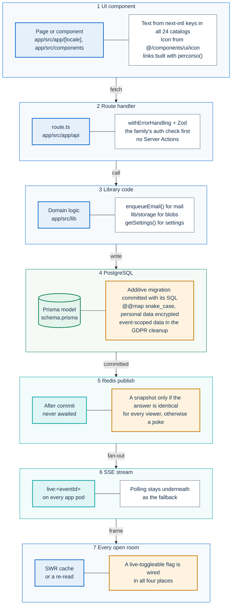
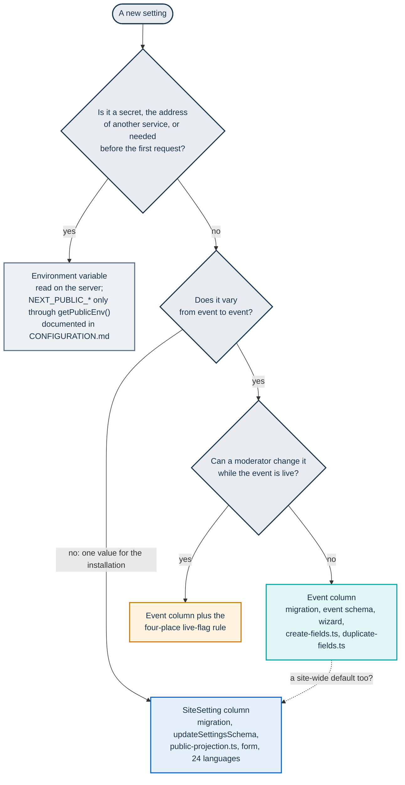

# Extending PA Webinar

This page is for developers who change PA Webinar: teams at public administrations (PA) that reuse it, their suppliers, and external contributors. It holds two things:

- the **code conventions** that every change follows;
- a **recipe for each kind of change**: a page, an API route, a data-model change, a live feature, interface text, an email, a setting, a storage provider, an AI engine, Jitsi behavior, a scheduled job, the Helm chart or a dependency.

Each recipe is a checklist. It names the files to touch and the guard test that fails when a step is missed. For how a mechanism works, it links the page that owns that mechanism instead of explaining it again.

Other pages cover the rest of the process:

- [CONTRIBUTING.md](../../CONTRIBUTING.md): proposing a change, branching, commit messages and opening a pull request.
- [How we develop PA Webinar](methodology.md): the gates every change passes (lint, type check, tests, code review, CI parity).
- [Local development](../DEVELOPMENT.md): running the stack locally.

## Find your recipe

| You want to | Go to |
|---|---|
| Rebrand an installation, change wording or the home page | [White-labeling without code](#white-labeling-without-code) |
| Add a public or administration page | [Adding a page](#adding-a-page) |
| Add or change an endpoint | [Adding an API route](#adding-an-api-route) |
| Add a table or a column | [Changing the data model](#changing-the-data-model) |
| Add something to the live room, or a switch moderators flip during the event | [Adding a live feature](#adding-a-live-feature) |
| Add text to the interface, or a language | [Adding UI text or a language](#adding-ui-text-or-a-language) |
| Send a new kind of email | [Sending a new email](#sending-a-new-email) |
| Make something configurable | [Adding a setting](#adding-a-setting) |
| Support another object store | [Adding a storage provider](#adding-a-storage-provider) |
| Add a transcription, language-model or speech engine | [Adding an AI engine](#adding-an-ai-engine) |
| Change what the conference does or shows | [Changing Jitsi behavior](#changing-jitsi-behavior) |
| Run something on a schedule | [Adding a scheduled job](#adding-a-scheduled-job) |
| Add a Helm value, template or guard | [Changing the Helm chart](#changing-the-helm-chart) |
| Add an npm or Python package | [Adding a dependency](#adding-a-dependency) |
| Know which tests to write | [Tests expected per kind of change](#tests-expected-per-kind-of-change) |

## Before you start

1. **Check the roadmap.** [ROADMAP.md](../ROADMAP.md) lists what is missing and the known limitations of shipped features. If your change is there, its entry records what is already known. Leave the entry in place: items leave the roadmap in the release that ships them.
2. **Check whether it is already a setting.** Much of what an administration wants to change needs no code at all ([White-labeling without code](#white-labeling-without-code), [Runtime settings](../configuration/runtime-settings.md)).
3. **Apply the process rules.** When a change needs an Architecture Decision Record (ADR), how to write the general case instead of the example that motivated a request, and how to find every consumer of a shared contract are defined once, in [How we develop PA Webinar](methodology.md): see [Principles](methodology.md#principles), [Architecture decisions](methodology.md#architecture-decisions) and [Regression discipline](methodology.md#regression-discipline). In this codebase, the consumers of a contract include the recorder bot, the recorder controller, the AI worker and the chart's scripts, not only pages and hooks.

## Where the code lives

The portal's source is under `app/src/`. The table maps folders, not files: open the folder and read the file names, or search for the symbol a page of this documentation names.

| Folder | What it holds |
|---|---|
| `app/[locale]/` | Pages. The folder names are the internal English paths; the localized URLs come from `app/src/i18n/routing.ts` |
| `app/api/` | Route handlers, one `route.ts` per path, grouped by family ([API surface](../architecture/api.md)) |
| `middleware.ts` | Locale resolution, the staff-session guard for the administration pages and the security headers, including the CSP. It sits beside `app/`, not inside it, and never runs on `/api/*` |
| `components/` | React components by area: `live/` (the live room, waiting room and drawer panels), `jitsi/` (`JitsiRoom`, the moderator controls and the raised-hand queue), `admin/` (the administration area, with the event wizard in `admin/event-wizard/`), `qa/`, `polls/`, `materials/`, `questionnaires/`, `layout/` (header, footer, language switcher), and `ui/` for the shared components |
| `hooks/` | Client hooks, among them `use-jitsi-events.ts` (IFrame API events) and `use-live-state.ts` (the live stream, which writes into the panels' SWR cache and tells them when polling can pause) |
| `lib/` | Domain logic that route handlers and pages call. Among its folders: `auth/` (staff sessions, moderator tokens, the Jitsi JWT, cron and webhook authentication), `jitsi/` (IFrame configuration and room helpers), `events/` (event lifecycle, access and visibility rules), `email/` (the outbox and templates), `storage/` (the storage providers), `crypto/` (encryption of personal data), `gdpr/` (cleanup selection), `chat/`, `live-state/` and `live-control/` (realtime channels), `ai/` (post-production queue and the engine policy), `persons/` (address book), `validation/` (Zod schemas). Single files hold cross-cutting helpers: `env.ts`, `settings.ts`, `rate-limit.ts`, `metrics.ts`, `redis.ts`, `jvb-sizing.ts` |
| `i18n/` | next-intl configuration, the path map (`routing.ts`), the navigation helpers and the 24 message catalogs (`messages/`) |
| `styles/` | `globals.scss` and the self-hosted font declarations |

Outside `app/src/`, `app/prisma/` holds the schema, the migrations and the seed script, and `app/public/` the static assets. The rest of the repository is mapped in [Repository map](../ARCHITECTURE.md#repository-map).

## Anatomy of a change

A typical feature crosses every layer of the portal, and each layer has one rule that matters most. Not every change touches all seven, but the rule of each layer you touch applies.

The amber boxes are the rules whose omission fails silently. Nothing errors when you miss one. The defect surfaces later, in one of three ways:

- data outlives its retention;
- one person sees another person's state;
- a switch takes effect only after a page reload.



Where each rule is explained:

- Layers 1 and 2: [Languages and localization](../architecture/i18n.md) and [API surface](../architecture/api.md).
- Layer 4: [Data model](../architecture/data-model.md) and [Privacy and data protection](../GDPR.md).
- Layers 5 to 7: [Live interaction and realtime](../architecture/live-interaction.md).

## Code conventions

### TypeScript and files

- **Strict TypeScript.** `strict: true` is on, and `any` is a lint error (`@typescript-eslint/no-explicit-any`). Accept `unknown` and narrow it, usually with a Zod schema. `noUncheckedIndexedAccess` is also on (`app/tsconfig.json`): reading an array element or a record entry by index gives `T | undefined`, so handle the missing case instead of asserting it away.
- **Formatting** follows Prettier, configured in `.prettierrc` at the repository root. `npm run format` runs `prettier --write .` over the whole repository; to format only the files you changed, run `npx prettier --write <files>`. Neither lint nor CI checks formatting (the lint configuration only switches off the rules that would conflict with Prettier), so format before you commit.
- **Type-only imports** use `import type`, which lint enforces (`@typescript-eslint/consistent-type-imports`).
- **File names are kebab-case**, such as `event-list-client.tsx`. Components are exported in PascalCase. Hooks live in `app/src/hooks/use-<name>.ts` and export `use<Name>`.
- **Server Components by default.** Add `'use client'` only for state, effects or browser APIs, and keep the client part as small as the interaction needs.
- **Domain logic lives in `app/src/lib/`**, as functions that the route handler calls. Keep selection rules and calculations pure, so a unit test can cover them without a database. `app/src/lib/gdpr/cleanup-selection.ts` is an example.
- **Logging.** `console.log` is a lint warning, while `console.warn` and `console.error` are allowed. The local rule `local/no-console-with-pii` warns when a logged argument has a name that suggests personal data or a credential (`email`, `token`, `displayName` and similar). Never log personal data, tokens or client IP addresses ([Security architecture](../architecture/security.md#logging)).

### Route handlers

- **No Server Actions.** Every mutation is a route handler: a `route.ts` file under `app/src/app/api/` that exports one function per HTTP method.
- **Wrap each handler in `withErrorHandling`** (`app/src/lib/api-handler.ts`). The wrapper maps errors to responses, records the HTTP metrics and writes one log line per request. Throw the typed errors from `app/src/lib/errors.ts` (`ValidationError`, `NotFoundError`, `ForbiddenError`, `ConflictError`, `RateLimitError` and the others) instead of building error responses by hand. The few routes outside the wrapper, mostly streams and raw file responses, are listed in [Routes outside the wrapper](../architecture/api.md#routes-outside-the-wrapper). A new route stays outside only when it streams its body.
- **Validate bodies with Zod.** Read the body with `parseJsonBody()`, then call `schema.safeParse()`. Schemas shared with the OpenAPI document live in `app/src/lib/validation/schemas.ts`.
- **Authenticate in the handler.** The middleware (`app/src/middleware.ts`, beside `app/src/app/`, not inside it) runs on pages only, never on `/api/*`. Each route checks its own caller.

The conventions in full are in [API surface](../architecture/api.md#conventions).

### The interface and the .italia design system

- **Components** come from design-react-kit and Bootstrap Italia, the .italia design system. The app uses no Tailwind, no CSS-in-JS and no CSS modules.
- **Styles.** Shared CSS lives in `app/src/styles/globals.scss`, which also defines the app's color tokens (`--app-*`). Components use Bootstrap Italia utility classes, and inline `style` objects only where no utility exists.
- **Never import `Icon` from design-react-kit.** The kit loads each icon asynchronously into a module-level cache. That cache is full on the server and empty on the first client render. React keeps the empty placeholder, so the icon disappears after hydration. Use `Icon` from `@/components/ui/icon` instead. It takes the same props (`icon`, `size`, `color`, `title`, `padding`) and renders a `<use>` element that points at the sprite the app serves from `/svg/sprites.svg`.

  Lint rejects the kit's `Icon` import (`no-restricted-imports`). It does not see kit components that render the kit's `Icon` internally, such as `CardReadMore`. For those, write the markup yourself, as `app/src/components/events/event-list-client.tsx` does, or use an inline SVG.
- **Keep the `.alert` padding.** Bootstrap Italia draws the alert icon as a background image and reserves `padding-left: 4em` for it. Spacing utilities such as `px-2` override the component rule and put the icon under the text. `globals.scss` restores the padding with a more specific selector (`.alert[class*="alert-"]`). Do not remove that override, and do not reduce an alert's horizontal padding.
- **Light theme only.** No `prefers-color-scheme` and no `data-bs-theme`. Design contrast against white surfaces.
- **Fonts are self-hosted**, declared in `app/src/styles/_fonts.scss` with the files in `app/public/fonts/`. Do not load fonts or scripts from a CDN. The Content Security Policy (`font-src 'self' data:`) blocks them, and the privacy model forbids requests to third parties ([Content Security Policy](../SECURITY-CSP.md)).
- **No hardcoded interface text**, including `aria-label` and `title` values. Text comes from next-intl: `getTranslations` in Server Components, `useTranslations` in Client Components. No lint rule enforces this, so review does.
- **Reuse the shared components** in `app/src/components/ui/` (toasts, the confirmation dialog, skeletons, the Markdown renderer) instead of adding new variants.

### Reading configuration

- **Read `NEXT_PUBLIC_*` only through `getPublicEnv()`** (`app/src/lib/env.ts`), in Server Components and route handlers. Pass the value to Client Components as a prop. A dot-notation read (`process.env.NEXT_PUBLIC_X`) is replaced when the image is built. The value is then frozen into the image, which breaks the single image that serves every installation. ESLint rejects that form outside `app/src/lib/env.ts` and the tests. The few variables that are deliberately build-time are listed under [Build-time values](../CONFIGURATION.md#build-time-values).
- **Get the portal's absolute origin from `appBaseUrl()`**, in the same file. It returns `null` for a malformed `NEXT_PUBLIC_APP_URL`. Calling `new URL()` on the raw value instead throws, and turns a configuration mistake into a 500.
- **Read site settings through `getSettings()`** (`app/src/lib/settings.ts`). It keeps a copy of the row in each process for 60 seconds.

### Side effects

- **Email.** Always call `enqueueEmail()` (`app/src/lib/email/outbox.ts`), never `sendEmail()`. The only legitimate caller of `sendEmail()` is the `/api/cron/email-outbox` job ([Email and calendar](../architecture/email.md#the-rules)).
- **Object storage.** Go through `getFilesStorage()` or `getRecordingsStorage()` from `@/lib/storage`. New code does not import a vendor SDK, or the deprecated shim `app/src/lib/azure/blob-storage.ts`.
- **Visible failures.** A mutation the user asked for checks the response, rolls back optimistic state and tells the user, usually with a toast. Never silence one with `.catch(() => {})`. That pattern is acceptable only on a best-effort side call whose failure changes nothing for anyone, such as the ping that warms up the bridge before a join. Add a comment that says so.
- **Event tokens** travel only as `Authorization: Bearer <token>`, or as `?token=` on a magic-link landing page. Read them with `extractModeratorToken()` (`app/src/lib/auth/moderator.ts`). A token sent in a custom header is not read, so the request gets a 401.

### What the platform never does

| Never | Instead |
|---|---|
| Store recordings in the database | Object storage ([ADR-006](../adr/006-recording-and-storage.md)) |
| Create accounts with passwords | Magic links for moderators and speakers, registration for participants, the instance API key or a one-time sign-in link for staff ([ADR-003](../adr/003-moderator-magic-links.md), [ADR-009](../adr/009-admin-session.md)) |
| Use `getServerSideProps` or `getStaticProps` | App Router Server Components and route handlers ([ADR-002](../adr/002-nextjs-fullstack.md)) |
| Add client-side analytics, tracking pixels or third-party resources | Server-side metrics and event analytics ([Monitoring and health](../operations/monitoring.md)) |
| Write custom WebRTC, use `lib-jitsi-meet` in the portal, or modify the Jitsi source | The extension ladder in [How PA Webinar extends Jitsi Meet](../architecture/jitsi-integration.md#the-extension-ladder) |
| Run `db:push` | Migrations ([Data model](../architecture/data-model.md#migrations)) |
| Call an AI service outside the cluster | In-cluster engines ([ADR-016](../adr/016-in-cluster-ai-postproduction.md)) |

## White-labeling without code

Before you write code to customize an installation, check whether a setting already covers it. Administrators change these at runtime in **Site settings** (`/admin/settings`) and its sub-pages, with no rebuild and no restart:

- the site name, logo, tagline and primary color;
- the home page, including custom HTML, and the link-preview card;
- any interface text, through translation overrides;
- the header, the footer and the legal pages;
- the email sender name and reply-to address, and the text of the confirmation and reminder emails;
- the watermark over the video.

Per event, staff set the waiting-room music in the event wizard.

Some changes do need a rebuild: fonts, the compiled component palette, the default marks, the virtual backgrounds and the email layout. [Branding and white-labeling](../configuration/branding.md) describes each surface, its fallbacks and its limits. Its table [What needs a rebuild or redeploy](../configuration/branding.md#what-needs-a-rebuild-or-redeploy) says what each of these changes takes.

## Adding a page

- [ ] Create the directory under `app/src/app/[locale]/`, with English segment names (`events`, `calendar`). `page.tsx` is a Server Component.
- [ ] Declare the internal path in the `pathnames` map in `app/src/i18n/routing.ts`, with its `it` and `en` forms, or a single string when the two are identical (`'/privacy': '/privacy'`). Sub-pages are declared one by one. `app/src/lib/utils/localized-url.test.ts` fails for any page missing from the map.
- [ ] Link to the page with `percorso()` and `Link` from `@/i18n/navigation`. Outside the router (emails, calendar files, copied links, `redirect()`), use `localizedUrl()` or `localizedPath()` from `@/lib/utils/localized-url`. Never write `/it/eventi/…` or `locale === 'it' ? … : …` by hand. `usePathname()` returns the internal path, with placeholders and no language.
- [ ] Put all text in the catalogs ([Adding UI text or a language](#adding-ui-text-or-a-language)).
- [ ] For a page in the administration area:
  - declare its audience at the top: `const denied = await soloAdmin(locale); if (denied) return denied;` for administrators only, or `const session = await staffOLogin(locale)` for any staff member, then filter the data with the session. Both helpers are in `app/src/lib/auth/staff-page.ts`. `app/src/lib/auth/staff-access.test.ts` fails for a page that declares no audience;
  - add its breadcrumb label in `app/src/components/admin/admin-breadcrumb.tsx`, with the key in the `admin.nav` namespace in all 24 catalogs. `localized-url.test.ts` fails for an administration page with no breadcrumb entry, and the parity test covers the catalogs;
  - add a menu entry in `app/src/components/admin/admin-nav.tsx` if it needs one. Organizers see an entry only when it is listed in `VOCI_ORGANIZZATORE`, so a new section starts as administrator-only.
- [ ] For a public page that search engines should index, add it to the static list in `app/src/app/sitemap.ts`.
- [ ] If the page loads anything from a new origin, the Content Security Policy must allow it ([Content Security Policy](../SECURITY-CSP.md)).

How the map, the helpers and the language switcher fit together is in [Localized URLs](../architecture/i18n.md#localized-urls). Page guards are in [Where authorization is enforced](../architecture/identity-and-access.md#where-authorization-is-enforced).

## Adding an API route

The conventions this checklist applies are explained in [API surface](../architecture/api.md#conventions).

- [ ] **Pick the family by caller**, and call that family's check before anything else:
  - a staff guard under `/api/admin`;
  - a token check under `/api/events/[param]`;
  - `assertCronApiKey()` under `/api/cron` and `/api/internal`.

  The credentials themselves are described in [Identity, access and tokens](../architecture/identity-and-access.md).
- [ ] **Wrap and validate.** Wrap the handler in `withErrorHandling` and throw typed errors; leave it unwrapped only when it streams its body. Validate the body with a Zod schema, shared through `app/src/lib/validation/schemas.ts` when the OpenAPI document declares the route ([Route handlers](#route-handlers)).
- [ ] **Resolve the event segment with `eventParamWhere`** (`app/src/lib/events/event-param.ts`) in a new route under `app/src/app/api/events/[param]/`, so that both the slug and the UUID work. Existing routes differ: many accept only the slug, and `PUT` and `DELETE` on the event itself, which the live-room toggles use, accept only the UUID ([The event segment: slug or UUID](../architecture/api.md#the-event-segment-slug-or-uuid)).
- [ ] **Organizer access.** A route under `/api/admin` stays administrator-only (`requireAdmin`, `isAdminAuthenticated`) unless you decide otherwise. To open it to organizers, use `requireStaff` or an ownership guard (`requireEventManager`, `requireRecordingManager`, `requireSpeakerManager`), and add the route to the allowlist in `app/src/lib/auth/staff-access.test.ts` with the reason. Filter lists with `eventScope(session)`.
- [ ] **Authorship needs a person, not a seat.** A token identifies a seat, not a person. The primary moderator link is shared, and a forwarded registration link keeps the same sender identity. An action that acts as the author of someone else's content, such as editing or deleting it, therefore needs a per-person identity, not just possession of the token ([Seats and people](../architecture/identity-and-access.md#seats-and-people)).
- [ ] **Credential-free routes** get a `rateLimit()` call keyed on `getClientIp()` (`app/src/lib/rate-limit.ts`) ([Rate limits and abuse controls](../architecture/security.md#rate-limits-and-abuse-controls)).
- [ ] **Staff mutations** are recorded with `logAdminAction()` (`app/src/lib/audit/admin-audit.ts`) ([Audit actor format](../architecture/identity-and-access.md#audit-actor-format)).
- [ ] **Email** goes through `enqueueEmail()`, never directly ([Sending a new email](#sending-a-new-email)).
- [ ] **Callers outside the portal.** When the route is meant for them, register it in the OpenAPI document ([Registering a route](../architecture/api.md#registering-a-route)).
- [ ] **Changing an existing route.** Before you change its response shape, a status code or its guard, find every caller: pages, SWR hooks, the recorder bot and controller, the AI worker, the chart's `curl` jobs and the load-test scripts. Update them in the same change. The API has no versioning, so the portal and its components change in step ([Stability and versioning](../architecture/api.md#stability-and-versioning)).
- [ ] **Tests.** Add a `route.test.ts` next to the handler. It covers the guard (allowed, refused, wrong event) and the validation errors.

## Changing the data model

`app/prisma/schema.prisma` is the authority. The conventions, the domain map and the invariants are in [Data model](../architecture/data-model.md).

### Every schema change

- [ ] **Names.** Models are PascalCase with `@@map("snake_case_plural")`. Every camelCase field carries `@map("snake_case")`. The database has no PascalCase or camelCase identifiers, and raw SQL uses the database names ([Names](../architecture/data-model.md#names)).
- [ ] **Generate the migration** with `npm run db:migrate:dev --workspace=app`, and commit the SQL together with the schema. The **Migration Integrity** job in CI fails when the two disagree. Never use `db:push`.
- [ ] **Keep the migration additive.** Add tables, nullable columns, columns with defaults and indexes. Do not drop or rename anything the previous release still reads. During a rollout, and after a rollback, the older code runs against the newer schema ([Migrations](../architecture/data-model.md#migrations)).
- [ ] **Never edit an applied migration.** Prisma keeps a checksum of every migration it has applied. Write a new migration instead.
- [ ] **Constraints Prisma cannot express**, such as a CHECK constraint or a partial index, go into a migration created with `npm run db:migrate:create --workspace=app`. Append the SQL to it before you apply it.
- [ ] **Encrypt personal data** with `encryptPII()` or `encryptPIIOrNull()`, and read it with `tryDecryptPII()` (`app/src/lib/crypto/pii.ts`). An encrypted column cannot be searched, sorted or made unique, so lookups use a keyed hash column such as `emailHash` ([Encrypted fields](../architecture/data-model.md#encrypted-fields)).
- [ ] **Raw SQL** (`$queryRaw`, `$executeRaw`) is only for work the typed client cannot do atomically: job claims, counter upserts, JSONB appends, aggregations and probes.

### A column on `Event`

`Event` has guard tests that fail until the new column is classified:

- [ ] **Duplication.** Classify the column in `app/src/lib/events/duplicate-fields.ts`: in `DUPLICATED_EVENT_FIELDS` if a copy of the event inherits it, or in `NOT_DUPLICATED_EVENT_FIELDS` with the reason if it does not. `duplicate-fields.test.ts` fails for an unclassified column. A new relation goes in `duplicate-relations.ts` in the same way.
- [ ] **The wizard.** If staff set the column in the event wizard, add the field to `eventBaseSchema` in `app/src/lib/validation/schemas.ts`. `updateEventSchema` derives from it. Then:
  - classify the field in `app/src/lib/events/create-fields.ts`. `create-fields.test.ts` also checks that the create route really writes every field declared as persisted;
  - add the field to the data mapping of `PUT /api/events/[param]`, which lists each field explicitly. No test checks that mapping;
  - add the form control to the relevant step in `app/src/components/admin/event-wizard/`.
- [ ] **Templates.** If event templates should pre-fill the field, add it to `EventTemplate`, to the templates route (`app/src/app/api/admin/templates/route.ts`), to the template form and to the mapping in `app/src/components/admin/create-event-with-template.tsx`.
- [ ] **During a live event.** If moderators switch it on and off while the event is live, follow [A live-toggleable flag](#a-live-toggleable-flag).

### A model that holds participant data

The GDPR cleanup does not delete event rows. It moves an expired event to `ARCHIVED` and keeps the row, so the `onDelete: Cascade` of its children never fires. Every table with participant data is therefore deleted explicitly ([Deleting data](../architecture/data-model.md#deleting-data)).

- [ ] **Classify the model** in `app/src/lib/gdpr/cleanup-coverage.ts`. If it has an `eventId` column, it goes in `PURGED_BY_CLEANUP` or `NOT_PURGED_BY_CLEANUP`, with a reason. `cleanup-coverage.test.ts` fails for an unclassified model. It also fails when a model declared as purged does not appear in the cleanup transaction.
- [ ] **Add the delete** to the transaction in `app/src/app/api/cron/cleanup/route.ts`, children before parents, and extend `route.test.ts` next to it. The guard only sees models with a direct `eventId` column. A child that reaches the event through another parent, the way `PollVote` reaches it through `Poll`, must be added by hand.
- [ ] **Delete the blob too.** If the row points to a blob, the cleanup has to delete that as well. Read the keys before the transaction, and delete the blobs after the commit, best effort, outside the transaction. The same applies to any other code path that deletes such rows.
- [ ] **Data-subject requests.** The self-service access and erasure flows under `app/src/app/api/gdpr/` find data through `Registration.emailHash`. A model that hangs off `Registration` with `onDelete: Cascade` is erased with it. A model that does not is invisible to those flows, so decide how a data subject reaches it.
- [ ] **Update [Privacy and data protection](../GDPR.md):** its data inventory, the retention table, and whether the field is encrypted. Voice data and AI outputs are described in [Recordings, voice data and AI outputs](../privacy/recordings-and-ai.md).

## Adding a live feature

Live interaction lives in the portal, not in Jitsi ([ADR-005](../adr/005-live-interaction-in-portal.md)). PostgreSQL holds the state and Redis only fans it out. The mechanism, the channels and the read rules are in [Live interaction and realtime](../architecture/live-interaction.md).

### A new panel or live data

- [ ] **Store the state in PostgreSQL**, in a model with an `eventId` column. Follow [A model that holds participant data](#a-model-that-holds-participant-data).
- [ ] **Add the route handlers** under `app/src/app/api/events/[param]/`. Reads that depend on who is in the room go through `authorizePanelRead()` (`app/src/lib/events/panel-read-access.ts`), the single rule for moderators, speakers, registrants and guests that the Q&A and poll panels share. Do not write a new rule for a new panel. For one vote per identity, use the two unique indexes the other panels use: parent plus `registrationId`, and parent plus `guestId`.
- [ ] **Publish after the commit, without awaiting it.** A slow or missing Redis must never fail a write. Decide the shape of the message by one question: is the response identical for every viewer?
  - If it is, publish a snapshot, and add its shape to `LiveEnvelope` in `app/src/lib/live-state/pubsub.ts`.
  - If it is not (the answer depends on the role, or it carries a per-user field), call `pokeLivePanel(eventId, panel)`. Add the panel to `PokeablePanel`, and map it to its SWR key prefix in `app/src/hooks/use-live-state.ts`. The client then re-reads the panel with its own credential.

  `app/src/lib/live-state/publish.test.ts` fails if an envelope carries a per-user or role-dependent field name ([Snapshot or reload](../architecture/live-interaction.md#snapshot-or-reload)).
- [ ] **Keep polling as the fallback.** Set the panel's SWR refresh interval from `useLivePush()`: a short interval while push is unavailable, and none (or a long one) while push works ([Polling fallback](../architecture/live-interaction.md#polling-fallback)).
- [ ] **Add the drawer tab** in `app/src/components/live/live-event-client.tsx`, with its label in all 24 catalogs.
- [ ] **Rate-limit guest writes**, and put nothing in the Redis message that should not be sent in plain text. Encryption covers storage only.

### A live-toggleable flag

The rule, and what breaks when each place is missed, are in [Live-toggleable flags](../architecture/live-interaction.md#live-toggleable-flags). This is the checklist:

| # | Place | Step |
|---|---|---|
| 1 | `Event` in `app/prisma/schema.prisma` | Add the column with a default, generate the migration, add the field to `eventBaseSchema`, and add it to the data mapping of `PUT /api/events/[param]`. Complete [A column on `Event`](#a-column-on-event) |
| 2 | `GET /api/events/[param]/flags` | Add the field to the `select`. The polling fallback reads this route |
| 3 | `LIVE_FLAG_FIELDS` in `app/src/lib/live-state/pubsub.ts` | Add the field. The live stream's `select` must list the same fields, and TypeScript enforces that |
| 4 | `app/src/components/live/live-event-client.tsx` | Add the field to the SWR type, and derive the effective value (`eff*`) from the live flags with the prop as fallback. Render from that value only |
| 5 | The same file | Add the key to the `toggleFeature` union, and a button to the **Features:** row with its label in all 24 catalogs |

The route publishes the flags snapshot only when a flag actually changed (`publishFlagsIfChanged`). No test checks that the places agree, so review does. Turning a flag off hides its tab but does not by itself stop writes: if it must, add a check to the write route.

## Adding UI text or a language

The platform ships 24 EU languages with Italian as the default ([ADR-008](../adr/008-eu-languages.md)). Catalogs live in `app/src/i18n/messages/`.

- [ ] **Add the key to `it.json` and `en.json`**, in the namespace of the screen that uses it. `it.json` is the reference for the parity test. `en.json` is the structure the sync script copies.
- [ ] **Propagate the key** with `node scripts/sync-i18n.mjs`, run from the repository root. The script adds the missing key to the other catalogs with the English text, and drops keys that `en.json` lacks.
- [ ] **Translate** the English filler in every catalog. The Italian fallback at runtime is a safety net, not permission to ship a language partially.
- [ ] **Keep ICU arguments identical** across languages (`{count}`, `{name}`). Plural branches may differ by grammar.
- [ ] **Run `npm run test --workspace=app`.** `app/src/i18n/locale-parity.test.ts` fails when a key is missing or empty, or when its argument names differ from the Italian message. It cannot tell a translation from English filler, and it does not see keys used in code but missing from `it.json`. Such a key shows up as a raw dotted path on the page, so look at the page.
- [ ] **Release notes** follow the same rule, in `app/src/content/changelog/translations/`. The release procedure is in [CI, images and releases](ci-and-release.md).

Adding a language touches `app/src/i18n/config.ts`, a complete catalog, a release-notes file, the language count in the parity test, and a decision about emails. The list is in [How to add a string, a page or a language](../architecture/i18n.md#how-to-add-a-string-a-page-or-a-language).

The waiting-room square in `lobby/` has no catalog of its own. Visible text must reach it as a label from the host page: `GateLabels` in `lobby/src/lobby/public-types.ts`, passed by `app/src/components/live/garden/phaser-lobby.tsx`, with its keys in all 24 catalogs. A few strings inside the square are still hardcoded in Italian; do not add more ([The waiting room and the square](../architecture/waiting-room.md)).

The Playwright specs in `app/e2e/` find elements by their Italian labels and open `/it/…` paths. Update them when you change one of those labels or paths.

## Sending a new email

Producers only enqueue, and one scheduled job sends. The pattern is in [The outbox pattern](../architecture/email.md#the-outbox-pattern).

- [ ] **Queue the email** by calling `enqueueEmail({ to, subject, html, text, metadata })` from the route or job that triggers it. The request does not wait for SMTP.
- [ ] **Put nothing personal in the subject, the metadata or an attachment.** The subject, the metadata and any attachments are stored in plain text in the outbox row, the subject so that operators can triage. Only the recipient and both bodies are encrypted. Put no personal data or tokens in those plain-text fields. The existing calendar attachment is the known exception: it carries the event contact's address as its organizer ([Data inventory and retention](../GDPR.md#data-inventory-and-retention)).
- [ ] **Set `metadata.kind`** to a new, stable value, with record IDs such as `eventId` or `registrationId`. Metadata is plain JSON, so it holds IDs, never personal data. Operators trace emails through it.
- [ ] **Write the texts** in `app/src/lib/email/templates.ts` (or `notification.ts`), as a map keyed by `EmailLocale`. The type requires a text for every language in `EMAIL_LOCALES`. Choose the text language with `linguaEmail(locale)`, which falls back to English. Build links in the recipient's page language with `localizedUrl()`.
- [ ] **Escape** every interpolated value with `escapeHtml()`, and provide the plain-text alternative. Load no third-party resources and no tracking pixels. The only image is the event banner, which the shared layout adds.
- [ ] **Calendar files** come from `app/src/lib/ical/`. The time-zone rules are in [Calendar files](../architecture/email.md#calendar-files).
- [ ] **Test** the rendering function: escaping, the language fallback, and links in the right language. `app/src/lib/email/templates.test.ts` shows the pattern.
- [ ] **Add the email** to [Emails the platform sends](../architecture/email.md#emails-the-platform-sends).

Administrators can override the text of the registration confirmation and the reminder only. Making another email editable means extending `app/src/lib/email/resolve-template.ts` and the **Email templates** page. SMTP settings are in [Email delivery (SMTP)](../configuration/email.md). A local stack sends nothing unless its `cron` service is running ([Local development](../DEVELOPMENT.md)).

## Adding a setting

Choose the layer by who changes the value, and when.



- **An `Event` column:** see [A column on `Event`](#a-column-on-event), and [A live-toggleable flag](#a-live-toggleable-flag) if it changes during the event. When it overrides a site setting, document the precedence in [Which value wins](../configuration/runtime-settings.md#which-value-wins).
- **An environment variable:**
  - read it on the server;
  - add it to the reference in [Configuration reference](../CONFIGURATION.md#environment-variable-reference), to `infra/helm/pa-webinar/values.yaml` or the Secret examples, and to `.env.example` when a local stack needs it;
  - never put a real secret in an example file. The placeholder values are shaped to pass the application's guards.

**A `SiteSetting` column** ([ADR-010](../adr/010-site-settings-singleton.md)):

- [ ] Add the column with a `@default` and a `@map`, and generate the migration.
- [ ] Add the field to `updateSettingsSchema` in `app/src/lib/validation/site-settings.ts`. The schema is strict, and the settings page sends the whole row on every save. A column missing from the schema therefore makes every save fail, and no test catches it.
- [ ] Classify the column in `app/src/lib/settings/public-projection.ts`. Anonymous callers receive every column not withheld there, so a value that must stay private goes in the withheld list. `public-projection.test.ts` fails until the column is classified. Secrets never go in `SiteSetting`: they are environment variables.
- [ ] Add the form field in `app/src/components/admin/site-settings-form.tsx`, with its label and help text in all 24 catalogs.
- [ ] Read the value through `getSettings()`. A change reaches other replicas within the cache lifetime. The save route already clears the cache on its own replica and writes the audit entry. A fallback in the reader is a second default: keep it in line with the schema's `@default`.
- [ ] A schema default applies only when the settings row is first created, and a column added later starts at its default. To give existing installations a different value, set it in the migration, idempotently.

## Adding a storage provider

Two storage domains, files and recordings, sit behind one interface, and the portal does not know which provider serves either of them. The providers, the key layout and the access patterns are in [Object storage](../configuration/storage.md).

- [ ] **Implement `StorageProvider`** (`app/src/lib/storage/provider.ts`) in a new `app/src/lib/storage/<name>-provider.ts`. Only `app/src/lib/storage/` imports vendor SDKs. The external producers (the recorder bot, the Jibri finalize script and the AI worker) use no SDK: they send plain HTTP `PUT` and `GET` requests to URLs the portal signs. `getUploadUrl()` must therefore return a URL that accepts a plain `PUT`, and `keyFromUrl()` must recognize the URLs the provider produces, because deletion depends on it. The interface also requires the three browser-upload methods, `createBrowserUpload()`, `completeBrowserUpload()` and `abortBrowserUpload()`, which the administration upload routes call (see the browser-upload step below). A stub compiles, but it breaks video uploads from the administration area and no test catches it. `azure-provider.test.ts` and `s3-provider.test.ts` show how to mock a vendor SDK.
- [ ] **Add the provider type** in three places:
  - the literal in `StorageProviderType` (`app/src/lib/storage/provider.ts`);
  - the literal in `resolveProviderType()` and, for the recordings domain, in `RECORDING_TYPE_ALIASES`, both in `app/src/lib/storage/provider-type.ts`. The middleware runs this file in the edge runtime, so it must not import a vendor SDK. Keep the resolution order: an explicit setting, then detection from the variables present, then disabled;
  - a settings reader and a branch in `buildProvider()` and `recordingsProviderLabel()`, in `app/src/lib/storage/index.ts`, for both domains.
- [ ] **Content Security Policy.** Browsers play recordings from signed URLs and upload videos and materials straight to storage. Map the provider to the origins of the URLs it signs in `domainHosts()` (`app/src/lib/storage/provider-type.ts`). `storageCspHosts()` feeds `media-src` from the recordings domain and `connect-src` from both domains. Otherwise, document that operators list the host in `RECORDING_MEDIA_CSP_HOSTS` ([Content Security Policy](../configuration/storage.md#content-security-policy)).
- [ ] **Browser video uploads** go through `createBrowserUpload()`, `completeBrowserUpload()` and `abortBrowserUpload()` on the server, and the client driver `app/src/lib/storage/browser-upload.ts`. The server picks the protocol for each provider, as one of the `BrowserUpload` variants in `provider.ts` (`azure-block`, `s3-put`, `s3-multipart`). If the new provider needs a protocol other than a plain signed `PUT` or S3 multipart, add a variant to `BrowserUpload` and handle it in `browser-upload.ts`. Document the CORS rule the bucket needs: `PUT` from the portal origin, with the `Content-Type` header ([Browser upload of videos](../configuration/storage.md#5-browser-upload-of-videos)).
- [ ] **Document** the provider's variables in [Object storage](../configuration/storage.md) and [Configuration reference](../CONFIGURATION.md).
- [ ] **Test** resolution, the CSP hosts and URL parsing with unit tests (`provider-type.test.ts` covers resolution and `storageCspHosts()`), and a new upload protocol in `browser-upload.test.ts`. No automated test runs a provider against a real service, so say in the pull request which service you tested against.

## Adding an AI engine

AI post-production runs entirely inside the cluster, and no data leaves it except to the configured object storage ([ADR-016](../adr/016-in-cluster-ai-postproduction.md), [AI post-production](../POSTPROD.md)). The policy is enforced by closed enums in `app/src/lib/ai/providers.ts`:

- `llmProviderSchema` for the language model;
- `asrProviderSchema` for transcription;
- `ttsProviderSchema` for synthetic voices.

Each accepts only in-cluster engines, and `providers.test.ts` asserts that known external services are rejected. A speech engine whose license forbids commercial use is left out of the enum on purpose.

- [ ] Add the literal to the matching enum in `providers.ts`, and handle it in its `resolve*Provider()` function. `resolveLlmProvider()` and `resolveAsrProvider()` use an exhaustive `switch`, so TypeScript flags a missing branch. `resolveTtsProvider()` has none: it returns the same Piper voices path for every engine, so add the engine-specific fields there by hand.
- [ ] Add the same literal to the site-settings validation (`aiLlmProvider`, `aiAsrProvider` or `aiTtsEngine` in `app/src/lib/validation/site-settings.ts`), and to the select in the settings form, with labels in all 24 catalogs.
- [ ] Implement the engine's protocol in the Python worker (`infra/ai/worker/`), which receives the selection in the claim response. Cover it with `python -m pytest` run from that directory; the tests need no GPU ([AI post-production worker](../../infra/ai/worker/README.md)).
- [ ] Deploy the engine inside the cluster, and document its values and models in [AI post-production](../POSTPROD.md).
- [ ] Extend `providers.test.ts` so that it accepts the new engine and still rejects external ones.

The endpoint of the language model comes from `AI_VLLM_BASE_URL`, and no code checks that the address is inside the cluster. The post-production worker calls that endpoint. The chart's NetworkPolicy, when enabled, selects only the application pods, and it allows them any outbound TCP/443. It does not select the post-production worker or orchestrator, so the chart does not restrict their egress at all. The in-cluster guarantee therefore rests on the closed enums, the engines actually deployed, and the operator's own egress controls for the GPU pool. Do not add an engine that calls a service outside the cluster. Changing that policy is an ADR decision, not a code change. The privacy side is in [Recordings, voice data and AI outputs](../privacy/recordings-and-ai.md).

## Changing Jitsi behavior

Jitsi is embedded, never forked ([ADR-001](../adr/001-jitsi-iframe-api.md)). Use the least invasive rung of the extension ladder that works, in this order ([The extension ladder](../architecture/jitsi-integration.md#the-extension-ladder)):

1. **IFrame API commands and events.** `JitsiRoom` (`app/src/components/jitsi/jitsi-room.tsx`) is a Client Component and the only place that creates `JitsiMeetExternalAPI`. It calls `dispose()` on unmount. Subscribe to events through `app/src/hooks/use-jitsi-events.ts`. Do not add a second instantiation point.
2. **Configuration overrides** in `app/src/lib/jitsi/config.ts`: toolbar buttons per role and device, `jitsiConfigOverwrite`, `jitsiInterfaceConfigOverwrite`, and the features per role. `config.test.ts` covers them.
3. **JWT claims**, signed in `app/src/lib/auth/jwt.ts`. They carry the display name, a per-join participant ID, an avatar, the role (moderator and affiliation), the per-role `features`, the room and the expiry. The email address never goes into the token. Add no further personal data ([ADR-004](../adr/004-jitsi-jwt.md), [The Jitsi JWT](../architecture/identity-and-access.md#the-jitsi-jwt)).
4. **Prosody**, through the chart's `jitsi-meet` values and the module in `infra/jitsi/prosody-plugins/`.
5. **The patched web image**, only when upstream has no configuration point at all. The patch finds its target by shape and requires exactly one match, and each change ships under a new image tag ([ADR-017](../adr/017-patched-jitsi-web-image.md), [Patched jitsi/web image](../../infra/jitsi-web-patched/README.md)).

Never modify the Jitsi source, use `lib-jitsi-meet` in the portal, or write custom WebRTC. The recorder bot (`infra/recorder`) and the test harnesses are the deliberate exceptions for `lib-jitsi-meet`.

A change to what the conference does needs a real call on several devices: headless tests cannot hear a microphone. Upgrading Jitsi itself has its own checklist, in [Jitsi upgrade checklist](../architecture/jitsi-integration.md#jitsi-upgrade-checklist).

## Adding a scheduled job

The full recipe is in [Adding a job](../architecture/background-jobs.md#adding-a-job). In short:

- [ ] Add a route under `app/src/app/api/cron/<name>/`. It calls `assertCronApiKey()` first, bounds each run, keeps network and storage I/O outside database transactions, and returns counts.
- [ ] Add a CronJob template modeled on an existing one, and a `cronjobs.<name>` block in `values.yaml` whose defaults the template repeats with `| default`.
- [ ] Decide whether a Docker Compose installation needs the job. If it does, add it to the `cron` service. If it does not, state the consequence.
- [ ] Test the selection rules as pure functions, and add a route test.
- [ ] Add the job to the catalog in [Scheduled and background jobs](../architecture/background-jobs.md). If it deletes personal data, update the retention table in [Privacy and data protection](../GDPR.md).

## Changing the Helm chart

The chart lives in `infra/helm/pa-webinar/`. Its reference is [Deploying with Helm](../DEPLOYMENT.md).

- [ ] **Values.** Add new keys to `values.yaml` with a comment. Repeat their defaults in the templates with `| default`. `helm upgrade --reuse-values` keeps the previous release's values and does not pick up defaults for keys that are new in the chart ([Upgrades and rollback](../operations/upgrades.md)).
- [ ] **Profiles.** Update every values file the validation script renders where the key matters: the example profiles in `examples/` and the `values-*.yaml` files beside `values.yaml`. A new required key can break any of them. Values files use placeholders only, never real hosts, namespaces or secret names.
- [ ] **Guards.** When two keys must agree, and a mismatch would otherwise surface only at runtime (a pod that never starts, microphones muted during a call), add a named template that calls `fail` to `templates/_guards.tpl`, and include it at the top of `templates/deployment.yaml`. Write the message for the operator: what is wrong, why it matters, and which value to change.
- [ ] **Network policy.** If the application makes a new kind of connection, update `templates/networkpolicy.yaml`. The policy selects only the application pods; the other components of the release are outside it.
- [ ] **Install notes.** If the change adds something an operator must do after installing, update `templates/NOTES.txt`.
- [ ] **Validate** with `./scripts/validate-chart.sh` from the repository root. It needs `helm`, `python3` with PyYAML, and `openssl` on `PATH` for its throwaway secrets. It also needs the subcharts: add the two repositories, then build the dependencies.

  ```bash
  helm repo add bitnami https://charts.bitnami.com/bitnami
  helm repo add jitsi-contrib https://jitsi-contrib.github.io/jitsi-helm/
  helm dependency build infra/helm/pa-webinar
  ```

  The script runs `helm lint`, renders the defaults and every profile, and checks invariants such as:
  - Ingress paths are absolute and no image reference is empty;
  - in `generate` mode, each component's Secret holds its keys;
  - database and Redis addresses point to Services that are actually rendered;
  - resource names fit in 63 characters.

  CI also applies the rendered manifests to a throwaway cluster with `kubectl apply --dry-run=server`. When your change creates a new kind of mistake, add a check for it to the script.
- [ ] **Document** the key in [Deploying with Helm](../DEPLOYMENT.md). If the key also sets an environment variable, document that in [Configuration reference](../CONFIGURATION.md).

## Adding a dependency

- [ ] Check the license. The **License Compliance** job fails on the licenses listed in its `--failOn` argument in `.github/workflows/ci.yml` (GPL, AGPL and SSPL variants). It checks the production dependencies of the root workspaces (`app` and `lobby`) only. The recorder bot, the recorder controller, the Python worker and container images are outside it, so check those by hand. The policy is in [THIRD-PARTY-LICENSES.md](../../THIRD-PARTY-LICENSES.md).
- [ ] For a root-workspace dependency, run `npm run license:report` and commit `license-report.json` together with `package-lock.json`. CI fails when the report is out of date.
- [ ] Prefer a dependency that makes no network calls of its own and loads nothing from a third-party origin at runtime. A browser dependency that fetches from a CDN is blocked by the Content Security Policy and conflicts with the privacy model.
- [ ] A dependency of the recorder bot, the recorder controller or the worker goes in that component's own manifest, not in the app.

Scanning, Dependabot and the SBOMs are described in [SECURITY.md](../../SECURITY.md).

## Tests expected per kind of change

The pre-commit gates run for every change: `npm run lint --workspace=app`, `npx tsc --noEmit --project app/tsconfig.json` and `npm run test --workspace=app`. CI runs the suite with coverage thresholds from `app/vitest.config.ts`. Those thresholds are a ratchet on the measured value: raise them, never lower them to let a change through. The layers, commands and CI jobs are in [Testing](testing.md), and the process is in [How we develop PA Webinar](methodology.md).

Several rules are encoded as guard tests: they fail when a step of a recipe is skipped. The table lists what to add and what already watches you.

| Change | Tests to add | Guards that fail if a step is missed |
|---|---|---|
| Interface text | None | `app/src/i18n/locale-parity.test.ts`, `app/src/i18n/chat-keys.test.ts` |
| A page | None for the declaration itself | `app/src/lib/utils/localized-url.test.ts` (path map, breadcrumb label); `app/src/lib/auth/staff-access.test.ts` (administration pages) |
| A route under `/api/admin` | `route.test.ts` next to the handler: guard, validation, ownership | `app/src/lib/auth/staff-access.test.ts` |
| Any other route | `route.test.ts` next to the handler | None: review checks the family's auth call |
| A column on `Event` | Tests for any new logic | `app/src/lib/events/duplicate-fields.test.ts`, `create-fields.test.ts`, `duplicate-relations.test.ts`; the **Migration Integrity** job |
| A model with participant data | A case in `app/src/app/api/cron/cleanup/route.test.ts` | `app/src/lib/gdpr/cleanup-coverage.test.ts` (models with a direct `eventId` only) |
| A `SiteSetting` column | None | `app/src/lib/settings/public-projection.test.ts`. Nothing catches a field missing from `updateSettingsSchema` |
| A live panel or envelope | Tests for the read rules | `app/src/lib/live-state/publish.test.ts` |
| A live-toggleable flag | None | None: review checks the four places |
| An email | A rendering test like `app/src/lib/email/templates.test.ts` | The `EmailLocale` map type |
| An AI engine | Cases in `app/src/lib/ai/providers.test.ts`; worker tests with `python -m pytest` | `app/src/lib/ai/providers.test.ts` |
| Jitsi configuration | Cases in `app/src/lib/jitsi/config.test.ts` | `app/src/lib/jitsi/rnnoise.test.ts` (the noise-suppression flag stays a runtime value); a real call |
| The Helm chart | A new check in `scripts/validate-chart.sh` for a new kind of mistake | `./scripts/validate-chart.sh`; the **Helm Chart** job in CI |
| Release notes | None | `app/src/content/changelog/changelog.test.ts` |
| `lobby/` | None required | `npm run lobby:typecheck` |
| `infra/recorder/`, `infra/recorder-controller/` | Unit tests in the component | From the component's directory: `npx tsc --noEmit -p tsconfig.json && npm test` |

Some things cannot be tested headless: audio in a real call, the canvas of the waiting-room square, and delivery to real inboxes. For those, say in the pull request what you checked by hand. The Playwright smoke tests in `app/e2e/` cover the path up to the waiting room and one design-system check. They do not enter the conference. CI runs them without blocking on them, so run them locally when you change the join flow, and test the live room by hand ([Manual checklist for live-room changes](testing.md#manual-checklist-for-live-room-changes)).

## Related pages

- [CONTRIBUTING.md](../../CONTRIBUTING.md): how to propose, branch, commit and open a pull request.
- [How we develop PA Webinar](methodology.md): gates, code review, CI parity and ADR practice.
- [Testing](testing.md): test layers, commands and guard tests.
- [CI, images and releases](ci-and-release.md): workflows, image tags and the release procedure.
- [Architecture](../ARCHITECTURE.md): the building blocks and the index of deep dives.
- [Architecture decision records](../adr/README.md): the decisions these conventions come from.
- [Local development](../DEVELOPMENT.md): running the stack and the database workflow.
