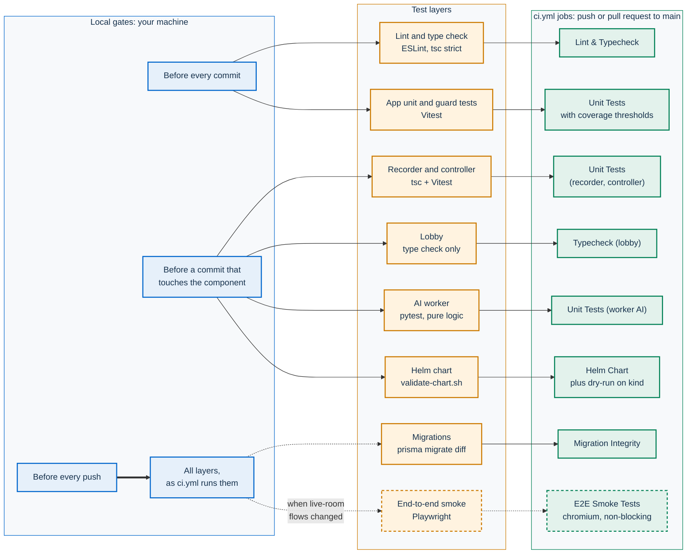
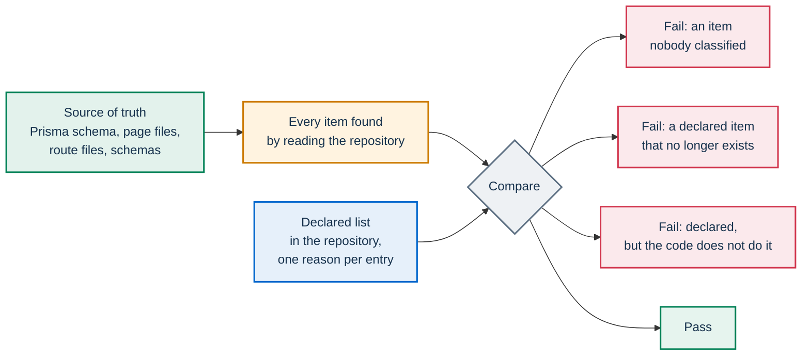

# Testing

This page covers every test layer in PA Webinar: what each one checks, how to run it, and which CI job runs it again. It lists the guard tests that turn project rules into failing tests, explains the coverage ratchet, and names what no automated test can check.

The process around these commands, such as when to run them, CI parity and code review, is in [How we develop PA Webinar](methodology.md).

Run every command from the repository root unless a row or block says otherwise.

## Test layers

| Layer | What it checks | Command | Needs | CI job in `ci.yml` |
|---|---|---|---|---|
| Lint and type check | ESLint rules and TypeScript `strict` for the `app` workspace | `npm run lint --workspace=app` and `npx tsc --noEmit --project app/tsconfig.json` | Nothing | **Lint & Typecheck** |
| App unit and guard tests | The Vitest suite under `app/src/` | `npm run test --workspace=app` (also `test:watch`, `test:coverage`) | Nothing: no database, Redis or Jitsi | **Unit Tests**, with the coverage thresholds |
| Recorder bot and recorder controller | Pure logic of `infra/recorder` and `infra/recorder-controller` | In each folder: `npm ci`, then `npx tsc --noEmit -p tsconfig.json && npm test` | Each folder's own dependencies | **Unit Tests (recorder, controller)** |
| Lobby | Type check of the Phaser square | `npm run lobby:typecheck` | Nothing | **Typecheck (lobby)** |
| AI worker | Pure logic of the post-production worker | In `infra/ai/worker/`: `pip install -r requirements-test.txt`, then `python -m pytest -q` | Python. No GPU, no models | **Unit Tests (worker AI)** |
| Helm chart | The chart renders on every profile and meets the installation invariants | `./scripts/validate-chart.sh` | Helm, `python3` with PyYAML, `openssl`, the subcharts | **Helm Chart**, plus a server-side dry run on kind |
| Migration integrity | Migrations apply to an empty database and match `schema.prisma` | `prisma migrate deploy`, then `prisma migrate diff --exit-code`, against a throwaway database | A disposable PostgreSQL | **Migration Integrity** |
| End-to-end smoke | The browser path from registration to the waiting room, and the CSS color repair in the production build | In `app/`: `npx playwright test --project=chromium` | The running Docker Compose stack | **E2E Smoke Tests**: chromium only, non-blocking |
| Patched `jitsi/web` bundle | Each bundle patch matches exactly one place in the upstream bundle, and the CSS rule's target selector still exists | `docker build infra/jitsi-web-patched` | Docker | Not in `ci.yml`: `jitsi-web.yml` |
| Installation check | A running installation, from outside and from its cluster; with `--call`, a real call between two headless participants | `scripts/verify-install.sh` (`--help` lists the options) | A running installation and `kubectl` access to it (`--no-cluster` for the outside checks only); Node.js and Playwright for `--call` | None |
| Load tests | Bridge and portal capacity | See [Load testing](../LOAD-TESTING.md) | A test installation | None |

### Where each test runs

Each layer in the diagram runs twice: once on your machine as a local gate, and again as a CI job. The dashed layer is the non-blocking one. The patched bundle, the installation check and the load tests are outside `ci.yml` and are left out.



- `ci.yml` runs automatically only on pushes and pull requests to `main`. It can also be dispatched by hand on any branch, `dev` included. On `dev`, apart from the patched-bundle checks in `jitsi-web.yml`, the local gates are the only tests that run. The gates are in [Local gates](methodology.md#local-gates-before-every-commit) and the parity table in [CI parity](methodology.md#ci-parity-before-every-push).
- `dev.yml` builds the `:dev` images and runs no test.
- `release.yml` builds and publishes on any `v*` tag push. It does not wait for `ci.yml` and runs no test. A tag is safe only when the tagged commit on `main` has already passed `ci.yml`; see the release procedure in [CI, images and releases](ci-and-release.md#cutting-a-release).
- **Security Scan**, **License Compliance** and **Docker Build & Scan** are CI gates but not tests. CodeQL and OpenSSF Scorecard are non-blocking analyses. See [SECURITY.md](../../SECURITY.md) and [CI, images and releases](ci-and-release.md).

## Layer by layer

### Unit tests (Vitest)

Test files sit next to the code they test, as `<module>.test.ts` or `<component>.test.tsx` under `app/src/`. [`app/vitest.config.ts`](../../app/vitest.config.ts) sets up the suite:

- it collects `src/**/*.{test,spec}.{ts,tsx}`;
- it runs them in jsdom with Vitest globals;
- it loads `app/src/test/setup.ts`, which adds the jest-dom matchers;
- it resolves the `@/` alias to `app/src/`.

```bash
npm run test --workspace=app                    # the whole suite, once
npm run test:watch --workspace=app              # re-run on every change
npm run test:coverage --workspace=app           # with coverage and its thresholds
npm run test --workspace=app -- src/lib/events/lifecycle.test.ts   # one file, path relative to app/
npm run test --workspace=app -- -t "<test name pattern>"
```

At the repository root, `npm test` runs the same suite: the root script only delegates to the `app` workspace. It does not reach the recorder, the controller, the lobby or the worker.

The suite needs no running service. Tests that touch data mock the Prisma client with `vi.mock('@/lib/db', ...)`, declaring only the delegates the code under test calls. Storage, email and other I/O modules are mocked the same way. The suite passes with an unreachable `DATABASE_URL`. The CI job still starts a PostgreSQL service, which the tests do not use.

Most tests cover `app/src/lib/` and route handlers. A route test sits next to its `route.ts`, imports the exported handler (`GET`, `POST`, and so on) and calls it directly. React components have almost no unit tests. The end-to-end smoke tests and manual checks exercise them.

### End-to-end tests (Playwright)

The specs are in `app/e2e/` and the configuration in [`app/playwright.config.ts`](../../app/playwright.config.ts). There are two projects: `chromium` (desktop Chrome) and `mobile-chrome` (a Pixel 5 profile). `npm run test:e2e --workspace=app` runs both, `npm run test:e2e:ui --workspace=app` opens the interactive runner, and CI runs `chromium` only.

What the specs cover:

- **`live-flow.spec.ts`, first group.** The spec signs in as administrator through the API, creates an event, publishes it, registers a participant and sets the event `LIVE`. It then checks that:
  - the moderator link and the registrant's link both reach the waiting room with **Enter now**;
  - the waiting room shows the event title;
  - a guest without a token on a `LIVE` event gets the guest name field.
- **`live-flow.spec.ts`, second group.** The event starts within the waiting-room lead time (`waitingRoomLeadMinutes` in `SiteSetting`). The spec registers through the registration form and checks that:
  - the registration redirects into the waiting room;
  - a duplicate registration shows the already-registered message with its resend button;
  - returning to the live URL without the token still works, through the signed per-event cookie.
- **`design-system.spec.ts`.** The institutional header strip must have a solid background in the served stylesheet. This proves that the CSS color repair (`app/src/lib/css/repair-percent-colors.ts`) is still wired into the production build. The spec skips itself when the stylesheet is not minified, as in a development build.

Each group deletes its event when it finishes. No spec joins a Jitsi conference: the suite stops at the waiting room.

The browser runs with the `it-IT` locale. The specs open Italian URLs (`/it/eventi/…`) and match Italian labels, such as "Entra ora" for **Enter now**. If you change one of those strings in `app/src/i18n/messages/it.json` or one of those paths in `app/src/i18n/routing.ts`, update the spec in the same change.

To run the suite against the local stack:

```bash
docker compose up --build -d --wait
docker compose --profile setup run --rm db-migrate   # migrations and seed data
cd app
npx playwright install chromium                      # first run only
npx playwright test --project=chromium
```

- `E2E_BASE_URL` points the suite at another address. The default is `http://localhost:3000`.
- `ADMIN_API_KEY` must match the app's instance API key. The spec's default is the development key set in `docker-compose.yml`.
- When the `CI` variable is not set, Playwright reuses a server already listening on the base URL, or starts `npm run dev` if none is. A development server serves unminified CSS, so the stylesheet spec skips.
- When `CI` is set, Playwright starts no server, retries a failed test twice on a single worker, and fails the run on a leftover `test.only`.
- The HTML report is written to `app/playwright-report/`. A trace is recorded on the first retry.

In CI, the **E2E Smoke Tests** job runs after **Lint & Typecheck** and **Unit Tests**. It:

1. starts the whole Compose stack, which builds the production image of the app;
2. runs `db-migrate`;
3. waits for `/api/health`;
4. runs the `chromium` project;
5. uploads the report as an artifact.

The job is `continue-on-error`, because the stack pulls several images from Docker Hub and a pull rate limit is not a regression. A red E2E run therefore does not block a merge. Read its report instead of assuming the failure is infrastructure.

### Recorder bot and controller

`infra/recorder` is the headless-Chrome bot. `infra/recorder-controller` is the reconciling controller that starts it. They are standalone npm packages with their own lockfiles, outside the npm workspaces, so run `npm ci` in each folder before its first test run.

The tests cover pure logic:

- in the bot: claims, storage paths, manifests, uploads, retries, and the bot's login identity on the hidden domain;
- in the controller: the reconcile plan and the runner helpers.

`infra/recorder/src/capture.ts` needs a real conference. It has no unit tests and is excluded from the bot's coverage configuration. Neither package has a coverage floor.

### Lobby

`npm run lobby:typecheck` runs `tsc --noEmit` with the strict options of `lobby/tsconfig.json`. It checks the library source, the development harness and the Vite configuration. The lobby has no unit tests. On the app side, the presence and schedule adapters in `app/src/lib/lobby/` are unit-tested with the rest of the app. The canvas itself is checked by hand; see [The square](#the-square).

### AI worker

`requirements-test.txt` installs pytest plus the few light libraries that the worker modules import at the top level. Heavy libraries such as torch and WhisperX are imported inside functions, so the tests need no CUDA, no GPU and no model download. They cover pure logic: aligning each per-participant track to the composite recording (including silent tracks), merging per-track transcripts onto one timeline, WebVTT output and speaker labels, archive packaging, the language-model client (summary shape, batched translation), and the speech-synthesis voice and transcription/diarization helpers.

Run the suite from `infra/ai/worker/`. `conftest.py` puts that folder on `sys.path`, so `pytest -q`, which is what CI runs, and `python -m pytest -q` behave the same way.

### Helm chart

[`scripts/validate-chart.sh`](../../scripts/validate-chart.sh) runs `helm lint`. It then renders the chart several times:

- with the default values;
- with the `simple`, `standard` and `full` example profiles in `infra/helm/pa-webinar/examples/`;
- with the production and development values files;
- with variants that turn on the NetworkPolicy, use a Traefik ingress class, take secrets from an external store (`secrets.mode=external`), and use an external Jitsi (`jitsi.enabled=false`).

Each rendering gets generated secrets of the right shape. The script checks every rendering for the invariants whose violation breaks an installation or leaves it half done. Among them:

- Ingress paths are absolute;
- no image reference is empty;
- in `generate` mode, the app Secret carries the keys the app needs, and each datastore mounts a Secret that exists and holds its password;
- `DATABASE_URL` and `REDIS_URL` point to a Service the chart renders;
- an Ingress's `ingressClassName` matches its `kubernetes.io/ingress.class` annotation, and an Ingress for a controller other than ingress-nginx carries no ingress-nginx annotations;
- the chart's NetworkPolicy selects the app Deployment and nothing else, and admits every CronJob and Jibri on port 3000;
- the JVB scaler's `JVB_DEPLOY` names a Deployment the chart renders, and `JVB_HEALTH_URL` points to a rendered Service;
- Bitnami images are pinned by digest;
- resource names fit in 63 characters.

The script itself is the authoritative list.

The script needs Helm, `python3` with PyYAML, `openssl` and the subcharts. The subcharts are not in the repository. If they are missing, the script stops and prints the `helm repo add` and `helm dependency build` commands.

CI adds a second step, because some rules are known only to the Kubernetes API server. It renders the `simple`, `standard` and `full` examples with the Prometheus Operator resources turned off, and applies them to a throwaway kind cluster with `kubectl apply --dry-run=server`. Without a local cluster, skip that step and say so.

### Migration integrity

CI applies every migration to an empty PostgreSQL with `prisma migrate deploy`. It then runs `prisma migrate diff --from-migrations app/prisma/migrations --to-schema-datamodel app/prisma/schema.prisma --shadow-database-url <database> --exit-code`, which fails when `schema.prisma` holds a change that no migration expresses.

The local procedure with a throwaway database is in [How we develop PA Webinar](methodology.md#ci-parity-before-every-push). Prisma resets the shadow database, so never point it at a database whose contents you want to keep.

### Patched `jitsi/web` bundle

`infra/jitsi-web-patched/` patches the upstream bundle by shape, not by minified identifier. `docker build infra/jitsi-web-patched` fails unless each bundle patch matches exactly one place in the upstream bundle and the CSS rule's target selector still exists.

`jitsi-web.yml` repeats these checks on the exact image it pushes, on `dev` pushes that touch the folder and on manual dispatch; see [CI, images and releases](ci-and-release.md#jitsi-webyml-the-patched-jitsi-web-image).

What each patch fixes, and how to build and bump the image, are in [Patched jitsi/web image](../../infra/jitsi-web-patched/README.md) and [ADR-017](../adr/017-patched-jitsi-web-image.md).

### Installation check

`scripts/verify-install.sh` checks a running Helm installation on any platform and exits non-zero when a check fails. From outside, it tests the portal (`/api/health`, `/api/ready`, component status), the conference `config.js`, the HTTP to HTTPS redirect, and certificate validity and days to expiry for both host names. From the cluster, it checks that the release's pods are ready, that the app and migration images match, the last successful run of each scheduled job, overdue and failed emails, and the free space on the database volume. It changes nothing, so it can also run from cron with `--quiet`, which prints only warnings and errors.

With `--call`, two headless browsers join a throwaway instant call and check that audio and video reach both of them; the call is deleted at the end. This needs Node.js, the root `npm ci` (for Playwright) and a Chromium (`npx playwright install chromium`, or `--browser <path>`).

The administrator key comes from a secrets file or standard input (`--secrets-file`), or from the release's Secret (`--keys-from-cluster`), never from the command line. Every sign-in with the key is recorded in the administrator audit log.

The script is not a feature test: feature behavior is covered by the route tests and the end-to-end suite above.

### Load tests

Load tests are not a gate:

- the method and the reference measurements are in [Load testing](../LOAD-TESTING.md);
- the toolkit is described in [`scripts/load-test/README.md`](../../scripts/load-test/README.md);
- in-cluster runs with Selenium Grid are in [`scripts/load-test/SELENIUM-GRID.md`](../../scripts/load-test/SELENIUM-GRID.md).

Pause the JVB scaler before a run, as described in [Pausing for maintenance or load tests](../operations/jvb-scaler.md#pausing-for-maintenance-or-load-tests).

## Guard tests that encode rules

Some tests do not exercise a function. They read the repository, including source files, the Prisma schema and the message catalogs, and fail when a project rule is broken. Most follow one pattern: they enumerate every item from the source of truth and compare it with a list declared in the repository, where each entry carries its reason.



All of the tests below run in the app unit suite.

| Guard | Rule it encodes | When it fails |
|---|---|---|
| `app/src/i18n/locale-parity.test.ts` | Exactly 24 catalogs exist. Every key of `it.json` exists in every catalog, is not empty, and uses the same ICU argument names. `chat-keys.test.ts` next to it checks the chat keys specifically. | Add the key to every catalog. See [The parity test](../architecture/i18n.md#the-parity-test). |
| `app/src/lib/utils/localized-url.test.ts` | Every `page.tsx` under `app/src/app/[locale]/` is declared in the `pathnames` map of `app/src/i18n/routing.ts`. Every administration page has a breadcrumb label in `app/src/components/admin/admin-breadcrumb.tsx`. | Add the map entry and the label. See [Every page must be declared](../architecture/i18n.md#every-page-must-be-declared). |
| `app/src/i18n/localized-paths-guard.test.ts` | No source file builds a localized address by hand with a `/${locale}/…` template: the English segment would reach the languages that translate it. Addresses come from the router's map, through `percorso()` in links and `localizedPath()` or `localizedUrl()` elsewhere. | Replace the template with the helper. See [Building links](../architecture/i18n.md#building-links). |
| `app/src/lib/auth/staff-access.test.ts` | Every administration API route calls an admin guard or a staff guard, except the listed login, logout and refresh routes. The routes open to organizers equal the allowlist in the test, each with its reason. Every administration page declares its audience. | Choose the guard on purpose. To open a route to organizers, add it to the allowlist with a reason. See [The guard test](../architecture/identity-and-access.md#the-guard-test). |
| `app/src/lib/gdpr/cleanup-coverage.test.ts` | `app/src/lib/gdpr/cleanup-coverage.ts` classifies every Prisma model with an `eventId` column as purged or kept, with a reason. No model is in both lists or missing from the schema. Every purged model is referenced in the cleanup route's transaction (`tx.<model>.…`), and every classification carries a reason. | Classify the model. If it is purged, delete it in the transaction in `app/src/app/api/cron/cleanup/route.ts` and cover it in that route's test. See [Privacy and data protection](../GDPR.md). |
| `app/src/lib/live-state/publish.test.ts` | No envelope published on the live channel carries a per-user or role-dependent field. | Publish a reload notice instead of a snapshot. See [Snapshot or reload](../architecture/live-interaction.md#snapshot-or-reload). |
| `app/src/content/changelog/changelog.test.ts` | The release-note translations cover every language the site ships. Every release has a title and notes in each language, with as many notes as the Italian text. Versions are unique, listed newest first, with ISO dates. `CHANGELOG.md` has a heading for every release and carries the English text. | Complete the translations, then run `npm run changelog:md`. See [Release notes in 24 languages](../architecture/i18n.md#release-notes-in-24-languages) and the [release procedure](ci-and-release.md). |
| `app/src/lib/events/create-fields.test.ts` | Every field the event schema (`eventBaseSchema`) accepts is either written by the create route or declared as not persisted, with a reason. The test reads the route's `prisma.event.create` block. | Write the field in `app/src/app/api/events/route.ts`, or classify it in `app/src/lib/events/create-fields.ts`. |
| `app/src/lib/events/duplicate-fields.test.ts` and `duplicate-relations.test.ts` | Event duplication classifies every scalar column and every relation of `Event` as copied or not copied. The relations it copies are actually loaded and rebuilt. | Classify the column or relation in `duplicate-fields.ts` or `duplicate-relations.ts`. |
| `app/src/lib/settings/public-projection.test.ts` | Every `SiteSetting` column is classified as public or withheld, with no overlap and no stale entry. This matters because `GET /api/admin/settings` serves the public projection to anonymous callers with a public cache header. | Classify the column in `app/src/lib/settings/public-projection.ts`. Withhold anything an anonymous visitor does not need. |
| `app/src/lib/jitsi/rnnoise.test.ts` and `whiteboard.test.ts` | No source file reads `NEXT_PUBLIC_JITSI_RNNOISE_ENFORCE` or `NEXT_PUBLIC_WHITEBOARD_ENABLED` with dotted `process.env`, because the build would freeze the value into the image. The live page reads each flag at runtime with `getPublicEnv()` and passes it through every mount. | Read public variables with `getPublicEnv()` from `app/src/lib/env.ts`. See [Configuration reference](../CONFIGURATION.md). |
| `app/src/app/api/assets/[...path]/route.test.ts` | The public asset route does not import the database client, so serving a logo or an Open Graph image never costs a query. | Keep database access out of that route. |

Other rules are enforced outside the unit suite:

- **Lint.** On top of the Next.js presets, `app/eslint.config.mjs` makes these rules errors:
  - importing `Icon` from design-react-kit (`no-restricted-imports`);
  - `any` (`@typescript-eslint/no-explicit-any`);
  - unused variables and arguments (`@typescript-eslint/no-unused-vars`; names starting with `_` are exempt);
  - type-only imports written as value imports.

  `no-console`, the project rule `local/no-console-with-pii` (in `app/eslint-rules/`) and `import/order` are warnings. Warnings do not fail the gate.
- **Chart invariants.** `scripts/validate-chart.sh`, described in [Helm chart](#helm-chart).
- **Patched bundle shape.** The shape assertions of `infra/jitsi-web-patched/`, described in [Patched jitsi/web bundle](#patched-jitsiweb-bundle).
- **Build wiring of the CSS repair.** `app/e2e/design-system.spec.ts`, described in [End-to-end tests](#end-to-end-tests-playwright).

When a guard fails, the fix is almost never to edit the guard. Add the missing declaration with its reason, or fix the code. Changing a guard's list, for example to open a route to organizers or to keep a table out of the cleanup, is a decision the reviewer must see. State it in the commit body.

A guard catches only what it encodes:

- The parity test accepts English filler copied into another catalog.
- The cleanup guard sees only models with an `eventId` column. A new model that holds participants' personal data without that column must be added to the cleanup by hand.
- The staff-access test looks for guard calls in the source. It does not prove that the ownership check inside a route is right.

When you add a rule that can be checked mechanically, add its guard in the same change.

## Coverage

`npm run test:coverage --workspace=app` measures coverage with the V8 provider over `app/src/**/*.{ts,tsx}`. It excludes `app/src/test/`, `app/src/types/` and declaration files. It prints a text summary and writes JSON and HTML reports to `app/coverage/`.

The thresholds for lines, functions, branches and statements are in [`app/vitest.config.ts`](../../app/vitest.config.ts). They are a ratchet: a floor just below the measured value, raised when coverage rises and never lowered to let a change pass. The policy is in [The coverage ratchet](methodology.md#the-coverage-ratchet). Read the numbers from the file, and never quote them in documentation, pull requests or commit messages.

Only `test:coverage` enforces the thresholds, and it is what the **Unit Tests** job runs. `npm run test` runs the same suite without them, so run `test:coverage` before a push. The recorder, the controller and the worker have no coverage floor, and the lobby is only type-checked.

Coverage cannot tell you whether a change is safe. Line coverage of the app is low because most of the interface has no unit tests. A green run proves that the tested behavior still holds, and nothing more. What to check beyond it is in [Regression discipline](methodology.md#regression-discipline).

## Writing testable code

- **Put the decision in a pure function, and keep I/O at the edges.** For example:
  - `infra/recorder-controller/src/reconcile.ts` takes the recorders the portal wants and the Jobs that exist, and returns an idempotent plan. The Kubernetes, Docker and HTTP code around it are thin wrappers.
  - `app/src/lib/events/lifecycle.ts` holds the grace and overtime decisions, taken out of the scaler route and the event update handler.
  - `app/src/lib/jvb-sizing.ts` is the single source of the bridge replica formula.
  - `app/src/lib/events/panel-read-access.ts` is the one read rule the live-panel routes share.
- **Pass time in.** The lifecycle functions receive `now` instead of calling `new Date()`. For debounces and timers, use `vi.useFakeTimers()`, as `app/src/lib/live-state/publish.test.ts` does.
- **Mock at the module boundary.** Mock `@/lib/db`, storage and the email outbox with `vi.mock`, declaring only the delegates the code calls. In a route test, import the handler and call it. Then assert on its status, its body, and the writes or deletes it makes.
- **Test the contract, not the implementation.** Assert what callers depend on: the status code and response shape, who may call, what is written or deleted, and what goes on a channel. Assert call order only when the order is itself the contract.
- **Test the paths that already worked.** When you change a shared contract, add tests for the paths that must keep working: a guest as well as a registrant, a speaker as well as a moderator, an organizer as well as an administrator. This protects the paths nobody re-checks.
- **Make rules checkable.** If a rule can be verified by reading the repository, write it as a guard test in the same change, following the pattern above.
- **Name the failure.** The test's title or a comment says what breaks for a person if the test fails. A reader can then tell a regression from an outdated expectation.

Recipes for each kind of change are in [Extending PA Webinar](extending.md).

## What automated tests cannot check

### Real audio and media

Headless browsers use fake devices, and no test joins a conference. The following need a real call on real devices:

- **The media path**: ICE, the TURN relay, reaching the bridge, and reconnection.
- **Microphones and noise suppression.** The patched `jitsi/web` build proves only that the patch applied. Whether a microphone that runs at a sample rate other than 48 kHz stays audible with noise suppression on needs such a device.
- **What the recorder bot captures.** `infra/recorder/src/capture.ts` has no unit tests. After a recording, the silence guard (`app/src/lib/ai/track-silence.ts`) catches the case where every track sits at the digital-silence floor, and the manifest endpoint then skips transcription. The guard catches a failed capture. It cannot prove that capture works. Check capture as in [Check that the recorder works](../operations/recording-setup.md#check-that-the-recorder-works).
- **Composite recording with Jibri.** See [Check that Jibri works](../operations/recording-setup.md#check-that-jibri-works).
- **The JVB scaler acting on a real cluster.** See [Validating a tick](../operations/jvb-scaler.md#validating-a-tick).

### The square

No automated test covers the Phaser canvas: rendering, movement, avatars, and walking in through the gate. CI only type-checks the lobby. Check a change in the development harness:

```bash
npm run lobby:dev        # serves the harness on http://localhost:5180
```

The harness uses mock presence, conference, schedule and device adapters. `?embed=1` reproduces how the square runs inside the portal: the internal controls are off, and walking to the open gate is the way in. [`lobby/README.md`](../../lobby/README.md) describes the other query parameters and the console helpers.

Check keyboard use and the text alternatives against the [accessibility contract](../architecture/waiting-room.md#accessibility-contract).

### Other areas without automated tests

- **Visual rendering with the .italia design system**, including contrast on the light theme and keyboard navigation. Check these in the browser.
- **The Content Security Policy.** Follow the manual plan in [Testing CSP changes](../SECURITY-CSP.md#testing-csp-changes).
- **Email content and delivery.** In the local stack, Mailpit captures every message. The Compose `cron` service must be running, or nothing is sent. See [Local development](../DEVELOPMENT.md).
- **Capacity.** See [Load testing](../LOAD-TESTING.md).

### Manual checklist for live-room changes

When a change touches the waiting room or the live room, run the end-to-end suite first. Then check the following in the local stack. Locally, the conference uses a self-signed certificate that the browser must accept first; see [Local development](../DEVELOPMENT.md).

1. Open the event with its moderator link in one browser, and with a registrant's link in another. A private window is enough. Both reach the waiting room, and **Enter now** takes each of them into the room.
2. Turn on the microphone and camera on both sides, and check that each side sees and hears the other. Share a screen from the moderator side.
3. From the moderator side, toggle each live feature your change touches. Check that the participant sees the change without reloading.
4. As moderator, leave with **Just leave** and rejoin. Then choose **End for everyone** and check what the participant sees.
5. Repeat on a phone-sized screen, or run the `mobile-chrome` Playwright project.
6. If the change touches recording, hold a short call in which at least two people speak. Check the result as in [Setting up recording](../operations/recording-setup.md).

### AI post-production: never power up a GPU in a test

No automated test starts a GPU node or a model server, or loads a model, and none may:

- The worker suite runs on a CPU-only runner with `requirements-test.txt`.
- The portal side of the pipeline is unit-tested in `app/src/lib/ai/`. This covers idempotency, storage paths, schemas, the provider policy, speaker alignment, reliability scoring, silence detection and transcript formatting.

To validate a change to GPU-bound code:

1. Review it.
2. Move the logic you changed into a function that the pure tests can reach, and test it there.
3. Exercise the parts of the pipeline that need no GPU.
4. If it needs a real run, use the off-cluster tool in [`infra/ai/local-out/`](../../infra/ai/local-out/README.md) on a workstation GPU. Read its warnings first.

Do not scale up an installation's GPU node pool or model server to test a change. They are the most expensive resources in the platform, and they are designed to stay at zero when no job needs them. The pipeline is described in [AI post-production](../POSTPROD.md).

## Related pages

- [How we develop PA Webinar](methodology.md): gates, CI parity, code review and regression discipline
- [CI, images and releases](ci-and-release.md): workflows, image tags and the release procedure
- [Extending PA Webinar](extending.md): code conventions and change recipes
- [Local development](../DEVELOPMENT.md): the local stack and its troubleshooting
- [Load testing](../LOAD-TESTING.md): method and reference measurements
- [CONTRIBUTING.md](../../CONTRIBUTING.md): how to propose a change
