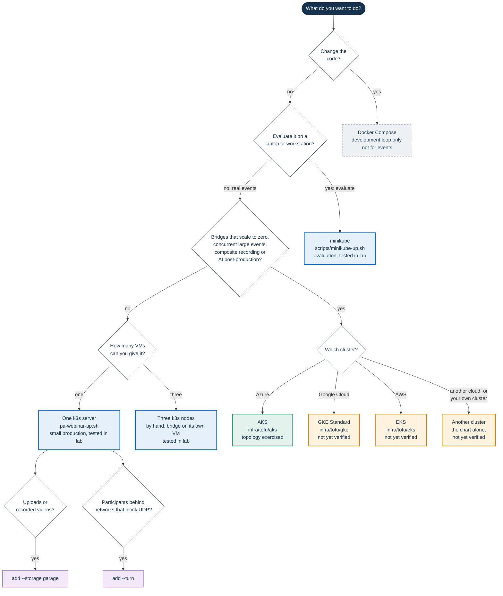

# Installing PA Webinar

PA Webinar is Kubernetes-native. One Helm chart, `infra/helm/pa-webinar`,
installs it everywhere, and the same chart runs on a laptop and in
production: only the values files layered on it change. Scheduled work runs
as Kubernetes CronJobs. In the standard and full profiles a
HorizontalPodAutoscaler scales the portal, and in the full profile a CronJob
also scales the bridges through the Kubernetes API.

- **To evaluate it, or to work on the chart, use minikube.**
  `scripts/minikube-up.sh` installs the chart on one workstation with one
  command. It is the same chart as in production: the simple profile plus an
  overlay for a small node.
- **For a small production on your own server, use k3s.**
  `infra/onprem/k3s/pa-webinar-up.sh` installs k3s and the chart on one
  server with one command, from your workstation.
- **Docker Compose is the loop for changing the code**, nothing more. It
  serves the portal over plain HTTP, keeps placeholder secrets in the tracked
  `docker-compose.yml`, runs only some of the scheduled jobs, and has no
  object storage, no TURN and no resource limits. It is not a smaller copy of
  the chart. Use it to develop ([Local development](../DEVELOPMENT.md)), not
  to judge an installation or to serve events.

This page is the starting point for the IT staff of a public administration
(PA). It states what each platform is supported for, shows the stack at a
glance, helps you choose a platform against your constraints, gives the
measured requirements, explains in short how the platform scales, and states
the known limitations. The procedures live in the pages it links, the
checklists in [Checklists](checklists.md), and the Helm values in
[Deploying with Helm](../DEPLOYMENT.md) and the
[Configuration reference](../CONFIGURATION.md). The terms are defined in the
[Glossary](../GLOSSARY.md), and how the parts fit together in
[Architecture](../ARCHITECTURE.md).

On this page:

- [Support levels](#support-levels)
- [The stack at a glance](#the-stack-at-a-glance)
- [Choose a platform](#choose-a-platform)
- [Constraints by platform](#constraints-by-platform)
- [Evaluate on minikube](#evaluate-on-minikube)
- [Checklists](#checklists)
- [Requirements](#requirements)
- [How scaling works](#how-scaling-works)
- [Known limitations](#known-limitations)
- [Getting help](#getting-help)
- [Where to go next](#where-to-go-next)

## Support levels

Two things describe each platform: what the project supports it for, and
how far it has been proven. The proof uses three statuses, across the
installation guides and the [Infrastructure reference](../INFRASTRUCTURE.md):

- **Exercised**: runs real events.
- **Tested in lab**: installed from scratch on lab machines and loaded with
  synthetic participants.
- **Not yet verified**: validated without a real cloud account (OpenTofu
  validation and tests with mocked providers, security scan of the
  configuration, `helm template`), and never installed.

| Platform | Supported for | Limits | Status |
|---|---|---|---|
| minikube on a workstation | Evaluation and development. Not for events | Browsers on the same workstation only. Secrets rendered by the chart (`generate` mode) | Tested in lab |
| One k3s server | **Small production** | No high availability: the server is a single point of failure. Capacity as in [Requirements](#requirements), about 20 participants on camera on 4 vCPU and 8 GiB, one bridge. Uploads and recorded videos only with object storage (`--storage garage`, or an S3 service of yours); no Jibri composite recording | Tested in lab |
| Three k3s nodes | Small production, installed by hand | The same, with the bridge on its own node. Still not highly available | Tested in lab |
| AKS | Production, with bridges that scale to zero | The OpenTofu module has not been applied to a subscription | Exercised: the topology runs real events |
| GKE, EKS | Production, with bridges that scale to zero | Nothing has run on Google Cloud or AWS | Not yet verified |
| Any other conformant cluster | The chart alone | Node pools, UDP exposure and ingress are yours to adapt. OpenShift is not covered | Not yet verified |

Production means `existing` secrets mode everywhere: the Secrets are created
outside Helm, by you or by the k3s installer, and no secret value is kept in
the Helm release record. The chart's `generate` mode is for evaluation only
([Secret modes](../DEPLOYMENT.md#secret-modes)).

## The stack at a glance

One installation runs these components. The names of objects assume the
release and namespace `pa-webinar`.

| Component | Role | Image | Ports: external / internal | State | Scaling | Turned on by | When it is down |
|---|---|---|---|---|---|---|---|
| Ingress controller | Ends TLS and routes by name to the portal and the conference; on k3s also to the object store and to TURN over TLS | Traefik bundled with k3s; ingress-nginx on the other platforms | 443/TCP, 80/TCP (redirect only) / – | None; with `--tls acme` on k3s, the certificates on a volume in `kube-system` | The platform's | The platform | No page loads, and calls in progress lose their signaling |
| Portal (`pa-webinar`) | Pages, API, live-room streams, conference tokens | `ghcr.io/italia/pa-webinar:X.Y.Z`, or `pa-webinar:local-<commit>` when built locally | Through the ingress / 3000/TCP | None | One replica in the simple profile; HPA in standard and full | Always | No pages, registrations or new joins. Conferences in progress continue |
| Database migrations | `prisma migrate deploy` before each portal pod starts | `…:vX.Y.Z-migrate` | – | – | One run per portal pod | Always (init container `db-migrate`) | New portal pods stay in `Init` |
| Scheduled jobs | Email outbox, reminders, event lifecycle, GDPR cleanup, retention, recording reconciliation | `curlimages/curl` | – / they call the portal on 3000 | None | CronJobs | `cronjobs.<name>.enabled` | Emails wait, events do not open or close by themselves, retention is not applied |
| PostgreSQL | All durable state | Bitnami PostgreSQL, pinned by digest | – / 5432/TCP | Volume `data-pa-webinar-postgresql-0`, 5 GiB | One, grows vertically | `postgresql.enabled`; off means an external database in `DATABASE_URL` | The portal answers `503`, and nothing is written |
| Redis | Live-room fan-out, the bridges' snapshot, presence in the square | Bitnami Redis, pinned by digest | – / 6379/TCP | None: no persistence | One, grows vertically | `redis.enabled` | Live-room updates stop being pushed. It holds no durable data |
| Jitsi web | The conference's web front end; carries the signaling (BOSH, WebSocket) to Prosody | `jitsi/web` at the subchart's Jitsi release, or the patched `pa-webinar-jitsi-web` | Through the ingress, on the conference host / 80/TCP | None | One | `jitsi.enabled` | Nobody can enter a room, and calls in progress lose their signaling. Every upgrade restarts it |
| Prosody | XMPP signaling; checks the portal's tokens and the room roles | `jitsi/prosody` | – / 5222/TCP (XMPP), 5280/TCP (BOSH, WebSocket) | None | One, fixed by the subchart | `jitsi.enabled` | Every conference stops |
| Jicofo | Conference focus: places each conference on a bridge | `jitsi/jicofo` | – / 8888/TCP (health) | None | One, fixed by the subchart | `jitsi.enabled` | No conference can start or take new participants |
| Jitsi Videobridge (JVB) | Forwards audio and video between participants | `jitsi/jvb` | 10000/UDP on the node's address / 8080/TCP (health, statistics) | None | A fixed count (`jitsi-meet.jvb.replicaCount`, one in simple); from zero by the scaler in full | `jitsi.enabled` | All audio and video stop |
| coturn (optional) | Relays media for participants whose networks block UDP | `coturn/coturn` | 3478/UDP and TURN over TLS on 443/TCP: on its own address on managed clusters, on the ingress's 443 on k3s / 3478/TCP | None | One (two on AKS) | `jitsi-meet.coturn.enabled`; `--turn` on k3s | Participants behind networks that block UDP get no media; the others are unaffected |
| Object storage (optional) | Uploads, materials, uploaded and recorded videos, AI outputs | Garage on k3s (`--storage garage`); Azure Blob or an S3-compatible service elsewhere | Through the ingress on `s3.<portal>` on k3s / 3900/TCP (Garage) | On k3s the volume `pa-webinar-garage-data`, 50 GiB | One on k3s | The storage settings ([Object storage](../configuration/storage.md)); without them the portal hides uploads | Uploads and video playback fail; live events are unaffected |
| Database backup (optional) | A nightly `pg_dump` into a volume | The PostgreSQL image | – | Volume `pa-webinar-backup`, 10 GiB, kept by `helm uninstall` | A CronJob | `backup.enabled`; `--backup` on k3s | No new dump |
| Jibri (optional) | Composite MP4 recording | `jitsi/jibri` | – / 2222/TCP (health) | None | One per concurrent recording | `jitsi-meet.jibri.enabled` (standard, full) | Composite recording fails |
| Recorder bot and controller (optional) | Per-participant audio tracks | `pa-webinar-recorder`, `pa-webinar-recorder-controller` | – | None | One bot per recorded event | `recorder.enabled` | No per-participant tracks |
| JVB scaler (optional) | Starts and stops bridges from the event calendar, and moves events through their statuses | Bitnami kubectl | – | None | A CronJob | `jvbScaler.enabled` (full) | Bridges stay at their current count, and events do not open or close by themselves |
| AI post-production (optional) | Transcripts, subtitles, summaries, translations, dubbing | `pa-webinar-postprod-worker`, and a vLLM server you deploy | – | The models' cache | Jobs on a GPU pool that scales to zero | `postprod.enabled` | Post-event outputs wait in the queue |
| Mailpit (evaluation) | A test mailbox that keeps every email | `axllent/mailpit` | – / 1025/TCP (SMTP), 8025/TCP (web) | None | One | `minikube-up.sh`; `--mailpit` on k3s | – |

Images published by the project are under `ghcr.io/italia/`. The component
map, with what flows between the parts, is in
[Building blocks](../ARCHITECTURE.md#building-blocks), and every port with
the firewall rules in [Ports and firewall](../INFRASTRUCTURE.md#ports-and-firewall).
On k3s, the ports to open are in the one table of
[Ports and firewall](k3s.md#ports-and-firewall).

## Choose a platform



Green is exercised, blue tested in lab, orange not yet verified, purple an
option of the k3s installer, and the dashed grey box is for development
only. k3s has no node autoscaler and no Jibri layout, which is why the needs
of the third question lead to a managed cluster.

| Platform | Start here | What it gives you | Status |
|---|---|---|---|
| minikube on a workstation | [Try PA Webinar on minikube](minikube.md): `scripts/minikube-up.sh`, with `examples/values-minikube.yaml` | The whole chart in the simple profile, with a Mailpit test mailbox. Browsers on the same workstation only | Tested in lab |
| One k3s server | [Install with one command](k3s.md#install-with-one-command): `infra/onprem/k3s/pa-webinar-up.sh`, with `examples/values-k3s.yaml` | Occasional events of about 20 participants on camera: one bridge, PostgreSQL and Redis on the server; object storage and TURN as options; a nightly database dump | Tested in lab |
| Three k3s nodes | [Install on three nodes](k3s.md#install-on-three-nodes), by hand | The same, with the bridge's CPU kept away from the portal and the database. Not highly available | Tested in lab |
| AKS | [Installing on AKS](aks.md), with the module in `infra/tofu/aks` and `examples/values-aks.yaml` | Full profile: bridges that scale to zero, coturn, Azure Blob storage | The topology is exercised by the reference installation. The OpenTofu module itself is not yet verified: it has not been applied to a subscription |
| GKE | [Installing on GKE](gke.md), with the module in `infra/tofu/gke` and `examples/values-gke.yaml` | Full profile on GKE Standard. Autopilot is not supported | Not yet verified |
| EKS | [Installing on EKS](eks.md), with the module in `infra/tofu/eks` and `examples/values-eks.yaml` | Full profile, with AWS Load Balancer Controller and Cluster Autoscaler | Not yet verified |
| Any other conformant cluster | [Deploying with Helm](../DEPLOYMENT.md) and [Node pools and bridge exposure](../INFRASTRUCTURE.md#node-pools-and-bridge-exposure) | The chart and its profiles; node pools, UDP exposure and ingress are yours to adapt. OpenShift is not covered | Not yet verified |

The profiles (`simple`, `standard`, `full`) are example values files in
`infra/helm/pa-webinar/examples/`, not modes of the chart. They are compared
in [Profiles and values files](../DEPLOYMENT.md#profiles-and-values-files).

## Constraints by platform

Most of what decides an installation is the network and the services around
it. For each constraint, the setting or recipe that answers it on each
platform, and how far that answer is proven: **tested** (in lab, or
exercised on AKS), **untested** (documented, never run), or
**unsupported** (no answer on that platform).

| Constraint | minikube | One k3s server | Three k3s nodes | Managed clusters (AKS, GKE, EKS) |
|---|---|---|---|---|
| **No public address on the server, NAT in front** | Not applicable: browsers on the workstation only | `--public-ip <address>`, behind a 1:1 NAT that keeps UDP 10000. Untested | `jitsi-meet.jvb.publicIPs` in the site file. Untested | A fixed load-balancer address in `jitsi-meet.jvb.publicIPs` ([UDP load balancers](#udp-load-balancers)). Tested on AKS; untested on GKE and EKS |
| **Participants' networks block UDP** | Unsupported: no TURN | `--turn`: TURN on UDP 3478, TURN over TLS on the portal's 443. Tested | `addons/turn.sh` with its overlay, by hand. Untested | coturn on its own address ([TURN and coturn](#turn-and-coturn)). Tested on AKS; untested on GKE and EKS |
| **Corporate HTTP proxy for the servers** | Unsupported | `--proxy URL --no-proxy LIST`. Tested | `install-server.sh` and `install-agent.sh --proxy`. Tested on two nodes | Your cloud's egress, or a registry mirror. Untested |
| **No Internet at all (air gap)** | Unsupported | `--airgap-dir` and `--images archive`, prepared with `preload-images.sh fetch-k3s` and `build`. The archive import is tested; a first install on a server that never had a network is untested | The same archives on each node. Untested as a first install | A registry mirror. Untested |
| **Private certificate authority** | The script's own authority, `--trust-ca`. Tested | `--tls private-ca`, or `--tls own` with `--ca-file`. Tested | TLS Secrets and `app.extraCaCerts` ([The same, by hand](k3s.md#the-same-by-hand)). Untested | TLS Secrets and `app.extraCaCerts`. Untested |
| **No object storage service** | By design: uploads are hidden | `--storage garage`. Tested | `addons/storage.sh` by hand. Untested | Your provider's: Azure Blob, S3, Google Cloud Storage through its S3 API. Tested on AKS (Azure Blob); untested elsewhere |
| **No DNS API for DNS-01 validation** | Not needed: nip.io names | `--tls acme` validates on port 443 (TLS-ALPN-01), or `--tls own`. ACME tested against a test ACME server, not against Let's Encrypt | `install-server.sh --acme-email` and the resolver annotations. Untested | cert-manager with HTTP-01 (port 80 open), or your own certificates. cert-manager exercised on AKS |
| **Intranet only** | Not applicable | A private address, no `--public-ip`, and `--tls private-ca` or your internal certificates. Tested (lab network) | The same. Tested (lab network) | Internal load balancers. Untested |
| **Recordings needed** | Unsupported | Uploading and publishing videos with `--storage garage`: tested. Jibri composite recording: unsupported | The same by hand: untested. Jibri: unsupported | Jibri or the per-participant recorder, with object storage ([Setting up recording](../operations/recording-setup.md)). Untested in lab |

The pre-install checks for each constraint are in
[Pre-install checks by constraint](checklists.md#pre-install-checks-by-constraint).

## Evaluate on minikube

From a clone of the repository:

```bash
git clone https://github.com/italia/pa-webinar.git
cd pa-webinar
scripts/minikube-up.sh
```

The script starts a minikube profile named `pa-webinar` without changing your
current kubectl context, generates the secrets once outside the repository,
and installs the chart with the simple profile and
`examples/values-minikube.yaml`. Today ghcr.io refuses anonymous pulls, so
without registry credentials the script builds the two application images
from your checkout and loads them into the node. In the lab, a first install
took three to five minutes with Docker's build cache already warm; a first
build on a new machine takes longer.

The script also creates a certificate authority of its own, once, and signs
the portal's and the conference's certificates with it. `--trust-ca` adds it
to the browsers of the workstation (Chrome, Chromium and Edge on Linux).
Sign in with the instance key, and join from browsers on the same
workstation. Every step, the credentials for the published images, the
installation by hand, what the overlay changes, the measured usage and how to
stop or remove the profile are in [Try PA Webinar on minikube](minikube.md).

## Checklists

<a id="checklist-before-you-install"></a>The checklists live in one page,
[Checklists](checklists.md), each with the owner of each item where it
matters (IT, DPO, communications):

- [Pre-install checks by constraint](checklists.md#pre-install-checks-by-constraint)
  and [Services and accounts](checklists.md#services-and-accounts);
- [Workstation and server preflight](checklists.md#workstation-and-server-preflight);
- [Post-install verification](checklists.md#post-install-verification), with
  `scripts/verify-install.sh`;
- [Go-live](checklists.md#go-live);
- [Security hardening for one server](checklists.md#security-hardening-for-one-server);
- [Day-2 routine](checklists.md#day-2-routine);
- [Upgrade](checklists.md#upgrade), per platform;
- [Restore drill](checklists.md#restore-drill);
- [Secrets rotation](checklists.md#secrets-rotation);
- [Decommissioning](checklists.md#decommissioning).

The organizational checklist, from the license to the privacy notice, is the
[Adoption checklist](../REUSE.md#adoption-checklist) in Reusing PA Webinar.

## Requirements

Only measured figures are minimums. Where a size is derived rather than
measured, the table says so.

| Platform | Minimum that held | Recommended | What was measured |
|---|---|---|---|
| minikube (evaluation) | Node of 2 CPU, 3 GB of memory, 30 GB of disk | 4 CPU / 6 GB / 30 GB, the script's default; 4 CPU / 8 GB to try rooms of 40 | On 2 CPU / 3 GB, 20 participants on camera held at the limit: the node used 2.83–2.88 GiB of 3, bridge stress 0.73, no packet loss. On 4 CPU / 6 GB, 10 on camera used under half the node (2.52 GiB). On 2 CPU / 2 GB, 20 on camera collapsed. On 4 CPU / 8 GB, 40 participants with six videos per receiver peaked at 2.75 cores and 5.1 GiB |
| The workstation's browsers | – | Add them to the node | 10 headless Chrome participants used about 2.1 cores and 5.3 GB |
| One k3s server | 4 vCPU, 8 GiB, 40 GB disk, a public IP with UDP 10000 open | 8 vCPU / 16 GiB and an uplink of 200 Mbps or more, for webinars of about 50 people (derived from the cost model, not measured) | 20 on camera: node peak 1.84 cores (46% of its CPU) and 3.4 GiB used, bridge out 46.9 Mbps |
| k3s on three VMs | Server 2 vCPU / 4 GiB / 30 GB; portal and database 2 vCPU / 4 GiB / 30 GB; bridge 4 vCPU / 4 GiB / 20 GB | Bridge node 4 vCPU / 8 GiB (derived: the bridge requests 2 GiB and its heap can grow to about 3 GiB) | 20 on camera: bridge node 1.8 cores peak and 2.6 GiB of its 4 GiB; the portal and database node under 0.2 core and 1 GiB |
| Managed, bridge pool | Not measured on a managed pool | One bridge sized for your largest single event | A bridge limited to 3 CPU and 2 GiB, on a 4 vCPU / 16 GiB VM, carried about 25 participants all on camera (stress 0.77 at 25 senders, 0.83 at 26), or 60 webinar viewers at a stress of about 0.47. Some 60 to 80-viewer runs ended with the bridge killed at its 2 GiB memory limit. A real 65-participant webinar ran on one 16-vCPU bridge at a peak stress of 0.186 |
| Managed, application pool | Not measured separately | At least two nodes, for the two app replicas, sized from the resource requests | At 20 participants the portal, PostgreSQL and Redis together used at most about 0.25 core and under 300 MiB |

How these numbers were measured:

- **Lab runs** (minikube and k3s): participants were headless Chrome
  browsers on the same physical host as the servers, sending a synthetic
  camera and a microphone playing a continuous tone, and receiving 180p
  thumbnails. Each level ran at steady state for about 120 s on k3s, and for
  105 to 135 s on minikube. Resources came from `kubectl top` and `free -m` on k3s,
  and from each container's cgroup on minikube; bridge traffic from the
  bridge's own statistics (`/colibri/stats`). The host was shared, so read
  server CPU as ±20%, and there was no real network between clients and
  servers. Details and limits:
  [How the numbers were obtained](../INFRASTRUCTURE.md#how-the-numbers-were-obtained).
- **Managed bridges**: full-media bots from one workstation over the public
  Internet, joining at one per second, with `/colibri/stats` sampled every
  30 s ([How the runs were made](../LOAD-TESTING.md#how-the-runs-were-made)).
- **The real event**: a 44-minute webinar with real cameras and clients, read
  from the scaler's cross-bridge snapshot and each bridge's upload bit rate
  ([A real event](../LOAD-TESTING.md#a-real-event)).

**Bandwidth.** Plan the uplink together with CPU. With everyone on camera the
bridge sent 2.7, 11.6 and 46.9 Mbps at 5, 10 and 20 participants, with 180p
thumbnails only. The real webinar used about 1 Mbps of bridge upload per
participant, about 66 Mbps at its peak. Real 720p speakers add to the lab
figures: a real camera at the app's high-quality cap sends up to 2.2 Mbps,
against about 1 Mbps for the synthetic stage stream.

**Disk.** A single k3s node used 12 GB after the install, 8.5 GB of it for the
container images; the migration image alone is about 2.4 GB. Plan 30–40 GB on
every node that can run the portal, plus the database volume (5 GiB in the
simple profile). A bridge-only node needs less: 20 GB left 11 GB free.

**Tools.**

- minikube path: minikube 1.38.1 or later, Helm 3.16.3 or later, kubectl,
  openssl, curl, and Docker to build the images. The script checks the
  versions (`MINIKUBE_MIN` and `HELM_MIN` in `scripts/minikube-up.sh`).
- k3s path: x86_64 VMs with systemd (tested on Debian 12, and on Rocky
  Linux 9 with SELinux enforcing); a workstation with bash, Helm 3.16.3 or
  later, kubectl, openssl, curl, ssh, and Docker to build the application
  images; `pa-webinar-up.sh` checks them ([Requirements](k3s.md#requirements)).
- Managed clouds: OpenTofu or Terraform, the cloud's CLI, kubectl and Helm,
  as each guide lists ([AKS](aks.md#before-you-start),
  [GKE](gke.md#minimum-requirements), [EKS](eks.md#requirements)). The machine sizes in the modules are
  starting points, not measurements.

The full sizing, per component and per meeting pattern, is in
[Sizing](../INFRASTRUCTURE.md#sizing).

## How scaling works

- **One conference, one bridge.** Every participant's audio and video goes to
  a Jitsi Videobridge (JVB), which forwards each stream to each receiver. The
  chart does not enable Jitsi's bridge cascading, so a conference stays on
  one bridge. A bigger event needs a bigger bridge, not more bridges.
- **Streams grow with N × (N − 1).** In tile view with everyone on camera,
  each of N participants receives the other N − 1: 20 forwarded videos at 5
  participants, 90 at 10, 380 at 20. Bridge traffic followed: 2.7, 11.6 and
  46.9 Mbps on the k3s VM. At 20 on camera the bridge used 1.0–1.9 cores
  steady and up to 2.8 while everyone joined. Extrapolated, 40 all on camera
  would need about 4 cores, above the bridge's 3-CPU limit in the chart.
- **The meeting pattern changes the cost.** With six videos per receiver,
  everyone unmuted, bridge CPU measured 0.333 + 0.00128 × N × (N − 1) cores
  from 20 to 40 participants. A webinar with a few speakers and a muted
  audience with cameras off cost about 14 millicores per viewer (0.64 cores
  for 40).
- **More bridges carry more events.** Different conferences can sit on
  different bridges, up to the replica cap `JVB_MAX_REPLICAS` and the size of
  the node pool. With the default host port each bridge takes a node of its
  own, and each needs an address that leads to it alone
  ([The single-IP pitfall](../architecture/scaling.md#the-single-ip-pitfall)).
- **The bridge pool scales to zero, in the full profile only**
  (`jitsi.mode: full` with `jvbScaler.enabled: true`). A CronJob reads the
  event calendar and the bridges' statistics, starts bridges before
  scheduled events (`jvbPreScaleMinutes`), and releases them once a room has
  stayed empty (`jvbInactiveGraceMinutes`); the node autoscaler then adds and
  removes the nodes. The pre-scale window must cover node boot, image pull
  and bridge start, which have not been measured on GKE or EKS. k3s and
  minikube have no node autoscaler: there the simple profile runs one bridge
  at a fixed count. The portal expects no more bridges than the fixed count:
  without the scaler the chart writes `JVB_MAX_REPLICAS` from
  `jitsi-meet.jvb.replicaCount`, unless `app.env` sets it.
- **Events open and close by themselves in every profile.** With the scaler,
  its CronJob also moves events through their statuses. Without it (the
  simple and standard profiles, an external Jitsi, bridges scaled by KEDA),
  the chart runs the `<release>-lifecycle` CronJob every minute
  (`cronjobs.lifecycle`): it opens a published event at its start time, ends
  it once its end time and the grace period have passed, and closes the call
  sessions left open
  ([Event lifecycle](../architecture/event-lifecycle.md)).
- **The portal scales horizontally.** It keeps no state in the pod: a
  HorizontalPodAutoscaler adds replicas on CPU and memory (`autoscaling` in
  `infra/helm/pa-webinar/values.yaml`, which needs metrics-server), and Redis
  fans live updates out to every replica.
- **Where the limits are**, in the order you meet them: one Jibri recording
  at a time; one bridge per event; the replica cap and the pool maximum; one
  Prosody and one Jicofo shared by every conference; network egress; and a
  single PostgreSQL and Redis that scale vertically.

The capacity model, the scaler tick and the node pools are in
[Scaling the media plane](../architecture/scaling.md). The measurements behind
the formulas are in [What a participant costs on the bridge](../INFRASTRUCTURE.md#what-a-participant-costs-on-the-bridge).

## Known limitations

What the project still has to deliver for installations is tracked in
[Installation and operations](../ROADMAP.md#installation-and-operations) on
the roadmap. The limitations below are the ones that decide a design.

### TURN and coturn

- **The simple profile has no TURN by itself.** The minikube evaluation has
  none. Participants on networks that block UDP to port 10000 get no audio or
  video without it.
- **On one k3s server, `--turn` adds it**, with no second address: TURN on
  UDP 3478 through k3s's ServiceLB, and TURN over TLS on the portal's port
  443, routed by name by Traefik to coturn. Tested in lab on one server,
  with its firewall dropping UDP 10000 (the relay ran on UDP 3478) and then
  UDP 10000 and 3478 (the relay ran over TLS on 443); not behind a NAT, and
  not from real networks outside the lab host
  ([Object storage and TURN](k3s.md#object-storage-and-turn)).
- **On a managed cluster coturn needs its own address.** It is an option of
  the Jitsi subchart ([coturn (TURN and TURNS)](../DEPLOYMENT.md#coturn-turn-and-turns)),
  with UDP 3478 and TURN over TLS on TCP 443, on an address other than the
  ingress, and a third DNS name. Its certificate cannot come from HTTP-01
  through the ingress: use DNS-01, an existing certificate, or the subchart's
  ACME proxy, which has not been verified.
- **coturn must know its relay address.** Without an Internet lookup it
  announces `0.0.0.0`, and relay-only participants get no media: set
  `jitsi-meet.coturn.extraEnvs.REAL_EXTERNAL_IP`, as the k3s add-on does.
- **Per platform:**
  - AKS: with one coturn replica, the chart's disruption budget blocks every
    node drain, so automatic node upgrades fail; `values-aks.yaml` runs two
    replicas. coturn reads its certificate only when it starts: install
    Stakater Reloader, or restart coturn after each renewal. A coturn restart
    cuts the media of the participants it relays until the conference
    reconnects them ([Bridge and TURN exposure](aks.md#bridge-and-turn-exposure)).
  - GKE: off by default in the module, and it needs a recent GKE version for
    its reserved address and for UDP and TCP on one address
    ([TURN](gke.md#turn-turn_enabled)).
  - EKS: coturn's UDP needs a Network Load Balancer from AWS Load Balancer
    Controller, and its shared secret must be pinned
    (`jitsi-meet.coturn.staticAuth.secret`, or `staticAuth.existingSecretName`),
    because `values-eks.yaml` refuses to render unpinned credentials.

### Ingress, proxies and client addresses

- **The chart's HTTP tuning is written as ingress-nginx annotations**: the
  header buffers sized for Next.js, without which administration pages answer
  502, HSTS, the maximum upload size and the redirect of the conference
  host's root. Another controller loses them unless you translate them.
  Traefik, bundled with k3s, is tested in lab; a controller that speaks only
  Gateway API gets no routes at all. ingress-nginx has been retired upstream
  ([Ingress controllers](../INFRASTRUCTURE.md#ingress-controllers)).
- **Long-lived connections.** The live room holds event streams and the
  conference holds signaling connections. GKE's default Ingress closes them
  after its backend timeout unless it is raised; the GKE module raises it,
  and the streams still reopen once an hour.
- **The client address decides the per-IP limits** on registration, sign-in
  and link resends, and it is what the audit log records. The portal reads
  `X-Forwarded-For` from the right.
  - On k3s with Traefik's defaults, every client appeared as the pod-network
    gateway, `10.42.0.1`, sharing one limit for the whole site.
    `traefik-config.yaml` in `infra/onprem/k3s` fixes it
    (`externalTrafficPolicy: Local`). On three nodes the real address arrived
    only for traffic that entered on the node running Traefik, so the
    three-node layout of the k3s guide pins Traefik to the ingress node.
  - Behind a load balancer, WAF or proxy that appends to the header, first
    make the ingress trust that proxy, then set `TRUSTED_PROXY_HOPS`; on the
    GKE Ingress it is `1`
    ([Client addresses and per-IP limits](../INFRASTRUCTURE.md#client-addresses-and-per-ip-limits)).
  - A NAT device in front of the node hides client addresses.
  - Never expose the app Service directly. A request that reaches it without
    an ingress writes its own `X-Forwarded-For` and so picks its own key: in
    the lab, 12 of 12 forged requests passed the limit that way.
  - The counters live in each process, so every limit is multiplied by the
    number of app replicas (**Distributed rate limiting**, under
    [Later](../ROADMAP.md#later) on the roadmap).
- **Access logs can hold credentials.** Moderator and participant links carry
  `?token=`, and the conference address carries `?jwt=` with the
  participant's name. A cloud load balancer or log agent that stores full
  URLs keeps them. The GKE module turns those logs off; on other platforms,
  check what your load balancer and log pipeline store
  ([Logging](../architecture/security.md#logging)).

### UDP load balancers

The address that a bridge advertises must lead to that bridge and to no
other. Two topologies satisfy that rule on a managed cloud:

| | One bridge behind a fixed load-balancer address | A public address on every bridge node |
|---|---|---|
| Bridges | One: `JVB_MAX_REPLICAS: "1"` | One per node, up to the pool maximum |
| How the bridge learns its address | Set in `jitsi-meet.jvb.publicIPs`, no STUN | STUN, from a server outside the cluster |
| AKS | Exercised, on the Azure Standard Load Balancer | Not yet verified |
| GKE | Passthrough network load balancer with a reserved regional address; not yet verified | Not yet verified |
| EKS | Network Load Balancer created by AWS Load Balancer Controller; the in-tree controller creates a Classic Load Balancer, which carries no UDP. Not yet verified | Not yet verified |

- **Upgrades behind one address.** An upgrade that changes the bridge pod
  rolls it, and for a moment two bridges answer on the same address: upgrade
  outside events. On EKS the bridge's Elastic IP lives in one zone.
- **Host ports need the `privileged` Pod Security level.** With the chart's
  defaults, and in the one-address-per-node topology, the bridge binds its UDP
  port on the node. The `baseline` level and common admission policies
  reject host ports, and the Jitsi images run as root.
- **On VMs** (k3s, minikube) the bridge binds UDP 10000 on the node and
  advertises the node address. Behind NAT, forward the port unchanged and set
  `jitsi-meet.jvb.publicIPs`, or outside participants get no media.
- **Private candidates.** In-cluster peers (the recorder bot, Jibri, coturn
  relaying a participant) reach the bridge on its pod address. When the
  bridge announces a private address, as on an intranet or in a lab, setting
  `JVB_ADVERTISE_PRIVATE_CANDIDATES: "false"` leaves it announcing no address
  at all: people join, and nobody hears or sees anyone
  ([Advertised addresses and NAT](../INFRASTRUCTURE.md#advertised-addresses-and-nat)).
  Turning private candidates off has not been exercised on any cloud, yet
  `values-gke.yaml` does it for its load-balancer topology
  ([GKE known limitations](gke.md#known-limitations)).
- **STUN.** The Jitsi subchart's default STUN server is a third-party
  service. The minikube and k3s overlays set `stunServers: ""` and advertise
  the node address instead; the multi-bridge topology needs a STUN server
  you choose. Record the choice in your privacy notes
  ([Advertised addresses and NAT](../INFRASTRUCTURE.md#advertised-addresses-and-nat)).

### NetworkPolicy and network plugins

`networkPolicy.enabled: true` renders a policy that selects only the portal's
pods. Whether anything enforces it depends on the network plugin:

| Platform | Enforced | Tested |
|---|---|---|
| k3s | Yes, by its embedded kube-router. Blocked connections fail at once | In lab, one and three nodes |
| minikube | Not with the default network plugin; start the profile with `--cni=calico` | No |
| AKS | With a policy engine: the AKS module sets Calico | No |
| GKE | With Dataplane V2, which the GKE module enables | No |
| EKS | With the VPC CNI network policy feature, which the EKS module enables | No |

The recorder bot's pods need an extra rule, and cloud load balancers that
send traffic straight to pods need an `ipBlock` rule for their ranges. See
[Network policies](../INFRASTRUCTURE.md#network-policies).

### Registry access to the published images

- **No published image accepts an anonymous pull.** Each platform has a way
  around it:
  - minikube: the script builds the images from your checkout, uncommitted
    changes included, and needs Docker; with a token that can read packages
    it uses the published `:dev` images;
  - k3s: `pa-webinar-up.sh` builds the two application images from the
    checkout on your workstation and imports them into the server over ssh;
    for a server with no Internet, `preload-images.sh build` bundles them with
    every other image the chart renders into one archive
    ([Images without registry access](k3s.md#images-without-registry-access));
  - managed clusters: a pull Secret (`app.imagePullSecrets` and
    `jitsi-meet.imagePullSecrets`), or a mirror in your own registry.
- **A token is not enough by itself.** The packages are not public: a GitHub
  token with `read:packages` pulls them only for an account that has been
  given read access to them. Without that access, build the images from the
  release tag ([Building locally](../INFRASTRUCTURE.md#building-locally)) and
  serve them from a registry you control, or load them into the nodes as the
  minikube and k3s scripts do.
- **With the minikube or k3s overlay as shipped, only the portal and
  migration images come from ghcr.io.** The chart's other images (Jitsi,
  PostgreSQL, Redis, curl and kubectl) are public images on Docker Hub.
  `infra/onprem/k3s/preload-images.sh list` prints the full list for your
  values files.
- **Set both application tags.** Without them, the chart derives
  `<X.Y.Z>-migrate` for the migration image, a tag that older releases do not
  carry, while `v<X.Y.Z>-migrate` exists for every release. A missing tag
  leaves the migration init container in `ImagePullBackOff` until Helm times
  out ([Pinning versions](../INFRASTRUCTURE.md#pinning-versions)).
- **The recorder bot, the recorder controller and the AI worker** have only
  development tags: the floating `:dev` and an immutable `:dev-<sha>`. Pin a
  `:dev-<sha>` you have tested, because rolling the chart back does not roll
  them back.
- **The patched Jitsi web image** needs a pull Secret. The standard
  `jitsi/web` image works, with advanced noise suppression off, which is the
  application's default.
- The published images are built for `linux/amd64` only.
- Docker Hub limits anonymous pulls per source address. Private nodes behind
  one NAT address share that limit: use Docker Hub credentials or a
  pull-through cache.

### High availability of the in-cluster datastores

- **One of each.** One PostgreSQL, a standalone Redis, and one Prosody and one
  Jicofo, which the Jitsi subchart hard-codes. When PostgreSQL runs in the
  cluster, its volume is bound to one node (local-path on k3s) or to one
  zone (EBS on EKS).
- **Three VMs are not high availability.** In the lab, the VM that held the
  portal, PostgreSQL and Redis was powered off for 7 min 50 s during a call.
  The running conference continued, because signaling and media were on
  other nodes, but the portal was down for 9 min 3 s. Kubernetes left the
  PostgreSQL and Redis pods `Terminating`, and after a forced delete
  PostgreSQL stayed `Pending`, because its volume was bound to the lost node
  ([What is not highly available](k3s.md#what-is-not-highly-available)).
- **The k3s server is a single point of failure too.** One server with its
  embedded datastore: losing it stops the control plane. Not tested.
- **For uptime** you need a managed or replicated PostgreSQL (Azure Database
  for PostgreSQL, Cloud SQL, Amazon RDS), an application pool of at least two
  nodes, and on k3s more than one server node. High availability for Redis
  is a conditional item on the [roadmap](../ROADMAP.md#conditional).
- **Backups are yours to schedule and to test.** `scripts/backup.sh` and
  `scripts/restore.sh` cover the database, the installation's files and, on
  one k3s server, the Garage object store, which stops for the whole copy;
  `backup.enabled` adds a nightly dump in the cluster. An object store
  outside the cluster is backed up with its provider's tools
  ([Backups](../REUSE.md#backups)).

### What has been exercised, and what is only validated

| Path | Status | What ran | What did not |
|---|---|---|---|
| minikube, `scripts/minikube-up.sh` | Tested in lab | A from-scratch install with no flags and locally built images, upgrades, stop, restart and purge; up to 20 participants on camera on 2 CPU / 3 GB; a moderator joining the embedded room in Chrome after both certificates were accepted. An upgrade with the local certificate authority: certificates verified with curl, from inside the portal and by Chrome on Linux with the authority added, HTTP redirected to HTTPS, a guest who opened `http://` joining the room over HTTPS. Room roles with two lib-jitsi-meet clients in both join orders and through the portal's room: moderator link as moderator, registrant and guest as participants, a participant's mute and kick of the moderator refused | VM drivers, macOS, Windows, NetworkPolicy, participants on other machines, the recorder, the authority in Firefox or a system store |
| One k3s server | Tested in lab | `pa-webinar-up.sh` from a workstation to fresh Debian 12 VMs of 4 vCPU / 8 GiB with no direct Internet access (through a proxy): first installs, re-runs, upgrades and removals, with the private-authority, own-certificate and ACME modes (ACME against a test ACME server), locally built images and an archive with `--local`, the test mailbox, the nightly dump, and the installation check with a two-browser call (moderator and participant roles, audio and video both ways over UDP). The object store and TURN add-ons: uploads from the administration area and the room, a call with the server's firewall dropping UDP 10000 (TURN on UDP 3478) and one dropping UDP 10000 and 3478 (TURN over TLS on 443, through Traefik). `backup.sh` and `restore.sh` with the object store, from the workstation. Earlier, by hand: 20 participants on camera on 4 vCPU / 8 GiB | Let's Encrypt itself, a real SMTP relay, cert-manager, a real NAT, participants on real networks outside the lab host, a backup of a large object store |
| k3s on several VMs | Tested in lab | Three VMs installed by hand: 20 participants on camera, and a node powered off during a call. The scripts on two nodes, a Rocky Linux 9 server with SELinux enforcing and a Debian 12 bridge node: 3 participants on camera over direct UDP, real client addresses in the audit log | A first air-gapped install, arm64, registry mirrors |
| AKS | Exercised | Real events with one bridge behind a fixed address, the bridge scaler, coturn, Azure Blob storage, ingress-nginx and cert-manager | The multi-bridge topology. The module in `infra/tofu/aks` has been validated and tested with mocked providers, not applied |
| GKE | Not yet verified | Module validation and tests with a mocked provider, a security scan of the configuration, `helm template` of the values it outputs | Anything on Google Cloud |
| EKS | Not yet verified | The same checks as GKE | Anything on AWS |
| The chart | Validated in CI on every push and pull request to `main` | `scripts/validate-chart.sh`, with Helm 3.16.3, renders the simple, standard and full profiles, the minikube and k3s overlays and the AKS, EKS and GKE overlays (without each module's output) included, checks invariants on every one of them, and checks that the render guards still stop inconsistent values; CI also applies the simple, standard and full profiles to a disposable cluster with a server-side dry run | The managed-cloud overlays with each module's output are rendered only by hand. No CI runs on the development branch |
| Docker Compose | Development | Used to develop the code | Not load-tested. Not for events |

No lab setup exercised Jibri recording or AI post-production. After an
installation or an upgrade, `scripts/verify-install.sh --call` checks that
two participants can join a room and hear and see each other.

### Gaps you fill yourself

- **Object storage**: the chart ships none. On one k3s server, `--storage
  garage` installs one next to it; elsewhere it is your provider's. Without
  it the portal hides its upload controls, and materials given as links still
  work.
- **The shared whiteboard**: Jitsi's whiteboard needs a collaboration server,
  and the chart neither installs nor configures one, so rooms have no
  whiteboard. The Jitsi subchart has an optional one
  (`jitsi-meet.excalidraw.enabled`); the portal also needs
  `app.env.NEXT_PUBLIC_WHITEBOARD_ENABLED: "true"`. That combination has not
  been tested.
- **Composite recording with Jibri**: the standard and full profiles turn
  Jibri on, but its upload script must be mounted by hand
  ([Mount the finalize script](../operations/recording-setup.md#mount-the-finalize-script)).
- **Backups off the cluster, and of the object store**: `scripts/backup.sh`
  and the chart's nightly dump cover the database and the keys; copying them
  elsewhere, and backing up the object store, are yours
  ([Backup and restore](k3s.md#backup-and-restore)).
- **Alerts** on the scheduled jobs, the email outbox and disk space: the
  Prometheus alert rules do not cover them. `scripts/verify-install.sh --quiet`
  from cron checks them and prints only problems
  ([Monitoring and health](../operations/monitoring.md)).
- **A call from real networks**: the installation check's call runs from one
  machine. Before a public event, hold a call from two devices on different
  networks ([Go-live](checklists.md#go-live)).

## Getting help

- **There is no support contract and no service level.** Budget for the
  skills listed in [What you need](../REUSE.md#what-you-need), in house or
  from a supplier ([Support](../REUSE.md#support)).
- **Start from the symptom**: [Troubleshooting](../operations/troubleshooting.md)
  for a running installation, and the troubleshooting section of your
  platform guide.
- **Bugs and questions about the code** go to the
  [issue tracker](https://github.com/italia/pa-webinar/issues), with the
  **Bug report** template. Issues are public: share only what
  [Collecting diagnostics without personal data](../operations/troubleshooting.md#collecting-diagnostics-without-personal-data)
  lists as safe, and give the version that `/api/health` returns. The
  repository has no forum, mailing list or chat channel; the channels are
  listed in [GOVERNANCE](../../GOVERNANCE.md).
- **Vulnerabilities** are reported privately, never in an issue
  ([SECURITY.md](../../SECURITY.md)).
- **New releases** are listed on the repository's
  [GitHub Releases](https://github.com/italia/pa-webinar/releases) and in
  [`CHANGELOG.md`](../../CHANGELOG.md). Only the latest minor version
  receives security fixes, so plan your upgrades
  ([Upgrades and rollback](../operations/upgrades.md)).

## Where to go next

- The platform guides: [minikube](minikube.md), [k3s](k3s.md),
  [AKS](aks.md), [GKE](gke.md) and [EKS](eks.md), and the
  [Checklists](checklists.md) for every phase.
- [Infrastructure reference](../INFRASTRUCTURE.md): how the lab measured
  capacity, node pools and bridge exposure on any cluster, networking in
  depth, network policies and images.
- The references of the scripts and modules:
  [`infra/onprem/k3s`](../../infra/onprem/k3s/README.md) and its
  [add-ons](../../infra/onprem/k3s/addons/README.md),
  [`infra/tofu/aks`](../../infra/tofu/aks/README.md),
  [`infra/tofu/gke`](../../infra/tofu/gke/README.md) and
  [`infra/tofu/eks`](../../infra/tofu/eks/README.md).
- [Deploying with Helm](../DEPLOYMENT.md): the chart reference, profiles,
  secrets and first-run checks.
- [Configuration reference](../CONFIGURATION.md), [Object storage](../configuration/storage.md)
  and [Email delivery](../configuration/email.md).
- [Upgrades and rollback](../operations/upgrades.md) and
  [Running the JVB scaler](../operations/jvb-scaler.md), for day two.
- [Reusing PA Webinar](../REUSE.md): maturity, responsibilities and the
  adoption checklist.
- [Roadmap](../ROADMAP.md): what is still missing.
