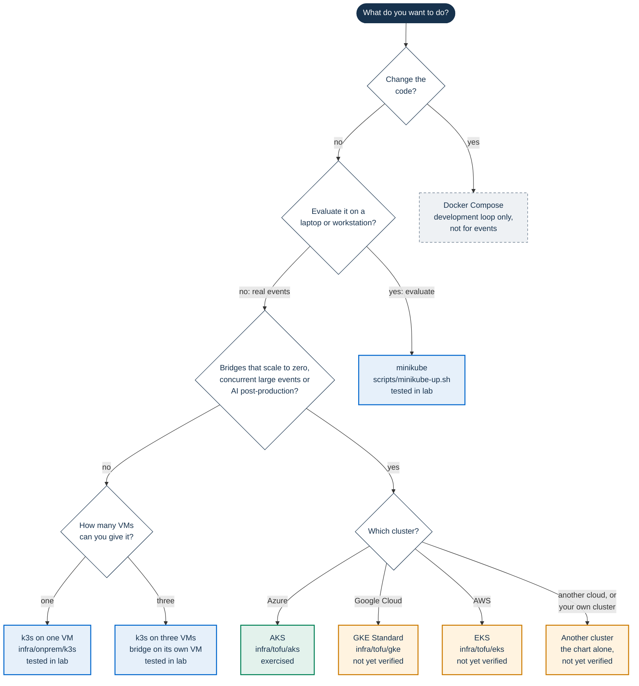

# Installing PA Webinar

PA Webinar is Kubernetes-native. One Helm chart, `infra/helm/pa-webinar`,
installs it everywhere, and the same chart runs on a laptop and in
production: only the values files layered on it change. Scheduled work runs
as Kubernetes CronJobs. In the standard and full profiles a
HorizontalPodAutoscaler scales the portal, and in the full profile a CronJob
also scales the bridges through the Kubernetes API.

- **To evaluate it, use minikube.** `scripts/minikube-up.sh` installs the
  chart on one workstation with one command and no flags. It is the same
  chart as in production: the simple profile plus an overlay for a small
  node.
- **Docker Compose is the loop for changing the code**, nothing more. It
  serves the portal over plain HTTP, keeps placeholder secrets in the tracked
  `docker-compose.yml`, runs only some of the scheduled jobs, and has no
  object storage, no TURN and no resource limits. It is not a smaller copy of
  the chart. Use it to develop ([Local development](../DEVELOPMENT.md)), not
  to judge an installation or to serve events.

This page is the starting point for the IT staff of a public administration
(PA). It helps you choose a platform, lists what to prepare, gives the
measured requirements, explains in short how the platform scales, and states
the known limitations. The procedures live in the pages it links, and the
Helm values are documented in [Deploying with Helm](../DEPLOYMENT.md) and the
[Configuration reference](../CONFIGURATION.md), not here.

Every platform has one of three statuses, used across the installation
guides and the [Infrastructure reference](../INFRASTRUCTURE.md):

- **Exercised**: runs real events.
- **Tested in lab**: installed from scratch on lab machines and loaded with
  synthetic participants.
- **Not yet verified**: validated without a real cloud account (OpenTofu
  validation and tests with mocked providers, security scan of the
  configuration, `helm template`), and never installed.

On this page:

- [Choose a platform](#choose-a-platform)
- [Evaluate on minikube](#evaluate-on-minikube)
- [Checklist before you install](#checklist-before-you-install)
- [Requirements](#requirements)
- [How scaling works](#how-scaling-works)
- [Known limitations](#known-limitations)
- [Getting help](#getting-help)
- [Where to go next](#where-to-go-next)

## Choose a platform



Green is exercised, blue tested in lab, orange not yet verified, and the
dashed grey box is for development only. k3s has no node autoscaler, which is
why the needs of the third question lead to a managed cluster.

| Platform | Start here | What it gives you | Status |
|---|---|---|---|
| minikube on a workstation | [Try PA Webinar on minikube](minikube.md): `scripts/minikube-up.sh`, with `examples/values-minikube.yaml` | The whole chart in the simple profile, with a Mailpit test mailbox. Browsers on the same workstation only | Tested in lab |
| k3s on one VM | [Install on one node](k3s.md#install-on-one-node), with the scripts in `infra/onprem/k3s` and `examples/values-k3s.yaml` | An installation for occasional events of about 20 participants on camera: one bridge, PostgreSQL and Redis in the cluster, no TURN, no Jibri | Tested in lab |
| k3s on three VMs | [Install on three nodes](k3s.md#install-on-three-nodes) | The same, with the bridge's CPU kept away from the portal and the database. Not highly available | Tested in lab |
| AKS | [Installing on AKS](aks.md), with the module in `infra/tofu/aks` and `examples/values-aks.yaml` | Full profile: bridges that scale to zero, coturn, Azure Blob storage | The topology is exercised by the reference installation. The OpenTofu module itself is not yet verified: it has not been applied to a subscription |
| GKE | [Installing on GKE](gke.md), with the module in `infra/tofu/gke` and `examples/values-gke.yaml` | Full profile on GKE Standard. Autopilot is not supported | Not yet verified |
| EKS | [Installing on EKS](eks.md), with the module in `infra/tofu/eks` and `examples/values-eks.yaml` | Full profile, with AWS Load Balancer Controller and Cluster Autoscaler | Not yet verified |
| Any other conformant cluster | [Deploying with Helm](../DEPLOYMENT.md) and [Node pools and bridge exposure](../INFRASTRUCTURE.md#node-pools-and-bridge-exposure) | The chart and its profiles; node pools, UDP exposure and ingress are yours to adapt. OpenShift is not covered | Not yet verified |

The profiles (`simple`, `standard`, `full`) are example values files in
`infra/helm/pa-webinar/examples/`, not modes of the chart. They are compared
in [Profiles and values files](../DEPLOYMENT.md#profiles-and-values-files).

## Evaluate on minikube

From a clone of the repository:

```bash
git clone https://github.com/italia/pa-webinar.git
cd pa-webinar
scripts/minikube-up.sh
```

The script starts a minikube profile named `pa-webinar` without changing your
current kubectl context, generates the secrets once outside the repository,
and installs the chart with the simple profile and
`examples/values-minikube.yaml`. It uses the images that the development
branch publishes (`ghcr.io/italia/pa-webinar:dev` and `:dev-migrate`) when the
node can pull them. Today ghcr.io refuses anonymous pulls, so without
credentials the script builds the same two images from your checkout and loads
them into the node. In the lab, that run took about five minutes with
Docker's build cache already warm; a first build on a new machine takes
longer.

The script also creates a certificate authority of its own, once, and signs
the portal's and the conference's certificates with it. Trust that authority
in your browser (or accept the conference's certificate warning first and the
portal's second), sign in with the instance key, and join from browsers on the
same workstation. Every step, the credentials for the published images, the
installation by hand, what the overlay changes, the measured usage and how to
stop or remove the profile are in
[Try PA Webinar on minikube](minikube.md).

## Checklist before you install

This is the technical checklist. The organizational one, from the license to
the privacy notice, is the [Adoption checklist](../REUSE.md#adoption-checklist)
in Reusing PA Webinar. The minikube evaluation needs none of the items below:
the script provides nip.io names, certificates from a local authority and a
test mailbox.

**Platform and chart**

- [ ] **Platform and profile chosen** with the [decision tree](#choose-a-platform),
      and the [Known limitations](#known-limitations) of that platform read.
- [ ] **Subcharts fetched** on the machine that runs Helm, from the repository
      root. `build`, not `update`, installs exactly the versions pinned in
      `Chart.lock`:

  ```bash
  helm repo add bitnami https://charts.bitnami.com/bitnami
  helm repo add jitsi-contrib https://jitsi-contrib.github.io/jitsi-helm/
  helm dependency build infra/helm/pa-webinar
  ```

- [ ] **A folder for the installation's files, outside the repository**,
      readable only by you: the values with your host names, and the
      secrets.

**Names, certificates and network**

- [ ] **Two DNS names**, one for the portal (`webinar.example.com`) and one for
      the conference (`meet.webinar.example.com`), both pointing at the
      ingress. The portal and the conference are served by separate Ingresses
      in every profile. TURN over TLS needs a third name
      (`turn.webinar.example.com`) on coturn's own address.
- [ ] **TLS certificates that browsers trust**, for both names. With the
      conference in the cluster, the portal's status page checks its
      components at their in-cluster addresses, so the certificate plays no
      part there. When the portal calls a service behind an internal
      certificate authority (SMTP, object storage, an external Jitsi), give
      it the authority with `app.extraCaCerts`
      ([Configuration](../CONFIGURATION.md)). With
      cert-manager, the chart expects a ClusterIssuer named
      `letsencrypt-prod`. HTTP-01 needs port 80 open from the Internet. On
      k3s, port 80 redirects every request to HTTPS, the challenge included:
      use DNS-01 there, or remove the redirect while you use HTTP-01. Use
      DNS-01 as well wherever inbound sources are restricted
      ([DNS and TLS](../INFRASTRUCTURE.md#dns-and-tls)).
- [ ] **A public address for the bridge, with UDP 10000 open.** Participants
      send media straight to the bridge, never through the portal or the
      ingress. On a VM: a public IP on the interface, or a NAT or port forward
      that keeps the port number, with `jitsi-meet.jvb.publicIPs` set to the
      public address. On a managed cluster: a fixed load-balancer address or
      a public IP per bridge node ([UDP load balancers](#udp-load-balancers)).
      Without it, participants join, the participant list fills up, and nobody
      hears or sees anyone.
- [ ] **A decision on TURN.** Participants whose networks block UDP to port
      10000, which is common in public-sector networks, get no media without
      TURN over TLS on port 443. The simple profile ships no TURN. Decide
      before the first event ([TURN and coturn](#turn-and-coturn)).
- [ ] **The firewall**, as in the table below.
- [ ] **The ingress controller** decided: ingress-nginx is the chart's default,
      Traefik is tested in lab ([Ingress, proxies and client addresses](#ingress-proxies-and-client-addresses)).
- [ ] **The proxies in front of the ingress** counted, if any: a load balancer,
      WAF or reverse proxy that appends to `X-Forwarded-For` needs
      `TRUSTED_PROXY_HOPS` ([Client address and rate limits](../CONFIGURATION.md#client-address-and-rate-limits)).

| Port | Protocol | From | To | Purpose |
|---|---|---|---|---|
| 443 | TCP | Internet | Ingress | Portal and conference |
| 80 | TCP | Internet | Ingress | HTTP-01 certificate validation and the redirect to HTTPS only |
| 10000 | UDP | Internet | Each bridge node, or the bridge load balancer | Audio and video |
| 3478 | UDP | Internet | coturn's own address | TURN, if enabled |
| 443 | TCP | Internet | coturn's own address | TURN over TLS, if enabled |
| 6443 | TCP | Administrators and k3s agents | k3s server | Kubernetes API. Never from the Internet |
| 8472 and 10250 | UDP and TCP | Every k3s node | Every k3s node | Pod network (UDP 8472) and kubelet (TCP 10250), with more than one node |
| 587 (or 465) | TCP | Cluster | SMTP relay | Email |
| 443 | TCP | Cluster and browsers | Object storage | Recordings, uploads, playback through signed URLs |

The complete table, with the NAT and STUN rules, is in
[Ports and firewall](../INFRASTRUCTURE.md#ports-and-firewall).

**Services the platform depends on**

- [ ] **The accounts and credentials** that the items below need, gathered
      before you start: a sender address and credentials on the SMTP relay;
      access to your DNS zone, with API credentials if cert-manager
      validates through DNS-01; static keys for object storage; read access
      to the project's image packages, or a machine that builds the images;
      and, optionally, Docker Hub credentials, for nodes that pull from Docker
      Hub behind one shared address.
- [ ] **An SMTP relay** reachable from the cluster, with an authenticated
      sender domain: publish the SPF and DKIM records that the relay gives
      you, and a DMARC policy, for the domain of `SMTP_FROM`. Without a relay
      no email is ever sent: no registration confirmation with the personal
      link, no reminder, no staff sign-in link, no verification link for a
      data-subject request. With `networkPolicy.enabled: true`, which the k3s
      overlay sets, the portal reaches the relay only on port 587: a relay on
      465 also needs `networkPolicy.egress.allowImplicitTlsSmtp: true`, and a
      relay on any other port, such as 25, needs
      `networkPolicy.egress.smtpPort` ([Email delivery](../configuration/email.md)).
- [ ] **Object storage**, if you record events or upload videos and materials:
      Azure Blob Storage or an S3-compatible service. The chart ships none.
      Staff browsers upload straight to it, so it needs CORS that allows `PUT`
      from the portal's origin and, on S3-compatible storage, an HTTPS
      endpoint that both browsers and pods reach. Access uses static keys
      only ([Creating buckets and containers](../configuration/storage.md#creating-buckets-and-containers)).
- [ ] **Access to the images.** The published images accept no anonymous pull,
      and a registry token works only for an account that has been given
      read access to the packages. Choose a pull Secret, a mirror in your own
      registry, or a local build, and always set both
      `app.image.tag: "<X.Y.Z>"` and
      `app.migration.image.tag: "v<X.Y.Z>-migrate"`
      ([Registry access](#registry-access-to-the-published-images)).
- [ ] **A database**: in the cluster through the chart, as in the simple
      profile, or a managed PostgreSQL, which the standard and full profiles
      expect and which uptime needs
      ([High availability](#high-availability-of-the-in-cluster-datastores)).

**Secrets and backups**

- [ ] **Secrets generated once, and kept.** In the simple profile the chart
      renders the Secrets from a values file that you write once and pass
      unchanged to every upgrade: the application keys (`APP_SECRET`,
      `JITSI_JWT_SECRET`, `PII_ENCRYPTION_KEY`, `CRON_API_KEY`,
      `ADMIN_API_KEY`), the datastore passwords (`POSTGRES_PASSWORD`,
      `POSTGRES_ADMIN_PASSWORD`, `REDIS_PASSWORD`) and the SMTP relay. The
      command that writes that file is step 1 of
      [Simple profile](../DEPLOYMENT.md#simple-profile), which step 7 of the
      k3s guide's [Install on one node](k3s.md#install-on-one-node) follows.
      The standard and full profiles read Secrets that you create
      ([Secrets](../DEPLOYMENT.md#secrets)).
- [ ] **The conference's internal credentials pinned**: the Jicofo and bridge
      XMPP passwords, and those of Jibri and coturn when they are on. Left
      empty, they are drawn again on every render, and every `helm upgrade`
      drops the live conferences. `jitsi.requirePinnedCredentials: true`
      makes the render stop instead; the minikube, k3s, GKE and EKS overlays
      set it, and on AKS it goes in your private values file
      ([Pin the conference's internal credentials](../DEPLOYMENT.md#pin-the-conferences-internal-credentials)).
- [ ] **`PII_ENCRYPTION_KEY` and `APP_SECRET` stored with every database
      backup.** Without the first, the encrypted personal data cannot be read
      again. The second keys the email hashes that sign-in and data-subject
      requests look up. The datastore passwords are written into PostgreSQL
      and Redis on first start, and the chart does not regenerate them.
- [ ] **Database and storage backups designed and tested.** The project has
      no backup or restore procedure. What to back up, and why the restore
      order matters, is in [Backups](../REUSE.md#backups).

**Size and first event**

- [ ] **Nodes and uplink sized** from [Requirements](#requirements): the bridge
      for your largest single event, the uplink for its cameras.
- [ ] **After the install**, the first-run checks pass
      ([First-run checks](../DEPLOYMENT.md#first-run-checks)). Add `-k` to
      `curl` while the certificates are self-signed:

  ```bash
  curl -s https://<portal-host>/api/health                                   # "status":"ok"
  curl -s -o /dev/null -w '%{http_code}\n' https://<jitsi-host>/config.js    # 200
  kubectl -n pa-webinar create job --from=cronjob/pa-webinar-email-outbox outbox-check
  kubectl -n pa-webinar get job outbox-check                                 # Complete
  ```

  A completed `outbox-check` proves only that the scheduled jobs reach the
  portal. It completes even when the relay refuses every message; its log
  (`kubectl -n pa-webinar logs job/outbox-check`) counts what it `sent` and
  `retried`.

- [ ] **A first sign-in and a named administrator.** Sign in at
      `https://<portal-host>/en/admin/login` with **Sign in with the
      instance key** and the value of `ADMIN_API_KEY`. Then, under
      **Accounts**, add yourself with the **Administrator** role and
      **Send the sign-in link now** ticked. That link reaching your mailbox
      is the test of the SMTP relay. If it does not arrive, the message's row
      in the email outbox holds the relay's answer
      ([Tracing a missing email](../architecture/email.md#tracing-a-missing-email)).
      A corrected `SMTP_*` value takes effect only after the portal restarts,
      because the Deployment restarts by itself only when its ConfigMap
      changes: `kubectl -n pa-webinar rollout restart deployment/pa-webinar`.
- [ ] **The site filled in before the first public event**, under
      **Settings**: the organization's name and logo, the privacy notice and
      the accessibility statement, and a reply-to address for emails
      ([Runtime settings](../configuration/runtime-settings.md)). The
      organizational items are in the
      [Adoption checklist](../REUSE.md#adoption-checklist).
- [ ] **A test call** with two devices on different networks, one of them
      outside yours, and one from a network that blocks UDP if you run TURN.
      **Instant calls** > **Create and join** opens one at once, and
      **Copy invite link** gives the link for the other device.
      A participant list that fills up proves nothing: check that everyone
      hears and sees everyone. The rest is in your platform guide:
      [k3s](k3s.md#before-the-first-real-event), [AKS](aks.md#8-check-the-installation),
      [GKE](gke.md#checklist) or [EKS](eks.md#before-the-first-real-event).

## Requirements

Only measured figures are minimums. Where a size is derived rather than
measured, the table says so.

| Platform | Minimum that held | Recommended | What was measured |
|---|---|---|---|
| minikube (evaluation) | Node of 2 CPU, 3 GB of memory, 30 GB of disk | 4 CPU / 6 GB / 30 GB, the script's default; 4 CPU / 8 GB to try rooms of 40 | On 2 CPU / 3 GB, 20 participants on camera held at the limit: the node used 2.83–2.88 GiB of 3, bridge stress 0.73, no packet loss. On 4 CPU / 6 GB, 10 on camera used under half the node (2.52 GiB). On 2 CPU / 2 GB, 20 on camera collapsed. On 4 CPU / 8 GB, 40 participants with six videos per receiver peaked at 2.75 cores and 5.1 GiB |
| The workstation's browsers | – | Add them to the node | 10 headless Chrome participants used about 2.1 cores and 5.3 GB |
| k3s on one VM | 4 vCPU, 8 GiB, 40 GB disk, a public IP with UDP 10000 open | 8 vCPU / 16 GiB and an uplink of 200 Mbps or more, for webinars of about 50 people (derived from the cost model, not measured) | 20 on camera: node peak 1.84 cores (46% of its CPU) and 3.4 GiB used, bridge out 46.9 Mbps |
| k3s on three VMs | Server 2 vCPU / 4 GiB / 30 GB; portal and database 2 vCPU / 4 GiB / 30 GB; bridge 4 vCPU / 4 GiB / 20 GB | Bridge node 4 vCPU / 8 GiB (derived: the bridge requests 2 GiB and its heap can grow to about 3 GiB) | 20 on camera: bridge node 1.8 cores peak and 2.6 GiB of its 4 GiB; the portal and database node under 0.2 core and 1 GiB |
| Managed, bridge pool | Not measured on a managed pool | One bridge sized for your largest single event | A bridge limited to 3 CPU and 2 GiB, on a 4 vCPU / 16 GiB VM, carried about 25 participants all on camera (stress 0.77 at 25 senders, 0.83 at 26), or 60 webinar viewers at a stress of about 0.47. Some 60 to 80-viewer runs ended with the bridge killed at its 2 GiB memory limit. A real 65-participant webinar ran on one 16-vCPU bridge at a peak stress of 0.186 |
| Managed, application pool | Not measured separately | At least two nodes, for the two app replicas, sized from the resource requests | At 20 participants the portal, PostgreSQL and Redis together used at most about 0.25 core and under 300 MiB |

How these numbers were measured:

- **Lab runs** (minikube and k3s): participants were headless Chrome
  browsers on the same physical host as the servers, sending a synthetic
  camera and a microphone playing a continuous tone, and receiving 180p
  thumbnails. Each level ran at steady state for about 120 s on k3s, and for
  105 to 135 s on minikube. Resources came from `kubectl top` and `free -m` on k3s,
  and from each container's cgroup on minikube; bridge traffic from the
  bridge's own statistics (`/colibri/stats`). The host was shared, so read
  server CPU as ±20%, and there was no real network between clients and
  servers. Details and limits:
  [How the numbers were obtained](../INFRASTRUCTURE.md#how-the-numbers-were-obtained).
- **Managed bridges**: full-media bots from one workstation over the public
  Internet, joining at one per second, with `/colibri/stats` sampled every
  30 s ([How the runs were made](../LOAD-TESTING.md#how-the-runs-were-made)).
- **The real event**: a 44-minute webinar with real cameras and clients, read
  from the scaler's cross-bridge snapshot and each bridge's upload bit rate
  ([A real event](../LOAD-TESTING.md#a-real-event)).

**Bandwidth.** Plan the uplink together with CPU. With everyone on camera the
bridge sent 2.7, 11.6 and 46.9 Mbps at 5, 10 and 20 participants, with 180p
thumbnails only. The real webinar used about 1 Mbps of bridge upload per
participant, about 66 Mbps at its peak. Real 720p speakers add to the lab
figures: a real camera at the app's high-quality cap sends up to 2.2 Mbps,
against about 1 Mbps for the synthetic stage stream.

**Disk.** A single k3s node used 12 GB after the install, 8.5 GB of it for the
container images; the migration image alone is about 2.4 GB. Plan 30–40 GB on
every node that can run the portal, plus the database volume (5 GiB in the
simple profile). A bridge-only node needs less: 20 GB left 11 GB free.

**Tools.**

- minikube path: minikube, Helm, kubectl, openssl, curl, and Docker to build
  the images. The script checks the minimum versions it was tested with
  (`MINIKUBE_MIN` and `HELM_MIN` in `scripts/minikube-up.sh`).
- k3s path: x86_64 VMs with systemd (tested on Debian 12, and on Rocky
  Linux 9 with SELinux enforcing); a workstation with Helm and kubectl; a
  machine that prepares the images, with bash 3.2 or later, Helm, skopeo,
  python3 and a registry login ([Requirements](k3s.md#requirements)).
- Managed clouds: OpenTofu or Terraform, the cloud's CLI, kubectl and Helm,
  as each guide lists ([AKS](aks.md#before-you-start),
  [GKE](gke.md#minimum-requirements), [EKS](eks.md#requirements)). The machine sizes in the modules are
  starting points, not measurements.

The full sizing, per component and per meeting pattern, is in
[Sizing](../INFRASTRUCTURE.md#sizing).

## How scaling works

- **One conference, one bridge.** Every participant's audio and video goes to
  a Jitsi Videobridge (JVB), which forwards each stream to each receiver. The
  chart does not enable Jitsi's bridge cascading, so a conference stays on
  one bridge. A bigger event needs a bigger bridge, not more bridges.
- **Streams grow with N × (N − 1).** In tile view with everyone on camera,
  each of N participants receives the other N − 1: 20 forwarded videos at 5
  participants, 90 at 10, 380 at 20. Bridge traffic followed: 2.7, 11.6 and
  46.9 Mbps on the k3s VM. At 20 on camera the bridge used 1.0–1.9 cores
  steady and up to 2.8 while everyone joined. Extrapolated, 40 all on camera
  would need about 4 cores, above the bridge's 3-CPU limit in the chart.
- **The meeting pattern changes the cost.** With six videos per receiver,
  everyone unmuted, bridge CPU measured 0.333 + 0.00128 × N × (N − 1) cores
  from 20 to 40 participants. A webinar with a few speakers and a muted
  audience with cameras off cost about 14 millicores per viewer (0.64 cores
  for 40).
- **More bridges carry more events.** Different conferences can sit on
  different bridges, up to the replica cap `JVB_MAX_REPLICAS` and the size of
  the node pool. With the default host port each bridge takes a node of its
  own, and each needs an address that leads to it alone
  ([The single-IP pitfall](../architecture/scaling.md#the-single-ip-pitfall)).
- **The bridge pool scales to zero, in the full profile only**
  (`jitsi.mode: full` with `jvbScaler.enabled: true`). A CronJob reads the
  event calendar and the bridges' statistics, starts bridges before
  scheduled events (`jvbPreScaleMinutes`), and releases them once a room has
  stayed empty (`jvbInactiveGraceMinutes`); the node autoscaler then adds and
  removes the nodes. The pre-scale window must cover node boot, image pull
  and bridge start, which have not been measured on GKE or EKS. k3s and
  minikube have no node autoscaler: there the simple profile runs one bridge
  at a fixed count. The portal expects no more bridges than the fixed count:
  without the scaler the chart writes `JVB_MAX_REPLICAS` from
  `jitsi-meet.jvb.replicaCount`, unless `app.env` sets it.
- **Events open and close by themselves in every profile.** With the scaler,
  its CronJob also moves events through their statuses. Without it (the
  simple and standard profiles, an external Jitsi, bridges scaled by KEDA),
  the chart runs the `<release>-lifecycle` CronJob every minute
  (`cronjobs.lifecycle`): it opens a published event at its start time, ends
  it once its end time and the grace period have passed, and closes the call
  sessions left open
  ([Event lifecycle](../architecture/event-lifecycle.md)).
- **The portal scales horizontally.** It keeps no state in the pod: a
  HorizontalPodAutoscaler adds replicas on CPU and memory (`autoscaling` in
  `infra/helm/pa-webinar/values.yaml`, which needs metrics-server), and Redis
  fans live updates out to every replica.
- **Where the limits are**, in the order you meet them: one Jibri recording
  at a time; one bridge per event; the replica cap and the pool maximum; one
  Prosody and one Jicofo shared by every conference; network egress; and a
  single PostgreSQL and Redis that scale vertically.

The capacity model, the scaler tick and the node pools are in
[Scaling the media plane](../architecture/scaling.md). The measurements behind
the formulas are in [What a participant costs on the bridge](../INFRASTRUCTURE.md#what-a-participant-costs-on-the-bridge).

## Known limitations

What the project still has to deliver for installations is tracked in
[Installation and operations](../ROADMAP.md#installation-and-operations) on
the roadmap. The limitations below are the ones that decide a design.

### TURN and coturn

- **The simple profile has no TURN**, so neither the minikube evaluation nor
  the k3s installations have it. Participants on networks that block UDP to
  port 10000 get no audio or video.
- **coturn needs its own address.** It is an option of the Jitsi subchart
  ([coturn (TURN and TURNS)](../DEPLOYMENT.md#coturn-turn-and-turns)), with
  UDP 3478 and TURN over TLS on TCP 443, on an address other than the
  ingress, and a third DNS name. Its certificate cannot come from HTTP-01
  through the ingress: use DNS-01, an existing certificate, or the
  subchart's ACME proxy, which has not been verified.
- **Only the AKS reference installation runs coturn.** No lab setup
  exercised TURN.
- **Per platform:**
  - k3s: ServiceLB cannot bind 443 on the node where Traefik already holds
    it. coturn needs a second address, for example from MetalLB. Not
    tested.
  - AKS: with one coturn replica, the chart's disruption budget blocks every
    node drain, so automatic node upgrades fail; `values-aks.yaml` runs two
    replicas. coturn reads its certificate only when it starts: install
    Stakater Reloader, or restart coturn after each renewal. A coturn restart
    cuts the media of the participants it relays until the conference
    reconnects them ([Bridge and TURN exposure](aks.md#bridge-and-turn-exposure)).
  - GKE: off by default in the module, and it needs a recent GKE version for
    its reserved address and for UDP and TCP on one address
    ([TURN](gke.md#turn-turn_enabled)).
  - EKS: coturn's UDP needs a Network Load Balancer from AWS Load Balancer
    Controller, and its shared secret must be pinned
    (`jitsi-meet.coturn.staticAuth.secret`, or `staticAuth.existingSecretName`),
    because `values-eks.yaml` refuses to render unpinned credentials.

### Ingress, proxies and client addresses

- **The chart's HTTP tuning is written as ingress-nginx annotations**: the
  header buffers sized for Next.js, without which administration pages answer
  502, HSTS, the maximum upload size and the redirect of the conference
  host's root. Another controller loses them unless you translate them.
  Traefik, bundled with k3s, is tested in lab; a controller that speaks only
  Gateway API gets no routes at all. ingress-nginx has been retired upstream
  ([Ingress controllers](../INFRASTRUCTURE.md#ingress-controllers)).
- **Long-lived connections.** The live room holds event streams and the
  conference holds signaling connections. GKE's default Ingress closes them
  after its backend timeout unless it is raised; the GKE module raises it,
  and the streams still reopen once an hour.
- **The client address decides the per-IP limits** on registration, sign-in
  and link resends, and it is what the audit log records. The portal reads
  `X-Forwarded-For` from the right.
  - On k3s with Traefik's defaults, every client appeared as the pod-network
    gateway, `10.42.0.1`, sharing one limit for the whole site.
    `traefik-config.yaml` in `infra/onprem/k3s` fixes it
    (`externalTrafficPolicy: Local`). On three nodes the real address arrived
    only for traffic that entered on the node running Traefik, so the
    three-node layout of the k3s guide pins Traefik to the ingress node.
  - Behind a load balancer, WAF or proxy that appends to the header, first
    make the ingress trust that proxy, then set `TRUSTED_PROXY_HOPS`; on the
    GKE Ingress it is `1`
    ([Client addresses and per-IP limits](../INFRASTRUCTURE.md#client-addresses-and-per-ip-limits)).
  - A NAT device in front of the node hides client addresses.
  - Never expose the app Service directly. A request that reaches it without
    an ingress writes its own `X-Forwarded-For` and so picks its own key: in
    the lab, 12 of 12 forged requests passed the limit that way.
  - The counters live in each process, so every limit is multiplied by the
    number of app replicas (**Distributed rate limiting**, under
    [Later](../ROADMAP.md#later) on the roadmap).
- **Access logs can hold credentials.** Moderator and participant links carry
  `?token=`, and the conference address carries `?jwt=` with the
  participant's name. A cloud load balancer or log agent that stores full
  URLs keeps them. The GKE module turns those logs off; on other platforms,
  check what your load balancer and log pipeline store
  ([Logging](../architecture/security.md#logging)).

### UDP load balancers

The address that a bridge advertises must lead to that bridge and to no
other. Two topologies satisfy that rule on a managed cloud:

| | One bridge behind a fixed load-balancer address | A public address on every bridge node |
|---|---|---|
| Bridges | One: `JVB_MAX_REPLICAS: "1"` | One per node, up to the pool maximum |
| How the bridge learns its address | Set in `jitsi-meet.jvb.publicIPs`, no STUN | STUN, from a server outside the cluster |
| AKS | Exercised, on the Azure Standard Load Balancer | Not yet verified |
| GKE | Passthrough network load balancer with a reserved regional address; not yet verified | Not yet verified |
| EKS | Network Load Balancer created by AWS Load Balancer Controller; the in-tree controller creates a Classic Load Balancer, which carries no UDP. Not yet verified | Not yet verified |

- **Upgrades behind one address.** An upgrade that changes the bridge pod
  rolls it, and for a moment two bridges answer on the same address: upgrade
  outside events. On EKS the bridge's Elastic IP lives in one zone.
- **Host ports need the `privileged` Pod Security level.** With the chart's
  defaults, and in the one-address-per-node topology, the bridge binds its UDP
  port on the node. The `baseline` level and common admission policies
  reject host ports, and the Jitsi images run as root.
- **On VMs** (k3s, minikube) the bridge binds UDP 10000 on the node and
  advertises the node address. Behind NAT, forward the port unchanged and set
  `jitsi-meet.jvb.publicIPs`, or outside participants get no media.
- **Private candidates.** In-cluster peers (the recorder bot, Jibri, coturn
  relaying a participant) reach the bridge on its pod address. When the
  bridge announces a private address, as on an intranet or in a lab, setting
  `JVB_ADVERTISE_PRIVATE_CANDIDATES: "false"` leaves it announcing no address
  at all: people join, and nobody hears or sees anyone
  ([Advertised addresses and NAT](../INFRASTRUCTURE.md#advertised-addresses-and-nat)).
  Turning private candidates off has not been exercised on any cloud, yet
  `values-gke.yaml` does it for its load-balancer topology
  ([GKE known limitations](gke.md#known-limitations)).
- **STUN.** The Jitsi subchart's default STUN server is a third-party
  service. The minikube and k3s overlays set `stunServers: ""` and advertise
  the node address instead; the multi-bridge topology needs a STUN server
  you choose. Record the choice in your privacy notes
  ([Advertised addresses and NAT](../INFRASTRUCTURE.md#advertised-addresses-and-nat)).

### NetworkPolicy and network plugins

`networkPolicy.enabled: true` renders a policy that selects only the portal's
pods. Whether anything enforces it depends on the network plugin:

| Platform | Enforced | Tested |
|---|---|---|
| k3s | Yes, by its embedded kube-router. Blocked connections fail at once | In lab, one and three nodes |
| minikube | Not with the default network plugin; start the profile with `--cni=calico` | No |
| AKS | With a policy engine: the AKS module sets Calico | No |
| GKE | With Dataplane V2, which the GKE module enables | No |
| EKS | With the VPC CNI network policy feature, which the EKS module enables | No |

The recorder bot's pods need an extra rule, and cloud load balancers that
send traffic straight to pods need an `ipBlock` rule for their ranges. See
[Network policies](../INFRASTRUCTURE.md#network-policies).

### Registry access to the published images

- **No published image accepts an anonymous pull.** Each platform has a way
  around it:
  - minikube: the script builds the images from your checkout, uncommitted
    changes included, and needs Docker; with a token that can read packages
    it uses the published `:dev` images;
  - k3s: `preload-images.sh` bundles every image the chart renders on a
    machine that has registry credentials, and imports the bundle on the
    nodes, which never see the credentials and may have no Internet access;
  - managed clusters: a pull Secret (`app.imagePullSecrets` and
    `jitsi-meet.imagePullSecrets`), or a mirror in your own registry.
- **A token is not enough by itself.** The packages are not public: a GitHub
  token with `read:packages` pulls them only for an account that has been
  given read access to them. Without that access, build the images from the
  release tag ([Building locally](../INFRASTRUCTURE.md#building-locally)) and
  serve them from a registry you control, or load them into the nodes as the
  minikube script does. With the k3s scripts, that path has not been tested.
- **With the minikube or k3s overlay as shipped, only the portal and
  migration images come from ghcr.io.** The chart's other images (Jitsi,
  PostgreSQL, Redis, curl and kubectl) are public images on Docker Hub.
  `infra/onprem/k3s/preload-images.sh list` prints the full list for your
  values files.
- **Set both application tags.** Without them, the chart derives
  `<X.Y.Z>-migrate` for the migration image, a tag that older releases do not
  carry, while `v<X.Y.Z>-migrate` exists for every release. A missing tag
  leaves the migration init container in `ImagePullBackOff` until Helm times
  out ([Pinning versions](../INFRASTRUCTURE.md#pinning-versions)).
- **The recorder bot, the recorder controller and the AI worker** have only
  development tags: the floating `:dev` and an immutable `:dev-<sha>`. Pin a
  `:dev-<sha>` you have tested, because rolling the chart back does not roll
  them back.
- **The patched Jitsi web image** needs a pull Secret. The standard
  `jitsi/web` image works, with advanced noise suppression off, which is the
  application's default.
- The published images are built for `linux/amd64` only.
- Docker Hub limits anonymous pulls per source address. Private nodes behind
  one NAT address share that limit: use Docker Hub credentials or a
  pull-through cache.

### High availability of the in-cluster datastores

- **One of each.** One PostgreSQL, a standalone Redis, and one Prosody and one
  Jicofo, which the Jitsi subchart hard-codes. When PostgreSQL runs in the
  cluster, its volume is bound to one node (local-path on k3s) or to one
  zone (EBS on EKS).
- **Three VMs are not high availability.** In the lab, the VM that held the
  portal, PostgreSQL and Redis was powered off for 7 min 50 s during a call.
  The running conference continued, because signaling and media were on
  other nodes, but the portal was down for 9 min 3 s. Kubernetes left the
  PostgreSQL and Redis pods `Terminating`, and after a forced delete
  PostgreSQL stayed `Pending`, because its volume was bound to the lost node
  ([What is not highly available](k3s.md#what-is-not-highly-available)).
- **The k3s server is a single point of failure too.** One server with its
  embedded datastore: losing it stops the control plane. Not tested.
- **For uptime** you need a managed or replicated PostgreSQL (Azure Database
  for PostgreSQL, Cloud SQL, Amazon RDS), an application pool of at least two
  nodes, and on k3s more than one server node. High availability for Redis
  is a conditional item on the [roadmap](../ROADMAP.md#conditional).
- **There is no backup or restore procedure.** You design and test it
  ([Backups](../REUSE.md#backups)).

### What has been exercised, and what is only validated

| Path | Status | What ran | What did not |
|---|---|---|---|
| minikube, `scripts/minikube-up.sh` | Tested in lab | A from-scratch install with no flags and locally built images, upgrades, stop, restart and purge; up to 20 participants on camera on 2 CPU / 3 GB; a moderator joining the embedded room in Chrome after both certificates were accepted. An upgrade with the local certificate authority: certificates verified with curl, from inside the portal and by Chrome on Linux with the authority added, HTTP redirected to HTTPS, a guest who opened `http://` joining the room over HTTPS. Room roles with two lib-jitsi-meet clients in both join orders and through the portal's room: moderator link as moderator, registrant and guest as participants, a participant's mute and kick of the moderator refused | VM drivers, macOS, Windows, NetworkPolicy, participants on other machines, the recorder, the authority in Firefox or a system store |
| k3s on one VM | Tested in lab | 20 participants on camera on 4 vCPU / 8 GiB, installed by hand. The scripts on a Debian 12 VM with no direct Internet access: install through a proxy, images from the bundle, 5 participants on camera over direct UDP | A publicly trusted certificate, a real SMTP relay, cert-manager |
| k3s on several VMs | Tested in lab | Three VMs installed by hand: 20 participants on camera, and a node powered off during a call. The scripts on two nodes, a Rocky Linux 9 server with SELinux enforcing and a Debian 12 bridge node: 3 participants on camera over direct UDP, real client addresses in the audit log | A first air-gapped install, arm64, registry mirrors |
| AKS | Exercised | Real events with one bridge behind a fixed address, the bridge scaler, coturn, Azure Blob storage, ingress-nginx and cert-manager | The multi-bridge topology. The module in `infra/tofu/aks` has been validated and tested with mocked providers, not applied |
| GKE | Not yet verified | Module validation and tests with a mocked provider, a security scan of the configuration, `helm template` of the values it outputs | Anything on Google Cloud |
| EKS | Not yet verified | The same checks as GKE | Anything on AWS |
| The chart | Validated in CI on every push and pull request to `main` | `scripts/validate-chart.sh`, with Helm 3.16.3, renders the simple, standard and full profiles, the minikube and k3s overlays and the AKS, EKS and GKE overlays (without each module's output) included, checks invariants on every one of them, and checks that the render guards still stop inconsistent values; CI also applies the simple, standard and full profiles to a disposable cluster with a server-side dry run | The managed-cloud overlays with each module's output are rendered only by hand. No CI runs on the development branch |
| Docker Compose | Development | Used to develop the code | Not load-tested. Not for events |

No lab setup exercised TURN, Jibri recording or AI post-production, and
nothing checks after an installation that a room can actually be joined.

### Gaps you fill yourself

- **Object storage**: the chart ships none. Without it the portal hides its
  upload controls, and materials given as links still work.
- **The shared whiteboard**: Jitsi's whiteboard needs a collaboration server,
  and the chart neither installs nor configures one, so rooms have no
  whiteboard. The Jitsi subchart has an optional one
  (`jitsi-meet.excalidraw.enabled`); the portal also needs
  `app.env.NEXT_PUBLIC_WHITEBOARD_ENABLED: "true"`. That combination has not
  been tested.
- **Composite recording with Jibri**: the standard and full profiles turn
  Jibri on, but its upload script must be mounted by hand
  ([Mount the finalize script](../operations/recording-setup.md#mount-the-finalize-script)).
- **Backups**: no procedure and no scheduled job.
- **Alerts** on the scheduled jobs, the email outbox and disk space: the
  alert rules do not cover them ([Monitoring and health](../operations/monitoring.md)).
- **A functional check after each install or upgrade**: the manual call from
  two networks in the [checklist](#checklist-before-you-install).

## Getting help

- **There is no support contract and no service level.** Budget for the
  skills listed in [What you need](../REUSE.md#what-you-need), in house or
  from a supplier ([Support](../REUSE.md#support)).
- **Start from the symptom**: [Troubleshooting](../operations/troubleshooting.md)
  for a running installation, and the troubleshooting section of your
  platform guide.
- **Bugs and questions about the code** go to the
  [issue tracker](https://github.com/italia/pa-webinar/issues), with the
  **Bug report** template. Issues are public: share only what
  [Collecting diagnostics without personal data](../operations/troubleshooting.md#collecting-diagnostics-without-personal-data)
  lists as safe, and give the version that `/api/health` returns. The
  repository has no forum, mailing list or chat channel; the channels are
  listed in [GOVERNANCE](../../GOVERNANCE.md).
- **Vulnerabilities** are reported privately, never in an issue
  ([SECURITY.md](../../SECURITY.md)).
- **New releases** are listed on the repository's
  [GitHub Releases](https://github.com/italia/pa-webinar/releases) and in
  [`CHANGELOG.md`](../../CHANGELOG.md). Only the latest minor version
  receives security fixes, so plan your upgrades
  ([Upgrades and rollback](../operations/upgrades.md)).

## Where to go next

- The platform guides: [minikube](minikube.md), [k3s](k3s.md),
  [AKS](aks.md), [GKE](gke.md) and [EKS](eks.md).
- [Infrastructure reference](../INFRASTRUCTURE.md): how the lab measured
  capacity, node pools and bridge exposure on any cluster, networking in
  depth, network policies and images.
- The references of the scripts and modules:
  [`infra/onprem/k3s`](../../infra/onprem/k3s/README.md),
  [`infra/tofu/aks`](../../infra/tofu/aks/README.md),
  [`infra/tofu/gke`](../../infra/tofu/gke/README.md) and
  [`infra/tofu/eks`](../../infra/tofu/eks/README.md).
- [Deploying with Helm](../DEPLOYMENT.md): the chart reference, profiles,
  secrets and first-run checks.
- [Configuration reference](../CONFIGURATION.md), [Object storage](../configuration/storage.md)
  and [Email delivery](../configuration/email.md).
- [Upgrades and rollback](../operations/upgrades.md) and
  [Running the JVB scaler](../operations/jvb-scaler.md), for day two.
- [Reusing PA Webinar](../REUSE.md): maturity, responsibilities and the
  adoption checklist.
- [Roadmap](../ROADMAP.md): what is still missing.
