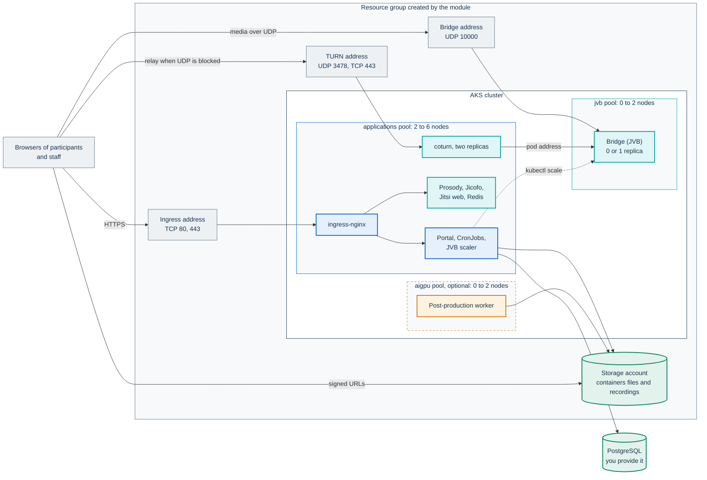
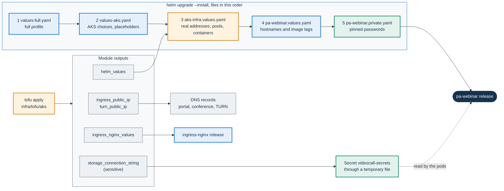
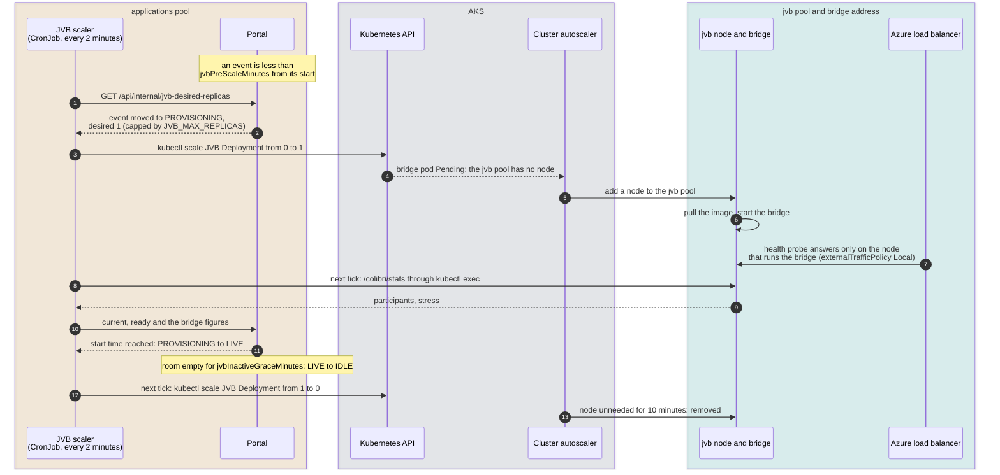

# Installing on Azure Kubernetes Service (AKS)

This page is for the IT staff of a public body who install PA Webinar on
Azure Kubernetes Service (AKS) with the full profile: bridges on a node pool
that scales to zero, coturn for participants whose networks block UDP, and
Azure Blob storage for recordings and materials. It goes from an empty
subscription to a first event with the reference infrastructure in
[`infra/tofu/aks`](../../infra/tofu/aks/README.md) and the chart layer in
[`examples/values-aks.yaml`](../../infra/helm/pa-webinar/examples/values-aks.yaml),
and it says for each part whether it has run real events or has only been
checked offline.

It links to the pages that own the detail and does not repeat them:

- [AKS reference infrastructure](../../infra/tofu/aks/README.md): every
  variable and output of the module, its network rules and node pools;
- [Deploying with Helm](../DEPLOYMENT.md) and
  [Configuration](../CONFIGURATION.md): the chart's keys, the Secrets and the
  environment variables;
- [Installing PA Webinar](README.md): choosing a platform, the common
  checklist and the limitations shared by every platform;
- [Infrastructure reference](../INFRASTRUCTURE.md): sizing, networking,
  network policies and images;
- [Scaling the media plane](../architecture/scaling.md) and
  [Running the JVB scaler](../operations/jvb-scaler.md): how bridges are
  counted, started and released;
- [Object storage](../configuration/storage.md) and
  [Upgrades and rollback](../operations/upgrades.md).

On this page:

- [What has run and what has only been checked](#what-has-run-and-what-has-only-been-checked)
- [What you get](#what-you-get)
- [Before you start](#before-you-start)
- [Check the module before you apply it](#check-the-module-before-you-apply-it)
- [Install](#install)
- [Bridge and TURN exposure](#bridge-and-turn-exposure)
- [Storage](#storage)
- [How it scales](#how-it-scales)
- [Running the installation](#running-the-installation)
- [Known limitations](#known-limitations)
- [Removing the installation](#removing-the-installation)

## What has run and what has only been checked

The reference installation of PA Webinar runs on AKS and serves real events.
Its infrastructure is managed outside this repository, and its values live in
its operator's own configuration repository. The module in `infra/tofu/aks`
and `values-aks.yaml` write the same topology as code: one bridge behind a
fixed load-balancer address, coturn on an address of its own, Azure Blob
storage with an account key, ingress-nginx and cert-manager. The module itself
has not been applied to a subscription.

The statuses follow [Installing PA Webinar](README.md): **exercised**
means that it runs real events, and **not yet verified** means that nobody has
run it. **Checked offline** means checked with tools that need no Azure
account: the module's tests with mocked providers, a security scan of the
configuration, and `helm template`.

| Part | Status | Evidence |
|---|---|---|
| Portal and the JVB scaler, which finds the bridge Deployment by itself | Exercised | Reference installation |
| One bridge behind a fixed load-balancer address, with `JVB_MAX_REPLICAS: "1"` (`jvb_exposure = "load_balancer"`) | Exercised | The only topology that has run real events |
| Azure Standard Load Balancer carrying UDP, and UDP with TCP on one Service | Exercised | Reference installation |
| ingress-nginx with cert-manager | Exercised | Reference installation |
| Azure Blob storage with the account key and signed URLs | Exercised | Reference installation |
| A 65-participant webinar, the whole conference on one 16-vCPU bridge, peak bridge stress 0.186, about 66 Mbps of bridge egress | Measured on the reference installation | The scaler's snapshot and each bridge's statistics, over a 44-minute event ([A real event](../LOAD-TESTING.md#a-real-event)) |
| The OpenTofu module `infra/tofu/aks` | Checked offline | `tofu validate`, and `tofu test` and `terraform test` with mocked providers (both bridge topologies, existing subnets, a GPU pool on spot capacity with a Jibri pool, and the inputs the module rejects) and `trivy config` with no open findings. Commands in [Check the module before you apply it](#check-the-module-before-you-apply-it) |
| `values-aks.yaml` on top of `values-full.yaml` and the module's output | Checked offline | `helm template` renders both topologies and the GPU pool: the bridge and coturn Services carry the fixed-address annotations, the portal and every scheduled job select the applications pool, the bridge and Jibri select and tolerate the bridge pool, coturn has two replicas |
| The add-on charts at the versions in [step 4](#4-install-the-cluster-add-ons) | Checked offline | Rendered with `helm template`, ingress-nginx with the module's `ingress_nginx_values`. Not installed on AKS |
| The `node_public_ip` topology (more than one bridge), coturn with two replicas and the ACME proxy for its certificate, Stakater Reloader restarting coturn, the Jibri pool, the GPU pool created by the module | Not yet verified | Reasoned from the chart, the subchart and the provider documentation |

Checked offline does not tell you whether Azure accepts the plan (quotas,
policies, the propagation of role assignments), whether the fixed addresses
attach to the Services, or how long a bridge takes to start from zero on your
subscription. The first install is where you find out: run it well before the
first event.

## What you get



The module creates:

- **A cluster** with Azure CNI Overlay, the Calico network policy engine,
  Entra ID sign-in with Azure RBAC and local accounts disabled, a weekly
  maintenance window and an autoscaler profile that removes an emptied node
  after 10 minutes.
- **Node pools.** With the defaults in `variables.tf`: a `system` pool of
  `Standard_D2s_v5` (1 to 3 nodes) that runs only AKS components; an
  `applications` pool of `Standard_D4s_v5` (2 to 6 nodes) for everything else;
  a `jvb` pool of `Standard_D4s_v5` (0 to 2 nodes, regular priority, label and
  taint `workload=jitsi-jvb`) for the bridge and Jibri; and, when you turn them
  on, a `jibri` pool and an `aigpu` pool of `Standard_NC24ads_A100_v4` (0 to 2
  nodes). At rest the cluster runs one system node and two application nodes.
- **Three fixed public addresses**, created outside the node resource group
  so that they survive the deletion of a Service or of the cluster: ingress,
  bridge and TURN.
- **Network rules** on the subnets: TCP 80 and 443 for the ingress, the
  bridge's UDP port, and UDP 3478 with TCP 80 and 443 for TURN.
- **A storage account** with the private containers `files` and `recordings`,
  CORS for browser uploads and soft delete.

It leaves to you the database, the DNS records, the cluster add-ons
(ingress-nginx, cert-manager, Reloader, and the NVIDIA device plugin for the
GPU pool), the Secrets, and backups. The full lists, and every pool's label
and taint, are in the
[module README](../../infra/tofu/aks/README.md#what-it-creates).

## Before you start

Tick every item before step 1:

- [ ] **Permissions.** Owner, or Contributor together with Role Based Access
      Control Administrator, on the subscription or the resource group: the
      module creates role assignments.
- [ ] **Resource providers** registered in the subscription:
      `Microsoft.ContainerService`, `Microsoft.Network`, `Microsoft.Compute`,
      `Microsoft.Storage`, `Microsoft.ManagedIdentity`.
- [ ] **vCPU quota** in the region, at the pools' maximum sizes. With the
      defaults that is 38 vCPU of the Dsv5 family (3 × 2 for the system pool,
      6 × 4 for the applications pool, 2 × 4 for the bridge pool), plus 4 for a
      Jibri pool. A GPU pool needs GPU quota: see
      [Provisioning a GPU node pool](../POSTPROD.md#provisioning-a-gpu-node-pool).
- [ ] **Tools**: OpenTofu or Terraform, at least the version in
      `infra/tofu/aks/versions.tf`; the Azure CLI, signed in to the tenant;
      `kubelogin`; `kubectl`; Helm 3 or 4; `openssl`.
- [ ] **A state backend** with restricted access and encryption. The state
      holds the storage account key. `versions.tf` shows an Azure Storage
      backend as a commented example.
- [ ] **Three hostnames** under a domain whose records you can create: the
      portal (`webinar.example.com`), the conference
      (`meet.webinar.example.com`) and TURN (`turn.webinar.example.com`).
- [ ] **A PostgreSQL database** that the cluster can reach, for example Azure
      Database for PostgreSQL flexible server. The full profile uses an
      external database; Redis runs in the cluster.
- [ ] **An SMTP relay** ([Email delivery](../configuration/email.md)). Without
      it no registration confirmation, reminder or staff sign-in link is sent.
- [ ] **Access to the images.** The images under `ghcr.io/italia/` accept no
      anonymous pulls: a pull Secret, a mirror in your own registry, or a build
      from source ([Prerequisites](../DEPLOYMENT.md#prerequisites)).
- [ ] **Certificates.** An email address for Let's Encrypt, and TCP 80
      reachable from the internet on the ingress and TURN addresses. If you
      restrict inbound sources, plan a DNS-01 solver or existing certificates
      instead ([step 4](#4-install-the-cluster-add-ons)).
- [ ] **A weekly window with no events** for automatic cluster and node
      upgrades. The default is Sunday at 01:00 UTC for 4 hours
      (`maintenance_window`).
- [ ] **A folder for your installation's files, outside the repository.**
      The generated values carry your public addresses and resource group, and
      the private values carry passwords.
- [ ] **The repository at the release you install, with its subcharts.**

```bash
CONF=~/pa-webinar-conf   # any path outside the repository
mkdir -p "$CONF" && chmod 700 "$CONF"

# From the repository root: the subcharts, at the versions in Chart.lock
helm repo add bitnami https://charts.bitnami.com/bitnami
helm repo add jitsi-contrib https://jitsi-contrib.github.io/jitsi-helm/
helm dependency build infra/helm/pa-webinar
```

`helm dependency build` installs exactly the versions in `Chart.lock`;
[Get the chart](../DEPLOYMENT.md#get-the-chart) explains why not `update`.

## Check the module before you apply it

These are the checks that the module has passed, and they need no Azure
account. Run them after you change a variable default or copy the module into
your own infrastructure code:

```bash
cd infra/tofu/aks
tofu init -backend=false -lockfile=readonly
tofu validate
tofu test
cd ../../..
trivy config --skip-dirs infra/tofu/aks/.terraform --exit-code 1 infra/tofu/aks
```

- `tofu test` runs `tests/module.tftest.hcl` with mocked providers, and
  prints `Success!` with no failed run.
- `trivy config` reports no misconfiguration. The findings the module accepts
  are annotated, with their reasons, in `cluster.tf` and `storage.tf`.
- `.terraform.lock.hcl` pins the provider versions the module was checked
  with, for OpenTofu's registry. With Terraform, the first `terraform init`
  adds the entries of Terraform's registry to that file.
- `tofu init` writes `.terraform/` into the folder. The folder's `.gitignore`
  excludes it, together with state, plans, `terraform.tfvars` and any values
  or key file generated there.

## Install

The steps below are the module's procedure, from its
[README](../../infra/tofu/aks/README.md#install). Steps 1 to 3 have not been
run against a subscription. Steps 4 to 7 install the exercised topology, plus
Reloader; the versions and values pinned here were checked by rendering, not
by an install from this page. Commands run from `infra/tofu/aks` unless a step
says otherwise, and use `pa-webinar` as namespace and release name.



### 1. Create the infrastructure

```bash
cp terraform.tfvars.example terraform.tfvars   # set subscription_id and cors_allowed_origins
tofu init
tofu plan -out aks.tfplan
tofu apply aks.tfplan
```

- `cors_allowed_origins` must hold the portal's origin
  (`https://webinar.example.com`). Without it the plan warns, and browser
  uploads to the storage account fail.
- `terraform.tfvars.example` lists the other choices you are most likely to
  make: the cluster administrators (`cluster_admin_object_ids`), the networks
  that may reach the API server (`api_server_authorized_ip_ranges`, open by
  default), the bridge topology and the optional pools. Every variable is in
  `variables.tf`, and the main ones are in the
  [module README](../../infra/tofu/aks/README.md#main-variables).
- The cluster is created after the role assignments of its identity, which
  Azure can take a minute or two to propagate. If the first apply stops with
  an authorization error on a subnet or a public address, plan and apply again.
- When your network team manages the subnets, pass
  `existing_nodes_subnet_id`, `existing_jvb_subnet_id` and their prefixes. The
  module then creates no network, and `tofu output required_inbound_rules`
  lists the rules to add to their security group.

### 2. Get cluster access

```bash
$(tofu output -raw get_credentials_command)
kubelogin convert-kubeconfig -l azurecli
kubectl get nodes -L agentpool,workload
```

With local accounts disabled, access goes through Entra ID. At rest you see
one system node and two application nodes. The bridge pool has no node until
an event needs one.

### 3. Point DNS at the fixed addresses

```bash
tofu output ingress_public_ip    # A records of the portal and the conference
tofu output turn_public_ip       # A record of the TURN name
```

`tofu output jvb_public_ip` is the bridge address. It needs no DNS record,
because the module's output already writes it into the chart values, but
give it to participants' network administrators together with UDP 10000 if
they filter outbound traffic.

### 4. Install the cluster add-ons

```bash
tofu output -raw ingress_nginx_values > "$CONF/ingress-nginx.values.yaml"

helm upgrade --install ingress-nginx ingress-nginx \
  --repo https://kubernetes.github.io/ingress-nginx --version 4.15.1 \
  -n ingress-nginx --create-namespace \
  -f "$CONF/ingress-nginx.values.yaml"

helm upgrade --install cert-manager cert-manager \
  --repo https://charts.jetstack.io --version v1.21.2 \
  -n cert-manager --create-namespace \
  --set crds.enabled=true

helm upgrade --install reloader reloader \
  --repo https://stakater.github.io/stakater-charts --version 2.2.17 \
  -n reloader --create-namespace
```

- **ingress-nginx.** The generated values attach its Service to the ingress
  address, keep the client's address (`externalTrafficPolicy: Local`) for the
  portal's per-address limits and audit log, and set the health-probe path
  that the Azure load balancer needs. With these defaults the ingress replaces
  `X-Forwarded-For`, so `TRUSTED_PROXY_HOPS` stays at `0`
  ([Client address and rate limits](../CONFIGURATION.md#client-address-and-rate-limits)).
  Keep the release name `ingress-nginx` in the namespace `ingress-nginx`:
  `values-aks.yaml` points coturn's ACME proxy at
  `ingress-nginx-controller.ingress-nginx.svc.cluster.local`. The upstream
  project has been retired; see
  [Ingress controllers](../INFRASTRUCTURE.md#ingress-controllers).
- **cert-manager** issues the certificates of the portal, the conference and
  TURN.
- **Reloader** restarts coturn when cert-manager renews its certificate,
  because coturn reads it only at start. Without Reloader, restart coturn
  after each renewal, outside events:
  `kubectl -n pa-webinar rollout restart deployment/pa-webinar-jitsi-meet-coturn`.
- The versions are the ones the module was written and rendered against. Pin
  the versions you test, and change them deliberately.

Create the issuer that the chart's Ingresses and the TURN certificate name:

```yaml
# letsencrypt-prod.yaml
apiVersion: cert-manager.io/v1
kind: ClusterIssuer
metadata:
  name: letsencrypt-prod
spec:
  acme:
    server: https://acme-v02.api.letsencrypt.org/directory
    email: <operator-email>
    privateKeySecretRef:
      name: letsencrypt-prod
    solvers:
      - http01:
          ingress:
            ingressClassName: nginx
```

```bash
kubectl apply -f letsencrypt-prod.yaml
```

HTTP-01 needs Let's Encrypt to reach TCP 80 on the ingress address and on the
TURN address. The TURN name points at coturn, not at the ingress, so
`values-aks.yaml` turns on the subchart's ACME proxy, which forwards the
challenge from coturn's port 80 to ingress-nginx. With
`inbound_source_address_prefixes` set, port 80 is closed to Let's Encrypt and
no certificate is issued or renewed. Such an installation needs a DNS-01
solver in this issuer, with
`jitsi-meet.coturn.turns.certificate.acmeProxy.enabled: false`, or existing
certificates ([DNS and TLS](../INFRASTRUCTURE.md#dns-and-tls)).

### 5. Create the Secrets

Create the namespace and the pull Secret for the images, as in
[The values file for your installation](../DEPLOYMENT.md#the-values-file-for-your-installation).
The application Secrets come from step 1 of the
[standard walkthrough](../DEPLOYMENT.md#standard-profile), which creates
`videocall-secrets`, `videocall-jitsi-jwt` and `videocall-datastore`, with two
more keys for storage. The storage connection string contains the account
key, so before you run that step, write it to a temporary file rather than to
the command line, where it would end up in the shell history and the process
list:

```bash
conn="$(mktemp)"                 # readable only by you
trap 'rm -f "$conn"' EXIT        # removed when this shell exits
tofu output -raw storage_connection_string > "$conn"
```

Then run the walkthrough's step 1, with these two flags added to its
`kubectl create secret generic videocall-secrets` command, and delete the
file:

```text
  --from-file=AZURE_STORAGE_CONNECTION_STRING="$conn" \
  --from-file=RECORDING_AZURE_CONNECTION_STRING="$conn" \
```

```bash
rm -f "$conn"
```

The same connection string serves both storage domains.

Write the private overrides file of step 2 of the walkthrough into `$CONF`,
with `jitsi.requirePinnedCredentials: true` and the pinned conference
passwords, and add the coturn secret:

```yaml
# $CONF/pa-webinar.private.yaml, in addition to the walkthrough's keys
jitsi-meet:
  coturn:
    staticAuth:
      secret: "<random>"   # openssl rand -hex 32, kept and passed on every upgrade
```

Generate every password once and pass the same file on every upgrade.
Unpinned passwords are regenerated at each render, and every upgrade would
then restart Prosody, Jicofo and the bridge in the middle of any conference
([Pin the conference's internal credentials](../DEPLOYMENT.md#pin-the-conferences-internal-credentials)).
With `requirePinnedCredentials: true` the render stops and names each value
that is not pinned, the coturn secret included.

### 6. Write your values and render them

From the repository root, save the module's chart values, then write
`$CONF/pa-webinar.values.yaml` as in
[The values file for your installation](../DEPLOYMENT.md#the-values-file-for-your-installation),
adding the TURN name:

```bash
tofu -chdir=infra/tofu/aks output -raw helm_values > "$CONF/aks-infra.values.yaml"
```

```yaml
# $CONF/pa-webinar.values.yaml: the keys of the DEPLOYMENT.md file, plus
jitsi-meet:
  turnHost: "turn.webinar.example.com"   # its record points at turn_public_ip
```

Pass both image tags in that file: `app.image.tag: "<version>"` and
`app.migration.image.tag: "v<version>-migrate"`. The tag the chart derives by
itself is not published for every release, and a tag that does not exist
leaves the new pods in `Init:ImagePullBackOff`
([Migration image tags](../development/ci-and-release.md#migration-image-tags)).
The floating `dev` and `dev-migrate` tags follow the development branch and
are not supported versions: use them only on a test installation.

Render before you install. The command is the install command with
`template`, and it writes nothing to the cluster:

```bash
helm template pa-webinar ./infra/helm/pa-webinar -n pa-webinar \
  -f infra/helm/pa-webinar/examples/values-full.yaml \
  -f infra/helm/pa-webinar/examples/values-aks.yaml \
  -f "$CONF/aks-infra.values.yaml" \
  -f "$CONF/pa-webinar.values.yaml" \
  -f "$CONF/pa-webinar.private.yaml" > "$CONF/render.yaml"
```

A render that stops is a guard doing its job: the message names the key to
fix. In the output, check that:

- the Service `pa-webinar-jitsi-meet-jvb` is a `LoadBalancer` on UDP 10000
  with `externalTrafficPolicy: Local` and the annotations
  `service.beta.kubernetes.io/azure-pip-name` and
  `service.beta.kubernetes.io/azure-load-balancer-resource-group` naming the
  module's address and resource group;
- the Service `pa-webinar-jitsi-meet-coturn` carries the same two annotations
  for the TURN address, on UDP 3478, TCP 443 and TCP 80;
- no value is still on `example.com` or on a `<placeholder>`.

The order of the files matters. `values-full.yaml` is the full profile.
`values-aks.yaml` holds the AKS choices, with placeholders for what depends
on your infrastructure. `aks-infra.values.yaml` replaces those placeholders.
It sets:

- the applications pool as `app.nodeSelector`, inherited by the portal's
  scheduled jobs, the JVB scaler and the recorder controller (the recorder
  bots, if you turn them on, take `recorder.nodeSelector` instead);
- the storage type and the two container names;
- `JVB_MAX_REPLICAS`: `"1"` with the default topology, the pool maximum with
  `node_public_ip`;
- the bridge topology, with the bridge address and its Service annotations;
- the bridge pool's node selector and toleration for the bridge and Jibri;
- coturn's Service annotations and relay range, or coturn turned off with an
  empty `turnHost` when `turn_enabled = false`;
- the GPU pool's selector and tolerations for the post-production worker,
  when that pool is on.

Your own two files come last, so they win. The chart's keys themselves are
in [Deploying with Helm](../DEPLOYMENT.md#jitsi-keys).

### 7. Install the chart

From the repository root:

```bash
helm upgrade --install pa-webinar ./infra/helm/pa-webinar -n pa-webinar \
  -f infra/helm/pa-webinar/examples/values-full.yaml \
  -f infra/helm/pa-webinar/examples/values-aks.yaml \
  -f "$CONF/aks-infra.values.yaml" \
  -f "$CONF/pa-webinar.values.yaml" \
  -f "$CONF/pa-webinar.private.yaml" \
  --wait --timeout 15m
```

`values-aks.yaml` turns off the ServiceMonitors of the full profile: the
module installs no Prometheus Operator, and without its resource definitions
the install would fail. To scrape metrics, see
[Scraping with the ServiceMonitor](../operations/monitoring.md#scraping-with-the-servicemonitor).

### 8. Check the installation

```bash
kubectl -n pa-webinar get svc -o wide   # the bridge and coturn Services show their fixed addresses
kubectl -n pa-webinar get cronjob pa-webinar-jvb-scaler
kubectl -n pa-webinar get certificate
```

With no event scheduled, the bridge Deployment has zero replicas and the
bridge pool has no node: that is the expected state. Then:

1. Follow [First-run checks](../DEPLOYMENT.md#first-run-checks): the
   post-install notes, the migration log, `/api/health` and `/api/ready`, the
   first sign-in and a named administrator.
2. Create and publish a test event that starts in 20 minutes. When it enters
   the pre-scale window, the scaler asks for a bridge and the pool gets a
   node. Measure how long that took with the command in
   [Lead time and cold start](../operations/jvb-scaler.md#lead-time-and-cold-start),
   and set **Pre-scale lead time (minutes)** to cover it.
3. Join from two devices on different networks, one of them on a network
   that blocks UDP, to exercise both the bridge address and TURN.
4. Before the first real event, align the bridge sizing settings with the
   bridge pool's machines: see [How big the bridge must be](#how-big-the-bridge-must-be).

The administration's infrastructure page shows **Scale-to-zero active**,
because the chart sets `JVB_SCALER_ENABLED` to `"true"` whenever it renders
the scaler ([Videobridge and scaler](../CONFIGURATION.md#videobridge-and-scaler)).

## Bridge and TURN exposure

`jvb_exposure` chooses how participants reach the bridge over UDP. Read
[The single-IP pitfall](../architecture/scaling.md#the-single-ip-pitfall)
before you change it: several bridges behind one address drop participants.

| | `load_balancer` (default) | `node_public_ip` |
|---|---|---|
| Address | One fixed public address in front of the bridge Service | A public address on every bridge node, optionally from a prefix so that the addresses are known in advance |
| Bridges | One: `JVB_MAX_REPLICAS: "1"` | Up to `jvb_pool.max_count`, one per node |
| What the bridge announces | The fixed address, with no STUN lookup, and its pod address | Its node's public address, learned from a STUN server, and its pod address |
| Host port | None (`useHostPort: false`) | UDP 10000 on the node (`useHostPort: true`) |
| Status | Exercised | Not yet verified |

- **The pod address stays announced.** In both topologies the bridge also
  announces its pod address. Participants cannot reach it and ICE moves on.
  The recorder bots, Jibri and coturn use it to reach the bridge from inside
  the cluster. Do not set `JVB_ADVERTISE_PRIVATE_CANDIDATES: "false"`: those
  peers would then have to reach the public address from the cluster's
  outbound address, which restricted inbound rules do not admit.
- **STUN with `node_public_ip`.** The STUN server must be outside this
  cluster: a request from a bridge to this cluster's own load balancer, such
  as the chart's coturn, is answered from inside the cluster with a private
  address. The default of `jvb_stun_servers` is the Jitsi project's public
  server, a third party: record that choice in your privacy notes, or run your
  own STUN server elsewhere.
- **Pod Security.** A host port needs the `privileged` Pod Security level, and
  many admission policies, Azure Policy baselines included, reject it. The
  default topology uses no host port. The Jitsi images run as root in both.
- **The media port.** `jvb_udp_port` opens the network rule. If you change it
  from 10000, set `jitsi-meet.jvb.UDPPort` to the same value in your values
  file: the module's output does not carry it.
- **coturn** listens on UDP 3478 and on TCP 443 for TURN over TLS, on its own
  address; TCP 80 is only for the ACME proxy. There is no TURN over TCP on
  3478: the chart's coturn uses UDP transport. It relays only to the pod
  range (`coturn_allowed_peer_ips`); node subnets stay denied, because every
  participant receives TURN credentials.
- **Two coturn replicas.** The chart gives coturn a disruption budget of at
  least one available pod. With a single replica, that budget allows no
  eviction: the drain of every automatic upgrade waits for coturn until it
  times out, the upgrade fails, and the node is never patched or removed. With
  two replicas, spread over two nodes when possible, the drain moves one pod
  at a time, and the Azure load balancer keeps each client's flow on the same
  pod. Participants relayed by a moved pod lose media until the conference
  reconnects them. This setup is reasoned from the chart and the load
  balancer's behavior, and not yet verified. If you run one replica, set
  `coturnPodDisruptionBudget.maxUnavailable: 1` and accept that a drain
  interrupts TURN.
- **Restricting inbound sources.** `inbound_source_address_prefixes` limits
  portal, media and TURN to known networks. It also closes port 80 to Let's
  Encrypt ([step 4](#4-install-the-cluster-add-ons)).

The complete rule table is in
[Network rules](../../infra/tofu/aks/README.md#network-rules), and the
networking of every setup in [Networking](../INFRASTRUCTURE.md#networking).

## Storage

One storage account holds both of the app's storage domains
([Two storage domains](../configuration/storage.md#two-storage-domains)), in
the `files` and `recordings` containers.

- **Private containers, public endpoint.** No container is readable without a
  signature. The account accepts connections from anywhere, because
  participants play recordings and staff upload videos straight to it through
  signed URLs ([Browser upload of videos](../configuration/storage.md#5-browser-upload-of-videos)).
- **Account key only.** The app signs every URL with the key in the connection
  string. Managed identities and workload identity are not supported, so a
  tenant whose policy disables Shared Key access cannot use this account.
  National Azure clouds are not supported either
  ([Azure Blob Storage](../configuration/storage.md#azure-blob-storage)).
- **Soft delete** keeps a deleted object recoverable for 7 days
  (`blob_soft_delete_days`). That extends how long recordings and materials
  exist after the app deletes them: state it in your privacy notice
  ([Privacy notice checklist](../privacy/privacy-notice-checklist.md)), or set
  `0`. Versioning is off.
- **Replication** is zone-redundant (`ZRS`) and keeps the data in the region.
- **Key rotation.** Regenerate the key in Azure, update both storage keys of
  `videocall-secrets`, keeping the connection string off the command line as
  in [step 5](#5-create-the-secrets), then restart the portal:
  `kubectl -n pa-webinar rollout restart deployment/pa-webinar`. Signed URLs
  issued with the old key stop working.

## How it scales

### The portal and the applications pool

- The full profile runs the portal with a HorizontalPodAutoscaler from 2 to 8
  replicas at a 70% CPU target, and a disruption budget of one available pod
  (`examples/values-full.yaml`). AKS runs metrics-server, which the autoscaler
  needs.
- The applications pool grows from 2 to 6 nodes with the portal's replicas
  and with the recorder bots. Each recorder bot requests 1 CPU and 2 GiB
  (`recorder.resources` in `values.yaml`), and one runs per event that records
  per-participant audio ([Recording](../architecture/recording.md)).
- What the portal needs was not measured on AKS. On the lab setups, at 20
  participants the portal, PostgreSQL and Redis together used about 0.25 core
  and under 300 MiB, measured with `kubectl top`
  ([Requirements](README.md#requirements)). Request rate
  grows with the audience, because every open live page polls the status
  endpoint ([The app tier in brief](../architecture/scaling.md#the-app-tier-in-brief)).

### Bridges: scale to zero

Between events the bridge Deployment has zero replicas and the bridge pool has
no node. The JVB scaler starts a bridge when an event needs one and releases
it when the room has been empty for a while:



The timings that shape it:

| Step | Default | Where it is set |
|---|---|---|
| Scaler tick | Every 2 minutes | `jvbScaler.schedule` in `values-aks.yaml`, which restores the chart default; the full profile alone ticks every 5 minutes |
| Pre-scale window | 15 minutes before `startsAt` | **Pre-scale lead time (minutes)** (`jvbPreScaleMinutes`, default in `app/prisma/schema.prisma`) |
| Node, image and bridge start | Several minutes; not measured on AKS in these pages | Measure it: [Lead time and cold start](../operations/jvb-scaler.md#lead-time-and-cold-start) |
| Empty room before release | 45 minutes | **Inactivity minutes before shutdown** (`jvbInactiveGraceMinutes`, default in `schema.prisma`) |
| Emptied node removed | 10 minutes | `auto_scaler_profile` in `infra/tofu/aks/cluster.tf` |

The pre-scale window must cover one tick interval, the node, image and bridge
start, and one more interval before a tick sees the bridge answer. Instant
calls and rooms woken by a visitor pay the whole chain when they arrive
([Cold start and the pre-scale window](../architecture/scaling.md#cold-start-and-the-pre-scale-window)).

`values-aks.yaml` marks the bridge and Jibri pods
`cluster-autoscaler.kubernetes.io/safe-to-evict: "false"`, so that the
autoscaler does not move them to consolidate nodes during an event. The
bridge pool is regular capacity, never spot: an eviction drops everyone on the
bridge.

### How big the bridge must be

One conference always runs on one bridge, and with the default topology one
bridge carries every event that runs at the same time. Choose `jvb_pool.vm_size`
for your largest concurrent load, and give the bridge container the CPU and
memory of that machine.

What the measurements say, all with synthetic participants except the real
event, and all from [Load testing](../LOAD-TESTING.md#reference-measurements):

| Bridge | Load | Result |
|---|---|---|
| Container limited to 3 CPU and 2 GiB, on a 4-vCPU, 16 GiB VM: the size of the module's default `Standard_D4s_v5` | All participants on camera | About 25 is the ceiling: stress 0.83 at 26 senders |
| Same | Webinar, 5 or 6 speakers on camera | 60 participants at stress about 0.47; about 100 to 120 extrapolated at stress 0.8. Some 60 to 80-participant runs ended with the bridge killed at its 2 GiB memory limit |
| Container with 15 CPU and 28 GiB, on a 16-vCPU, 32 GiB VM | Webinar | 78 participants at peak stress 0.183, using about 1.1 of 15 cores; the load generator, not the bridge, set the ceiling |
| 16-vCPU bridge on the reference installation | A real 65-participant webinar | Peak stress 0.186, about 66 Mbps of bridge egress |

The full profile gives the bridge a request of 1 CPU and 2 GiB and a limit of
3 CPU and 4 GiB (`examples/values-full.yaml`), which suits the default
`Standard_D4s_v5`. On a larger machine, raise `jitsi-meet.jvb.resources` and
the Java heap together; the 16-vCPU configuration that was measured is in
[Large bridge: 15 CPUs](../LOAD-TESTING.md#large-bridge-15-cpus).

With `JVB_MAX_REPLICAS: "1"` the scaler never asks for more than one bridge,
so the sizing settings do not change how many bridges run. They still feed
the estimates shown in the administration area, and they decide the bridge
count as soon as you move to `node_public_ip`. Their defaults describe a
16-core bridge: set **vCPU per JVB pod** to the CPU your bridge container
really gets, as in
[Align the defaults with your bridges](../architecture/scaling.md#align-the-defaults-with-your-bridges).

### Recording and AI post-production

- **Jibri** (composite video) runs on the bridge pool, or on the `jibri` pool
  with `jibri_pool.enabled`. The scaler runs at most one Jibri, only while an
  event with recording on is `PROVISIONING` or `LIVE`. The chart renders
  Jibri's upload script but does not mount it:
  [Mount the finalize script](../operations/recording-setup.md#mount-the-finalize-script).
  The Jibri pool is not yet verified.
- **The recorder bot** (per-participant audio) runs on the applications pool;
  see [Per-speaker audio with the recorder bot](../operations/recording-setup.md#per-speaker-audio-with-the-recorder-bot).
- **The GPU pool** (`gpu_pool.enabled`) scales from zero with the
  post-production queue. AKS installs the NVIDIA drivers by default
  (`gpu_pool.gpu_driver = "Install"`). Install the NVIDIA device plugin
  yourself, and give it, and the vLLM server you deploy, the tolerations from
  `tofu output gpu_tolerations`: `workload=ai-gpu` and, with
  `gpu_pool.spot = true`, AKS's spot taint. A device plugin that does not
  tolerate the spot taint never runs on those nodes, so no node advertises a
  GPU: the worker stays `Pending` while the autoscaler keeps the GPU nodes
  running. The module's output already gives the worker the same tolerations.
  The rest of the pipeline's requirements are in
  [AI post-production](../POSTPROD.md#operational-checklist).

## Running the installation

### Maintenance window and node upgrades

The module turns on automatic patch upgrades of Kubernetes and a weekly
node-image upgrade, both inside `maintenance_window` (Sunday 01:00 UTC, 4
hours, by default). An upgrade drains nodes, bridges and coturn included, so
the window must fall outside your events. The `safe-to-evict` annotation keeps
the autoscaler from moving a bridge; it does not stop an upgrade's drain.

### Chart upgrades

Follow [the upgrade procedure](../operations/upgrades.md#the-upgrade-procedure):
pass the same five files in the same order, with both image tags set, and do
not rely on `--reuse-values`
([Why not `--reuse-values`](../operations/upgrades.md#why-not---reuse-values)).
On AKS, also:

- **Test the pull of every image first**
  ([Check that every image can be pulled](../operations/upgrades.md#check-that-every-image-can-be-pulled)).
  Every upgrade restarts the Jitsi web pod, which pulls its image again with
  the Secrets in `jitsi-meet.imagePullSecrets` and nothing else. A pull that
  fails stops the conference for everyone once the old pod goes away
  ([ImagePullBackOff on the Jitsi web pod](../operations/troubleshooting.md#imagepullbackoff-on-the-jitsi-web-pod)).
- **Upgrade outside events when the bridge changes.** A change to the bridge
  pod rolls its Deployment, and for a moment two bridges answer on the same
  address.
- **Regenerate `aks-infra.values.yaml`** after every `tofu apply` that
  changes an address, a pool or a container.

### Logs and monitoring

- Container Insights is off unless you set `log_analytics_workspace_id`. When
  it is on, the container logs of ingress-nginx and of the Jitsi web frontend
  go to the Log Analytics workspace, and their access lines carry the client
  address and URLs with `?token=` and `?jwt=`. Set the workspace's retention
  with that in mind, or leave those containers out of collection. This follows
  from the log format and has not been checked on AKS.
- Probes, status pages, metrics and alerts are covered in
  [Monitoring and health](../operations/monitoring.md).

## Known limitations

- **One bridge with the default topology.** More than one bridge needs a
  public address per bridge node (`node_public_ip`), which has not been
  verified. Until then, capacity across events is one bridge.
- **Storage needs the account key.** No managed identity or workload identity,
  and no national Azure clouds ([Storage](#storage)).
- **Network Contributor on the resource group.** The cluster's identity needs
  it to attach the fixed addresses. In a resource group shared with other
  resources, the cluster can change their network resources too: prefer a
  dedicated group.
- **Automatic upgrades interrupt media.** The drain moves bridges and coturn
  pods; keep the maintenance window outside events.
- **Certificates with restricted sources.** HTTP-01 fails when port 80 is
  closed to Let's Encrypt; use DNS-01 or existing certificates.
- **ingress-nginx is retired upstream.** The chart's defaults still target
  it.
- **Composite recording** needs its upload script mounted by hand.
- **Not included in the module**: the database, DNS records, Key Vault or
  External Secrets, monitoring, backups.
- **Checked offline only.** Everything marked so in
  [What has run and what has only been checked](#what-has-run-and-what-has-only-been-checked).

The limitations shared by every platform are in
[Known limitations](README.md#known-limitations).

## Removing the installation

`tofu destroy` deletes the storage account with every recording and material,
and releases the fixed addresses: DNS records and participants' allow-lists
then point nowhere. Copy what you must keep first. Uninstall the Helm releases
before you destroy, so that AKS detaches the fixed addresses from its load
balancer:

```bash
helm uninstall pa-webinar -n pa-webinar
helm uninstall ingress-nginx -n ingress-nginx
tofu destroy
```

This order has not been run against a subscription.

## Related pages

- [AKS reference infrastructure](../../infra/tofu/aks/README.md): the module's
  variables, outputs, rules and pools.
- [AKS reference node pools](../../infra/aks/node-pools.md): the bridge pool
  contract, and how to add that pool to a cluster you already have.
- [Installing PA Webinar](README.md): the other platforms, the checklist and
  the requirements.
- [Infrastructure reference](../INFRASTRUCTURE.md): sizing, networking and
  network policies.
- [Deploying with Helm](../DEPLOYMENT.md) and
  [Configuration](../CONFIGURATION.md).
- [Scaling the media plane](../architecture/scaling.md) and
  [Running the JVB scaler](../operations/jvb-scaler.md).
- [Load testing](../LOAD-TESTING.md): how to measure your own bridges.
- [Upgrades and rollback](../operations/upgrades.md) and
  [Troubleshooting](../operations/troubleshooting.md).
