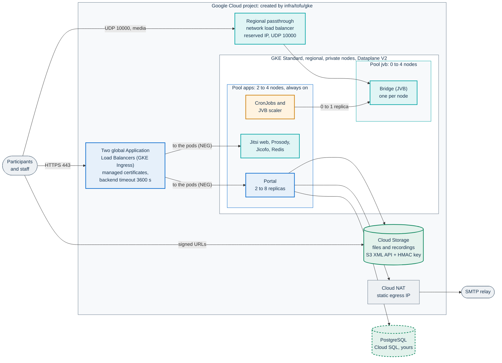
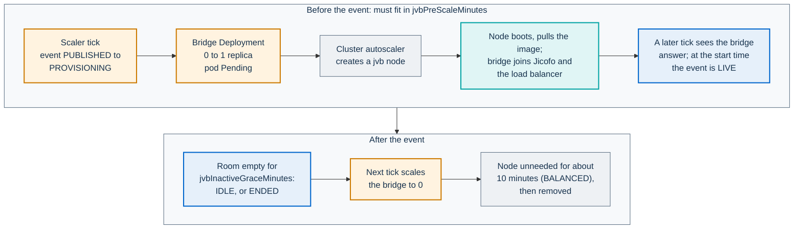

# Installing on Google Kubernetes Engine (GKE)

This guide installs PA Webinar on a GKE Standard cluster with the full
profile: bridges (Jitsi Videobridge, JVB) on a dedicated node pool that scales
to zero, the portal on an always-on pool, Cloud Storage for recordings and
materials. The infrastructure comes from the OpenTofu module in
[`infra/tofu/gke`](../../infra/tofu/gke/README.md), and the chart is layered
with [`examples/values-gke.yaml`](../../infra/helm/pa-webinar/examples/values-gke.yaml).

> **Status: not yet verified.** Nobody has applied this module to a real
> Google Cloud project or run an event on GKE. Everything below was checked
> without a project: static validation, tests against a mocked provider and
> chart rendering (see [What has been checked](#what-has-been-checked)). The
> GKE behavior described here comes from Google's documentation. Read the
> page as a reviewed plan, and budget time for a trial installation before the
> first real event.

The module README is the reference for every variable and output. This page
is the path from an empty project to a first event, with the decisions, the
checks and the limits. How to choose a platform, and the checklist common to
all of them, are in [Installing PA Webinar](README.md); to try the chart on a
workstation first, see [Try PA Webinar on minikube](minikube.md). Chart keys
are described in [Deploying with Helm](../DEPLOYMENT.md) and environment
variables in [Configuration](../CONFIGURATION.md).

On this page:

- [What has been checked](#what-has-been-checked)
- [What you get](#what-you-get)
- [Checklist](#checklist)
- [Minimum requirements](#minimum-requirements)
- [Three decisions](#three-decisions)
- [Install](#install)
- [How scaling works on GKE](#how-scaling-works-on-gke)
- [Storage on Cloud Storage](#storage-on-cloud-storage)
- [Logs and personal data](#logs-and-personal-data)
- [Upgrades and maintenance](#upgrades-and-maintenance)
- [Known limitations](#known-limitations)
- [Removing the installation](#removing-the-installation)
- [Related pages](#related-pages)

## What has been checked

| Check | How | Result |
|---|---|---|
| The module is valid | `tofu fmt -check -recursive`, then `tofu init -backend=false -lockfile=readonly` and `tofu validate` in a clean copy, with OpenTofu 1.11 and the `hashicorp/google` provider 8.4 pinned by the committed lock file; the same with Terraform 1.16 | Valid with both tools |
| The module does what it says | `tofu test` and `terraform test` with `infra/tofu/gke/tests/offline.tftest.hcl`: a mocked provider, three combinations of choices (the defaults; TURN on; a public IP per bridge node with ingress-nginx and the optional pools). The assertions cover the pools, the firewall rule, the distinct addresses in the chart values, the TLS names, the log settings and the ingress manifest | Every run passes. Deliberately wiring the bridge address to the NAT address, or emptying the portal TLS entry, makes runs fail |
| No insecure default | `trivy config` on the module | No open finding. The accepted exceptions (flow logs, bucket versioning, bucket access logs, customer-managed keys) are commented in the code and explained in [Logs and personal data](#logs-and-personal-data) |
| The chart renders on GKE | `helm template` of `values-full.yaml` + `values-gke.yaml` + the module's `helm_values` from the tests, for the GKE Ingress, for ingress-nginx with a public IP per bridge node, and for TURN with and without UDP | Every variant renders |
| The layering on this page | `helm template` of the exact file order in [step 7](#7-install-the-chart), with an installation file and a private file as described there, on Helm 4.2 | Renders. The migration initContainer uses `v<version>-migrate`, the scaler runs every 2 minutes, the bridge Deployment starts at 0 replicas on the `jvb` pool, and `JVB_SCALER_ENABLED` is `"true"` |
| The storage key never shows | The HMAC block of [step 4](#4-create-the-namespace-and-the-secrets), with a stubbed `tofu` and `kubectl patch --local` | With a key, the four storage keys are set. Without one, it stops with "no HMAC key in the state" and patches nothing |
| Chart invariants | `scripts/validate-chart.sh` | Passes. It has no GKE profile |

Not checked: `tofu plan` or `apply` against the Google Cloud API, including
the log exclusion filter; the load balancers, certificates and firewall rules
that GKE creates; the media path; Cloud Storage uploads; the scale-up chain
and its timing; the GPU pool (no GPU was powered on).

## What you get

With the module's default choices (GKE Ingress, one bridge behind a network
load balancer, TURN off):



- **The module creates** the VPC with Cloud NAT, the regional Standard
  cluster with private nodes, the `apps` and `jvb` pools (and, if you ask,
  `jibri` and `gpu`), two Cloud Storage buckets with an HMAC key, the static
  IPs, a TLS policy, the log exclusion and, optionally, DNS records. The full
  list is in [What it creates](../../infra/tofu/gke/README.md#what-it-creates).
- **You provide** PostgreSQL (Cloud SQL with a private IP, or the in-cluster
  database with `postgresql.enabled: true`), an SMTP relay, the Kubernetes
  Secrets, access to the container images, and, with ingress-nginx or TURN,
  cert-manager.
- **Media never passes through the portal or the HTTP load balancers.**
  Browsers send UDP straight to the bridge's address, as on every platform
  ([Ports and firewall](../INFRASTRUCTURE.md#ports-and-firewall)).

This page uses `videocall` as the Helm release and namespace, like the module
README and `examples/values-full.yaml`, whose Secret names
(`videocall-secrets`, `videocall-jitsi-jwt`) follow from it.

## Checklist

Tick every item in order. The details are in the sections that follow. The
items that apply to every platform, and the organizational ones, are in
[Checklist before you install](README.md#checklist-before-you-install).

**Before `tofu apply`**

- [ ] A Google Cloud project with billing, dedicated to this installation if
      possible.
- [ ] Quotas in the region: CPUs for E2 and N2 (G2 or A2 for the GPU pool),
      regional and global static IPs, and GPUs if you turn the GPU pool on. The
      module reserves up to four regional IPs (NAT egress, bridge, TURN and,
      with ingress-nginx, the ingress) and, with the GKE Ingress, two global
      ones. A pool that cannot get a VM leaves its pods `Pending` at the start
      of an event.
- [ ] Permissions for whoever runs OpenTofu: Owner on a dedicated project, or
      Kubernetes Engine Admin, Compute Network Admin, Compute Security Admin,
      Service Account Admin, Project IAM Admin, Storage Admin, Storage HMAC Key
      Admin, Service Usage Admin, Logs Configuration Writer, and DNS
      Administrator if the module writes your DNS records.
- [ ] Organization policies that would block the design, common in
      public-sector landing zones: HMAC keys
      (`constraints/storage.restrictAuthTypes`), load balancer types
      (`constraints/compute.restrictLoadBalancerCreationForTypes`) and, only
      for a public IP per bridge node, external IPs on VMs
      (`constraints/compute.vmExternalIpAccess`).
- [ ] A remote state backend with restricted access: the state holds the
      HMAC secret ([Storage on Cloud Storage](#storage-on-cloud-storage)).
- [ ] The networks of the administrators and of the deploying CI, for
      `master_authorized_networks`.
- [ ] Two DNS names, for example `webinar.example.com` (portal) and
      `meet.webinar.example.com` (conference), plus `turn.webinar.example.com`
      if you turn TURN on.
- [ ] The [three decisions](#three-decisions): HTTP ingress, bridge
      exposure, TURN.
- [ ] A maintenance window that no event overlaps
      ([Upgrades and maintenance](#upgrades-and-maintenance)).

**Before `helm install`**

- [ ] The chart's subcharts built from `Chart.lock` ([step 1](#1-get-the-repository-and-the-subcharts)).
- [ ] PostgreSQL reachable from the cluster, and its `DATABASE_URL`.
- [ ] An SMTP relay that accepts mail from the Cloud NAT address
      (`tofu output nat_ips`).
- [ ] Credentials for the container images, or a mirror
      ([Prerequisites](../DEPLOYMENT.md#prerequisites)).
- [ ] The Secrets, the storage keys, the pinned internal conference passwords
      ([step 4](#4-create-the-namespace-and-the-secrets)).
- [ ] With the GKE Ingress: the BackendConfigs applied **before** the chart
      ([step 5](#5-prepare-the-http-ingress)).
- [ ] Both image tags in your installation file: `<version>` for the app and
      `v<version>-migrate` for the migrations ([step 7](#7-install-the-chart)).

**Before the first real event**

- [ ] Both certificates `Active`, and the live-room stream not cut at
      30 seconds ([step 8](#8-check)).
- [ ] A test event joined from two devices on different networks, with audio
      and video ([First-run checks](../DEPLOYMENT.md#first-run-checks)).
- [ ] A bridge brought up from zero, and its cold start measured and covered
      by **Pre-scale lead time (minutes)**
      ([How scaling works on GKE](#how-scaling-works-on-gke)).
- [ ] If you record with Jibri: its upload script mounted
      ([Mount the finalize script](../operations/recording-setup.md#mount-the-finalize-script)).
- [ ] A decision on TURN, and on where logs live
      ([Logs and personal data](#logs-and-personal-data)).
- [ ] A database backup of your own: the project has no backup procedure yet
      ([Backups](../REUSE.md#backups)).

## Minimum requirements

**On the machine you install from:** OpenTofu 1.8 or later (validated with
1.11) or Terraform (validated with 1.16), `gcloud` with the
`gke-gcloud-auth-plugin`, `kubectl`, Helm 3 or 4, and `jq`.

**In Google Cloud:** a GKE Standard cluster (Autopilot is not supported: the
bridge pool needs its own label, taint and scale to zero). For TURN, a recent
GKE version, see [TURN](#turn-turn_enabled).

**Node pools.** These are the module's defaults, a starting point and not a
measurement on GKE:

| Pool | Default machine | Nodes | Runs |
|---|---|---|---|
| `apps` | `e2-standard-4` (4 vCPU, 16 GiB) | 2 to 4, across zones | Portal, CronJobs, JVB scaler, recorder controller, Jitsi signaling, Redis, coturn |
| `jvb` | `n2-standard-4` (4 vCPU, 16 GiB), regular VMs, never spot | 0 to 4 | One bridge per node; Jibri too, unless you create the `jibri` pool |
| `jibri` (optional) | `n2-standard-4` | 0 to 2 | Jibri, kept away from the bridge's CPU |
| `gpu` (optional) | `g2-standard-16` (16 vCPU, 64 GB, one NVIDIA L4) | 0 to 1 | AI post-production worker |

What the numbers measured elsewhere say about these shapes:

- **One bridge carries one event.** More bridges add concurrent events, not
  participants per event
  ([Capacity is two numbers](../architecture/scaling.md#capacity-is-two-numbers)).
  Size the `jvb` machine for your largest single event.
- **A 4-vCPU, 16 GiB bridge node** is the shape of the
  [small-bridge reference run](../LOAD-TESTING.md#small-bridge-3-cpus): a
  bridge limited to 3 CPUs and 2 GiB carried about 25 participants all on
  camera, or 60 webinar viewers at about half its stress budget, measured with
  full-media bots and the bridge's own statistics. Some 60 to 80-participant
  webinar runs ended with that bridge killed for exceeding its 2 GiB memory
  limit; the full profile gives the bridge a 4 GiB limit (3 CPUs, request
  1 CPU and 2 GiB).
- **Bandwidth grows with the square of the cameras in tile view:** 2.7, 11.6
  and 46.9 Mbps of bridge output at 5, 10 and 20 participants on camera with
  180p thumbnails, read from the bridge statistics on a single-node lab VM
  ([One node under load](k3s.md#one-node-under-load)). A real event on a managed cluster
  used about 1 Mbps of bridge output per participant
  ([A real event](../LOAD-TESTING.md#a-real-event)).
- **The application pool** needs at least two nodes, for the two portal
  replicas. In the lab the portal, PostgreSQL and Redis together used at most
  about 0.25 core and under 300 MiB at 20 participants
  ([Requirements](README.md#requirements)). Size the pool
  from the resource requests.
- **The GPU node must hold the worker's requests** (8 CPU and 32Gi in the
  chart). A `g2-standard-16` offers about 15.9 CPU and 58 GiB allocatable, a
  `g2-standard-8` about 7.9 CPU and 28 GiB: with the smaller machine the pool
  never scales up, unless you lower `postprod.worker.resources` (commented
  example in `values-gke.yaml`). These figures come from GKE's published
  reservation formula, not from a node. One L4 (24 GB) is enough for
  transcription and diarization, not for the default language model, which
  needs about 48 GB: use `a2-ultragpu-1g` with `nvidia-a100-80gb` where the
  region offers it ([Provisioning a GPU node pool](../POSTPROD.md#provisioning-a-gpu-node-pool)).

## Three decisions

Each one is a module variable and a matching block in `values-gke.yaml`.
Change both together.

### HTTP ingress: `ingress_mode`

| | `gce` (default) | `nginx` |
|---|---|---|
| What serves HTTPS | GKE Ingress: one global external Application Load Balancer per Ingress, run by Google | ingress-nginx, installed by you, behind a regional passthrough load balancer |
| Addresses | Two global IPs, one per name | One regional IP for both names |
| Certificates | Google-managed (`ManagedCertificate`), issued once the name resolves, which can take up to an hour | cert-manager with a ClusterIssuer named `letsencrypt-prod` |
| `values-gke.yaml` | As it is | Remove the blocks marked `[Ingress GCE]` from your copy: the full profile already carries the ingress-nginx values, and the module's output adds the TLS entries |
| `TRUSTED_PROXY_HOPS` | `"1"`: the load balancer appends `<client>,<load-balancer>` to `X-Forwarded-For` | `0`, the default (remove the line) |
| What is lost | The conference root redirect and the full profile's rate limits, which are ingress-nginx annotations. Use Cloud Armor for limits at the edge | Nothing in the chart. The ingress-nginx project has announced its retirement |

**The timeout that breaks the live room.** Google's load balancer closes
every request when the backend service timeout expires: 30 seconds unless
you set it. The timeout counts the whole response, not idle time, so the
25-second keepalive of the live room's event streams (Server-Sent Events)
does not help. Without a longer timeout:

- the live room's streams (chat, live panels) end every 30 seconds, and the
  chat shows **Reconnecting…** while the panels fall back to polling
  ([Chat and live panels drop](../operations/troubleshooting.md#chat-and-live-panels-drop-after-about-60-seconds));
- the conference's signaling is cut. The chart runs XMPP over BOSH (the
  rendered Jitsi config has `ENABLE_XMPP_WEBSOCKET` and
  `ENABLE_COLIBRI_WEBSOCKET` off), and the server holds a BOSH request for up
  to a minute.

The module's `gce_ingress_manifest` output creates two BackendConfigs with
`timeoutSec: 3600`, referenced by the Service annotations in
`values-gke.yaml`. Each stream is then closed once an hour, and the browser
reopens it on its own. If you turn on the conference's WebSocket
(`websockets.xmpp.enabled` in the Jitsi subchart), the same timeout becomes
the longest life of each WebSocket. Apply the BackendConfigs before the
chart, so that the load balancer is created with them.

**The Ingress class.** GKE picks an Ingress only by the
`kubernetes.io/ingress.class` annotation: with `ingressClassName: gce` alone,
no controller serves it and the portal does not answer. `values-gke.yaml`
sets both to `gce`, which the chart requires to match; with that class the
chart also drops the full profile's ingress-nginx annotations.

### Bridge exposure: `jvb_exposure`

Read [The single-IP pitfall](../architecture/scaling.md#the-single-ip-pitfall)
first: every bridge must be reachable on an address that it alone announces.

| | `load_balancer` (default) | `node_public_ip` |
|---|---|---|
| Address | A reserved regional IP in front of the bridge's `LoadBalancer` Service, with `externalTrafficPolicy: Local` | A public IP on each bridge node (a one-to-one NAT that the node's interface does not carry) |
| What the bridge announces | The reserved IP (`publicIPs`); no STUN lookup | Its node's public IP, learned from a STUN server outside the cluster (`jvb_stun_servers`, by default the Jitsi project's third-party server) |
| Bridges | One: `JVB_MAX_REPLICAS: "1"`, so one event at a time | One per node, up to the pool maximum |
| UDP firewall | GKE creates the rules for the load balancer; every node stays private | The module's rule `<name_prefix>-jvb-media`: UDP `jvb_udp_port` from `media_ingress_cidrs` (default anywhere) to nodes tagged `<name_prefix>-jvb` |
| Also needed | Nothing | The `privileged` Pod Security level in the namespace (host port); `jvb_udp_port` outside 30000-32767, which the module enforces because with Dataplane V2 a host port in the NodePort range may receive no traffic |
| Status | The topology that runs real events on AKS; not run on GKE | Not verified on any platform |

The participants' networks decide the source ranges: restrict
`media_ingress_cidrs` only for an installation used from known networks.

### TURN: `turn_enabled`

Participants on networks that block UDP, common in public-sector offices,
get no audio or video without TURN over TLS on port 443. TURN is off by
default in the module and in `values-gke.yaml`; turn it on in both places.

- `turn_enabled = true` reserves an IP for the chart's coturn and, with
  `turn_hostname`, a DNS record. The commented TURN block of `values-gke.yaml`
  turns coturn on; its keys are described in
  [coturn (TURN and TURNS)](../DEPLOYMENT.md#coturn-turn-and-turns).
- **GKE version.** The reserved IP reaches the coturn Service only through the
  annotation `networking.gke.io/load-balancer-ip-addresses`, which GKE reads on
  an external Service only with
  `loadBalancerClass: networking.gke.io/l4-regional-external`, from GKE
  1.33.1-gke.1779000. UDP 3478 and TCP 443 on the same address also need the
  mixed-protocol load balancer, generally available from GKE
  1.36.2-gke.1498000. Between the two, keep the class and set
  `coturn.turn.transport: tcp`. Below 1.33.1-gke.1779000 the chart cannot give
  coturn the reserved IP.
- **Certificate.** The TURN name points at coturn, not at the ingress, so
  HTTP-01 cannot validate it: use cert-manager with a DNS-01 solver on Cloud
  DNS (it can use the cluster's Workload Identity), or a TLS Secret of your
  own.
- **Credentials.** Pin `jitsi-meet.coturn.staticAuth.secret` in your private
  file: `values-gke.yaml` sets `jitsi.requirePinnedCredentials`, so the render
  stops without it.

## Install

Every command runs from the repository root. Keep your installation's files
in a folder outside the repository, here `~/pa-webinar-config`, so that they
cannot end up in a commit. Nothing in steps 2 to 7 has been run against a real
project (see [What has been checked](#what-has-been-checked)).

### 1. Get the repository and the subcharts

```bash
git clone https://github.com/italia/pa-webinar.git
cd pa-webinar
helm repo add bitnami https://charts.bitnami.com/bitnami
helm repo add jitsi-contrib https://jitsi-contrib.github.io/jitsi-helm/
helm dependency build infra/helm/pa-webinar
```

Use `build`, not `update`: `build` installs the versions pinned in
`Chart.lock` ([Get the chart](../DEPLOYMENT.md#get-the-chart)).

### 2. Create the infrastructure

Write `infra/tofu/gke/terraform.tfvars` from `terraform.tfvars.example`
(ignored by git). Only `project_id`, the two DNS names and
`master_authorized_networks` are required; the three decisions are the
variables `ingress_mode`, `jvb_exposure` and `turn_enabled`. Configure a
remote backend in `versions.tf` (a commented `gcs` example is there), then:

```bash
tofu -chdir=infra/tofu/gke init
tofu -chdir=infra/tofu/gke plan -out=gke.tfplan
tofu -chdir=infra/tofu/gke apply gke.tfplan
```

Every variable, with its default, is in
[`variables.tf`](../../infra/tofu/gke/variables.tf) and in the module README.

### 3. Get the cluster credentials

```bash
$(tofu -chdir=infra/tofu/gke output -raw get_credentials_command)
```

It runs `gcloud container clusters get-credentials` and needs the
`gke-gcloud-auth-plugin`. The API answers only from
`master_authorized_networks`.

### 4. Create the namespace and the Secrets

1. Create the namespace `videocall`, the image pull Secret
   ([The values file for your installation](../DEPLOYMENT.md#the-values-file-for-your-installation))
   and the three Secrets of step 1 of
   [Standard profile](../DEPLOYMENT.md#standard-profile), with `-n videocall`
   in every command: `videocall-secrets`, `videocall-jitsi-jwt` and
   `videocall-datastore`. `DATABASE_URL` points at your Cloud SQL private
   address (Cloud SQL private IP needs Private Service Access on the module's
   VPC).

2. Add the storage keys to the application Secret. The secret travels only
   through a pipe: it is not printed, and it never appears on a command line,
   where other users of the machine could read it in the process list. It
   needs `jq`:

   ```bash
   ACCESS_ID="$(tofu -chdir=infra/tofu/gke output -raw storage_hmac_access_id)"
   tofu -chdir=infra/tofu/gke output -json storage_hmac_secret \
     | jq --arg id "$ACCESS_ID" 'if . == null then error("no HMAC key in the state")
         else {stringData: {
           STORAGE_FILES_S3_ACCESS_KEY_ID: $id, STORAGE_FILES_S3_SECRET_ACCESS_KEY: .,
           RECORDING_S3_ACCESS_KEY_ID: $id,     RECORDING_S3_SECRET_ACCESS_KEY: .}} end' \
     | kubectl -n videocall patch secret videocall-secrets --type merge --patch-file /dev/stdin
   ```

   With `create_hmac_key = false` the state holds no key: the command stops
   with an error and leaves the Secret as it was. Put your own key in the same
   four entries.

3. Write the private file with the datastore Secret and the pinned internal
   conference passwords, Jibri's included, as in step 2 of
   [Standard profile](../DEPLOYMENT.md#standard-profile). Generate each
   password once (`openssl rand -hex 16`) and pass the same file to every
   upgrade: unpinned passwords restart the conference on every `helm upgrade`
   and drop live calls
   ([Pin the conference's internal credentials](../DEPLOYMENT.md#pin-the-conferences-internal-credentials)).

   ```bash
   mkdir -p ~/pa-webinar-config && chmod 700 ~/pa-webinar-config
   # then write ~/pa-webinar-config/pa-webinar.private.yaml
   ```

   With TURN on, add `jitsi-meet.coturn.staticAuth.secret` to it.

### 5. Prepare the HTTP ingress

**With `ingress_mode = "gce"`**, apply the BackendConfigs, the
FrontendConfig (HTTP to HTTPS redirect, TLS 1.2 or later) and the managed
certificates before the chart:

```bash
tofu -chdir=infra/tofu/gke output -raw gce_ingress_manifest \
  | kubectl -n videocall apply -f -
```

**With `ingress_mode = "nginx"`**, install ingress-nginx on the reserved IP.
`externalTrafficPolicy: Local` keeps the client address for the portal's
per-IP limits, and the namespace must stay `ingress-nginx`, because the log
exclusion finds the controller by it:

```bash
helm upgrade --install ingress-nginx ingress-nginx \
  --repo https://kubernetes.github.io/ingress-nginx --version 4.15.1 \
  -n ingress-nginx --create-namespace \
  --set controller.service.loadBalancerIP="$(tofu -chdir=infra/tofu/gke output -raw ingress_nginx_ip)" \
  --set controller.service.externalTrafficPolicy=Local \
  --set controller.nodeSelector.workload=applications
```

Then install cert-manager with a ClusterIssuer named `letsencrypt-prod`
([DNS and TLS](../INFRASTRUCTURE.md#dns-and-tls)). The pinned cert-manager
command in [the AKS reference](../../infra/tofu/aks/README.md#4-install-the-cluster-add-ons)
does not depend on the cloud. On private nodes, the ingress-nginx admission
webhook can time out (`failed calling webhook`): allow TCP 8443 from the
control plane to the `apps` nodes, or turn the webhook off.

### 6. Point DNS at the addresses

Create the A records listed by `tofu -chdir=infra/tofu/gke output dns_records`,
unless the module wrote them (`dns_managed_zone`). Google-managed certificates
are issued only after the name resolves to its Ingress.

### 7. Install the chart

Write the installation file. On GKE it carries only the image tags, the pull
Secret and the scaler cadence. Do not copy the hosts, `tls` and `publicURL`
blocks of the example in
[The values file for your installation](../DEPLOYMENT.md#the-values-file-for-your-installation):
the module's output sets the names and, with the GKE Ingress, `tls` must stay
empty.

```yaml
# ~/pa-webinar-config/pa-webinar.values.yaml
app:
  image:
    tag: "<version>"               # release number, without a leading "v"
  migration:
    image:
      tag: "v<version>-migrate"    # with a leading "v"
  imagePullSecrets:
    - name: ghcr-secret
jvbScaler:
  schedule: "*/2 * * * *"          # values-full.yaml has a slower schedule
```

Without the migration tag, the chart derives `<version>-migrate`, which is not
published for every release, and the portal pods stay in
`Init:ImagePullBackOff`
([Migration image tags](../development/ci-and-release.md#migration-image-tags)).
The patched Jitsi web image needs the same pull Secret
([Web image and pull secrets](../DEPLOYMENT.md#web-image-and-pull-secrets)).

Then:

```bash
tofu -chdir=infra/tofu/gke output -raw helm_values > ~/pa-webinar-config/gke-infra.yaml
helm upgrade --install videocall ./infra/helm/pa-webinar -n videocall \
  -f infra/helm/pa-webinar/examples/values-full.yaml \
  -f infra/helm/pa-webinar/examples/values-gke.yaml \
  -f ~/pa-webinar-config/gke-infra.yaml \
  -f ~/pa-webinar-config/pa-webinar.values.yaml \
  -f ~/pa-webinar-config/pa-webinar.private.yaml \
  --wait --timeout 15m
```

With ingress-nginx, pass your copy of `values-gke.yaml` without the
`[Ingress GCE]` blocks. `gke-infra.yaml` holds DNS names, reserved addresses
and bucket names: no secret, but it describes your installation.

### 8. Check

```bash
kubectl -n videocall get managedcertificate   # Status: Active (GKE Ingress)
kubectl -n videocall get ingress              # the reserved addresses
kubectl -n videocall get svc -l app.kubernetes.io/component=jvb
kubectl -n videocall describe ingress videocall-pa-webinar | grep -i backend
kubectl -n videocall get cronjob videocall-pa-webinar-jvb-scaler
```

With no event scheduled, the bridge Deployment stays at zero replicas and the
`jvb` pool at zero nodes: that is the expected state. The administration's
infrastructure page shows **Scale-to-zero active**.

Check that the load balancer does not cut the live room. The live stream of a
publicly visible event needs no token; leave this running for more than
30 seconds:

```bash
curl -sN https://webinar.example.com/api/events/<slug>/live/stream
```

A `ping` message should arrive every 25 seconds without the connection
closing. If it ends at 30 seconds, the BackendConfig is not attached: check
the `cloud.google.com/backend-config` annotation on the Services.

Then follow [First-run checks](../DEPLOYMENT.md#first-run-checks): the
post-install notes, health and readiness, sign-in with the instance API key,
a named administrator, and a room joined from two devices on different
networks.

## How scaling works on GKE



- **Bridges scale to zero.** The chart's JVB scaler (a CronJob, every
  2 minutes with the installation file above) raises the bridge Deployment
  from zero when an event is less than `jvbPreScaleMinutes` away (default 15,
  in `app/prisma/schema.prisma`). The pod stays `Pending` until the cluster
  autoscaler creates a `jvb` node. After the event the scaler takes the
  bridge back to zero, and GKE removes the empty node after it has been
  unneeded for about ten minutes, with the `BALANCED` autoscaling profile the
  module sets. The mechanism is in
  [Scaling the media plane](../architecture/scaling.md#node-pool-scale-to-zero).
- **Measure the cold start.** Booting a VM and pulling the bridge image takes
  minutes, and nobody has measured it on GKE. After the first bridge has come
  up from zero, measure the gap as described in
  [Lead time and cold start](../operations/jvb-scaler.md#lead-time-and-cold-start),
  add two tick intervals, and set **Pre-scale lead time (minutes)** to cover
  it. Instant calls and rooms woken from `IDLE` pay the whole chain when
  someone arrives.
- **Bridges are not moved.** The bridge and Jibri pods carry
  `cluster-autoscaler.kubernetes.io/safe-to-evict: "false"`, so the autoscaler
  does not evict them to consolidate nodes during an event. The `jvb` pool
  uses regular VMs, never spot: a reclaimed VM drops every participant on it
  ([Not spot](../architecture/scaling.md#not-spot)).
- **One bridge per node, one conference per bridge.** With `load_balancer`
  there is one bridge in total. With `node_public_ip`, keep
  `JVB_MAX_REPLICAS` at or below the pool maximum (`jvb_pool.max_nodes`, plus
  room for Jibri if it shares the pool); replicas above it stay `Pending`
  ([One bridge per node](../architecture/scaling.md#one-bridge-per-node)).
- **The portal** scales from 2 to 8 replicas on CPU and memory (the full
  profile's HorizontalPodAutoscaler), and the autoscaler adds `apps` nodes up to
  `apps_pool.max_nodes` when they no longer fit.
- **The GPU pool** is driven by the post-production queue, not by the JVB
  scaler: each worker Job brings up a `gpu` node, removed when the Jobs are
  done. GKE installs the NVIDIA driver and taints GPU nodes with
  `nvidia.com/gpu`, which pods that request a GPU tolerate automatically: do
  not install the GPU Operator's driver on top.

Tuning the scaler is covered in [Running the JVB scaler](../operations/jvb-scaler.md).

## Storage on Cloud Storage

- **Why HMAC.** The portal reaches Cloud Storage only through its
  S3-compatible XML API, signed with a static key pair: its S3 client is
  always built with an access key, so Workload Identity cannot be used for
  storage ([S3-compatible services](../configuration/storage.md#s3-compatible-services)).
  The module creates a service account with access to the two buckets only,
  and an HMAC key for it. An organization policy that restricts HMAC
  authentication therefore disables recording and uploads.
- **The chart settings** are in `values-gke.yaml`: provider `s3` for files,
  `gcs` for recordings, endpoint `https://storage.googleapis.com`, region
  `auto`. The bucket names come from the module's output.
- **Browser uploads.** Staff upload videos from the browser straight to the
  recordings bucket with a signed URL. The module sets CORS on that bucket for
  `https://<portal_hostname>` (or `portal_origins`), and aborts incomplete
  multipart uploads after 7 days.
- **Deletion is final.** Soft delete is off (`soft_delete_retention_seconds =
  0`; Google's default would keep deleted objects for 7 days), versioning is
  off and access logs are off, so a recording removed by the retention rules
  does not survive in a hidden copy, and the viewers' addresses are not
  logged. The buckets are in the cluster's region unless you set
  `storage_location`.
- **The state holds the secret.** Keep the OpenTofu state in a remote backend
  with restricted access. To keep the key out of the state, set
  `create_hmac_key = false` and create it yourself
  (`gcloud storage hmac create <storage_service_account>`). Rotation is in
  [State and secrets](../../infra/tofu/gke/README.md#state-and-secrets).

## Logs and personal data

Access logs carry credentials: the moderator link, the participant links and
the chat stream carry `?token=`, and the conference address carries `?jwt=`,
whose payload includes the participant's name
([Credentials in URLs](../architecture/security.md#credentials-in-urls)).

- **GKE Ingress request logs** are on by default for every Ingress. Both
  BackendConfigs set `logging.enable: false`. To diagnose a problem, turn it on
  for a short time with a low `sampleRate`, knowing what the lines contain.
- **Container logs** go to the project's `_Default` log bucket. With
  `exclude_proxy_access_logs = true` (the default), an exclusion drops every
  line of the ingress-nginx controller (namespace `ingress-nginx`) and of the
  conference web server (pods named `<release>-jitsi-meet-web-…`), errors
  included. `kubectl logs` still shows them.
- **What stays your decision.** The portal, the other Jitsi components and
  coturn still log to `_Default`. That bucket's location is fixed when the
  project is created (global unless your organization sets a default) and it
  keeps logs for 30 days by default: route the sink to a regional bucket if
  you need residency. An organization or folder sink, common in landing
  zones, ignores project exclusions: add the same exclusion there.
- **Flow logs are off** (`enable_flow_logs`): on the bridge nodes they would
  record every participant's IP address.

Record these choices in your privacy notes ([GDPR](../GDPR.md)).

## Upgrades and maintenance

- **A node upgrade drops the conference on that node.** GKE upgrades and
  repairs nodes on its own. The module uses surge upgrades (one extra node,
  none unavailable), but draining a bridge node still ends its conference.
  The maintenance window (`maintenance_window`, daily 01:00-05:00 UTC by
  default) keeps upgrades away from office hours; GKE requires at least
  48 hours available in every 32 days. Around an important event, add a
  maintenance exclusion.
- **PodDisruptionBudgets delay, they do not block.** Google's documentation
  states that a node upgrade respects a PodDisruptionBudget for up to one
  hour, then evicts the pod anyway. With TURN on, the coturn budget
  (`minAvailable: 1`, one replica by default) delays the drain of its node by
  up to an hour, and TURN still drops when the pod goes
  ([coturn (TURN and TURNS)](../DEPLOYMENT.md#coturn-turn-and-turns)).
- **Chart upgrades** follow [Upgrades and rollback](../operations/upgrades.md):
  pass both image tags and the same private file every time.

## Known limitations

- **Not verified on Google Cloud.** See [What has been checked](#what-has-been-checked).
- **One event at a time with the default exposure.** `node_public_ip`
  removes the limit but is unverified, and depends on a STUN server outside
  the cluster, a third party by default.
- **In-cluster peers and the bridge address.** `values-gke.yaml` sets
  `JVB_ADVERTISE_PRIVATE_CANDIDATES: "false"`, so the bridge announces only the
  load balancer's address. The recorder bot, Jibri and coturn run inside the
  cluster and must then reach the bridge through that address. Whether this
  works on GKE has not been checked. The AKS reference keeps the pod address
  announced for exactly this reason
  ([Media: bridges and TURN](../../infra/tofu/aks/README.md#media-bridges-and-turn)).
- **The GKE Ingress drops what only ingress-nginx does**: the conference root
  redirect and the ingress rate limits. Streams are reopened once an hour.
- **TURN needs a recent GKE and a DNS-01 certificate**
  ([TURN](#turn-turn_enabled)). That coturn relays correctly to a bridge behind
  the load balancer has not been checked.
- **Storage keys are static** ([Storage on Cloud Storage](#storage-on-cloud-storage)).
- **Composite recording** needs Jibri's upload script mounted by hand
  ([Mount the finalize script](../operations/recording-setup.md#mount-the-finalize-script)).
  Jibri's 2Gi of shared memory, set in `values-gke.yaml`, counts against its
  4Gi memory limit.
- **Monitoring.** A new GKE cluster has no Prometheus Operator, so
  `values-gke.yaml` turns the ServiceMonitors off. Google Cloud Managed Service
  for Prometheus (`enable_managed_prometheus`) reads `PodMonitoring` objects,
  which the chart does not render, and its query API needs Google credentials,
  while the portal's `PROMETHEUS_URL` expects an unauthenticated PromQL
  endpoint ([Monitoring and health](../operations/monitoring.md)).
- **Network policies.** Dataplane V2 enforces the chart's NetworkPolicy. With
  the GKE Ingress, traffic reaches the portal pods from Google's front ends
  and health checks (`35.191.0.0/16`, `130.211.0.0/22`), which need `ipBlock`
  rules: see the commented block in `values-gke.yaml`. With Cloud DNS or
  NodeLocal DNSCache, add their address to `networkPolicy.egress.dns.to`
  ([Network policies](../INFRASTRUCTURE.md#network-policies)). Not tested.
- **Shared VPC.** The module creates its own VPC. In a Shared VPC, GKE may
  lack the permission to create load balancer firewall rules in the host
  project.

The limitations common to every platform are in
[Known limitations](README.md#known-limitations).

## Removing the installation

`deletion_protection` is on by default, and the buckets have
`force_destroy = false`: `tofu destroy` stops at the cluster and at any bucket
that still holds objects. To remove a trial environment, set
`deletion_protection = false` and apply, empty the buckets yourself,
knowingly, then run `tofu -chdir=infra/tofu/gke destroy`. The project APIs
stay enabled.

## Related pages

- [Installing PA Webinar](README.md): choosing a platform, the common
  checklist, the limits that apply everywhere.
- [GKE reference infrastructure](../../infra/tofu/gke/README.md): every
  variable, output and resource of the module.
- [Infrastructure reference](../INFRASTRUCTURE.md): sizing, networking,
  network policies and images, for every platform.
- [Deploying with Helm](../DEPLOYMENT.md): profiles, Secrets, chart keys.
- [Configuration](../CONFIGURATION.md): environment variables.
- [Scaling the media plane](../architecture/scaling.md) and
  [Running the JVB scaler](../operations/jvb-scaler.md).
- [Object storage](../configuration/storage.md).
- [AI post-production](../POSTPROD.md).
- [Troubleshooting](../operations/troubleshooting.md).
