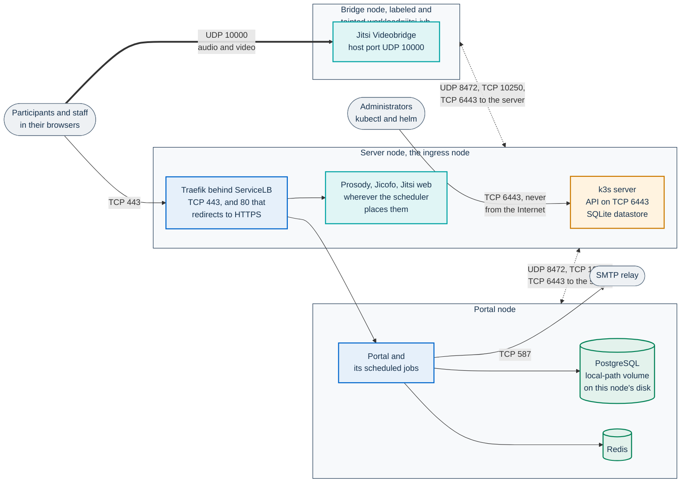

# Installing on your own VMs with k3s

This page is for the IT staff of a public body that runs PA Webinar on its own
virtual machines, with no managed Kubernetes service. It installs
[k3s](https://docs.k3s.io/), a lightweight Kubernetes distribution, on one VM
or on three, and then the same Helm chart that runs on managed clusters.

**Status: tested in lab.** Both layouts were installed from scratch on lab VMs
and loaded with synthetic participants. No real event has run on them yet. The
statuses are defined in [Installing PA Webinar](README.md).

This page owns the k3s procedure, its network plan, its failure behavior and
its measurements. It links to the pages that own the rest:

- [Installing PA Webinar](README.md): choosing between setups, the common
  checklist and the limitations shared by every setup;
- [Infrastructure reference](../INFRASTRUCTURE.md): the sizing model, network
  design, network policies and images;
- [Deploying with Helm](../DEPLOYMENT.md): profiles, secrets and every chart key;
- [Configuration](../CONFIGURATION.md): environment variables, email, storage;
- [`infra/onprem/k3s/README.md`](../../infra/onprem/k3s/README.md): the
  reference for the scripts. Each script also has a `--help`. The scripts
  print their messages in Italian.

On this page:

- [Why k3s](#why-k3s)
- [Choose a layout](#choose-a-layout)
- [Requirements](#requirements)
- [Ports and firewall](#ports-and-firewall)
- [What `infra/onprem/k3s` provides](#what-infraonpremk3s-provides)
- [Install on one node](#install-on-one-node)
- [Install on three nodes](#install-on-three-nodes)
- [Proxy, registry mirror or no Internet](#proxy-registry-mirror-or-no-internet)
- [RHEL, Rocky Linux and AlmaLinux](#rhel-rocky-linux-and-almalinux)
- [Certificates](#certificates)
- [Behind a load balancer, reverse proxy or WAF](#behind-a-load-balancer-reverse-proxy-or-waf)
- [How it scales](#how-it-scales)
- [Backups](#backups)
- [Monitoring](#monitoring)
- [What is not highly available](#what-is-not-highly-available)
- [Upgrades and changes](#upgrades-and-changes)
- [Measured numbers](#measured-numbers)
- [Before the first real event](#before-the-first-real-event)
- [Known limitations](#known-limitations)
- [Not tested](#not-tested)

## Why k3s

PA Webinar is installed with a Helm chart: the portal, PostgreSQL, Redis and
the Jitsi Meet components are Kubernetes workloads, and the chart is the
supported way to run them. k3s gives you a conformant Kubernetes on ordinary
VMs, from one binary. It already contains what the chart's simple profile
needs:

- Traefik as ingress controller, exposed on ports 80 and 443 by k3s's
  ServiceLB;
- local-path storage for the database volume;
- a NetworkPolicy controller that enforces the chart's policies;
- metrics-server, for `kubectl top`.

Nothing else has to be installed in the cluster. Every chart setting that
differs from a managed cluster is in one values file,
`infra/helm/pa-webinar/examples/values-k3s.yaml`, layered on the simple
profile.

Other setups, for comparison:

- To try the chart on one workstation before you commit to VMs, use minikube
  ([Try PA Webinar on minikube](minikube.md)).
- Docker Compose is for development only
  ([Local development](../DEVELOPMENT.md)).
- For concurrent or large events, recording and AI post-production, a managed
  cluster with dedicated node pools ([AKS](aks.md), [GKE](gke.md),
  [EKS](eks.md)).

## Choose a layout

| Layout | For whom | Measured | What you give up |
|---|---|---|---|
| **One node**: one VM runs k3s and everything else | One public body with occasional events | 20 participants all on camera on 4 vCPU / 8 GiB: 1.84 cores peak, 3.4 GiB used | High availability: the VM is a single point of failure. Autoscaling. Jibri recording. TURN |
| **Three nodes**: a server that serves the ingress, a node for the portal and database, a node reserved for the bridge | A body that wants the bridge's CPU spikes kept away from the portal and the database | 20 participants all on camera; bridge node at 1.8 cores peak and 2.6 GiB | Still not highly available (see [What is not highly available](#what-is-not-highly-available)). No node autoscaling. Jibri, TURN |

Both run the simple profile: one portal replica, PostgreSQL and Redis in the
cluster, one bridge, no Jibri. Recording and video uploads need object storage
that you provide ([Storage](../configuration/storage.md)).



The diagram shows three nodes. With one node, the three boxes are the same VM
and the traffic between nodes does not exist. Media never passes through
Traefik or the portal: browsers send audio and video straight to the bridge.

## Requirements

- [ ] **VMs.** x86_64 with systemd. Tested on Debian 12, and on Rocky Linux 9
  with SELinux enforcing. The scripts also handle arm64, which was not tested.

  | Layout | Node | Minimum that measured sufficient | Recommended |
  |---|---|---|---|
  | One node | Everything | 4 vCPU, 8 GiB, 40 GB disk | 8 vCPU, 16 GiB and an uplink of 200 Mbit/s or more, for webinar-shaped events of about 50 people: a few cameras, a muted audience (estimated) |
  | Three nodes | Server: control plane, Traefik | 2 vCPU, 4 GiB, 30 GB | Same |
  | | Portal and database | 2 vCPU, 4 GiB, 30 GB | Same |
  | | Bridge | 4 vCPU, 4 GiB, 20 GB | 4 vCPU, 8 GiB, for 20–30 participants on camera (derived) |

  The minimums are what carried 20 participants on camera in the lab (see
  [Measured numbers](#measured-numbers)). The recommendations are derived from
  the cost model in
  [What a participant costs on the bridge](../INFRASTRUCTURE.md#what-a-participant-costs-on-the-bridge),
  not measured.
- [ ] **An address that participants reach.** Each node that serves clients
  has a public address on its interface, or a 1:1 NAT or port forward that
  keeps the port numbers. Behind NAT, the bridge must announce the public
  address (see [Ports and firewall](#ports-and-firewall)).
- [ ] **Uplink.** Plan at least 50 Mbit/s out for 20 people on camera with
  180p thumbnails, the measured floor, and more with 720p speakers. In tile
  view the bridge's outbound traffic grows with the square of the cameras.
- [ ] **Two DNS names**, one for the portal (for example `webinar.example.com`)
  and one for the conference (for example `meet.webinar.example.com`): two
  `A` records for the public address of the node that serves 80 and 443.
- [ ] **A TLS certificate that browsers trust**, for both names (see
  [Certificates](#certificates)).
- [ ] **An SMTP relay** that the nodes reach. Without it no email is sent:
  registration confirmations, reminders, staff sign-in links
  ([Email delivery](../configuration/email.md)).
- [ ] **A workstation** with a clone of the repository, `helm` 3.16 or later
  and `kubectl`. The lab installs used Helm 4; Helm 3.16 was checked by
  rendering the chart only.
- [ ] **A machine that prepares the images**, often the workstation itself:
  Linux or macOS, bash 3.2 or later, `helm`, `skopeo` and `python3`, and a
  login to the project's registry (`docker login ghcr.io` or
  `skopeo login ghcr.io`). The published images cannot be pulled anonymously
  today ([Images](../INFRASTRUCTURE.md#images)), and the login works only
  for an account that has been given read access to the packages
  ([Registry access](README.md#registry-access-to-the-published-images)).
  This machine uses its own credentials, and the nodes never see them.
- [ ] **A backup plan for the database.** It lives on one node's disk, and
  nothing copies it (see [Backups](#backups)).

## Ports and firewall

| Port | Protocol | From | To | Purpose |
|---|---|---|---|---|
| 443 | TCP | Clients | The ingress node | Portal and conference |
| 80 | TCP | Clients | The ingress node | Redirect to HTTPS only. You can keep it closed |
| 10000 | UDP | Clients | The bridge node | Audio and video. Without it participants join with no media |
| 6443 | TCP | Administrators, agents | Server | Kubernetes API. Never from the Internet |
| 8472 | UDP | Every node | Every node | Pod network (flannel VXLAN). Three nodes only |
| 10250 | TCP | Every node | Every node | Kubelet: logs, exec, metrics. Three nodes only |
| 587 | TCP | Nodes | SMTP relay | Email (465 if your relay uses implicit TLS) |
| 443 | TCP | Nodes | Object storage | Recordings and materials, if you configure storage |
| 443 | TCP | Nodes | Registries, GitHub | Only if the nodes pull images or k3s themselves |

The ports between nodes come from the
[k3s requirements](https://docs.k3s.io/installation/requirements). The lab
did not filter traffic between its VMs, so that list was not checked there.

`values-k3s.yaml` turns the chart's NetworkPolicy on, and k3s enforces it, so
the portal's own outbound connections are limited as well: SMTP only on port
587, HTTPS only on port 443.

- A relay on 465 also needs `networkPolicy.egress.allowImplicitTlsSmtp: true`.
- A relay on any other port, such as an internal relay on 25, needs
  `networkPolicy.egress.smtpPort` set to that port.
- Object storage on a port other than 443 needs a rule in
  `networkPolicy.egress.extraRules`.

Put these keys in `domain.yaml`. Without them the portal's connections are
refused: emails stay in the email outbox, and the portal's own calls to the
storage fail ([NetworkPolicy](../DEPLOYMENT.md#networkpolicy)).

On port 80 Traefik answers every request with a permanent redirect to HTTPS:
`301` for `GET`, `308` for other methods, measured in the lab. A browser
moves to HTTPS before any page loads. A script that posts to an `http://`
address has already sent its request in clear text, so configure every client
with `https://`.

The bridge needs no STUN server: `values-k3s.yaml` sets
`jitsi-meet.jvb.stunServers: ""` and the bridge announces the node address.

- **The node's interface carries the public address**: nothing to set. This is
  how every lab install ran: all participants connected directly over UDP.
- **The node has a private address behind a 1:1 NAT or port forward**: put the
  public address in `jitsi-meet.jvb.publicIPs` (commented in
  `values-k3s.yaml`) and keep the public port at 10000/udp. Without it,
  participants outside your network join but hear and see nobody. Not tested
  in the lab ([Advertised addresses and NAT](../INFRASTRUCTURE.md#advertised-addresses-and-nat)).
- **Never set `JVB_ADVERTISE_PRIVATE_CANDIDATES: "false"`** when the node has
  a private address, on an intranet or in a lab. The bridge then announces no
  address at all: participants join, the participant list fills up, and
  nobody hears or sees anyone.

The simple profile has no TURN server. Participants on networks that block UDP
towards port 10000 get no audio or video. On k3s, TURN over TLS needs a second
IP address, because ServiceLB cannot bind 443 on a node where Traefik already
holds it ([TURN](../INFRASTRUCTURE.md#turn)). No lab install ran TURN.

If a host firewall runs on the nodes (firewalld, ufw), also allow the pod and
Service networks, `10.42.0.0/16` and `10.43.0.0/16`, as the k3s documentation
requires. With firewalld, not run in the lab:

```bash
sudo firewall-cmd --permanent --zone=trusted --add-source=10.42.0.0/16 --add-source=10.43.0.0/16
sudo firewall-cmd --reload
```

## What `infra/onprem/k3s` provides

| File | Runs on | What it does |
|---|---|---|
| `install-server.sh` | The server node, or the only node | Installs k3s at the version the scripts pin (`K3S_VERSIONE_PROVATA` in `common.sh`) and checks the binary's checksum. Configures Traefik, the bridge's UDP buffers, a proxy or a registry mirror, SELinux on RHEL-family systems, encryption of Secrets in the k3s datastore, and a join token for agents only |
| `install-agent.sh` | Each further node | Joins the node with a token read from a file. `--jvb` reserves the node for the bridge from its first boot |
| `preload-images.sh` | A machine that reaches the registries (`list`, `save`, `fetch-k3s`), then each node (`import`) | Lists every image the chart renders with your values, bundles them into one archive, imports it on the node and pins it against the kubelet's image garbage collection. Downloads the k3s air-gap files |
| `label-jvb-node.sh` | The workstation, with the kubeconfig | Three nodes: reserves the bridge node after the fact, and chooses the node that serves 80 and 443 |
| `traefik-config.yaml` | Installed by `install-server.sh` | Traefik sees the real client address (`externalTrafficPolicy: Local`) and redirects HTTP to HTTPS. Commented: trusted front proxies, Traefik pinned to the ingress node |
| `90-pa-webinar-jvb.conf` | Installed by both install scripts | `net.core.rmem_max` and `wmem_max` at 10 MiB, the buffer the bridge asks for. With the Debian default the bridge got 212992 bytes |
| `registries.yaml.example` | Passed with `--registries` | A registry mirror inside your network |
| `infra/helm/pa-webinar/examples/values-k3s.yaml` | Helm, on top of `values-simple.yaml` | Traefik ingress classes, the NetworkPolicy peer for Traefik in `kube-system`, local-path storage, the bridge without third-party STUN, pinned conference credentials required. The three-node settings are commented blocks |

Run the node scripts from a copy of the whole directory: they read
`common.sh` and the configuration files next to them. Edit your copy of
`traefik-config.yaml`, never the one k3s installed. The chart keys that
`values-k3s.yaml` sets are explained in its comments and in
[Deploying with Helm](../DEPLOYMENT.md).

## Install on one node

```mermaid
flowchart LR
  classDef portal fill:#E6F0FA,stroke:#0066CC,stroke-width:2px,color:#17324D
  classDef media fill:#E0F5F5,stroke:#00A3A3,stroke-width:2px,color:#17324D
  classDef data fill:#E3F2EC,stroke:#008055,stroke-width:2px,color:#17324D
  classDef job fill:#FFF3E0,stroke:#CC7A00,stroke-width:2px,color:#17324D

  subgraph A["Workstation: prepare"]
    direction TB
    W0["1 Subcharts<br/>helm dependency build"]:::portal
    W1["2 domain.yaml<br/>host names and<br/>both image tags"]:::data
    W0 --> W1
  end

  subgraph B["Machine that reaches<br/>the registries"]
    direction TB
    P2["3 preload-images.sh<br/>list, then save"]:::job
    P2b["fetch-k3s, only for<br/>nodes with no Internet"]:::job
    P2 --- P2b
  end

  subgraph C["Each node"]
    direction TB
    N3["4 install-server.sh,<br/>then install-agent.sh<br/>on further nodes"]:::media
    N4["5 preload-images.sh<br/>import"]:::media
    N3 --> N4
  end

  subgraph D["Workstation: install"]
    direction TB
    W5["6 kubeconfig<br/>from the server"]:::portal
    W6["7 secrets.yaml<br/>generated once, kept<br/>outside the repository"]:::data
    W7["8 helm upgrade --install<br/>simple, k3s, domain,<br/>secrets"]:::portal
    W8["9 Checks, then a real<br/>call from two networks"]:::portal
    W5 --> W6 --> W7 --> W8
  end

  W1 -->|"same values files"| P2
  P2 -->|"archive copied<br/>to every node"| N3
  N4 --> W5

  style A fill:#F7F9FB,stroke:#17324D,color:#17324D
  style B fill:#F7F9FB,stroke:#17324D,color:#17324D
  style C fill:#F7F9FB,stroke:#17324D,color:#17324D
  style D fill:#F7F9FB,stroke:#17324D,color:#17324D
```



These are the commands the lab ran, with placeholders in place of its
addresses.

1. **Fetch the subcharts**, once, from the repository root on the workstation.
   The repository does not contain them. `build` installs exactly the versions
   pinned in `Chart.lock`; `update` would resolve newer ones. Helm 3.16 and 4
   both refuse `build` without the two `repo add` lines.

   ```bash
   helm repo add bitnami https://charts.bitnami.com/bitnami
   helm repo add jitsi-contrib https://jitsi-contrib.github.io/jitsi-helm/
   helm dependency build infra/helm/pa-webinar
   ```

2. **Write `domain.yaml`**, outside the repository: your two names and the
   image version. The template is in the header of `values-k3s.yaml`.

   ```yaml
   app:
     image:
       tag: "<X.Y.Z>"               # the release, without the v
     migration:
       image:
         tag: "v<X.Y.Z>-migrate"    # with the v of the git tag
     env:
       NEXT_PUBLIC_APP_URL: https://webinar.example.com
       NEXT_PUBLIC_JITSI_DOMAIN: meet.webinar.example.com
   ingress:
     hosts:
       - host: webinar.example.com
         paths: [{ path: /, pathType: Prefix }]
   jitsi-meet:
     publicURL: https://meet.webinar.example.com
     web:
       ingress:
         hosts:
           - host: meet.webinar.example.com
             paths: ["/"]
   ```

   Always set both tags. Without them the chart derives `<X.Y.Z>-migrate` for
   the migrations, a form that exists only for releases published after the
   release workflow started producing it; `v<X.Y.Z>-migrate` exists for every
   release. With a tag that does not exist, the migration initContainer stays
   in `ImagePullBackOff` until the install times out. For the development
   images, set the tags to `dev` and `dev-migrate`: they float, and an archive
   freezes the copy of the day it was made.

   Choose the certificate now ([Certificates](#certificates)): its `tls`
   lines belong in this file, and a Secret with your own certificate must
   exist before step 8.

3. **Prepare the image archive** on the machine that reaches the registries.
   Pass exactly the values files you will install with: they decide which
   components, and therefore which images, exist.

   ```bash
   cd infra/onprem/k3s
   ./preload-images.sh list -- \
     -f ../../helm/pa-webinar/examples/values-simple.yaml \
     -f ../../helm/pa-webinar/examples/values-k3s.yaml -f <path>/domain.yaml
   ./preload-images.sh save --out pa-webinar-images.tar -- <same arguments>
   ```

   Check that `list` shows both tags you chose. `save` writes
   `pa-webinar-images.tar.images.txt` next to the archive, with the digest of
   every image it bundled. Skip this step only if the nodes can pull from the
   registries themselves, with credentials in `--registries`.

4. **Copy** `infra/onprem/k3s` and the archive to the node, then **install
   k3s** as root. Pick the line that matches the node's network:

   ```bash
   sudo ./install-server.sh                      # direct Internet access
   sudo ./install-server.sh --proxy http://<proxy>:<port> --no-proxy <node-subnet>
   sudo ./install-server.sh --registries registries.yaml
   sudo ./install-server.sh --airgap-dir <dir>   # no Internet at all
   ```

   The script waits until the node, CoreDNS and Traefik are ready, and prints
   the next commands. Details of the last three lines are in
   [Proxy, registry mirror or no Internet](#proxy-registry-mirror-or-no-internet).
   On RHEL, Rocky Linux or AlmaLinux read
   [RHEL, Rocky Linux and AlmaLinux](#rhel-rocky-linux-and-almalinux) first.

5. **Import the images** on the node:

   ```bash
   sudo ./preload-images.sh import pa-webinar-images.tar
   ```

   It checks every reference the chart uses, exactly as the kubelet asks for
   it, and fails if one is missing.

6. **Get the kubeconfig** on the workstation. The file gives full control of
   the cluster: keep it readable only by you (`chmod 600`).

   ```bash
   ssh <user>@<node-ip> sudo cat /etc/rancher/k3s/k3s.yaml \
     | sed 's#https://127.0.0.1:6443#https://<node-ip>:6443#' > kubeconfig-pa-webinar
   export KUBECONFIG=$PWD/kubeconfig-pa-webinar
   ```

   The API server's certificate names the node's own address. If you reach
   the server through a DNS name or a NAT address, add it with `--tls-san`
   when you run `install-server.sh`, or kubectl rejects the certificate.

7. **Write the secrets file** once, outside the repository, readable only by
   you, exactly as in step 1 of [Simple profile](../DEPLOYMENT.md#simple-profile).
   It generates the application keys and the datastore passwords, holds your
   SMTP relay and pins the Jicofo and bridge XMPP passwords.
   `values-k3s.yaml` refuses to render without those two passwords: left
   empty, they are drawn at random on every render, and every `helm upgrade`
   drops the calls in progress
   ([Pin the conference's internal credentials](../DEPLOYMENT.md#pin-the-conferences-internal-credentials)).
   Losing `POSTGRES_PASSWORD` or `PII_ENCRYPTION_KEY` means losing access to
   the data.

8. **Install**, from the repository root:

   ```bash
   helm upgrade --install pa-webinar ./infra/helm/pa-webinar \
     -n pa-webinar --create-namespace \
     -f infra/helm/pa-webinar/examples/values-simple.yaml \
     -f infra/helm/pa-webinar/examples/values-k3s.yaml \
     -f <path>/domain.yaml -f <path>/pa-webinar.secrets.yaml \
     --wait --timeout 15m
   ```

   Read the notes Helm prints at the end. Their section *Da controllare* ("to
   check") lists what is still an example value or a risk in your setup. If
   an attempt failed, running the same command again with corrected values
   succeeded in the lab.

9. **Check.** Add `-k` to `curl` while the certificate is self-signed.

   ```bash
   curl -s https://webinar.example.com/api/health                                 # "status":"ok"
   curl -s -o /dev/null -w '%{http_code}\n' https://meet.webinar.example.com/config.js   # 200
   curl -s -o /dev/null -w '%{http_code} %{redirect_url}\n' http://webinar.example.com/  # 301 https://webinar.example.com/
   curl -s -o /dev/null -w '%{http_code}\n' -X POST https://webinar.example.com/api/admin/login \
     -H 'Content-Type: application/json' -d '{"key":"<ADMIN_API_KEY>"}'           # 200
   kubectl -n pa-webinar create job --from=cronjob/pa-webinar-email-outbox outbox-check
   kubectl -n pa-webinar get job outbox-check                                     # Complete
   ```

   Jobs that ran before PostgreSQL was ready may show `Error`, and
   `db-migrate` may restart a few times on the first install; the job you
   create by hand should complete. It proves that the scheduled jobs reach
   the portal through the NetworkPolicy, not that email is delivered: the job
   completes even when the relay refuses every message. Its log
   (`kubectl -n pa-webinar logs job/outbox-check`) counts what it `sent` and
   `retried`.

   Then, in a browser:

   - **Sign in** at `https://webinar.example.com/en/admin/login`, with
     **Sign in with the instance key** and the `ADMIN_API_KEY` of your
     secrets file.
   - **Create your named administrator.** Under **Accounts**, add yourself
     with the **Administrator** role and **Send the sign-in link now**
     ticked. The link reaching your mailbox is the test of the SMTP relay.
     If it does not arrive, read the relay's answer in the email outbox:

     ```bash
     kubectl exec -n pa-webinar pa-webinar-postgresql-0 -- sh -c \
       'PGPASSWORD="$(cat "$POSTGRES_PASSWORD_FILE")" psql -h 127.0.0.1 -U "$POSTGRES_USER" -d "$POSTGRES_DATABASE" \
        -c "SELECT status, attempts, created_at, last_error FROM email_outbox ORDER BY created_at DESC LIMIT 5"'
     ```

     The causes behind each answer are in
     [Troubleshooting delivery](../configuration/email.md#troubleshooting-delivery).
     After you correct the `SMTP_*` values in the secrets file, run the
     command of step 8 again, then restart the portal. The SMTP values are in
     the Secret, and the Deployment restarts by itself only when its
     ConfigMap changes:

     ```bash
     kubectl -n pa-webinar rollout restart deployment/pa-webinar
     ```

   - **Hold a short call** with two devices on different networks, one of
     them outside yours: **Instant calls** > **Create and join**, then open
     the link from **Copy invite link** on the other device. A participant
     list that fills up is not enough: check that you hear and see each
     other. Media problems show up only there
     ([No audio or video](../operations/troubleshooting.md#no-audio-or-video)).

   What remains before a public event is in
   [Before the first real event](#before-the-first-real-event).

## Install on three nodes

Three VMs keep the bridge's CPU spikes away from the portal and the database.
They do not make the service more available (see
[What is not highly available](#what-is-not-highly-available)).

The layout below makes the server the ingress node: both DNS names point at
it, and Traefik runs there. Steps 1–3 and 6–9 are the ones from
[Install on one node](#install-on-one-node).

1. **Server.** In your copy of `traefik-config.yaml`, uncomment the
   `nodeSelector` block, then install with the ServiceLB label from the first
   boot:

   ```bash
   sudo ./install-server.sh --node-label svccontroller.k3s.cattle.io/enablelb=true [other options]
   ```

   With the label, ServiceLB answers on 80 and 443 only from the server, and
   the `nodeSelector` keeps Traefik there, so the portal sees the real client
   addresses. Without the label the script stops before it changes anything:
   Traefik would stay `Pending`.

2. **Agents.** Each agent joins with the agent token, which the server keeps in
   `/var/lib/rancher/k3s/server/agent-token`. That token can add agent nodes,
   but not another server, which would read the datastore and the cluster
   keys. Copy it into a file that only you can read, never onto a command
   line:

   ```bash
   # on each agent
   (umask 077; ssh <user>@<server-ip> sudo cat /var/lib/rancher/k3s/server/agent-token > agent-token)
   sudo ./install-agent.sh --server https://<server-ip>:6443 --token-file agent-token          # portal and database
   sudo ./install-agent.sh --server https://<server-ip>:6443 --token-file agent-token --jvb    # bridge
   rm agent-token
   ```

   `--jvb` labels and taints the node `workload=jitsi-jvb` from its first boot,
   so nothing else lands there. On VMs with more than one interface, add
   `--node-ip` and `--flannel-iface` for the interface the nodes share (not
   tested). `install-server.sh` creates a separate agent token only on a new
   cluster; on an older one, `agent-token` is a link to the server token.
   `node-token` is always the server token: never give it to an agent.

3. **Import the images** on every node with `preload-images.sh import`. The
   bridge node needs only the bridge image, but a full import costs nothing
   more.

4. **If the bridge node joined without `--jvb`**, reserve it from the
   workstation:

   ```bash
   ./label-jvb-node.sh <bridge-node>
   ```

   It lists the pods already there. With `--evict` it moves the ones a
   controller recreates, and never touches a pod whose volume is on that node
   (not tested).

5. **Uncomment the three-node blocks** in your copy of `values-k3s.yaml`,
   removing one `# ` per line:
   - `jitsi-meet.jvb.nodeSelector` and `tolerations` put the bridge on its node;
   - `app.nodeSelector`, `postgresql.primary.nodeSelector` and
     `redis.master.nodeSelector` keep the portal and its data together on one
     known node, so you know which VM holds the database. The scheduled jobs
     inherit `app.nodeSelector`.

   Node names are the host names in lowercase, as `kubectl get nodes` shows
   them. The `TRUSTED_PROXY_HOPS` line stays commented (see
   [Behind a load balancer, reverse proxy or WAF](#behind-a-load-balancer-reverse-proxy-or-waf)).
   Then install as in step 8 of the one-node procedure.

6. **Open** UDP 10000 on the bridge node only, 80 and 443 on the server, and
   the ports between nodes from [Ports and firewall](#ports-and-firewall).

The bridge announces its own node's address. In the lab, every participant
connected directly to `<bridge-ip>:10000/udp`. With the ServiceLB label on the
server only, only the server answers on 80 and 443.

To serve 80 and 443 from a node other than the server: install the server
without `--node-label` and with the `nodeSelector` still commented. Once the
agents have joined, run
`./label-jvb-node.sh <bridge-node> --ingress-node <node>`, point the DNS names
at that node, uncomment the `nodeSelector` in your copy of
`traefik-config.yaml`, and run `install-server.sh` again with the same
options. This path was not tested.

## Proxy, registry mirror or no Internet

The nodes need two things from outside: k3s itself and the container images.
The scripts support three ways to get them, which can be combined.

| Node's network | What to pass | What it does |
|---|---|---|
| Internet through an HTTP proxy | `--proxy http://<proxy>:<port> --no-proxy <node-subnet>` | The install scripts download k3s through the proxy. By default containerd uses it only to pull images, not k3s or the kubelet; `--proxy-scope all` gives it to them too (not tested). `NO_PROXY` always contains the pod and Service networks, `.svc`, `.cluster.local`, the node itself and, on an agent, the server. Add your node subnet and any internal registry |
| Only an internal registry | `--registries registries.yaml`, adapted from `registries.yaml.example` | containerd pulls through your mirror (Harbor, Nexus, GitLab and the like). List `registry-1.docker.io` as well as `docker.io`: the PostgreSQL image uses that registry name, and containerd treats the two as different registries. Not tested |
| No network at all | `--airgap-dir <dir>`, prepared with `fetch-k3s` | The k3s binary, its installer, its checksums and its system images, with no download from the node |

`sudo` drops the environment, so pass the proxy with `--proxy`. A proxy URL
with a user and password works too: the scripts keep it off the command lines
they run and write it to their logs as `http://***@…`. k3s needs it in its
service environment file, which only root can read. To keep it off your own
command line as well, as the lab did:

```bash
read -rsp 'Proxy URL: ' HTTPS_PROXY; export HTTPS_PROXY
sudo --preserve-env=HTTPS_PROXY ./install-server.sh --no-proxy <node-subnet>
unset HTTPS_PROXY
```

For a node with no network, prepare both kinds of images on a connected
machine:

```bash
./preload-images.sh fetch-k3s --out k3s-airgap    # binary, install.sh, checksums, k3s system images
./preload-images.sh save --out pa-webinar-images.tar -- <your values>
```

Copy both to every node, run `install-*.sh --airgap-dir k3s-airgap`, then
`preload-images.sh import`. Both archives are needed. k3s pulls some of its
own images only when they are first used: local-path creates each volume with
a helper image. In the lab, a first install without the k3s air-gap images
left the database volume `Pending` for that reason. `import` warns when the
helper image is missing.

These settings cover only what the nodes download. They do not proxy the
portal's own outbound connections, such as the SMTP relay or object storage:
the nodes must reach those directly.

## RHEL, Rocky Linux and AlmaLinux

The scripts keep SELinux enforcing. k3s then needs its policy, the
`k3s-selinux` package, which requires `container-selinux`.

- **With network access**, the install scripts let the k3s installer add both
  packages, as a standard k3s installation does. `dnf` must reach the
  distribution's repositories and `rpm.rancher.io`. Behind a proxy, `dnf` uses
  its own setting (`proxy=` in `/etc/dnf/dnf.conf`), not the scripts'
  `--proxy`. Without direct Internet, the k3s installer also spends about 18 s
  trying to reach GitHub for the policy version, then warns and goes on.
- **With `--airgap-dir`**, install `container-selinux` from your distribution
  mirror and `k3s-selinux` from a mirror of `rpm.rancher.io` first. With
  SELinux enforcing and no policy, the script stops before it changes anything
  on the node.
- **Once the policy is installed**, re-runs download no packages, with or
  without a network.
- `INSTALL_K3S_SKIP_SELINUX_RPM=true` skips the policy entirely, and
  `INSTALL_K3S_SELINUX_WARN=true` turns the missing policy into a warning.
  Both work as in the k3s installer. Pass them with
  `sudo env INSTALL_K3S_SELINUX_WARN=true ./install-server.sh ...`.

On Rocky Linux 9 with SELinux enforcing, the chart ran with no denials in the
audit log, including PostgreSQL on its local-path volume.

## Certificates

Until you configure a certificate, Traefik serves its own self-signed one.
That is enough for a check, not for participants. Two choices, neither tested
on k3s in the lab:

- **Your organization's certificate.** One Secret serves both Ingresses only
  if its certificate lists both names; a wildcard for
  `*.webinar.example.com` does not cover `webinar.example.com` itself.
  Otherwise create one Secret per name. Before step 8, create the namespace
  and load the certificate into a TLS Secret:

  ```bash
  kubectl create namespace pa-webinar
  kubectl -n pa-webinar create secret tls pa-webinar-tls --cert=<chain.pem> --key=<key.pem>
  ```

  Then reference it in `domain.yaml`, for both names, as the comments in
  `values-k3s.yaml` show:

  ```yaml
  ingress:
    tls:
      - secretName: pa-webinar-tls
        hosts: [webinar.example.com]
  jitsi-meet:
    web:
      ingress:
        tls:
          - secretName: pa-webinar-tls
            hosts: [meet.webinar.example.com]
  ```

  `values-k3s.yaml` removes the cert-manager annotation from the portal's
  Ingress only; the conference's Ingress keeps
  `cert-manager.io/cluster-issuer: letsencrypt-prod`. Without cert-manager in
  the cluster the annotation does nothing. A values file cannot remove it:
  with `null` the key is still rendered, because Helm merges the subchart's
  maps. So use cert-manager for both names or for neither: with a
  ClusterIssuer named `letsencrypt-prod` in the cluster, cert-manager would
  manage the conference's Secret itself (not tested).
- **cert-manager with Let's Encrypt.** The scripts do not install
  cert-manager. Use the DNS-01 challenge. The HTTP to HTTPS redirect in
  `traefik-config.yaml` also catches HTTP-01 validation requests; if you must
  use HTTP-01, remove the `ports.web.http.redirections` block from your copy
  while you do. Remove the `cert-manager.io/cluster-issuer: null` line in
  `values-k3s.yaml` if your ClusterIssuer is named `letsencrypt-prod`; with
  another name, set it on both Ingresses (`ingress.annotations` and
  `jitsi-meet.web.ingress.annotations`). Each Ingress also needs a `tls`
  entry with a Secret name of its own, as in
  [The values file for your installation](../DEPLOYMENT.md#the-values-file-for-your-installation)
  (`pa-webinar-portal-tls` and `pa-webinar-meet-tls`): `values-k3s.yaml`
  leaves `tls` empty, and cert-manager issues certificates only for the
  Secrets that an Ingress names.

With a self-signed certificate, or one from an internal certificate
authority, the portal's status page reports the conference as down while
calls work: the status check fetches the conference host with the portal's
own trust store. A publicly trusted certificate avoids it. With an internal
CA, browsers must trust the CA, and the portal would need it too, mounted and
named in `NODE_EXTRA_CA_CERTS` (not tested). The rest is in
[DNS and TLS](../INFRASTRUCTURE.md#dns-and-tls).

## Behind a load balancer, reverse proxy or WAF

The portal limits registrations, sign-in and link resends per client address,
and records that address in the administration audit log. On k3s the address
reaches it only because `traefik-config.yaml` sets
`externalTrafficPolicy: Local`. With the k3s default, every client looked like
the pod-network gateway, and the per-IP limits became one limit for the whole
audience. With three nodes the real address arrives only for traffic that
enters on the node that runs Traefik, which is why DNS must point there.

In the lab the real client address was recorded in the admin audit log, on one
node and on two.

If a device in front of Traefik appends to `X-Forwarded-For` (a load balancer,
a reverse proxy, a WAF), do two things:

1. In your copy of `traefik-config.yaml`, trust that device's address, and
   only that one, under `forwardedHeaders.trustedIPs`, following the commented
   example. Add it to the existing `ports:` block: a second `ports:` key would
   replace the first and remove the redirect. Never set
   `forwardedHeaders.insecure`: every client would choose its own address.
2. Set `app.env.TRUSTED_PROXY_HOPS: "1"`, one more for each further device
   that appends (the commented `env` lines in `values-k3s.yaml`).

A device that translates source addresses without appending to the header
hides the clients, whatever you set. The values for each setup are in
[Client address and rate limits](../CONFIGURATION.md#client-address-and-rate-limits).

## How it scales

Both layouts run the simple profile: one bridge, one portal replica, and no
bridge scaler. The administration's infrastructure page shows **Fixed mode**.

- **One event runs on one bridge.** Jicofo places each conference on a single
  bridge, so the largest event is what that bridge can carry: the node's CPU,
  the bridge's resource limits, and the uplink
  ([Per event: one bridge](../architecture/scaling.md#per-event-one-bridge)).
- **Concurrent events share the same bridge.** With one bridge, the capacity
  across events is that bridge too.
- **Growing means a bigger VM.** There is no node autoscaling on your own VMs.
  Give the bridge's VM (or the only VM) more CPU and memory, and raise the
  bridge's limits with it: the chart caps the bridge at 3 CPU and 4 GiB, so
  cores above three stay unused until you raise
  `jitsi-meet.jvb.resources.limits` ([Bridge (JVB)](../DEPLOYMENT.md#bridge-jvb)).
  Not tested.
- **Bandwidth grows faster than CPU** in tile view. From 10 to 20 participants
  on camera, the bridge's outbound traffic went from 11.6 to 46.9 Mbps, four
  times as much, while the node's CPU peak went from 0.75 to 1.84 cores. Size
  the uplink together with the VM.
- **The meeting pattern matters more than the head count.** A 40-person
  webinar with three speakers on camera took 0.64 bridge cores on minikube,
  less than 20 participants all on camera
  ([Larger rooms and meeting patterns](../INFRASTRUCTURE.md#larger-rooms-and-meeting-patterns)).
- **No scale to zero.** The bridge runs all the time. Events move between
  statuses without the scaler as described in
  [Running without the scaler](../architecture/event-lifecycle.md#running-without-the-scaler).
- **The portal is small.** At 20 participants it used under 0.1 core. Its rate
  limits count per process, and there is one process.
- **A second bridge** is not covered by the scripts and was not tested on k3s.
  Each bridge needs its own node with its own address on UDP 10000
  ([The single-IP pitfall](../architecture/scaling.md#the-single-ip-pitfall)).
  For several large events at once, the tested path is a managed cluster with
  a bridge pool ([Choose a platform](README.md#choose-a-platform)).

## Backups

The chart creates no backup job, and no restore procedure has been tested on
k3s. What to keep, and where it is on these nodes:

| What | Where | How |
|---|---|---|
| The database | A local-path folder under `/var/lib/rancher/k3s/storage` on the node where PostgreSQL first started. The volume's 5 GiB size is not enforced, and nothing copies it | A `pg_dump` from the PostgreSQL pod, as in [Take a backup](../operations/upgrades.md#take-a-backup), scheduled by you and copied off the node |
| The keys and passwords | Your `pa-webinar.secrets.yaml` | Keep it with every database copy, stored apart from it. Without `PII_ENCRYPTION_KEY` the personal data in a dump cannot be read |
| Your settings | `domain.yaml`, your copies of `values-k3s.yaml`, `traefik-config.yaml` and `registries.yaml` | Version them privately, outside the public repository |
| Object storage | Your S3-compatible store, if you configured one | Your store's own tools |
| The k3s datastore | `/var/lib/rancher/k3s/server/db/` and the token `/var/lib/rancher/k3s/server/token` on the server | Optional. With the files above, the cluster can be rebuilt by running the install again. If you copy it, follow the [k3s backup page](https://docs.k3s.io/datastore/backup-restore) |

Restore order matters: an old database next to a newer object store lets the
recording reconciliation delete recordings. The rules are in
[Backups](../REUSE.md#backups). Local-path volumes have no size limit, and no
alert watches the disk, so check the free space on the database node
yourself.

## Monitoring

The k3s cluster runs no Prometheus, so the chart's alert rules, its Grafana
dashboard and the **Monitoring** page of the administration area have
nothing to read ([What you get at each level](../operations/monitoring.md#what-you-get-at-each-level)).
What you can watch without them:

- **An uptime check from outside** on
  `https://webinar.example.com/api/health`. It answers `200` with the
  running version, and `503` when the portal cannot reach the database.
  Any external monitoring service your organization already uses can poll
  it.
- **The scheduled jobs.** `kubectl -n pa-webinar get cronjobs` shows each
  job's last run, and `kubectl -n pa-webinar get jobs` the runs that failed.
  Nothing alerts you when a job stops running.
- **The email outbox.** Rows in `FAILED`, or in `PENDING` with attempts
  above zero, mean that the relay refuses mail:

  ```bash
  kubectl exec -n pa-webinar pa-webinar-postgresql-0 -- sh -c \
    'PGPASSWORD="$(cat "$POSTGRES_PASSWORD_FILE")" psql -h 127.0.0.1 -U "$POSTGRES_USER" -d "$POSTGRES_DATABASE" \
     -c "SELECT status, count(*), max(attempts) FROM email_outbox GROUP BY status"'
  ```

- **Disk space** on the node that holds PostgreSQL:
  `df -h /var/lib/rancher/k3s/storage`.
- **The status page**, `/status`, while **Status page enabled** is on. With
  a self-signed or internal-CA certificate it reports the conference as down
  while calls work.

The portal writes its logs to standard output, and the chart ships no log
collector: `kubectl logs` shows only what the node still keeps
([Logs](../operations/monitoring.md#logs)).

## What is not highly available

Neither layout is highly available:

- one k3s server with its embedded SQLite datastore;
- one PostgreSQL on one node's disk (local-path);
- one bridge on one node.

With one node, losing the VM stops everything until it comes back. That was
not tested, and needs no test.

With three nodes, the lab powered off one node during a call. The table covers
the three cases:

| Node lost | Effect | Source |
|---|---|---|
| Portal and database node | The portal was down for 9 min 3 s: the 7 min 50 s the VM was off, plus about 75 s to recover. The running conference continued, because signaling was on the server and media on the bridge node | Measured |
| Server | The control plane and Traefik stop, so the portal and the conference pages stop. Calls whose signaling runs there stop too | Not tested |
| Bridge | All audio and video stop until the node returns: the bridge may run only on that node | Not tested |

What happened in the measured case:

1. The node was reported `NotReady` after 41 s. The portal answered with
   timeouts for 55 s, then with `503`.
2. After 5 min 49 s Kubernetes evicted the portal pod and recreated it on the
   server. It stayed in `Init:Error` there, because `db-migrate` could not
   reach the database.
3. The PostgreSQL and Redis pods stayed `Terminating`: Kubernetes does not
   replace StatefulSet pods on an unreachable node. After a forced delete of
   the pods, Redis started on another node within seconds. PostgreSQL stayed
   `Pending`, because its local-path volume is bound to the lost node.
4. When the node came back, it was `Ready` after 11 s, PostgreSQL after 16 s
   and the portal after 75 s.

The recovery is to bring the node back. Pinning the portal, PostgreSQL and
Redis to one node (step 5 of the three-node procedure) makes that node the one
to protect: give it your most reliable VM and back it up.

High availability would need an external or replicated PostgreSQL, three k3s
servers with embedded etcd ([k3s HA](https://docs.k3s.io/datastore/ha-embedded)),
replicated storage and a second bridge node. None of it is covered here.

## Upgrades and changes

- **PA Webinar.** Read the release notes and take a database dump first
  ([Take a backup](../operations/upgrades.md#take-a-backup)): migrations
  cannot be undone, and the dump is the only way back to the old schema.
  Then put the new tags in `domain.yaml`, prepare a new archive
  (`list` shows what changes), import it on the nodes, and run the same
  `helm upgrade` with the same secrets file. With the XMPP passwords pinned,
  an upgrade restarts Jitsi web and whatever changed, but not Prosody, Jicofo
  or the bridge, which carry the calls: in the lab, an upgrade left the three
  running. Still, never upgrade during an event. The general procedure, the
  dry run and the rollback are in [Upgrades](../operations/upgrades.md).
- **The scripts.** Running an install script again with the same options
  rewrites its configuration and restarts k3s. Running pods keep running.
  Running it without `--proxy` removes the proxy from k3s.
- **Traefik.** Edit your copy of `traefik-config.yaml`, then run
  `install-server.sh` again with the same options. If the copy k3s reads was
  edited in place, the script says so and keeps it as
  `/var/lib/rancher/k3s/server/traefik-config.yaml.precedente`.
- **k3s version.** The scripts install the version they pin. Another version
  goes through `--version`, at your own risk: Traefik, ServiceLB and the
  policy controller change with k3s. The Traefik chart ignores keys it does
  not know without an error, so after a change check that
  `curl -I http://webinar.example.com/` still answers `308`.

## Measured numbers

All runs used KVM VMs on one lab host, the k3s version the scripts pin (a
k3s v1.36 release) and the simple profile with the NetworkPolicy on.
Participants were headless Chrome browsers on the same host, with a fake
camera and a fake microphone playing a continuous tone. Receivers asked for
180p thumbnails, in tile view. The general limits of these numbers (synthetic
audio, shared host, no real network, short runs) are in
[How the numbers were obtained](../INFRASTRUCTURE.md#how-the-numbers-were-obtained).

### Installation times

Wall-clock time around each step, measured inside the VMs.

| Step | Where | Time |
|---|---|---|
| `install-server.sh`, first install through an HTTP proxy | Debian 12, 4 vCPU / 8 GiB, no direct Internet | 47 s |
| `install-server.sh`, first install through a proxy, `dnf` installing `container-selinux` and `k3s-selinux` | Rocky Linux 9, 4 vCPU / 6 GiB, SELinux enforcing, no direct Internet | 103 s |
| `install-server.sh` again, policy installed, with network | Same Rocky Linux node | 10 s |
| `install-server.sh --airgap-dir` again, no network | Same Rocky Linux node | 9 s |
| `preload-images.sh save`, 10 images, development tags | The preparing machine | 69.3 s, 1.67 GB archive |
| `preload-images.sh import` of that archive | Debian 12 node; Rocky Linux server; Debian 12 bridge agent | 29 s; 32 s; 29 s |
| `helm upgrade --install --wait`, images already imported | One Debian 12 node; two nodes (Rocky Linux server, Debian 12 bridge agent) | 38 s; 60 s |

### One node under load

A 4 vCPU / 8 GiB Debian 12 VM. Each level ran for 120 s. Node CPU comes from
`kubectl top node` about every 15 s, memory "used" from `free -m` inside the
VM, bridge traffic from the bridge's statistics (`/colibri/stats`). The host
also ran another test, and the VM saw 4–21% CPU steal: read CPU as ±20%.

| Load | Node CPU peak (median), cores | VM memory used | Bridge CPU peak (median), cores | Bridge memory | Bridge out |
|---|---|---|---|---|---|
| Idle, no event | 0.21 (0.12) | 2.1 GiB | 0.006 | 214 MiB | – |
| 5 on camera | 0.88 (0.47) | 2.3 GiB | 0.74 (0.42) | 382 MiB | 2.7 Mbps |
| 10 on camera | 0.75 (0.43) | 2.5 GiB | 0.69 (0.45) | 604 MiB | 11.6 Mbps |
| 20 on camera | 1.84 (1.21) | 3.4 GiB | 2.28 (1.42) | 1442 MiB | 46.9 Mbps |
| 20 audio only, all unmuted | 1.21 (0.84) | 3.4 GiB | 0.87 (0.61) | 1440 MiB, kept from the previous run | 14.0 Mbps |

- At 20 on camera, every participant received all 19 others at about
  2.05 Mbps down, with no loss at 20 fps. The node used 46% of its CPU and 44%
  of its memory.
- Apart from the bridge, no component went above 0.1 core at 20 participants.
  The portal peaked at 85m and 183 MiB, PostgreSQL at 59m, Traefik at 53m.
- Idle, k3s's own server process held about 0.8 GiB, and the two Java
  processes (Jicofo and the bridge) about 0.2 GiB each.
- The bridge's Java heap grows and is never returned
  ([Bridge memory on small nodes](../INFRASTRUCTURE.md#bridge-memory-on-small-nodes)).

A later check with the scripts, on a fresh 4 vCPU / 8 GiB Debian 12 VM:
5 participants on camera for 120 s connected directly over UDP to the node
address, with no loss at 180p. `kubectl top node`, sampled every 10 s, peaked
at 0.65 cores and 2.5 GiB. The bridge got its full 10 MiB UDP buffer, and the
email job completed with the NetworkPolicy on.

### Three nodes under load

Server 2 vCPU / 4 GiB, portal and database agent 2 vCPU / 4 GiB, bridge agent
4 vCPU / 4 GiB. The scheduler placed Prosody and Jicofo on the server. Each
level ran for 120 s; `kubectl top nodes` every 15 s. Peak, with the median in
parentheses:

| Load | Server | Portal and database | Bridge node | Bridge pod |
|---|---|---|---|---|
| Idle | 127m, 1659 MiB | 87m, 964 MiB | 42m, 808 MiB | 7m, 258 MiB |
| 10 on camera | 266m (85m), 1678 MiB | 161m (66m), 973 MiB | 697m (363m), 1397 MiB | 933m, 850 MiB |
| 20 on camera | 307m (140m), 1733 MiB | 167m (94m), 985 MiB | 1797m (1193m), 2616 MiB | 2817m while everyone joined; 1937m and 2072 MiB steady |

At 20 on camera, all participants received 19 videos at 180p with no loss,
about 2.0 Mbps down each, and the bridge sent about 39 Mbps. The bridge node
used 2.6 of its 4 GiB. The bridge requests 2 GiB and its heap can grow to
about 3 GiB, which is why 8 GiB is recommended for that node.

A later check with the scripts, on two nodes (Rocky Linux 9 server with
SELinux enforcing, Debian 12 bridge agent): 3 participants on camera for 60 s
sent about 110 kbps and received about 215 kbps each, at 180p with no loss.
The bridge log showed three sessions connected directly to the agent's
UDP 10000. After the call, `kubectl top nodes` showed 75m and 2111 MiB on the
server, which held the portal and database, and 95m and 865 MiB on the bridge
agent.

### Disk

- One node: 12 GB used after the install. Of that, 8.5 GB is the image store,
  and the migration image alone is 2.46 GB.
- Three nodes: 8.7–9.5 GB used on each node after importing the portal and
  migration images. The bridge node does not need them: 20 GB left it with
  11 GB free.
- Rocky Linux server of the two-node check: 11 GB used of 39 GB after the
  install and the import of the 10-image archive.
- Plan 30–40 GB on every node that can run the portal, plus the database.

## Before the first real event

- [ ] A publicly trusted certificate on both names.
- [ ] UDP 10000 reachable from outside your network, checked with a real call
  from a device on another network.
- [ ] `jitsi-meet.jvb.publicIPs` set if the node is behind NAT.
- [ ] A working SMTP relay, proved by a sign-in link that reached your
  mailbox (step 9), with SPF, DKIM and DMARC records published for the
  sender domain ([Email delivery](../configuration/email.md)).
- [ ] Staff signing in under their own names: a named administrator exists,
  and the instance API key is kept in a safe place.
- [ ] The site filled in under **Settings**: the organization's name and
  logo, the privacy notice, the accessibility statement and a reply-to
  address for emails. The organizational items are in the
  [Adoption checklist](../REUSE.md#adoption-checklist).
- [ ] An uptime check on `/api/health`, and someone who looks at the
  scheduled jobs, the email outbox and the disk ([Monitoring](#monitoring)).
- [ ] The secrets file backed up, and a database backup scheduled and copied
  off the node.
- [ ] DNS pointing at the node that runs Traefik.
- [ ] If a load balancer or WAF sits in front: `trustedIPs` and
  `TRUSTED_PROXY_HOPS` set, and the audit log showing real client addresses.
- [ ] A decision about TURN for participants whose networks block UDP.
- [ ] No upgrade planned during the event.

## Known limitations

- **No high availability**, on one node or on three.
- **No TURN** in the simple profile. On k3s it needs a second IP address.
- **One bridge**: the largest event is what one node's bridge carries.
- **The status page** reports the conference as down with a self-signed or
  internal-CA certificate.
- **Traefik does not read the ingress-nginx annotations**: no HSTS header, no
  redirect of the conference root to the portal, and no rate limit at the
  ingress ([Ingress controllers](../INFRASTRUCTURE.md#ingress-controllers)).
- **The HTTP to HTTPS redirect depends on the Traefik chart's key names**,
  which may change with the k3s version, and it blocks cert-manager's HTTP-01
  challenge.
- **The client address arrives only on the node that runs Traefik.**
- **The registry needs credentials** even to read today, so the images travel
  in an archive prepared elsewhere.
- **Development images float.** An archive of `dev` and `dev-migrate` fixes
  the copy of the day it was made; releases have fixed tags.
- **Jicofo, Prosody and Jitsi web have no resource requests**, so they are the
  first to go under memory pressure
  ([Chart issues found by the lab installs](../INFRASTRUCTURE.md#chart-issues-found-by-the-lab-installs)).
- **The migration image is large**: 2.46 GB on disk.

## Not tested

- macOS as the preparing machine (only bash 3.2 on Linux), and arm64 nodes.
- `--proxy-scope all`, a registry mirror, `--flannel-iface`, `--node-ip` on a
  node with several interfaces.
- A first install with `--airgap-dir` on a node that never had a network. It
  ran as a re-run only.
- `label-jvb-node.sh --evict`, and serving 80 and 443 from an agent.
- A publicly trusted certificate, cert-manager, and delivery through a real
  SMTP relay.
- TURN, a node behind NAT with `publicIPs`, and participants on real networks
  outside the lab host.
- The loss of the server node or of the bridge node, and any backup restore.
- Helm 3 for the install itself, and any k3s version other than the pinned
  one.
