# Installing on your own VMs with k3s

This page is for the IT staff of a public body that runs PA Webinar on its own
virtual machines, with no managed Kubernetes service. It installs
[k3s](https://docs.k3s.io/), a lightweight Kubernetes distribution, and then
the same Helm chart that runs on managed clusters. One command,
`infra/onprem/k3s/pa-webinar-up.sh`, does it for one server.

> **Support level.** One k3s server is a supported layout for small
> production, within these limits:
>
> - **no high availability**: the server is a single point of failure, and
>   losing it stops the service until it comes back
>   ([What is not highly available](#what-is-not-highly-available));
> - **capacity** as measured in [Requirements](README.md#requirements): about
>   20 participants on camera on 4 vCPU and 8 GiB, one event at a time on one
>   bridge;
> - **uploads and recorded videos only with object storage**: the Garage
>   add-on (`--storage garage`) or an S3-compatible service of yours. There is
>   no Jibri composite recording on k3s.
>
> Three nodes keep the bridge's CPU away from the portal and the database,
> with the same limits and no more availability. Both layouts are **tested in
> lab**: installed from scratch on lab VMs and loaded with synthetic
> participants. No real event has run on them yet. The statuses are defined in
> [Installing PA Webinar](README.md#support-levels).

This page owns the k3s procedure, its network plan, its failure behavior and
its measurements. It links to the pages that own the rest:

- [Installing PA Webinar](README.md): the support levels, the stack at a
  glance, choosing a platform and the constraints by platform;
- [Checklists](checklists.md): preflight, verification, go-live, day-2
  routine, upgrade, restore drill, secrets rotation and decommissioning;
- [Infrastructure reference](../INFRASTRUCTURE.md): the sizing model, network
  design, network policies and images;
- [Deploying with Helm](../DEPLOYMENT.md): profiles, secrets and every chart key;
- [Configuration](../CONFIGURATION.md): environment variables, email, storage;
- [`infra/onprem/k3s/README.md`](../../infra/onprem/k3s/README.md) and
  [`infra/onprem/k3s/addons/README.md`](../../infra/onprem/k3s/addons/README.md):
  the reference for each script. Each script also has a `--help`. The scripts
  print their messages in Italian.

On this page:

- [Why k3s](#why-k3s)
- [Choose a layout](#choose-a-layout)
- [Requirements](#requirements)
- [Ports and firewall](#ports-and-firewall)
- [Install with one command](#install-with-one-command)
- [Check the installation](#check-the-installation)
- [Backup and restore](#backup-and-restore)
- [Upgrade](#upgrade)
- [Remove the installation](#remove-the-installation)
- [Install on three nodes](#install-on-three-nodes)
- [Proxy, registry mirror or no Internet](#proxy-registry-mirror-or-no-internet)
- [RHEL, Rocky Linux and AlmaLinux](#rhel-rocky-linux-and-almalinux)
- [Certificates](#certificates)
- [Behind a load balancer, reverse proxy or WAF](#behind-a-load-balancer-reverse-proxy-or-waf)
- [How it scales](#how-it-scales)
- [Monitoring](#monitoring)
- [What is not highly available](#what-is-not-highly-available)
- [Measured numbers](#measured-numbers)
- [Known limitations](#known-limitations)
- [Not tested](#not-tested)
- [Appendix: install by hand](#appendix-install-by-hand)

## Why k3s

PA Webinar is installed with a Helm chart: the portal, PostgreSQL, Redis and
the Jitsi Meet components are Kubernetes workloads, and the chart is the
supported way to run them. k3s gives you a conformant Kubernetes on ordinary
VMs, from one binary. It already contains what the chart's simple profile
needs:

- Traefik as ingress controller, exposed on ports 80 and 443 by k3s's
  ServiceLB;
- local-path storage for the database volume;
- a NetworkPolicy controller that enforces the chart's policies;
- metrics-server, for `kubectl top`.

Nothing else has to be installed in the cluster. Every chart setting that
differs from a managed cluster is in one values file,
`infra/helm/pa-webinar/examples/values-k3s.yaml`, layered on the simple
profile.

Other setups, for comparison:

- To try the chart on one workstation before you commit to VMs, use minikube
  ([Try PA Webinar on minikube](minikube.md)).
- Docker Compose is for development only
  ([Local development](../DEVELOPMENT.md)).
- For concurrent or large events, composite recording and AI post-production, a managed
  cluster with dedicated node pools ([AKS](aks.md), [GKE](gke.md),
  [EKS](eks.md)).

## Choose a layout

| Layout | For whom | Measured | What you give up |
|---|---|---|---|
| **One server**: one VM runs k3s and everything else. Installed with `pa-webinar-up.sh` | One public body with occasional events | 20 participants all on camera on 4 vCPU / 8 GiB: 1.84 cores peak, 3.4 GiB used | High availability: the VM is a single point of failure. Autoscaling. Jibri composite recording |
| **Three nodes**: a server that serves the ingress, a node for the portal and database, a node reserved for the bridge. Installed by hand | A body that wants the bridge's CPU spikes kept away from the portal and the database | 20 participants all on camera; bridge node at 1.8 cores peak and 2.6 GiB | Still not highly available (see [What is not highly available](#what-is-not-highly-available)). No node autoscaling. Jibri composite recording |

Both run the simple profile: one portal replica, PostgreSQL and Redis in the
cluster, one bridge, no Jibri. Two add-ons complete one server, each with its
own DNS name: an S3-compatible object store (Garage) for uploads and videos,
and TURN for participants whose networks block UDP
([Object storage and TURN](#object-storage-and-turn)). Without object storage
the portal hides its upload controls. The chart installs no whiteboard server,
so rooms have no shared whiteboard. A CronJob opens and closes events on time,
and in the room only the moderator links make someone a moderator
([How it scales](#how-it-scales)).


The diagram shows three nodes. With one node, the three boxes are the same VM
and the traffic between nodes does not exist. Media never passes through the
portal: browsers send audio and video straight to the bridge, and only with
the TURN add-on do participants behind networks that block UDP send it
through Traefik on port 443, to coturn and on to the bridge.

## Requirements

The same list, as checkboxes with the commands that prove each item, is in
[Workstation and server preflight](checklists.md#workstation-and-server-preflight).

**The server**

- **A VM**, x86_64 with systemd. The one-command install was tested on
  Debian 12; the node scripts also on Rocky Linux 9 with SELinux enforcing.
  arm64 is accepted by the scripts and was not tested.

  | Layout | Node | Minimum that measured sufficient | Recommended |
  |---|---|---|---|
  | One server | Everything | 4 vCPU, 8 GiB, 40 GB disk | 8 vCPU, 16 GiB and an uplink of 200 Mbit/s or more, for webinar-shaped events of about 50 people: a few cameras, a muted audience (estimated) |
  | Three nodes | Server: control plane, Traefik | 2 vCPU, 4 GiB, 30 GB | Same |
  | | Portal and database | 2 vCPU, 4 GiB, 30 GB | Same |
  | | Bridge | 4 vCPU, 4 GiB, 20 GB | 4 vCPU, 8 GiB, for 20–30 participants on camera (derived) |

  The minimums are what carried 20 participants on camera in the lab (see
  [Measured numbers](#measured-numbers)), and `pa-webinar-up.sh` refuses a
  server below them unless you pass `--ignore-preflight`. The recommendations
  are derived from the cost model in
  [What a participant costs on the bridge](../INFRASTRUCTURE.md#what-a-participant-costs-on-the-bridge),
  not measured. Add the object store's volume (50 GiB by default) to the disk
  when you use `--storage garage`.
- **An address that participants reach**: a public address on the server's
  interface, or a 1:1 NAT or port forward that keeps UDP port 10000
  (`--public-ip`). For an intranet-only installation, the server's private
  address is enough.
- **Uplink.** Plan at least 50 Mbit/s out for 20 people on camera with
  180p thumbnails, the measured floor, and more with 720p speakers. In tile
  view the bridge's outbound traffic grows with the square of the cameras.
- **NTP**: the conference tokens and the certificates depend on the clock.
- **Remote access**: ssh as root, or as a user with sudo that asks no
  password. Without it, run the script on the server itself with `--local`.

**Names and services**

- **Two DNS names**, one for the portal (for example `webinar.example.com`)
  and one for the conference (for example `meet.webinar.example.com`): two
  `A` records for the server's public address. Each add-on needs one more:
  `s3.<portal>` for object storage and `turn.<portal>` for TURN, by default.
- **A certificate that browsers trust**, for every name: from Let's Encrypt
  or another ACME server, from your organization, or, for an intranet or a
  trial, from a certificate authority that the script creates
  ([Certificates](#certificates)).
- **An SMTP relay** that the server reaches. Without it no email is sent:
  registration confirmations, reminders, staff sign-in links
  ([Email delivery](../configuration/email.md)). `--mailpit` gives a test
  mailbox until the relay is ready.

**The workstation**, from which you run the script (or the server itself,
with `--local`):

- a clone of the repository, checked out at the release you install
  ([Before you run it](#before-you-run-it));
- `bash`, `helm` 3.16.3 or later, `kubectl` 1.35 to 1.37, `openssl`, `curl`
  and `ssh`. kubectl must be within one minor version of the k3s that the
  scripts pin, v1.36: the script warns about any other version, before it
  changes anything and again against the running cluster. With `--local`,
  `kubectl` may be missing: k3s brings its own. The lab ran Helm 4.2; Helm
  3.16 was checked by rendering the chart only;
- Docker, to build the two application images when no registry gives them
  to you, which today is always
  ([Images without registry access](#images-without-registry-access)). The
  migration image alone is about 2.4 GB;
- for the add-ons, `curl` 7.75 or later (`--aws-sigv4`), `base64`, `od` and
  `timeout`;
- for `--verify-call`, Node.js 20 or later, `npm ci` at the repository root,
  and a Chromium or Chrome. The script checks them, and starts the browser
  once, at the beginning of every run that ends with the call, `--dry-run`
  included;
- for backups, `age` (a package of that name in most distributions), and a
  key pair made on the workstation, never on the server
  ([An encryption key, once](#an-encryption-key-once)). `gpg` works too.

The workstation was Linux in the lab. macOS and Windows (WSL) were not
tried.

## Ports and firewall

This is the one ports table for k3s. The table for every platform is in
[Ports and firewall](../INFRASTRUCTURE.md#ports-and-firewall).

| Port | Protocol | From | To | Purpose |
|---|---|---|---|---|
| 443 | TCP | Clients | The ingress node | Portal and conference; with the add-ons also object storage (`s3.<portal>`) and TURN over TLS (`turn.<portal>`), told apart by name |
| 80 | TCP | Clients | The ingress node | Redirect to HTTPS only. You can keep it closed |
| 10000 | UDP | Clients | The bridge node | Audio and video. Without it participants join with no media |
| 3478 | UDP | Clients | The ingress node | TURN, with the TURN add-on only |
| 22 | TCP | The workstation | Server | ssh, for `pa-webinar-up.sh` and its tunnel to the Kubernetes API |
| 6443 | TCP | Agents; administrators only if they do not use the ssh tunnel | Server | Kubernetes API. Never from the Internet |
| 8472 | UDP | Every node | Every node | Pod network (flannel VXLAN). Three nodes only |
| 10250 | TCP | Every node | Every node | Kubelet: logs, exec, metrics. Three nodes only |
| 587 | TCP | Nodes | SMTP relay | Email (465 if your relay uses implicit TLS) |
| 443 | TCP | Nodes | Registries, GitHub, the ACME server | Only if the nodes pull images or k3s themselves, or ask Let's Encrypt for certificates. With `--tls acme`, 443 must also be reachable from the ACME server |

The ports between nodes come from the
[k3s requirements](https://docs.k3s.io/installation/requirements). The lab
did not filter traffic between its VMs, so that list was not checked there.

`values-k3s.yaml` turns the chart's NetworkPolicy on, and k3s enforces it, so
the portal's own outbound connections are limited as well: SMTP only on port
587, HTTPS only on port 443.

- A relay on 465 also needs `networkPolicy.egress.allowImplicitTlsSmtp: true`.
- A relay on any other port, such as an internal relay on 25, needs
  `networkPolicy.egress.smtpPort` set to that port.
- Object storage on a port other than 443 needs a rule in
  `networkPolicy.egress.extraRules`.

`pa-webinar-up.sh` writes the first two into the site file from the
`SMTP_PORT` of your SMTP file; by hand, put them in your site file. Without
them the portal's connections are refused: emails stay in the email outbox,
and the portal's own calls to the storage fail
([NetworkPolicy](../DEPLOYMENT.md#networkpolicy)).

On port 80 Traefik answers every request with a permanent redirect to HTTPS:
`301` for `GET`, `308` for other methods, measured in the lab. A browser
moves to HTTPS before any page loads. A script that posts to an `http://`
address has already sent its request in clear text, so configure every client
with `https://`.

The bridge needs no STUN server: `values-k3s.yaml` sets
`jitsi-meet.jvb.stunServers: ""` and the bridge announces the node address.

- **The node's interface carries the public address**: nothing to set. This is
  how every lab install ran: all participants connected directly over UDP.
- **The node has a private address behind a 1:1 NAT or port forward**: pass
  `pa-webinar-up.sh --public-ip <public-address>`, which writes
  `jitsi-meet.jvb.publicIPs` into the site file, and keep the public port at
  10000/udp. Without it, participants outside your network join but hear and
  see nobody. The script warns when the server's address is private or when
  the DNS names point elsewhere. Not tested behind a real NAT
  ([Advertised addresses and NAT](../INFRASTRUCTURE.md#advertised-addresses-and-nat)).
- **Intranet only**: participants inside your network reach the private
  address directly. Leave `--public-ip` out, and read the script's warning
  as a reminder, not an error.
- **Never set `JVB_ADVERTISE_PRIVATE_CANDIDATES: "false"`** when the node has
  a private address, on an intranet or in a lab. The bridge then announces no
  address at all: participants join, the participant list fills up, and
  nobody hears or sees anyone.

Participants on networks that block UDP towards port 10000 get no audio or
video without TURN. On one server, `--turn` adds it without a second IP
address: TURN on UDP 3478, and TURN over TLS on the same port 443 as the
portal, which Traefik tells apart by name
([Object storage and TURN](#object-storage-and-turn)).

If a host firewall runs on the nodes (firewalld, ufw), also allow the pod and
Service networks, `10.42.0.0/16` and `10.43.0.0/16`, as the k3s documentation
requires. With firewalld, not run in the lab:

```bash
sudo firewall-cmd --permanent --zone=trusted --add-source=10.42.0.0/16 --add-source=10.43.0.0/16
sudo firewall-cmd --reload
```

## Install with one command

<a id="install-on-one-node"></a>`infra/onprem/k3s/pa-webinar-up.sh` installs
PA Webinar on one server, from your workstation over ssh (`--host`) or on the
server itself (`--local`).
Run again, it upgrades the same installation with the same secrets. The
manual procedure it automates is in
[Appendix: install by hand](#appendix-install-by-hand), for those who want to
understand or change each step.

```mermaid
flowchart LR
  classDef ws fill:#E6F0FA,stroke:#0066CC,stroke-width:2px,color:#17324D
  classDef node fill:#E0F5F5,stroke:#00A3A3,stroke-width:2px,color:#17324D
  classDef data fill:#E3F2EC,stroke:#008055,stroke-width:2px,color:#17324D
  classDef check fill:#FFF3E0,stroke:#CC7A00,stroke-width:2px,color:#17324D

  A["1 Preflight<br/>tools, release tag,<br/>server, DNS, ports"]:::ws
  B["2 k3s<br/>install-server.sh<br/>on the server"]:::node
  C["3 Secrets<br/>generated once in the<br/>state folder, then<br/>Kubernetes Secrets"]:::data
  D["4 Certificates,<br/>test mailbox,<br/>add-ons"]:::node
  E["5 Images<br/>built here and<br/>imported over ssh"]:::ws
  F["6 helm upgrade --install<br/>profile, overlay,<br/>site file"]:::node
  G["7 Checks<br/>verify-install.sh,<br/>summary, to-do list"]:::check

  A --> B --> C --> D --> E --> F --> G
```



Blue runs on the workstation, teal on the server, green is the state folder.

### Before you run it

1. **Check out the release you install.** The chart, the example files and
   the images come from the same git tag:

   ```bash
   git clone https://github.com/italia/pa-webinar.git
   cd pa-webinar
   git checkout vX.Y.Z
   ```

   The script derives both image tags from the checkout: `X.Y.Z` for the
   application and `vX.Y.Z-migrate` for the migrations. On any other commit it
   builds the images from the checkout and tags them `local-<commit>`: use
   that for trials, and a release tag for production.
2. **Create the DNS records**: `A` records for the portal and the conference,
   and for `s3.<portal>` and `turn.<portal>` if you add object storage and
   TURN, all pointing at the server's public address. With `--tls acme` they
   must resolve before the run. With the other certificate modes the script
   checks through the server's address and lists the missing records at the
   end.
3. **Check ssh**: `ssh <user>@<server>` must work, as root or as a user with
   `sudo` that asks no password. The script opens one connection and reuses
   it, so a password is typed once. Otherwise clone the repository on the
   server and run the script there with `--local`, which needs `helm` on the
   server.
4. **Prepare the email settings**, in a file readable only by you, outside
   the repository:

   ```bash
   umask 077
   cat > ~/pa-webinar-smtp.env <<'EOF'
   SMTP_HOST=smtp.example.org
   SMTP_PORT=587
   SMTP_SECURE=false
   SMTP_USER=<user>
   SMTP_PASSWORD=<password>
   SMTP_FROM=webinar@example.org
   SMTP_FROM_NAME=<your organization>
   EOF
   ```

   `SMTP_SECURE` means implicit TLS: `false` with port 587, which upgrades with
   STARTTLS, `true` only with port 465. The script refuses a file that others
   can read, and opens port 465 or another port in the NetworkPolicy from
   `SMTP_PORT`. Without a relay yet, use `--mailpit`: a test mailbox in the
   cluster, which keeps every email.

### Run it

A server on the Internet, with certificates from Let's Encrypt and a nightly
copy of the database:

```bash
infra/onprem/k3s/pa-webinar-up.sh --host admin@<server> \
  --portal webinar.example.org --meet meet.example.org \
  --tls acme --acme-email it@example.org \
  --smtp-file ~/pa-webinar-smtp.env --backup
```

A server for the internal network, with a certificate authority of its own,
the test mailbox, object storage and TURN:

```bash
infra/onprem/k3s/pa-webinar-up.sh --host admin@<server> \
  --portal webinar.intranet.example.org --meet meet.intranet.example.org \
  --tls private-ca --mailpit --storage garage --turn --backup
```

Add `--dry-run` the first time: it checks the server, prints the plan and the
site file it would write, renders the chart when the subcharts are already
fetched, and changes nothing. Without `--yes` the script shows the plan and
asks before it changes anything.

### What it does, step by step

1. **Checks the workstation**: `helm` 3.16.3 or later, `kubectl`, `openssl`,
   `curl`, `ssh`, and the image tags of the checkout.
2. **Checks the server** over one ssh connection: CPU, memory and disk against
   the minimum, ports 80, 443 and UDP 10000 free, systemd, NTP and the clock
   offset from the workstation, the server's address (a warning when it is
   private), and the DNS record of every name (a warning when one is missing
   or points elsewhere, with the `--public-ip` to pass behind a NAT).
3. **Saves the options** in `install.conf` in the state folder, so that later
   runs need only `--portal`.
4. **Installs k3s** with `install-server.sh`: the pinned k3s version, the
   Traefik configuration, the bridge's UDP buffers, encryption of Secrets at
   rest, and with `--tls acme` Traefik's ACME resolver. It runs again only
   when a node option or one of the node scripts changes.
5. **Fetches the kubeconfig** into the state folder, never into
   `~/.kube/config`, and reaches the Kubernetes API through an ssh tunnel on a
   free local port, so that port 6443 stays closed. Your kubectl context is
   never changed.
6. **Generates the secrets once** into `secrets.env` (mode 0600), and never
   overwrites that file. From it, it creates the Kubernetes Secrets itself, in
   the chart's `existing` mode: `pa-webinar-secrets` (application keys, SMTP,
   storage keys), `pa-webinar-datastore` (PostgreSQL and Redis passwords),
   `pa-webinar-jitsi-jwt`, `pa-webinar-jicofo-xmpp` and `pa-webinar-jvb-xmpp`
   (the conference's pinned credentials). No secret value passes through Helm,
   so the release record holds none.
7. **Sets up the certificates** in the mode you chose
   ([Certificates](#certificates)), and puts the certificate authority the
   portal must trust, if any, in the ConfigMap `pa-webinar-extra-ca`
   (`app.extraCaCerts`).
8. **Installs the test mailbox** with `--mailpit`, with no public address:
   its messages carry sign-in links.
9. **Installs the add-ons** you asked for, with `addons/storage.sh` and
   `addons/turn.sh` ([Object storage and TURN](#object-storage-and-turn)).
10. **Brings the images** to the server
    ([Images without registry access](#images-without-registry-access)).
11. **Writes the site file** `site.yaml` from the two names: `site.portalHost`,
    `site.conferenceHost`, `jitsi-meet.publicURL`, the image tags, the Secret
    names, the TLS settings and the optional parts. It is rewritten on every
    run: change the options, not the file.
12. **Fetches the subcharts** with a temporary repository list, leaving your
    Helm configuration alone.
13. **Installs the chart** with `helm upgrade --install` and the layered
    files: `values-simple.yaml`, `values-k3s.yaml`, the add-on overlays, then
    `site.yaml`, then the add-ons' generated values. It then waits for the
    chart's hook, which restarts the conference's front end, and for every
    Deployment and StatefulSet, the migrations included.
14. **Checks** the result: an ACME certificate on both names with
    `--tls acme`; `/api/health` and the conference's `config.js` answering
    five times in a row; `http://` redirected to `https://` on both names; and
    then `scripts/verify-install.sh`, with its two-browser call when
    `--verify-call` is on, given on this run or remembered from an earlier
    one.
15. **Prints a summary**: the addresses, where the instance key is, how to
    reach the cluster, and a to-do list for what it cannot do: DNS records,
    trusting a private certificate authority, the real SMTP relay, copies off
    the server, the firewall, and a call from two devices on different
    networks.

It does not open ports in a firewall, create DNS records, or create events
and users in the portal.

### Options

`pa-webinar-up.sh --help` is authoritative. The options, by group:

| Group | Options | Notes |
|---|---|---|
| Server | `--host USER@SERVER` or `--local`; `--ssh-key FILE`, `--ssh-port N`, `--ssh-option OPTION` (repeatable); `--tunnel-port N` (default 6443) | `--host` needs root or `sudo` without a password. `--tunnel-port` is the workstation's end of the tunnel to the API, written into `kubeconfig.tunnel` |
| Names and network | `--portal FQDN`, `--meet FQDN` (required); `--public-ip IP` or `none`; `--node-ip IP` | Every chart key that holds a name comes from the two names |
| Installation | `--name NAME` (default: the portal's name), `--state-dir DIR` (default `~/.config/pa-webinar/k3s/<name>`), `--namespace`, `--release` (both default `pa-webinar`) | Repeat `--name` or `--state-dir` on later runs if you gave them |
| Certificates | `--tls acme` with `--acme-email EMAIL` [`--acme-server URL`] [`--acme-server-ca FILE`]; `--tls private-ca`; `--tls own` with `--cert FILE --key FILE` (repeatable pairs) or `--cert-dir DIR`; `--ca-file FILE` | [Certificates](#certificates) |
| Images | `--images registry`, `local` or `archive` with `--archive FILE`; `--tag X.Y.Z` or `local-<commit>` | Default: the published images of a release tag when the registry gives them without credentials, otherwise a local build |
| Email | `--smtp-file FILE`, or `--mailpit`; `--no-mailpit` | The SMTP file is copied into the state folder and reused |
| Add-ons | `--storage garage` or `none`, `--storage-host FQDN`; `--turn` or `--no-turn`, `--turn-host FQDN`; `--backup` or `--no-backup` | Default names `s3.<portal>` and `turn.<portal>` |
| Node | `--proxy URL` or `none`, `--no-proxy LIST`, `--proxy-scope containerd` or `all`, `--registries FILE`, `--airgap-dir DIR`, `--reinstall-k3s` | Passed to `install-server.sh` ([Proxy, registry mirror or no Internet](#proxy-registry-mirror-or-no-internet)) |
| Run | `--timeout 15m`, `--dry-run`, `--yes`, `--ignore-preflight`, `--recover-secrets` | Only for the run that has them |
| Call test | `--verify-call` or `--no-verify-call`; `--verify-browser FILE` or `none` | Remembered: every later run ends with the call test too. Node.js, Playwright and the browser are checked before anything changes, `--dry-run` included |

Options given once are remembered in `install.conf`, and an option given
again replaces the remembered one from that run on. Only `--tag`,
`--timeout`, `--dry-run`, `--yes`, `--ignore-preflight`, `--recover-secrets`
and `--reinstall-k3s` apply to the run that has them. `--verify-call` is
remembered like the others: every later run, upgrades included, ends with the
call, until a run with `--no-verify-call`. Certificate files, the SMTP file
and `--ca-file` are copied into the state folder and reused until you pass
new ones.

### The state folder

Everything the installation needs, and nothing that belongs in the
repository, is in one folder: `~/.config/pa-webinar/k3s/<portal>` by default,
on the machine that runs the script. It is created readable only by you. In
the commands on this page, `S` is that folder:

```bash
S=~/.config/pa-webinar/k3s/webinar.example.org
```

| File | What it is | Keep it? |
|---|---|---|
| `secrets.env` | The application keys and every internal password, generated once | Yes, with an encrypted copy away from the server: without it the database's passwords and the encrypted personal data are lost. `--recover-secrets` rebuilds it from the cluster's Secrets |
| `install.conf` | The options of the last run, the proxy URL included | Yes |
| `smtp.env`, `extra-ca.crt` | Copies of the SMTP file and of `--ca-file` | Yes |
| `site.yaml` | The site file passed to Helm, rewritten on every run | Rebuilt from the options |
| `kubeconfig` | Full control of the cluster, with the server's address | Yes, as a credential. Never merged into `~/.kube/config` |
| `kubeconfig.tunnel` | The same credential, pointed at the workstation's end of the ssh tunnel (`--tunnel-port`, 6443 by default) | Same |
| `ca.key`, `ca.crt`, `tls/` | The certificate authority of `--tls private-ca` and its certificates | Yes: a new authority must be trusted again by every browser |
| `storage.env`, `garage.env`, `values-storage.yaml` | The object store's keys and values | Yes. The script rebuilds them from the cluster if lost |
| `turn.env`, `values-turn.yaml` | The TURN secret and values | Same |
| `build.log`, `helm-notes.txt`, `k3s.sha256`, `archive.sha256` | Logs and fingerprints of the last run | No |
| `images.built` | The images that this workstation built for the installation, which `pa-webinar-down.sh --purge-images` removes | No |
| `backups/` | The backups of `scripts/backup.sh --state-dir`, by default | Yes, copied to your backup storage. `pa-webinar-down.sh --purge` leaves them |

`scripts/backup.sh --state-dir <folder>` puts the folder in every backup,
without its `backups/`, encrypted when you give it a recipient
([Backup and restore](#backup-and-restore)).

### Images without registry access

The published images refuse anonymous pulls today
([Registry access](README.md#registry-access-to-the-published-images)). The
script handles this for you:

| `--images` | What happens | Needs |
|---|---|---|
| `auto` (default) | On a release tag, the published images if ghcr.io gives them without credentials. Otherwise, and on any other commit, as `local` | – |
| `local` | `docker build` of the two images from the checkout on the workstation, then `docker save` over ssh into k3s's containerd, pinned against the kubelet's image cleanup. The next run skips the transfer when the server already holds the same image | Docker on the workstation. The build log is `build.log` in the state folder |
| `archive` | Imports an archive made by `preload-images.sh` on a machine that reaches the registries: `build` builds the application images from the checkout and bundles every image the chart renders; `save` bundles published images | An archive from the same checkout (`--archive FILE`). For servers with no Internet |
| `registry` | The server pulls the published images itself | A release tag, and read access to the packages (credentials in `--registries`) |

To prepare an archive on a connected machine, from the same checkout:

```bash
infra/onprem/k3s/preload-images.sh build --out pa-webinar-images.tar
```

It writes `pa-webinar-images.tar.images.txt`, with every image and its
digest, and `pa-webinar-images.tar.values.yaml` with the image block for a
manual install. It needs `helm`, `skopeo`, `python3` and Docker. The Mailpit
and Garage images are not part of the chart: for a server with no Internet,
add them with `preload-images.sh save --list <file>`, and get Garage's with
`infra/onprem/k3s/addons/storage.sh --print-images`.

### Object storage and TURN

Two add-ons complete one server. Each installs with its own option, needs one
more DNS name pointing at the server, and gets its certificate from the same
mode as the portal. Their reference is
[`infra/onprem/k3s/addons/README.md`](../../infra/onprem/k3s/addons/README.md).

- **`--storage garage`** installs Garage, an S3-compatible object store, on a
  local-path volume of 50 GiB, published as `https://s3.<portal>` through
  Traefik. It creates the buckets, the portal's key, the CORS rules for
  uploads from browsers and a lifecycle rule for abandoned uploads, and adds
  the keys to the portal's Secret. With it the portal offers uploads of
  logos, covers, materials and chat attachments, and uploading and
  publishing videos. It gives no Jibri composite recording.
- **`--turn`** sets up TURN on UDP 3478 and TURN over TLS on port 443, shared
  with the portal: Traefik recognizes `turn.<portal>` by name, ends TLS and
  forwards TURN to coturn. It announces the server's address as the relay
  address (`--public-ip` behind a NAT), and limits coturn's outbound traffic
  to the bridge. Open UDP 3478 towards the server. Enabling it the first time
  restarts Prosody once: do it with no event running.

After an install, check both from outside and from inside the cluster
([Check the installation](#check-the-installation)). The object store's data
lives in the volume `pa-webinar-garage-data` on the server's disk:
`scripts/backup.sh --include-storage` backs it up with the database
([Backup and restore](#backup-and-restore)).

What was tested for TURN, on one Debian 12 server with a private certificate
authority, with two headless Chrome browsers on the lab host and the server's
firewall dropping their UDP:

- **UDP 10000 dropped**: both browsers relayed through TURN on UDP 3478 to
  the bridge, and kept the same connection for 75 s at about 20 frames per
  second received;
- **UDP 10000 and 3478 dropped**: both relayed through TURN over TLS on
  port 443, through Traefik, and kept the same connection for 135 s at about
  20 frames per second received;
- both calls again with coturn's outbound traffic limited to the bridge;
  `turn.sh --check` answering on UDP 3478 and on TLS over 443; and a call with
  nothing blocked, which went directly over UDP to the bridge.

Not tested: a certificate from Traefik's ACME resolver for `turn.<portal>`, a
server behind NAT, participants on real networks outside the lab host, three
nodes and IPv6. The full list is in the add-ons'
[What was tested](../../infra/onprem/k3s/addons/README.md#what-was-tested). A
browser on a machine with several network interfaces can discard its TURN over
TLS candidates: test from an ordinary client machine
([No audio or video](../operations/troubleshooting.md#no-audio-or-video)).

### Email

- **`--smtp-file FILE`**: the real relay, as in
  [Before you run it](#before-you-run-it). Publish the SPF and DKIM records
  that the relay gives you, and a DMARC policy, for the domain of `SMTP_FROM`
  ([Email delivery](../configuration/email.md)).
- **`--mailpit`**: a test mailbox in the cluster instead of the relay. Emails
  do not leave the server. Read them through the Kubernetes API tunnel
  ([Reach the cluster](#reach-the-cluster)):

  ```bash
  kubectl --kubeconfig "$S/kubeconfig.tunnel" -n pa-webinar port-forward svc/mailpit 8025:8025
  ```

  and open `http://127.0.0.1:8025`. Switch to the real relay before the
  first real event: a run with `--smtp-file` removes the mailbox.

## Check the installation

The script ends with these checks. To run them again, at any time, reach the
cluster first.

### Reach the cluster

Port 6443 does not need to be open towards your workstation: an ssh tunnel
reaches the API. The script writes `kubeconfig.tunnel` into the state folder
and its summary prints the tunnel command with the ssh key, port and options
you gave it. Open the tunnel in a second terminal; Ctrl-C closes it. With `S`
the state folder:

```bash
S=~/.config/pa-webinar/k3s/webinar.example.org
ssh -N -o ExitOnForwardFailure=yes -o ServerAliveInterval=30 -L 6443:127.0.0.1:6443 admin@<server>
kubectl --kubeconfig "$S/kubeconfig.tunnel" -n pa-webinar get pods
```

With `--tunnel-port N` the tunnel starts from port N instead of 6443, and
`kubeconfig.tunnel` points there.

On the server itself, `sudo k3s kubectl -n pa-webinar get pods` needs no
kubeconfig, and after an install with `--local` the state folder's
`kubeconfig` works as it is: use `--kubeconfig "$S/kubeconfig"` below.

### Run the installation check

```bash
scripts/verify-install.sh --kubeconfig "$S/kubeconfig.tunnel" \
  --secrets-file "$S/secrets.env" --call
```

The installer's summary prints this command with the real paths. Add
`--ca-file "$S/ca.crt"` with `--tls private-ca`. `--call` makes two
headless browsers join a throwaway call and checks that audio and video
arrive both ways; it needs Node.js, `npm ci` at the repository root and a
Chromium (`npx playwright install chromium`, or `--browser <path>`). The
script checks the cluster, the certificates and their expiry, the redirect,
the portal's health and components, the conference, every scheduled job,
the email outbox and the database disk. It exits 0 when nothing failed,
1 when a check failed, 2 when it cannot check. Every upgrade restarts the
conference's front end, with a few seconds of errors: the check retries the
conference for up to 90 s before it reports an error (`--conference-wait`),
so it can run as soon as the script or an upgrade returns. The options are in
[Post-install verification](checklists.md#post-install-verification) and in
`scripts/verify-install.sh --help`.

With the add-ons:

```bash
infra/onprem/k3s/addons/storage.sh --check --kubeconfig "$S/kubeconfig.tunnel" \
  --host s3.webinar.example.org --portal-url https://webinar.example.org
infra/onprem/k3s/addons/turn.sh --check --host turn.webinar.example.org
```

Add `--cacert "$S/ca.crt"` to both with `--tls private-ca`, and
`--resolve <server-address>` while the DNS records are not in place.

### In a browser

- **Sign in** at `https://webinar.example.org/en/admin/login`, with
  **Sign in with the instance key** and the `ADMIN_API_KEY` of `secrets.env`
  (`grep ADMIN_API_KEY "$S/secrets.env"`).
- **Create your named administrator**: **People** > **Accounts**, add yourself
  with the **Administrator** role and **Send the sign-in link now** ticked.
  The link reaching your mailbox is the test of the SMTP relay. If it does
  not arrive, the email outbox holds the relay's answer
  ([Tracing a missing email](../architecture/email.md#tracing-a-missing-email)).
- **Hold a short call** with two devices on different networks, one of them
  outside yours, and one on a network that blocks UDP if you added TURN:
  **Instant calls** > **New call** > **Create and join**, then
  **Join as moderator**, type your name and **Enter now**; open the link from
  **Copy invite link** on the other device. A participant list that fills up
  is not enough: check that you hear and see each other
  ([No audio or video](../operations/troubleshooting.md#no-audio-or-video)).

<a id="before-the-first-real-event"></a>What remains before a public event
is in the [Go-live checklist](checklists.md#go-live).

## Backup and restore

<a id="backups"></a>What to keep, and where it is on one server:

| What | Where | How |
|---|---|---|
| The database | A local-path folder under `/var/lib/rancher/k3s/storage` on the server. The 5 GiB size is not enforced | `--backup` (the chart's nightly job), and `scripts/backup.sh` |
| The keys and settings | The state folder | `scripts/backup.sh --state-dir`, encrypted |
| Uploaded files and videos | The Garage volume `pa-webinar-garage-data`, under `/var/lib/rancher/k3s/storage` | `scripts/backup.sh --include-storage`, together with the database |
| The k3s datastore | `/var/lib/rancher/k3s/server/` on the server | Not needed: with the state folder and a database backup, the installation is rebuilt by running the script again |

**Nightly copy on the server** (`--backup`). The chart's CronJob
`pa-webinar-backup` dumps the database every night at 03:30 UTC, after the
GDPR cleanup, into the volume `pa-webinar-backup`, and keeps the newest seven
dumps (`backup.retention`). On the first run with `--backup` the script takes
one dump itself, which binds that volume. The files are on the server's disk,
next to the database: copy them off the server, in a shell with `umask 077`,
because they hold personal data for as long as they are kept. The commands,
with the real names, are in the notes Helm prints (`helm-notes.txt` in the
state folder), and
[Backups with the chart's CronJob](../operations/upgrades.md#backups-with-the-charts-cronjob)
explains them. The nightly copy covers the database only.

### An encryption key, once

`scripts/backup.sh` encrypts on the workstation, so the plaintext never
touches the disk. Make the key pair there, never on the server:

```bash
(umask 077; age-keygen -o key.txt)     # prints the public key: age1...
```

The public key, `age1...`, is what `--age-recipient` takes. `key.txt` is the
private key that decrypts every backup: keep it off the server, with a copy
in your organization's vault, because without it no backup can be read.
`age-keygen -y key.txt` prints the public key again. With gpg, pass
`--gpg-recipient` instead.

### Back up the database, the keys and the files

With the tunnel open ([Reach the cluster](#reach-the-cluster)):

```bash
scripts/backup.sh --kubeconfig "$S/kubeconfig.tunnel" --state-dir "$S" \
  --include-storage --age-recipient age1...
```

It dumps the database from inside the PostgreSQL pod, so the password never
leaves it, adds the state folder and, with `--include-storage`, the Garage
volume, and writes a folder readable only by you, with a manifest (versions,
key fingerprints, the row count of every table) and checksums. Run from the
workstation, the backup lands off the server by construction, in
`$S/backups/pa-webinar-<UTC timestamp>/`, and the fourteen newest are kept
(`--keep`). It ends with the command that tries a restore of that backup,
with the same kubeconfig.

- **`--include-storage` stops the object store for the whole copy**, the
  database dump included, so that the files and the database match: uploads
  and video playback fail meanwhile. It refuses while an event is live or
  being provisioned (`--allow-live` overrides it, and recordings in progress
  would then fail to upload). Take it outside events. The store comes back by
  itself at the end, after an error and after Ctrl-C. Without
  `--storage garage`, leave the option out: an external S3 service is backed
  up with its provider's tools.
- **Measured in the lab**: 1.7 s for the database and the state folder; 49 s
  with a store under 1 MiB, which is stopped, copied through a short-lived
  pod and started again. How long a large store stays stopped was not measured:
  its volume streams to the workstation through `kubectl exec` and the
  tunnel.
- **After a hard stop** (the tunnel lost, the process killed), the store can
  stay stopped. `verify-install.sh` reports it as an error, a run of
  `pa-webinar-up.sh` stops at the object store step, and
  `scripts/restore.sh --resume --yes --kubeconfig "$S/kubeconfig.tunnel"`
  brings the store back. The killed run also leaves the lock folder
  `.backup-in-corso` and a hidden `.<name>.parziale` folder in the
  destination: the next run names the lock, and both are deleted by hand.

### Restore

The backup folder `B` and the key from above:

```bash
B="$S/backups/pa-webinar-<timestamp>"
scripts/restore.sh --kubeconfig "$S/kubeconfig.tunnel" --from "$B" \
  --identity key.txt --include-storage --dry-run
scripts/restore.sh --kubeconfig "$S/kubeconfig.tunnel" --from "$B" \
  --identity key.txt --include-storage --yes -- --call
```

`--dry-run` checks the backup and the installation, and changes nothing. With
`--yes` the script:

1. refuses while an event is live, and checks that `PII_ENCRYPTION_KEY`,
   `APP_SECRET` and the object store's key in the cluster are the backup's;
2. stops the portal, every scheduled job and, with `--include-storage`, the
   store, then extracts the store's archive next to the current files and
   checks it. The server's disk needs free space for the archive, plus 5% and
   64 MiB;
3. restores the database in one transaction, then swaps in the restored
   files;
4. sets the grace period of orphan recordings to 0, so that nothing is
   deleted automatically, and brings everything back in order,
   `recordings-reconcile` last;
5. runs `scripts/verify-install.sh` with the same kubeconfig, the instance
   key read from the cluster (`--keys-from-cluster`), and the installation's
   certificate authority, which it finds because the kubeconfig sits in the
   state folder: `ca.crt` with `--tls private-ca`, otherwise `extra-ca.crt`
   when there is one. Whatever follows `--` goes to the check too, here its
   call. With a kubeconfig outside the state folder, pass `--ca-file`.

It ends by printing the command that sets the grace period back to its old
value, for example:

```bash
scripts/restore.sh --reset-orphan-grace 30 --kubeconfig "$S/kubeconfig.tunnel"
```

Run it after reviewing **Video recordings** > **Orphans**. Until then
`verify-install.sh` warns that orphans are never deleted. With
`--include-storage`, the database and the files come from the same moment,
and `--keep-orphan-grace` leaves the grace period as it was.

- **If the extraction or the database step fails**, nothing has changed and
  everything resumes. If the swap of the files fails, the database is
  restored, and the store and `recordings-reconcile` stay stopped: run the
  same command again. After a hard stop,
  `scripts/restore.sh --resume --yes --kubeconfig "$S/kubeconfig.tunnel"`
  brings back what was stopped.
- **A dump of the chart's CronJob**, copied off the server, restores with
  `--from-dump <file>` in place of `--from`, without `--include-storage`.
- **The state folder** in the backup (`stato.tar.age`) is never restored by
  the script: it holds the keys and the files to reinstall with. To read it,
  `(umask 077; age -d -i key.txt "$B/stato.tar.age" | tar -x -C <folder>)`.
  A rebuild on a new server from it has not been tested.
- **Measured in the lab**, on a server installed by the script: 26 s for the
  database alone, 76 s with a store under 1 MiB, and 98 s with the
  two-browser call as above.

Restore the keys first, then the database and the files together, from the
same backup. A database older than the object store makes the recordings'
reconciliation see orphans; the grace period of 0 keeps them until you have
reviewed them. The drill that proves a backup restores is in
[Restore drill](checklists.md#restore-drill).

## Upgrade

<a id="upgrades-and-changes"></a>One model, for the first install and every
upgrade: the profile and the overlay of the target release, then your site
file, then the secrets, which stay in their Kubernetes Secrets. With the
script, that is:

```bash
git fetch --tags
git checkout vX.Y.Z
infra/onprem/k3s/pa-webinar-up.sh --portal webinar.example.org
```

Add `--state-dir` if you gave one. The other options come from
`install.conf`, `--verify-call` included. Before, read the release notes,
take a backup ([Backup and restore](#backup-and-restore)) and check that no
event is live or about to start. The upgrade restarts the conference's front
end, a few seconds of errors on the conference host, and whatever else the
release changes: never upgrade during an event. The run ends with the
installation check, which waits for the conference to come back. The
checklist is in [Upgrade: k3s with the script](checklists.md#upgrade).

- **Images.** Without registry access, the script builds the new release's
  images, which takes several minutes on the workstation. With
  `--images archive`, prepare a new archive from the new checkout and pass it
  with `--archive`.
- **The node.** `install-server.sh` runs again only when a node option or a
  node script changed; k3s then restarts, and running pods keep running.
  `--reinstall-k3s` forces it.
- **Lost files.** `--recover-secrets` rebuilds `secrets.env` from the cluster.
  Without `install.conf`, pass every option again. `helm get values` is only
  for recovering an installation whose files were lost
  ([Recovering lost files](../operations/upgrades.md#recovering-lost-files)).
- **Rollback.** A database migration cannot be undone: the way back to the
  previous release is the backup taken before the upgrade
  ([Rollback](../operations/upgrades.md#rollback)).

The same model by hand, and the details of every step, are in
[Upgrades and rollback](../operations/upgrades.md).

## Remove the installation

`pa-webinar-down.sh` removes an installation made with `pa-webinar-up.sh`.
The data is deleted, not set aside: take a backup first and copy it off the
server if you may need it.

```bash
infra/onprem/k3s/pa-webinar-down.sh --portal webinar.example.org
```

- With no option it removes the Helm release and the namespace: the database,
  its volumes, the test mailbox and the add-ons. k3s stays, and a new
  `pa-webinar-up.sh` starts from an empty database with the same secrets.
- `--k3s` also uninstalls k3s from the server (`k3s-uninstall.sh`), with
  everything that ran in the cluster and its images.
- `--purge` also deletes the state folder: secrets, certificate authority,
  certificates, both kubeconfigs and options. The next installation generates
  new ones. It deletes only the files the scripts write, so the `backups/`
  folder and anything you added stay. Close the ssh tunnel to the API if it
  is open.
- `--purge-images` also removes the application images that
  `pa-webinar-up.sh` built with Docker on your workstation (listed in
  `images.built` in the state folder), and their copies on the server when k3s
  stays. Another installation on the same workstation that used the same
  images builds them again on its next run.
- `--name` and `--state-dir` as given to `pa-webinar-up.sh`, and `--yes` to
  skip the confirmation, as in `minikube-down.sh`.

The GDPR side of a decommissioning, from the export of what must be kept to
the destruction of keys and backups, is in
[Decommissioning](checklists.md#decommissioning).

## Install on three nodes

Three VMs keep the bridge's CPU spikes away from the portal and the database.
They do not make the service more available (see
[What is not highly available](#what-is-not-highly-available)).
`pa-webinar-up.sh` handles one server only: three nodes follow the
[manual procedure](#appendix-install-by-hand), with the steps below in place
of its node steps. You never edit a file of the repository: your settings go
in files of your own, kept outside it with your site file and secrets.

The layout below makes the server the ingress node: both DNS names point at
it, and Traefik runs there.

1. **Server.** Copy `infra/onprem/k3s/traefik-config.yaml` to a folder of your
   own and, in the copy, uncomment the `nodeSelector` block at the end. Then
   install the server with your copy and with the ServiceLB label from the
   first boot:

   ```bash
   sudo ./install-server.sh --traefik-config <your-folder>/traefik-config.yaml \
     --node-label svccontroller.k3s.cattle.io/enablelb=true [other options]
   ```

   With the label, ServiceLB answers on 80 and 443 only from the server, and
   the `nodeSelector` keeps Traefik there, so the portal sees the real client
   addresses. Without the label the script stops before it changes anything:
   Traefik would stay `Pending`. At every upgrade, compare your copy with the
   release's file (`diff`) and carry the changes over.

2. **Agents.** Each agent joins with the agent token, which the server keeps in
   `/var/lib/rancher/k3s/server/agent-token`. That token can add agent nodes,
   but not another server, which would read the datastore and the cluster
   keys. Copy it into a file that only you can read, never onto a command
   line:

   ```bash
   # on each agent
   (umask 077; ssh <user>@<server-ip> sudo cat /var/lib/rancher/k3s/server/agent-token > agent-token)
   sudo ./install-agent.sh --server https://<server-ip>:6443 --token-file agent-token          # portal and database
   sudo ./install-agent.sh --server https://<server-ip>:6443 --token-file agent-token --jvb    # bridge
   rm agent-token
   ```

   `--jvb` labels and taints the node `workload=jitsi-jvb` from its first boot,
   so nothing else lands there. On VMs with more than one interface, add
   `--node-ip` and `--flannel-iface` for the interface the nodes share (not
   tested). `install-server.sh` creates a separate agent token only on a new
   cluster; on an older one, `agent-token` is a link to the server token.
   `node-token` is always the server token: never give it to an agent.

3. **Import the images** on every node with `preload-images.sh import`
   ([A.4](#a4-prepare-the-images)). The bridge node needs only the bridge
   image, but a full import costs nothing more.

4. **If the bridge node joined without `--jvb`**, reserve it from the
   workstation:

   ```bash
   ./label-jvb-node.sh <bridge-node>
   ```

   It lists the pods already there. With `--evict` it moves the ones a
   controller recreates, and never touches a pod whose volume is on that node
   (not tested).

5. **Place the workloads** with a values file of your own, `nodes.yaml`, next
   to your site file:

   ```yaml
   # nodes.yaml: where each workload runs, with three nodes
   app:
     nodeSelector:
       kubernetes.io/hostname: <portal-node>     # the scheduled jobs inherit it
   postgresql:
     primary:
       nodeSelector:
         kubernetes.io/hostname: <portal-node>
   redis:
     master:
       nodeSelector:
         kubernetes.io/hostname: <portal-node>
   jitsi-meet:
     jvb:
       nodeSelector:
         workload: jitsi-jvb
       tolerations:
         - key: workload
           operator: Equal
           value: jitsi-jvb
           effect: NoSchedule
   ```

   The portal and its data stay together on one known node, so you know which
   VM holds the database. Node names are the host names in lowercase, as
   `kubectl get nodes` shows them. Pass the file after your site file in the
   install command ([A.8](#a8-install-the-chart)): `-f site.yaml -f nodes.yaml`.

6. **Open** UDP 10000 on the bridge node only, 80 and 443 on the server, and
   the ports between nodes from [Ports and firewall](#ports-and-firewall).

The bridge announces its own node's address. In the lab, every participant
connected directly to `<bridge-ip>:10000/udp`. With the ServiceLB label on the
server only, only the server answers on 80 and 443.

To serve 80 and 443 from a node other than the server: install the server
without `--node-label` and with the shipped `traefik-config.yaml`. Once the
agents have joined, run
`./label-jvb-node.sh <bridge-node> --ingress-node <node>`, point the DNS names
at that node, and run `install-server.sh` again with the same options plus
`--traefik-config` and your copy with the `nodeSelector` uncommented. This
path was not tested.

The object store and TURN add-ons were tested on one server only.

## Proxy, registry mirror or no Internet

The nodes need two things from outside: k3s itself and the container images.
The scripts support three ways to get them, which can be combined.
`pa-webinar-up.sh` takes the same options and passes them to
`install-server.sh`; it sends the proxy URL over standard input, never on a
command line of the server.

| Node's network | What to pass | What it does |
|---|---|---|
| Internet through an HTTP proxy | `--proxy http://<proxy>:<port> --no-proxy <node-subnet>` | The install scripts download k3s through the proxy. By default containerd uses it only to pull images, not k3s or the kubelet; `--proxy-scope all` gives it to them too (not tested). `NO_PROXY` always contains the pod and Service networks, `.svc`, `.cluster.local`, the node itself and, on an agent, the server. Add your node subnet and any internal registry |
| Only an internal registry | `--registries registries.yaml`, adapted from `registries.yaml.example` | containerd pulls through your mirror (Harbor, Nexus, GitLab and the like). List `registry-1.docker.io` as well as `docker.io`: the PostgreSQL image uses that registry name, and containerd treats the two as different registries. Not tested |
| No network at all | `--airgap-dir <dir>`, prepared with `fetch-k3s` | The k3s binary, its installer, its checksums and its system images, with no download from the node |

With `install-server.sh` by hand, `sudo` drops the environment, so pass the
proxy with `--proxy`. A proxy URL
with a user and password works too: the scripts keep it off the command lines
they run and write it to their logs as `http://***@…`. k3s needs it in its
service environment file, which only root can read. To keep it off your own
command line as well, as the lab did:

```bash
read -rsp 'Proxy URL: ' HTTPS_PROXY; export HTTPS_PROXY
sudo --preserve-env=HTTPS_PROXY ./install-server.sh --no-proxy <node-subnet>
unset HTTPS_PROXY
```

For a node with no network, prepare both kinds of images on a connected
machine, from the checkout of the release you install:

```bash
infra/onprem/k3s/preload-images.sh fetch-k3s --out k3s-airgap          # binary, install.sh, checksums, k3s system images
infra/onprem/k3s/preload-images.sh build --out pa-webinar-images.tar   # the application built here, and every other image
```

`build` is for those without read access to the project's registry; with it,
`save --out pa-webinar-images.tar -- <your values>` bundles the published
images instead. With the script, pass both:
`pa-webinar-up.sh ... --airgap-dir k3s-airgap --images archive --archive pa-webinar-images.tar`.
By hand, copy both to every node, run `install-*.sh --airgap-dir k3s-airgap`,
then `preload-images.sh import`. Both archives are needed. k3s pulls some of its
own images only when they are first used: local-path creates each volume with
a helper image. In the lab, a first install without the k3s air-gap images
left the database volume `Pending` for that reason. `import` warns when the
helper image is missing.

These settings cover only what the nodes download. They do not proxy the
portal's own outbound connections, such as the SMTP relay or object storage:
the nodes must reach those directly.

## RHEL, Rocky Linux and AlmaLinux

The scripts keep SELinux enforcing. k3s then needs its policy, the
`k3s-selinux` package, which requires `container-selinux`.

- **With network access**, the install scripts let the k3s installer add both
  packages, as a standard k3s installation does. `dnf` must reach the
  distribution's repositories and `rpm.rancher.io`. Behind a proxy, `dnf` uses
  its own setting (`proxy=` in `/etc/dnf/dnf.conf`), not the scripts'
  `--proxy`. Without direct Internet, the k3s installer also spends about 18 s
  trying to reach GitHub for the policy version, then warns and goes on.
- **With `--airgap-dir`**, install `container-selinux` from your distribution
  mirror and `k3s-selinux` from a mirror of `rpm.rancher.io` first. With
  SELinux enforcing and no policy, the script stops before it changes anything
  on the node.
- **Once the policy is installed**, re-runs download no packages, with or
  without a network.
- `INSTALL_K3S_SKIP_SELINUX_RPM=true` skips the policy entirely, and
  `INSTALL_K3S_SELINUX_WARN=true` turns the missing policy into a warning.
  Both work as in the k3s installer. Pass them with
  `sudo env INSTALL_K3S_SELINUX_WARN=true ./install-server.sh ...`.

On Rocky Linux 9 with SELinux enforcing, the chart ran with no denials in the
audit log, including PostgreSQL on its local-path volume.

## Certificates

Every name needs a certificate that your participants' browsers trust: the
portal, the conference, and with the add-ons `s3.<portal>` and
`turn.<portal>`. A participant whose browser does not trust the conference's
certificate sees **The video call service is not responding** in the room.
Until a certificate is configured, Traefik serves its own self-signed one,
which is enough for a check and nothing else. `pa-webinar-up.sh` has three
modes:

| `--tls` | For | What the script does | Renewal | Status |
|---|---|---|---|---|
| `acme` | Names that resolve on the Internet to the server, with Let's Encrypt; or your organization's ACME server (`--acme-server`, with `--acme-server-ca` when its certificate is not public) | Configures Traefik's own ACME client, through `install-server.sh --acme-email`: resolver `pa-webinar`, TLS-ALPN-01 challenge on port 443, which the port-80 redirect does not affect. The certificates are kept in `acme.json` on a local-path volume in `kube-system`. The Ingresses name the resolver; there is no Secret and no cert-manager. Needs no DNS API | Traefik renews them by itself, as long as port 443 stays reachable from the ACME server | Tested against a test ACME server in the lab; not against Let's Encrypt |
| `private-ca` | An intranet, or a trial | Creates a certificate authority for this installation (EC P-256, 10 years), which can sign only names under the portal and the conference, then one certificate per name (397 days), in the TLS Secrets `pa-webinar-portal-tls`, `pa-webinar-meet-tls`, `pa-webinar-storage-tls` and `pa-webinar-turn-tls`. The portal trusts the authority for its own connections | A run re-signs the certificates that expire within 30 days: run the script once a year. The authority stays the same | Tested in lab |
| `own` | Your organization's certificates | Takes `--cert FILE --key FILE` pairs, repeatable, or `--cert-dir DIR` with `<name>.crt` (or `.pem`) and `<name>.key` pairs. Each name must be covered by one certificate, wildcards included. It checks that each key matches and that nothing has expired, warns when the chain does not verify, then loads the same Secrets | Run again with the new files before they expire: Traefik takes them without a restart. A run without new files keeps the Secrets in the cluster, and warns 30 days before they expire | Tested in lab |

- **A wildcard** `*.webinar.example.org` covers `s3.` and `turn.` below the
  portal, but not `webinar.example.org` itself.
- **Trusting a private authority.** With `private-ca`, the summary prints the
  authority's file and its SHA-256 fingerprint. Every browser that joins must
  trust it: Firefox under **Settings** > **Privacy & Security** >
  **Certificates** > **View Certificates** > **Authorities** > **Import**;
  Chrome, Chromium and Edge on Linux with
  `certutil -d sql:$HOME/.pki/nssdb -A -t "C,," -n "PA Webinar <name>" -i "$S/ca.crt"`;
  managed desktops through your usual policy. A public event needs `acme` or
  `own`: external participants will not trust your authority.
- **An internal authority behind your own certificates, an SMTP relay or
  object storage**: pass its certificate with `--ca-file`. The portal trusts
  it for its own connections (the ConfigMap `pa-webinar-extra-ca`, through
  `app.extraCaCerts`), and the checks use it. Node.js reads it when the portal
  starts: after changing it, restart the portal
  (`kubectl -n pa-webinar rollout restart deployment/pa-webinar`).
- **Changing mode** on a later run works, but leaves the previous mode's
  files behind: the old authority and its certificates in the state folder,
  or Traefik's ACME volume. Remove them by hand.

The portal's status page checks the conference's components at their
addresses inside the cluster, so the certificate plays no part there.

### The same, by hand

For three nodes or a manual install, the site file carries the TLS settings;
the host names come from `site.portalHost` and `site.conferenceHost`.

- **Traefik's ACME resolver**: run `install-server.sh --acme-email <email>`
  (with `--acme-server URL` and `--acme-server-ca FILE` for another ACME
  server), then name the resolver on both Ingresses:

  ```yaml
  ingress:
    annotations:
      traefik.ingress.kubernetes.io/router.tls: "true"
      traefik.ingress.kubernetes.io/router.tls.certresolver: pa-webinar
    tls:
      - {}
  jitsi:
    conferenceIngress:
      annotations:
        traefik.ingress.kubernetes.io/router.tls: "true"
        traefik.ingress.kubernetes.io/router.tls.certresolver: pa-webinar
      tls:
        - {}
  ```

- **Your own certificates**: one TLS Secret per name, or one whose
  certificate lists every name, and each Ingress points at its Secret:

  ```bash
  kubectl -n pa-webinar create secret tls pa-webinar-portal-tls --cert=<portal-chain.pem> --key=<portal-key.pem>
  kubectl -n pa-webinar create secret tls pa-webinar-meet-tls --cert=<meet-chain.pem> --key=<meet-key.pem>
  ```

  ```yaml
  ingress:
    tls:
      - secretName: pa-webinar-portal-tls
  jitsi:
    conferenceIngress:
      tls:
        - secretName: pa-webinar-meet-tls
  ```

- **An internal authority for the portal's own connections**: a ConfigMap
  and `app.extraCaCerts`:

  ```bash
  kubectl -n pa-webinar create configmap pa-webinar-extra-ca --from-file=ca.crt=<ca.pem>
  ```

  ```yaml
  app:
    extraCaCerts:
      configMapName: pa-webinar-extra-ca
      key: ca.crt
  ```

- **cert-manager** is not installed by the scripts, and `values-k3s.yaml`
  removes its annotation from both Ingresses. To use it, set your issuer in
  `ingress.annotations` and `jitsi.conferenceIngress.annotations`
  (`cert-manager.io/cluster-issuer: <issuer>`), and give each `tls` entry a
  `secretName`. Use the DNS-01 challenge: the port-80 redirect catches HTTP-01
  validation requests. Not tested on k3s.

The rest is in [DNS and TLS](../INFRASTRUCTURE.md#dns-and-tls).

## Behind a load balancer, reverse proxy or WAF

The portal limits registrations, sign-in and link resends per client address,
and records that address in the administration audit log. On k3s the address
reaches it only because `traefik-config.yaml` sets
`externalTrafficPolicy: Local`. With the k3s default, every client looked like
the pod-network gateway, and the per-IP limits became one limit for the whole
audience. With three nodes the real address arrives only for traffic that
enters on the node that runs Traefik, which is why DNS must point there.

In the lab the real client address was recorded in the admin audit log, on one
node and on two.

If a device in front of Traefik appends to `X-Forwarded-For` (a load balancer,
a reverse proxy, a WAF), do two things:

1. Copy `infra/onprem/k3s/traefik-config.yaml` to a folder of your own and, in
   the copy, trust that device's address, and only that one, under
   `forwardedHeaders.trustedIPs`, following the commented example. Add it to
   the existing `ports:` block: a second `ports:` key would replace the first
   and remove the redirect. Never set `forwardedHeaders.insecure`: every client
   would choose its own address. Install it with
   `sudo ./install-server.sh --traefik-config <your-folder>/traefik-config.yaml`
   and the options the node already has.
2. Set `app.env.TRUSTED_PROXY_HOPS: "1"` in your site file, one more for each
   further device that appends.

`pa-webinar-up.sh` has no option for either yet, and when a new release
changes the node scripts, its next run installs the shipped Traefik
configuration again. Behind such a device, install by hand
([Appendix: install by hand](#appendix-install-by-hand)).

A device that translates source addresses without appending to the header
hides the clients, whatever you set. The values for each setup are in
[Client address and rate limits](../CONFIGURATION.md#client-address-and-rate-limits).

## How it scales

Both layouts run the simple profile: one bridge, one portal replica, and no
bridge scaler. The administration's infrastructure page shows **Fixed mode**.

- **One event runs on one bridge.** Jicofo places each conference on a single
  bridge, so the largest event is what that bridge can carry: the node's CPU,
  the bridge's resource limits, and the uplink
  ([Per event: one bridge](../architecture/scaling.md#per-event-one-bridge)).
- **Concurrent events share the same bridge.** With one bridge, the capacity
  across events is that bridge too.
- **Growing means a bigger VM.** There is no node autoscaling on your own VMs.
  Give the bridge's VM (or the only VM) more CPU and memory, and raise the
  bridge's limits with it: the chart caps the bridge at 3 CPU and 4 GiB, so
  cores above three stay unused until you raise
  `jitsi-meet.jvb.resources.limits` ([Bridge (JVB)](../DEPLOYMENT.md#bridge-jvb)).
  Not tested.
- **Bandwidth grows faster than CPU** in tile view. From 10 to 20 participants
  on camera, the bridge's outbound traffic went from 11.6 to 46.9 Mbps, four
  times as much, while the node's CPU peak went from 0.75 to 1.84 cores. Size
  the uplink together with the VM.
- **The meeting pattern matters more than the head count.** A 40-person
  webinar with three speakers on camera took 0.64 bridge cores on minikube,
  less than 20 participants all on camera
  ([Larger rooms and meeting patterns](../INFRASTRUCTURE.md#larger-rooms-and-meeting-patterns)).
- **No scale to zero.** The bridge runs all the time. The chart's
  `pa-webinar-lifecycle` CronJob moves events through their statuses every
  minute: it opens a published event at its start time, ends it once its end
  time and the grace period have passed, and closes the call sessions left
  open ([Running without the scaler](../architecture/event-lifecycle.md#running-without-the-scaler)).
  The portal expects one bridge: the chart writes `JVB_MAX_REPLICAS` from
  `jitsi-meet.jvb.replicaCount`.
- **Roles come from the portal.** Only the moderator links make someone a
  moderator in the room; registrants, guests and speakers are participants,
  whoever joins first. The chart turns off Jicofo's own authentication and
  loads the Prosody modules that read the role from the portal's token
  ([Jitsi extras](../../infra/jitsi/README.md#where-it-is-loaded)). Checked on
  k3s by the installation check's call: moderator link as moderator, guest as
  participant.
- **The portal is small.** At 20 participants it used under 0.1 core. Its rate
  limits count per process, and there is one process.
- **A second bridge** is not covered by the scripts and was not tested on k3s.
  Each bridge needs its own node with its own address on UDP 10000
  ([The single-IP pitfall](../architecture/scaling.md#the-single-ip-pitfall)).
  For several large events at once, the tested path is a managed cluster with
  a bridge pool ([Choose a platform](README.md#choose-a-platform)).

## Monitoring

The k3s cluster runs no Prometheus, so the chart's alert rules, its Grafana
dashboard and the **Monitoring** page of the administration area have
nothing to read ([What you get at each level](../operations/monitoring.md#what-you-get-at-each-level)).
What watches one server instead:

- **The installation check, every 15 minutes, on the server.** Copy the
  `scripts/` folder of the release you run to the server, for example to
  `/opt/pa-webinar/scripts`, and add to root's crontab:

  ```text
  */15 * * * * /opt/pa-webinar/scripts/verify-install.sh --quiet
  ```

  With `--quiet` it prints nothing while everything is fine, and cron mails
  whatever it prints, when the server has a mail transfer agent; otherwise
  run it from a systemd timer wired to your alerting. As root on the server
  it finds `/etc/rancher/k3s/k3s.yaml` by itself. It checks the portal and
  its components, the certificates and the days left before they expire, the
  last success of every scheduled job, the email outbox and the database
  disk. It also reports an object store left stopped by an interrupted backup
  or restore, and warns while a restore has left the grace period of orphan
  recordings at 0. Without a key it reads the components from the public status page;
  add `--keys-from-cluster` only when the status page is off, because every
  run with the key writes a sign-in row in the administration audit log. With
  `--tls private-ca`, add `--ca-file` with a copy of the authority; when the
  server cannot reach its own public names, add `--resolve <server-address>`.
- **An uptime check from outside** on
  `https://webinar.example.org/api/health`. It answers `200` with the
  running version, and `503` when the portal cannot reach the database.
  Any external monitoring service your organization already uses can poll
  it.
- **The status page**, `/status`, while **Status page enabled** is on. It
  checks the conference's components inside the cluster, so the certificate
  does not affect it.
- **Disk space** on the server: the database, the object store and the
  nightly dumps all live under `/var/lib/rancher/k3s/storage`, and local-path
  volumes have no size limit.

The portal writes its logs to standard output, and the chart ships no log
collector: `kubectl logs` shows only what the node still keeps
([Logs](../operations/monitoring.md#logs)). The weekly and monthly routine is
in [Day-2 routine](checklists.md#day-2-routine).

## What is not highly available

Neither layout is highly available:

- one k3s server with its embedded SQLite datastore;
- one PostgreSQL on one node's disk (local-path);
- one bridge on one node.

With one node, losing the VM stops everything until it comes back. That was
not tested, and needs no test.

With three nodes, the lab powered off one node during a call. The table covers
the three cases:

| Node lost | Effect | Source |
|---|---|---|
| Portal and database node | The portal was down for 9 min 3 s: the 7 min 50 s the VM was off, plus about 75 s to recover. The running conference continued, because signaling was on the server and media on the bridge node | Measured |
| Server | The control plane and Traefik stop, so the portal and the conference pages stop. Calls whose signaling runs there stop too | Not tested |
| Bridge | All audio and video stop until the node returns: the bridge may run only on that node | Not tested |

What happened in the measured case:

1. The node was reported `NotReady` after 41 s. The portal answered with
   timeouts for 55 s, then with `503`.
2. After 5 min 49 s Kubernetes evicted the portal pod and recreated it on the
   server. It stayed in `Init:Error` there, because `db-migrate` could not
   reach the database.
3. The PostgreSQL and Redis pods stayed `Terminating`: Kubernetes does not
   replace StatefulSet pods on an unreachable node. After a forced delete of
   the pods, Redis started on another node within seconds. PostgreSQL stayed
   `Pending`, because its local-path volume is bound to the lost node.
4. When the node came back, it was `Ready` after 11 s, PostgreSQL after 16 s
   and the portal after 75 s.

The recovery is to bring the node back. Pinning the portal, PostgreSQL and
Redis to one node (step 5 of the three-node procedure) makes that node the one
to protect: give it your most reliable VM and back it up.

High availability would need an external or replicated PostgreSQL, three k3s
servers with embedded etcd ([k3s HA](https://docs.k3s.io/datastore/ha-embedded)),
replicated storage and a second bridge node. None of it is covered here.

## Measured numbers

All runs used KVM VMs on one lab host, the k3s version the scripts pin (a
k3s v1.36 release) and the simple profile with the NetworkPolicy on.
Participants were headless Chrome browsers on the same host, with a fake
camera and a fake microphone playing a continuous tone. Receivers asked for
180p thumbnails, in tile view. The general limits of these numbers (synthetic
audio, shared host, no real network, short runs) are in
[How the numbers were obtained](../INFRASTRUCTURE.md#how-the-numbers-were-obtained).

### Installation times

With `pa-webinar-up.sh`, from the workstation to a fresh Debian 12 VM of
4 vCPU and 8 GiB with no direct Internet access (through an HTTP proxy):

| Run | Time |
|---|---|
| First install, one command, Docker's build cache on the workstation already warm | 2 min 40 s to 3 min 50 s: about 45–60 s for k3s, about 60 s for Helm and the pods. The longest run had both add-ons, the nightly copy and the two-browser call |
| The first Docker build of the application on a workstation with an empty build cache | About 5 minutes more |
| Running it again, or an upgrade with the images already built, the installation check with its two-browser call included | 30 to 54 s |
| `pa-webinar-down.sh --k3s --purge` | 32 to 54 s |
| `scripts/backup.sh`, database and state folder; with an object store under 1 MiB | 1.7 s; 49 s |
| `scripts/restore.sh --yes` and its final check: database only; with an object store under 1 MiB; the same with the check's two-browser call | 26 s; 76 s; 98 s |

Each step by hand, measured inside the VMs:

| Step | Where | Time |
|---|---|---|
| `install-server.sh`, first install through an HTTP proxy | Debian 12, 4 vCPU / 8 GiB, no direct Internet | 47 s |
| `install-server.sh`, first install through a proxy, `dnf` installing `container-selinux` and `k3s-selinux` | Rocky Linux 9, 4 vCPU / 6 GiB, SELinux enforcing, no direct Internet | 103 s |
| `install-server.sh` again, policy installed, with network | Same Rocky Linux node | 10 s |
| `install-server.sh --airgap-dir` again, no network | Same Rocky Linux node | 9 s |
| `preload-images.sh save`, 10 images, development tags | The preparing machine | 69.3 s, 1.67 GB archive |
| `preload-images.sh import` of that archive | Debian 12 node; Rocky Linux server; Debian 12 bridge agent | 29 s; 32 s; 29 s |
| `helm upgrade --install --wait`, images already imported | One Debian 12 node; two nodes (Rocky Linux server, Debian 12 bridge agent) | 38 s; 60 s |

### One node under load

A 4 vCPU / 8 GiB Debian 12 VM. Each level ran for 120 s. Node CPU comes from
`kubectl top node` about every 15 s, memory "used" from `free -m` inside the
VM, bridge traffic from the bridge's statistics (`/colibri/stats`). The host
also ran another test, and the VM saw 4–21% CPU steal: read CPU as ±20%.

| Load | Node CPU peak (median), cores | VM memory used | Bridge CPU peak (median), cores | Bridge memory | Bridge out |
|---|---|---|---|---|---|
| Idle, no event | 0.21 (0.12) | 2.1 GiB | 0.006 | 214 MiB | – |
| 5 on camera | 0.88 (0.47) | 2.3 GiB | 0.74 (0.42) | 382 MiB | 2.7 Mbps |
| 10 on camera | 0.75 (0.43) | 2.5 GiB | 0.69 (0.45) | 604 MiB | 11.6 Mbps |
| 20 on camera | 1.84 (1.21) | 3.4 GiB | 2.28 (1.42) | 1442 MiB | 46.9 Mbps |
| 20 audio only, all unmuted | 1.21 (0.84) | 3.4 GiB | 0.87 (0.61) | 1440 MiB, kept from the previous run | 14.0 Mbps |

- At 20 on camera, every participant received all 19 others at about
  2.05 Mbps down, with no loss at 20 fps. The node used 46% of its CPU and 44%
  of its memory.
- Apart from the bridge, no component went above 0.1 core at 20 participants.
  The portal peaked at 85m and 183 MiB, PostgreSQL at 59m, Traefik at 53m.
- Idle, k3s's own server process held about 0.8 GiB, and the two Java
  processes (Jicofo and the bridge) about 0.2 GiB each.
- The bridge's Java heap grows and is never returned
  ([Bridge memory on small nodes](../INFRASTRUCTURE.md#bridge-memory-on-small-nodes)).

A later check with the scripts, on a fresh 4 vCPU / 8 GiB Debian 12 VM:
5 participants on camera for 120 s connected directly over UDP to the node
address, with no loss at 180p. `kubectl top node`, sampled every 10 s, peaked
at 0.65 cores and 2.5 GiB. The bridge got its full 10 MiB UDP buffer, and the
email job completed with the NetworkPolicy on.

### Three nodes under load

Server 2 vCPU / 4 GiB, portal and database agent 2 vCPU / 4 GiB, bridge agent
4 vCPU / 4 GiB. The scheduler placed Prosody and Jicofo on the server. Each
level ran for 120 s; `kubectl top nodes` every 15 s. Peak, with the median in
parentheses:

| Load | Server | Portal and database | Bridge node | Bridge pod |
|---|---|---|---|---|
| Idle | 127m, 1659 MiB | 87m, 964 MiB | 42m, 808 MiB | 7m, 258 MiB |
| 10 on camera | 266m (85m), 1678 MiB | 161m (66m), 973 MiB | 697m (363m), 1397 MiB | 933m, 850 MiB |
| 20 on camera | 307m (140m), 1733 MiB | 167m (94m), 985 MiB | 1797m (1193m), 2616 MiB | 2817m while everyone joined; 1937m and 2072 MiB steady |

At 20 on camera, all participants received 19 videos at 180p with no loss,
about 2.0 Mbps down each, and the bridge sent about 39 Mbps. The bridge node
used 2.6 of its 4 GiB. The bridge requests 2 GiB and its heap can grow to
about 3 GiB, which is why 8 GiB is recommended for that node.

A later check with the scripts, on two nodes (Rocky Linux 9 server with
SELinux enforcing, Debian 12 bridge agent): 3 participants on camera for 60 s
sent about 110 kbps and received about 215 kbps each, at 180p with no loss.
The bridge log showed three sessions connected directly to the agent's
UDP 10000. After the call, `kubectl top nodes` showed 75m and 2111 MiB on the
server, which held the portal and database, and 95m and 865 MiB on the bridge
agent.

### Disk

- One node: 12 GB used after the install. Of that, 8.5 GB is the image store,
  and the migration image alone is 2.46 GB.
- Three nodes: 8.7–9.5 GB used on each node after importing the portal and
  migration images. The bridge node does not need them: 20 GB left it with
  11 GB free.
- Rocky Linux server of the two-node check: 11 GB used of 39 GB after the
  install and the import of the 10-image archive.
- Plan 30–40 GB on every node that can run the portal, plus the database.

## Known limitations

- **No high availability**, on one server or on three nodes.
- **One bridge**: the largest event is what one node's bridge carries.
- **No Jibri composite recording.** Videos recorded elsewhere can be uploaded
  and published with the object store add-on.
- **Traefik does not read the ingress-nginx annotations**: no redirect of the
  conference root to the portal and no rate limit at the ingress. The portal
  sends its own HSTS header; the conference host has none
  ([Ingress controllers](../INFRASTRUCTURE.md#ingress-controllers)).
- **Every upgrade restarts the conference's front end**, through the chart's
  configuration-reload hook: a few seconds of errors on the conference host.
- **The HTTP to HTTPS redirect depends on the Traefik chart's key names**,
  which may change with the k3s version, and it blocks cert-manager's HTTP-01
  challenge.
- **The client address arrives only on the node that runs Traefik.**
- **The registry needs credentials** even to read today, so the images are
  built on your workstation, or travel in an archive prepared elsewhere, at
  every upgrade.
- **`pa-webinar-up.sh` has no option for extra chart values or a Traefik
  configuration of your own**: a front proxy (`TRUSTED_PROXY_HOPS`,
  `trustedIPs`) and three nodes need the manual procedure.
- **Changing the certificate mode, or removing an add-on, on a later run**
  leaves the previous objects behind until you remove them or run
  `pa-webinar-down.sh`.
- **Backing up the object store stops it** for the whole copy: uploads and
  video playback fail meanwhile. How long that lasts for a large store was
  not measured.
- **The migration image is large**: 2.46 GB on disk.
- **The scripts print their messages in Italian**, like the chart's
  post-install notes.

## Not tested

- A workstation on macOS or Windows (WSL), and arm64 servers.
- Certificates from Let's Encrypt itself (the ACME mode ran against a test
  ACME server), cert-manager, and delivery through a real SMTP relay (the
  test mailbox only).
- A server behind a real NAT with `--public-ip`, and participants on real
  networks outside the lab host. TURN ran with the lab server's firewall
  dropping UDP, as in
  [Object storage and TURN](#object-storage-and-turn).
- `--images registry`, `--registries` and `--airgap-dir` through
  `pa-webinar-up.sh`, `--proxy-scope all`, `--ssh-port`, `--flannel-iface`,
  and `--node-ip` on a node with several interfaces. A `sudo` that asks for a
  password is not supported with `--host`: use `--local`.
- A first install with `--airgap-dir` on a node that never had a network. It
  ran as a re-run only.
- `label-jvb-node.sh --evict`, serving 80 and 443 from an agent, and the
  add-ons on three nodes.
- A backup and restore of a large object store: the lab stores held less
  than 1 MiB. A rebuild on a new server from a backup's state folder.
- The loss of the server node or of the bridge node.
- Helm 3 for the install itself, and any k3s version other than the pinned
  one.

## Appendix: install by hand

These are the steps that `pa-webinar-up.sh` runs, for one server, for those
who want to understand or change each of them, and the base of the
[three-node layout](#install-on-three-nodes). They produce the same
installation: the same files, the same Secrets, the same layered values. The
commands are those of the lab, with placeholders in place of its addresses.
Keep every file you write in one folder outside the repository, readable only
by you; below it is `D`.

```bash
D=~/.config/pa-webinar/k3s/webinar.example.org
mkdir -p "$D" && chmod 700 "$D"
```

### A.1 Check out the release

```bash
git clone https://github.com/italia/pa-webinar.git
cd pa-webinar
git checkout vX.Y.Z
```

The chart, the example files and the images must come from the same tag.
Every command below runs from the repository root.

### A.2 Fetch the subcharts

The repository does not contain them. `build` installs exactly the versions
pinned in `Chart.lock`; `update` would resolve newer ones. A temporary
repository list leaves your Helm configuration alone:

```bash
H=$(mktemp -d)
for r in "bitnami https://charts.bitnami.com/bitnami" "jitsi-contrib https://jitsi-contrib.github.io/jitsi-helm/"; do
  helm repo add $r --repository-config "$H/repositories.yaml" --repository-cache "$H/cache"
done
helm dependency build infra/helm/pa-webinar --repository-config "$H/repositories.yaml" --repository-cache "$H/cache"
rm -rf "$H"
```

### A.3 Write the site file

The site file holds everything that is yours and not secret. The chart derives
every host key from the two names, and checks `jitsi-meet.publicURL`, which it
cannot fill in:

```yaml
# $D/site.yaml
site:
  portalHost: webinar.example.org
  conferenceHost: meet.example.org
secrets:
  mode: existing
  existingSecretName: pa-webinar-secrets
  datastoreSecretName: pa-webinar-datastore
  jitsiJwtSecretName: ""                     # created by you in A.7
postgresql:
  auth:
    existingSecret: pa-webinar-datastore
redis:
  auth:
    existingSecret: pa-webinar-datastore
app:
  image:
    tag: "X.Y.Z"                             # the release, without the v
  migration:
    image:
      tag: "vX.Y.Z-migrate"                  # with the v of the git tag
jitsi-meet:
  publicURL: https://meet.example.org
  prosody:
    jwt:
      existingSecretName: pa-webinar-jitsi-jwt
  jicofo:
    xmpp:
      existingSecretName: pa-webinar-jicofo-xmpp
  jvb:
    xmpp:
      existingSecretName: pa-webinar-jvb-xmpp
backup:
  enabled: true                              # the nightly database dump
```

Add to it, as your installation needs:

- the TLS settings of your certificate mode
  ([The same, by hand](#the-same-by-hand));
- `jitsi-meet.jvb.publicIPs: ["<public-address>"]` behind a 1:1 NAT;
- `networkPolicy.egress.smtpPort` for a relay on a port other than 587, with
  `allowImplicitTlsSmtp: true` on 465;
- the image block that `preload-images.sh build` writes, when you build the
  images yourself (A.4).

Always set both image tags. Without them the chart derives `X.Y.Z-migrate`
for the migrations, a form that older releases do not carry, and a tag that
does not exist leaves the migration init container in `ImagePullBackOff`.

### A.4 Prepare the images

On a machine that reaches the registries, from the same checkout. Without
read access to the project's registry, build the two application images and
bundle them with every other image the chart renders:

```bash
infra/onprem/k3s/preload-images.sh build --out pa-webinar-images.tar -- \
  -f infra/helm/pa-webinar/examples/values-simple.yaml \
  -f infra/helm/pa-webinar/examples/values-k3s.yaml -f "$D/site.yaml"
```

It writes `pa-webinar-images.tar.values.yaml` with the image block (repository
`pa-webinar`, `pullPolicy: Never`): pass it after your site file in A.8, or
copy it into the site file. With read access, `save` bundles the published
images instead, with the same arguments. Pass exactly the values files you
will install with: they decide which components, and so which images, exist.
`pa-webinar-images.tar.images.txt` lists every image with its digest.

### A.5 Install k3s on the server

Copy `infra/onprem/k3s` and the archive to the server, then, as root, pick the
line that matches the server's network:

```bash
sudo ./install-server.sh                      # direct Internet access
sudo ./install-server.sh --proxy http://<proxy>:<port> --no-proxy <node-subnet>
sudo ./install-server.sh --registries registries.yaml
sudo ./install-server.sh --airgap-dir <dir>   # no Internet at all
sudo ./install-server.sh --acme-email it@example.org   # certificates from Let's Encrypt
sudo ./preload-images.sh import pa-webinar-images.tar
```

`install-server.sh` waits until the node, CoreDNS and Traefik are ready.
`import` checks every reference the chart uses, exactly as the kubelet asks
for it, and pins the images against the kubelet's image cleanup. The options
are in [Proxy, registry mirror or no Internet](#proxy-registry-mirror-or-no-internet)
and [RHEL, Rocky Linux and AlmaLinux](#rhel-rocky-linux-and-almalinux).

### A.6 Reach the Kubernetes API

The kubeconfig gives full control of the cluster. Keep it in `D`, never in
`~/.kube/config`, and reach the API through an ssh tunnel, so that port 6443
stays closed:

```bash
(umask 077; ssh <user>@<server> sudo cat /etc/rancher/k3s/k3s.yaml > "$D/kubeconfig.tunnel")
```

The file points at `https://127.0.0.1:6443`, which is where the tunnel
arrives. Open the tunnel in a second terminal, with the same command as in
[Reach the cluster](#reach-the-cluster) (Ctrl-C closes it), then use the file:

```bash
ssh -N -o ExitOnForwardFailure=yes -o ServerAliveInterval=30 -L 6443:127.0.0.1:6443 <user>@<server>
```

```bash
export KUBECONFIG="$D/kubeconfig.tunnel"
kubectl get nodes
```

When `sudo` asks for a password there is no terminal for it, and the first
command fails: copy the file on the server instead.

### A.7 Create the secrets

Generate `secrets.env` once, and create the Kubernetes Secrets from it,
exactly as in [Simple profile](../DEPLOYMENT.md#simple-profile): the same file
and the same Secret names that `pa-webinar-up.sh` uses. Then the TLS Secrets
of your certificate mode ([The same, by hand](#the-same-by-hand)).

### A.8 Install the chart

```bash
helm upgrade --install pa-webinar ./infra/helm/pa-webinar -n pa-webinar \
  -f infra/helm/pa-webinar/examples/values-simple.yaml \
  -f infra/helm/pa-webinar/examples/values-k3s.yaml \
  -f "$D/site.yaml" --timeout 15m
for r in $(kubectl -n pa-webinar get deployment,statefulset -o name); do
  kubectl -n pa-webinar rollout status "$r" --timeout 15m
done
```

With the add-ons, run `storage.sh` and `turn.sh` before this command, and add
their layers: after `values-k3s.yaml` the overlays
`examples/values-k3s-storage.yaml` and `examples/values-k3s-turn.yaml`, and
after your site file the `values-storage.yaml` and `values-turn.yaml` that the
scripts wrote ([the add-ons' reference](../../infra/onprem/k3s/addons/README.md)).

Do not add `--wait` while `backup.enabled` is on: on k3s the backup volume is
bound only when its first nightly job runs, and `helm --wait` waits for it
until the timeout. The loop above waits for the pods instead. On the first
install the migrations restart a few times until PostgreSQL is ready, which
is expected. Read the notes Helm prints: their section *Da controllare* ("to
check") lists what is still an example value or a risk in your setup.

### A.9 Check

As in [Check the installation](#check-the-installation):

```bash
scripts/verify-install.sh --kubeconfig "$D/kubeconfig.tunnel" --secrets-file "$D/secrets.env" --call
```

### A.10 Upgrade by hand

The same layers, from the new release: check out the new tag, fetch its
subcharts, set both new image tags in your site file (and prepare and import a
new archive), take a backup, then run A.8 again. The dry run, the diff and
the rollback are in [Upgrades and rollback](../operations/upgrades.md).
