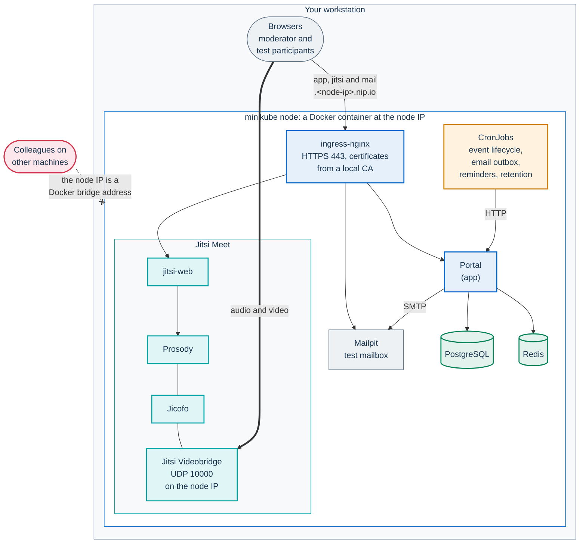
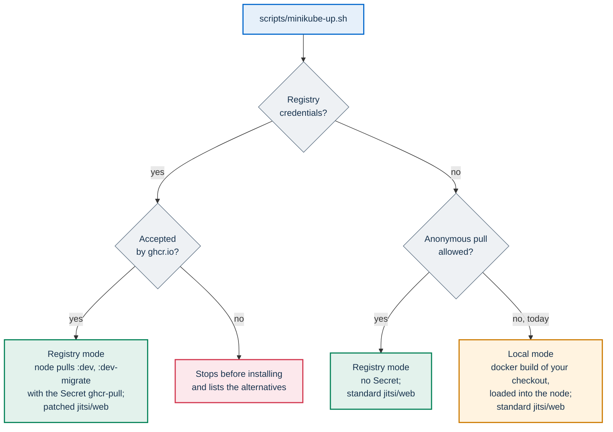

# Try PA Webinar on minikube

This page takes you from an empty workstation to a working PA Webinar
installation on [minikube](https://minikube.sigs.k8s.io/), in one command and
three to five minutes when Docker's build cache is already warm (a first build
takes longer). It is written for the IT staff of a public body who want to
see the product and the Helm chart before they choose where to run it, and
for developers who work on the chart. minikube is supported for evaluation
and development, not for events
([Support levels](README.md#support-levels)).

Status: **tested in lab**. Linux workstation (Fedora, cgroup v2), Docker
driver, minikube 1.38.1, Kubernetes v1.35.1, Helm 4.2.2. The chart with the
minikube overlay also renders with Helm 3.16.3, the version CI uses. macOS,
Windows and the VM drivers were not tested.

On this page:

- [Why minikube](#why-minikube)
- [What you get](#what-you-get)
- [Before you start](#before-you-start)
- [Install](#install)
- [First steps](#first-steps)
- [Measured usage](#measured-usage)
- [Troubleshooting](#troubleshooting)
- [Update, stop and remove](#update-stop-and-remove)
- [More than one profile](#more-than-one-profile)
- [The development loop](#the-development-loop)
- [Limits of this setup](#limits-of-this-setup)
- [Related pages](#related-pages)

## Why minikube

PA Webinar is built to run on Kubernetes. The Helm chart in
`infra/helm/pa-webinar` is the supported way to install it, from a single VM
to a managed cluster with node pools that scale to zero. minikube runs that
same chart on one workstation, with the simple profile
(`examples/values-simple.yaml`) and a small overlay for a small node
(`examples/values-minikube.yaml`). The chart, the simple profile and the
layered upgrade are the ones a single k3s server uses. The secrets differ: here
the chart renders them from a values file (`generate` mode), which is for
evaluation only, while a server for events keeps them in Secrets created
outside Helm. The overlay lowers the resource requests, caps the bridge's
memory, redirects
plain HTTP to HTTPS, and leaves out third-party STUN. Instead of publicly
trusted certificates, the script signs its own with a certificate authority
it creates on your workstation. A real installation needs trusted
certificates and STUN or a public address
([Checklists](checklists.md)).

The Docker Compose stack in the repository is for code work, not for
evaluating an installation. Compared with it, minikube:

- serves the portal and the conference over HTTPS through an ingress
  controller, as a real installation does. Compose serves the portal over plain
  HTTP, so the staff session works only on `localhost`;
- runs every scheduled job of the simple profile as a Kubernetes CronJob.
  Compose runs the email outbox, the reminders and the hourly cleanup of
  expired event data through one `cron` service, and the other retention jobs
  do not run;
- runs the Jitsi release that the chart pins. Compose follows the floating
  `stable` tag.

Compose is still the better choice for changing the code: on minikube, a
one-string change took 2 min 21 s from the edit to the running pod, most of
it the Docker build. minikube is the place to work on the chart, its values
and the Kubernetes jobs ([The development loop](#the-development-loop)). See
[Local development](../DEVELOPMENT.md) and
[Choose a platform](README.md#choose-a-platform).

## What you get



On the node:

- **The portal** with its PostgreSQL and Redis, one replica each.
- **Jitsi Meet**: the web front end, Prosody, Jicofo and one bridge. The
  bridge announces the node IP, which browsers on the workstation reach
  directly, and asks no third-party STUN server.
- **The scheduled jobs of the simple profile.**
  `kubectl --context pa-webinar -n pa-webinar get cronjobs` lists them. The
  event lifecycle and the email outbox run every minute.
- **Mailpit**, a test mailbox that catches every email the portal sends. The
  script installs it next to the chart. Nothing leaves the workstation.
- **Host names** on [nip.io](https://nip.io), which resolve to the address they
  contain: `app.<node-ip>.nip.io`, `jitsi.<node-ip>.nip.io` and
  `mail.<node-ip>.nip.io`.
- **HTTPS on all three names**, with certificates signed by a certificate
  authority that the script creates once on your workstation. Plain HTTP
  redirects to HTTPS. Trust the authority once and the browser opens the
  three names without warnings
  ([Trust the local certificate authority](#1-trust-the-local-certificate-authority)).

Not included, by design of the evaluation setup:

- **Bridge scale-to-zero.** The bridge runs at a fixed count of one. The
  event lifecycle job opens a published event at its start time and ends it
  once its end time and the grace period have passed; the moderator can still
  press **Start event** earlier and **End for everyone**. The administration
  area's **Infrastructure** page shows **Fixed mode**.
- **Recording, file uploads and AI post-production.** They need object
  storage, which the chart does not ship. Materials given as links work.
  Without storage the portal hides the upload controls
  ([Two storage domains](../configuration/storage.md#two-storage-domains)).
- **The shared whiteboard.** Jitsi's whiteboard needs a collaboration server
  that the chart does not install or configure, so rooms have no whiteboard
  ([Gaps you fill yourself](README.md#gaps-you-fill-yourself)).
- **Jibri, TURN and publicly trusted certificates.**
- **Participants on other machines.** See
  [Invite colleagues](#5-invite-colleagues).
- **NetworkPolicy enforcement.** The default network plugin ignores it.

## Before you start

### Size

| | Minimum tested | Default of the script | To try rooms of 40 |
|---|---|---|---|
| minikube node | 2 CPU, 3 GB of memory, 30 GB of disk | 4 CPU, 6 GB, 30 GB | 4 CPU, 8 GB |
| What it carried | 20 participants on camera, at the limit | 10 participants on camera, using under half of the node | 40 participants with six videos per receiver ([Larger rooms](../INFRASTRUCTURE.md#larger-rooms-and-meeting-patterns)) |

The browsers that join run on the same workstation and need their own
resources on top of the node: in the lab, 10 test participants in headless
Chrome used about 2.1 cores and 5.3 GB. The script refuses more CPUs than the
workstation has, warns below 3 GB for the node, and warns when less than 2 GB
of memory would be left to the workstation. A node with 2 CPU and 2 GB
installs, but it collapsed at 20 participants on camera.

The size applies when the profile is created. To change it later, delete the
profile and install again ([Update, stop and remove](#update-stop-and-remove)).

### Tools

- minikube 1.38.1 or later;
- Helm 3.16.3 or later;
- kubectl, openssl and curl;
- Docker, for the Docker driver and for building the images;
- `certutil`, only for `--trust-ca` (package `nss-tools` on Fedora,
  `libnss3-tools` on Debian and Ubuntu).

The script checks the versions. When kubectl is more than one minor version
away from the cluster, it warns and suggests the kubectl that minikube
downloads for the profile (see [kubectl behaves oddly](#kubectl-behaves-oddly)).
The lab's kubectl was two minor versions older than the cluster, and every
step worked.

On macOS the Docker driver does not make the node IP reachable from the host:
the portal opens through `minikube tunnel`, but no audio or video flows. Use a
VM driver there (`--driver vfkit` or `--driver qemu`). Not tested.

### Choose how the images arrive

The portal comes in two images: the application and the migrations. The
development branch publishes them as `ghcr.io/italia/pa-webinar:dev` and
`:dev-migrate`. Today ghcr.io refuses anonymous pulls of these packages, so
the script chooses by itself. Registry credentials are `GHCR_USERNAME` and
`GHCR_TOKEN` in the environment, a file passed with `--pull-secret-file`, or
the Secret `ghcr-pull` left in the namespace by an earlier run. The script
tests them on the application, migration and patched web images before it
uses them:



| Mode | When to use it | What it needs | First install, measured |
|---|---|---|---|
| Registry, with a pull Secret | To try what the development branch publishes, without building | A token with `read:packages` for ghcr.io | 2 min 47 s |
| Local | No credentials, or to try your own changes | Docker on the workstation. The migration image alone is about 2.4 GB | 4 min 56 s with Docker's build cache warm |

`--images registry|host|local` forces a mode. `registry` stops at once when
the node cannot pull. `host` pulls with the workstation's Docker, after
`docker login ghcr.io`, and loads the images into the node; it was not
exercised in the lab.

**To see your own changes, always pass `--images local`.** With registry
credentials, in the environment or in the `ghcr-pull` Secret that an earlier
run left in the namespace, the automatic choice installs the published
images, and your changes never reach the cluster. The script warns when it
does so, and more loudly when the checkout has uncommitted changes. In local
mode the images are tagged per profile, `pa-webinar:local-<profile>` and
`pa-webinar:local-<profile>-migrate`, so two profiles or two checkouts do not
overwrite each other's images.

The published images come from the development branch. They are for
evaluation, not for events: a real installation pins a release
([Pinning versions](../INFRASTRUCTURE.md#pinning-versions)).

## Install

### 1. Get the repository

```bash
git clone https://github.com/italia/pa-webinar.git
cd pa-webinar
```

The script downloads the Helm subcharts itself, with a temporary repository
list, so your Helm configuration is not touched.

### 2a. With the published development images

Give the script a token that can read the packages, without leaving it in the
shell history:

```bash
export GHCR_USERNAME=<github-user>
read -rs GHCR_TOKEN; export GHCR_TOKEN
scripts/minikube-up.sh
```

Or pass a `.dockerconfigjson` file whose `ghcr.io` entry has an `auth` field:
`scripts/minikube-up.sh --pull-secret-file <file>`. A
`~/.docker/config.json` that uses `credsStore` or `credHelpers` keeps the
token in the system keychain, not in the file, and the script refuses it.

The script asks ghcr.io for the application, migration and patched web images
with those credentials before it uses them. It then creates the pull Secret
`ghcr-pull` in the namespace, and the conference uses the chart's patched
`jitsi/web` image
([ADR-017](../adr/017-patched-jitsi-web-image.md)). The Secret stays in the
namespace until the profile is deleted, so later runs need no credentials.
Anyone who can read Secrets in the profile can read the token, so delete the
profile when you are done.

### 2b. Without credentials

```bash
scripts/minikube-up.sh
```

The script finds that ghcr.io refuses the anonymous pull, builds both images
from your checkout with Docker, and loads them into the node. It prints
(the script's messages are in Italian):

```text
   ghcr.io non concede il prelievo di ghcr.io/italia/pa-webinar senza credenziali:
   costruisco le immagini dai sorgenti di questo repository (--images local).
```

"ghcr.io does not allow pulling without credentials: building the images from
this repository's sources".

### What the script does

1. **Generates the secrets once**, into
   `~/.config/pa-webinar/minikube/pa-webinar/secrets.yaml`: a 0600 file in a
   0700 folder, outside the repository. The application keys come from
   `openssl rand -hex 32`, the datastore passwords from `-hex 24`, and the
   Jicofo and bridge XMPP passwords from `-hex 16`. Later runs reuse the file.
   A `--state-dir` inside the repository is refused before anything is
   created.
2. **Starts the profile** `pa-webinar` with `--keep-context`, and enables the
   `ingress` and `metrics-server` add-ons. Your active kubectl context never
   changes: every command the script runs names the profile's context. On
   some cgroup v2 hosts minikube ignores `--cpus`; the script then caps the
   node container itself with `docker update --cpus`.
3. **Chooses the images**, as in the diagram above. In local mode it builds
   them with the commit of your checkout, so that `/api/health` answers
   `"version":"local"` and that commit (with `-dirty` when the checkout has
   uncommitted changes). The build's output goes to `build.log` in the state
   folder (`tail -f` it while you wait), and the 2.4 GB migration image is
   loaded into the node again only when the Dockerfile, the lockfiles or
   `app/prisma` changed.
4. **Creates a certificate authority once**, in the same folder: the key
   `ca.key` (EC P-256, 0600) and the certificate `ca.crt`, valid for ten
   years. Its name constraints let it sign only names under `nip.io`,
   `sslip.io` and the `--domain` given when it was created, so its key could
   not impersonate any other site. With it the script signs one certificate per host name (under
   `tls/`, valid 397 days) and loads them into the TLS Secrets `app-tls`,
   `jitsi-tls` and `mail-tls`. It also puts the authority's certificate in the
   ConfigMap `local-ca`, which the portal trusts for its own outbound
   connections (`app.extraCaCerts`). Later runs keep the authority, and
   re-sign a host's certificate only when the node IP changes or the
   certificate nears its expiry. With `--trust-ca`, it also adds the
   authority to the browsers of the workstation
   ([Trust the local certificate authority](#1-trust-the-local-certificate-authority)).
5. **Writes `values-local.yaml`** next to the secrets, with the nip.io host
   names (`site.portalHost`, `site.conferenceHost` and
   `jitsi-meet.publicURL`), the TLS Secrets of both Ingresses, the `local-ca`
   ConfigMap and the Mailpit SMTP settings. It is rewritten on every run.
6. **Installs the chart** with `helm upgrade --install` and four values files:
   `examples/values-simple.yaml`, `examples/values-minikube.yaml`,
   `values-local.yaml` and `secrets.yaml`, then the files you give with
   `--values`, in order. The chart's post-install notes go to `helm-notes.txt`
   in the same folder.
7. **Checks** the result. It waits for every Deployment and StatefulSet to
   finish its rollout, the conference's front end that the chart's hook
   restarts included. It then needs `/api/health` to answer `"status":"ok"`
   and the conference's `config.js` to answer 200 five times in a row, both
   with the certificates verified against the local authority, and checks
   that `http://` on both names redirects to `https://`. It then prints the
   addresses, how to trust the authority, and the installation check with
   the real paths:

   ```text
   ✓ PA Webinar è su minikube (profilo pa-webinar, namespace pa-webinar).

     Portale              https://app.<node-ip>.nip.io
     Amministrazione      https://app.<node-ip>.nip.io/it/admin/login
     Conferenza           https://jitsi.<node-ip>.nip.io
     Email inviate        https://mail.<node-ip>.nip.io
   ```

   That is: portal, administration area, conference, sent emails. Every phase
   prints how long it took, and the summary the total.

On a first install, the migrations init container restarts two or three times
until PostgreSQL is up, and an email outbox job from the first minute can end
in `Error`. Both are expected. Under "Da controllare" ("to check"), the chart's
notes warn that the bridge has no STUN server and no public address: on
minikube that is expected, and the script says so.

The script's other options are in `scripts/minikube-up.sh --help`. The ones you
are most likely to need: `--cpus`, `--memory` and `--disk-size` for a new
profile, `--domain sslip.io` when your DNS resolver refuses nip.io names,
`--trust-ca` to trust the local authority in the browser, `--profile` for a
second installation ([More than one profile](#more-than-one-profile)), and
`--values FILE`, repeatable, to try a chart option such as
`backup.enabled: true`. Pass `--values` again on every run, as with Helm.
The installation by hand, command by command, is in
[Install by hand](#install-by-hand).

### Check it yourself

The installation check tests the cluster, the certificates, the portal and
its components, the conference, the scheduled jobs and the email outbox and,
with `--call`, a call between two headless browsers:

```bash
P=pa-webinar
S=~/.config/pa-webinar/minikube/$P
scripts/verify-install.sh --context $P --ca-file $S/ca.crt --secrets-file $S/secrets.yaml --call
```

It exits 0 when nothing failed. On a local build it warns that the images do
not match the chart's appVersion, which is expected. `--call` needs `npm ci` at
the repository root and a Chromium (`npx playwright install chromium`, or
`--browser /usr/bin/google-chrome`); in the lab the whole check with the call
took 23 s. It can run as soon as the script returns: the script waits for
every rollout, the conference's front end that each upgrade restarts
included, and the check retries the conference for up to 90 s
(`--conference-wait`).
The same by hand:

```bash
IP=$(minikube -p $P ip)
curl -s --cacert $S/ca.crt https://app.$IP.nip.io/api/health                                    # {"status":"ok",...}
curl -s --cacert $S/ca.crt -o /dev/null -w '%{http_code}\n' https://jitsi.$IP.nip.io/config.js  # 200
curl -s -o /dev/null -w '%{http_code} %{redirect_url}\n' http://app.$IP.nip.io/                   # 308 https://app.…/
kubectl --context $P -n pa-webinar get pods
```

### Install by hand

These are the commands the script runs, in local mode, for a reader who wants
to do each step alone. `P` is the profile, and `<node-ip>` the output of
`minikube -p $P ip`. Fetch the subcharts first, from the repository root, as
in [A.2 Fetch the subcharts](k3s.md#a2-fetch-the-subcharts).

```bash
P=pa-webinar
minikube start -p $P --keep-context --driver=docker \
  --container-runtime=docker --cpus=4 --memory=6g --disk-size=30g \
  --kubernetes-version=v1.35.1
minikube -p $P addons enable ingress
minikube -p $P addons enable metrics-server
kubectl --context $P -n ingress-nginx \
  rollout status deployment/ingress-nginx-controller

docker build -t pa-webinar:local-$P .
docker build --target builder -t pa-webinar:local-$P-migrate .
docker save pa-webinar:local-$P | minikube -p $P image load -
docker save pa-webinar:local-$P-migrate | minikube -p $P image load -
```

Load the images from `docker save`, as above, not by name: loading by name
goes through minikube's own image cache, which keeps the previous image when
the tag has not changed, and the node would run stale code. Loading the two
images, the migration one about 2.4 GB, took between 1 minute and 96 s in
the lab. If `minikube start` warned that the kernel does not support CPU cfs
period/quota, cap the node container as the script does:
`docker update --cpus=4 $P`, then check with
`docker exec $P cat /sys/fs/cgroup/cpu.max` (4 CPUs show as `400000 100000`).

Write two files in a folder outside the repository (`<dir>` below), readable
only by you:

- `pa-webinar.secrets.yaml`, with the application keys, the datastore
  passwords and the pinned Jicofo and bridge XMPP passwords, in the chart's
  `generate` mode: the keys are listed in the header of
  `examples/values-simple.yaml`, and the overlay sets
  `jitsi.requirePinnedCredentials: true`, so the render stops when a password
  is missing. `generate` mode is for evaluation only
  ([Secret modes](../DEPLOYMENT.md#secret-modes)). Keep the file: the
  database keeps the passwords it was first started with.
- `pa-webinar.minikube-hosts.yaml`, with the images and the host names:

```yaml
site:
  portalHost: app.<node-ip>.nip.io
  conferenceHost: jitsi.<node-ip>.nip.io
jitsi-meet:
  publicURL: https://jitsi.<node-ip>.nip.io
app:
  image:
    repository: pa-webinar
    tag: local-pa-webinar
    pullPolicy: Never
  migration:
    image:
      repository: pa-webinar
      tag: local-pa-webinar-migrate
      pullPolicy: Never
```

Then install and check:

```bash
helm --kube-context $P upgrade --install pa-webinar infra/helm/pa-webinar \
  -n pa-webinar --create-namespace \
  -f infra/helm/pa-webinar/examples/values-simple.yaml \
  -f infra/helm/pa-webinar/examples/values-minikube.yaml \
  -f <dir>/pa-webinar.minikube-hosts.yaml \
  -f <dir>/pa-webinar.secrets.yaml \
  --wait --timeout 15m

IP=$(minikube -p $P ip)
curl -sk https://app.$IP.nip.io/api/health                                   # JSON with "status":"ok"
curl -sk -o /dev/null -w '%{http_code}\n' https://jitsi.$IP.nip.io/config.js   # 200
```

After a rebuild with the same tag, the manifest does not change, so Helm does
not restart the portal: restart it yourself once the new images are loaded,
`kubectl --context $P -n pa-webinar rollout restart deployment/pa-webinar`.

The manual path leaves out Mailpit, which the script installs next to the
chart: without an SMTP relay in your values, no email is sent. It also leaves
out the local certificate authority: both Ingresses serve the ingress
controller's self-signed certificate, which you accept in the browser, the
conference's first ([Trust the local certificate authority](#1-trust-the-local-certificate-authority)
describes both ways). To use certificates of your own, load each into a TLS
Secret and name it on both Ingresses, as the script's `values-local.yaml`
does; the hosts come from `site.*`:

```yaml
ingress:
  tls:
    - secretName: app-tls
jitsi:
  conferenceIngress:
    tls:
      - secretName: jitsi-tls
```

### What the overlay changes

On top of the simple profile, `examples/values-minikube.yaml`:

- uses the images of the development branch, with `pullPolicy: Always`;
- lowers the requests: portal 100m and 256 MiB (limits 1 CPU and 512 MiB),
  PostgreSQL 100m and 128 MiB (limits 1 CPU and 512 MiB);
- caps the bridge's Java heap at 1 GB (`VIDEOBRIDGE_MAX_MEMORY: "1024m"`),
  with requests of 250m and 1 GiB and limits of 2 CPU and 2 GiB
  ([Bridge memory on small nodes](../INFRASTRUCTURE.md#bridge-memory-on-small-nodes));
- sets `stunServers: ""`: the bridge advertises the node IP, which browsers on
  the workstation reach directly, and asks no third-party STUN server;
- uses the standard `jitsi/web` image at the subchart's Jitsi release, with no
  pull secrets;
- renders the conference Ingress from the chart (`jitsi.conferenceIngress`,
  with the subchart's Ingress off), and removes the cert-manager annotation
  from both Ingresses;
- selects the `nginx` ingress class and sets
  `nginx.ingress.kubernetes.io/force-ssl-redirect: "true"` on both Ingresses,
  so plain HTTP always redirects to HTTPS. A page opened over `http://` is not
  a secure context: the browser gives it no microphone or camera, and the room
  keeps loading without saying why;
- leaves `tls` empty on both Ingresses. The script adds its TLS Secrets in
  `values-local.yaml`; without them the controller's self-signed certificate
  applies;
- sets `jitsi.requirePinnedCredentials: true`.

The requests of Jicofo, Prosody and Jitsi web, and the bridge's tolerant
liveness probe, are the chart's defaults on every profile.

The simple profile already caps the platform at its single bridge
(`JVB_MAX_REPLICAS: "1"`), and the chart writes the same cap from
`jitsi-meet.jvb.replicaCount` for any profile with fixed bridges and no
scaler. Without that cap, two live events at the same time would each ask
for a bridge, and the waiting room would keep the join button disabled,
showing that the video servers are starting.

`scripts/validate-chart.sh` renders the simple profile with this overlay, as
the `semplice-minikube` profile. CI runs it on every push and pull request to
`main`.

## First steps

The screens are in Italian by default. The steps below use the English
interface, under `/en/`, so that the labels match this page.

### 1. Trust the local certificate authority

The portal, the conference and Mailpit present certificates signed by the
authority that the script created,
`~/.config/pa-webinar/minikube/pa-webinar/ca.crt`. The script prints its
SHA-256 fingerprint; check it with
`openssl x509 -in <file> -noout -fingerprint -sha256`. Trust it once, in one
of these ways, then restart the browser:

- **Chrome, Chromium or Edge on Linux** read the user's NSS database. Run the
  script with `--trust-ca`: it creates the database when it does not exist
  yet (a new user, or a Chrome that has only run headless), and adds the
  authority under the name `PA Webinar minikube (<profile>)`, replacing the
  one of an earlier installation of the same profile. It needs `certutil`
  (package `nss-tools` on Fedora, `libnss3-tools` on Debian and Ubuntu).
  `--nssdb DIR` names another database, for example
  `~/snap/chromium/current/.pki/nssdb` for the Chromium snap. By hand:

  ```bash
  P=pa-webinar
  [ -f ~/.pki/nssdb/cert9.db ] || { mkdir -p ~/.pki/nssdb && certutil -d sql:$HOME/.pki/nssdb -N --empty-password; }
  certutil -d sql:$HOME/.pki/nssdb -A -t "C,," -n "PA Webinar minikube ($P)" \
    -i ~/.config/pa-webinar/minikube/$P/ca.crt
  ```

  Or, in Chrome: **Settings** > **Privacy and security** > **Security** >
  **Manage certificates**, and import it as an authority.
- **Firefox**, on any system, keeps its own store: **Settings** >
  **Privacy & Security** > **Certificates** > **View Certificates** >
  **Authorities** > **Import**, and tick **Trust this CA to identify
  websites**.
- **The system store**, for curl and the other programs on the workstation.
  Fedora:
  `sudo cp <ca.crt> /etc/pki/ca-trust/source/anchors/pa-webinar-minikube.crt && sudo update-ca-trust`.
  Debian and Ubuntu:
  `sudo cp <ca.crt> /usr/local/share/ca-certificates/pa-webinar-minikube.crt && sudo update-ca-certificates`.
- **macOS**, for Chrome and Safari:
  `sudo security add-trusted-cert -d -r trustRoot -k /Library/Keychains/System.keychain <ca.crt>`.

The authority can sign only names under `nip.io`, `sslip.io` and the domain
given with `--domain`, so trusting it does not let its key impersonate any
other site. Its key stays in the state folder, readable only by you. Running
the script again keeps the same authority. `scripts/minikube-down.sh --purge`
deletes it and removes it from the NSS database (the same `--nssdb`); from
Firefox and the system stores, remove it yourself: there its name is
`PA Webinar minikube CA (<profile>, <date>)`. By hand, from the NSS database:
`certutil -d sql:$HOME/.pki/nssdb -D -n "PA Webinar minikube (<profile>)"`.

**Without trusting it**, accept the browser's warning on both names, the
conference first: open `https://jitsi.<node-ip>.nip.io` and accept, then
`https://app.<node-ip>.nip.io`. The conference's certificate is the one that
people forget: the conference runs in a frame inside the portal page, and a
frame does not show the certificate warning, it just fails to load. In Chrome
with a new profile, after both warnings were accepted, a moderator joined the
conference in the room. With only the portal's accepted, the room shows
**The video call service is not responding**, with a link that opens the
conference host in a new tab, where you accept the warning, and a retry
button.

In the lab, the script's checks verified the certificates against the
authority with curl, and the portal verified the conference's certificate from
inside the cluster. Chrome on Linux, with the authority added by the
`certutil` command above to a new profile's database, opened the three names
without warnings and loaded the conference's script from the portal page;
without it, it refused them. Firefox, the system stores and macOS were not
tried.

### 2. Sign in to the administration area

The instance API key is in the secrets file:

```bash
grep ADMIN_API_KEY ~/.config/pa-webinar/minikube/pa-webinar/secrets.yaml
```

Open `https://app.<node-ip>.nip.io/en/admin/login`, expand **Sign in with the
instance key**, enter the key in **Access key** and press **Sign in**.

The instance key is for the first access, emergencies and automation. To work
under your own name, open **People** > **Accounts**, add a person as
**Administrator** or **Organiser**, and open the one-time sign-in link from
Mailpit
(`https://mail.<node-ip>.nip.io`, signed by the same local authority).
[First access](../DEVELOPMENT.md#first-access) describes the same steps on the
Compose stack.

### 3. Create a first event

- **A scheduled event.** **New event** first offers the event templates;
  **Configure manually** skips them. The wizard has five steps: **Basics**,
  **Permissions**, **People**, **Content** and **Review**. Publishing needs a
  moderator's name and email, entered in **Review**, used for the moderator
  link and the confirmation email; like every email of this setup, it lands
  in Mailpit. After **Publish event**, or **Save as draft**, the wizard lands
  on the event's page in the administration area, which lists the
  **Event links**: the **Public event page**, the
  **Direct invite (no registration)** and the **Moderator link**. The
  default templates carry Italian names and descriptions in every language.
- **An instant call.** **Instant calls** > **New call** creates a call that is
  live at once, with no public page. **Create and join** opens its page:
  **Join as moderator**, type your name and press **Enter now**.
  **Copy invite link** gives the link for guests.

### 4. Open the room

Open the **Moderator link**. The event lifecycle job, which runs every
minute, opens a published event at its start time and ends it once its end
time and the grace period have passed. Before the start time the moderator
opens the room with **Start event**, then enters with **Enter now**, and
**End for everyone** closes it at any time
([Event lifecycle](../architecture/event-lifecycle.md)).

In the room, only moderator links make someone a moderator: the event's
moderator link and those of named moderators. Registrants, guests and speakers
join as participants, whoever enters first: they cannot mute, remove or
promote anyone. The token that the portal signs decides the
role; Jicofo, the conference's focus component, assigns none of its own
([Jitsi extras](../../infra/jitsi/README.md#where-it-is-loaded)).

### 5. Invite colleagues

With the Docker driver, the node IP is an address of a Docker bridge on your
workstation. Colleagues on other machines cannot reach it: not the portal, not
the conference, not the audio and video. The links in the emails point at the
same address. The script's summary says so too. To try PA Webinar with
colleagues on their own computers, install it on a VM that they can reach,
with one command from your workstation:
`infra/onprem/k3s/pa-webinar-up.sh --host <user>@<vm> --portal <name> --meet <name> --tls private-ca --mailpit`
([Install with one command](k3s.md#install-with-one-command)).

On minikube, play the other participants yourself, with a second browser
profile or a private window per participant. A new browser profile that does
not trust the local authority shows the certificate warning again: accept it
on the conference host first.

- **Registrants.** Open the **Public event page**, register with any address,
  for example `colleague@example.com`, and open **Sign-ups** in the
  administration area to see the registration. The confirmation email, with
  the personal link to the room, appears in Mailpit within about a minute,
  when the email outbox job next runs. In a check on the default profile it
  arrived after 20 s.
- **Guests.** Open the **Direct invite (no registration)** link of a live
  event, or the **Copy invite link** of an instant call, in another profile.
  Guests join without registering while the event is live.

The **Invitations** list in the wizard sends nothing. It decides who may
register when public registration is off, and you share the event link
yourself.

### 6. Look around

- **System status** checks the conference web front end, Prosody and Jicofo
  at their addresses inside the cluster, which the chart gives the portal
  (`JITSI_WEB_INTERNAL_URL`, `PROSODY_INTERNAL_URL`, `JICOFO_HEALTH_URL`), so
  the certificates play no part there. Jibri is not deployed, and the portal
  does not check it.
- **Bridge counts stay at zero with one person in a room.** Jicofo places a
  conference on the bridge when the second participant joins; until then the
  bridge's statistics, and the pages that read them, show no conference and no
  participants.
- The site settings, branding and languages are in the administration area,
  and take effect without a reinstall
  ([Runtime settings](../configuration/runtime-settings.md)).
- The [feature tour](../FEATURES.md) lists what each role can do.

## Measured usage

Method: Docker driver on a shared Linux lab host, with the overlay.
Participants were headless Chrome browsers on the same host, all on camera in
tile view, receiving 180p thumbnails. Each level ran for about 105 s at steady
state. Memory is the working set read from the cgroups, as a mean or a range,
with the peak in brackets. Bridge traffic comes from the bridge's own
statistics. [How the numbers were obtained](../INFRASTRUCTURE.md#how-the-numbers-were-obtained)
has the method and the limits of synthetic participants.

| Node | Load | Bridge CPU mean (peak) | Bridge memory | Node memory | Bridge out | Result |
|---|---|---|---|---|---|---|
| 4 CPU / 6 GB | Idle, fresh install | 4–6m | 157 MiB | 1.92–1.95 GiB | – | – |
| 4 CPU / 6 GB | 5 on camera | 126m (252m) | 311 MiB | 2.33 GiB | 2.6–2.9 Mbps | OK |
| 4 CPU / 6 GB | 10 on camera | 288m (355m) | 471 MiB | 2.52 GiB | 11.9–12.3 Mbps | OK |
| 2 CPU / 3 GB | 10 on camera | 307m (392m) | 470 MiB | 2.46 GiB | 11.6–12.7 Mbps | OK |
| 2 CPU / 3 GB | 20 on camera | 953m (1178m) | 1356 MiB (1464 MiB) | 2.83–2.88 GiB | 48–51 Mbps | At the limit: bridge stress 0.73, no loss |
| 2 CPU / 2 GB | 20 on camera | | | | | Failed: media stopped, then the API server, ingress, portal, Prosody, Jitsi web, PostgreSQL and Redis restarted |

In every run marked OK there was no packet loss, and each participant
received every other camera at 180p and about 20 fps. The 20-participant run
had a bridge memory limit of 1536 MiB and reached 95% of it; the overlay now
sets 2 GiB. The bridge keeps its memory after the event. Why the overlay caps
the bridge's heap at 1 GB is in
[Bridge memory on small nodes](../INFRASTRUCTURE.md#bridge-memory-on-small-nodes).

With the overlay, the pods on the node, minikube's own included, request
1580m of CPU and 2604 MiB of memory. `kubectl top node` percentages mean
nothing with the Docker driver, because the node reports the workstation's
capacity. Memory pressure shows up as thrashing and restarts, not as evicted
or pending pods.

Timings, measured with `time` around the scripts, on a 4 CPU / 6 GB node unless
the table says otherwise. The script prints the duration of each phase and the
total, so you can compare your own runs:

| Operation | Time |
|---|---|
| First install, published images with a pull Secret | 2 min 47 s, of which Helm 117 s |
| First install, no credentials, Docker's build cache warm | 2 min 57 s to 4 min 56 s: about 50 s to start the node and the ingress, from a few seconds to 2 min 26 s to build the images, 50 s to 1 min to load them into the node, about 70 s of Helm |
| First install, no credentials, 2 CPU / 3 GB node | 6 min 10 s, build cache state not recorded |
| The development loop: one string changed in the portal, then the script again with `--images local` | 2 min 21 s: 1 min 50 s of build with a warm cache, the application image loaded into the node (the migration image unchanged, not loaded), 21 s of Helm |
| Running the script again, nothing changed | 11 to 15 s |
| `scripts/minikube-down.sh --stop` | 15 s |
| Restarting a stopped profile with the script | 1 min 18 s, data kept |
| `scripts/minikube-down.sh --purge` | 18 to 19 s |

A first build on a machine with an empty build cache takes several minutes
more.

## Troubleshooting

The script's messages are in Italian. Each entry quotes the message and
translates it.

For any problem, start from the pods and the recent events:

```bash
kubectl --context pa-webinar -n pa-webinar get pods
kubectl --context pa-webinar -n pa-webinar get events --sort-by=.lastTimestamp
kubectl --context pa-webinar -n pa-webinar logs deploy/pa-webinar --tail=50
```

When Helm does not complete, the script prints the same two lists before it
stops. Always pass `--context pa-webinar`: without it, kubectl talks to
whatever cluster your active context points at.

### The host names do not resolve

"ATTENZIONE: app.… non si risolve da questa macchina" ("does not resolve from
this machine"). Some DNS resolvers refuse names that resolve to private
addresses. Install with `--domain sslip.io`, or add the line the script prints
to `/etc/hosts`. `--domain sslip.io` was not tried in the lab.

### The room does not load in the portal

The room shows **The video call service is not responding**, or the conference
area stays empty. The browser does not trust the conference's certificate:
trust the local authority
([Trust the local certificate authority](#1-trust-the-local-certificate-authority)),
or follow the link in the message, which opens `https://jitsi.<node-ip>.nip.io`
in a new tab, accept the warning there, and press the retry button.

If the address bar shows `http://`, the page is not a secure context and the
browser gives it no microphone or camera. The overlay redirects every `http://`
request to `https://`; a bookmark or a proxy that keeps you on `http://` does
not work.

### Audio and video do not flow

The browser must run on the same workstation as the node. On macOS with the
Docker driver no media flows, and Windows was not tested. For everything else,
see
[No audio or video](../operations/troubleshooting.md#no-audio-or-video).

### The status page reports the conference as down

The portal checks the conference's components inside the cluster, so a
certificate is not the cause. Check that their pods are running, and that the
portal reaches them:

```bash
kubectl --context pa-webinar -n pa-webinar get pods -l app.kubernetes.io/name=jitsi-meet
kubectl --context pa-webinar -n pa-webinar exec deploy/pa-webinar -c pa-webinar -- \
  node -e 'fetch(process.env.JICOFO_HEALTH_URL + "/about/version").then(r => console.log(r.status))'   # 200
```

### An event does not open or close by itself

The event lifecycle job opens and closes events. Check that it runs and that
its jobs complete:

```bash
kubectl --context pa-webinar -n pa-webinar get cronjob pa-webinar-lifecycle
kubectl --context pa-webinar -n pa-webinar get jobs | grep lifecycle
```

An event that should open stays closed while the bridge does not answer. The
moderator can always open the room with **Start event**.

### Pods restart, or the node is slow

On a node with 3 GB or less, 20 participants on camera fill it. Memory
pressure shows up as restarts of the API server, the database and the portal.
The size applies only when the profile is created, so delete the profile and
create it again at the default 4 CPU and 6 GB, or with a larger `--memory`:

```bash
scripts/minikube-down.sh
scripts/minikube-up.sh
```

To check the CPU cap the script applied:

```bash
docker exec pa-webinar cat /sys/fs/cgroup/cpu.max   # 4 CPUs: 400000 100000
```

### The script refuses the registry credentials

"ghcr.io rifiuta le credenziali" ("ghcr.io refuses the credentials"). The
token is wrong, expired, or lacks `read:packages`. The message lists the
alternatives: other credentials, `--images host`, or `--images local`. When
the refused credentials are in the Secret left by an earlier run, the message
gives the command that deletes it:

```bash
kubectl --context pa-webinar -n pa-webinar delete secret ghcr-pull
```

"… non ha il campo "auth" per ghcr.io" ("has no auth field for ghcr.io"): the
file passed with `--pull-secret-file` keeps its credentials in a keychain.
Use `GHCR_USERNAME` and `GHCR_TOKEN` instead.

### The script stops because the secrets file is missing

"La release pa-webinar esiste già nel profilo pa-webinar ma manca …/secrets.yaml"
("the release already exists but the secrets file is missing"), or the same
for a stopped profile. The database keeps the passwords it was created with,
so the script does not generate new ones. Put the file back, or start over:

```bash
scripts/minikube-down.sh
scripts/minikube-up.sh
```

### No email in Mailpit

The email outbox job runs every minute. Check that it completes:

```bash
kubectl --context pa-webinar -n pa-webinar get cronjobs
kubectl --context pa-webinar -n pa-webinar get pods
```

A job that ended in `Error` during the first minute of a new install is
harmless. If later jobs fail too, see
[Emails are not sent](../operations/troubleshooting.md#emails-are-not-sent).
With `--no-mailpit` the script installs no test mailbox and leaves the SMTP
host of the simple profile empty, so nothing can be delivered until you set a
relay in the secrets file ([Email](../configuration/email.md)).

### My changes do not show up

The summary line `Immagini` ("images") names the images the node runs. If it
names `ghcr.io/italia/pa-webinar`, the automatic choice took the published
images because it found registry credentials: run the script again with
`--images local`. `/api/health` shows the commit the portal was built from:

```bash
curl -s --cacert ~/.config/pa-webinar/minikube/pa-webinar/ca.crt https://app.<node-ip>.nip.io/api/health
# {"status":"ok",...,"version":"local","commit":"<commit>-dirty",...}
```

### An upgrade stops on the conference Ingress

"admission webhook "validate.nginx.ingress.kubernetes.io" denied the request:
host … and path "/" is already defined in ingress
pa-webinar/pa-webinar-jitsi-meet-web". A profile installed before the chart
rendered the conference Ingress itself still has the subchart's Ingress, and
ingress-nginx refuses a second one for the same host. Delete the old one, then
run the script again:

```bash
kubectl --context pa-webinar -n pa-webinar delete ingress pa-webinar-jitsi-meet-web
scripts/minikube-up.sh
```

### kubectl behaves oddly

When the script warns that kubectl is more than one minor version away from
the cluster, use the kubectl that minikube downloads at the cluster's version.
It does not select the profile by itself, so pass the context as well:

```bash
minikube -p pa-webinar kubectl -- --context pa-webinar -n pa-webinar get pods
```

Without `--context`, that kubectl talks to your active context, like any
other.

## Update, stop and remove

- **Update.** Run `scripts/minikube-up.sh` again, for example after
  `git pull`. It runs `helm upgrade` with the same secrets. The conference's
  internal passwords are pinned, so an upgrade does not restart Prosody,
  Jicofo or the bridge unless their own settings change. Jitsi web restarts on
  every upgrade, through the chart's configuration-reload hook. A release that
  changes the chart's defaults for those components restarts them once.
- **New development images.** In local mode the script rebuilds from your
  checkout and restarts the portal only when the images changed. In registry
  mode `:dev` is a moving tag, and running the script again does not pull a
  newer build. To take one:
  `kubectl --context pa-webinar -n pa-webinar rollout restart deployment/pa-webinar`,
  or install a fixed build with `--tag dev-<sha>`, whose migration tag the
  script derives (`dev-migrate-<sha>`).
- **Stop.** `scripts/minikube-down.sh --stop` stops the profile.
  `scripts/minikube-up.sh` starts it again with its data.
- **Delete.** `scripts/minikube-down.sh` deletes the profile: the cluster, the
  database, the loaded images and the pull Secret. It asks you to type the
  profile's name first; `--yes` skips the question, as in the k3s teardown.
  It keeps the secrets file, which the next install reuses, and the images
  built on your workstation: `--purge-images` removes those alone.
- **Delete everything.** `scripts/minikube-down.sh --purge` also deletes the
  secrets file, the local certificate authority with its host certificates,
  and the generated values; removes the authority from the browser's NSS
  database (pass the same `--nssdb` as to `minikube-up.sh`); and deletes the
  profile's images `pa-webinar:local-<profile>` and
  `pa-webinar:local-<profile>-migrate` from your workstation's Docker. It
  refuses `--stop`, which would leave a database whose passwords nobody has.
  If you trusted the authority in Firefox or in the system store, remove it
  there as well: its key no longer exists, and the next install creates a new
  one.

## More than one profile

A second installation on the same workstation, for example to try a branch
next to your usual profile, needs only `--profile`. The profile's name is
also its kubectl context, the leaf of its state folder, the name of its node
container, and part of its image tags and of its authority's name in the
browser. The two profiles get separate networks and addresses:

```bash
P=pa-webinar-try
scripts/minikube-up.sh --profile $P --images local --trust-ca
kubectl --context $P -n pa-webinar get pods
scripts/verify-install.sh --context $P --ca-file ~/.config/pa-webinar/minikube/$P/ca.crt \
  --secrets-file ~/.config/pa-webinar/minikube/$P/secrets.yaml
scripts/minikube-down.sh --profile $P --purge
```

The commands on this page use the default profile, `pa-webinar`: replace it
with yours in `--context`, `minikube -p`, `docker exec` and the state folder.
Each profile takes its own share of memory and disk
([Size](#size)).

## The development loop

For code in `app/`, Docker Compose is faster ([Local development](../DEVELOPMENT.md)).
minikube is the loop for the chart, its values and anything that runs as a
Kubernetes job:

1. Change the chart, a values file or the code.
2. Run `scripts/minikube-up.sh --images local` (with `--values FILE` for a
   chart option you are trying). Always force local mode: with registry
   credentials around, the automatic choice installs the published images.
3. Check the running build: `/api/health` answers `"version":"local"` and the
   commit, with `-dirty` for uncommitted changes.
4. Run `scripts/verify-install.sh --context pa-webinar ...` as the summary
   prints it ([Check it yourself](#check-it-yourself)).

A change to the portal's code took 2 min 21 s from the edit to the running
pod, with Docker's build cache warm. A change to the chart or a values file
alone skips the build and the image load, which leaves about half a minute
for the Helm upgrade and the checks (derived from the measured phases).

## Limits of this setup

- **Browsers on the same workstation only**, with the Docker driver. A VM
  driver with bridged networking, or UDP 10000 forwarded to the node, would
  also need host names on an address that other machines reach. The script
  does not do this, and it was not tested.
- **Certificates from a local authority.** They work only where you trusted
  it; other browser profiles accept the warnings by hand, the conference's
  first.
- **Development images need credentials** until the packages are public.
  Without them the script builds the checkout, which takes a few minutes and
  needs Docker.
- **One bridge, fixed.** One conference always runs on one bridge; the
  measured limits are in [Measured usage](#measured-usage).
- **No object storage, recording, Jibri, TURN, AI post-production or shared
  whiteboard.** Without object storage the portal hides the upload controls.
- **Bridge counts stay at zero** until a room has two participants
  ([Look around](#6-look-around)).
- **No Prometheus.** The chart does not install one and `PROMETHEUS_URL` is
  empty, so the administration's monitoring page has none of the series that
  come from Prometheus.
- **One client address for every browser.** All browsers on the workstation
  reach the portal from the same address, so they share every per-address
  limit: several people signing in or registering at once can get "too many
  requests" ([Client address and rate limits](../CONFIGURATION.md#client-address-and-rate-limits)).
- **Links in emails** point at the node's address, which only this
  workstation reaches.
- **The bridge keeps its memory** after load: about 1.4 GiB after a
  20-participant run.
- **No NetworkPolicy enforcement** with the default network plugin. Starting
  the profile with `--cni=calico` would enforce it; not tested.
- **The script's messages are in Italian**, like the chart's post-install
  notes.

When the evaluation is done, the next step for a real event is a VM with k3s
or a managed cluster. [Installing PA Webinar](README.md#choose-a-platform)
compares them, with the resources measured on each, and
[Deploying with Helm](../DEPLOYMENT.md) is the reference for the chart's
values and secrets.

## Related pages

- [Installing PA Webinar](README.md): choosing a platform, the checklist,
  the requirements and the known limitations.
- [Infrastructure reference](../INFRASTRUCTURE.md): how the numbers were
  obtained, the cost of a participant on the bridge, networking and images.
- [Deploying with Helm](../DEPLOYMENT.md): profiles, secrets and install
  walkthroughs.
- [Configuration](../CONFIGURATION.md): environment variables and secrets.
- [Installing on your own VMs with k3s](k3s.md): the next step, for events
  with colleagues on their own computers.
- [Load testing](../LOAD-TESTING.md): how to measure capacity yourself.
- [Troubleshooting](../operations/troubleshooting.md).
