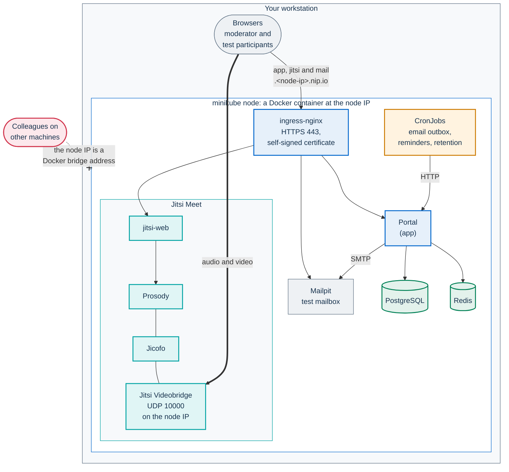
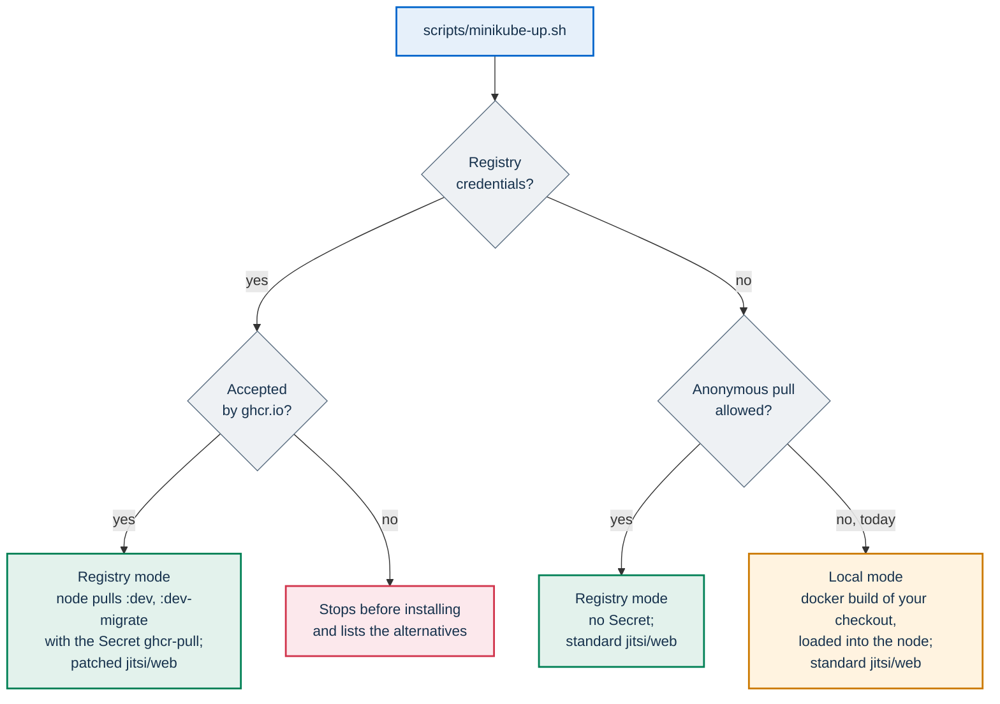

# Try PA Webinar on minikube

This page takes you from an empty workstation to a working PA Webinar
installation on [minikube](https://minikube.sigs.k8s.io/), in one command and
about five minutes when Docker's build cache is already warm (a first build
takes longer). It is written for the IT staff of a public body who want to
see the product and the Helm chart before they choose where to run it.

Status: **tested in lab**. Linux workstation (Fedora, cgroup v2), Docker
driver, minikube 1.38.1, Kubernetes v1.35.1, Helm 4.2.2. The chart with the
minikube overlay also renders with Helm 3.16.3, the version CI uses. macOS,
Windows and the VM drivers were not tested.

On this page:

- [Why minikube](#why-minikube)
- [What you get](#what-you-get)
- [Before you start](#before-you-start)
- [Install](#install)
- [First steps](#first-steps)
- [Measured usage](#measured-usage)
- [Troubleshooting](#troubleshooting)
- [Update, stop and remove](#update-stop-and-remove)
- [Limits of this setup](#limits-of-this-setup)
- [Related pages](#related-pages)

## Why minikube

PA Webinar is built to run on Kubernetes. The Helm chart in
`infra/helm/pa-webinar` is the supported way to install it, from a single VM
to a managed cluster with node pools that scale to zero. minikube runs that
same chart on one workstation, with the simple profile
(`examples/values-simple.yaml`) and a small overlay for a small node
(`examples/values-minikube.yaml`). The chart, the simple profile, the secrets
file and the upgrade commands are the ones a single-node installation uses.
The overlay lowers the resource requests, caps the bridge's memory, and
leaves out TLS certificates and third-party STUN, which a real installation
needs ([Checklist before you install](README.md#checklist-before-you-install)).

The Docker Compose stack in the repository is for code work, not for
evaluating an installation. Compared with it, minikube:

- serves the portal and the conference over HTTPS through an ingress
  controller, as a real installation does. Compose serves the portal over plain
  HTTP, so the staff session works only on `localhost`;
- runs every scheduled job of the simple profile as a Kubernetes CronJob.
  Compose runs the email outbox, the reminders and the hourly cleanup of
  expired event data through one `cron` service, and the other retention jobs
  do not run;
- runs the Jitsi release that the chart pins. Compose follows the floating
  `stable` tag.

Compose is still the better choice for changing the code: minikube needed
about 96 s after each rebuild to load the two images into the node. See
[Local development](../DEVELOPMENT.md) and
[Choose a platform](README.md#choose-a-platform).

## What you get



On the node:

- **The portal** with its PostgreSQL and Redis, one replica each.
- **Jitsi Meet**: the web front end, Prosody, Jicofo and one bridge. The
  bridge announces the node IP, which browsers on the workstation reach
  directly, and asks no third-party STUN server.
- **The scheduled jobs of the simple profile.**
  `kubectl --context pa-webinar -n pa-webinar get cronjobs` lists them. The
  email outbox runs every minute.
- **Mailpit**, a test mailbox that catches every email the portal sends. The
  script installs it next to the chart. Nothing leaves the workstation.
- **Host names** on [nip.io](https://nip.io), which resolve to the address they
  contain: `app.<node-ip>.nip.io`, `jitsi.<node-ip>.nip.io` and
  `mail.<node-ip>.nip.io`.

Not included, by design of the evaluation setup:

- **Bridge scale-to-zero.** The bridge runs at a fixed count of one. Nobody
  starts events for you: the moderator presses **Start event**. The
  administration area's **Infrastructure** page shows **Fixed mode**.
- **Recording, file uploads and AI post-production.** They need object
  storage, which the chart does not ship. Materials given as links work;
  uploads answer with an error
  ([Two storage domains](../configuration/storage.md#two-storage-domains)).
- **Jibri, TURN and trusted certificates.**
- **Participants on other machines.** See
  [Invite colleagues](#5-invite-colleagues).
- **NetworkPolicy enforcement.** The default network plugin ignores it.

## Before you start

### Size

| | Minimum tested | Default of the script | To try rooms of 40 |
|---|---|---|---|
| minikube node | 2 CPU, 3 GB of memory, 30 GB of disk | 4 CPU, 6 GB, 30 GB | 4 CPU, 8 GB |
| What it carried | 20 participants on camera, at the limit | 10 participants on camera, using under half of the node | 40 participants with six videos per receiver ([Larger rooms](../INFRASTRUCTURE.md#larger-rooms-and-meeting-patterns)) |

The browsers that join run on the same workstation and need their own
resources on top of the node: in the lab, 10 test participants in headless
Chrome used about 2.1 cores and 5.3 GB. The script refuses more CPUs than the
workstation has, warns below 3 GB for the node, and warns when less than 2 GB
of memory would be left to the workstation. A node with 2 CPU and 2 GB
installs, but it collapsed at 20 participants on camera.

The size applies when the profile is created. To change it later, delete the
profile and install again ([Update, stop and remove](#update-stop-and-remove)).

### Tools

- minikube 1.38.1 or later;
- Helm 3.16.3 or later;
- kubectl, openssl and curl;
- Docker, for the Docker driver and for building the images.

The script checks the versions. When kubectl is more than one minor version
away from the cluster, it warns and suggests the kubectl that minikube
downloads for the profile (see [kubectl behaves oddly](#kubectl-behaves-oddly)).
The lab's kubectl was two minor versions older than the cluster, and every
step worked.

On macOS the Docker driver does not make the node IP reachable from the host:
the portal opens through `minikube tunnel`, but no audio or video flows. Use a
VM driver there (`--driver vfkit` or `--driver qemu`). Not tested.

### Choose how the images arrive

The portal comes in two images: the application and the migrations. The
development branch publishes them as `ghcr.io/italia/pa-webinar:dev` and
`:dev-migrate`. Today ghcr.io refuses anonymous pulls of these packages, so
the script chooses by itself. Registry credentials are `GHCR_USERNAME` and
`GHCR_TOKEN` in the environment, a file passed with `--pull-secret-file`, or
the Secret `ghcr-pull` left in the namespace by an earlier run. The script
tests them on the application, migration and patched web images before it
uses them:



| Mode | When to use it | What it needs | First install, measured |
|---|---|---|---|
| Registry, with a pull Secret | To try what the development branch publishes, without building | A token with `read:packages` for ghcr.io | 2 min 47 s |
| Local | No credentials, or to try your own changes | Docker on the workstation. The migration image alone is about 2.4 GB | 4 min 56 s with Docker's build cache warm |

`--images registry|host|local` forces a mode. `registry` stops at once when
the node cannot pull. `host` pulls with the workstation's Docker, after
`docker login ghcr.io`, and loads the images into the node; it was not
exercised in the lab.

The published images come from the development branch. They are for
evaluation, not for events: a real installation pins a release
([Pinning versions](../INFRASTRUCTURE.md#pinning-versions)).

## Install

### 1. Get the repository

```bash
git clone https://github.com/italia/pa-webinar.git
cd pa-webinar
```

The script downloads the Helm subcharts itself, with a temporary repository
list, so your Helm configuration is not touched.

### 2a. With the published development images

Give the script a token that can read the packages, without leaving it in the
shell history:

```bash
export GHCR_USERNAME=<github-user>
read -rs GHCR_TOKEN; export GHCR_TOKEN
scripts/minikube-up.sh
```

Or pass a `.dockerconfigjson` file whose `ghcr.io` entry has an `auth` field:
`scripts/minikube-up.sh --pull-secret-file <file>`. A
`~/.docker/config.json` that uses `credsStore` or `credHelpers` keeps the
token in the system keychain, not in the file, and the script refuses it.

The script asks ghcr.io for the application, migration and patched web images
with those credentials before it uses them. It then creates the pull Secret
`ghcr-pull` in the namespace, and the conference uses the chart's patched
`jitsi/web` image
([ADR-017](../adr/017-patched-jitsi-web-image.md)). The Secret stays in the
namespace until the profile is deleted, so later runs need no credentials.
Anyone who can read Secrets in the profile can read the token, so delete the
profile when you are done.

### 2b. Without credentials

```bash
scripts/minikube-up.sh
```

The script finds that ghcr.io refuses the anonymous pull, builds both images
from your checkout with Docker, and loads them into the node. It prints
(the script's messages are in Italian):

```text
   ghcr.io non concede il prelievo di ghcr.io/italia/pa-webinar senza credenziali:
   costruisco le immagini dai sorgenti di questo repository (--images local).
```

"ghcr.io does not allow pulling without credentials: building the images from
this repository's sources".

### What the script does

1. **Generates the secrets once**, into
   `~/.config/pa-webinar/minikube/pa-webinar/secrets.yaml`: a 0600 file in a
   0700 folder, outside the repository. The application keys come from
   `openssl rand -hex 32`, the datastore passwords from `-hex 24`, and the
   Jicofo and bridge XMPP passwords from `-hex 16`. Later runs reuse the file.
   A `--state-dir` inside the repository is refused before anything is
   created.
2. **Starts the profile** `pa-webinar` with `--keep-context`, and enables the
   `ingress` and `metrics-server` add-ons. Your active kubectl context never
   changes: every command the script runs names the profile's context. On
   some cgroup v2 hosts minikube ignores `--cpus`; the script then caps the
   node container itself with `docker update --cpus`.
3. **Chooses the images**, as in the diagram above.
4. **Writes `values-local.yaml`** next to the secrets, with the nip.io host
   names and the Mailpit SMTP settings. It is rewritten on every run.
5. **Installs the chart** with `helm upgrade --install` and four values files:
   `examples/values-simple.yaml`, `examples/values-minikube.yaml`,
   `values-local.yaml` and `secrets.yaml`. The chart's post-install notes go
   to `helm-notes.txt` in the same folder.
6. **Checks** that `/api/health` answers `"status":"ok"` and the conference's
   `config.js` answers 200, then prints the addresses:

   ```text
   ✓ PA Webinar è su minikube (profilo pa-webinar, namespace pa-webinar).

     Portale              https://app.<node-ip>.nip.io
     Amministrazione      https://app.<node-ip>.nip.io/it/admin/login
     Conferenza           https://jitsi.<node-ip>.nip.io
     Email inviate        https://mail.<node-ip>.nip.io
   ```

   That is: portal, administration area, conference, sent emails.

On a first install, the migrations init container restarts two or three times
until PostgreSQL is up, and an email outbox job from the first minute can end
in `Error`. Both are expected. Under "Da controllare" ("to check"), the chart's
notes warn that the bridge has no STUN server and no public address: on
minikube that is expected, and the script says so.

The script's other options are in `scripts/minikube-up.sh --help`. The ones you
are most likely to need: `--cpus`, `--memory` and `--disk-size` for a new
profile, and `--domain sslip.io` when your DNS resolver refuses nip.io names.
The installation by hand, command by command, is in
[Install by hand](#install-by-hand).

### Check it yourself

```bash
IP=$(minikube -p pa-webinar ip)
curl -sk https://app.$IP.nip.io/api/health                                    # {"status":"ok",...}
curl -sk -o /dev/null -w '%{http_code}\n' https://jitsi.$IP.nip.io/config.js  # 200
kubectl --context pa-webinar -n pa-webinar get pods
```

### Install by hand

These are the commands the script runs, in local mode, for a reader who wants
to do each step alone. `<node-ip>` is the output of `minikube -p pa-webinar ip`.
Fetch the subcharts first, from the repository root, as in the
[checklist](README.md#checklist-before-you-install)
(`helm repo add` for `bitnami` and `jitsi-contrib`, then
`helm dependency build infra/helm/pa-webinar`).

```bash
minikube start -p pa-webinar --keep-context --driver=docker \
  --container-runtime=docker --cpus=4 --memory=6g --disk-size=30g \
  --kubernetes-version=v1.35.1
minikube -p pa-webinar addons enable ingress
minikube -p pa-webinar addons enable metrics-server
kubectl --context pa-webinar -n ingress-nginx \
  rollout status deployment/ingress-nginx-controller

docker build -t pa-webinar:local .
docker build --target builder -t pa-webinar:local-migrate .
minikube -p pa-webinar image load pa-webinar:local
minikube -p pa-webinar image load pa-webinar:local-migrate
```

Loading the two images into the node, the migration one about 2.4 GB, took
between 1 minute and 96 s in the lab. If
`minikube start` warned that the kernel does not support CPU cfs
period/quota, cap the node container as the script does:
`docker update --cpus=4 pa-webinar`, then check with
`docker exec pa-webinar cat /sys/fs/cgroup/cpu.max` (4 CPUs show as
`400000 100000`).

Write two files in a folder outside the repository (`<dir>` below), readable
only by you:

- `pa-webinar.secrets.yaml`, written as in step 1 of
  [Simple profile](../DEPLOYMENT.md#simple-profile): the application keys, the
  datastore passwords and the pinned Jicofo and bridge XMPP passwords. The
  overlay sets `jitsi.requirePinnedCredentials: true`, so the render stops
  when those passwords are missing. Keep the file: the database keeps the
  passwords it was first started with.
- `pa-webinar.minikube-hosts.yaml`, with the images and the host names:

```yaml
app:
  image:
    repository: pa-webinar
    tag: local
    pullPolicy: Never
  migration:
    image:
      repository: pa-webinar
      tag: local-migrate
      pullPolicy: Never
  env:
    NEXT_PUBLIC_APP_URL: https://app.<node-ip>.nip.io
    NEXT_PUBLIC_JITSI_DOMAIN: jitsi.<node-ip>.nip.io

ingress:
  hosts:
    - host: app.<node-ip>.nip.io
      paths:
        - path: /
          pathType: Prefix

jitsi-meet:
  publicURL: https://jitsi.<node-ip>.nip.io
  web:
    ingress:
      hosts:
        - host: jitsi.<node-ip>.nip.io
          paths: ["/"]
```

Then install and check:

```bash
helm --kube-context pa-webinar upgrade --install pa-webinar infra/helm/pa-webinar \
  -n pa-webinar --create-namespace \
  -f infra/helm/pa-webinar/examples/values-simple.yaml \
  -f infra/helm/pa-webinar/examples/values-minikube.yaml \
  -f <dir>/pa-webinar.minikube-hosts.yaml \
  -f <dir>/pa-webinar.secrets.yaml \
  --wait --timeout 15m

IP=$(minikube -p pa-webinar ip)
curl -sk https://app.$IP.nip.io/api/health                                   # JSON with "status":"ok"
curl -sk -o /dev/null -w '%{http_code}\n' https://jitsi.$IP.nip.io/config.js   # 200
```

The manual path leaves out Mailpit, which the script installs next to the
chart: without an SMTP relay in your values, no email is sent.

### What the overlay changes

On top of the simple profile, `examples/values-minikube.yaml`:

- uses the images of the development branch, with `pullPolicy: Always`;
- lowers the requests: portal 100m and 256 MiB (limits 1 CPU and 512 MiB),
  PostgreSQL 100m and 128 MiB (limits 1 CPU and 512 MiB);
- gives Jicofo (50m, 320 MiB), Prosody (50m, 128 MiB) and Jitsi web (10m,
  64 MiB) the requests that the chart leaves out;
- caps the bridge's Java heap at 1 GB (`VIDEOBRIDGE_MAX_MEMORY: "1024m"`),
  with requests of 250m and 1 GiB and limits of 2 CPU and 2 GiB
  ([Bridge memory on small nodes](../INFRASTRUCTURE.md#bridge-memory-on-small-nodes));
- makes the bridge's liveness probe more tolerant (every 10 s, 5 s timeout,
  six failures);
- sets `stunServers: ""`: the bridge advertises the node IP, which browsers on
  the workstation reach directly, and asks no third-party STUN server;
- uses the standard `jitsi/web` image at the subchart's Jitsi release, with no
  pull secrets;
- selects the `nginx` ingress class, with no TLS section, so the controller's
  self-signed certificate applies;
- sets `jitsi.requirePinnedCredentials: true`.

The simple profile already caps the platform at its single bridge
(`JVB_MAX_REPLICAS: "1"`). Without that cap, two live events at the same time
would each ask for a bridge, and the waiting room would keep the join button
disabled, showing that the video servers are starting.

`scripts/validate-chart.sh` renders the simple profile with this overlay, as
the `semplice-minikube` profile. CI runs it on every push and pull request to
`main`.

## First steps

The screens are in Italian by default. The steps below use the English
interface, under `/en/`, so that the labels match this page.

### 1. Accept the two certificates

The ingress controller serves a self-signed certificate. In your browser,
open `https://jitsi.<node-ip>.nip.io` first and accept the warning, then do the
same on `https://app.<node-ip>.nip.io`. The conference's certificate is the one
that people forget: the conference runs in a frame inside the portal page, and
a frame does not show the certificate warning, it just fails to load. This was
tested in Chrome with a new profile. After both
certificates were accepted, a moderator joined the conference in the room.
With only the portal's certificate accepted, the room showed **Unable to
connect to the room**.

### 2. Sign in to the administration area

The instance API key is in the secrets file:

```bash
grep ADMIN_API_KEY ~/.config/pa-webinar/minikube/pa-webinar/secrets.yaml
```

Open `https://app.<node-ip>.nip.io/en/admin/login`, expand **Sign in with the
instance key**, enter the key in **Access key** and press **Sign in**.

The instance key is for the first access, emergencies and automation. To work
under your own name, open **Accounts**, add a person as **Administrator** or
**Organiser**, and open the one-time sign-in link from Mailpit
(`https://mail.<node-ip>.nip.io`, which also needs its certificate accepted).
[First access](../DEVELOPMENT.md#first-access) describes the same steps on the
Compose stack.

### 3. Create a first event

- **A scheduled event.** **New event** opens the event wizard, five steps from
  **Basic information** to **Review and publish**. Publishing needs a
  moderator's name and email, used for the moderator link and the
  confirmation email; like every email of this setup, it lands in Mailpit.
  The event detail page lists the **Event links**: the
  **Public event page**, the **Direct invite (no registration)** and the
  **Moderator link**.
- **An instant call.** **Instant calls** creates a call that is live at once,
  with no public page. **Create and join** takes you in as moderator, and
  **Copy invite link** gives the link for guests.

### 4. Open the room

Open the **Moderator link**. On minikube no scheduler moves events through
their statuses, so the room opens when the moderator presses **Start event**,
and closes with **End for everyone**
([Event lifecycle](../architecture/event-lifecycle.md)).

### 5. Invite colleagues

With the Docker driver, the node IP is an address of a Docker bridge on your
workstation. Colleagues on other machines cannot reach it: not the portal, not
the conference, not the audio and video. The links in the emails point at the
same address. The script's summary says so too. To try PA Webinar with
colleagues on their own computers, install it on a VM that they can reach:
[Installing on your own VMs with k3s](k3s.md), with the scripts in
[`infra/onprem/k3s`](../../infra/onprem/k3s/README.md).

On minikube, play the other participants yourself, with a second browser
profile or a private window per participant. If the browser shows the
certificate warning again, accept it on the conference host first.

- **Registrants.** Open the **Public event page**, register with any address,
  for example `colleague@example.com`, and open **Sign-ups** in the
  administration area to see the registration. The confirmation email, with
  the personal link to the room, appears in Mailpit within about a minute,
  when the email outbox job next runs. In a check on the default profile it
  arrived after 20 s.
- **Guests.** Open the **Direct invite (no registration)** link of a live
  event, or the **Copy invite link** of an instant call, in another profile.
  Guests join without registering while the event is live.

The **Invitations** list in the wizard sends nothing. It decides who may
register when public registration is off, and you share the event link
yourself.

### 6. Look around

- **System status** reports Jitsi, Prosody and Jicofo as down. The status page
  checks the conference with certificate verification, and the certificate is
  self-signed. Rooms work regardless.
- The site settings, branding and languages are in the administration area,
  and take effect without a reinstall
  ([Runtime settings](../configuration/runtime-settings.md)).
- The [feature tour](../FEATURES.md) lists what each role can do.

## Measured usage

Method: Docker driver on a shared Linux lab host, with the overlay.
Participants were headless Chrome browsers on the same host, all on camera in
tile view, receiving 180p thumbnails. Each level ran for about 105 s at steady
state. Memory is the working set read from the cgroups, as a mean or a range,
with the peak in brackets. Bridge traffic comes from the bridge's own
statistics. [How the numbers were obtained](../INFRASTRUCTURE.md#how-the-numbers-were-obtained)
has the method and the limits of synthetic participants.

| Node | Load | Bridge CPU mean (peak) | Bridge memory | Node memory | Bridge out | Result |
|---|---|---|---|---|---|---|
| 4 CPU / 6 GB | Idle, fresh install | 4–6m | 157 MiB | 1.92–1.95 GiB | – | – |
| 4 CPU / 6 GB | 5 on camera | 126m (252m) | 311 MiB | 2.33 GiB | 2.6–2.9 Mbps | OK |
| 4 CPU / 6 GB | 10 on camera | 288m (355m) | 471 MiB | 2.52 GiB | 11.9–12.3 Mbps | OK |
| 2 CPU / 3 GB | 10 on camera | 307m (392m) | 470 MiB | 2.46 GiB | 11.6–12.7 Mbps | OK |
| 2 CPU / 3 GB | 20 on camera | 953m (1178m) | 1356 MiB (1464 MiB) | 2.83–2.88 GiB | 48–51 Mbps | At the limit: bridge stress 0.73, no loss |
| 2 CPU / 2 GB | 20 on camera | | | | | Failed: media stopped, then the API server, ingress, portal, Prosody, Jitsi web, PostgreSQL and Redis restarted |

In every run marked OK there was no packet loss, and each participant
received every other camera at 180p and about 20 fps. The 20-participant run
had a bridge memory limit of 1536 MiB and reached 95% of it; the overlay now
sets 2 GiB. The bridge keeps its memory after the event. Why the overlay caps
the bridge's heap at 1 GB is in
[Bridge memory on small nodes](../INFRASTRUCTURE.md#bridge-memory-on-small-nodes).

With the overlay, the pods on the node, minikube's own included, request
1580m of CPU and 2604 MiB of memory. `kubectl top node` percentages mean
nothing with the Docker driver, because the node reports the workstation's
capacity. Memory pressure shows up as thrashing and restarts, not as evicted
or pending pods.

Timings, measured with `time` around the scripts:

| Operation | Node | Time |
|---|---|---|
| First install, published images with a pull Secret | 4 CPU / 6 GB | 2 min 47 s, of which Helm 117 s |
| First install, no credentials | 4 CPU / 6 GB | 4 min 56 s: about 50 s to start the node and the ingress, 2 min 26 s to build the images with Docker's build cache warm, 1 min to load them into the node, 69 s of Helm |
| First install, no credentials | 2 CPU / 3 GB | 6 min 10 s, build cache state not recorded |
| Running the script again, with a change | 4 CPU / 6 GB | 26 s |
| Running the script again, nothing changed | 4 CPU / 6 GB | 8 s |
| `scripts/minikube-down.sh --stop` | 4 CPU / 6 GB | 15 s |
| Restarting a stopped profile with the script | 4 CPU / 6 GB | 1 min 18 s, data kept |
| `scripts/minikube-down.sh --purge` | 4 CPU / 6 GB | 18 s |

A first build on a machine with an empty build cache takes longer than the
4 min 56 s above.

## Troubleshooting

The script's messages are in Italian. Each entry quotes the message and
translates it.

For any problem, start from the pods and the recent events:

```bash
kubectl --context pa-webinar -n pa-webinar get pods
kubectl --context pa-webinar -n pa-webinar get events --sort-by=.lastTimestamp
kubectl --context pa-webinar -n pa-webinar logs deploy/pa-webinar --tail=50
```

When Helm does not complete, the script prints the same two lists before it
stops. Always pass `--context pa-webinar`: without it, kubectl talks to
whatever cluster your active context points at.

### The host names do not resolve

"ATTENZIONE: app.… non si risolve da questa macchina" ("does not resolve from
this machine"). Some DNS resolvers refuse names that resolve to private
addresses. Install with `--domain sslip.io`, or add the line the script prints
to `/etc/hosts`. `--domain sslip.io` was not tried in the lab.

### The room does not load in the portal

The page shows **Unable to connect to the room**, or the conference area stays
empty. The browser has not accepted the conference's certificate: open
`https://jitsi.<node-ip>.nip.io` in the same browser profile, accept the
warning, and reload the room.

### Audio and video do not flow

The browser must run on the same workstation as the node. On macOS with the
Docker driver no media flows, and Windows was not tested. For everything else,
see
[No audio or video](../operations/troubleshooting.md#no-audio-or-video).

### The status page reports the conference as down

Expected with self-signed certificates. See [Look around](#6-look-around).

### Pods restart, or the node is slow

On a node with 3 GB or less, 20 participants on camera fill it. Memory
pressure shows up as restarts of the API server, the database and the portal.
The size applies only when the profile is created, so delete the profile and
create it again at the default 4 CPU and 6 GB, or with a larger `--memory`:

```bash
scripts/minikube-down.sh
scripts/minikube-up.sh
```

To check the CPU cap the script applied:

```bash
docker exec pa-webinar cat /sys/fs/cgroup/cpu.max   # 4 CPUs: 400000 100000
```

### The script refuses the registry credentials

"ghcr.io rifiuta le credenziali" ("ghcr.io refuses the credentials"). The
token is wrong, expired, or lacks `read:packages`. The message lists the
alternatives: other credentials, `--images host`, or `--images local`. When
the refused credentials are in the Secret left by an earlier run, the message
gives the command that deletes it:

```bash
kubectl --context pa-webinar -n pa-webinar delete secret ghcr-pull
```

"… non ha il campo "auth" per ghcr.io" ("has no auth field for ghcr.io"): the
file passed with `--pull-secret-file` keeps its credentials in a keychain.
Use `GHCR_USERNAME` and `GHCR_TOKEN` instead.

### The script stops because the secrets file is missing

"La release pa-webinar esiste già nel profilo pa-webinar ma manca …/secrets.yaml"
("the release already exists but the secrets file is missing"), or the same
for a stopped profile. The database keeps the passwords it was created with,
so the script does not generate new ones. Put the file back, or start over:

```bash
scripts/minikube-down.sh
scripts/minikube-up.sh
```

### No email in Mailpit

The email outbox job runs every minute. Check that it completes:

```bash
kubectl --context pa-webinar -n pa-webinar get cronjobs
kubectl --context pa-webinar -n pa-webinar get pods
```

A job that ended in `Error` during the first minute of a new install is
harmless. If later jobs fail too, see
[Emails are not sent](../operations/troubleshooting.md#emails-are-not-sent).
With `--no-mailpit` the script installs no test mailbox and leaves the SMTP
host of the simple profile empty, so nothing can be delivered until you set a
relay in the secrets file ([Email](../configuration/email.md)).

### kubectl behaves oddly

When the script warns that kubectl is more than one minor version away from
the cluster, use the kubectl that minikube downloads at the cluster's version.
It does not select the profile by itself, so pass the context as well:

```bash
minikube -p pa-webinar kubectl -- --context pa-webinar -n pa-webinar get pods
```

Without `--context`, that kubectl talks to your active context, like any
other.

## Update, stop and remove

- **Update.** Run `scripts/minikube-up.sh` again, for example after
  `git pull`. It runs `helm upgrade` with the same secrets. The conference's
  internal passwords are pinned, so an upgrade does not restart Prosody,
  Jicofo or the bridge unless their own settings change. Jitsi web restarts on
  every upgrade, through the chart's configuration-reload hook.
- **New development images.** In local mode the script rebuilds from your
  checkout and restarts the portal only when the images changed. In registry
  mode `:dev` is a moving tag, and running the script again does not pull a
  newer build. To take one:
  `kubectl --context pa-webinar -n pa-webinar rollout restart deployment/pa-webinar`,
  or install a fixed build with `--tag dev-<sha>`, whose migration tag the
  script derives (`dev-migrate-<sha>`).
- **Stop.** `scripts/minikube-down.sh --stop` stops the profile.
  `scripts/minikube-up.sh` starts it again with its data.
- **Delete.** `scripts/minikube-down.sh` deletes the profile: the cluster, the
  database, the loaded images and the pull Secret. It keeps the secrets file,
  which the next install reuses.
- **Delete everything.** `scripts/minikube-down.sh --purge` also deletes the
  secrets file and the generated values. It refuses `--stop`, which would leave
  a database whose passwords nobody has.

Local mode also leaves the images `pa-webinar:local` and
`pa-webinar:local-migrate` in your workstation's Docker, and overwrites them on
the next build. Remove them with `docker image rm` when you no longer need
them.

## Limits of this setup

- **Browsers on the same workstation only**, with the Docker driver. A VM
  driver with bridged networking, or UDP 10000 forwarded to the node, would
  also need host names on an address that other machines reach. The script
  does not do this, and it was not tested.
- **Self-signed certificates.** Every browser profile accepts them by hand,
  and the status page reports the conference as down.
- **Development images need credentials** until the packages are public.
  Without them the script builds the checkout, which takes a few minutes and
  needs Docker.
- **One bridge, fixed.** One conference always runs on one bridge; the
  measured limits are in [Measured usage](#measured-usage).
- **No object storage, recording, Jibri, TURN or AI post-production.**
- **The bridge keeps its memory** after load: about 1.4 GiB after a
  20-participant run.
- **No NetworkPolicy enforcement** with the default network plugin. Starting
  the profile with `--cni=calico` would enforce it; not tested.
- **The script's messages are in Italian**, like the chart's post-install
  notes.

When the evaluation is done, the next step for a real event is a VM with k3s
or a managed cluster. [Installing PA Webinar](README.md#choose-a-platform)
compares them, with the resources measured on each, and
[Deploying with Helm](../DEPLOYMENT.md) is the reference for the chart's
values and secrets.

## Related pages

- [Installing PA Webinar](README.md): choosing a platform, the checklist,
  the requirements and the known limitations.
- [Infrastructure reference](../INFRASTRUCTURE.md): how the numbers were
  obtained, the cost of a participant on the bridge, networking and images.
- [Deploying with Helm](../DEPLOYMENT.md): profiles, secrets and install
  walkthroughs.
- [Configuration](../CONFIGURATION.md): environment variables and secrets.
- [Installing on your own VMs with k3s](k3s.md): the next step, for events
  with colleagues on their own computers.
- [Load testing](../LOAD-TESTING.md): how to measure capacity yourself.
- [Troubleshooting](../operations/troubleshooting.md).
