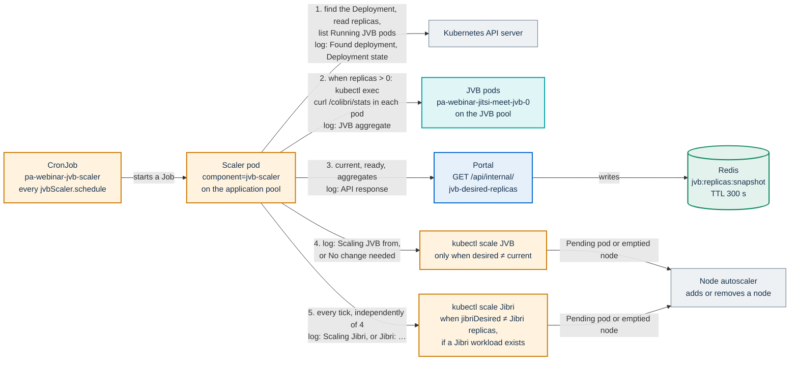
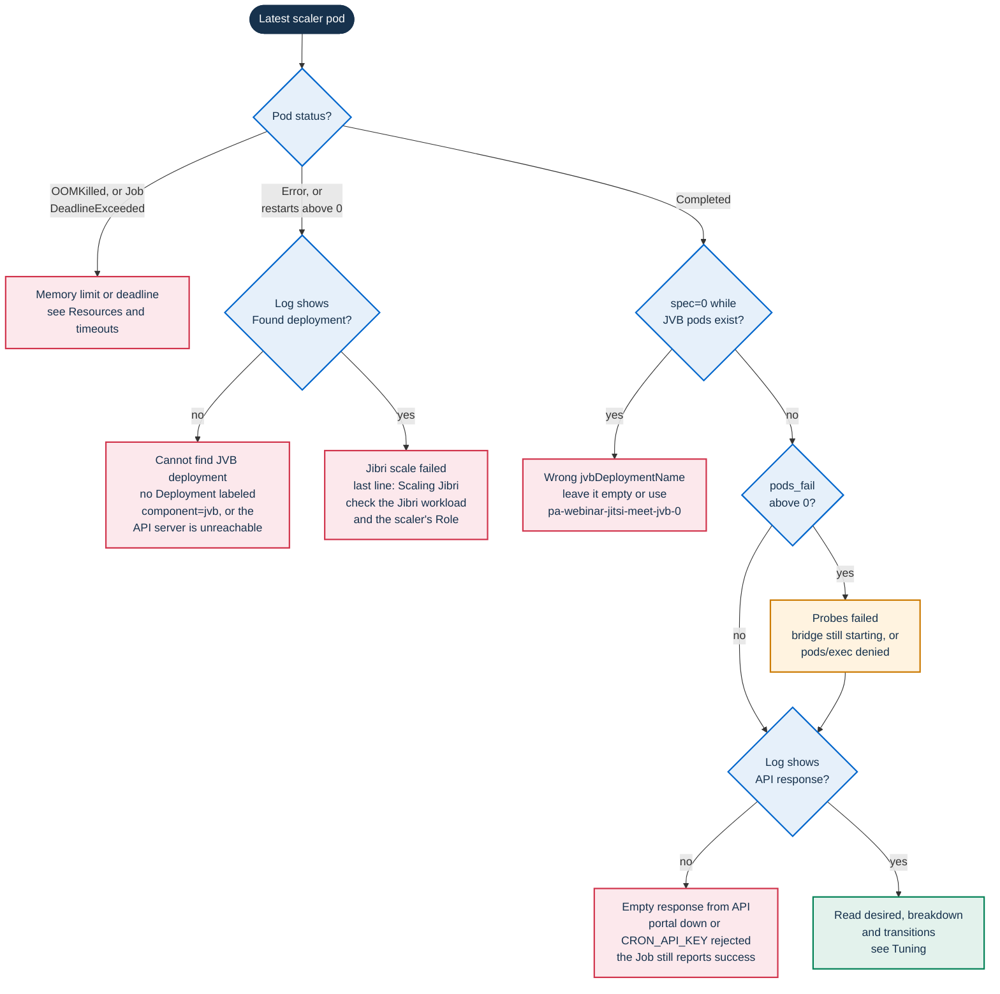

# Running the JVB scaler

This page is for operators of the Helm full profile (`jitsi.mode: full`). It
covers turning the JVB scaler on, the limits of the job itself, the settings
worth tuning, how to check that a tick did what it should, and how to pause
the scaler safely.

It does not explain how the scaler decides:

- the capacity model, the sizing formula, the Redis snapshot and node-pool
  scale to zero are in [Scaling the media plane](../architecture/scaling.md);
- the event statuses that each tick moves are in
  [Event lifecycle](../architecture/event-lifecycle.md);
- choosing machines and sizing the bridge pool are in
  [Installing PA Webinar](../install/README.md#requirements) and the guide of
  each managed cloud;
- the chart keys around it are in [Deploying with Helm](../DEPLOYMENT.md).

The literal examples use `pa-webinar` as both the Helm release and the
namespace. With that release name the objects involved are:

| Object | Name | Rendered by |
|---|---|---|
| Scaler CronJob | `pa-webinar-jvb-scaler` | `templates/cronjob-jvb-scaler.yaml` |
| Scaler ServiceAccount, Role and RoleBinding | `pa-webinar-scaler` | the same template |
| JVB Deployment | `pa-webinar-jitsi-meet-jvb-0` | jitsi-meet subchart |
| Portal Deployment and Service | `pa-webinar` | `templates/deployment.yaml`, `templates/service.yaml` |
| Redis pod | `pa-webinar-redis-master-0` | redis subchart |
| Bridge REST Service, for the portal's fallback probe | `pa-webinar-jvb-rest` | `templates/jvb-rest-service.yaml`, when the subchart exposes no REST port and `jitsi.jvbHealthUrl` is empty |

With another release name, the chart's own objects are prefixed
`<release>-pa-webinar` (or just `<release>` when the release name already
contains `pa-webinar`), and the subchart's objects `<release>-jitsi-meet`.

## A tick, operationally

The scaler is a CronJob that runs a short shell script. The script gathers
facts from the cluster, asks the portal for a decision, and applies it. Each
step writes a log line that you can look for.



The portal does more than size the bridge pool on each call. In one database
transaction it also applies every automatic status change, and it closes the
call sessions of rooms that went `IDLE` or `ENDED`. This is why a scaler that
is broken or paused affects events, not only cost. The full sequence is in
[One scaler tick](../architecture/scaling.md#one-scaler-tick).

## Enabling

### Values

The CronJob and its RBAC objects render only when all three of these hold:

- `jitsi.enabled: true`;
- `jitsi.mode: full`;
- `jvbScaler.enabled: true`. The default is `false` in
  `infra/helm/pa-webinar/values.yaml`.

A minimal set of values:

```yaml
jitsi:
  enabled: true
  mode: full

jvbScaler:
  enabled: true
  schedule: "*/2 * * * *"
  image: ""                      # empty = kubectlImage, pinned by digest
  jvbDeploymentName: ""          # empty = auto-detect

jitsi-meet:
  jvb:
    replicaCount: 0              # the scaler takes it from here
    nodeSelector:
      workload: jitsi-jvb
    tolerations:
      - key: workload
        value: jitsi-jvb
        effect: NoSchedule

app:
  env:
    JVB_MAX_REPLICAS: "1"        # read "Capacity and caps" before raising it
```

About each key:

- **`jvbScaler.schedule`** defaults to `*/2 * * * *` in `values.yaml`. Keep
  the interval under five minutes (see [Cadence](#cadence)).
- **`jvbScaler.jvbDeploymentName`**: leave it empty. The script then takes the
  first Deployment labeled `app.kubernetes.io/component=jvb`. If none is
  found, it takes the first Deployment whose name contains `jvb`. If you do
  set a name, it must be exactly `<release>-jitsi-meet-jvb-0`: the subchart
  appends the port index to the name.
- **`jitsi-meet.jvb.replicaCount`** is the bridge count at install time.
  Every `helm install` and `helm upgrade` writes it into the JVB Deployment
  again, overriding what the scaler set. The next tick corrects it. With `0`,
  an upgrade during an event takes the bridge away until then, so upgrade
  outside events (see [Upgrades and rollback](upgrades.md)).
- **Jibri.** The same tick scales Jibri, but only if a Deployment or
  StatefulSet labeled `app.kubernetes.io/component=jibri` exists. It asks for
  one replica while any `LIVE` or `PROVISIONING` event has recording turned
  on, and zero otherwise. Otherwise the log reads
  `Jibri: deployment/statefulset not found — skipping`, which is expected when
  Jibri is off. Recording values are in
  [Setting up recording](recording-setup.md).

> **The full-profile example ticks every five minutes.**
> `infra/helm/pa-webinar/examples/values-full.yaml` sets
> `schedule: "*/5 * * * *"`. At that interval rooms open later and the
> snapshot can expire between ticks (see [Cadence](#cadence)). Set the
> schedule back to `*/2 * * * *` before you use the example. The example
> leaves `image` and `jvbDeploymentName` empty, so the chart's pinned
> `kubectlImage` and auto-detection apply.

### The dedicated pool contract

Scale to zero needs a node pool that can empty. The contract that pool must
meet is stated once, in
[The JVB pool contract](../../infra/aks/node-pools.md#the-jvb-pool-contract),
and why each rule matters is explained in
[Node-pool scale to zero](../architecture/scaling.md#node-pool-scale-to-zero).
Machine size, pool limits and zones are in the guide of each managed cloud
([AKS](../install/aks.md), [GKE](../install/gke.md), [EKS](../install/eks.md)),
and any other cluster in [Node pools](../INFRASTRUCTURE.md#node-pools). Three
points concern the scaler
directly:

- **The pool must be able to reach 0 nodes.** The scaler only removes bridge
  pods; the cluster autoscaler removes the emptied nodes.
- **The pool maximum must be at least `JVB_MAX_REPLICAS`**, plus room for
  Jibri if it shares the pool. Replicas that the scaler asks for above the
  pool maximum stay `Pending`.
- **The scaler runs on the application pool.** The job uses
  `app.nodeSelector` and `app.tolerations`, so it never lands on the JVB pool
  and never keeps it awake.

### Permissions

The chart creates a ServiceAccount, a namespaced Role and a RoleBinding, all
named `<fullname>-scaler`. The Role grants:

| API group | Resource | Verbs | Used for |
|---|---|---|---|
| `apps` | `deployments`, `statefulsets` | `get`, `list` | finding the JVB and Jibri workloads |
| `apps` | `deployments/scale`, `statefulsets/scale` | `get`, `patch` | `kubectl scale` |
| core | `pods` | `get`, `list` | listing the running bridges |
| core | `pods/exec` | `create` | reading `/colibri/stats` inside each bridge |

The portal's own ServiceAccount has none of these rights, which is why the
per-bridge probing happens in the job. Keep two things in mind:

- **`pods/exec` is not limited by name.** The scaler's ServiceAccount can
  exec into any pod in the release namespace, including the portal and the
  datastores. Give the release a namespace of its own.
- **The job authenticates to the portal with `CRON_API_KEY`**, which it reads
  from the application Secret (`secrets.existingSecretName`, or the Secret
  that the chart generates). It sends the key in the `x-api-key` header. The
  portal reads the same key from the same Secret, so they agree unless the
  Secret is edited while pods are running.

The pod runs as UID and GID 1001 with `runAsNonRoot`, a read-only root
filesystem, no privilege escalation, all capabilities dropped and the
`RuntimeDefault` seccomp profile. This satisfies the Kubernetes "restricted"
Pod Security Standard. The pod has no `imagePullSecrets`.

To check the permissions from outside:

```bash
SA=system:serviceaccount:pa-webinar:pa-webinar-scaler
kubectl -n pa-webinar auth can-i create pods --subresource=exec --as=$SA
kubectl -n pa-webinar auth can-i patch deployments --subresource=scale --as=$SA
```

### With `networkPolicy.enabled`

The scaler needs no extra rule. The chart's optional NetworkPolicy
(`templates/networkpolicy.yaml`) applies only to the portal pods: it selects
the pods of the release that have no `app.kubernetes.io/component` label, and
the scaler pod carries `app.kubernetes.io/component=jvb-scaler`. The chart
therefore leaves the scaler's egress to the API server, the bridges and the
portal unrestricted. On the portal side, the policy admits every pod of the
release (the chart's selector labels) on port 3000, so the scaler's call to
`/api/internal/jvb-desired-replicas` gets through.
`networkPolicy.ingress.fromPodSelectors` needs no entry for it.

One caveat: if you add a default-deny policy of your own that covers the
whole namespace, allow the scaler pods
(`app.kubernetes.io/component: jvb-scaler`) egress to DNS, to the Kubernetes
API server and to the portal pods on port 3000. Then validate a tick (see
[Trigger a tick now](#trigger-a-tick-now)).

The NetworkPolicy itself is documented in
[Deploying with Helm](../DEPLOYMENT.md).

## Resources and timeouts

Most settings of the job are fixed in the template and cannot be changed
through values:

| Setting | Value | Why |
|---|---|---|
| CPU request and limit | `10m` and `200m` | The job is idle most of the time; `kubectl exec` to each bridge bursts. |
| Memory request and limit | `64Mi` and `256Mi` | Each `kubectl exec` starts its own client. With three or more bridges, smaller limits get the pod OOM-killed. Do not lower it. |
| `activeDeadlineSeconds` | `240` | This caps the whole run, measured from the Job's creation. It includes waiting for a node on the application pool and pulling the image; the work itself takes seconds. |
| `concurrencyPolicy` | `Forbid` | A run that overruns makes the next tick skip. Ticks are never queued. |
| `backoffLimit`, `restartPolicy` | `1`, `OnFailure` | A failed container is retried once, then the Job fails. |
| `successfulJobsHistoryLimit`, `failedJobsHistoryLimit` | `3`, `3` | The last three successful runs and the last three failed runs are kept, with their pods and logs. |
| `ttlSecondsAfterFinished` | `cronjobs.jobTtlSeconds` (`7200` in `values.yaml`) | This one is configurable. It removes finished Jobs and their pods. |
| Timeout for each bridge probe | `curl --max-time 3` inside the bridge | One slow bridge cannot stall the run. |
| Call to the portal | `curl -sf --retry 3 --retry-delay 5 --retry-connrefused --connect-timeout 5` | `--retry-connrefused` also retries a refused connection, so short portal restarts are absorbed. `-f` turns an HTTP error, such as a rejected key or a 5xx, into an empty response. |

Two behaviors affect alerting:

- **Most failures do not fail the Job.** When the portal is unreachable,
  rejects the key, or returns no `desired`, the script logs an error, keeps
  the current replica count and exits with success. A failed `kubectl scale`
  of the bridges is logged but does not fail the Job either. A Job fails
  only in these cases: no JVB Deployment is found at all, scaling Jibri
  fails, or the pod is OOM-killed or runs past its deadline. Watch the
  freshness of the snapshot (see [Check the snapshot](#check-the-snapshot))
  as well as Job failures.
- **Never pass `--request-timeout` to `kubectl exec`** if you adapt the
  script. With that flag, kubectl ignores the in-cluster configuration and
  dials `localhost:8080`, so every probe fails. The `curl --max-time` and the
  deadline already bound the run.

<a id="pin-the-kubectl-image"></a>

### The kubectl image

`jvbScaler.image` is empty by default, and the template then uses the
top-level `kubectlImage` value from `infra/helm/pa-webinar/values.yaml`,
which is pinned by digest. The comment next to it explains why: the public
registry publishes only a moving `latest` tag for that image, with no
versioned tags. Two other jobs fall back to the same value when
their own `image` is empty: the configuration-reload hook
(`configReloadHook.image`, then `jvbScaler.image`, then `kubectlImage`) and
the post-production orchestrator (`postprod.orchestrator.image`).

To change the image, either resolve and test a new digest and set it in
`kubectlImage`, or mirror the image into your own registry and point the
value there. `jvbScaler.image` overrides it for the scaler and, while
`configReloadHook.image` is empty, for the configuration-reload hook too.
Whatever you choose:

- use a kubectl version within one minor version of your cluster;
- the pod has no `imagePullSecrets`, so the node must be able to pull the
  image anonymously or with its own credentials. The pull time counts
  against the 240-second deadline;
- the image must provide `sh`, `kubectl`, `curl`, `grep`, `sed`, `awk`,
  `head` and `date`, and it must work as UID 1001 on a read-only root
  filesystem. The script uses no `jq`.

## Tuning

Most of the knobs that shape the scaler's decisions are runtime settings.
They are stored in `SiteSetting`, changed from the administration area and
applied without a redeploy. Each portal pod caches the settings for 60
seconds, so a change reaches the scaler within about a minute. The owner
page for these settings is
[Runtime settings](../configuration/runtime-settings.md), which gives each
one's default, accepted range and exact meaning (see
[Event lifecycle and bridge timing](../configuration/runtime-settings.md#event-lifecycle-and-bridge-timing)
and [Bridge sizing](../configuration/runtime-settings.md#bridge-sizing)).
The table lists the settings that matter operationally and what tuning them
does to the scaler:

| Setting | Where in the administration area | Operational effect |
|---|---|---|
| `jvbPreScaleMinutes` | **Features** tab, **Pre-scale lead time (minutes)** | How long before `startsAt` an event becomes `PROVISIONING` and gets a bridge. It must cover the cold start (see [Lead time and cold start](#lead-time-and-cold-start)) |
| `jvbInactiveGraceMinutes` | **Features**, **Inactivity minutes before shutdown** | How long a `LIVE` room stays empty before it goes `IDLE` and its bridge is released (see [Scale-down](#scale-down)) |
| `jvbEmptyCloseMinutes` | **Features**, **Empty-room minutes before definitive close** | Opt-in: closes an emptied room for good (`ENDED`) before its end time |
| `jvbStressWarnPercent`, `jvbStressCriticalPercent` | **Features**, **Stress warning threshold (%)**, **Stress critical threshold (%)** | Adds one bridge above the warning threshold, and two above the critical one (see [Reactive margin](#reactive-margin)) |
| `jvbProvisioningTimeoutMinutes` | **Features**, **Provisioning timeout (minutes)** | When the status page reports a waiting event as degraded, and, for an event with recording on, when the live room stops showing the recording service as starting and reports it as not started. It changes nothing else |
| `jvbCpuCoresPerPod`, `jvbReceiversPerCore`, `jvbSendersPerCore` | **Infra sizing** tab, **vCPU per JVB pod**, **Passive viewers per core**, **Active senders per core** | How many bridges an event needs. Align them with your bridges (see [Capacity and caps](#capacity-and-caps)) |
| `jvbMaxReplicas` | **Infra sizing**, **Max JVB replicas** | Per-event cap; it does not limit the total |
| `defaultSenderRatioPct` | **Infra sizing**, **Default sender ratio** | Sender share for events that set none |
| `eventGracePeriodMinutes` | **Infra sizing**, **Default grace minutes past endsAt** | Overtime before a `LIVE` room past its end is closed |

The route has environment fallbacks for some of these (`JVB_PRE_SCALE_MINUTES`,
`JVB_INACTIVE_GRACE_MIN`, `JVB_EMPTY_CLOSE_MIN`), but the columns always hold
a value, so those variables have no effect. Tune the settings instead.

### Cadence

`jvbScaler.schedule` sets how often all of this is re-evaluated. Keep the
`values.yaml` default of two minutes, or at least an interval shorter than
five minutes:

- a `PROVISIONING` event becomes `LIVE` only on a tick, so a room opens up to
  one interval after its start time;
- when no bridge is running, a woken or instant room waits for the next tick
  (up to one interval) before its bridge is requested, then for the cold
  start. An instant call is created directly as `LIVE`. A woken room is
  `PROVISIONING` and opens on the first tick after a bridge answers;
- the Redis snapshot expires after 300 seconds. At an interval of five
  minutes or more it can expire between ticks, and the status pages and
  metrics then fall back to a single probe (see
  [The Redis snapshot](../architecture/scaling.md#the-redis-snapshot)).

### Lead time and cold start

`jvbPreScaleMinutes` must cover the whole chain between the tick that asks
for a bridge and the tick that opens the room:

- up to one tick interval before the event is picked up;
- node provisioning, image pull and bridge start;
- one more interval before a tick sees the bridge answer.

Measure your own cold start instead of guessing it. After a bridge has come
up from zero, for example in the [end-to-end check](#end-to-end-check),
compare its pod's creation time with the time it became ready:

```bash
kubectl -n pa-webinar get pods -l app.kubernetes.io/component=jvb -o jsonpath=\
'{range .items[*]}{.metadata.name}{"  created "}{.metadata.creationTimestamp}{"  ready "}{.status.conditions[?(@.type=="Ready")].lastTransitionTime}{"\n"}{end}'
```

The pod is created when the tick scales the Deployment, so the gap covers
node provisioning, image pull and bridge start. Add two tick intervals to
it to get the smallest safe lead time. Scaler logs are not suited to this
measurement, because only the last three successful runs are kept. The
model behind the window is in
[Cold start and the pre-scale window](../architecture/scaling.md#cold-start-and-the-pre-scale-window).

### Scale-down

A bridge is released on the first tick after its last event stops being
billable: when the event goes `IDLE` after `jvbInactiveGraceMinutes`, or
`ENDED`. The emptied node then remains until the cluster autoscaler's own
scale-down delay has passed: 10 minutes in the AKS module's autoscaler
profile (`infra/tofu/aks/cluster.tf`). You pay for the node until it
expires. Shorten the inactivity grace to save cost. Lengthen it if
participants often leave and come back after a break.

`jvbEmptyCloseMinutes` is a different mechanism. It ends a room for good,
and an `ENDED` room cannot be woken. Leave it at `-1` unless you accept that
risk; [Event lifecycle](../architecture/event-lifecycle.md) explains the
trade-off.

### Reactive margin

The stress thresholds add bridges on top of what the sizing asks for. They
use the highest stress of any bridge, capped at 1.0, and ignore bridges with
no participants. Keep the critical threshold above the warning one. Without
bridge cascading (see
[Capacity is two numbers](../architecture/scaling.md#capacity-is-two-numbers)),
the extra bridges only give room to new conferences. They do not take load
off the conference that is under stress.

### Capacity and caps

Two caps apply, and only one of them limits the total:

- **`JVB_MAX_REPLICAS`** is the global cap on the sum over all events. It is
  an environment variable of the portal, read when the process starts, and
  the default is `6` (`app/src/lib/jvb-sizing.ts`). Set it in `app.env`. A
  change there rolls the portal pods, because the Deployment carries a
  checksum of the ConfigMap. If you put it in the Secret instead, restart the
  portal pods yourself.
- **Max JVB replicas** (`jvbMaxReplicas`) caps each event before the sum.
  However low you set it, it does not limit the total.

Keep `JVB_MAX_REPLICAS` at `1` until each bridge can be reached on an address
of its own. Several bridges behind one load-balancer IP drop participants;
see [The single-IP pitfall](../architecture/scaling.md#the-single-ip-pitfall).
Then align **vCPU per JVB pod** with the CPU that the JVB container actually
gets, as described in
[Align the defaults with your bridges](../architecture/scaling.md#align-the-defaults-with-your-bridges).

### Per-event inputs

The scaler reads these per-event inputs. It sizes each event from what its
organizer declared, not from who has joined:

| Input | Where it is set | Default or effect |
|---|---|---|
| `maxParticipants` | Event form, **Expected participants (estimate)**; event templates | Sizing input. Default `300` in `schema.prisma` |
| `expectedSenderRatioPct` | Event form, **Expected sender ratio** | Sizing input. Falls back to **Default sender ratio** |
| `participantsCanStartVideo` | Event form, **Participants can start video**; event templates | Sizing input. Default `false`: every participant counts as a receiver |
| `gracePeriodMinutes` | Event form, **Event end (soft exit)** | Not a sizing input: it decides when a room past its end is closed. Falls back to **Default grace minutes past endsAt** |
| `recordingEnabled` | Event settings; event templates | Not a sizing input: it decides whether Jibri is scaled up. Default `false` in `schema.prisma` |

Instant calls use 50 expected participants unless the request gives a
number, and they have video and recording on and a grace of `-1`
(`app/src/app/api/events/instant/route.ts`).

To see how these inputs became a number, read the `API response` line of a
tick. It contains `predictiveDesired`, `reactiveAdjustment`, `maxReplicas`
(the global cap) and a `breakdown` with one entry per billable event: its
status, expected participants, sender ratio, whether video is enabled, the
bridges it needs and whether it is in overtime.

## Validating a tick

Run these checks after enabling the scaler, after changing its values, and
whenever bridges do not appear or disappear as expected.

### Trigger a tick now

To avoid waiting for the schedule, create a Job from the CronJob's template:

```bash
kubectl -n pa-webinar create job --from=cronjob/pa-webinar-jvb-scaler \
  jvb-scaler-manual-$(date +%s)
```

It behaves like a scheduled run, with the same labels, deadline and TTL,
except that `concurrencyPolicy: Forbid` does not apply to it: that policy
covers only the runs the CronJob starts, so a manual Job can run alongside a
scheduled one and both may scale. Check that no scheduled run is active
first (the `ACTIVE` column of `kubectl get cronjob`, below).

### Find the run and read its log

The chart labels the scaler's pod template with
`app.kubernetes.io/component=jvb-scaler`. The pods carry that label, and so
do the Jobs, because Kubernetes copies pod-template labels onto a Job that
has none of its own:

```bash
# Schedule, suspend flag, active runs and the last schedule time
kubectl -n pa-webinar get cronjob pa-webinar-jvb-scaler

# Recent runs
kubectl -n pa-webinar get jobs -l app.kubernetes.io/component=jvb-scaler \
  --sort-by=.metadata.creationTimestamp

# Log of the latest run
POD=$(kubectl -n pa-webinar get pods -l app.kubernetes.io/component=jvb-scaler \
  --sort-by=.metadata.creationTimestamp -o jsonpath='{.items[-1:].metadata.name}')
kubectl -n pa-webinar get pod "$POD"
kubectl -n pa-webinar logs "$POD"
```

A healthy tick with one bridge in use looks like this (the API response is
shortened):

```text
[…] JVB Scaler: Found deployment: pa-webinar-jitsi-meet-jvb-0
[…] JVB Scaler: Deployment state: spec=1 ready=1
[…] JVB Scaler: JVB aggregate: pods_ok=1 pods_fail=0 participants=12 conferences=1 bitDown=… bitUp=… largest=12 stressMilli=90
[…] JVB Scaler: API response: {"desired":1,"jibriDesired":0,"predictiveDesired":1,"reactiveAdjustment":0,…,"breakdown":[…],"transitions":{…}}
[…] JVB Scaler: Current: 1, Desired: 1
[…] JVB Scaler: No change needed
[…] JVB Scaler: Jibri: deployment/statefulset not found — skipping
```

Every tick that gets a `desired` from the portal ends with a Jibri line. Without Jibri it
is the `not found — skipping` line above, which is expected. With Jibri it is
`Jibri: no change (…)` or `Scaling Jibri (…)`. With no bridge running
(`spec=0`), the `JVB aggregate` line is absent. That is normal between
events.

Read a run in this order:



| Log line or pod status | Meaning | What to do |
|---|---|---|
| `ERROR: Cannot find JVB deployment` (the Job fails) | Auto-detection found nothing. | Check that the jitsi-meet subchart is installed in the same namespace and that the job can reach the API server. |
| `Deployment state: spec=0 ready=0`, while JVB pods are running | The configured `jvbDeploymentName` does not exist. The script reads zero and scales nothing. | Clear `jvbScaler.jvbDeploymentName`, or set it to `<release>-jitsi-meet-jvb-0`. |
| `Error from server (NotFound)`, then `Scale command completed (exit 1)` | Same cause as the previous row. | Same fix. |
| `pods_fail` above 0 | A bridge did not answer `/colibri/stats`. This is normal for a bridge that is still starting. When every probe fails, the tick sends no aggregates and the portal falls back to its own probe of `JVB_HEALTH_URL`: if that answers, rooms still open, but the snapshot has no traffic figures. | If it persists, check `pods/exec` with `kubectl auth can-i` and the JVB pod's readiness. |
| `ERROR: Empty response from API — keeping current replicas` | The portal was unreachable, returned an error, or rejected `CRON_API_KEY`. The Job still succeeds. | Check the portal pods and the Secret's `CRON_API_KEY`. If you added a default-deny policy of your own, see [With `networkPolicy.enabled`](#with-networkpolicyenabled). |
| `ERROR: Cannot parse desired from response` | The portal answered, but without `desired`. | Read the portal logs for that time. |
| `Jibri: deployment/statefulset not found — skipping` | No Jibri workload. | Nothing, unless you expect Jibri. |
| `Scaling Jibri (…)`, then an error, and the Job fails | The Jibri `kubectl scale` failed. It is the script's last command, so its exit status fails the run. | Check the Jibri workload and the scaler's Role (see [Permissions](#permissions)). |
| Pod `OOMKilled` | The memory limit was exceeded. | Check that the template's `256Mi` limit was not lowered. |
| Job `DeadlineExceeded` | The run took more than 240 seconds, usually while waiting for a node or an image. | Check that the nodes pull the kubectl image quickly (mirror it if they do not; see [The kubectl image](#the-kubectl-image)) and check the application pool's capacity. |

Each portal pod that serves a tick with billable events or status changes
also logs one line, `[jvb-scaler] tick … current=… ready=… desired=…
aggregated=… transitions={…}`. The portal pods are the ones without a
component label:

```bash
kubectl -n pa-webinar logs --prefix --since=15m --tail=-1 \
  -l 'app.kubernetes.io/name=pa-webinar,app.kubernetes.io/instance=pa-webinar,!app.kubernetes.io/component' \
  | grep '\[jvb-scaler\]'
```

### Check the snapshot

Each tick stores what it saw in Redis, and the status pages read it from
there. The quickest check uses the endpoint behind the status page
(**System status**, `/status`) and the administration area's
**Infrastructure** page. It answers anonymous callers only while
**Status page enabled** (**Features** tab) is on, which is the default.
When an administrator has switched it off, the endpoint returns 404 to
anyone else: open it in a browser signed in as an administrator, or read the
Redis key directly as shown further down.

```bash
curl -s https://webinar.example.com/api/status/infrastructure \
  | jq '.services[] | select(.id == "jvb") | {status, replicas, metadata}'
```

In the output, `replicas.running` is the ready count from the snapshot, and
`metadata.participants` and `metadata.conferences` are the sums across
bridges. The endpoint computes its own `replicas.desired` from the events,
without the stress margin, so it can differ from the scaler's number.
`replicas.max` is `JVB_MAX_REPLICAS`.

The endpoint does not show how old the snapshot is. To see that, read the
key directly (in-cluster Redis from the subchart, which mounts its password
as a file):

```bash
kubectl -n pa-webinar exec pa-webinar-redis-master-0 -- sh -c \
  'export REDISCLI_AUTH="$(cat "$REDIS_PASSWORD_FILE")";
   redis-cli GET jvb:replicas:snapshot; redis-cli TTL jvb:replicas:snapshot'
```

The value's shape is the `JvbSnapshot` type in `app/src/lib/jvb-snapshot.ts`.
Check these fields:

- `checkedAt` should be no older than one tick interval;
- `current` and `ready` should match the JVB Deployment;
- `pollSuccesses` should be greater than 0 while bridges run. When it is
  missing, no bridge answered on that tick.

A missing key means that no tick has reached the portal and Redis in the
last 300 seconds. This is how you spot the failures that do not fail the
Job.

### End-to-end check

Once the single-tick checks pass, confirm the whole loop with an instant
call when no event is scheduled:

1. Create an instant call from **Instant calls** in the administration area.
   It is created directly as `LIVE`, with video and recording on.
2. On the next tick, the log shows `Scaling JVB from 0 to 1`, and Jibri also
   scales if it is installed. A bridge pod goes `Pending`, the autoscaler
   adds a node, and a later tick shows `spec=1 ready=1` and `pods_ok=1`.
3. Join the call from two browsers and check that `participants` appears in
   the aggregate line and in the snapshot.
4. End the call with **End for everyone**. On the next tick `desired` drops
   to 0, the bridge is scaled down, and the node leaves after the
   autoscaler's delay.

Before the bridge is scaled down in step 4, run the timestamp command in
[Lead time and cold start](#lead-time-and-cold-start) to record your cold
start.

## Pausing for maintenance or load tests

Pause the scaler when you need to control the bridge count by hand. Typical
cases are a load test and maintenance of the JVB pool. Suspend the CronJob;
do not uninstall it. Setting `jvbScaler.enabled: false` removes the CronJob
and its RBAC objects altogether.

### What a pause stops

Suspending the CronJob stops much more than scaling:

- **Bridge and Jibri counts freeze** at whatever they are. A running bridge
  keeps its node, and a bridge at zero stays at zero.
- **The automatic lifecycle stops.** No event moves to `PROVISIONING`,
  `LIVE`, `IDLE` or `ENDED` by itself, and call sessions are not closed.
  Manual actions such as **Start event** and **End for everyone** keep
  working. A visitor who wakes a room moves it to `PROVISIONING`, where it
  stays until the scaler runs again (see
  [Pitfall: a wake without a scaler](../architecture/event-lifecycle.md#pitfall-a-wake-without-a-scaler)).
- **The snapshot expires** 300 seconds after the last tick. The status pages
  and `/api/metrics` then fall back to a single probe of `JVB_HEALTH_URL`,
  which reads one bridge through the `<fullname>-jvb-rest` Service
  (`pa-webinar-jvb-rest` here), or through the subchart's bridge Service when
  that one exposes port 8080: exact with one bridge, a lower bound with
  several (see
  [When something fails](../architecture/scaling.md#when-something-fails)).
- **The recorder controller is not notified** when an event goes live. Its
  own reconcile loop still runs.

**Never pause during a scheduled event**, inside its pre-scale window, or
while anyone may join an `IDLE` room or start an instant call. Rooms would
not open, and a new call would have no bridge. What each status does
without the scaler is described in
[Running without the scaler](../architecture/event-lifecycle.md#running-without-the-scaler).

### Procedure

```bash
NS=pa-webinar
REL=pa-webinar

# 1. Check that nothing is live and nothing is about to start. The endpoint
#    reports LIVE events (active) and events not yet over (upcomingCount);
#    confirm their start times in the administration area. It answers
#    anonymous callers only while Status page enabled is on (see
#    "Check the snapshot").
curl -s https://webinar.example.com/api/status/infrastructure | jq '.events'

# 2. Note the current state, so that you can restore it.
kubectl -n $NS get cronjob $REL-jvb-scaler -o jsonpath='{.spec.suspend}{"\n"}'
kubectl -n $NS get deploy $REL-jitsi-meet-jvb-0 -o jsonpath='{.spec.replicas}{"\n"}'

# 3. Suspend the scaler.
kubectl -n $NS patch cronjob $REL-jvb-scaler -p '{"spec":{"suspend":true}}'

# 4. Wait until no run is in flight: a run that already started, including
#    one still Pending on a node or an image pull, can still scale the
#    bridge. Repeat until the list is empty (at most 240 seconds).
kubectl -n $NS get pods -l app.kubernetes.io/component=jvb-scaler \
  --field-selector=status.phase!=Succeeded,status.phase!=Failed

# 5. Do the work, scaling by hand if it needs a bridge.
kubectl -n $NS scale deploy/$REL-jitsi-meet-jvb-0 --replicas=1

# 6. Restore: the replica count noted in step 2, then the suspend flag
#    noted in step 2 (normally false).
kubectl -n $NS scale deploy/$REL-jitsi-meet-jvb-0 --replicas=<noted value>
kubectl -n $NS patch cronjob $REL-jvb-scaler -p '{"spec":{"suspend":<noted value>}}'
```

[In-cluster load test with Selenium Grid](../../scripts/load-test/SELENIUM-GRID.md)
wraps a test run in this pause. Measurements and method are in
[Load testing](../LOAD-TESTING.md).

If you run `helm upgrade` during a pause, check `.spec.suspend` afterwards.
The upgrade also writes `jitsi-meet.jvb.replicaCount` into the JVB
Deployment, which undoes a manual scale.

### After resuming

Kubernetes may start a run immediately for the schedules it missed. Either
way, the first tick catches up with everything that became due while the
scaler was paused. Events past their end go `ENDED`, events inside the
pre-scale window go `PROVISIONING`, and the bridge count is set to what the
current events need, whatever you set by hand. Validate that tick as
described in [Find the run and read its log](#find-the-run-and-read-its-log).

## KEDA

`infra/helm/pa-webinar/examples/keda-jvb-scaler.yaml` is an example
ScaledObject. The chart does not use KEDA, and the full profile is not built
around it. The example is not a drop-in replacement:

- its header tells you to disable the CronJob. Doing so also disables the
  automatic lifecycle, the closing of call sessions, the snapshot and the
  recorder notification. Events then behave as in
  [Running without the scaler](../architecture/event-lifecycle.md#running-without-the-scaler);
- it targets the Deployment `videocall-jitsi-meet-jvb-0`, the name for a
  release called `videocall`. Change it to `<release>-jitsi-meet-jvb-0`. Its
  namespace (`videocall`) and Secret names are hard-coded too;
- it sizes from a count of events rather than from their size, and it reads
  no bridge statistics.

The full list of reasons is in
[Why not KEDA](../architecture/scaling.md#why-not-keda).

## Related pages

- [Scaling the media plane](../architecture/scaling.md): how the scaler
  decides, the snapshot, node pools and known limitations.
- [Event lifecycle](../architecture/event-lifecycle.md): the statuses a tick
  moves, and life without the scaler.
- [Runtime settings](../configuration/runtime-settings.md): every setting
  quoted on this page.
- [Installing PA Webinar](../install/README.md): choosing machines and sizing
  the bridge pool.
- [Deploying with Helm](../DEPLOYMENT.md): profiles, chart keys and the
  NetworkPolicy.
- [Upgrades and rollback](upgrades.md): upgrading without disturbing a live
  event.
- [Monitoring and health](monitoring.md): status pages, metrics and the
  media-plane alerts.
- [Troubleshooting](troubleshooting.md): symptoms that start outside the
  scaler.
- [Load testing](../LOAD-TESTING.md): reference measurements for the sizing
  settings.
- [ADR-007](../adr/007-jvb-scale-to-zero.md): why bridges scale to zero.
