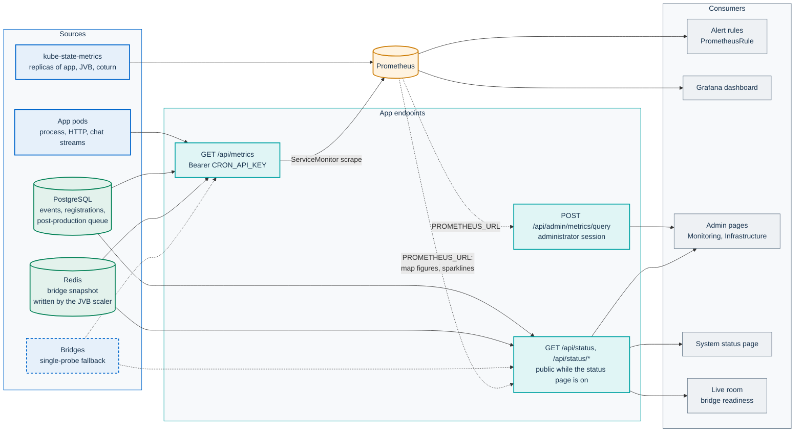
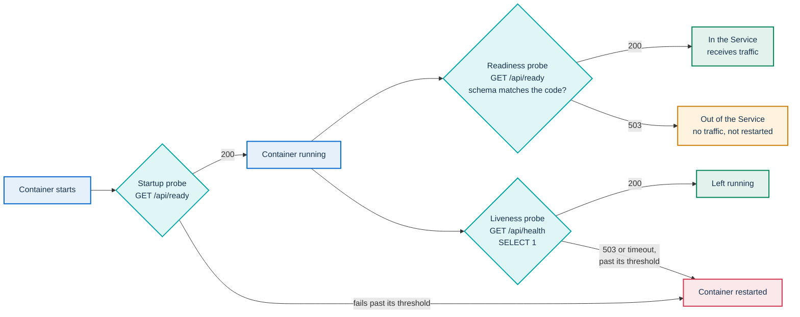

# Monitoring and health

This page is for operators and SREs who run PA Webinar, and for developers
who add signals to it. It covers the health probes, the status endpoints and
pages, the Prometheus metrics and how they are scraped, the bundled alert
rules and Grafana dashboard, how the app queries Prometheus, and what the
application writes to its logs.

How bridge capacity is modeled and provisioned is in
[Scaling the media plane](../architecture/scaling.md). Symptom-to-fix entries
are in [Troubleshooting](troubleshooting.md). Diagnosing the AI pipeline
itself is in [AI post-production](../POSTPROD.md).

## What you get at each level

Monitoring is layered. Each layer works without the ones below it.

| Layer | What you get | What it needs |
|---|---|---|
| Probes and status | `/api/health`, `/api/ready`, the public **System status** page, the administrators' **Infrastructure** page | Nothing (the public page needs **Status page enabled**, on by default) |
| Metrics endpoint | `GET /api/metrics` in the Prometheus text format | `CRON_API_KEY` in the app Secret |
| Scraping | A `ServiceMonitor` for the app | Prometheus Operator, `metrics.serviceMonitor.enabled` and `metrics.bearerTokenSecret` |
| Alerting | A `PrometheusRule` with the bundled rules | Prometheus Operator and kube-state-metrics |
| Dashboards | A ConfigMap with the Grafana dashboard | A Grafana sidecar that loads dashboards from ConfigMaps |
| Charts inside the app | The **Monitoring** page, and the Prometheus figures and sparklines on the status pages | `PROMETHEUS_URL` |

The Docker Compose stack stops at the first two layers. Its `app` health
check calls `/api/health`, and it runs no Prometheus.

The diagram shows where each signal comes from and who reads it. Dashed
arrows are optional or fallback paths: the single bridge probe is used only
when the scaler's snapshot has no data, and sparklines and map figures exist
only when `PROMETHEUS_URL` is set. The browser never talks to Prometheus: the
app queries it server-side and passes the results on.



## Health probes

The app exposes two probe endpoints. They check different things on purpose.

### `/api/health`: liveness

`GET /api/health` runs `SELECT 1` against the database.

- **200** returns `status`, `timestamp`, `version`, `commit` and `builtAt`.
  The last three come from `NEXT_PUBLIC_BUILD_VERSION`,
  `NEXT_PUBLIC_BUILD_SHA` and `NEXT_PUBLIC_BUILD_DATE`, which the image
  carries and the app reads at runtime. This is the reliable way to see which
  build a pod is running.
- **503** (`SERVICE_UNAVAILABLE`) means the database did not answer.

### `/api/ready`: readiness and startup

`GET /api/ready` runs two ORM reads: the `SiteSetting` row and the most
recent `Event`. Prisma selects every column of a model, so a column that the
code expects and the database lacks makes the read fail. That is what happens
when a pending migration adds a column to `site_settings` or `events`, the two
tables the probe reads. A migration that touches only other tables is not
detected: the pod stays Ready, and the routes that use those tables answer 500
until the migration is applied ([Upgrades and rollback](upgrades.md)).

- **200** returns `{ "status": "ready" }`.
- **503** returns `{ "status": "not_ready", "error": "<message>" }` and writes
  a `[readiness]` line to the log.

### Why two endpoints

A pod whose schema is behind the code is alive but must not serve traffic.
Restarting it would not help. When the gap is in the two tables that
`/api/ready` reads, the readiness probe takes the pod out of the Service and
leaves it running, so users get no 500s while the migration is fixed.
Liveness restarts a process that cannot reach its database or does not answer
in time.

Because liveness checks the database, **a database outage longer than the
liveness window restarts every app container**. The window is
`periodSeconds` × `failureThreshold` of `app.probes.liveness` in
`infra/helm/pa-webinar/values.yaml`.



The probes are set in `app.probes.startup`, `app.probes.readiness` and
`app.probes.liveness`. Startup and readiness call `/api/ready`, and liveness
calls `/api/health`. In a cluster, migrations run in the `db-migrate` init
container before the app container starts
([Upgrades and rollback](upgrades.md)).

### Health of the other components

| Component | Health signal | Read by |
|---|---|---|
| Recorder controller | `GET /healthz` on its `ctrl` port. It answers `ok` whenever the process runs | Its own liveness and readiness probes |
| Jibri | `GET /jibri/api/v1.0/health` on port 2222 | The status endpoints, through `JIBRI_HEALTH_URL`, only when Jibri is expected |
| Bridges | `/colibri/stats` on port 8080 | The JVB scaler, the lifecycle cron, and the status endpoints through `JVB_HEALTH_URL` |
| Conference web container, Prosody, Jicofo | `/external_api.js` on the web Service, BOSH `/http-bind` on Prosody's port 5280, `/about/version` on Jicofo's REST port 8888 | The status endpoints, through `JITSI_WEB_INTERNAL_URL`, `PROSODY_INTERNAL_URL` and `JICOFO_HEALTH_URL` |
| Recorder bot, AI worker, scheduled jobs | Kubernetes Job status | kube-state-metrics, if you alert on it ([Scheduled and background jobs](../architecture/background-jobs.md)) |

With `jitsi.enabled` on, the chart sets `JVB_HEALTH_URL` to the subchart's
bridge Service when that Service is rendered and exposes port 8080
(`jitsi-meet.jvb.service.extraPorts`, with neither host port nor host
network). Otherwise it uses a `<fullname>-jvb-rest` Service that the chart
renders for this purpose (`templates/jvb-rest-service.yaml`). It sets
`JIBRI_HEALTH_URL` to the subchart's Jibri Service on port 2222 only when
Jibri is enabled. It also writes the in-cluster addresses of the web
container, Prosody and Jicofo, the last through a `<fullname>-jicofo-rest`
Service (`templates/jicofo-rest-service.yaml`). Every address uses the full
Service name (`<service>.<namespace>.svc.cluster.local` by default).
`jitsi.jvbHealthUrl`, `jitsi.jibriHealthUrl`, `jitsi.webInternalUrl`,
`jitsi.prosodyInternalUrl` and `jitsi.jicofoHealthUrl` override them
([Configuration reference](../CONFIGURATION.md#conference-status-probes)).
With several bridges the probe reaches one of them, and with the bridges
scaled to zero nothing answers, which is expected
([Scaling the media plane](../architecture/scaling.md)). With an external
Jitsi (`jitsi.enabled: false`) the chart sets none of these variables: set
the ones you can reach in `app.env`.

## Status endpoints and pages

The status routes are public while **Status page enabled**
(`SiteSetting.statusPageEnabled`, on by default in `schema.prisma`) is on.
They exist to feed the public status page, so treat everything they return as
published ([Security architecture](../architecture/security.md)). The switch
is in [Runtime settings](../configuration/runtime-settings.md#public-features),
and the rule is in `app/src/lib/status-page.ts`.

With the switch off:

- `/status` answers 404.
- `/api/status/infrastructure`, `/api/status/postprod` and
  `/api/status/metrics` answer 404 to anyone without an administrator
  session. Administrators still see the map on **Infrastructure**, and their
  answers are kept out of shared caches.
- `/api/status` keeps answering, because the live room needs it, but only
  with `metrics.jvbStatus`, `metrics.jvbParticipants`, `metrics.jvbStale`,
  `metrics.jibriStatus` and `lastChecked`: no components, counters or
  upcoming events.

### `GET /api/status`

This route returns an overall status, one entry per component, a block of
counters, the next events and the page's polling settings. The thresholds
below are constants in `app/src/app/api/status/route.ts`.

| Component | How it is checked | `degraded` when | Other states |
|---|---|---|---|
| `app` | The route answered | Never | Always `operational` |
| `database` | `SELECT 1` | It takes longer than 1 s | `outage` when it fails |
| `jitsi` | Fetches `<JITSI_WEB_INTERNAL_URL>/external_api.js`, 3 s timeout. Without that variable, `external_api.js` from the public host `NEXT_PUBLIC_JITSI_DOMAIN`, 5 s timeout | In the cluster slower than 1.5 s, on the public host slower than 3 s, or a non-2xx answer. On the public host also a TLS or DNS failure, with its error code in `details` | `outage` with the error code when the connection is refused or times out. `unknown` when neither the variable nor the domain is set |
| `prosody` | `<PROSODY_INTERNAL_URL>/http-bind` (BOSH, where `405` also counts as an answer). Without that variable, `/http-bind` on the public host, through the web container | As `jitsi` | As `jitsi` |
| `jicofo` | `<JICOFO_HEALTH_URL>/about/version`, 3 s timeout | Slower than 1.5 s, or a non-2xx answer | `outage` when it does not answer. `unknown` (**Not monitored**) without `JICOFO_HEALTH_URL`: Jicofo has no public address |
| `jvb` | Depends on the bridge mode, below | With the scaler: fewer bridges are ready than needed, scaling or stale | See the bridge modes |
| `jibri` | The Jibri health endpoint at `JIBRI_HEALTH_URL`, called only when the installation expects Jibri | A `LIVE` or `PROVISIONING` event has recording on and no Jibri answers | `standby` when the installation does not expect Jibri (`RECORDING_STORAGE_TYPE` unset, or no recordings storage), or when nothing needs recording |
| `smtp` | Not probed. `operational` when `SMTP_HOST` is set | Never | `unknown` when `SMTP_HOST` is not set |
| `redis` | `PING`, with a 2 s timeout | Slower than 500 ms | `outage` when `REDIS_URL` is not set or no `PONG` comes back |

**Where the conference is probed.** With the conference installed by the
chart, and in the Docker Compose stack, the three probes go to the
components' internal addresses, so a self-signed or internal-CA certificate
on the conference host plays no part and each component has a status of its
own. No separate check of the public host is made there: an expired public
certificate does not show on the status page. Without the internal addresses
(an external Jitsi), the web and Prosody probes go to the public conference hostname
(`meet.webinar.example.com` in the examples), and exercise DNS, TLS and the
ingress from the app pod. A certificate that the app pod does not accept, or
a name it cannot resolve, then turns them `degraded`, with the error code,
and the pages say that the portal could not check the room while the room
may still work. An internal authority can be given to the app with
`app.extraCaCerts` ([Configuration reference](../CONFIGURATION.md#extra-certificate-authorities)).

**Bridge modes.** How the `jvb` component and `metrics.jvbStatus` are read
depends on `JVB_SCALER_ENABLED` and `JVB_HEALTH_URL`
(`app/src/lib/status/bridge.ts`):

| Mode | When | `jvb` component | `metrics.jvbStatus` |
|---|---|---|---|
| Scale-to-zero | `JVB_SCALER_ENABLED` is `true` | Ready bridges from the Redis snapshot, or else one probe of `JVB_HEALTH_URL`. `standby` when no event needs a bridge, `degraded` while scaling or stale, `unknown` on error | `ready`, `scaling` or `standby` |
| Fixed bridges | No scaler, `JVB_HEALTH_URL` set | `operational` when `/colibri/stats` answers, `outage` when it does not, whatever the events. Never `standby`, scaling or stale | `ready` when the bridge answers, otherwise `standby` |
| Not monitored | No scaler, no `JVB_HEALTH_URL` (an external Jitsi) | `unknown` (**Not monitored**), never an outage | `standby` |

The live room waits for the bridge only when `jvbStatus` is `scaling`
([The waiting room](../architecture/waiting-room.md)), which only the scaler
reports, so without the scaler it never holds people back. The route also
returns `metrics.jvbScalerEnabled`, `metrics.jvbMonitored` (false in the last
mode), `metrics.jvbMaxReplicas` (`JVB_MAX_REPLICAS`: the scaler's cap, or the
fixed bridges expected) and `metrics.jvbConferences`. The status page reads
the expected bridges from these fields and has a separate card for fixed
bridges.

**Overall status.** It is `outage` when any component is `outage`, otherwise
`degraded` when any is `degraded`, otherwise `operational`. `standby` and
`unknown` never lower it. A missing or unreachable Redis is an outage because
realtime fan-out breaks
([Live interaction and realtime](../architecture/live-interaction.md)).

**Stale provisioning.** It applies only with the scaler. The route computes how many bridges are needed. It
counts every `LIVE` or `PROVISIONING` event, plus every `PUBLISHED` event
that starts within `jvbPreScaleMinutes`, sizes them with the formula in
[Scaling the media plane](../architecture/scaling.md), and caps the total at
`JVB_MAX_REPLICAS`. An event is stale when it has waited longer than
`jvbProvisioningTimeoutMinutes`, counted from `provisioningStartedAt` (or
`startsAt` when that is not set). If a stale event exists and fewer bridges
are ready than needed, `jvb` turns `degraded` with a "Stale" message and
`metrics.jvbStale` is `true`. Jibri gets the same treatment for events with
recording on, only when Jibri is expected (`metrics.jibriStale`). These flags only change the page: nothing moves the event
([Event lifecycle](../architecture/event-lifecycle.md)). Both settings are
described in [Runtime settings](../configuration/runtime-settings.md).

**Counters.** The `metrics` block counts `LIVE`, `PROVISIONING` and `IDLE`
events, and registrations since midnight server time. One rule applies to
these counters, to the map's `events.active` and `upcomingCount`, and to the
scale-to-zero block of **Monitoring** (`app/src/lib/status/event-activity.ts`):
a `LIVE` event counts whatever its `endsAt`, because a room in overtime or an
open-ended room is still running; `PROVISIONING`, `IDLE` and `PUBLISHED`
events count only while `endsAt` has not passed. The counters include instant
calls, as aggregates. The block also carries the bridge figures (needed,
ready, stress, participants, conferences, Octo), the Jibri state, and the
number of orphan recordings that wait for an operator decision
([Recording](../architecture/recording.md)).

**Next events.** `upcomingEvents` applies the visibility rules of the public
listings (`publicEventStatusWhere`), so instant calls are not listed, while
password-protected scheduled events are, as on the public pages. `LIVE`
events come first, also past their `endsAt`, then `PROVISIONING` ones (at
most 20 together), then up to five future `PUBLISHED` or `IDLE` events. Each
entry has the title in the language of `?locale=` or of `Accept-Language`
(the status page passes its own), the start time, the status, the capacity
and whether participants may start their camera.

**Who calls it.** The **System status** page polls it every
`statusPollIntervalSeconds`. Every open live-room client also polls it every
few seconds while its event is `LIVE`, to learn whether the bridge and Jibri
are ready. The interval is in `app/src/components/live/live-event-client.tsx`.
During events this route carries a large share of the app's requests, and
participants feel its latency. Each call runs several database queries and a
Redis ping. The probes of the conference components, of `/colibri/stats` and
of Jibri are kept in memory for 5 seconds per pod, and concurrent requests
share one probe in flight, so the load on those components does not grow
with the audience. With the conference installed by the chart, no call goes
to the public conference hostname. With the status page off, the reduced
answer skips the component checks and the counters.

### `GET /api/status/infrastructure`

This route feeds the **Infrastructure map**. The map appears on both
`/status` and `/admin/infrastructure`, and it polls every 15 seconds
(`app/src/components/status/infrastructure-map.tsx`).

- Each service node has a status (`healthy`, `degraded`, `down`, `standby`,
  `scaling` or `unknown`, for a component that is not monitored), a verdict,
  replica counts and ports. `unknown` is drawn in grey and does not dim the
  connections. The Jitsi nodes carry `metadata.probe` (`internal`, `public`
  or `none`) and `metadata.probeDetail` (the error code of a failed probe).
- Redis is `down` when `REDIS_URL` is not set or the ping fails.
- The `postprod` node appears only when `aiPipelineEnabled` is on. It turns
  `degraded` when a post-production job failed in the last 24 hours.
- Bridge traffic, participants and conferences come from the Redis snapshot
  across all bridges. Round-trip time, jitter, packet loss and ICE success
  come from the single bridge that `JVB_HEALTH_URL` reaches. With fixed
  bridges the `jvb` node has no replica bars, and its verdict says whether
  the bridge answers; its running count is a lower bound, because the Service
  reaches one bridge. Without `JVB_HEALTH_URL` its status is `unknown`.
- Jibri is probed only when the installation expects it, so an installation
  without Jibri does not wait for a name that does not resolve.
- When `PROMETHEUS_URL` is set, a `prometheus` block adds uptime, latency
  percentiles, error and request rates, and pod uptime. The queries are
  scoped to `POD_NAMESPACE`, which the chart sets from the pod's metadata.
- The deployment mode is `DEPLOY_PROFILE`, which the chart writes from
  `jitsi.mode`. Without it, the mode is inferred: `simple` outside
  Kubernetes; inside, `full` when `JVB_MAX_REPLICAS` is greater than 1, and
  `standard` otherwise.
- The database node's type comes from `DATABASE_BUNDLED`, which the chart
  writes from `postgresql.enabled`; without it, a host name with no dot that
  contains `postgres` counts as bundled. App replicas are not reported.
- The version field reads `NEXT_PUBLIC_BUILD_VERSION`, the build identity of
  the image, as `/api/health` does.

While the status page is enabled, this route is public and discloses the
deployment mode, the namespace, the public hostnames and ports, the replica
counts, the Node.js version, the email provider inferred from `SMTP_HOST` and
its port, the storage type, the recording count, the database latency, the
error codes of failed component probes and, with the pipeline on, the AI
providers.

### `GET /api/status/postprod`

This route reports the AI post-production pipeline as one of four states:

| State | Meaning |
|---|---|
| `disabled` | `aiPipelineEnabled` is off. The route returns an empty shape |
| `idle` | The pipeline is on and no job is waiting or running |
| `running` | At least one job is `PENDING`, `CLAIMED` or `RUNNING` |
| `degraded` | At least one job ended `FAILED` in the last 24 hours. It takes precedence over `running` |

The route also returns the queue by job status, the recordings by
post-production status, the last success and the last failure, the artifact
counts by type, the configured engines, and how many events have each AI
feature on. It refreshes the post-production gauges before answering. The
**System status** page hides its post-production card while the state is
`disabled`. Pipeline internals are in [AI post-production](../POSTPROD.md).

### `GET /api/status/metrics`

This route serves the sparklines. `metric` must be one of a fixed set of
names (`uptime`, `responseTime`, `participants`, `conferences`, `stress`),
and `hours` is capped at 24. While the status page is enabled, responses
are cacheable for 30 seconds. With it off, only administrators get an
answer, marked `private, no-store`. The route never accepts arbitrary
PromQL. It returns `{ "available": false }` when `PROMETHEUS_URL` is not set
or Prometheus fails.

### The pages

| Page | Who can open it | What it shows | Data |
|---|---|---|---|
| `/status`, **System status** | Anyone, while **Status page enabled** is on. Otherwise it answers 404 | The infrastructure map, the component list, the next events and the post-production card | The four endpoints above |
| `/admin/infrastructure`, **Infrastructure** | Administrators only. Organizers see an access-denied page | The same map, plus a panel of the environment's configuration: mode and platform (on Kubernetes or not), version, bridge settings, Jibri, storage, email provider and features. With the scaler, the desired bridges are those the events need now; with fixed bridges, the number expected; the running bridges come from a probe | `/api/status/infrastructure`, and `getInfrastructureInfo()` in `app/src/lib/infrastructure.ts` (also served by `GET /api/admin/infrastructure`) |
| `/admin/monitoring`, **Monitoring** | Administrators only | **Service availability**, **Quality of service (latency)**, **Capacity & JVB**, **Hardware resources**, **In-app chat & Redis**, **Events & calls analytics** and **Recent calls**, over 24 hours, 7 days or 30 days, refreshed every 30 seconds | The PromQL proxy, and `GET /api/admin/monitoring/analytics` for the database figures |

Without `PROMETHEUS_URL`, **Monitoring** shows a warning and keeps the
database analytics. Its capacity tiles then show the current participants,
stress, conferences and Octo from `/api/status`, with a note that history
needs Prometheus; the history charts stay Prometheus-only. The scale-to-zero
block appears only with the scaler. Event titles follow the page's language.
The Redis figures of **In-app chat & Redis** also need the Redis exporter
([Exporters for the rest of the stack](#exporters-for-the-rest-of-the-stack)).

**Reading the bridge figures.** Participants and conferences are the
bridge's own endpoints, and the pages label them "on the video bridge".
Jicofo allocates a conference on the bridge only when the second participant
joins, so a person alone in a room is not counted, and a room with one
person shows no conference.

## Metrics

### The endpoint

`GET /api/metrics` serves the app's registry in the Prometheus text format.

- It requires `Authorization: Bearer <CRON_API_KEY>`, compared in constant
  time. It **fails closed**: a missing or wrong header gets 401, and so does
  every request when `CRON_API_KEY` is not set.
- On each scrape it recounts events and registrations in the database and
  refreshes the bridge gauges. The response carries `Cache-Control: no-store`.
- If the database fails, the scrape gets a 500 and Prometheus marks the
  target as down.
- Every series carries the label `app`, set from `METRICS_APP_LABEL`
  (default `pa-webinar`, in `app/src/lib/metrics.ts`). Prometheus adds the
  target labels (`namespace`, `pod`, `job` and so on).

The token is the same key that opens every cron and internal route. See
[Identity, access and tokens](../architecture/identity-and-access.md).

### Metric families

The catalog is `app/src/lib/metrics.ts`. Application series use the
`eventi_` prefix. The table groups them by family and says how to aggregate
them, because the chart runs several app replicas by default
(`autoscaling.minReplicas` in `values.yaml`).

| Family | Examples | Updated | Across app replicas |
|---|---|---|---|
| Node.js runtime | `process_cpu_seconds_total`, `process_resident_memory_bytes`, `nodejs_eventloop_lag_seconds` | Continuously, by prom-client's default collectors | Per pod |
| HTTP | `http_request_duration_seconds`, `http_requests_total`, with labels `method`, `route` and `status_code` | On each API call that goes through `withErrorHandling` in `app/src/lib/api-handler.ts` | Per pod. Use `sum` |
| Events and registrations | `eventi_active_events`, `eventi_events_total{status}`, `eventi_registrations_total` | Recounted from the database on each scrape | The same value on every pod. Use `max` |
| Bridges | `eventi_jvb_participants`, `eventi_jvb_conferences`, `eventi_jvb_stress_level`, `eventi_jvb_octo_*` | On each scrape, from the Redis snapshot, or else from one `JVB_HEALTH_URL` probe | The same value on every pod. Use `max` |
| Chat | `eventi_chat_messages_total{event_id}`, `eventi_chat_sse_connections{event_id}` | When a message is stored, and when a chat stream opens or closes | Per pod. Use `sum` |
| AI post-production | `eventi_postprod_pipeline_enabled`, `eventi_postprod_jobs_by_status{status}`, `eventi_postprod_jobs_completed_total{kind,status}` and the other `eventi_postprod_*` series | Gauges: by the `postprod-reclaim` job and by `/api/status/postprod`. Counters and histograms: when workers claim, report progress or register artifacts | Gauges: per pod, as of that pod's last refresh. Counters: use `sum` |

Notes for reading them:

- `eventi_registrations_total` is a gauge, not a counter. It is the number of
  stored registrations, and it drops when the GDPR cleanup deletes rows.
- With the snapshot, participants and conferences are summed across bridges,
  and stress is the worst bridge. With the fallback probe they describe one
  bridge only, which is correct only when one bridge runs.
- When neither the snapshot nor the probe answers, the bridge gauges keep
  their last value. A flat line is not proof of fresh data.
- The `eventi_jvb_octo_*_bitrate_bps` gauges hold **bytes** per second, as
  `/colibri/stats` reports them. The dashboard multiplies them by 8.
- `eventi_chat_sse_connections` counts chat streams only, not the other live
  channels ([Live interaction and realtime](../architecture/live-interaction.md)).
- HTTP metrics cover API route handlers that use the shared wrapper. Page
  renders, static files and `/api/ready` are not measured. The `route` label
  is the path with UUID and numeric segments replaced by `:id`. Event slugs
  stay in the path, so the number of series grows with the number of events.
  The `event_id` label of the chat metrics grows the same way. The public
  route `GET /api/events/{slug}/registrations/{accessToken}` keeps the
  registrant's access token in the path, so that token appears in the
  `route` label and is stored by Prometheus. Restrict who can query
  Prometheus accordingly.
- The post-production gauges are refreshed only in the pod that serves the
  job or the request. With several replicas, each pod reports the snapshot of
  its own last refresh. When the pipeline is off,
  `eventi_postprod_pipeline_enabled` drops to 0, and the job counts keep
  reflecting the table.
- Some series are registered but nothing updates them, so they always read
  zero: `eventi_questions_total`, `eventi_jitsi_tokens_issued_total`,
  `eventi_jvb_scaling_events_total`, `eventi_event_participants_total` and
  `eventi_event_duration_seconds`. Do not alert on them. To check whether a
  series has a writer, search `app/src` for the variable that
  `app/src/lib/metrics.ts` exports for it.

Some useful queries, with `pa-webinar` as the namespace:

```text
# 5xx answers per route
sum by (route) (rate(http_requests_total{namespace="pa-webinar", app="pa-webinar", status_code=~"5.."}[5m]))

# p95 latency across all routes and pods
histogram_quantile(0.95, sum by (le) (rate(http_request_duration_seconds_bucket{namespace="pa-webinar", app="pa-webinar"}[5m])))

# Open chat streams across pods
sum(eventi_chat_sse_connections{namespace="pa-webinar"})

# Share of post-production jobs that end DONE over the last hour
sum(rate(eventi_postprod_jobs_completed_total{namespace="pa-webinar", status="DONE"}[1h]))
  / sum(rate(eventi_postprod_jobs_completed_total{namespace="pa-webinar"}[1h]))
```

### Settings that shape the metrics

- `METRICS_APP_LABEL` sets the value of the `app` label. The bundled alert
  rules and both Grafana dashboards query `app="pa-webinar"` literally.
  `/api/status/metrics`, the infrastructure map and the **Monitoring** page
  read the variable. Keep the default unless you adapt the rules and
  dashboards too.
- `METRICS_JOB` names the scrape job whose `up` series the uptime figures
  read. The chart writes it from its full name, which is also the job of its
  ServiceMonitor ([Configuration reference](../CONFIGURATION.md#observability)).
- `METRICS_ENABLED=false` only removes the metrics entry from the features
  list on the **Infrastructure** page. It does not disable `/api/metrics`,
  which is always served and always requires the token.
- `metrics.path` in the chart is the path the ServiceMonitor scrapes. The app
  always serves `/api/metrics`, so leave it at its default.

### Exporters for the rest of the stack

The app reports only what it sees. Everything else needs its own exporter:

- **kube-state-metrics** is required by the bundled rules, which read
  Deployment replica counts.
- **Redis**: the Bitnami subchart's `redis.metrics.enabled` adds an exporter
  sidecar, and `redis.metrics.serviceMonitor.enabled` adds its
  ServiceMonitor. Both are off by default. The `redis_*` series feed the
  **In-app chat & Redis** section of **Monitoring**.
- **Bridges**: `jitsi-meet.jvb.metrics.enabled` adds an exporter sidecar to
  each bridge, with its own ServiceMonitor. The subchart's default selector is
  `release: prometheus-operator`, so set
  `jitsi-meet.jvb.metrics.serviceMonitor.selector` to match your Prometheus.
  The dashboard panels that query `jitsi_*` series need this exporter.
- **PostgreSQL**: the chart configures no database exporter. When the
  database runs from the bundled Bitnami subchart, `postgresql.metrics` can
  add one.

### Adding a metric

For developers:

1. Register the metric in `app/src/lib/metrics.ts` with
   `registers: [register]` and a name that starts with `eventi_`.
2. Update it where the fact happens: at the call site for per-request
   counters, or in `app/src/app/api/metrics/route.ts` for values recomputed
   on each scrape.
3. Keep label values bounded. Never put names, email addresses, tokens or
   other personal data in a label.
4. Decide how it aggregates across replicas, and write that into any rule or
   panel that uses it.
5. Extend `app/src/lib/metrics.test.ts`, which checks the registry's
   contents.

Code conventions are in [Extending PA Webinar](../development/extending.md).

## Scraping with the ServiceMonitor

Enable the ServiceMonitor and give it the scrape token:

```yaml
metrics:
  serviceMonitor:
    enabled: true
    additionalLabels:
      release: <prometheus-release>   # match your Prometheus serviceMonitorSelector
  bearerTokenSecret:
    name: <app-secret>                # the Secret named by secrets.existingSecretName
    key: CRON_API_KEY
```

The chart's default for `secrets.existingSecretName` is `videocall-secrets`.

- The ServiceMonitor selects the app Service on its `http` port, scrapes
  `metrics.path`, and watches only the release namespace. The default
  interval and timeout are `metrics.serviceMonitor.interval` and
  `metrics.serviceMonitor.scrapeTimeout` in `values.yaml`.
- The Service, the app Deployment and therefore the scrape `job` are named
  after the chart fullname: `<release>-pa-webinar`, or just `<release>` when
  the release name already contains `pa-webinar`. A release called
  `pa-webinar` gives `pa-webinar`. `fullnameOverride` replaces the name. The
  alert rules follow the same name.
- **`metrics.bearerTokenSecret` is required in practice.** The chart renders
  a ServiceMonitor without it, but then every scrape gets 401: the target is
  down, `PaWebinarDown` and `PaWebinarDatabaseDown` fire, and no app series
  reach Prometheus. The full-profile example
  (`infra/helm/pa-webinar/examples/values-full.yaml`) enables the
  ServiceMonitor without it, so add it when you start from that file.
- The Prometheus Operator reads the token from the app Secret and copies it
  into Prometheus's configuration. That token also opens the cron and
  internal routes, so limit who can read Prometheus's configuration.
- When `networkPolicy.enabled` is on, `networkPolicy.ingress.allowMonitoring`
  (on by default) opens the app port to the namespaces that match
  `networkPolicy.ingress.monitoringNamespaceSelector`. Its default matches a
  namespace called `monitoring`. Change it if Prometheus runs elsewhere. The
  other NetworkPolicy keys are in [Deploying with Helm](../DEPLOYMENT.md).

## Alert rules

Enable the bundled rules:

```yaml
metrics:
  prometheusRule:
    enabled: true
    additionalLabels:
      release: <prometheus-release>   # match your Prometheus ruleSelector
```

The rules live in the group `pa-webinar.rules` in
`infra/helm/pa-webinar/templates/prometheusrule.yaml`. That file is the
authority for their names, expressions and thresholds.

- Every selector is scoped to the release namespace. Installations that share
  one Prometheus in different namespaces do not trigger each other's rules.
  The **Monitoring** page and the sparklines are not scoped this way
  ([Known limitations](#known-limitations)).
- App series are filtered on `app="pa-webinar"`, and `PaWebinarDown` on the
  chart fullname as `job` and as `deployment`.
- **kube-state-metrics is required.** `PaWebinarDown`,
  `PaWebinarDatabaseDown`, `JvbAbsentDuringLiveEvent`,
  `CoturnDownDuringEvent` and `CoturnAbsent` join on `kube_deployment_*`
  series. Without kube-state-metrics they never fire.
- `PaWebinarDown`, `PaWebinarDatabaseDown` and `CoturnAbsent` also require
  that the Deployment asked for at least one replica throughout the last 15
  minutes. They stay quiet while an environment is scaled to zero on purpose,
  for example outside working hours, and for 15 minutes after it is scaled
  back up. `CoturnDownDuringEvent` and `JvbAbsentDuringLiveEvent` have no
  such guard: they depend on a `LIVE` event instead.
- The bridge and TURN rules match Deployments by name pattern
  (`*jitsi-meet-jvb*`, `*coturn*`) in the release namespace. With an external
  Jitsi or an external TURN server they stay silent.

The thresholds in this table are the ones in `prometheusrule.yaml`.

| Alert | Severity | Fires when | First response |
|---|---|---|---|
| `PaWebinarDown` | critical | The app target is down or missing for 2 minutes | Check the app pods: readiness, the latest rollout, the `db-migrate` init container's logs. If the pods are Ready, the scrape itself fails: a 401 means a missing or wrong token, a 500 comes with `PaWebinarDatabaseDown` |
| `PaWebinarHighLatency` | warning | The p95 of one request series is above 2 s for 5 minutes | The alert's `route` label names the endpoint. Check the database latency on **System status**, `HighEventLoopLag` and the pods' CPU |
| `PaWebinarHighErrorRate` | warning | Written as a 5xx share above 5% for 5 minutes. The ratio is computed per series, so in practice it fires when **one route keeps answering 5xx**, whatever its share of the traffic | The `route` label names the endpoint. Filter the app log for `"level":"error"` on that path (an expected `STORAGE_UNAVAILABLE` is logged at `warn`) |
| `PaWebinarDatabaseDown` | critical | `eventi_active_events` has been absent for 3 minutes. The series disappears when scrapes fail, and a database error makes the metrics route answer 500 | Call `/api/health` in a pod: 503 means the database is unreachable. Check the database and the `DATABASE_URL` in the Secret. If `PaWebinarDown` fires too, start there |
| `JvbHighStress` | warning | `eventi_jvb_stress_level` is above 0.8 for 3 minutes | Open **Capacity & JVB**. In the full profile, check whether the scaler has reached `JVB_MAX_REPLICAS` and whether the node pool can add nodes. The event's declared capacity may be too low |
| `JvbScalingStuck` | critical | Participants are present and stress is above 0.9 for 5 minutes | The scaler is not adding bridges or cannot. Check that its CronJob is not suspended and runs, read its logs, compare the JVB Deployment's desired and ready replicas, and look for pending pods on the bridge node pool ([Running the JVB scaler](jvb-scaler.md)) |
| `JvbAbsentDuringLiveEvent` | critical | An event is `LIVE` and no bridge Deployment has an available replica for 2 minutes | Media is down for everyone. Check the bridge pods and their node pool, then the scaler |
| `CoturnDownDuringEvent` | critical | An event is `LIVE` and coturn has no available replica for 1 minute | Participants who need a relay (restrictive networks, the TCP 443 fallback) have no media. Check the coturn pod and its node, and reschedule it |
| `CoturnAbsent` | warning | Coturn has had no available replica for 5 minutes | Fix it before the next event, with the same checks |
| `HighEventLoopLag` | warning | `nodejs_eventloop_lag_seconds` is above 0.5 s for 2 minutes in a pod | That pod's CPU is saturated. Check its CPU limit and throttling, its open chat streams and the autoscaler |

### What the rules do not cover

- **There is no `JibriUnavailable` alert.** Jibri exports no metrics, so no
  rule can see it. Its state appears only on the status pages.
- Nothing covers the scheduled jobs, the email outbox, retention, disk or
  object storage, the post-production queue or the recorder bot. The cleanup
  job can report success even when it failed on individual events
  ([Scheduled and background jobs](../architecture/background-jobs.md)).

Add your own rules with `metrics.prometheusRule.rules`. They are appended as
a second group, `pa-webinar.custom`. Two starting points, to adapt:

```yaml
metrics:
  prometheusRule:
    enabled: true
    additionalLabels:
      release: <prometheus-release>
    rules:
      # The email outbox job has not succeeded for 15 minutes.
      # Needs a kube-state-metrics that exports kube_cronjob_status_last_successful_time.
      - alert: PaWebinarEmailOutboxStale
        expr: time() - kube_cronjob_status_last_successful_time{namespace="pa-webinar", cronjob="pa-webinar-email-outbox"} > 900
        for: 5m
        labels:
          severity: warning
      # Post-production jobs wait and nothing picks them up.
      - alert: PaWebinarPostprodQueueStalled
        expr: |
          max(eventi_postprod_pipeline_enabled{namespace="pa-webinar"}) == 1
          and max(eventi_postprod_jobs_by_status{namespace="pa-webinar", status="PENDING"}) > 0
          and max(eventi_postprod_jobs_by_status{namespace="pa-webinar", status=~"CLAIMED|RUNNING"}) == 0
        for: 30m
        labels:
          severity: warning
```

A job-level rule catches a job that fails. It does not catch a job that
answers success after partial work.

## Grafana dashboard

With `metrics.grafanaDashboard.enabled`, the chart renders a ConfigMap called
`<fullname>-grafana-dashboard`:

- It carries the label `grafana_dashboard: "1"`, plus
  `metrics.grafanaDashboard.additionalLabels`.
- `metrics.grafanaDashboard.folder` sets the annotation `grafana-folder`.
- The Grafana sidecar must watch the release namespace and match that label.
  For the folder, it must also read that annotation. In the Grafana Helm
  chart these are `sidecar.dashboards.searchNamespace` and
  `sidecar.dashboards.folderAnnotation`.

The dashboard, **pa-webinar Overview**, has a `namespace` variable and rows
for an overview (active events, participants, uptime, error rate), the
application (request rate, latency percentiles), the bridges, Octo cascading,
and the CPU and memory of the namespace's containers. Its panels reference a
data source called `prometheus`. The per-bridge panel needs the bridge
exporter.

A second version, `infra/grafana/pa-webinar-dashboard.json`, is kept for
manual import. Its extra panels include registrations, event-loop lag and
events by status. Its ICE, round-trip-time and bandwidth panels query
`jitsi_jvb_*` names, which the subchart's bridge exporter does not publish
(the chart dashboard's per-bridge panel reads that exporter's `jitsi_*`
names), so they stay empty. Its **JVB Scaling Events** panel reads
`eventi_jvb_scaling_events_total`, a series that never changes
([Metric families](#metric-families)). It references its data source through
the `DS_PROMETHEUS` input, which Grafana asks for on import. Both versions use
the uid `pa-webinar-overview`, so one Grafana holds only one of them.

## Prometheus inside the app

Set `PROMETHEUS_URL` so the app can query Prometheus:

```yaml
app:
  env:
    PROMETHEUS_URL: "http://<prometheus-service>.<monitoring-namespace>.svc:9090"
```

- It is empty by default. The server reads it at startup. A change to
  `app.env` changes the config checksum and rolls the app pods.
- The app sends its queries without credentials, so the URL must answer
  unauthenticated requests from the app pods. Timeouts are in
  `app/src/lib/prometheus.ts`.
- It feeds the sparklines and the `prometheus` block of the infrastructure
  map, and the **Monitoring** page through the proxy below.
- Without it everything degrades gracefully. The status pages keep their
  probes, the sparkline route answers `{ "available": false }`, and
  **Monitoring** shows its warning.
- **With `networkPolicy.enabled` on, the app's egress allow-list does not
  include Prometheus.** Add a rule through `networkPolicy.egress.extraRules`,
  for example a `namespaceSelector` for the Prometheus namespace on TCP 9090
  (the comment above that key in `values.yaml` shows it). The other
  NetworkPolicy keys are in [Deploying with Helm](../DEPLOYMENT.md).

### The PromQL proxy

`POST /api/admin/metrics/query` lets the **Monitoring** page query Prometheus
without exposing Prometheus to the browser.

- Only an administrator's session is accepted. Organizers get 401.
- The body is `{ "query": "…", "start"?, "end"?, "step"? }`, with a query of
  up to 4,096 characters. With all three of `start`, `end` and `step` it runs
  a range query, otherwise an instant query. There is no allowlist of
  queries.
- Each successful query is written to the administration audit log as
  `ADMIN_METRICS_QUERY`, with the query as the target. An open **Monitoring**
  tab sends dozens of queries at every 30-second refresh, so it adds audit
  rows continuously.
- It answers `{ "available": false }` when `PROMETHEUS_URL` is not set, and
  502 with the error message when Prometheus fails.
- The queries that the **Monitoring** page sends are not scoped by namespace
  ([Known limitations](#known-limitations)).

## Logs

The app writes to standard output. It ships no log collector, and **log
retention is the operator's decision**.

- Every API call through the shared handler writes one JSON line, at level
  `error` for 5xx, `warn` for 4xx and `info` otherwise. A 5xx that stems
  from the installation's configuration and is marked as expected, today
  `STORAGE_UNAVAILABLE` from the upload routes, is logged at
  `warn`. That includes the
  liveness calls to `/api/health` and every Prometheus scrape of
  `/api/metrics`. `/api/ready` writes a line only when it fails.
- During events the request log is dominated by `/api/status`: every open
  live room polls it every few seconds
  ([`GET /api/status`](#get-apistatus)). Size the log store for that volume.
- Logged paths can contain event slugs, IDs and, for one public route, a
  registrant's access token. Set access control and retention on the log
  store accordingly.
- The ingress controller, the Jitsi components and coturn keep their own
  logs, which can contain client IP addresses and, in ingress access logs,
  query strings with tokens. Configure and retain them in line with your
  privacy notice.

What the application may and may not log, and the known exceptions, are in
[Security architecture](../architecture/security.md#logging).

## Checking the setup

With `pa-webinar` as release and namespace:

```bash
# Objects rendered by the chart
kubectl -n pa-webinar get servicemonitor,prometheusrule
kubectl -n pa-webinar get configmap pa-webinar-grafana-dashboard

# Probes and metrics through a port-forward
kubectl -n pa-webinar port-forward svc/pa-webinar 3000:3000
curl -s http://localhost:3000/api/health
curl -s http://localhost:3000/api/ready
CRON_API_KEY=$(kubectl -n pa-webinar get secret <app-secret> -o jsonpath='{.data.CRON_API_KEY}' | base64 -d)
curl -s -H "Authorization: Bearer $CRON_API_KEY" http://localhost:3000/api/metrics | grep '^eventi_active_events'
```

Then query `up{namespace="pa-webinar", job="pa-webinar"}` in Prometheus. It
should be 1 for each app pod.

- **No target at all:** the ServiceMonitor's labels do not match your
  Prometheus's `serviceMonitorSelector`, or a NetworkPolicy blocks the scrape.
- **Target down with HTTP 401:** `metrics.bearerTokenSecret` is missing or
  points at the wrong key.
- **Target down with HTTP 500:** the database is unreachable from the app.

More symptoms are in [Troubleshooting](troubleshooting.md).

## Known limitations

- **Uptime in the Grafana dashboards stays empty.** The sparkline route, the
  infrastructure map and the **Monitoring** page select
  `up{namespace="<POD_NAMESPACE>",job="<METRICS_JOB>"}`, which the chart
  fills in; without `METRICS_JOB` they fall back to `job=~".*eventi.*"`, which
  matches only a release whose name contains `eventi`. Both Grafana
  dashboards still filter `up` on `app`, a label that Prometheus does not
  attach to `up`, so their uptime figures stay empty unless your scrape
  configuration adds an `app` target label. For the same reason the
  dashboards' `namespace` variable, which reads `up{app="pa-webinar"}`, lists
  nothing. The chart dashboard presets the release namespace. After
  importing the manual one, set the variable to your namespace, or point its
  query at a series that carries the label, such as `eventi_active_events`.
- **Monitoring and the sparklines are not scoped by namespace.** Apart from
  uptime, their PromQL filters on the `app` label only, and the Redis figures of **In-app chat
  & Redis** are not filtered at all. With one Prometheus shared by several
  installations they mix the figures of all of them, and the Redis section
  adds up every Redis exporter. The alert rules, the chart dashboard and the
  infrastructure map are scoped to the namespace.
- **The error-rate rule** fires on any route that keeps failing, not on a
  share of the traffic (see [Alert rules](#alert-rules)).
- **Some series never change** (see [Metric families](#metric-families)).
- **While the status page is enabled, the status routes are public**, and
  they disclose deployment details, the error codes of failed probes and the
  titles of upcoming and live events, instant calls excepted
  ([Status endpoints and pages](#status-endpoints-and-pages)).
  Turn off **Status page enabled** to restrict them to administrators. Only
  the bridge and Jibri readiness fields of `/api/status` stay public, for the
  live room ([Runtime settings](../configuration/runtime-settings.md#public-features)).
- **The full-profile example** enables the ServiceMonitor without the scrape
  token ([Scraping with the ServiceMonitor](#scraping-with-the-servicemonitor)).

## Related pages

- [Deploying with Helm](../DEPLOYMENT.md): the chart keys, profiles and
  NetworkPolicy.
- [Installing PA Webinar](../install/README.md): choosing and sizing a platform.
- [Scaling the media plane](../architecture/scaling.md): the scaler tick and
  the Redis snapshot.
- [Running the JVB scaler](jvb-scaler.md): enabling, tuning and pausing the
  scaler.
- [Event lifecycle](../architecture/event-lifecycle.md): the statuses the
  counters and rules refer to.
- [Scheduled and background jobs](../architecture/background-jobs.md): what
  each job does and what breaks without it.
- [AI post-production](../POSTPROD.md): the pipeline behind the
  post-production state and metrics.
- [Configuration reference](../CONFIGURATION.md): every environment variable
  named on this page.
- [Troubleshooting](troubleshooting.md): symptom, cause and fix.
