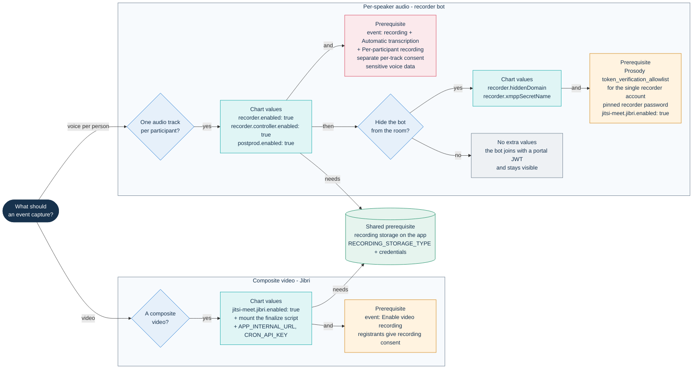

# Setting up recording

PA Webinar can capture an event in two ways. Both are optional and both are off
in the chart's defaults:

- **Composite video.** Jibri, the Jitsi recorder, films the conference as
  participants see it and produces one MP4 each time recording is started and
  stopped.
- **Per-speaker audio.** The PA Webinar recorder bot joins the conference and
  records one audio track per participant, so that AI post-production can
  attribute every sentence to its speaker.

This page lists the values that turn each path on, what they depend on, and
how to check that they work. It does not repeat the mechanisms, the storage
providers or the retention periods:

| For | Read |
|---|---|
| How each path is triggered, the ingest contracts, the hidden domain, the runners | [Recording: composite video and per-speaker audio](../architecture/recording.md) |
| Recording storage settings and providers | [Object storage](../configuration/storage.md) |
| How long recordings and tracks are kept | [Privacy and data protection](../GDPR.md) and [Recordings, voice data and AI outputs](../privacy/recordings-and-ai.md) |
| What happens to a recording after the event | [AI post-production](../POSTPROD.md) |
| Node pools, disk and storage sizing | [Node pools](../INFRASTRUCTURE.md#node-pools), [Requirements](../install/README.md#requirements) |

Examples use `pa-webinar` as both the Helm release and the namespace, so the
chart's full name is `pa-webinar` and the Jitsi subchart's is
`pa-webinar-jitsi-meet`.

## Choose what to capture

| | Composite video | Per-speaker audio |
|---|---|---|
| Component | Jibri (`jitsi-meet.jibri.*`, from the bundled jitsi-meet subchart) | Recorder bot and recorder controller (`recorder.*`, from this chart) |
| Produces | One MP4 each time recording is started and stopped | One audio file per participant, plus a track manifest |
| Used for | The event's video, played on the event page once published and listed in the video library; single-track transcription | Speaker attribution in the AI transcript |
| Started by | A moderator (**Start recording**) or automatically (**Start recording automatically**) | The controller, as soon as a qualifying event is `LIVE` |
| Needs AI post-production | No | Yes: bots start only for events with **Automatic transcription** on |

Both paths write to the same recording storage, configured on the app. Neither
Jibri nor the bot holds storage credentials: each asks the portal for a
short-lived signed upload URL, one object at a time. When both paths run for
the same event, the first Jibri video is attached to the per-participant
recording instead of creating a second one, and post-production starts from the
tracks ([hand-off to post-production](../architecture/recording.md#hand-off-to-post-production)).
A later video of the same event gets a recording of its own
([From MP4 to recording](../architecture/recording.md#from-mp4-to-recording-the-finalize-contract)).

The diagram maps each outcome to the values you set and to what must already be
true.



The consent gates behind the event flags are described in
[Consent gates](../architecture/recording.md#consent-gates). Per-participant
audio is isolated voice data: read
[Recordings, voice data and AI outputs](../privacy/recordings-and-ai.md) before
you offer it.

## Composite video with Jibri

### Turn Jibri on

Jibri is part of the bundled jitsi-meet subchart and is switched on only by
`jitsi-meet.jibri.enabled`. The chart default is `false`. The `jitsi.mode` key
does not change it: the example value sets for the standard and full profiles
turn Jibri on explicitly.

| Value | Chart default | Example profiles | Notes |
|---|---|---|---|
| `jitsi-meet.jibri.enabled` | `false` | `true` in `examples/values-standard.yaml` and `examples/values-full.yaml` | Also makes the subchart set `ENABLE_RECORDING` for the Jitsi components and create the recorder XMPP account |
| `jitsi-meet.jibri.replicaCount` | `0` | `1` (standard), `0` (full) | In the full profile the JVB scaler scales Jibri between 0 and 1 ([Running the JVB scaler](jvb-scaler.md)) |
| `jitsi-meet.jibri.singleUseMode` | `true` | `true` | Each Jibri instance restarts after one recording |
| `jitsi-meet.jibri.nodeSelector`, `tolerations`, `resources` | empty | full profile: the JVB node pool, 1 CPU and 2 GiB requested | Jibri runs a browser and an encoder; see [Node pools](../INFRASTRUCTURE.md#node-pools) |
| `jitsi-meet.jibri.persistence.*`, `jitsi-meet.jibri.shm.*` | subchart defaults: disabled | not set | Without persistence the recording directory is an `emptyDir`; the subchart notes that its Chromium may need `/dev/shm` |

One Jibri records one conference at a time, and the JVB scaler never asks for
more than one replica. The subchart runs Jibri with the `SYS_ADMIN` capability
by default (`jitsi-meet.jibri.securityContext`); keep it on nodes you trust with
that.

Turn Jibri on between events. Prosody's pods carry checksums of the Jibri XMPP
and recorder Secrets, so the `helm upgrade` that enables Jibri restarts Prosody,
and every conference in progress drops. Pin `jitsi-meet.jibri.xmpp.password`
and `jitsi-meet.jibri.recorder.password`, or name an `existingSecretName`: an
unpinned password changes on every render, so every later upgrade restarts
Prosody and Jibri again. `jitsi.requirePinnedCredentials: true` makes the chart
refuse to render while one of them is missing
([Pin the generated credentials](upgrades.md#pin-the-generated-credentials)).

Do not put a storage block under `jitsi-meet.jibri.recording`. In the subchart
that key is a boolean, `true` by default, that enables file recording.
Recording storage is configured on the app ([Recording storage](#recording-storage)).

### Mount the finalize script

After each recording, Jibri runs the script at `/config/finalize.sh` (the
subchart sets `JIBRI_FINALIZE_RECORDING_SCRIPT_PATH`). The PA Webinar script
re-muxes the MP4 for streaming, asks the portal for an upload URL, uploads the
file and calls the recording webhook. Its contract is described in
[From MP4 to recording](../architecture/recording.md#from-mp4-to-recording-the-finalize-contract).

The chart renders this script from `files/jibri-finalize.sh` as the ConfigMap
`<fullname>-jibri-finalize` whenever `jitsi.enabled` and
`jitsi-meet.jibri.enabled` are both true. It does not mount it, and neither
example profile does. Without the mount the MP4 stays on the Jibri pod's
volume and the portal never learns about it.

Mount it through the subchart's `extraVolumes` and `extraVolumeMounts`, and give
the script the two variables it requires, `APP_INTERNAL_URL` and
`CRON_API_KEY`:

```yaml
jitsi-meet:
  jibri:
    enabled: true
    replicaCount: 1   # 0 in the full profile, where the JVB scaler starts Jibri
    # The chart's finalize script, mounted where Jibri runs it.
    extraVolumes:
      - name: pa-webinar-finalize
        configMap:
          name: pa-webinar-jibri-finalize   # <fullname>-jibri-finalize
          defaultMode: 0755
    extraVolumeMounts:
      - name: pa-webinar-finalize
        mountPath: /config/finalize.sh
        subPath: finalize.sh
    # Plain settings go to the Jibri ConfigMap.
    extraEnvs:
      APP_INTERNAL_URL: "http://pa-webinar:3000"   # http://<fullname>:<service.port>
    # Secrets are read from the app Secret (secrets.existingSecretName).
    extraSecrets:
      - name: CRON_API_KEY
        valueFrom:
          secretKeyRef:
            name: <app-secret>
            key: CRON_API_KEY
      - name: RECORDING_WEBHOOK_SECRET
        valueFrom:
          secretKeyRef:
            name: <app-secret>
            key: RECORDING_WEBHOOK_SECRET
            optional: true
```

This mount follows the chart: a chart upgrade updates the ConfigMap, and Jibri
pods read the new script when they restart.

The alternative is the subchart's own slot, which also mounts the file at
`/config/finalize.sh`:

```bash
helm upgrade pa-webinar infra/helm/pa-webinar -n pa-webinar -f <your-values>.yaml \
  --set-file jitsi-meet.jibri.custom.other._finalize_sh=infra/helm/pa-webinar/files/jibri-finalize.sh
```

With this form the script becomes part of the release values. An upgrade with
`--reuse-values` then keeps the old copy until you pass the file again
([Upgrades and rollback](upgrades.md)).

The script calls `curl`, `jq`, `ffprobe`, `ffmpeg` and, to sign the webhook,
`openssl`. Check that the Jibri image you run provides them.

`infra/jitsi/jibri-finalize.sh` is a different, older script that uploads with
cloud command-line tools and posts to `RECORDING_WEBHOOK_URL`. The chart does
not use it ([`infra/jitsi/README.md`](../../infra/jitsi/README.md)).

### Sign the webhook

The recording webhook, `POST /api/webhooks/recording`, always requires
`Authorization: Bearer <CRON_API_KEY>`. When `RECORDING_WEBHOOK_SECRET` is set
on the app, it also requires an HMAC-SHA256 signature of the body in
`X-Webhook-Signature`. Without the secret the app accepts the bearer alone and
logs a warning once per process
([Webhook authentication](../architecture/recording.md#webhook-authentication)).

To turn the signature on:

1. Generate a value, for example with `openssl rand -hex 32`, and add it to the
   app Secret as `RECORDING_WEBHOOK_SECRET`.
2. Pass it to Jibri (the `extraSecrets` entry above) and restart Jibri so it
   reads the value: `kubectl -n pa-webinar rollout restart deployment/pa-webinar-jitsi-meet-jibri`.
   Adding a key to the app Secret does not restart Jibri on its own. In the
   full profile, where Jibri scales from zero, the next pod the scaler starts
   reads it.
3. Restart the app pods so they read it (`kubectl -n pa-webinar rollout restart deployment/pa-webinar`).

Keep this order. A Jibri that signs while the app does not check is accepted.
An app that checks while Jibri does not sign rejects the webhook, and the
uploaded file ends up among the orphans.

`RECORDING_WEBHOOK_URL` is read neither by the app nor by the chart's script,
which always posts to `$APP_INTERNAL_URL/api/webhooks/recording`.

### The `recording` block in values.yaml

`values.yaml` has no top-level `recording:` block, and no template reads one.
Keys such as `recording.storage`, `recording.persistence` or
`recording.retentionDays`, carried over in an older values file, change
nothing. Configure instead:

| Instead of | Use |
|---|---|
| `recording.storage.*` | The recording storage settings on the app ([Object storage](../configuration/storage.md)) |
| `recording.persistence.*` | `jitsi-meet.jibri.persistence.*` |
| `recording.retentionDays` | The event's retention settings ([Lifecycle settings to review](#lifecycle-settings-to-review)) |

### Check that Jibri works

1. The ConfigMap exists: `kubectl -n pa-webinar get configmap pa-webinar-jibri-finalize`.
2. With a Jibri pod running, the script is mounted and executable, and the
   variables are set:

   ```bash
   JIBRI=$(kubectl -n pa-webinar get pod -l app.kubernetes.io/component=jibri -o name | head -1)
   kubectl -n pa-webinar exec "$JIBRI" -- ls -l /config/finalize.sh
   kubectl -n pa-webinar exec "$JIBRI" -- sh -c 'echo "$APP_INTERNAL_URL"; test -n "$CRON_API_KEY" && echo key set'
   ```

3. Create a test event with **Enable video recording**, start it, press
   **Start recording**, speak for a minute and stop. Once Jibri has finished,
   the recording appears in the administration area under **Video recordings**,
   tab **Library**.

   The moderator's recording button follows Jibri's state as the portal's
   status check (`/api/status`, field `metrics.jibriStatus`) reports it:

   - Jibri's health API answers healthy at `JIBRI_HEALTH_URL`
     (`jitsi.jibriHealthUrl`; by default the subchart's Jibri Service on port
     2222): **Start recording**.
   - An event with recording on is waiting for Jibri: a disabled
     **Recording starting…** button. In the full profile that is expected for
     a few minutes, while the JVB scaler starts Jibri.
   - Jibri has not answered within **Provisioning timeout (minutes)**
     (`jvbProvisioningTimeoutMinutes`), counted from when an event with
     recording first asked for it: a disabled **Recording unavailable** button,
     and moderators get a notice that the event continues without recording.
     Check the Jibri pod, its health API and the scaler's log.
   - The app does not expect Jibri, because `RECORDING_STORAGE_TYPE` is unset
     or no recording storage resolves ([Recording storage](#recording-storage)):
     a disabled **Recording not configured in infrastructure** button.
   - No event asks for Jibri, or the status cannot be read: **Start recording**
     stays available. If Jitsi then refuses to start the recording after
     several retries, the moderator sees **The recording did not start.**
4. If the recording is not in the library, look at what the finalize script
   printed. Jibri logs the script's output, and every line the script writes
   carries `FINALIZE:`, from `processing <file>` to `done`:
   - `ERROR: APP_INTERNAL_URL / CRON_API_KEY not set`,
     `ERROR: portal refused upload-url request` or `ERROR: blob upload failed`:
     nothing was uploaded. The script exits and leaves the file on the Jibri
     volume, which is lost with the pod when that volume is an `emptyDir`.
   - `WARN: webhook post failed`: the file was uploaded but the portal was not
     told. Check `CRON_API_KEY`, `RECORDING_WEBHOOK_SECRET` on both sides, and
     the network path from Jibri to the app.
   - No `FINALIZE:` line at all: the script did not run. Check the mount
     (step 2).
5. An uploaded file whose webhook failed becomes an orphan, but it is listed
   under **Orphans** only after the next `recordings-reconcile` run (every
   6 hours with the schedule in `values.yaml`). To check right away, run the
   job once:

   ```bash
   kubectl -n pa-webinar create job --from=cronjob/pa-webinar-recordings-reconcile reconcile-now
   ```

   ([Run a job once](../architecture/background-jobs.md#run-a-job-once)).

## Per-speaker audio with the recorder bot

### Turn the recorder on

With `recorder.enabled` and `recorder.controller.enabled` both true (the
latter is `true` by default), the chart renders:

- the recorder controller: a one-replica Deployment with its ServiceAccount,
  a namespaced Role and a Service;
- the suspended CronJob `<fullname>-recorder`, which never runs on its own and
  serves as the template for each bot's Job.

`recorder.enabled` alone also sets `RECORDER_CONTROLLER_URL` on the app, so the
app can notify the controller when an event goes `LIVE`. With
`recorder.controller.enabled: false` no bot starts: the controller and the
template are not rendered, and the app's notification fails harmlessly with a
logged warning (`[jvb] dispatch recorder best-effort fallito`) each time the
scaler or the lifecycle cron opens a room. Setting `RECORDER_CONTROLLER_URL`
also makes the live room treat the installation as able to record, so events
with recording on show the recording notice and ask for consent.

A bot starts only when all of these hold:

| Condition | Where it is set |
|---|---|
| The event is `LIVE` | [Event lifecycle](../architecture/event-lifecycle.md) |
| **Enable video recording**, **Automatic transcription** and **Per-participant recording (high accuracy)** are on for the event (`recordingEnabled`, `aiTranscriptEnabled`, `multitrackRecordingEnabled`) | Event wizard or event template |

The controller does not check storage. To upload its tracks the bot needs
[recording storage](#recording-storage) on the app; without it the tracks
cannot be uploaded and are lost with the bot's pod. Registrants of such an
event must give a separate consent to per-track recording; registration is
refused without it.

Turn AI post-production on together with the recorder (`postprod.enabled: true`
and, in the site settings, **Post-event pipeline active**). The tracks exist
only to be transcribed, and the `multitrack-purge` job that deletes them after
transcription renders only with `postprod.enabled` and deletes nothing until a
transcription has finished. With the pipeline off, bots keep recording and the
tracks stay in storage until the recording's retention job or the orphan sweep
removes them ([Orphans](#orphans)). Setting up the pipeline is covered in
[AI post-production](../POSTPROD.md).

The controller checks for wanted bots every `recorder.controller.reconcileIntervalMs`
(30 seconds in `values.yaml`). When the JVB scaler runs, the app also notifies
the controller the moment a scaler tick moves an event to `LIVE`, so the bot
does not wait for the next check
([Edge and level triggers](../architecture/recording.md#edge-and-level-triggers)).

### Recorder values

Defaults are those of `infra/helm/pa-webinar/values.yaml`; "bot default" is
the value the bot uses when the variable is empty (`infra/recorder/src/capture.ts`).

| Value | Default | Notes |
|---|---|---|
| `recorder.image` | `ghcr.io/italia/pa-webinar-recorder:dev` | A moving tag. Pin an immutable `:dev-<sha>` tag or a digest ([Images](../architecture/recording.md#images)). Such a tag exists only for commits that rebuilt this component: take it from the job summary of the workflow run that built the image, or from the registry |
| `recorder.imagePullPolicy` | `IfNotPresent` | With a moving tag a node can keep serving an old image; use `Always` or pin |
| `recorder.imagePullSecrets` | `[]` | Falls back to `app.imagePullSecrets` |
| `recorder.jitsiDomain` | `""` | Falls back to `app.env.NEXT_PUBLIC_JITSI_DOMAIN` |
| `recorder.idleTimeoutSec` | `""` | Seconds of empty room before the bot leaves; bot default 90 |
| `recorder.initialGraceSec` | `300` | Seconds the bot waits for the first participant; bot default 900 |
| `recorder.maxDurationSec` | `""` | Hard cap on one session; bot default 14400 (4 hours). Keep it at or below `activeDeadlineSeconds` |
| `recorder.activeDeadlineSeconds` | `21600` | Kubernetes stops the Job after 6 hours |
| `recorder.backoffLimit` | `1` | Retries of a failed bot pod |
| `recorder.ttlSecondsAfterFinished` | `600` | How long a finished Job stays. While it exists, the controller does not start a new bot for the same recording, so speech during that gap is not captured. Tune it together with `idleTimeoutSec` |
| `recorder.workSizeLimit` | `10Gi` | Size cap of the bot's `emptyDir` for tracks before upload |
| `recorder.resources` | 1 CPU and 2 GiB requested, 2 CPU and 4 GiB limit | The bot runs a headless browser |
| `recorder.nodeSelector`, `recorder.tolerations` | empty | The bot needs no GPU and no media node |
| `recorder.controller.image` | `ghcr.io/italia/pa-webinar-recorder-controller:dev` | Same pinning advice as the bot. Its `:dev-<sha>` tags come from the commits that rebuilt the controller, so the bot and the controller usually carry different SHAs |
| `recorder.controller.imagePullPolicy`, `imagePullSecrets` | `IfNotPresent`, `[]` | Pull secrets fall back to `app.imagePullSecrets` |
| `recorder.controller.port` | `8080` | Port of the controller's Service |
| `recorder.controller.reconcileIntervalMs` | `30000` | How often the controller compares wanted and running bots |
| `recorder.controller.resources` | 50m CPU and 64 MiB requested | |

The bot and controller images are published by the development workflow, not
by a release tag, so a rollback of the app image does not roll them back
([CI, images and releases](../development/ci-and-release.md)).

### What the bot must reach

- **The portal**, on the internal service URL (`http://<fullname>:<service.port>`),
  with `CRON_API_KEY`. The chart sets both. With the chart's NetworkPolicy on,
  the portal admits the bot only through an extra ingress rule
  ([Network policy](#network-policy)).
- **The Jitsi web host over HTTPS**, at `https://<jitsi domain>/`. The bot
  loads the Jitsi page, `lib-jitsi-meet` and `config.js` from there and joins
  over the XMPP transport that `config.js` advertises: BOSH with the chart's
  defaults, or the XMPP WebSocket if you enable
  `jitsi-meet.websockets.xmpp.enabled`. It has no certificate bypass, so the
  host needs a certificate the bot's browser trusts. If you set
  `jitsi.webIngress.redirectUrl`, the root page redirects to the portal:
  confirm with a test event that the bot still joins.
- **The bridge**, for media, like any participant.

### Make the bot invisible

Without further values, the bot joins with a JWT signed by the portal. Jitsi
shows it as a participant under a reserved display name
(`RECORDER_DISPLAY_NAME` in `app/src/lib/jitsi/participants.ts`); the portal's
own counts and lists leave it out. With `recorder.hiddenDomain` set, the bot
logs in on Prosody's hidden domain instead, and every Jitsi client hides it:
no tile, no list entry, no join notification, not counted. The mechanism is in
[The invisible bot](../architecture/recording.md#the-invisible-bot-hidden-prosody-domain).

The values on both sides must agree:

| Value | Must match |
|---|---|
| `recorder.hiddenDomain` | Prosody's hidden domain: `jitsi-meet.xmpp.hiddenDomain`, which defaults to `hidden.<jitsi-meet.xmpp.domain>`, that is `hidden.meet.jitsi` |
| `recorder.xmppSecretName` | The Secret with the recorder account: `<release>-jitsi-meet-jibri-secret-recorder`, or the Secret named in `jitsi-meet.jibri.recorder.existingSecretName`. Required when `hiddenDomain` is set: the chart refuses to render without it |
| `recorder.xmppSecretUserKey`, `recorder.xmppSecretPasswordKey` | The keys in that Secret; defaults `JIBRI_RECORDER_USER` and `JIBRI_RECORDER_PASSWORD` |
| `jitsi-meet.prosody.extraEnvs.XMPP_MUC_CONFIGURATION` | `token_verification_allowlist = { "<user>@<hiddenDomain>" }`: the single recorder account, never the whole domain, because whoever holds that password enters any room without a token |
| `jitsi-meet.jibri.recorder.password` or `jitsi-meet.jibri.recorder.existingSecretName` | A fixed password. Otherwise the subchart generates a new one on every render, and the bot's login stops matching Prosody's |
| `jitsi-meet.jibri.enabled` | `true`. The subchart creates the recorder account and its Secret only when Jibri is enabled; `replicaCount` can stay at `0` |

Apply these values between events. A `helm upgrade` that changes the Prosody
environment (`XMPP_MUC_CONFIGURATION` included), turns Jibri on or changes the
recorder Secret restarts Prosody, and every conference in progress drops. An
unpinned recorder password changes on every render, so it restarts Prosody and
Jibri on every upgrade
([The media stack restarts only when its inputs change](upgrades.md#the-media-stack-restarts-only-when-its-inputs-change)).

```yaml
recorder:
  enabled: true
  image: ghcr.io/italia/pa-webinar-recorder:dev-<sha>   # a tag that exists for this component
  hiddenDomain: "hidden.meet.jitsi"
  xmppSecretName: "pa-webinar-jitsi-meet-jibri-secret-recorder"
  controller:
    image: ghcr.io/italia/pa-webinar-recorder-controller:dev-<sha>   # its own SHA

postprod:
  enabled: true   # plus the pipeline settings in docs/POSTPROD.md

jitsi-meet:
  jibri:
    enabled: true            # creates the recorder account
    replicaCount: 0          # no composite video unless you want it
    recorder:
      password: "<long random value>"   # or existingSecretName
  prosody:
    extraEnvs:
      XMPP_MUC_CONFIGURATION: 'token_verification_allowlist = { "recorder@hidden.meet.jitsi" }'
```

Two side effects to plan for:

- In the full profile the JVB scaler scales Jibri to one replica whenever an
  event with recording enabled is running, and per-speaker audio needs
  recording enabled. With `jitsi-meet.jibri.enabled: true`, a Jibri pod
  therefore starts for those events even if nobody records video.
- If the hidden-domain login is rejected and the bot never joined the
  conference, it joins again with the portal JWT. The recording is saved and
  the bot is visible for the rest of the event
  ([Fallback to a visible join](../architecture/recording.md#fallback-to-a-visible-join)).
  A visible bot on an installation configured for the hidden domain points to
  an unpinned password or a missing allowlist entry.

The Prosody side of these settings is described in
[How PA Webinar extends Jitsi Meet](../architecture/jitsi-integration.md).

### Check that the recorder works

```bash
# The template exists and is suspended.
kubectl -n pa-webinar get cronjob pa-webinar-recorder

# The controller is up and reconciling.
kubectl -n pa-webinar logs deployment/pa-webinar-recorder-controller --tail=50

# During a qualifying LIVE event, a bot Job appears within one reconcile interval.
kubectl -n pa-webinar get jobs -l app.kubernetes.io/component=recorder
kubectl -n pa-webinar logs job/<recorder-job-name> --tail=100
```

The bot's log starts with the work order it claimed and, after the event, reports
how many tracks the manifest contains. With the hidden domain configured, the
bot must not appear in the Jitsi participant list.

If the bot is visible or never appears, see
[The recorder bot joins visibly, or not at all](troubleshooting.md#the-recorder-bot-joins-visibly-or-not-at-all).

### Docker Compose: the `recorder` profile

On a single VM, `docker compose --profile recorder up -d` starts the
`recorder-controller` service with `RUNNER=docker`. It mounts
`/var/run/docker.sock`, which gives it control of the host's Docker engine:
enable the profile deliberately, only where per-speaker audio is wanted.

In Docker mode each bot container receives only `RECORDING_ID`, `EVENT_ID` and
the controller's `RECORDER_ENV_<NAME>` variables, passed as `<NAME>`. As
shipped, the Compose file does not complete a recording:

- It passes only `RECORDER_ENV_JITSI_DOMAIN`. The bot also requires
  `PORTAL_URL` and `CRON_API_KEY` and exits without them: add
  `RECORDER_ENV_PORTAL_URL=http://app:3000` and `RECORDER_ENV_CRON_API_KEY`
  with the app's value.
- `RECORDER_ENV_JITSI_DOMAIN=localhost:8443` points at the bot's own container.
  The bot needs a Jitsi host it can reach over HTTPS with a trusted certificate.
- The `app` service configures no recording storage.
- The `cron` service calls neither `multitrack-purge` nor `recordings-reconcile`.

Timing and hidden-domain settings travel the same way, for example
`RECORDER_ENV_INITIAL_GRACE_SEC`, `RECORDER_ENV_JITSI_XMPP_DOMAIN`,
`RECORDER_ENV_JITSI_XMPP_USER` and `RECORDER_ENV_JITSI_XMPP_PASSWORD`. The
Docker runner is described in
[Docker (single VM)](../architecture/recording.md#docker-single-vm).

## Recording storage

Both paths need the recording storage domain configured on the app. The
accepted `RECORDING_STORAGE_TYPE` values, the per-provider settings and the
resolution order are in [Object storage](../configuration/storage.md). Points
that matter for recording:

- **Jibri needs `RECORDING_STORAGE_TYPE`.** The storage itself also works
  from the credentials alone, but the live room expects Jibri only when
  `RECORDING_STORAGE_TYPE` is set and resolves
  ([Object storage](../configuration/storage.md#recording-availability-follows-the-resolved-provider)).
  Without it, moderators see **Recording not configured in infrastructure**
  ([Check that Jibri works](#check-that-jibri-works), step 3), and an
  installation that records only with the bot is never reported as waiting
  for Jibri.
- Without a provider, `POST /api/internal/recording-upload-url` answers `503`
  and the finalize script stops before uploading.
  `POST /api/internal/recorder-upload-url` fails with a server error (`500`),
  and the bot cannot upload its tracks.
- Post-production artifacts live in the same storage under `postprod/`.

## Network policy

The chart's NetworkPolicy (`networkPolicy.enabled`, off by default) selects
only the application pods; its rules are in
[Deploying with Helm](../DEPLOYMENT.md#networkpolicy). Jibri, the recorder
controller and the bots are not selected, so their own traffic, media
included, is not restricted. What matters for recording is who the policy
admits to the app's container port, `3000`:

| Caller | Admitted |
|---|---|
| Jibri (finalize script) | Yes, when `jitsi.enabled` and `jitsi-meet.jibri.enabled` are true: the policy has a rule for the subchart's Jibri pods of the same release |
| Recorder controller | Yes: it carries the release's selector labels. When `recorder.enabled` and `recorder.controller.enabled` are true, the app's egress rules also include the controller's port (`recorder.controller.port`), so the app can notify it |
| Recorder bots | No. The controller gives each bot pod only `app.kubernetes.io/component: recorder` and the recording and event IDs, not the release's selector labels. The bot's first call, the work-order claim (`POST /api/internal/recorder-claim`), is dropped, so the bot exits before joining and nothing is recorded |

Admit the bots with a `networkPolicy.ingress.extraRules` entry for pods
labeled `app.kubernetes.io/component: recorder` on port `3000`
([Before enabling the NetworkPolicy](../architecture/background-jobs.md#before-enabling-the-networkpolicy)
has the snippet). Prefer `extraRules` to `fromPodSelectors`: when
`fromNamespaceSelectors` is empty, an entry in `fromPodSelectors` would close
the port to the ingress controller. With both lists empty the port accepts
every source, and the bots get through without a rule. After enabling the
policy, record a test event with per-participant recording
([Check that the recorder works](#check-that-the-recorder-works)).

If the recording storage is an in-cluster S3-compatible endpoint on a port
other than 443, also add a `networkPolicy.egress.extraRules` entry for it: the
app reaches recording storage itself, for example to list and delete objects.

## Lifecycle settings to review

Recordings and tracks are personal data. Decide these settings before the
first recorded event; the durations and what each deletion removes are in
[Privacy and data protection](../GDPR.md) and
[Recordings, voice data and AI outputs](../privacy/recordings-and-ai.md).

| Setting | Where | What it decides |
|---|---|---|
| **Data retention (days after event)** (`Event.dataRetentionDays`; default 30 in `schema.prisma`) | Event wizard | When the daily cleanup deletes the event's personal data, including an unpublished video |
| `Event.recordingDeleteAfterDays` | Recording panel of the event's administration page | How long a published video stays after publication |
| **Keep per-participant tracks** (`Event.retainParticipantTracks`; off by default) | Event wizard or event template | Off: tracks are deleted soon after transcription. On: they are kept until the recording's retention ends |
| **Post-event pipeline active** (`SiteSetting.aiPipelineEnabled`; off by default) | Site settings | Whether anything is transcribed, and therefore whether tracks are ever purged after transcription |
| `SiteSetting.orphanRecordingGraceDays` (default 30 in `schema.prisma`) | `PUT /api/admin/settings`; the settings form has no field for it | Days before `recordings-reconcile` deletes an unlinked object; `0` turns automatic deletion off |

Four jobs act on these settings: `cleanup`, `recordings-reconcile` and, only
with `postprod.enabled`, `multitrack-purge` and `postprod-retention`. What each
one does, its schedule and its Helm keys are in
[Scheduled and background jobs](../architecture/background-jobs.md).

### Orphans

`recordings-reconcile` lists the recording objects that the database does not
reference under **Video recordings**, tab **Orphans**, and deletes them after
`orphanRecordingGraceDays` unless an administrator marks them **Keep**
([recordings-reconcile](../architecture/background-jobs.md#recordings-reconcile)).
Two cases need an operator:

- **A video whose webhook failed.** It becomes an orphan. Review the tab after
  a failed recording and mark the file **Keep** before the grace period ends.
- **Retained per-participant tracks.** Tracks and their manifests live under
  `recordings/multitrack/`, which the database fields the job checks never
  reference. With **Keep per-participant tracks** on, they are deleted after
  the grace period whatever the event's retention says. Mark them **Keep**, or
  set `orphanRecordingGraceDays` to `0` and review the tab by hand
  ([Known limitations](../architecture/recording.md#known-limitations)).

Before the first reconcile run after a database restore, read
[After restoring a database backup](../architecture/background-jobs.md#after-restoring-a-database-backup).

## Storage sizing

Where the Jibri and recorder pods run is covered in
[Node pools](../INFRASTRUCTURE.md#node-pools). The local working space is set here:
`jitsi-meet.jibri.persistence.*` for Jibri (an `emptyDir` unless enabled) and
`recorder.workSizeLimit` for each bot.

To estimate the object storage, multiply the average bitrate by the duration:
one hour at 1 Mbps is about 450 MB.

- **Composite MP4.** The finalize script only re-muxes Jibri's file for
  streaming (faststart) and does not re-encode it, so the stored size is what
  Jibri's encoder produced. It depends on the resolution and on what is on
  screen: slides and a few talking heads compress far better than full-motion
  video. Measure it with a test recording of a typical event, for example at an
  average of 1.5 Mbps an hour takes about 675 MB.
- **Per-participant tracks.** Each bot records every remote audio track as Opus
  at 32 kbps (`infra/recorder/src/capture.ts`), about 14 MB per participant per
  hour of recording.
- **AI outputs** (transcripts, subtitles, summaries) are small next to the
  media. Dubbing adds an audio file per target language and, when the
  optional `DUBBED_VIDEO` is produced, a copy of the video with that audio
  ([AI post-production](../POSTPROD.md)).

## Related pages

- [Recording: composite video and per-speaker audio](../architecture/recording.md): how both paths work.
- [Object storage](../configuration/storage.md): the recordings domain and its providers.
- [AI post-production](../POSTPROD.md): the pipeline that consumes recordings and tracks.
- [Deploying with Helm](../DEPLOYMENT.md): the chart reference and install walkthroughs.
- [Running the JVB scaler](jvb-scaler.md): how Jibri is started in the full profile.
- [Monitoring and health](monitoring.md): status pages and the Jibri health check.
- [ADR-013](../adr/013-multitrack-speaker-attribution.md): why per-participant recording exists.
- Component READMEs: [`infra/recorder`](../../infra/recorder/README.md), [`infra/recorder-controller`](../../infra/recorder-controller/README.md), [`infra/jitsi`](../../infra/jitsi/README.md).
