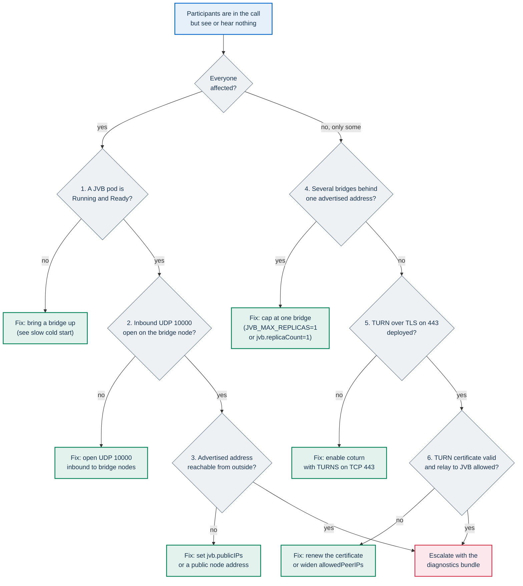

# Troubleshooting

This page lists symptoms seen on running cluster installations of PA Webinar deployed with the Helm chart, with the cause and the fix for each. Every entry names the value, file or command that decides the behavior, and links the page that owns the mechanism. The fix is summarized here; the full procedure stays on the owner page.

Other failure modes are documented next to the component they belong to:

- the local Docker Compose stack: [DEVELOPMENT.md](../DEVELOPMENT.md);
- the AI post-production pipeline: [POSTPROD.md](../POSTPROD.md);
- email delivery and relay errors: [configuration/email.md](../configuration/email.md#troubleshooting-delivery);
- installation and first-run checks: [DEPLOYMENT.md](../DEPLOYMENT.md);
- upgrades and rollbacks: [upgrades.md](upgrades.md);
- probes, status pages, metrics and alerts: [monitoring.md](monitoring.md).

Whatever the symptom, `scripts/verify-install.sh` is a quick first look: it
names the failing part among the pods, the certificates, the portal's
components, the conference, the scheduled jobs, the email outbox and the
database disk, and `--call` tests a call between two browsers
([Post-install verification](../install/checklists.md#post-install-verification)).

## Before you start

### Names used on this page

Commands assume a release named `pa-webinar` in the namespace `pa-webinar`. With another release, replace the names by the general form. The chart names its objects after its full name, which is `<release>-pa-webinar`, or just `<release>` when the release name already contains `pa-webinar` (`infra/helm/pa-webinar/templates/_helpers.tpl`).

| Object | General form | With release `pa-webinar` |
|---|---|---|
| App Deployment, Service (port 3000, named `http`) and Ingress | `<fullname>` | `pa-webinar` |
| CronJobs | `<fullname>-<job>` | `pa-webinar-email-outbox`, `pa-webinar-jvb-scaler`, … |
| Jitsi components | `<release>-jitsi-meet-<component>` | `pa-webinar-jitsi-meet-web`, `pa-webinar-jitsi-meet-jvb-0`, `pa-webinar-jitsi-meet-jicofo`, StatefulSet `pa-webinar-jitsi-meet-prosody` (pod `pa-webinar-jitsi-meet-prosody-0`) |
| Application Secret | `secrets.existingSecretName` | `videocall-secrets`, the default in `values.yaml`; `pa-webinar-secrets` with the k3s installer |

Labels to select pods:

| Pods | Selector |
|---|---|
| App pods only | `-l 'app.kubernetes.io/instance=pa-webinar,app.kubernetes.io/name=pa-webinar,!app.kubernetes.io/component'` |
| One job, controller or bot | `-l app.kubernetes.io/component=<value>`, where the value is `cronjob-<job>` for the `curl` jobs and the post-production orchestrator (for example `cronjob-email-outbox`), or `jvb-scaler`, `recorder`, `recorder-controller`, `postprod-worker`, `config-reload` |
| One Jitsi component | `-l app.kubernetes.io/component=<web, jvb, prosody, jicofo, jibri or coturn>` |

The app pods and the pods of the chart's CronJobs, controllers and post-production workers share the two labels `app.kubernetes.io/name` and `app.kubernetes.io/instance`; only the extra `app.kubernetes.io/component` label tells them apart. The recorder bot pods are the exception: the recorder controller gives them only `app.kubernetes.io/component: recorder` and the recording and event IDs. The templates of the scheduled CronJobs label the pod template, and a Job created without labels of its own takes them, so both Jobs and pods can be selected by `app.kubernetes.io/component` ([background-jobs.md](../architecture/background-jobs.md#find-a-jobs-runs-and-logs)).

### Two rules that apply to many entries

- **Changing a Secret restarts nothing.** Containers read their environment when they start. The app Deployment's pod template carries a checksum of the ConfigMap only (`templates/deployment.yaml`), so a Secret change alone does not roll the pods. After changing the application Secret, run `kubectl -n pa-webinar rollout restart deployment/pa-webinar`, and restart the recorder controller too if you changed `CRON_API_KEY`. CronJob pods pick up the new values at their next run.
- **Change Jitsi components between events.** Restarting Prosody, Jicofo or a bridge drops the conferences running on it, and restarting the web pod interrupts the signaling of everyone in a call ([upgrades.md](upgrades.md#the-web-pod-restarts-on-every-upgrade)).

## Quick reference

| Symptom | Likely cause | Fix |
|---|---|---|
| [App pod in `CrashLoopBackOff`](#pod-in-crashloopbackoff) | The startup probe never passes, `APP_SECRET` is too short, or the pod runs out of memory | Read the previous container's log; keep the app and migration images of the same release |
| [New pod stuck in an `Init:` state](#migrations-failed) | The `db-migrate` init container cannot pull, reach the database or apply a migration | Read the `db-migrate` log; pass both image tags explicitly |
| [Pods are Ready but requests return 500](#pods-ready-but-requests-return-500) | Readiness probe overridden, schema behind on a table the probe does not read, invalid `PII_ENCRYPTION_KEY` | Restore `/api/ready`; check migrations; restore the key |
| [502 on administration pages](#502-bad-gateway-on-administration-pages) | Response headers larger than a proxy's buffer | Keep the chart's buffer annotations; raise the buffer of any proxy in front |
| [Chat or live panels drop after about 60 s](#chat-and-live-panels-drop-after-about-60-seconds) | A proxy buffers the event stream or times out before the 25-second keepalive | Turn off buffering for event streams; lengthen idle timeouts |
| [Nobody can enter a room](#nobody-can-enter-a-room) | JWT secret, app id, issuer or audience differ between the app and Prosody | Compare both sides, then restart what changed |
| [Guests cannot join, or the event is stuck in `PROVISIONING`](#guests-cannot-join-or-the-event-is-stuck-in-provisioning) | The event is not `LIVE`: the lifecycle job or the scaler is not running, or the bridge does not answer. Or **Guest access enabled** is off | **Start event**; check the lifecycle job or the scaler; check the site setting |
| [Rooms take minutes to open](#slow-cold-start) | Bridge cold start longer than the pre-scale window, or a bridge pod stuck in `Pending` | Raise **Pre-scale lead time (minutes)**; fix the node pool |
| [No audio or video](#no-audio-or-video) | UDP 10000 closed, unreachable advertised address, several bridges behind one address, no TURN relay | Follow the decision tree |
| [The call breaks when a participant leaves](#the-call-breaks-when-a-participant-leaves) | The bridge channel runs over SCTP | Move the bridge channel to the Colibri WebSocket |
| [`ImagePullBackOff` on the Jitsi web pod](#imagepullbackoff-on-the-jitsi-web-pod) | Pull Secret missing, expired or without access; tag not published | Check the pull before every upgrade |
| Conferences drop at every `helm upgrade` | The subchart generates new internal passwords on every render and restarts the media stack | Pin the generated credentials ([upgrades.md](upgrades.md#pin-the-generated-credentials)). The install notes list any unpinned credential; set `jitsi.requirePinnedCredentials: true` to make the render fail until they are pinned |
| [Emails are not sent](#emails-are-not-sent) | The `email-outbox` job does not run or fails; the relay refuses the message | Check the job, then trace the row in the outbox |
| [Metrics scrape returns 401](#metrics-scrape-returns-401) | Scrapes carry no `Authorization: Bearer <CRON_API_KEY>` | Set `metrics.bearerTokenSecret` |
| [Features break after enabling NetworkPolicy](#features-break-after-enabling-networkpolicy) | A path the app's allow-list does not cover: recorder bots, an ingress controller in another namespace, in-cluster Prometheus or storage, an external database | Open the path with the matching `networkPolicy` key |
| [Recorder bot visible, or absent](#the-recorder-bot-joins-visibly-or-not-at-all) | Hidden-domain login rejected; event or chart not set up for it; NetworkPolicy blocks the bot | Pin the recorder password and allow-list the account; check the three event switches; admit the bot pods |
| [Post-production jobs stay pending](#post-production-jobs-stay-pending) | Pipeline switched off, no orchestrator, or no GPU node | See [POSTPROD.md](../POSTPROD.md) |

## Application pods

### Pod in CrashLoopBackOff

**Symptom.** An app pod restarts over and over and `kubectl get pods` shows `CrashLoopBackOff`. During a rolling update the old pods keep serving, because the Deployment uses `maxUnavailable: 0`.

```bash
kubectl -n pa-webinar logs <pod> --previous
kubectl -n pa-webinar describe pod <pod>
```

| What you see | Cause | Fix |
|---|---|---|
| `[readiness] Schema check failed` in the log, then a restart | The startup probe calls `/api/ready`, which reads the site settings and the latest event through the ORM. It gives up after about 160 seconds (10 s delay, then 30 failures 5 s apart, `app.probes.startup` in `values.yaml`) when the schema does not match the image | Read the `db-migrate` log of the same pod ([Migrations failed](#migrations-failed)). Make sure `app.image.tag` and `app.migration.image.tag` come from the same release |
| `APP_SECRET is too short` | With `NODE_ENV=production`, which the image and the chart always set, the server refuses to start when `APP_SECRET` is shorter than 32 characters (`app/src/instrumentation.ts`) | Set a longer value, for example the output of `openssl rand -hex 32` |
| `Reason: OOMKilled` under `Last State` in `describe` | The container exceeded `app.resources.limits.memory` (512Mi in `values.yaml`) | Raise the limit |
| `EROFS` (read-only file system) errors | The root filesystem is read-only, and an override of `app.extraVolumes` or `app.extraVolumeMounts` dropped the writable `/tmp` and `/app/.next/cache` volumes. Helm replaces lists instead of merging them | Repeat the `tmp` and `next-cache` entries of `values.yaml` in your override |

`Missing required environment variables` in the log is not fatal: the pod starts, and the first request that needs the value fails. A pod that never starts at all shows `CreateContainerConfigError` instead: a Secret named in `envFrom`, or a key named in a `secretKeyRef`, does not exist, and `describe pod` names it.

### Migrations failed

**Symptom.** A new app pod stays in `Init:Error`, `Init:CrashLoopBackOff` or `Init:ImagePullBackOff`. The old pods keep serving.

Every app pod runs the migrations in its `db-migrate` init container (`npx prisma migrate deploy`, from the migration image) before the app starts.

```bash
kubectl -n pa-webinar logs <pod> -c db-migrate
```

| What you see | Cause | Fix |
|---|---|---|
| `Init:ImagePullBackOff` | The migration image cannot be pulled. When `app.migration.image.tag` is empty, the chart computes `<app tag>-migrate` without a `v` (`templates/_helpers.tpl`). The release workflow publishes the migration image as both `X.Y.Z-migrate` and `vX.Y.Z-migrate` (`.github/workflows/release.yml`). A computed tag that still fails is missing from the registry or mirror in use, or belongs to an older release published only with the `v` form. The other cause is a missing or wrong pull Secret in `app.imagePullSecrets`, which the init container shares with the app | Pass both tags explicitly: `app.image.tag=X.Y.Z` and `app.migration.image.tag=vX.Y.Z-migrate`. Read the pod's events with `kubectl describe pod` to tell a missing tag (`not found`) from a refused pull (`401` or `403`) |
| `P1001` (cannot reach the database server) | Wrong host in `DATABASE_URL`, the database is down, or the network blocks it (a firewall on a managed database, or the NetworkPolicy's `networkPolicy.egress.postgres.to`) | Fix connectivity. The init container is retried with back-off |
| `P3009` (failed migrations in the target database) | An earlier run failed partway and Prisma recorded it as failed. It applies nothing more until the failure is resolved | Undo or complete the partial change, then run `npx prisma migrate resolve` from the migration image ([upgrades.md](upgrades.md#database-migrations-during-an-upgrade)) |
| `P3018` (a migration failed to apply) | The SQL of a migration failed; the database error follows in the log | Migrations are additive by policy ([data-model.md](../architecture/data-model.md#migrations)), so a failure on a clean upgrade is a defect to report |

To see which migrations are applied, without reading any personal data:

```sql
SELECT migration_name, finished_at, rolled_back_at
FROM _prisma_migrations ORDER BY started_at DESC LIMIT 5;
```

### Pods Ready but requests return 500

**Symptom.** Every pod is `Ready`, but some pages or API calls answer 500. An API call handled by the shared route wrapper (`withErrorHandling` in `app/src/lib/api-handler.ts`) leaves a JSON log line with `"level":"error"` and `"status":500` (a 5xx marked as expected, such as `STORAGE_UNAVAILABLE` from an upload route on an installation without storage, is logged at `warn`), and its unexpected errors are logged as `Unhandled error:` followed by the cause. Server-rendered pages, and the few routes outside the wrapper (the event streams and `/api/ready` among them), leave no JSON line: their errors appear as plain Next.js error output, for example a Prisma error with its `P20xx` code.

```bash
kubectl -n pa-webinar logs -l 'app.kubernetes.io/instance=pa-webinar,app.kubernetes.io/name=pa-webinar,!app.kubernetes.io/component' \
  --since=15m --prefix | grep -E '"status":5|Unhandled error|P20[0-9][0-9]|Error:'
kubectl -n pa-webinar get deploy pa-webinar \
  -o jsonpath='{.spec.template.spec.containers[0].readinessProbe.httpGet.path}{"\n"}'
```

| Cause | How to tell | Fix |
|---|---|---|
| The readiness probe was overridden to `/api/health` | The second command prints `/api/health`. That route only runs `SELECT 1`, so a pod whose schema is behind still becomes Ready | Restore `/api/ready` in `app.probes.readiness` and `app.probes.startup` ([monitoring.md](monitoring.md#health-probes)) |
| The schema is behind the code on a table that `/api/ready` does not read | `/api/ready` reads only `SiteSetting` and `Event`. The log shows a Prisma error such as `P2022` (the column does not exist) on another model | Check `_prisma_migrations` and the `db-migrate` log ([Migrations failed](#migrations-failed)) |
| `PII_ENCRYPTION_KEY` is malformed or a placeholder | The key is checked on first use, not at startup. Every request that reads or writes encrypted personal data (registration, sign-up lists, queued emails) fails with `PII_ENCRYPTION_KEY must be a 64-char hex string` or `PII_ENCRYPTION_KEY is a public placeholder key`. A 64-character value that is not hexadecimal passes both checks (`app/src/lib/crypto/pii.ts`) and fails later with the Node.js crypto error `Invalid key length` | On a new installation, set a key generated with `openssl rand -hex 32` and restart the app. On an installation that already holds data, restore the key it was using: there is no key rotation, and data encrypted with one key cannot be read with another ([data-model.md](../architecture/data-model.md#encrypted-fields)) |

## Ingress and streaming

### 502 Bad Gateway on administration pages

**Symptom.** Administration pages, and sometimes other pages, return 502 from the ingress. The ingress controller log shows `upstream sent too big header while reading response header from upstream`.

**Cause.** Next.js responses carry large headers: the Content Security Policy with its per-request nonce ([SECURITY-CSP.md](../SECURITY-CSP.md)), preload links and cookies. When they exceed a proxy's header buffer, the proxy drops the response.

**Fix.**

- The chart sets `nginx.ingress.kubernetes.io/proxy-buffer-size: "16k"` and `nginx.ingress.kubernetes.io/proxy-buffers-number: "4"` under `ingress.annotations` in `values.yaml`. Helm merges your own `ingress.annotations` with them, so they stay unless you set them to `null`. The Ingress template drops every `nginx.ingress.kubernetes.io/*` annotation when `ingress.className` is one of `ingress.nonNginxClassNames` (`templates/ingress.yaml`), because another controller would ignore them. Check what the Ingress carries:

  ```bash
  kubectl -n pa-webinar get ingress pa-webinar -o jsonpath='{.metadata.annotations}{"\n"}'
  ```

- The annotations act only on ingress-nginx. With another ingress controller, or with a reverse proxy or web application firewall in front of the ingress, raise that component's response-header buffer.

### Chat and live panels drop after about 60 seconds

**Symptom.** In the live room the chat pill cycles between **Reconnecting…** and **Updates delayed**. In the browser's developer tools the requests to `/api/events/<slug>/chat/stream` and `/live/stream` end after about a minute, or after some other fixed interval, and start again.

**Cause.** The three event streams send a keepalive every 25 seconds (`KEEPALIVE_MS` in each stream route), below the 60-second read timeout that ingress-nginx applies by default ([live-interaction.md](../architecture/live-interaction.md#framing-and-keepalive)). The interval between drops points to the cause:

- **About 60 seconds:** a proxy on the path buffers the stream, so the component after it sees no data until the buffer fills, and a 60-second timeout fires: ingress-nginx's read timeout, or the idle timeout of a load balancer or proxy, where 60 seconds is a common default. The app sends `X-Accel-Buffering: no` and `Cache-Control: no-cache, no-transform`, which ingress-nginx honors and other proxies may ignore.
- **Another fixed interval:** a component on the path has an idle timeout shorter than 25 seconds, or a cap on the duration of a request, and the drops follow that value.

**Test.** The live stream of a publicly visible event needs no token and carries no personal data. Read it from outside, through every proxy, and from inside, straight from the app:

```bash
curl -sN https://webinar.example.com/api/events/<slug>/live/stream

kubectl -n pa-webinar port-forward svc/pa-webinar 3000:3000 &
curl -sN http://127.0.0.1:3000/api/events/<slug>/live/stream
```

A healthy stream prints an opening comment and the `hello`, `flags` and `eventStatus` messages at once, then a `ping` message every 25 seconds. If the lines arrive late or in bursts from outside but on time from inside, a proxy in front of the app is buffering.

**Fix.**

- Turn off response buffering for `text/event-stream` in every proxy between browsers and the app.
- Make every idle timeout on the path longer than 25 seconds. On ingress-nginx you can also raise `nginx.ingress.kubernetes.io/proxy-read-timeout` and `nginx.ingress.kubernetes.io/proxy-send-timeout` in `ingress.annotations`; `values-production.yaml` sets both to `3600`.

The room keeps working meanwhile: the panels fall back to polling and the chat backfills its messages over REST ([live-interaction.md](../architecture/live-interaction.md#polling-fallback)).

## Joining and media

### Nobody can enter a room

**Symptom.** For every participant, moderators included, the conference inside the page never opens or reports an authentication failure. The portal's token request (`POST /api/events/<slug>/jitsi/token`) succeeds, so the portal shows no error.

**Cause.** Prosody rejects the portal's JWT because one of the paired values differs between the app and Prosody: the secret, the app id, the accepted issuer or the accepted audience. The pairs are listed in [jitsi-integration.md](../architecture/jitsi-integration.md#authentication-bridge-the-prosody-side). On the chart side, Prosody's identifiers are set in `jitsi-meet.prosody.extraEnvs`, and its secret through `jitsi-meet.prosody.jwt.secret`, `jitsi-meet.prosody.jwt.existingSecretName` or an entry in `jitsi-meet.prosody.extraSecrets` ([The Prosody JWT secret](../DEPLOYMENT.md#the-prosody-jwt-secret)).

The chart's render guard (`pa-webinar.validateJitsiJwt` in `templates/_guards.tpl`) fails when the conference secret is missing, when both `jwt.secret` and `jwt.existingSecretName` are set, or when `jwt.existingSecretName` differs from `secrets.jitsiJwtSecretName` in `generate` or `external` mode. It also fails when `jitsi-meet.extraCommonEnvs` and `jitsi-meet.prosody.extraEnvs` disagree on an identifier, and, in `generate` mode only, when the app's issuer or audience is not accepted by Prosody. It never compares the secret values, and it cannot see the app's values in `existing` mode, so a render that passes can still pair different values.

**Fix.** Compare both sides without printing the secret:

```bash
kubectl -n pa-webinar exec deploy/pa-webinar -- sh -c \
  'echo "app_id=$JITSI_JWT_APP_ID iss=$JITSI_JWT_ISSUER aud=$JITSI_JWT_AUDIENCE"; printf %s "$JITSI_JWT_SECRET" | sha256sum'
kubectl -n pa-webinar exec pa-webinar-jitsi-meet-prosody-0 -- sh -c \
  'echo "app_id=$JWT_APP_ID iss=$JWT_ACCEPTED_ISSUERS aud=$JWT_ACCEPTED_AUDIENCES"; printf %s "$JWT_APP_SECRET" | sha256sum'
```

- The first command prints an empty value both for a variable that is unset and for one set to an empty string, and the two behave differently. An unset variable means the code default applies: `pa_webinar`, `pa-webinar` and `jitsi` (`app/src/lib/auth/jwt.ts`), which match the Prosody defaults in `values.yaml`. A variable set to an empty string, such as a key with an empty value in the Secret, is sent as an empty claim, and Prosody rejects it. List the variables that are set, without their values:

  ```bash
  kubectl -n pa-webinar exec deploy/pa-webinar -- sh -c 'env | grep -o "^JITSI_JWT_[A-Z_]*="'
  ```

- The two hashes must be identical.
- `NEXT_PUBLIC_JITSI_DOMAIN` must name the conference host of this installation, for example `meet.webinar.example.com`.

Then restart what you changed, between events: the app (`kubectl -n pa-webinar rollout restart deployment/pa-webinar`) and Prosody (`kubectl -n pa-webinar rollout restart statefulset/pa-webinar-jitsi-meet-prosody`). Both read these values when they start.

### Guests cannot join, or the event is stuck in `PROVISIONING`

Only a `LIVE` event lets anyone into the conference, and only a `LIVE` event admits guests ([event-lifecycle.md](../architecture/event-lifecycle.md#which-joins-each-status-admits)).

**Symptom: guests are sent to registration.** A guest who opens the room link is redirected to the event's registration page. With **Public registration enabled** off, that page accepts only addresses on the event's invitation list ([Runtime settings](../configuration/runtime-settings.md#public-features)). Registrants and moderators wait in the waiting room at a countdown or at "The event is about to start, please wait for the organizer…".

- **Cause.** The event is still `PUBLISHED` after its start time. Outside the Helm `full` profile with the JVB scaler, the lifecycle job opens it within a minute of `startsAt` ([Running without the scaler](../architecture/event-lifecycle.md#running-without-the-scaler)). If it does not, either the job is not running (the `<release>-lifecycle` CronJob, or the `cron` service in Docker Compose), or `JVB_HEALTH_URL` is set and the bridge does not answer `/colibri/stats`:

  ```bash
  kubectl -n pa-webinar get cronjob pa-webinar-lifecycle
  kubectl -n pa-webinar logs -l app.kubernetes.io/component=cronjob-lifecycle --tail=5
  ```

  The job's answer says `"bridgeProbed":true,"bridgeReachable":false` when the bridge is the cause, and `{"skipped":"scaler"}` when a scaler heartbeat is still in Redis. In the `full` profile the scaler opens the event instead (see the `PROVISIONING` symptom below).
- **Fix.** A moderator can always press **Start event** in the waiting room or on the event's management page. Then fix the job or the bridge, so that the next events open on time.

**Symptom: the event is `LIVE`, and guests are still sent to registration.**

- **Cause.** **Guest access enabled** is off in the site settings (**Features** tab). Scheduled events then admit only registrants and moderator or speaker links, and the Jitsi token endpoint refuses guest tokens with `403` and the code `GUEST_ACCESS_DISABLED`. Instant calls stay open to anyone with the link ([Runtime settings](../configuration/runtime-settings.md#public-features)).
- **Fix.** Turn the setting back on if the event is meant to be open, or send the people concerned the registration link. With **Public registration enabled** off, first add their addresses to the event's invitation list: the platform does not email invitations.

**Symptom: the event is stuck in `PROVISIONING`.** The event does not leave `PROVISIONING`, and the waiting room shows **Room warming up**, or **The room opens at the start time** when no scaler drives the lifecycle. A moderator can open it at any time with **Start event**.

- **Without the scaler.** The lifecycle job opens a `PROVISIONING` event at its start time like a `PUBLISHED` one, so the cause is the one above: the job does not run, or the bridge does not answer. An event can be in `PROVISIONING` without the scaler only if it was moved there while a scaler was running, for example before a scaler was paused.
- **With the scaler.** No bridge has answered yet. The event becomes `LIVE` at the first tick after `startsAt` in which a bridge answers `/colibri/stats`, and stays `PROVISIONING` until then or until `endsAt`. Check the bridge pods and the scaler's log:

  ```bash
  kubectl -n pa-webinar get pods -l app.kubernetes.io/component=jvb -o wide
  kubectl -n pa-webinar logs -l app.kubernetes.io/component=jvb-scaler --tail=50 | grep 'JVB Scaler'
  ```

  A bridge pod in `Pending` points to the node pool ([Slow cold start](#slow-cold-start)). `pods_ok=0` in the `JVB aggregate` line means that no bridge answered. `ERROR: Empty response from API` means that the scaler's call to the portal failed: the app did not answer, answered with an error, or still holds an old `CRON_API_KEY` after a rotation ([jvb-scaler.md](jvb-scaler.md#validating-a-tick)).

### Slow cold start

**Symptom.** In the `full` profile a scheduled room opens minutes after its start time, or instant calls and rooms woken from `IDLE` stay on **Room warming up** for minutes.

**Cause.** Bridges scale to zero. Before a room can open, a scaler tick raises the replica count (every two minutes with the `jvbScaler.schedule` of `values.yaml`), the cluster autoscaler adds a node to the bridge pool, the node pulls the image and the bridge starts. For a scheduled event this chain starts `jvbPreScaleMinutes` before `startsAt` (15 by default in `app/prisma/schema.prisma`). Instant calls and wakes start it only when someone arrives ([scaling.md](../architecture/scaling.md#cold-start-and-the-pre-scale-window)).

**Fix.**

- Measure your cold start and raise **Pre-scale lead time (minutes)** under **Site settings** → **Features** → **Video bridge scaling (JVB)** to cover it ([jvb-scaler.md](jvb-scaler.md#lead-time-and-cold-start)). The value is read from the settings row. The `JVB_PRE_SCALE_MINUTES` environment variable has no effect ([runtime-settings.md](../configuration/runtime-settings.md#event-lifecycle-and-bridge-timing)).
- If a bridge pod stays `Pending`, read its events with `kubectl -n pa-webinar describe pod <jvb-pod>`. Each bridge binds UDP 10000 as a host port and so needs a node of its own: the pool maximum must be at least `JVB_MAX_REPLICAS`, plus any Jibri pods that share the pool. A cloud quota can also block the scale-up.
- Machine sizes and pool limits are chosen in the guide of your platform ([Installing PA Webinar](../install/README.md)).

### No audio or video

**Symptom.** Participants are in the conference and see the participant list, but tiles stay black or nobody is heard. Or some participants drop out and rejoin again and again.

Media never passes through the portal. It flows between browsers and the Jitsi Videobridge (JVB) on UDP 10000, or through coturn on TCP 443 for networks that allow nothing else ([jitsi-integration.md](../architecture/jitsi-integration.md#media-path)). Work through the checks in order.



Green boxes are fixes; the red box means the cause is elsewhere, so collect the [diagnostics](#collecting-diagnostics-without-personal-data) and ask for help.

1. **A bridge is running.** `kubectl -n pa-webinar get pods -l app.kubernetes.io/component=jvb -o wide` shows a pod that is `Running` and ready. In the `full` profile, no bridge outside an event is normal. See [Slow cold start](#slow-cold-start).
2. **UDP 10000 reaches the bridge node.** The firewall, network security group or security group of the bridge nodes must allow inbound UDP 10000 from the internet. In a participant's browser, `chrome://webrtc-internals` lists the ICE candidate pairs toward the bridge: a pair toward port 10000 that never succeeds points to this check or to the next one. Firewall design is covered in [Ports and firewall](../INFRASTRUCTURE.md#ports-and-firewall).
3. **The bridge advertises a reachable address.** Compare what the bridge announces with the node's public address:

   ```bash
   kubectl -n pa-webinar exec deploy/pa-webinar-jitsi-meet-jvb-0 -- printenv JVB_ADVERTISE_IPS JVB_STUN_SERVERS JVB_DISABLE_STUN
   kubectl get node <node> -o wide
   ```

   With `jitsi-meet.jvb.useNodeIP: true` (`values.yaml`), the bridge advertises the node's own address (`status.hostIP`), which on cloud nodes is often private. Setting `jitsi-meet.jvb.publicIPs` announces fixed addresses instead; it applies to every bridge replica. What else the bridge learns depends on how the subchart renders STUN, which the `printenv` output shows:

   - `JVB_STUN_SERVERS` names the chart's coturn: `jitsi-meet.coturn.enabled`, `jitsi-meet.turnHost` and `jitsi-meet.jvb.useInternalStun` are all set, and coturn must answer the bridge.
   - `JVB_STUN_SERVERS` names another server, from `jitsi-meet.jvb.stunServers`. The default in `values.yaml` is a third-party server (`meet-jit-si-turnrelay.jitsi.net:443`). The bridge learns its public address from it, and must be able to reach it.
   - `JVB_DISABLE_STUN` is `true` and `JVB_STUN_SERVERS` is not set: `stunServers` is `""` and the internal STUN is off. The bridge advertises only the node address or `publicIPs`, so that address must itself be reachable from outside.

   The install notes warn when the bridge uses a third-party STUN server, and when it has neither STUN nor `publicIPs`. Choosing among these is covered in [INFRASTRUCTURE.md](../INFRASTRUCTURE.md#advertised-addresses-and-nat).
4. **Each bridge has an address of its own.** When `kubectl -n pa-webinar get deploy pa-webinar-jitsi-meet-jvb-0` shows more than one replica and they advertise the same address (typically one load balancer), a participant's flows can land on a bridge that does not host their conference, and they drop. Cap the platform at one bridge until each bridge is reachable on its own address ([scaling.md](../architecture/scaling.md#the-single-ip-pitfall)). With the JVB scaler, set `app.env.JVB_MAX_REPLICAS: "1"`, which caps the replica count the scaler requests. Without the scaler, the count comes from `jitsi-meet.jvb.replicaCount`: set it to `1`.
5. **Restrictive networks have a relay.** Participants on networks that allow only TCP 443 need TURN over TLS. coturn is off in the subchart's defaults (`jitsi-meet.coturn.enabled: false`). Check with `kubectl -n pa-webinar get pods,svc -l app.kubernetes.io/component=coturn`, and enable it with `jitsi-meet.turnHost` and `jitsi-meet.coturn.turns.enabled` ([DEPLOYMENT.md](../DEPLOYMENT.md)). Prosody announces the relay to the clients. On one k3s server the relay comes from `pa-webinar-up.sh --turn` instead: coturn listens on UDP 3478, and Traefik ends TLS for `turn.<portal>` on the portal's port 443 and forwards to coturn, which holds no certificate ([Object storage and TURN](../install/k3s.md#object-storage-and-turn)).
6. **The relay works.** The TURN host presents a valid certificate, and coturn may relay to the bridges:

   ```bash
   openssl s_client -connect turn.webinar.example.com:443 -servername turn.webinar.example.com </dev/null 2>/dev/null \
     | openssl x509 -noout -subject -enddate
   ```

   When coturn reaches the bridges on internal addresses, `jitsi-meet.coturn.allowedPeerIPs` must cover the node or pod range. On one k3s server, `infra/onprem/k3s/addons/turn.sh --check --host turn.<portal>` sends a STUN request to UDP 3478 and one inside TLS on 443, and both must answer; add `--cacert` with a private authority.

   In `chrome://webrtc-internals` a participant who relays shows a selected candidate pair whose local candidate is of type `relay`, with relay protocol `udp` or `tls`. Chrome on a machine with several network interfaces (VPN adapters, virtualization or Docker bridges) can discard its TURN over TLS candidates, with "Address not associated with the desired network interface" in `chrome://webrtc-internals` or in an `icecandidateerror` event. It was seen on a lab host with several interfaces, and not on one with a single interface: test the relay from an ordinary client machine.

A change to the web custom configuration (for example a relay-only `iceTransportPolicy` in `jitsi-meet.web.custom.configs._custom_config_js`) reaches browsers only after the web pod restarts. The chart's config-reload hook does that after every install and upgrade.

### The call breaks when a participant leaves

**Symptom.** When one participant leaves, media stops or the conference restarts for the others.

**Cause.** The bridge channel is the data link between each browser and the bridge. With the chart's defaults it runs over SCTP data channels: the subchart leaves the Colibri WebSocket off (`jitsi-meet.websockets.colibri.enabled: false`) and sets `ENABLE_SCTP` and `JVB_PREFER_SCTP` for the web, Jicofo and bridge containers. The remedy for this symptom is to move the bridge channel to the WebSocket.

**Fix.**

```yaml
jitsi-meet:
  websockets:
    colibri:
      enabled: true
```

With this value the subchart stops preferring SCTP, the bridge serves the Colibri WebSocket on port 9090, and the web container proxies it on the conference host. The conference host's ingress must pass WebSocket upgrades, which ingress-nginx does by default. Setting only `config.bridgeChannel = { preferSctp: false }` in `_custom_config_js` does not help: without a WebSocket to use, the client stays on SCTP.

Check what browsers receive, then repeat the test call with three participants and have one of them leave:

```bash
curl -s https://meet.webinar.example.com/config.js | grep -n preferSctp
```

### ImagePullBackOff on the Jitsi web pod

**Symptom.** A `pa-webinar-jitsi-meet-web` pod is in `ErrImagePull` or `ImagePullBackOff`, and its events show `401 Unauthorized`, `403 Forbidden` or `not found` for `ghcr.io/italia/pa-webinar-jitsi-web:<tag>`.

**Cause.** The chart serves a patched `jitsi/web` image ([jitsi-integration.md](../architecture/jitsi-integration.md#the-patched-web-image)). The web pod pulls it with the Secrets listed in `jitsi-meet.imagePullSecrets` (`ghcr-secret` and `dockerhub-secret` in `values.yaml`), which must already exist in the namespace. The subchart's ServiceAccount carries no pull secrets, so nothing else supplies them. A missing Secret, an expired token or a token without read access to the image fails the pull. `not found` means the tag was never published: `jitsi-meet.web.image.tag` in `values.yaml` is maintained separately from the tag that the image workflow publishes.

**Why it appears at upgrade time.** The image is pulled with `pullPolicy: Always`, and the chart's config-reload hook restarts the web Deployment after every install and upgrade, so every upgrade pulls it again. While an older web pod is still running, the rollout only stalls. Once that pod goes away, after a node drain or an eviction, nobody can open a conference.

**Fix.** Test the pull with the exact image and Secret before every upgrade ([upgrades.md](upgrades.md#check-that-every-image-can-be-pulled)), and recreate the Secret if it fails. An installation that cannot pull the patched image switches to the stock `jitsi/web` with an empty `jitsi-meet.imagePullSecrets`, and must keep advanced noise suppression off; the chart refuses to render the inconsistent combination.

## Jobs and integrations

### Emails are not sent

**Symptom.** Registration confirmations, reminders, date-change notices, post-event follow-ups, staff sign-in links or the verification links of data-subject requests never arrive. Event invitations are not in this list: the platform never emails them. The **System status** page can still show SMTP as operational: it only checks that `SMTP_HOST` is set, not that the relay accepts mail.

Every email is written to the email outbox (`email_outbox`) and sent by the `pa-webinar-email-outbox` CronJob, which calls `GET /api/cron/email-outbox` every minute (`cronjobs.emailOutbox` in `values.yaml`). Reminders need the `pa-webinar-reminders` CronJob as well, which queues them. A failed send is retried with growing delays and marked `FAILED` after six attempts (`app/src/lib/email/outbox.ts`). The flow is in [email.md](../architecture/email.md#tracing-a-missing-email).

1. **The job runs and succeeds.**

   ```bash
   kubectl -n pa-webinar get cronjob pa-webinar-email-outbox
   kubectl -n pa-webinar get pods -l app.kubernetes.io/component=cronjob-email-outbox
   kubectl -n pa-webinar logs -l app.kubernetes.io/component=cronjob-email-outbox --tail=5
   ```

   A successful run prints counts such as `{"ok":true,"processed":3,"sent":3,"retried":0,"failed":0}`. A failed run prints nothing, because `curl` runs with `-sf`. The usual reasons: the app pods still hold an old `CRON_API_KEY` after a rotation (each job pod reads the current Secret, so restart the app), or the app is down or answers with an error ([Pods Ready but requests return 500](#pods-ready-but-requests-return-500)).

2. **The row and the relay.** When the job succeeds and the email still does not arrive, read the row's state and the relay's answer in [Tracing a missing email](../architecture/email.md#tracing-a-missing-email), then match the error in [Troubleshooting delivery](../configuration/email.md#troubleshooting-delivery). With the NetworkPolicy on, the app reaches the relay only on `networkPolicy.egress.smtpPort` (587 by default), plus 465 when `networkPolicy.egress.allowImplicitTlsSmtp` is `true` ([Features break after enabling NetworkPolicy](#features-break-after-enabling-networkpolicy)).

### Metrics scrape returns 401

**Symptom.** The Prometheus target of the app is down with `401 Unauthorized`, and the `PaWebinarDown` alert fires although the site works.

**Cause.** `/api/metrics` accepts only `Authorization: Bearer <CRON_API_KEY>` (`app/src/app/api/metrics/route.ts`). It answers 401 when the header is missing or wrong, and also when `CRON_API_KEY` is not set in the app. The `x-api-key` header that the cron routes accept does not work here. The chart renders the ServiceMonitor without a token unless you give it one.

**Fix.** Set `metrics.bearerTokenSecret.name` to the application Secret (`secrets.existingSecretName`) and `metrics.bearerTokenSecret.key` to `CRON_API_KEY`. Then test from a workstation:

```bash
kubectl -n pa-webinar port-forward svc/pa-webinar 3000:3000 &
CRON_API_KEY=$(kubectl -n pa-webinar get secret videocall-secrets -o jsonpath='{.data.CRON_API_KEY}' | base64 -d)
curl -s -o /dev/null -w '%{http_code}\n' -H "Authorization: Bearer $CRON_API_KEY" http://127.0.0.1:3000/api/metrics
```

When the target does not appear at all, `metrics.serviceMonitor.additionalLabels` does not match your Prometheus's `serviceMonitorSelector`. When it appears but the scrape times out or is refused with the NetworkPolicy on, `networkPolicy.ingress.allowMonitoring` is off or `networkPolicy.ingress.monitoringNamespaceSelector` does not match the namespace Prometheus runs in. Details are in [monitoring.md](monitoring.md#scraping-with-the-servicemonitor).

<a id="cronjobs-fail-after-enabling-networkpolicy"></a>
### Features break after enabling NetworkPolicy

**Symptom.** After `networkPolicy.enabled: true`, part of the platform stops: per-participant recording captures nothing, the portal answers 502 or 504 from the ingress controller, the infrastructure page loses its Prometheus data, materials fail to upload, or emails stop leaving. When the database or DNS is blocked, the app pods never become Ready.

**Cause.** The chart's policy (`templates/networkpolicy.yaml`) selects only the app pods: the pods of the release that carry no `app.kubernetes.io/component` label. The scheduled jobs, the JVB scaler, the config-reload hook, the recorder controller and the post-production orchestrator and worker are not selected, so their own traffic is not restricted.

- **Into the app (port 3000)** it admits the namespaces in `networkPolicy.ingress.fromNamespaceSelectors` and the pods in `fromPodSelectors` (any source when both lists are empty), every pod that carries the release's selector labels, the Jibri pods of the same release when Jibri is enabled, and the monitoring namespace while `allowMonitoring` is on.
- **Out of the app** it allows DNS, PostgreSQL, Redis, the in-cluster Jitsi pods on 5222, 5280, 8080 and 2222 (`networkPolicy.egress.jitsi`), the recorder controller, the ingress controller's namespaces on 443 and 8443 (`networkPolicy.egress.ingressController`), SMTP, and TCP 443 anywhere except the link-local metadata range.

Every path outside these rules is blocked. The keys are described in [DEPLOYMENT.md](../DEPLOYMENT.md#networkpolicy).

**Fix.** Find the row that matches what stopped, and open the path with its key:

| What stops | Blocked path | Key to set |
|---|---|---|
| Per-participant recording: no bot joins, and the bot's log ends with `[recorder] errore fatale:` and a failed `fetch` | The bot's first call, which claims its recording on the app's port. The controller gives bot pods only `app.kubernetes.io/component: recorder` and the recording and event IDs, not the release's selector labels. The port is open to them only while `networkPolicy.ingress.fromNamespaceSelectors` and `fromPodSelectors` are both empty | An entry in `networkPolicy.ingress.extraRules` that admits pods labeled `app.kubernetes.io/component: recorder` on TCP 3000 ([background-jobs.md](../architecture/background-jobs.md#before-enabling-the-networkpolicy)) |
| The portal answers 502 or 504 from the ingress controller | The controller runs in a namespace other than the default `ingress-nginx`, for example Traefik on k3s (`kube-system`) or the AKS application routing add-on (`app-routing-system`) | `networkPolicy.ingress.fromNamespaceSelectors`, which also sets the peers of the ingress-controller egress rule |
| Prometheus panels empty on the infrastructure page | The app's queries to an in-cluster `PROMETHEUS_URL`, for example on port 9090 | `networkPolicy.egress.extraRules` |
| Materials uploads, or files served through `/api/assets`, fail with in-cluster object storage | The app's calls to a storage endpoint on a port other than 443, for example 9000 | `networkPolicy.egress.extraRules` |
| `P1001` or Redis connection errors in the app log | A managed database or Redis outside the cluster: the default peers are the in-cluster subchart pods | `networkPolicy.egress.postgres.to` or `networkPolicy.egress.redis.to` with an `ipBlock`, and `port` when it differs (`5432` and `6379` by default) |
| `EAI_AGAIN` or `ENOTFOUND` for every host name | DNS is served by NodeLocal DNSCache, or by pods without the `k8s-app: kube-dns` label | `networkPolicy.egress.dns.to`, for example an `ipBlock` for `169.254.20.10/32` |
| Emails stay `PENDING` with `Connection timeout` or `ECONNREFUSED` in `last_error` | A relay on a port other than `networkPolicy.egress.smtpPort` (587 by default) | `networkPolicy.egress.smtpPort`, `allowImplicitTlsSmtp` for 465, or `networkPolicy.egress.extraRules` |
| The bridge or Jibri shows as down on the status pages | `jitsi-meet.nameOverride` is set, while the default Jitsi egress peers match `app.kubernetes.io/name: jitsi-meet` | `networkPolicy.egress.jitsi.to` |
| The conference web page or Jicofo shows as down on the status pages, with `TIMEOUT` as the probe detail, while calls work | A values file replaced `networkPolicy.egress.jitsi.ports` without 80 (the web container) and 8888 (Jicofo's REST API), which the in-cluster probes use | `networkPolicy.egress.jitsi.ports` |
| The metrics target is down | Prometheus runs in a namespace other than `monitoring` | `networkPolicy.ingress.monitoringNamespaceSelector` ([Metrics scrape returns 401](#metrics-scrape-returns-401)) |

Then run each job once ([background-jobs.md](../architecture/background-jobs.md#run-a-job-once)), record a test event with per-participant recording on ([recording-setup.md](recording-setup.md#check-that-the-recorder-works)), and open the infrastructure page. How to check that the policy is enforced at all is in [DEPLOYMENT.md](../DEPLOYMENT.md#networkpolicy).

### The recorder bot joins visibly, or not at all

This entry covers per-participant recording (`recorder.enabled`). The mechanism is in [recording.md](../architecture/recording.md) and the values in [recording-setup.md](recording-setup.md).

**Symptom: the bot is visible.** The bot has a tile, appears in the participant list and triggers a join notice.

- `recorder.hiddenDomain` is empty. By design the bot then joins with a portal JWT, and Jitsi shows it under its reserved name, although the portal leaves it out of its own counts.
- The hidden-domain login was rejected. The bot then runs the capture again with a portal JWT, so the recording is kept but the bot is visible for the rest of the event ([recording.md](../architecture/recording.md#fallback-to-a-visible-join)). The bot's log shows the attempt, the failure and the retry. Its messages are in Italian; the retry warning starts with `[recorder] mai entrati in conferenza`:

  ```bash
  kubectl -n pa-webinar logs -l app.kubernetes.io/component=recorder --tail=300 \
    | grep -E 'login XMPP|connection failed|conference FAILED|conference joined|mai entrati'
  ```

  The usual causes are an unpinned recorder password (the subchart generates a new random one on every render unless `jitsi-meet.jibri.recorder.password` or `existingSecretName` is set), an account missing from `token_verification_allowlist` in `jitsi-meet.prosody.extraEnvs.XMPP_MUC_CONFIGURATION`, or a `recorder.hiddenDomain` that differs from Prosody's hidden domain (`hidden.meet.jitsi` with the subchart defaults). Fix them as described in [recording-setup.md](recording-setup.md#make-the-bot-invisible), then restart Prosody between events.

**Symptom: no bot at all.**

- **The event does not qualify.** The controller starts a bot only for a `LIVE` event with **Enable video recording**, **Automatic transcription** and **Per-participant recording (high accuracy)** all on in the event form (`recordingEnabled`, `aiTranscriptEnabled`, `multitrackRecordingEnabled`; [recording.md](../architecture/recording.md#when-a-recorder-is-wanted)).
- **The controller is not running or cannot reach the app.** Check `kubectl -n pa-webinar get pods -l app.kubernetes.io/component=recorder-controller` and its log. It reconciles every `recorder.controller.reconcileIntervalMs` (30 seconds in `values.yaml`).
- **The bot's pod cannot start.** Check `kubectl -n pa-webinar get pods -l app.kubernetes.io/component=recorder`. `CreateContainerConfigError` usually means that `recorder.xmppSecretName` names a Secret that does not exist: the subchart creates `<release>-jitsi-meet-jibri-secret-recorder` only when `jitsi-meet.jibri.enabled` is true and no `existingSecretName` is set. `ImagePullBackOff` points to the image or to its pull Secret (`recorder.imagePullSecrets`, which falls back to `app.imagePullSecrets`).
- **The NetworkPolicy blocks the bot.** The bot's pod starts, but its first call, the claim of its recording, never reaches the app, and the pod ends in `Error` with `[recorder] errore fatale:` in its log. The bot pods do not carry the release's selector labels, so the chart's policy does not admit them ([Features break after enabling NetworkPolicy](#features-break-after-enabling-networkpolicy)).
- **The bot left an empty room.** It waits `recorder.initialGraceSec` (300 seconds in `values.yaml`) for a first participant, and leaves 90 seconds after the room empties (the bot's default, `recorder.idleTimeoutSec`). Its Job then completes. The controller starts a new one for the same recording only after the finished Job is removed (`recorder.ttlSecondsAfterFinished`, 600 seconds in `values.yaml`), so speech in that gap is not captured ([recording.md](../architecture/recording.md#reconcile-rules)).

The step-by-step check is in [recording-setup.md](recording-setup.md#check-that-the-recorder-works).

### Post-production jobs stay pending

**Symptom.** After an event, post-production stays pending in the administration area and no transcript appears.

Quick checks before the pipeline's own troubleshooting in [POSTPROD.md](../POSTPROD.md):

- `postprod.enabled` is `false` by default in `values.yaml`. Without it the chart renders neither the orchestrator nor the worker template.
- **Post-event pipeline active** (`aiPipelineEnabled`, off by default in `app/prisma/schema.prisma`), under **Site settings** → **Post-event AI pipeline**. While it is off, the orchestrator is told to start nothing.
- At most `aiMaxConcurrentJobs` workers run at once (2 by default in `schema.prisma`), and a failed job waits for its retry delay.
- A worker pod in `Pending` with `Insufficient nvidia.com/gpu` means that no GPU node is available or that the GPU device plugin is missing. GPU pools are covered in [Node pools](../INFRASTRUCTURE.md#node-pools), and quotas in the guide of each managed cloud.

```bash
kubectl -n pa-webinar logs -l app.kubernetes.io/component=cronjob-postprod-orchestrator --tail=20
kubectl -n pa-webinar get pods -l app.kubernetes.io/component=postprod-worker
```

## Collecting diagnostics without personal data

When you ask for help, collect what explains the failure and nothing that identifies participants. Report suspected vulnerabilities privately, as described in [SECURITY.md](../../SECURITY.md). Everything else goes to the issue tracker ([CONTRIBUTING.md](../../CONTRIBUTING.md)). PA Webinar keeps personal data out of its own request logs, but other components, and some error messages, do not.

**Safe to share:**

- The running version: `curl -s https://webinar.example.com/api/health` returns the version, commit and build date.
- Component status: `curl -s https://webinar.example.com/api/status | jq '{overall, components, metrics}'`. The filter leaves out `upcomingEvents`, which lists event titles. With **Status page enabled** off, an anonymous request gets only `metrics`, with the bridge and recorder readiness, and `lastChecked`, so `overall` and `components` come out as `null`.
- Cluster state: `kubectl -n pa-webinar get pods,cronjobs -o wide`, the output of `kubectl describe`, and `kubectl -n pa-webinar get events --sort-by=.lastTimestamp`.
- Release history: `helm -n pa-webinar history pa-webinar`.
- App request log lines: one JSON line per API call handled by the shared route wrapper, with `level`, `method`, `path`, `status` and `duration_ms`, without client IP addresses or query strings ([monitoring.md](monitoring.md#logs)).
- The JVB scaler's log, which holds replica counts and aggregate participant counts.
- The `_prisma_migrations` query on this page.
- The relay's answers from the email outbox, with email addresses masked:

  ```sql
  SELECT status, count(*), max(attempts) FROM email_outbox GROUP BY status;

  SELECT regexp_replace(last_error, '[^[:space:]<>"]+@[^[:space:]<>"]+', '<address>', 'g') AS error,
         count(*)
  FROM email_outbox
  WHERE status IN ('PENDING', 'FAILED') AND last_error IS NOT NULL
  GROUP BY 1 ORDER BY 2 DESC LIMIT 10;
  ```

**Review before sharing, or leave out:**

- `helm get values`: passwords and keys passed in values files or with `--set`, such as a pinned recorder password or the Prosody JWT secret, appear in clear. Remove them first.
- `Unhandled error` entries in the app log: database and SMTP errors can quote the values involved, email addresses included.
- Ingress controller and Jitsi web access logs: they hold client IP addresses and full URLs, and URLs can carry credentials in `?token=` (moderator links, the chat stream).
- Bridge (JVB) and coturn logs: participants' IP addresses.
- Recorder logs: the per-track lines carry display names. Share only the connection lines selected by the `grep` in [the recorder entry](#the-recorder-bot-joins-visibly-or-not-at-all).
- Prosody and Jicofo logs: treat them as personal data.
- Database dumps, Secrets and rendered manifests that contain secrets: never.

What the platform logs, and how long operators should keep it, is covered in [GDPR.md](../GDPR.md).

## Related pages

- [Deploying with Helm](../DEPLOYMENT.md): the chart reference and first-run checks.
- [Installing PA Webinar](../install/README.md): choosing and sizing a platform; [Infrastructure](../INFRASTRUCTURE.md): network design, firewall and TURN.
- [Upgrades and rollback](upgrades.md): the upgrade procedure, backups, restores, and what does not roll back.
- [Monitoring and health](monitoring.md): probes, status pages, metrics, alerts and logs.
- [Running the JVB scaler](jvb-scaler.md): enabling, tuning, validating and pausing the scaler.
- [Setting up recording](recording-setup.md): values for Jibri and the recorder bot.
- [Event lifecycle](../architecture/event-lifecycle.md): which status admits which join, and who changes it.
- [How PA Webinar extends Jitsi Meet](../architecture/jitsi-integration.md): the JWT bridge, the patched web image and the media path.
- [Local development](../DEVELOPMENT.md): problems with the Docker Compose stack.
- [AI post-production](../POSTPROD.md): the pipeline and its own troubleshooting.
