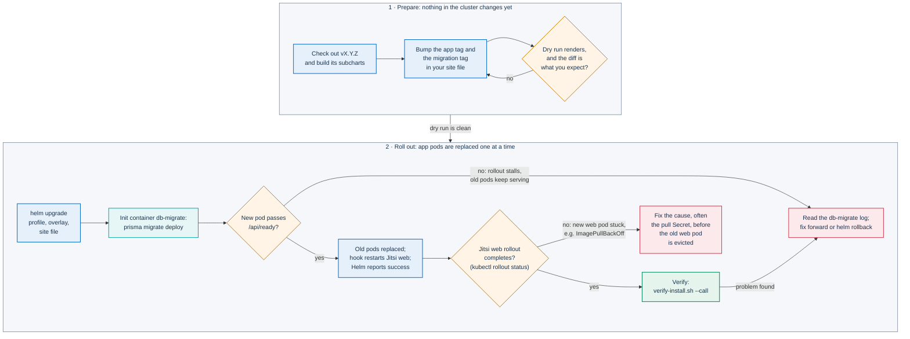
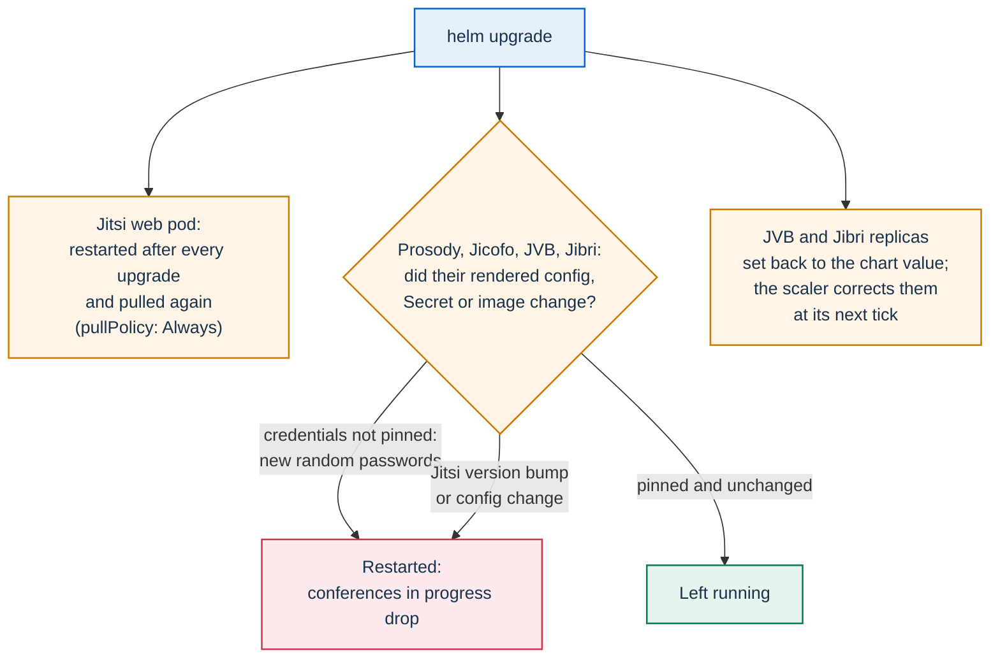

# Upgrades and rollback

This page is for operators who run PA Webinar with the Helm chart. It covers moving an
installation to a new release without losing configuration, and going back when a release
misbehaves. It also says what a rollback puts back and what it does not.

The first installation is covered in [Deploying with Helm](../DEPLOYMENT.md). The images each
release publishes, and their tags, are in [CI, images and releases](../development/ci-and-release.md).
Choosing and sizing a platform is in [Installing PA Webinar](../install/README.md).

The examples use `pa-webinar` as both the release name and the namespace, and `X.Y.Z` for the
target release. Replace them with your own values.

## In short

- Upgrade with the same layered files as the install: the profile and the platform overlay of the
  target release, then your site file, then your secrets, which stay in their Kubernetes Secrets.
  Keep every setting in those files, never in `--set`. `helm get values` is only for recovering an
  installation whose files were lost ([Recovering lost files](#recovering-lost-files)).
- Take the chart, the example files and the images from the same release. Pass the app image tag and
  the migration image tag explicitly, both of them, every time.
- Take a backup first ([Take a backup](#take-a-backup)).
- Upgrade when no event is live. The app itself rolls without downtime, but by default the Jitsi web
  pod restarts on every upgrade, and other Jitsi components can restart too.
- Pin the credentials that the Jitsi subchart would otherwise generate at random on every render.
- Watch the Jitsi web rollout yourself after the upgrade. Helm reports success before the restarted
  web pod is running.
- Check the result with `scripts/verify-install.sh --call` once the rollouts are done. It retries the
  conference for up to 90 s while the restarted web pod comes up (`--conference-wait`).
- A rollback restores the chart's manifests. It does not restore the database schema, the data, or
  the components published only with the floating `:dev` tag.

| Platform | How to upgrade |
|---|---|
| One k3s server, installed with `pa-webinar-up.sh` | `git checkout vX.Y.Z`, then `infra/onprem/k3s/pa-webinar-up.sh --portal <portal>`: it brings the new images, layers the files of the new release and runs the checks ([Upgrade](../install/k3s.md#upgrade)) |
| k3s installed by hand, three nodes included | A new image archive imported on every node, then [the upgrade procedure](#the-upgrade-procedure) with the k3s layers ([A.10 Upgrade by hand](../install/k3s.md#a10-upgrade-by-hand)) |
| minikube | `git pull` (or a checkout), then `scripts/minikube-up.sh` with the same `--profile` ([Update, stop and remove](../install/minikube.md#update-stop-and-remove)) |
| AKS, GKE, EKS and other clusters | [The upgrade procedure](#the-upgrade-procedure), with the full profile, the platform overlay and the module's output before your site file |

## What an upgrade changes

An upgrade moves several parts, each with its own value in the chart:

| Part | Value | Notes |
|---|---|---|
| Portal | `app.image.tag` | The Next.js application. |
| Migration image | `app.migration.image.tag` | The `builder` stage of the same build. It runs the database migrations before each app pod starts. |
| Chart | the chart you pass to `helm upgrade` | Templates, defaults, the pinned subcharts (PostgreSQL, Redis, Jitsi Meet) and the third-party images `values.yaml` pins, the PostgreSQL server image among them. A new PostgreSQL major version needs care: see [Reading the dry run](#reading-the-dry-run). |
| Patched Jitsi web image | `jitsi-meet.web.image.tag` | Built by its own workflow. Changing it is a conference-image rollout. See [The patched web image](../architecture/jitsi-integration.md#the-patched-web-image). |
| Recorder bot, recorder controller, AI post-production worker | `recorder.image`, `recorder.controller.image`, `postprod.worker.image` | Published only as `:dev` and `:dev-<sha>`. The chart defaults to `:dev`. See [Rollback](#making-the-dev-components-roll-back). |

The tag each image carries for a release is listed in the image-tag table of
[CI, images and releases](../development/ci-and-release.md).

Take the chart from the same release as the images. Two sources work:

- **The packaged chart.** Each GitHub Release has the chart attached as `pa-webinar-X.Y.Z.tgz`, with
  its subcharts included and its `appVersion` set to the release.
- **A source checkout.** Check out the tag `vX.Y.Z` and build the subcharts. They are not committed;
  `Chart.lock` pins their versions. The example files of the checkout are the ones to layer: an
  overlay fixed in a release reaches your installation only if you pass the new file.

  ```bash
  helm repo add bitnami https://charts.bitnami.com/bitnami
  helm repo add jitsi-contrib https://jitsi-contrib.github.io/jitsi-helm/
  helm dependency build infra/helm/pa-webinar
  ```

The rest of this page writes `<chart>` for either `./pa-webinar-X.Y.Z.tgz` or
`./infra/helm/pa-webinar`.

## Before you upgrade

### Read the release notes

Read [CHANGELOG.md](../../CHANGELOG.md) and the GitHub Release notes for every release between the
one you run and the one you target. Releases follow semantic versioning; while the major version is
0, a minor release can change chart values and behavior. The GitHub Release also carries the SBOMs
and the packaged chart.

Some behavior changes need no migration and no new value, yet change what the public sees on events
that are already published: for example, which event materials a public page lists before the start.
The release notes flag them. After such an upgrade, check the upcoming events with their organizers.

To see what runs now:

```bash
helm history pa-webinar -n pa-webinar
kubectl get deploy pa-webinar -n pa-webinar -o jsonpath='{..image}{"\n"}'
curl -s https://webinar.example.com/api/health    # "version", "commit", "builtAt" of the running image
```

### Pick an upgrade window

The app pods roll one at a time, and a new pod receives traffic only once it is ready. The
conference is a different matter:

- the Jitsi web pod restarts after every upgrade, and it also carries the conference signaling
  to Prosody;
- Prosody, Jicofo, the bridge (Jitsi Videobridge, JVB) and Jibri restart whenever their
  configuration, image or credentials change ([Jitsi during an upgrade](#jitsi-during-an-upgrade));
- Helm sets the bridge and Jibri replica counts back to the chart values.

Upgrade when no event is `LIVE` or `PROVISIONING`, and none is due to start within the scaler's
pre-scale window ([Scaling the media plane](../architecture/scaling.md#cold-start-and-the-pre-scale-window)).
While the status page is published, the status endpoint gives the counts:

```bash
curl -s https://webinar.example.com/api/status \
  | jq '{live: .metrics.activeEvents, provisioning: .metrics.provisioningEvents, idle: .metrics.idleEvents, upcoming: .upcomingEvents}'
```

If the status page is turned off in site settings (`SiteSetting.statusPageEnabled`), `/api/status`
returns only bridge readiness to anonymous callers, and the filter above prints `null`, which looks
like "no events". Open `/api/status` in a browser signed in as an administrator instead, or check the
event list in the administration area.

The statuses are explained in [Event lifecycle](../architecture/event-lifecycle.md).

### Take a backup

Migrations cannot be undone, so a database copy taken just before the upgrade is the only way back to
the old schema. `scripts/backup.sh` takes it from the in-cluster PostgreSQL, from inside its pod, so
the password never leaves it:

```bash
scripts/backup.sh --kubeconfig <kubeconfig> --state-dir <your-installation-folder> \
  --age-recipient age1...
```

- **What it writes**: a new folder `<release>-<UTC timestamp>/`, readable only by you, with the dump
  (`database.dump`, `pg_dump -Fc`), your installation folder when you pass `--state-dir` or
  `--include`, the object store with `--include-storage` (`storage.tar`), a `manifest.txt` with no
  secrets (versions, the fingerprints of `PII_ENCRYPTION_KEY` and `APP_SECRET`, the row count of every
  table) and `SHA256SUMS`. It is built in a hidden folder and renamed at the end, so a failed or
  interrupted run leaves no half backup. A run killed outright leaves that hidden folder and the lock
  folder `.backup-in-corso`, which the next run names: delete both by hand.
- **Where**: `<state-dir>/backups` with `--state-dir`, otherwise
  `~/.config/pa-webinar/backups/<namespace>-<release>`, or `--dir`. The fourteen newest are kept
  (`--keep`). A destination inside the repository is refused.
- **Encryption**, recommended: `--age-recipient` (repeatable), `--age-recipients-file` or
  `--gpg-recipient`. With it the plaintext never touches the disk. Make the age key pair once, on the
  machine that keeps the backups, with `(umask 077; age-keygen -o key.txt)`: it prints the public key
  (`age1...`) to pass here. Keep `key.txt` away from the cluster, with a copy in your vault
  ([An encryption key, once](../install/k3s.md#an-encryption-key-once)).
- **The object store**, with `--include-storage`, when it runs on a volume of the cluster: the Garage
  add-on of one k3s server by default, another store with `--storage-selector`. The store stops for the
  whole copy, the database dump included, so that the two match; uploads and video playback fail
  meanwhile, and the script refuses while an event is live (`--allow-live`). It comes back at the end,
  after an error and after Ctrl-C; after a hard stop, `scripts/restore.sh --resume --yes` with the same
  cluster options brings it back.
- **A managed database**: `--database-url` (from the environment) or `--database-url-file FILE`, with a
  local `pg_dump` of the server's major version or newer. A provider snapshot works too.
- **What it needs**: `kubectl`, `curl`, `openssl`, `awk` and `tar`; `age` or `gpg` to encrypt. Every
  file it writes is readable only by you (`umask 077`).

Keep the application Secret's keys with every dump, and above all `PII_ENCRYPTION_KEY`: personal data
is encrypted in the database, and a dump without that key cannot be read. `--state-dir` does that for an
installation made with the k3s installer. The dump holds personal data: store it under the same
protections as the database, and delete it when you no longer need it
([Privacy and data protection](../GDPR.md)).

Without `--include-storage`, and for an object store outside the cluster, the backup does not cover
the files: back those up with your provider's tools at the same moment. Before you ever restore a
database alone, read how to keep recordings made after the dump from being deleted as orphans
([What a rollback restores and what it does not](#what-a-rollback-restores-and-what-it-does-not)).

### Backups with the chart's CronJob

With `backup.enabled: true` the chart dumps the database every night into a volume of the cluster
([Database backups](../DEPLOYMENT.md#database-backups)). The dumps live next to the database, so copy
them elsewhere. A Job created from the suspended `<fullname>-backup-tools` CronJob is a pod with the
backup volume mounted at `/backup` and the PostgreSQL tools, which ends by itself after
`backup.activeDeadlineSeconds`:

```bash
NS=pa-webinar; FN=pa-webinar
kubectl -n $NS create job $FN-backup-$(date +%s) --from=cronjob/$FN-backup       # one dump now
J=$FN-tools-$(date +%s)
kubectl -n $NS create job $J --from=cronjob/$FN-backup-tools
kubectl -n $NS wait job/$J --for=jsonpath='{.status.ready}'=1
kubectl -n $NS exec job/$J -- ls -l /backup
(umask 077; kubectl -n $NS exec job/$J -- cat /backup/<file> > <file>)           # copy it off the cluster
kubectl -n $NS delete job $J
```

The copy holds personal data: `umask 077` keeps it readable by you alone. Job names carry a
timestamp because a finished Job keeps its name for three days. On a storage class that binds a
volume to the first pod using it (`WaitForFirstConsumer`, like local-path on k3s), the backup volume
stays `Pending` until the first dump, and `helm upgrade --wait` waits for it until the timeout: the
first command above binds it. `pa-webinar-up.sh --backup` runs that first dump itself. To restore one of
these dumps, copy it off the cluster and use `scripts/restore.sh --from-dump <file>`
([Restore a backup](#restore-a-backup)): it stops the writers and brings them back in order, which a
bare `pg_restore` does not.

### Check that every image can be pulled

The published images need registry credentials. Pull secrets reach the pods by three separate
routes:

- **App and migration images** use `app.imagePullSecrets`. The recorder bot, the recorder
  controller and the AI post-production worker inherit that list when their own is empty.
- **Jitsi pods** use only `jitsi-meet.imagePullSecrets`, a single list for every Jitsi component.
  They run under the subchart's own ServiceAccount, so they inherit neither `app.imagePullSecrets`
  nor a pull secret attached to another ServiceAccount. The default in `values.yaml` lists `ghcr-secret`
  (for the patched web image) and `dockerhub-secret` (to avoid the anonymous pull limit on the
  standard Jitsi images). Create both in the namespace. A listed Secret that does not exist leaves
  an error event on every Jitsi pod, and without `ghcr-secret` the patched web image cannot be
  pulled.
- **The chart's ServiceAccount** carries no pull secrets.

The Jitsi web image needs the most care. It is pulled with `pullPolicy: Always` (the default of
`jitsi-meet.web.image.pullPolicy` in `values.yaml`), and the web pod
restarts after every upgrade, so every upgrade pulls it again. If the pull fails, the new web pod
stays in `ImagePullBackOff`. The rolling update keeps the previous pod serving only for as long as
that pod lives. After the next drain or eviction, nobody can open a conference. Test the pull with
the exact image and Secret before the upgrade:

```bash
kubectl run web-pull-check -n pa-webinar --restart=Never \
  --image=ghcr.io/italia/pa-webinar-jitsi-web:<web-tag> \
  --overrides='{"apiVersion":"v1","spec":{"imagePullSecrets":[{"name":"ghcr-secret"}]}}' \
  --command -- /bin/true
kubectl get pod web-pull-check -n pa-webinar -w   # Completed: the pull works. ErrImagePull or ImagePullBackOff: fix the Secret first.
kubectl delete pod web-pull-check -n pa-webinar
```

The same test works for any other image whose tag the upgrade changes.

### Record what the floating tags point to

A rollback cannot bring back an image that exists only under `:dev`, because `:dev` moves with every
build. Before the upgrade, record the digest each floating tag resolves to now (after
`docker login ghcr.io` with credentials that can read the images):

```bash
docker buildx imagetools inspect ghcr.io/italia/pa-webinar-recorder:dev
docker buildx imagetools inspect ghcr.io/italia/pa-webinar-recorder-controller:dev
docker buildx imagetools inspect ghcr.io/italia/pa-webinar-postprod-worker:dev
```

A pod that is running shows the digest it actually pulled in `.status.containerStatuses[*].imageID`.

## The upgrade procedure

<a id="the-drift-safe-procedure"></a>The values of a running installation are whatever its last
`helm install` or `helm upgrade` received, from files and `--set` flags alike. An upgrade gives the
same files again, from the target release and from your own folder, in the same order as the install:

1. the profile (`examples/values-simple.yaml`, `values-standard.yaml` or `values-full.yaml`) of the
   target release;
2. the platform overlay of the same release (`values-k3s.yaml`, `values-aks.yaml`, ...), the add-on
   overlays, and a cloud module's output;
3. your site file: the host names, the image tags, the TLS settings and everything else that is yours;
4. your secrets: in `existing` or `external` mode they stay in their Secrets and are not passed to
   Helm; in `generate` mode, the private values file that holds them.

Taking the profile and the overlay from the new release keeps their fixes; taking your site file last
keeps your settings and pins. `values-production.yaml` and the chart's other top-level values files
are examples: never upgrade from them.

The commands and the Helm behavior on this page are those of Helm 3, the major version that CI
pins in `.github/workflows/ci.yml`. `--dry-run=server` needs Helm 3.13 or later. Helm 4 can upgrade
with server-side apply; if yours does, check how your release treats the fields that the scaler
changes at runtime ([Bridge and Jibri replica counts](#bridge-and-jibri-replica-counts)).



The commands below write `<layers>` for the `-f` files of steps 1 to 3 above, for example on the
standard profile:

```bash
-f <chart>/examples/values-standard.yaml -f pa-webinar.values.yaml -f pa-webinar.private.yaml
```

With the packaged chart, take the example files from its `examples/` directory
(`tar xzf pa-webinar-X.Y.Z.tgz pa-webinar/examples`).

**1. Take the new release.** Check out the tag `vX.Y.Z` and build its subcharts, or download the
packaged chart ([What an upgrade changes](#what-an-upgrade-changes)).

**2. Bump both image tags in your site file.**

```yaml
app:
  image:
    tag: "X.Y.Z"
  migration:
    image:
      tag: "vX.Y.Z-migrate"
```

- The app image tag has no `v`.
- The migration image is published as `vX.Y.Z-migrate`, and current releases also publish
  `X.Y.Z-migrate`. `vX.Y.Z-migrate` exists for every release, so it is the safe choice.
- When `app.migration.image.tag` is empty, the chart computes `<app tag>-migrate` (the
  `pa-webinar.migrationImage` helper in `templates/_helpers.tpl`). Older releases never published
  that form.
- Always set both tags. A site file that already pins `app.migration.image.tag` keeps the old
  migrations if only the app tag moves. When the new release adds migrations, its pods then fail
  their readiness check against the old schema, and the rollout stalls.

This is also the moment to pin anything you have not pinned yet. That includes
`jitsi-meet.web.image.tag`, so the conference image changes only when you decide, and the Jitsi
credentials ([Pin the generated credentials](#pin-the-generated-credentials)).

**3. Dry-run and diff.**

```bash
helm get manifest pa-webinar -n pa-webinar > old.yaml
helm template pa-webinar <chart> -n pa-webinar <layers> > new.yaml
diff -u old.yaml new.yaml | less
```

`helm template` also prints the hook resources, which `helm get manifest` leaves out. If you use
the `helm-diff` plugin, `helm diff upgrade pa-webinar <chart> -n pa-webinar <layers>` does the same
comparison. `helm upgrade ... --dry-run=server` also validates the result against the API server. A
change you did not expect, such as a host, an image or a replica count, means that your files lack a
setting the release runs with: find it with `helm get values pa-webinar -n pa-webinar` and add it to
your site file. See [Reading the dry run](#reading-the-dry-run) for what else to look for.

**4. Upgrade.**

```bash
helm upgrade pa-webinar <chart> -n pa-webinar <layers> --wait --timeout 10m
```

`--wait` makes Helm wait until the new pods are ready. Only then does it run the post-upgrade
hook that restarts the Jitsi web pod. The hook runs `kubectl rollout restart`, which only asks for
the restart and returns at once. Helm therefore reports success before the new web pod is running,
and it reports success even if that pod never starts, for example in `ImagePullBackOff`. With
`backup.enabled` on a storage class that binds volumes on first use, leave out `--wait` and rely on
step 5 ([Database backups](../DEPLOYMENT.md#database-backups)).

**5. Watch the rollouts, the app's and the Jitsi web pod's.**

```bash
kubectl rollout status deploy/pa-webinar -n pa-webinar
kubectl rollout status deploy/pa-webinar-jitsi-meet-web -n pa-webinar --timeout 5m
kubectl get pods -n pa-webinar -l app.kubernetes.io/instance=pa-webinar
kubectl logs -n pa-webinar <new-app-pod> -c db-migrate
```

If the web rollout does not complete, the previous web pod keeps serving only until it is evicted
or its node is drained. Fix the cause first
([Check that every image can be pulled](#check-that-every-image-can-be-pulled)).

**6. Verify.** The check retries the conference for up to 90 s (`--conference-wait`), so it can run as
soon as the rollouts are done, while the restarted web pod finishes starting:

```bash
scripts/verify-install.sh --kubeconfig <kubeconfig> --context <context> --keys-from-cluster --call
```

It checks that the running image carries the version you set, that the certificates, the portal,
its components, the conference and every scheduled job answer, and, with `--call`, that two browsers
hear and see each other ([Post-install verification](../install/checklists.md#post-install-verification)).
The status page (`/status`, **System status**) shows the same components. Metrics and alerts are in
[Monitoring and health](monitoring.md).

Commit the bumped site file to your private configuration repository: it is the record of the
installation's values.

### Why not `--reuse-values`

`helm upgrade --reuse-values` keeps every value of the previous release, manual pins included. It
does this by taking the previous chart's values as the base, so the new chart's `values.yaml` is
ignored:

- a key that is new in this chart version has no default at all, which can fail the upgrade halfway
  or render a feature differently from the documented default;
- a default that changed in this chart version keeps its old value.

Your layered files keep the same pins and still apply the new defaults and the new overlays.

### Recovering lost files

When the files an installation was made with are lost, `helm get values` returns what the last
install or upgrade received, every layer merged, without the chart defaults:

```bash
helm get values pa-webinar -n pa-webinar -o yaml > recovered.yaml
```

The file can hold passwords (in `generate` mode, or when a value was passed with `--set`): keep it in
your private configuration repository. Split it back into a site file, dropping what the profile and
the overlay of the release already set, and upgrade from then on with the layered files. Helm's
`--reset-then-reuse-values` (Helm 3.14 or later) upgrades from the same values without a file, once,
while you rebuild them. For an installation made with the k3s installer, run it again with every
option and `--recover-secrets`, which rebuilds the secrets file from the cluster's Secrets
([Upgrade](../install/k3s.md#upgrade)).

### Reading the dry run

- **The chart refuses to render.** The render guards in `templates/_guards.tpl`, which
  `templates/deployment.yaml` includes, stop incoherent values before anything reaches the cluster.
  They catch, among others:
  - advanced noise suppression switched on over a web image that is not patched;
  - a datastore Secret that the subcharts do not point to, or that no template renders;
  - conference token authentication that Prosody could not verify: no secret, two conflicting
    secret settings (`jitsi-meet.prosody.jwt.secret` and `jwt.existingSecretName` together, or an
    `existingSecretName` different from `secrets.jitsiJwtSecretName`), an `AUTH_TYPE`, app ID,
    issuer or audience that differs between `jitsi-meet.extraCommonEnvs` and
    `jitsi-meet.prosody.extraEnvs`, or, in `generate` mode, an app issuer or audience that Prosody
    does not accept;
  - unpinned conference credentials, when `jitsi.requirePinnedCredentials` is `true`;
  - room roles that Prosody would not take from the token: Jicofo's authentication off while
    `XMPP_MUC_MODULES` loads neither `token_affiliation` nor `token_affiliation_custom`, or
    `token_affiliation_custom` asked for with nothing mounted at `/prosody-plugins-custom`. The second
    happens when your values set `jitsi-meet.prosody.extraVolumes` or `extraVolumeMounts`: they are
    lists, so they replace the chart's entries, and must repeat them
    ([Server-side role enforcement](../architecture/jitsi-integration.md#server-side-role-enforcement));
  - `app.extraCaCerts` with both a `secretName` and a `configMapName`;
  - an Ingress class that disagrees with a `kubernetes.io/ingress.class` annotation.

  Each error message names the values to align. The file is the authoritative list.
- **The notes at the end of the output.** `helm upgrade --dry-run=server` prints the chart's
  post-upgrade notes. Their `Da controllare` ("to check") section lists, among other warnings, the
  conference credentials that are not pinned
  ([Pin the generated credentials](#pin-the-generated-credentials)).
- **Image lines.** Only the images you meant to change should differ. An unexpected change to
  `jitsi-meet.web.image` means a chart default moved under a value you had not pinned.
- **The PostgreSQL image.** With the in-cluster PostgreSQL subchart, the chart pins the server image
  by digest in `postgresql.image.tag`, and the comment next to it in `values.yaml` names the version.
  If the diff changes this image, compare the major version of the running database with the new
  one:

  ```bash
  kubectl exec -n pa-webinar pa-webinar-postgresql-0 -- sh -c 'cat "$PGDATA/PG_VERSION"'
  ```

  A server of a different major version refuses the existing data directory, and the database does
  not start again. A major-version change needs a dump and restore, not an upgrade. Until you have
  done that, keep your current image pinned in your site file (`postgresql.image.tag`, with the
  digest the running pod reports in `.status.containerStatuses[*].imageID`).
- **Jitsi Secrets and checksum annotations change even though you touched nothing Jitsi-related.**
  The subchart credentials are not pinned ([Pin the generated credentials](#pin-the-generated-credentials)).
- **`replicas` on the bridge and Jibri Deployments.** These values are applied during the upgrade,
  whatever the scaler has set ([Bridge and Jibri replica counts](#bridge-and-jibri-replica-counts)).

## Database migrations during an upgrade

Every app pod has an init container, `db-migrate`, that runs `npx prisma migrate deploy` from the
migration image before the app container starts (`templates/deployment.yaml`). The first new pod
applies the pending migrations. Every later pod, and every restart, finds nothing pending.

The rollout is built so that a bad migration never takes the site down:

- **Rolling update with `maxUnavailable: 0` and `maxSurge: 1`.** A new pod is added before an old one
  is removed, so the old release keeps serving until each new pod is ready.
- **Readiness on `/api/ready`.** The startup and readiness probes call `/api/ready`, which queries the
  site settings and the latest event through the ORM. If the schema lacks a column the new code
  expects, the probe answers 503. The pod never receives traffic, and the rollout stalls instead of
  serving errors. `/api/health`, the liveness probe, only runs `SELECT 1`.
- **Old code on the new schema.** During the rollout, and after a rollback, the previous release
  runs against the migrated schema. This is why migrations must be additive: new tables, nullable
  columns or columns with defaults, new indexes. Nothing is dropped or renamed while a previous
  release still reads it. The full policy is in [Data model](../architecture/data-model.md#migrations).

**A migration fails.** The new pod stays in `Init:CrashLoopBackOff`, and the old pods keep serving
for now. Read the log:

```bash
kubectl logs -n pa-webinar <new-pod> -c db-migrate
```

When a migration fails partway, Prisma records it as failed in the `_prisma_migrations` table. From
then on, `migrate deploy` refuses to run, with error `P3009`, until the failure is resolved. Because
`db-migrate` runs on every pod start, this blocks **every** app pod that starts, not only the new
ones: a pod of the previous release that restarts, is evicted or is rescheduled fails its init
container too, and so does every pod of a `helm rollback`. The old pods keep serving only while
they keep running. Resolve the failure first, then continue or roll back, and avoid node drains in
the meantime.

After you have undone the migration's partial effects, or completed them by hand, mark it:

- `npx prisma migrate resolve --rolled-back <migration>` if you undid it;
- `npx prisma migrate resolve --applied <migration>` if you completed it.

Run either from the migration image of the release that contains the migration, with the
application Secret (which holds `DATABASE_URL`) and `/workspace/app` as the working directory, as
the `db-migrate` init container does. For example, with the application Secret named by
`secrets.existingSecretName` (default `videocall-secrets` in `values.yaml`):

```bash
kubectl run prisma-resolve -n pa-webinar --restart=Never \
  --image=ghcr.io/italia/pa-webinar:vX.Y.Z-migrate \
  --overrides='{"apiVersion":"v1","spec":{
    "imagePullSecrets":[{"name":"<app-pull-secret>"}],
    "containers":[{"name":"prisma-resolve","image":"ghcr.io/italia/pa-webinar:vX.Y.Z-migrate",
      "workingDir":"/workspace/app",
      "envFrom":[{"secretRef":{"name":"videocall-secrets"}}],
      "command":["npx","prisma","migrate","resolve","--rolled-back","<migration>"]}]}}'
kubectl logs -n pa-webinar prisma-resolve -f
kubectl delete pod prisma-resolve -n pa-webinar
```

Leave out `imagePullSecrets` when `app.imagePullSecrets` is empty. If the namespace enforces Pod
Security admission, add the `securityContext` of the `db-migrate` init container
(`app.securityContext.container`). Then let the rollout continue, or roll back
([Rollback](#rollback)).

## Jitsi during an upgrade



### The web pod restarts on every upgrade

The web Deployment's own checksum covers only its main ConfigMap. The custom `config.js` lives in a
separate ConfigMap that the checksum does not cover. So the chart ships a post-install and
post-upgrade hook, `templates/web-config-reload-hook.yaml`, that runs `kubectl rollout restart` on
the Jitsi Deployments listed in `configReloadHook.components`. The hook is on by default, and the
default list in `values.yaml` is `web`. Every upgrade therefore:

- **Restarts the web pod.** The web pod also proxies the conference signaling (BOSH and WebSocket)
  to Prosody, so the restart interrupts that connection for everyone in a conference.
- **Pulls the web image again**, because of `pullPolicy: Always`. Check the pull first
  ([Check that every image can be pulled](#check-that-every-image-can-be-pulled)).

Setting `configReloadHook.enabled: false` removes the restart. The web pod then restarts only when
its image or main ConfigMap changes, and a change to the custom Jitsi configuration needs a manual
`kubectl rollout restart`.

### The media stack restarts only when its inputs change

Prosody, Jicofo, the bridge and Jibri carry checksum annotations of their configuration and of the
Secrets that hold their internal XMPP credentials. They restart when any of these changes, or when
their image does. That happens with a Jitsi subchart or image bump, and with a change to their
configuration values. With pinned credentials and no such change, an upgrade leaves them running.

The room-role wiring is such a change: Prosody's module volume and `XMPP_MUC_MODULES`, and Jicofo's
`JICOFO_ENABLE_AUTH` and `ENABLE_AUTO_OWNER`
([Server-side role enforcement](../architecture/jitsi-integration.md#server-side-role-enforcement)).
The upgrade that first brings them to an installation restarts Prosody and Jicofo, and calls in
progress drop: run it outside events. A later change to the module file alone does not restart
Prosody; restart its StatefulSet when no call is running.

Upgrading Jitsi itself follows the
[Jitsi upgrade checklist](../architecture/jitsi-integration.md#jitsi-upgrade-checklist).

### Pin the generated credentials

The Jitsi subchart renders the internal XMPP passwords with `randAlphaNum` whenever a password is
not set and no `existingSecretName` is given. It does not look up the existing Secret. The effect:

- every render produces new passwords;
- the checksum annotations change with them;
- **every** `helm upgrade` and `helm rollback` restarts Prosody, Jicofo, the bridge and Jibri, and
  drops any conference in progress;
- a GitOps tool that renders the chart on every sync sees a different Secret each time.

The keys to pin, and the Secret keys to use instead, are in the table of
[Pin the conference's internal credentials](../DEPLOYMENT.md#pin-the-conferences-internal-credentials).
This section covers what is specific to an installation that already runs.

**Find what is not pinned.** The chart computes the list itself. After every install and upgrade
its notes print it in the `Da controllare` ("to check") section, on a line that starts with
`Credenziali interne della conferenza non fissate` ("conference internal credentials not pinned").
Read the notes of the running release, or those of the dry run for the new values:

```bash
helm get notes pa-webinar -n pa-webinar
```

The list covers the Jicofo and bridge passwords, and, when those components are on, the Jibri
passwords, `jitsi-meet.coturn.staticAuth.secret`, `jitsi-meet.jigasi.xmpp.password` and
`jitsi-meet.transcriber.xmpp.password`. As a second check, render the same values twice. Two
different hashes mean something is not pinned:

```bash
for i in 1 2; do
  helm template pa-webinar <chart> -n pa-webinar <layers> \
    | grep -E '_PASSWORD|TURN_CREDENTIALS' | sha256sum
done
```

**Pin them with the values that run now.** Read the current values from the live Secrets and add
them to your site file, so the pins match what Prosody already knows. The names below follow the
subchart's naming for a release called `pa-webinar`:

```bash
kubectl get secret pa-webinar-jitsi-meet-jvb-secret -n pa-webinar -o jsonpath='{.data.JVB_AUTH_PASSWORD}' | base64 -d; echo
kubectl get secret pa-webinar-jitsi-meet-jicofo-secret -n pa-webinar -o jsonpath='{.data.JICOFO_AUTH_PASSWORD}' | base64 -d; echo
# Only with Jibri enabled:
kubectl get secret pa-webinar-jitsi-meet-jibri-secret-xmpp -n pa-webinar -o jsonpath='{.data.JIBRI_XMPP_PASSWORD}' | base64 -d; echo
kubectl get secret pa-webinar-jitsi-meet-jibri-secret-recorder -n pa-webinar -o jsonpath='{.data.JIBRI_RECORDER_PASSWORD}' | base64 -d; echo
```

```yaml
jitsi-meet:
  jvb:
    xmpp:
      password: "<JVB_AUTH_PASSWORD>"
  jicofo:
    xmpp:
      password: "<JICOFO_AUTH_PASSWORD>"
  jibri:            # only with Jibri enabled
    xmpp:
      password: "<JIBRI_XMPP_PASSWORD>"
    recorder:
      password: "<JIBRI_RECORDER_PASSWORD>"
```

**Make the chart enforce the pins.** Once the notes list nothing, set
`jitsi.requirePinnedCredentials: true` in your site file (the default in `values.yaml` is `false`).
From then on, a render that loses a pin fails with the list of missing keys, so the dry run of a
later upgrade stops before anything reaches the cluster.

Some consequences are specific to an existing installation:

- **The invisible recorder bot** authenticates with the Jibri recorder account, so it depends on
  `jitsi-meet.jibri.recorder.password` being pinned ([Setting up recording](recording-setup.md)).
- **Keeping passwords out of values files.** Use `existingSecretName` for each component instead.
  Give your Secret a name different from the one the subchart renders: when the chart stops
  rendering a Secret, Helm deletes it. If the recorder bot is invisible (`recorder.hiddenDomain`
  set), point `recorder.xmppSecretName` at your new Jibri recorder Secret in the same upgrade. It
  usually names `pa-webinar-jitsi-meet-jibri-secret-recorder`, which Helm then deletes, and every
  recorder bot Job would fail on the missing Secret at the next recorded event. The new Secret needs
  both keys the bot reads, `JIBRI_RECORDER_USER` and `JIBRI_RECORDER_PASSWORD`
  (`recorder.xmppSecretUserKey` and `recorder.xmppSecretPasswordKey`).
- **The upgrade that introduces the pins** still restarts these components once, because their
  checksum annotations change. Do it in an upgrade window.

### Bridge and Jibri replica counts

The JVB scaler changes the bridge and Jibri replica counts at runtime with `kubectl scale`
([Scaling the media plane](../architecture/scaling.md)). Helm 3, the lowest version the chart
supports and the one CI validates it with, computes a three-way patch against the live object. An
upgrade or a rollback therefore sets `spec.replicas` back to the chart values,
`jitsi-meet.jvb.replicaCount` and `jitsi-meet.jibri.replicaCount`. `examples/values-full.yaml` sets
both to `0`. With Helm 4 and server-side apply, verify the behavior on your own release before you
rely on it either way.

- **Between events** the effect is harmless. The scaler restores the right count at its next tick
  (`jvbScaler.schedule`, every two minutes by default in `values.yaml`).
- **During an event** the upgrade removes the bridge that serves the conference.

This is one more reason to upgrade outside events. Pausing and validating the scaler are covered
in [Running the JVB scaler](jvb-scaler.md).

## Moving datastore passwords into a separate Secret

This step is recommended, not required. It matters when the in-cluster PostgreSQL subchart is
enabled. That subchart mounts the Secret it reads its password from, whole, as files inside the
database container. If the application keys, starting with `PII_ENCRYPTION_KEY`, live in the same
Secret, anyone who reaches the database container can read them. The Redis subchart mounts only
its own key.

Existing installations keep everything in one Secret and keep working. The chart never changes the
layout by itself: `secrets.datastoreSecretName` is empty by default, which means "use the
application Secret". The change restarts the PostgreSQL and Redis pods, so make it in an upgrade
window.

**`existing` and `external` modes.** You create the Secrets.

1. **Before the upgrade**, create the new Secret with the same values. PostgreSQL wrote its
   passwords into its data volume at first start and does not read them again, so the values must
   not change. `videocall-secrets` is the chart default for `secrets.existingSecretName`, and
   `videocall-datastore` is the name used in `examples/values-simple.yaml`. Omit the keys you do not
   use: with an external database, only `REDIS_PASSWORD` is needed.

   ```bash
   get() { kubectl get secret videocall-secrets -n pa-webinar -o jsonpath="{.data.$1}" | base64 -d; }
   kubectl create secret generic videocall-datastore -n pa-webinar \
     --from-literal=POSTGRES_PASSWORD="$(get POSTGRES_PASSWORD)" \
     --from-literal=POSTGRES_ADMIN_PASSWORD="$(get POSTGRES_ADMIN_PASSWORD)" \
     --from-literal=REDIS_PASSWORD="$(get REDIS_PASSWORD)"
   ```

2. Point the chart and each enabled subchart at it in your site file. The render guard fails if an
   enabled subchart still points elsewhere.

   ```yaml
   secrets:
     datastoreSecretName: videocall-datastore
   postgresql:
     auth:
       existingSecret: videocall-datastore
   redis:
     auth:
       existingSecret: videocall-datastore
   ```

3. Upgrade with [the upgrade procedure](#the-upgrade-procedure). The app pods read `REDIS_PASSWORD` from the new Secret
   from then on.

4. Remove the old copies from the application Secret. They are no longer read there, and the
   database superuser password has no reason to be in every pod that loads the application Secret.
   With `existing`, remove the keys that are present:

   ```bash
   kubectl patch secret videocall-secrets -n pa-webinar --type=json -p='[
     {"op":"remove","path":"/data/POSTGRES_PASSWORD"},
     {"op":"remove","path":"/data/POSTGRES_ADMIN_PASSWORD"},
     {"op":"remove","path":"/data/REDIS_PASSWORD"}]'
   ```

   With `external`, the ExternalSecret owns the application Secret (`creationPolicy: Owner`), so the
   Secret holds exactly the keys listed in `secrets.external.<provider>.secretMappings` (the
   `azureKeyVault`, `awsSecretsManager` or `gcpSecretManager` block). Delete the
   `POSTGRES_PASSWORD`, `POSTGRES_ADMIN_PASSWORD` and `REDIS_PASSWORD` entries from those mappings in
   your site file and upgrade. The External Secrets Operator rewrites the Secret without them when it
   next reconciles. Delete the remote vault entries only after no mapping references them: a
   mapping that points at a missing entry makes the sync fail, and the application Secret then
   stops refreshing.

**`generate` mode.** The chart renders the Secrets. Set `secrets.datastoreSecretName` and align the
subcharts' `existingSecret` values as in step 2, and do not create the Secret by hand. The chart
renders the datastore Secret from `secrets.generate.*`, with the same passwords, and drops those
keys from the application Secret in the same upgrade. A Secret created with `kubectl` and then
claimed by the chart makes the upgrade fail, because Helm refuses to adopt a resource it does not
own.

## Rollback

### Rolling back the release

```bash
helm history pa-webinar -n pa-webinar
helm rollback pa-webinar <revision> -n pa-webinar --wait --timeout 10m
```

`helm rollback` re-applies the manifests stored for that revision; it does not render the chart
again. The app pods roll back the same way they rolled forward. Each new pod runs `db-migrate` with
the older migration image. That image finds every one of its migrations already applied, reports
that there are no pending migrations, and exits successfully. The older code then runs on the newer
schema, which the additive rule makes safe. The exception is a migration still recorded as failed:
the older image stops on `P3009` as well, and the rolled-back pods stay in `Init`. Resolve the failed
migration before you roll back ([Database migrations during an upgrade](#database-migrations-during-an-upgrade)).

Two differences from an upgrade:

- **The config-reload hook does not run.** It is declared for `post-install` and `post-upgrade`
  only. If the rollback changes the custom Jitsi web configuration, restart the web pod yourself:

  ```bash
  kubectl rollout restart deployment -n pa-webinar -l app.kubernetes.io/component=web
  ```

- **Unpinned Jitsi credentials** go back to the random values stored with that revision. The
  checksum annotations differ from the running ones, so the media stack restarts.

### What a rollback restores and what it does not

| Part | After `helm rollback` |
|---|---|
| App and migration image references | Restored to the revision's tags |
| Everything the chart renders: ConfigMap, CronJobs, Ingresses, chart-rendered Secrets, subchart manifests, the Jitsi web image reference | Restored |
| Database schema | Stays at the newer version. Prisma migrations have no down step |
| Data written since the upgrade | Stays |
| Object storage (recordings, audio tracks, post-production artifacts, materials) | Untouched |
| Secrets you manage (`existing`, `external`) | Untouched |
| Recorder bot, recorder controller, AI post-production worker on `:dev` | **Not restored.** `:dev` now points to the latest build |
| Third-party images the chart references: `kubectlImage` (used by the scaler, the config-reload hook and the post-production orchestrator when their own `image` is empty), `postgresql.image.tag`, `redis.image.tag`, the curl image of each scheduled job | Restored. `values.yaml` pins them by digest or by version tag, so the revision's references name the images that ran, unless your own values set a floating tag |
| Bridge and Jibri replica counts | Set to the revision's chart values; the scaler corrects them at its next tick |

To return to the pre-upgrade schema, restore the backup taken before the upgrade. Everything
written since then is lost, so do it only when the older release cannot run on the newer schema.
Under the additive rule, that should not happen.

### Restore a backup

`scripts/restore.sh` restores a backup of `scripts/backup.sh` (`--from DIR`), or a bare `pg_dump -Fc`
archive such as a dump of the chart's CronJob copied off the cluster (`--from-dump FILE`, also `.age`
or `.gpg`). It needs an explicit `--kubeconfig` or `--context`, and changes nothing without `--yes`:

```bash
scripts/restore.sh --kubeconfig <kubeconfig> --from <backup-folder> --identity key.txt --dry-run
scripts/restore.sh --kubeconfig <kubeconfig> --from <backup-folder> --identity key.txt --yes -- --call
```

Add `--include-storage` when the backup holds the object store (`backup.sh --include-storage`). The
full form for one k3s server is in [Backup and restore](../install/k3s.md#backup-and-restore).

- **Before it touches anything** it verifies the checksums, that the archive decrypts, that the
  fingerprints of `PII_ENCRYPTION_KEY` and `APP_SECRET` in the live Secret match the backup's, and
  with `--include-storage` the object store's key too (`--allow-key-mismatch` to override), and that
  no event is live or being provisioned (`--allow-live`). `--dry-run` stops there and prints the plan.
- **Then it pauses the writers**: it records the original state as annotations
  (`pa-webinar/restore-suspend` on each CronJob, `pa-webinar/restore-replicas` on the portal and the
  recorder controller), suspends every CronJob of the release, `recordings-reconcile` included, waits
  for their running Jobs, and scales the portal and the recorder controller to zero. Email and
  lifecycle Jobs that were due in that window simply run later. With `--include-storage` it also
  stops the store, then extracts the store's archive next to the current files and checks it against
  the manifest: the volume needs free space for the archive, plus 5% and 64 MiB.
- **It restores in one transaction.** By default (`--clean-mode schema`) it recreates the schema and
  applies the whole archive, which also works when the database is at a newer version than the
  backup, after an upgrade; a failure leaves the database unchanged ("Ripristino non riuscito,
  database invariato"). `--clean-mode objects` runs
  `pg_restore --clean --if-exists --no-owner --single-transaction` instead, for a database user that
  does not own the schema. It then compares the row counts with the manifest. With
  `--include-storage` it swaps in the restored files after the database; if that swap fails, the
  database is restored and the store and `recordings-reconcile` stay stopped until the same command
  runs again.
- **It protects the recordings.** A database older than the object store no longer references the
  videos saved after the backup, and the reconciliation job would delete them as orphans once
  `orphanRecordingGraceDays` has passed (default 30 in `schema.prisma`). The script sets the grace
  period to `0`, which lists the unreferenced videos in **Video recordings**, tab **Orphans**, without
  deleting them, and ends by printing the command that puts the old value back. Mark the ones to keep
  with **Keep**, then run it:

  ```bash
  scripts/restore.sh --reset-orphan-grace 30 --kubeconfig <kubeconfig>
  ```

  It does only that, needs no `--yes`, and with `--dry-run` shows the current value
  ([Orphans](recording-setup.md#orphans)). Until then `verify-install.sh` warns that orphans are never
  deleted. `--keep-orphan-grace` skips the change, only when the object store was restored to the
  same moment, as `--include-storage` does.
- **It resumes in order**: the store, the portal, whose migration init container brings the schema up
  to the running release, then the recorder controller, then the CronJobs in their original state,
  `recordings-reconcile` last. It then runs `scripts/verify-install.sh` with the same cluster options,
  `--keys-from-cluster`, and the certificate authority of an installation made with the k3s
  installer, taken from its state folder when the kubeconfig sits there (`--ca-file` for any other).
  Whatever follows `--` goes to the check as well. Any failure after the pause resumes everything by
  itself. After a hard stop, `scripts/restore.sh --resume --yes --kubeconfig <kubeconfig>` finishes
  the job, also for a store left stopped by an interrupted backup, and `verify-install.sh` reports a
  CronJob left "sospeso da un ripristino non concluso" (suspended by an unfinished restore), or a
  stopped store, as an error.

Restore in this order: the keys and the installation's files first, then the database and the object
store, from the same moment. The state archive in a backup (`stato.tar`) is never restored by the
script: it holds the keys and the files to reinstall with. The drill that proves your backups restore
is in [Restore drill](../install/checklists.md#restore-drill).

### Making the `:dev` components roll back

The recorder bot, the recorder controller and the AI post-production worker are published only by
the development workflow, with the floating `:dev` tag and an immutable `:dev-<sha>` tag per build.
The chart defaults to `:dev`, and the recorder bot and worker Jobs are created from suspended CronJob
templates. A tag rollback therefore leaves them on whatever `:dev` points to at that moment.

To make them follow a rollback, pin an immutable reference in your values: the `:dev-<sha>` tag of
the build you validated, or the digest you recorded before the upgrade.

```yaml
recorder:
  image: ghcr.io/italia/pa-webinar-recorder@sha256:<digest>
  controller:
    image: ghcr.io/italia/pa-webinar-recorder-controller@sha256:<digest>
postprod:
  worker:
    image: ghcr.io/italia/pa-webinar-postprod-worker@sha256:<digest>
```

With a pinned reference, these components change only when you bump the value. They then move with
`helm rollback` like everything else the chart renders. Versioned release images for them are on
the [Roadmap](../ROADMAP.md).

## Docker Compose stack

The Docker Compose stack builds from source and is a development environment
([Local development](../DEVELOPMENT.md)). To move a Compose installation to a new release:

```bash
git fetch --tags
git checkout vX.Y.Z
docker compose --profile setup build
docker compose --profile setup run --rm db-migrate npx prisma migrate deploy
docker compose up -d
```

Always pass `npx prisma migrate deploy` explicitly. The default command of the `db-migrate` service
runs the seed script (`app/prisma/seed.ts`) after the migrations. The seed deletes every event,
with its registrations, questions, polls, materials and reminders, as well as the GDPR audit log
and user-created event templates, and then creates example events. Run the default command only on
an empty database.

To go back, check out the previous tag, build, and start the stack again. The schema stays at the
newer version, as it does with Helm.

## Related pages

- [Deploying with Helm](../DEPLOYMENT.md): first installation, chart keys, first-run checks.
- [CI, images and releases](../development/ci-and-release.md): the image-tag table and how releases
  are cut.
- [Data model](../architecture/data-model.md#migrations): the migration policy.
- [How PA Webinar extends Jitsi Meet](../architecture/jitsi-integration.md): the patched web image and
  the Jitsi upgrade checklist.
- [Scaling the media plane](../architecture/scaling.md) and [Running the JVB scaler](jvb-scaler.md):
  why replica counts change at runtime.
- [Setting up recording](recording-setup.md): the values that the recorder bot and Jibri depend on.
- [Monitoring and health](monitoring.md): probes, status pages and alerts after an upgrade.
- [Troubleshooting](troubleshooting.md): symptoms and fixes for running installations.
- [Installing PA Webinar](../install/README.md): choosing and sizing a platform.
- [Configuration reference](../CONFIGURATION.md): the secrets map, including `PII_ENCRYPTION_KEY`.
