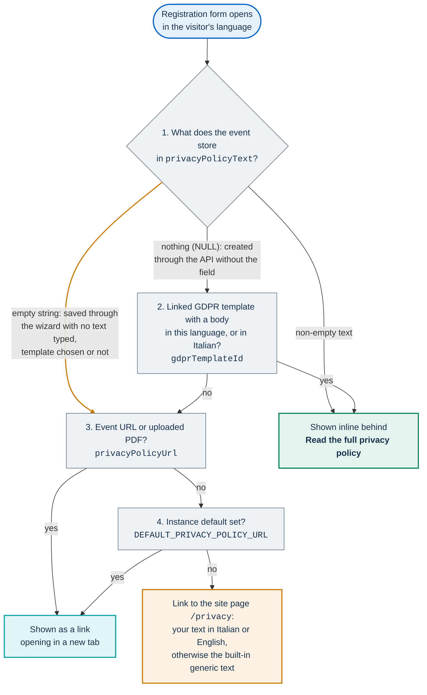
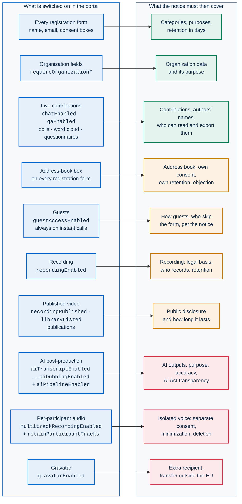

# Privacy notice checklist for controllers

This page lists the platform facts that the privacy notice of a PA Webinar
installation has to cover, and maps each fact to the setting that controls it.
It is written for data protection officers (DPOs) and for the controllers of an
installation: the public administration (PA) or public body that runs the
events.

> **This is not legal advice.** The controller is responsible for its privacy
> notice, for choosing the legal bases and for deciding whether a data
> protection impact assessment is needed. This page describes what the software
> does, so that the notice matches it. When a fact here and your notice
> disagree, change the setting or change the notice.

PA Webinar does not write a notice for you. It shows the texts you provide in a
few places, and it ships a generic built-in text for the cases where you have
provided nothing. Where the platform's own interface text says something
different from what the code does, the difference is called out in
[Platform texts to check](#platform-texts-to-check).

This page does not repeat the descriptions it relies on. Each fact has one
owner:

| Looking for | Go to |
|---|---|
| What each feature stores, where, how it is protected and how long it is kept | [Data inventory and retention](../GDPR.md#data-inventory-and-retention) |
| The exact consent texts and their translation keys | [Consent texts shown to users](../GDPR.md#consent-texts-shown-to-users) |
| Cookies, local storage and their lifetimes | [Cookies and browser storage](../GDPR.md#cookies-and-browser-storage) |
| What self-service access and erasure cover | [Data-subject rights](../GDPR.md#data-subject-rights) |
| Differences between what a reader expects and what the code does | [Known gaps](../GDPR.md#known-gaps) |
| Recording, per-participant audio and AI outputs in detail | [Recordings, voice data and AI outputs](recordings-and-ai.md) |
| Cookie flags, credentials and tokens | [Identity, access and tokens](../architecture/identity-and-access.md#cookie-inventory) |
| Which providers an installation depends on | [Service inventory: publishing](../SERVICE-INVENTORY.md) |
| Roles and responsibilities of a reusing administration | [Reusing PA Webinar](../REUSE.md) |

## How notices are attached

### Where people meet the notice

| Place | What it shows | Set in |
|---|---|---|
| Registration form of an event | The event's notice, inline or as a link, above the consent boxes | Event wizard, step **Review**, section **Privacy and data retention**; see [Which notice the registration form shows](#which-notice-the-registration-form-shows) |
| Site privacy page, `/<locale>/privacy`, linked from the footer as **Privacy policy** | Your site-wide text, or the built-in generic text | **Settings** > **General** > **Pages** > **Privacy policy** |
| Waiting room | **This event is being recorded.** when recording is enabled; an **AI processing after the event** notice when AI post-production applies | Event flags; **Settings** > **General** > **Post-event AI pipeline** > **AI notice in the waiting room** |
| Before entering the live room | A full-screen **Recording consent** screen with **Enter room** and **Do not participate**, for registrants and guests of events with recording enabled | Built-in text (`live.recordingConsent`) |
| During the call | A **Recording in progress** banner for everyone while a recording runs | Automatic |

The event page and the waiting room do not link the event's notice. Guests,
where they are admitted (see item 8 of
[Settings to review](#settings-to-review-before-the-first-public-event)),
never see the registration form, so the only notice link they meet is the
footer's **Privacy policy**, which leads to the site page, not to the event's
notice.

### Which notice the registration form shows

The registration form shows one notice, chosen in this order
(`app/src/app/[locale]/events/[slug]/registration/page.tsx`). The event wizard
always saves the event's text field, as an empty string when nothing is typed,
and choosing a GDPR template empties it. An empty string ends the text lookup
before the template is consulted, so the amber path below is the one every
event saved through the wizard takes when it has no typed text.

What follows from that order:

- **The event's own text wins when it is non-empty.** **Privacy notice
  (text)** has one version for all languages and is shown inline.
- **A GDPR template is not shown on events saved through the wizard.** The
  wizard preselects the template marked as default (★) under **Settings** >
  **GDPR templates** and saves the choice, but the registration form of such an
  event links the event's URL, then `DEFAULT_PRIVACY_POLICY_URL`, then
  `/privacy`. A template's body appears only on events created through the
  events API without `privacyPolicyText`. Templates hold a body in Italian and
  in English; a registrant in any other language sees the Italian body.
- **To attach a notice to a wizard event,** type it in **Privacy notice
  (text)**, or set **Privacy notice document (PDF or link)**, or rely on the
  site page.
- **`DEFAULT_PRIVACY_POLICY_URL`** is unset in the chart's
  `infra/helm/pa-webinar/values.yaml`, so the form links the site page
  `/privacy`. Set it in `app.env` only to point at a notice published
  elsewhere, for example `https://webinar.example.com/it/privacy`
  ([Configuration reference](../CONFIGURATION.md)). `.env.example` and
  `infra/helm/pa-webinar/values-production.yaml` carry example hosts: replace or
  remove them. A value set to the empty string is not a fallback: it renders a
  link to the registration page itself.
- **The site page** shows the content saved under **Settings** > **General** >
  **Pages** > **Privacy policy** for the visitor's exact language, and only
  Italian and English can be edited there. Visitors in every other language,
  and everyone when nothing is saved, see the built-in generic text. That text
  names the controller from **Organization name** (**Settings** > **General** >
  **Branding**), describes the AI pipeline even on installations that do not
  run it, names specific default models, and says rights are exercised through
  "the data controller's institutional channels". Replace it, or adjust it per
  language with **Settings** > **Languages** > **Custom translations** (keys
  under `legal.privacy`).

### Custom recording consent text

Events have a `recordingConsentText` field. It can be set only through the
events API (`POST /api/events`, `PUT /api/events/<slug>`) and appears only on
the event page of the administration area. The **Recording consent** screen that
participants see always shows the built-in text (`live.recordingConsent`). Put
any event-specific wording about recording in the event's notice, or change the
built-in text for the whole installation with that custom translation key.

### The consent boxes on the registration form

None of the boxes is pre-ticked, and the server rejects a registration that
lacks a required one. The exact English texts are quoted in
[Consent texts shown to users](../GDPR.md#consent-texts-shown-to-users), and
what is stored as evidence is in
[Evidence of consent](../GDPR.md#evidence-of-consent). Reword a box per
language with **Settings** > **Languages** > **Custom translations**.

| Box | Shown | Required | Key to reword |
|---|---|---|---|
| Participation | Always, with a statistical purpose appended when organization fields are on | Yes | `registration.gdprConsent`, `registration.gdprConsentProfiling` |
| Audio and video recording | When `recordingEnabled` is on | Yes | `gdpr.consent.recording` |
| Per-participant audio track | When `multitrackRecordingEnabled` is on | Yes | `gdpr.consent.multitrack` |
| Future communications | Always | No | `gdpr.consent.futureCommunications` |
| Address book | Always | No | `gdpr.consent.addressBook`, `gdpr.consent.addressBookHelp`; see [Address book](#address-book) |

## Checklist by notice section

Use the diagram to see which sections a given event needs. Blue boxes are what
is switched on in the portal; green, amber and red boxes are the notice sections
it triggers, from lower to higher risk.

AI post-production needs recording, and per-participant audio needs automatic
transcription: the wizard offers each option only when the one before it is on.

### Data categories per feature

The fields each feature stores, and which of them are encrypted, are listed in
the [data inventory](../GDPR.md#data-inventory-and-retention);
`app/prisma/schema.prisma` is the authority. This table says what switches each
feature on and what the notice should say about it.

| Feature | Switched on by | What the notice should say |
|---|---|---|
| Registration | Always | Name and email, the consent choices, and join and leave times. The personal join link in emails is an access credential |
| Organization fields | `requireOrganization`, `requireOrganizationRole`, `requireOrganizationType`, per event and only through the events API; the wizard has no control for them. Off by default | When on, the organization name is required on the form; role and type of body are optional. State the statistical purpose |
| Guests | **Guest access enabled** for scheduled events; always on instant calls | The display name typed in the waiting room, and, in chat messages, an identifier derived from the IP address and that name. The **Email (optional)** field there stays in the browser and is never sent |
| Q&A, chat, polls, word cloud, reactions, agenda reactions | `qaEnabled`, `chatEnabled` and the other live-interaction flags of the event | Contributions carry the author's display name: chat sender names and texts are encrypted; Q&A author names and questions are stored in plain text. Everyone who can read the chat can download it, names included |
| Questionnaires and post-event feedback | Per event | Answers carry the respondent's name, and free-text answers can contain anything |
| Materials | Staff and moderators add them per event | Whatever the documents contain. The visibility setting decides which public lists show a material, not who can open it: an uploaded file is served from its URL to anyone who has the URL, so a document with personal data should not be shared as a material |
| The square | Offered in the waiting room; the waiting-room engine sets only the starting view ([Engines](../architecture/waiting-room.md#engines-classic-view-and-the-square)) | Display name and position, visible to others waiting, expiring seconds after the last update ([Presence](../architecture/waiting-room.md#presence)) |
| Raised hands and call analytics | Always; shown in the event's **Statistics** tab | Attendance, who spoke when and who raised a hand, per call session |
| Composite recording | `recordingEnabled` | Video and mixed audio of the conference, shared screens included |
| Per-participant audio | `multitrackRecordingEnabled` | One isolated voice track per participant, labeled with a name |
| AI outputs | `aiPipelineEnabled` and the event's AI flags | Transcript with speaker labels, summary, translations, subtitles, dubbed audio. Staff can map a speaker label to a name or an address-book entry |
| Address book | The optional box on every registration form | See [Address book](#address-book) |
| Invitations | Staff add them in the event wizard. The platform sends no invitation email | The invitee's name and email. With **Public registration enabled** off, the list decides who may register, and the personal join link reaches the registrant only by email |
| Moderators and speakers | Event wizard and named grants | The primary moderator's name and email, which registrants receive (see [Recipients and processors](#recipients-and-processors)); named grants; the public speaker list |
| Staff accounts | **Accounts** | Name, email, role, last sign-in |
| Administration audit log | Always | For privileged writes (administration area, event edits made with a moderator link) and staff sign-ins: the actor, the action, the target, the IP address and the user agent |
| Email outbox | Always | Recipient and body of every email, including personal join and sign-in links |
| Avatars | **Use Gravatar when available** (`gravatarEnabled`, off by default) | Drawn from initials on the server by default; with Gravatar, see [Recipients and processors](#recipients-and-processors) |
| Browser storage | Always | See [Cookies](#cookies) |
| Conference and TURN servers | Always | IP addresses, display names, the audio and video streams. Jitsi components keep their own logs |

The application does not write IP addresses to its logs and runs no analytics
or tracking scripts. It keeps client IP addresses in memory, for rate
limiting, and in the administration audit log. A guest's chat messages also
carry an identifier derived from the guest's IP address and typed name, which
can be decoded back to the address until the event's retention ends
([Known limitations](../GDPR.md#known-limitations)).

### Purposes and legal bases

The platform records consent flags, but it does not choose your legal basis.
Check each row against the basis you rely on.

| Processing | What the platform does | Check |
|---|---|---|
| Registering and joining | Requires the participation box, whose default label speaks of consent | If you rely on a public task (Art. 6(1)(e)) rather than consent, change the label (`registration.gdprConsent`). The box stays mandatory |
| Organization data | Appends a statistical purpose to the participation box | State the statistical purpose and who sees the data (**Sign-ups** and its CSV export) |
| Recording | Requires the recording box at registration and shows the **Recording consent** screen to registrants and guests | Moderators and speakers entering by magic link see neither: collect their agreement outside the platform |
| Per-participant audio | Requires a separate box at registration, and again in the waiting room for anyone who has not given it, speakers included | Moderators are exempt from the waiting-room box. The waiting-room tick is not recorded; only the registration box is stored (`consentMultitrack`) |
| Future communications | Records the choice and shows it in **Sign-ups** and its CSV export. Nothing in the platform sends mail based on it | Describe the channel you use, or change the label if you do not use it |
| Address book | Separate optional consent | See [Address book](#address-book) |
| AI post-production | Shows a notice in the waiting room. It asks for no consent | Choose a basis that does not depend on per-person consent, or collect consent outside the platform |
| Event analytics | Attendance, speaking time and raised hands per participant, shown pseudonymously by default | State the purpose, typically running and evaluating the event |

### Recipients and processors

| Recipient | When | What it receives |
|---|---|---|
| Hosting provider | Always | Everything, at rest in the database and in memory: the cluster or virtual machine, and PostgreSQL |
| Object storage provider | When a storage domain is configured | Uploads, chat attachments, recordings, voice tracks and AI outputs ([Object storage](../configuration/storage.md)) |
| SMTP relay | Always | Every email in clear: addresses, names, personal join and sign-in links, calendar files ([Email delivery (SMTP)](../configuration/email.md)) |
| Gravatar (Automattic Inc., United States) | Only with **Use Gravatar when available** on (`gravatarEnabled`, off by default) | The MD5 hash of the email of registrants and moderators, sent by the server. Browsers never contact Gravatar |
| Your monitoring and logging stack | Always | Ingress, load balancer, Jitsi and TURN logs, which usually contain IP addresses ([Monitoring and health](../operations/monitoring.md)) |
| Staff | Always | Administrators see everything and can export sign-ups as CSV; organizers see their own events; moderators see what happens in their room |
| Other participants | Always | Display names and avatars in the room, chat and Q&A authors, and the chat download. People in the square see each other's display names and positions. Registrants receive the primary moderator's name and email address as the organizer of the calendar file attached to their confirmation, reminder and date-change emails |
| The public | Per event | The speaker list, the primary moderator's name in the event's public calendar file (any event that is not `DRAFT`), a published recording and its AI outputs, publications, and the event recap |

AI post-production has no external recipient. Every engine the application
accepts runs inside the installation's cluster (`app/src/lib/ai/providers.ts`),
and the model weights are prepared in advance on a cluster volume. If the
conference runs on a Jitsi deployment outside your installation, its operator
is a recipient too. The software sends nothing to the PA Webinar project.

An ended event's `youtubeUrl` appears as the external link **Watch the video on
YouTube**; YouTube is contacted only when a visitor follows it.

### Retention and where to change it

Retention depends on scheduled jobs. On Helm installations the cleanup runs
daily (`cronjobs.cleanup`), the address-book retention daily
(`cronjobs.rubricaRetention`), and the post-production purges only when
`postprod.enabled` is on. The Docker Compose scheduler calls only the email
outbox, reminders and cleanup, so address-book retention never runs there
unless you schedule it. The cleanup handles only events in `ENDED` or
`ARCHIVED`: an event that never ends is never cleaned
([Scheduled and background jobs](../architecture/background-jobs.md#cleanup)).
What each job deletes is in the
[data inventory](../GDPR.md#data-inventory-and-retention).

| Data | Governed by | Where to change it |
|---|---|---|
| Event data: registrations, contributions, chat and attachments, questionnaire answers, feedback, invitations, named grants, call-session logs, uploaded materials | `dataRetentionDays` after the event's end. The event itself stays, as `ARCHIVED` | Wizard **Retention days** (1 to 365). New events start at 30 (`app/src/app/[locale]/admin/events/new/page.tsx`) unless the event template sets **Default data retention (days)**. Instant calls use 7 (`app/src/app/api/events/instant/route.ts`). The `DEFAULT_DATA_RETENTION_DAYS` value in the chart's values is not read by the application |
| Unpublished composite recording | The event's retention | As above |
| Published composite recording | `recordingDeleteAfterDays` from publication. **Never (until event expiry)** stores no value, and the video then has no expiry: the event's retention does not delete it | **Retention** on the recording panel of the event, in the administration area |
| Publications | Created published with no deletion date for the video, and with a 3650-day event retention (`app/src/app/api/admin/publications/route.ts`) | **Retention** on the recording panel of the publication's event |
| Earlier recordings of the same event | Not deleted by retention: each new recording replaces the one the event points to, and the older ones stay referenced by their call session | Delete them from **Video recordings** or from the event's sessions |
| Temporary recording | `TEMP_RECORDING_TTL_MS` in `app/src/lib/gdpr/cleanup-selection.ts` | Not configurable |
| Per-participant audio | Transcription, or the event's retention when tracks are kept | **Keep per-participant tracks**, wizard step **Permissions**; details in [Recordings, voice data and AI outputs](recordings-and-ai.md#retention-regimes) |
| AI outputs | The recording's regime: the event's retention if the video is not published, kept while it is | **Artifact retention (days)** (`aiArtifactRetentionDays`) adds a deletion date; it cannot keep outputs beyond the event's retention |
| Event record and recap | Nothing deletes them. The archived event keeps its title, description, dates, speaker list and the primary moderator's name and encrypted email; the recap keeps, without authors, the text of the top Q&A and chat questions, published poll results and the most-submitted word-cloud words (`app/src/lib/events/recap.ts`) | Edit or delete the event |
| Address book | `retentionMonths` after the person's last registration (default in `app/prisma/schema.prisma`, not editable in the administration area); opted-out entries at the next run | Delete entries under **Address book** |
| Staff accounts | The account stays until an administrator deletes it. Used or expired sign-in links are swept by the daily cleanup (`app/src/app/api/cron/cleanup/route.ts`) | **Accounts** |
| Administration audit log, GDPR audit log | Nothing deletes them | Not configurable |
| Email outbox | Nothing deletes it ([Email and calendar](../architecture/email.md#known-gaps)) | Not configurable |
| Orphaned recording files | `orphanRecordingGraceDays`, unless marked **Keep** | [Runtime settings](../configuration/runtime-settings.md) |
| Logs outside the application | Your logging stack | Your infrastructure |
| Browser storage | The person clearing it | On the device |

### Recordings and AI

[Recordings, voice data and AI outputs](recordings-and-ai.md) owns this topic.
Your notice should state at least:

- **Whether events are recorded, and by whom.** Recording is off by default and
  is enabled per event (**Enable video recording**). A moderator starts it, or
  it starts on its own when the event is set to do so. Instant calls are
  created with recording available, and people who join them by the shared link
  see neither the recording notice nor the consent screen: they see only the
  **Recording in progress** banner once a recording runs. Tell them before you
  record.
- **What is published.** The moderator or staff decide whether the recording
  is published. A published recording plays on the concluded event page and, if
  listed, in the **Video library**. Its AI outputs are public when the AI
  pipeline is on, the recording is published and the event page is visible
  after the end (`app/src/lib/ai/access.ts`).
- **Publications.** Past videos uploaded by administrators under
  **Publications** are published immediately, listed in the **Video library**
  unless **Publish in the video library now** is unticked, and have no deletion
  date. Speakers' images and voices in them stay public until someone sets one.
- **Per-participant audio.** Its purpose (attributing the transcript), the
  separate mandatory consent, deletion after transcription, and the longer
  retention when tracks are kept.
- **AI processing.** Which outputs are produced (transcript, summary,
  translations, subtitles, dubbing with synthetic catalog voices, never cloned
  voices), that everything runs inside the installation, that outputs can be
  inaccurate and that the original video is the reference. Name the models
  your installation actually runs (`AI_ASR_MODEL_ID`, `AI_VLLM_MODEL_ID`); the
  concluded event page shows the snapshot of the models used for each
  recording.
- **The waiting-room notice.** It can be customized in Italian, English and
  French under **AI notice in the waiting room**; other languages get the
  built-in text.

### Address book

[The address book](../GDPR.md#the-address-book) and
[ADR-011](../adr/011-person-rubrica.md) describe it. For the notice:

- An optional box on every registration form creates or updates a person
  record. It never holds the email address. Only administrators see it; they
  use it to find people when they prepare invitations, and still type the
  email address themselves.
- The box has its own consent and its own retention, counted from the person's
  last registration with the same email address, ticked or not (see
  [Retention and where to change it](#retention-and-where-to-change-it)).
- **Objection.** The registration form says consent can be withdrawn with a
  "Remove me from the address book" link in emails, but no email carries that
  link. Handle objections by request: an administrator deletes the entry under
  **Address book**, and the deletion is written to the administration audit
  log. Change the promise with the key `gdpr.consent.addressBookHelp` until the
  link is sent.
- Self-service erasure does not touch the address book.

### Rights and the self-service URLs

Access and erasure work without staff involvement, through a link emailed to
the address that registered; `app/src/lib/gdpr/request-token.ts` sets how long
the link is valid, and requests are rate-limited. Both flows need a working
SMTP relay and the `email-outbox` job. They reach only data found through a
registration's email address, so your notice should not promise more:
[Data-subject rights](../GDPR.md#data-subject-rights) lists exactly what each
flow covers.

| Right | Where | What your internal procedure must cover |
|---|---|---|
| Access (Art. 15) | `/<locale>/privacy/my-data` (`/it/privacy/i-miei-dati`, `/en/privacy/my-data`) | Everything outside [What the export contains](../GDPR.md#what-the-export-contains), such as chat, questionnaire answers, the address-book entry, recordings and AI outputs |
| Erasure (Art. 17) | `/<locale>/privacy/my-data/erasure` (`/it/privacy/i-miei-dati/cancellazione`, `/en/privacy/my-data/erasure`) | Everything outside [What erasure deletes](../GDPR.md#what-erasure-deletes). Feedback and questionnaire answers are unlinked, not deleted; the event's retention removes most of the rest later |
| Objection (Art. 21), address book | By request | Deletion of the entry by an administrator |
| Rectification, portability, restriction | By request | No self-service flow |
| Guests | By request | Nothing ties a guest's data to an email address, so self-service cannot find it |

Transcript corrections and the removal of a person's contribution from a
transcript are covered in
[Recordings, voice data and AI outputs](recordings-and-ai.md#editing-and-erasure).

### Cookies

All cookies are first-party and serve only to run the service. None is used for
analytics, advertising or tracking, and the platform ships no cookie banner. The
list with lifetimes is in
[Cookies and browser storage](../GDPR.md#cookies-and-browser-storage), and the
flags and contents in the
[cookie inventory](../architecture/identity-and-access.md#cookie-inventory).

Also mention in the notice:

- **Browser storage.** The portal keeps a few items in the browser's local
  storage, such as the name typed in the waiting room, a random guest
  identifier and display preferences; they never leave the device. The
  embedded conference runs on the conference host and keeps its own settings in
  that host's browser storage.
- **No embedded third-party content.** The portal loads nothing from third
  parties. YouTube is reached only through the external link described in
  [Recipients and processors](#recipients-and-processors).

Whether this storage needs consent under the ePrivacy rules is your assessment.

### Transfers outside the EU

The software adds no transfer of its own. Transfers depend on the providers you
choose:

- the hosting, database, object storage and SMTP providers, and their regions;
- Gravatar, a United States service, when **Use Gravatar when available** is
  on.

The [service inventory](../SERVICE-INVENTORY.md) of your installation lists the
providers and can document their regions. Choosing providers is covered in the
[Infrastructure guide](../INFRASTRUCTURE.md).

### Contacts

| Contact | Where the platform shows it | Set in |
|---|---|---|
| Controller | The built-in privacy and accessibility pages | **Organization name** (**Settings** > **General** > **Branding**) |
| Data protection officer | Nowhere: there is no field | Your notice text |
| Support address | The site footer | **Support email** (**Settings** > **General** > **Features**) |
| Primary moderator | The calendar file sent to registrants, and the name in the public calendar file | The event wizard. Use a role mailbox |
| Replies to emails | Every outgoing email | **Reply-to address** under **Email sender**; without it, replies go to the sender address `SMTP_FROM` |

## Platform texts to check

Some interface texts say more than the code does. Participant-facing texts can
be changed per language with **Settings** > **Languages** > **Custom
translations**; administration texts are listed so that staff are not misled.
The same differences are tracked in [Known gaps](../GDPR.md#known-gaps).

| Where | Text | What actually happens | Key |
|---|---|---|---|
| Registration form | "…using the "Remove me from the address book" link in emails." | No email carries the link | `gdpr.consent.addressBookHelp` |
| Waiting room, guests | **Email (optional)**, "Only for post-event follow-up" | The address never leaves the browser | `waiting.emailHelp` |
| Erasure confirmation | "Registrations, questions, poll votes, feedback and reminders will be deleted." | Feedback and questionnaire answers are unlinked from the registration and kept until the event's retention | `gdpr.erasure.confirmBody` |
| Recording panel | **Never (until event expiry)** and "The video will still follow the event's GDPR retention" | A published recording is not deleted by the event's retention | `recording.retention.forever`, `recording.retentionNote` |
| AI pipeline settings | **Artifact retention (days)**: "A positive value keeps them for the given number of days even after the event is closed" | A positive value only adds a deletion date; it never extends retention | `admin.settings.postprod.artifactRetentionDaysHelp` |
| Site privacy page | The built-in generic text | Describes AI processing and specific models on every installation | `legal.privacy.*` |

## Settings to review before the first public event

1. **Controller name.** Set **Organization name**; the built-in pages print it
   as the controller.
2. **Site privacy page.** Write the Italian and English content under
   **Settings** > **General** > **Pages** > **Privacy policy**, and adjust the
   `legal.privacy` texts of the other enabled languages. It is the notice every
   wizard event without its own text or document links to.
3. **Event notices.** Give each event its own **Privacy notice (text)** or
   **Privacy notice document (PDF or link)** where the site page is not enough:
   a GDPR template chosen in the wizard is not shown on the registration form
   (see [Which notice the registration form shows](#which-notice-the-registration-form-shows)).
   Leave `DEFAULT_PRIVACY_POLICY_URL` unset unless your notice lives elsewhere.
4. **Consent wording.** Align the labels in
   [The consent boxes on the registration form](#the-consent-boxes-on-the-registration-form)
   and `live.recordingConsent` with your legal bases.
5. **Retention defaults.** Set **Default data retention (days)** on the event
   templates staff use, and agree on the **Retention** of published recordings
   and publications.
6. **Jobs.** Check that `cleanup` and `rubrica-retention` run, and, when
   recording per-participant audio or running AI, that `postprod.enabled` is on
   so the purges run ([Scheduled and background jobs](../architecture/background-jobs.md)).
   Make sure someone ends events: without the JVB scaler, only a moderator or
   an administrator does.
7. **Third parties.** Leave **Use Gravatar when available** off unless your
   notice names Gravatar.
8. **Guests.** **Guest access enabled** (**Settings** > **General** >
   **Features**, `guestAccessEnabled`, on by default in
   `app/prisma/schema.prisma`) decides whether scheduled events admit guests
   while `LIVE`. Instant calls admit anyone with the link, whatever the setting,
   including while `PROVISIONING` or `IDLE`. If guests are allowed, give them a
   way to reach the notice, for example in the event description. Turn the
   setting off or use a join password where guests are not acceptable.
9. **AI.** If AI post-production is on, write the **AI notice in the waiting
   room** in Italian, English and French, set **Artifact retention (days)**, and
   name the models you run.
10. **Contacts.** Set **Support email** and **Reply-to address**, put the DPO
    contact in the notice, and use a role mailbox as the primary moderator's
    email: registrants receive it in calendar files, and it stays on the
    archived event.
11. **Processors.** Sign processing agreements with the hosting, storage and
    SMTP providers, and publish the [service inventory](../SERVICE-INVENTORY.md).
12. **Logs.** Set the retention of ingress, load balancer, Jitsi and TURN logs.
13. **Rights.** Test the access and erasure flows end to end, and write down
    how staff handle what they do not cover: objection to the address book,
    chat, questionnaire answers, recordings and transcripts.

## Related pages

- [Privacy and data protection](../GDPR.md): data inventory, retention table,
  consent texts, cookies, rights and cleanup mechanics.
- [Recordings, voice data and AI outputs](recordings-and-ai.md): capture,
  voice-data minimization, AI transparency and erasure in transcripts.
- [Identity, access and tokens](../architecture/identity-and-access.md): cookies,
  magic links and staff sign-in.
- [Email and calendar](../architecture/email.md): what the platform emails, and
  its known gaps.
- [Object storage](../configuration/storage.md#deletion-who-removes-what): which
  job deletes which file.
- [Runtime settings](../configuration/runtime-settings.md) and
  [Branding and white-labeling](../configuration/branding.md): the settings named
  on this page.
- [Reusing PA Webinar](../REUSE.md): the operator's and the controller's
  responsibilities.
