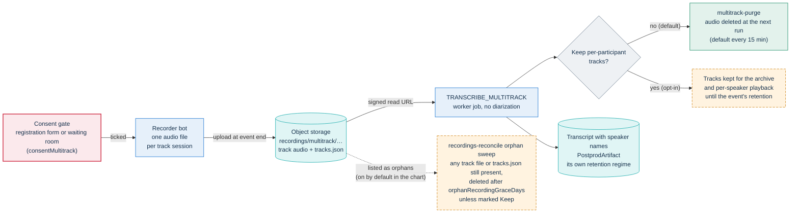
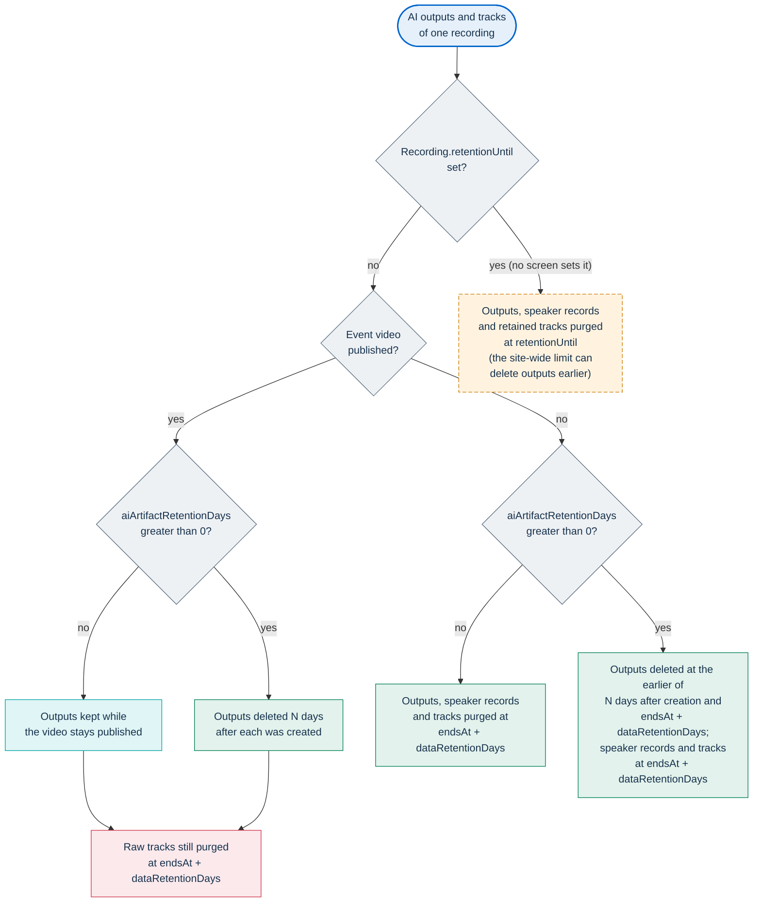
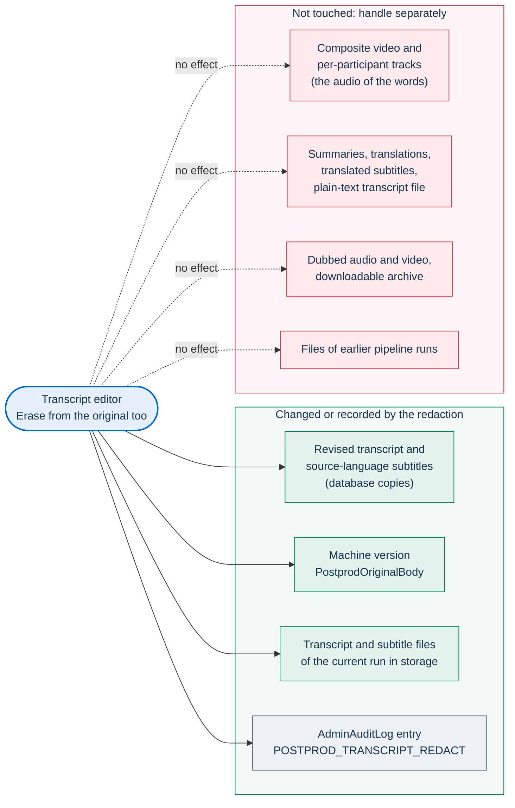

# Recordings, voice data and AI outputs

This page covers the most sensitive data PA Webinar can produce: event
recordings, the isolated voice of each participant, and the texts and
synthetic audio that AI post-production derives from them. It is written for
data protection officers (DPOs), controllers and auditors who need to know
what the platform does before they write a privacy notice or a data protection
impact assessment (DPIA).

It describes the behavior of the code. It is not legal advice: the legal
assessment belongs to the controller of each installation.

| For | See |
|---|---|
| The full personal-data inventory, event retention, the cleanup job, data-subject rights | [Privacy and data protection](../GDPR.md) |
| How the two capture paths work | [Recording](../architecture/recording.md) |
| The AI pipeline: jobs, models, operation | [AI post-production](../POSTPROD.md) |
| The values that turn each capture path on | [Setting up recording](../operations/recording-setup.md) |
| Object keys, providers and signed URLs | [Object storage](../configuration/storage.md) |
| Job schedules and what breaks when a job does not run | [Scheduled and background jobs](../architecture/background-jobs.md) |
| What a privacy notice has to say about all this | [Privacy notice checklist for controllers](privacy-notice-checklist.md) |
| Why the design is what it is | [ADR-013](../adr/013-multitrack-speaker-attribution.md), [ADR-016](../adr/016-in-cluster-ai-postproduction.md) |

## In short

- No audio or video is recorded unless the event asks for it. Composite video
  needs `recordingEnabled`. Per-participant audio also needs
  `aiTranscriptEnabled` and `multitrackRecordingEnabled`. AI processing also
  needs the site-wide switch `aiPipelineEnabled`. The speaking timeline (who
  spoke when, with display names) is collected in every live room.
- Per-participant audio needs its own consent, and that consent blocks entry.
  It is separate from the recording consent, and nobody enters a
  per-participant event without giving it, except moderators.
- The platform stores no voiceprint, speaker embedding or voice model, and
  never compares voices across recordings.
- By default, a participant's isolated audio is deleted soon after it has been
  transcribed. It stays longer when the event is set to keep it (**Keep
  per-participant tracks**), or when transcription never completes. It then
  goes at the event's retention, or earlier through the orphan sweep, provided
  those jobs run.
- The event page labels transcripts, summaries and dubbed audio as
  machine-generated. Subtitles in the player and downloaded files carry no
  marker. The models used for a recording appear on the event page only when
  the pipeline produced a summary.
- Dubbing uses catalog synthetic voices, never a participant's voice. The
  worker picks each voice's gender from a guess based on the speaker's first
  name.
- Every model runs inside the installation; no recording or transcript is sent
  to an external AI service.
- AI outputs follow the event's retention unless the video is published, in
  which case they live as long as the published video.
- Several gaps need operator attention: see [Known limitations](#known-limitations).

## What is captured and when

| Capture | Turned on by | Consent collected | What it contains | Where it is stored |
|---|---|---|---|---|
| Composite video (Jibri) | **Enable video recording** (`recordingEnabled`). A moderator starts it, or it starts on its own with `autoStartRecording` | `consentRecording` at registration, and the full-screen **Recording consent** dialog before the room loads | One MP4 file with the conference video and the mixed audio of everyone | `recordings/` in the recordings storage domain |
| Per-participant audio (recorder bot) | **Per-participant recording (high accuracy)** (`multitrackRecordingEnabled`). The toggle appears only with recording and **Automatic transcription** on. The bot starts when the event goes `LIVE` | `consentMultitrack` at registration, and a blocking checkbox in the waiting room | One audio file per participant and per track session, plus a manifest that names the participant of each file | `recordings/multitrack/<eventId>/<recordingId>/` in the recordings storage domain |
| Speaking timeline | Always, in every live room, recorded or not | No dedicated consent | Who was the dominant speaker and when: the Jitsi endpoint ID and the display name | `CallSession.dominantSpeakerLog` in PostgreSQL |

AI outputs are produced after the event from the composite video or from the
per-participant tracks. That happens when the event has **Automatic
transcription** (`aiTranscriptEnabled`) and the site-wide AI switch is on.

### Composite video

Jibri records the conference as seen by a participant: the video layout and
one mixed audio track. Its retention (the temporary catch-up copy,
publication, `recordingDeleteAfterDays`) is described in
[Privacy and data protection](../GDPR.md). When post-production transcribes a
composite video, it separates the voices with diarization. See
[No voiceprints](#no-voiceprints).

### Per-participant audio

The recorder bot joins the conference on a hidden domain, so it normally does
not appear in the participant list
([details](../architecture/recording.md#the-invisible-bot-hidden-prosody-domain)).
It records **every** remote audio track. There is no per-track consent
filter: the protection is that nobody enters without consenting. Moderators
are exempt from the consent gate, because they configure and control the
recording, and their audio is recorded too.

The recorder starts a new file for each track session. A participant who
rejoins, or whose audio track is removed and added again, produces another
file. Each file is labeled with the display name that person used in the
conference. That name is stored encrypted in the database
(`RecordingTrack.displayName`). The recorder also writes a manifest,
`tracks.json`, next to the audio files, and it holds the same names in plain
text.

A per-participant capture does not raise the in-room **Recording in progress**
banner, which only Jibri controls. Participants learn about it through the
consent gates below.

### Speaking timeline

Every browser in a live room reports Jitsi's dominant-speaker changes to the
portal, whether or not the event is recorded. The log stores the display names
in plain text.

The public transcript endpoint uses the log at read time to put names on the
anonymous voice clusters of a composite recording, so a public transcript can
show names nobody entered by hand. The post-production worker never reads it,
and the names it yields are not stored anywhere. When the cleanup job empties
the log at the event's data retention, a published transcript shows numbered
labels again for the clusters nobody named.

### What participants are told

At registration, an event with per-participant recording adds a separate,
mandatory checkbox (`gdpr.consent.multitrack`), and the registration API
rejects a request without it. The waiting room shows the same text as a gate:
the button to enter stays disabled until it is ticked. The exact texts and
their keys are listed in
[Privacy and data protection](../GDPR.md#consent-texts-shown-to-users). The
sentence that matters most on this page is the promise the text makes:

> The track is temporary and deleted after transcription; it is not used to
> identify or reproduce my voice.

Registrants who consented at registration and open the room in the browser
they registered with are not asked again, and neither are moderators. Speakers
(named `SPEAKER` grants), guests, and registrants who open their personal link
in another browser or on another device are asked in the waiting room
([who is asked](../GDPR.md#in-the-room),
[the gate](../architecture/waiting-room.md#consent-and-transparency-notices)).
A tick given in the waiting room only unlocks the button and is not stored.

When the event uses AI post-production and the site-wide switch is on, the
waiting room also shows an information notice, **AI processing after the
event**. Its text is the site setting **AI notice in the waiting room**
(`aiConsentDisclosure`) for the page's language, or the built-in
`waiting.aiNotice`. It has no checkbox.

These texts give the purpose and exclude biometric use. They do not cover
encryption, the legal basis, retention or rights: the event's privacy notice
(`privacyPolicyUrl` or `privacyPolicyText`) has to say those. The in-room
recording dialog always shows its built-in text and ignores
`recordingConsentText`
([Recording: consent gates](../architecture/recording.md#consent-gates)).

## Voice data

### No voiceprints

Under Article 4(14) GDPR, voice becomes biometric data only when specific
technical processing allows or confirms a person's unique identification. The
design keeps every audio path clear of that use:

- **Composite recordings.** pyannote diarization groups the voices of a
  single recording into anonymous clusters (`SPEAKER_00`, `SPEAKER_01`, …).
  The embeddings it computes stay in the worker's memory and scratch volume,
  and they are gone when the job's pod ends. The output is only a label per
  transcript segment. Names come from people, who map labels in the
  administration area, or from the speaking timeline. They never come from the
  voice.
- **Per-participant recordings.** No diarization runs. Each track already
  belongs to one participant, and the name is the display name that person
  used in the conference, not something derived from their voice.
- **Dubbing.** The speech synthesizer reads translated text. No participant
  audio goes into it. The choice of voice uses the speaker's first name, not
  their voice (see [Dubbing without cloning](#dubbing-without-cloning)).
- **Storage.** The `Speaker` model has no field for voice features, and no
  code compares voices across recordings or events.

The design treats voice as the input of a transcription, not as a means of
identification, so it does not treat the processing as Article 9 biometric
processing. The extra safeguards on isolated tracks exist because a
single-speaker recording is still highly sensitive. Whether this reasoning
holds for a given installation is for the controller to confirm in its DPIA.

### Tracks are intermediate

A per-participant track exists to be transcribed. After that, only the
attributed text is needed.

The `multitrack-purge` job (`app/src/app/api/cron/multitrack-purge/route.ts`)
runs every 15 minutes by default (`infra/helm/pa-webinar/templates/cronjob-multitrack-purge.yaml`).
It selects the tracks whose audio is still present and whose recording meets
all three conditions:

- a `TRANSCRIBE_MULTITRACK` job has finished (`DONE`) at least once;
- no transcription re-run or archive job that reads the tracks is pending or
  running;
- the event does not keep its tracks.

For each selected track, it deletes the audio file and stamps `audioPurgedAt`.
The database row stays, with its encrypted name and timing, because the
transcript's attribution refers to it. The `cleanup` job deletes those rows
when the event's data retention expires.

The purge job never selects a track whose transcription never finishes. That
happens when the AI switch is off, when every track is silent (the recording is
then marked `POSTPROD_FAILED`) or when the job fails for good. Those tracks
wait for the event-bound retention pass described in
[Retention regimes](#retention-regimes), unless the orphan sweep deletes them
first (see [Operator responsibilities](#operator-responsibilities)).

### Keeping tracks

**Keep per-participant tracks** (`retainParticipantTracks`, badge **Extends
retention**) appears in the event wizard only when per-participant recording is
on. It serves two features of the administration area:

- **Per-speaker playback:** the mixed recording plays with each participant's
  track at its offset;
- **Downloadable archive:** an on-demand `ARCHIVE` job muxes the composite
  video, one audio track per participant labeled with the name, and the
  subtitles into one MKV file.

Only staff who manage the event can use them: administrators, and the
organizer who created it. The audio and archive links are signed URLs that
expire after 120 minutes
(`app/src/app/api/admin/postprod/recordings/[id]/tracks/route.ts`). Nothing
from this feature appears on public pages.

The purge job keeps retained tracks until the recording's own
`Recording.retentionUntil`, but no screen or API sets that date. In practice,
retained tracks are deleted by `postprod-retention` when the event's data
retention expires (`endsAt` plus `dataRetentionDays`), whether or not the
video is published. The orphan sweep can delete them earlier (see
[Operator responsibilities](#operator-responsibilities)). The wizard warns
whoever sets the option that it "extends retention of sensitive personal data
(isolated voice) until the event's retention deadline".

### The consent text and retained tracks

The consent checkbox says the track "is temporary and deleted after
transcription", and it says the same when **Keep per-participant tracks** is
on. There is no alternative text for retained tracks. This is a product
inconsistency. Until it is fixed, a controller who enables retention has to
say so in the event's privacy notice and in its own communication to
participants.

### Where voice data lives and who can reach it

| Item | Where | Who can read it | Protection |
|---|---|---|---|
| Track audio | Object storage, `recordings/multitrack/<eventId>/<recordingId>/audio/` | The recorder bot writes each file through its own signed upload URL. The worker reads the files through signed URLs valid for its job lease. Staff play retained tracks | Never public. At-rest encryption is the storage provider's |
| `tracks.json` | Same prefix | Anyone allowed to list the bucket | Display names in plain text |
| Track rows (`RecordingTrack`) | PostgreSQL | The portal | Display name encrypted |
| Downloadable archive | Object storage, `postprod/…/archive.mkv` | Staff who manage the event, through a signed URL | Never public |
| Mixed audio | Inside the composite MP4 | Anyone who reaches the waiting room, guests included, through the temporary catch-up copy (24 hours); the public, once the video is published | See [Privacy and data protection](../GDPR.md) |

The worker receives each participant's name in clear text through the internal
API, because it writes names into the transcript. Signed-URL mechanics are in
[Object storage](../configuration/storage.md).

### Operator responsibilities

- **The purge jobs belong to post-production.** The chart renders
  `multitrack-purge` only when `postprod.enabled` is true, and
  `postprod-retention` only when `postprod.enabled` and
  `postprod.retention.enabled` (on by default in
  `infra/helm/pa-webinar/values.yaml`) are both true. An installation with
  `recorder.enabled` but without post-production captures tracks that no purge
  job deletes. Only the orphan sweep removes them, after its grace period, and
  only where `recordings-reconcile` runs (see **Participant tracks without the
  post-production pipeline** in the [roadmap](../ROADMAP.md)).
- **Docker Compose runs neither purge job, nor the orphan sweep.** On a single
  VM with the `recorder` profile, schedule `postprod-retention` yourself: it is
  the job that deletes tracks at the event's retention. `multitrack-purge` has
  nothing to act on without AI post-production
  ([how](../architecture/background-jobs.md#docker-compose)).
- **The orphan sweep reaches every track file.** `recordings-reconcile` lists
  every object under `recordings/` and knows only the composite video
  (`Event.recordingUrl`, `CallSession.recordingUrl`,
  `CallSession.recordingFilename`); no track key is in its known set. Every
  track file still in storage (awaiting transcription, never transcribed, or
  retained) and every `tracks.json` appears in the **Orphans** tab and is
  deleted after `orphanRecordingGraceDays` (default in
  `app/prisma/schema.prisma`; `0` turns the automatic deletion off) unless an
  administrator marks it **Keep**. This happens even without post-production,
  because `recordings-reconcile` is on by default
  (`cronjobs.recordingsReconcile.enabled` in
  `infra/helm/pa-webinar/values.yaml`) and does not depend on
  `postprod.enabled`. The sweep deletes the files but does not update
  `audioPurgedAt`.
- **Deleting an event or a call session deletes rows, not files.** Deleting an
  event removes its recordings, tracks, speaker records and AI outputs from
  the database by cascade, and every file stays in the bucket. Deleting a call
  session from the event's management page (the delete control next to the
  session's video, confirmed in the **Delete session** dialog) removes that
  session's recording tree the same way and deletes only the session's
  composite video file. Track files under `recordings/` later appear in
  **Orphans**; files under `postprod/` are never removed.

## AI outputs

### What the pipeline produces

From a composite video or a set of tracks, the pipeline produces a transcript
(structured JSON, source-language subtitles, plain text), a waveform for the
editor, and, when the event asks for them, a summary (Markdown and a
structured version), translations with translated subtitles, and dubbed audio.
It can also build the downloadable archive described above. The jobs, models
and storage layout are in [AI post-production](../POSTPROD.md).

The transcript carries names: the display names of per-participant tracks, or
the names mapped to diarization labels. The language model that writes the
summary and the translations reads that transcript. All of this happens inside
the installation.

### Marking machine-generated content

How the pipeline marks its outputs (the `isSynthetic` column, the
**AI-generated content** badge and disclaimer, the dubbing banner, the
watermark and the waiting-room notice) is described in
[AI post-production](../POSTPROD.md#transparency-ai-act-article-50). The gaps
that matter for a privacy notice:

- the disclaimer lives in the interface only: subtitles in the player and the
  downloaded files (`.txt`, `.srt`, `.vtt`, `.md`) carry no AI marker;
- the public transparency panel appears only on events with a summary (see
  [Processing transparency](#processing-transparency));
- the panel names a fixed language-model vendor and license, constants in
  `app/src/lib/ai/pipeline-snapshot.ts` that match only the default model;
- the dubbing watermark is best effort (see
  [Dubbing without cloning](#dubbing-without-cloning)).

### Processing transparency

When the last job of a run finishes successfully, the portal saves a
`Recording.pipelineSnapshot` built from the outputs actually produced
(`app/src/lib/ai/pipeline-snapshot.ts`). If the last job to finish fails, no
snapshot is written for that run, and a snapshot from an earlier run, if any,
stays in place. The snapshot names the engines and models, the languages, the
time processing completed and the pipeline version, and it lists the speakers
with their display names and speaking time. The full description is in
[AI post-production](../POSTPROD.md#transparency-ai-act-article-50).

Three points matter for privacy:

- **It is a record of the run.** Later edits, such as renaming or rectifying
  a speaker, do not change the names it holds, and no purge clears it.
- **It is public with the outputs.** The public transcript endpoint returns
  it, speaker names included, whenever the outputs are public.
- **The panel needs a summary.** The event page shows it under **AI processing
  transparency**, inside the summary card above the video. That card appears
  only when the pipeline produced a structured summary, so an event without
  **Summary and chapters**, or whose summary failed, publishes no transparency
  panel. The administration area always shows it.

This is the platform's answer to the transparency obligations of Article 50 of
the AI Act. Whether it is sufficient for a given use is for the deployer to
assess.

### Dubbing without cloning

**Audio dubbing** (`aiDubbingEnabled`) needs translation to be on. The worker
reads the translated subtitles and speaks them with Piper voices from a
catalog that ships inside the worker image. Voice cloning is not implemented.

Voices are assigned in order of speaking time, with no link to the speaker's
own voice. The worker also matches each voice's gender to a gender guessed
from the speaker's first name (`infra/ai/worker/name_gender.py`: a built-in
list of Italian first names, then the `gender_guesser` library). A speaker
with no name, or with a name the guess cannot place, gets the next unused
voice of any gender. The guess is never stored in the database, but the
worker's log records the first-name-to-gender map of each dubbing job. The
site settings describe the assignment under **Editorial line on voice**
without mentioning the gender guess.

The worker then embeds an inaudible AudioSeal watermark in the dubbed audio
and records `watermarkType` on the output. Watermarking is best effort. If the
AudioSeal model is missing from the model cache or the step fails, the audio
is published without a watermark and `watermarkType` stays empty. Setting
`AI_WATERMARK=0` on the worker turns watermarking off.

### Data sovereignty

The allowed engines are a closed list in `app/src/lib/ai/providers.ts`, and
all of them run inside the installation's cluster. No recording, track or
transcript leaves the installation except to its object storage. Missing model
weights can still be fetched from the internet (weights only, never data);
seed them as described in
[AI post-production](../POSTPROD.md#data-sovereignty), which also explains
where the rule is enforced. See
[ADR-016](../adr/016-in-cluster-ai-postproduction.md).

### Who can see AI outputs

- **The public** can reach the transcript, subtitles, summaries, dubbed audio,
  the downloads (`.txt`, `.srt`, `.vtt`, `.md`) and the pipeline snapshot only
  when all four conditions hold (`app/src/lib/ai/access.ts`):
  - the AI switch is on;
  - the event's video is published (`recordingPublished`);
  - the post-event page is public (`postEventPublic`);
  - `postEventPublicUntil`, when set, is still in the future.

  Otherwise every public AI endpoint answers `404`. Public transcripts show
  speaker names. In the transcript panel, an unnamed cluster gets a name from
  the speaking timeline while the log exists, or else a numbered label
  (`Partecipante N`, in Italian whatever the page language). In the downloads
  and subtitles, an unnamed cluster keeps its raw label (`SPEAKER_00`).
- **Staff who manage the event** (administrators and the organizer who created
  it) see everything in the administration area. That includes raw
  diarization labels, retained tracks and the archive.

## Retention regimes

Three kinds of data follow different clocks:

- **Raw track audio:** deleted after transcription, or at the event's
  retention when kept, or earlier by the orphan sweep.
- **AI outputs:** artifacts, their machine versions, speaker records and job
  payloads.
- **The composite video:** owned by [Privacy and data protection](../GDPR.md).

Two jobs enforce the first two. `multitrack-purge` is described above.
`postprod-retention` (`app/src/app/api/cron/postprod-retention/route.ts`) runs
daily by default (`postprod.retention.schedule` in
`infra/helm/pa-webinar/values.yaml`).

Tracks that are not retained are deleted after transcription on every branch;
the diagram shows when the remaining ones go. The orphan sweep can delete any
track file earlier (see [Operator responsibilities](#operator-responsibilities)).

### Event-bound purge

This is the default. When `Recording.retentionUntil` is empty, the event is
`ENDED` or `ARCHIVED`, and its video is not published, the recording's outputs
are purged once `endsAt` plus `dataRetentionDays` has passed. The default of
`dataRetentionDays` is in `app/prisma/schema.prisma`. The cleanup job archives
the event but never deletes AI outputs, so this pass is what enforces the
event's retention on them. An event that was never ended reaches this pass
once the cleanup job has archived it, after its retention.

### Published recordings

A published video keeps its outputs: its subtitles, transcript and dubbing are
its accessibility layer, and they live as long as `recordingPublished` stays
true. Its raw tracks are still purged at `endsAt` plus `dataRetentionDays`,
because isolated voice is never a public asset.

When a published video reaches its own retention (`recordingDeleteAfterDays`,
counted from publication), the cleanup job deletes it and unpublishes it. The
next `postprod-retention` run then purges the outputs, provided the event's
retention has passed. A video published without its own retention keeps its
outputs as long as it stays published. A recording listed in the video library
but not published gets no exemption.

### Site-wide limit: `aiArtifactRetentionDays`

**Artifact retention (days)** in the post-production site settings defaults to
`0`, which means no limit (`app/prisma/schema.prisma`). With a value N greater
than zero, the job deletes every artifact created more than N days ago,
published or not, whatever the recording's regime. It deletes the artifact's
file, its row and, through the foreign key, its machine version.

This pass deletes artifacts only. Speaker records and job payloads wait for
the event-bound or per-recording purge, so on a published video they stay as
long as the video. Tracks follow their own rules, described above. The value
can therefore shorten retention but never extend it. The field's help text
says a positive value keeps artifacts "even after the event is closed", which
is not what the code does for unpublished recordings.

### Per-recording date: `Recording.retentionUntil`

Both jobs honor this date, and the administration area displays it. No screen
or API sets it, so today it can only be written directly in the database. When
set, it replaces the event-bound and published regimes for its recording. The
recording is purged on that date whatever the event's retention or the video's
publication, so the date can also be later than the event's retention. For
retained tracks, the purge job waits for this date. The site-wide limit still
applies to the recording's artifacts.

### What a purge deletes and what it leaves

A recording-level purge (event-bound or `retentionUntil`) deletes:

- the output files and their rows, with their machine versions;
- the `Speaker` records: names, and links to address-book persons;
- the track files and rows;
- the job payloads, replaced by `{ "scrubbed": true }`, and the last error
  messages.

It then marks the recording `ARCHIVED`. The help text of **Artifact retention
(days)** says its deletion includes speaker names and job payloads. Only these
recording-level purges delete them; the site-wide limit does not.

A purge leaves:

- the `Recording` row, including `pipelineSnapshot`, which holds speaker
  names;
- the admin audit log entries `POSTPROD_SPEAKER_MAP`, which hold each name
  given to a speaker label and are never deleted;
- the `PostprodJob` rows, with kind, status and timing;
- files from earlier pipeline runs;
- `tracks.json`;
- the composite video, which the cleanup job handles.

Neither job writes to the GDPR audit log: the counts appear only in the job's
own log. Both jobs work in bounded batches, so a large backlog drains over
several runs. They postpone a recording while a job still reads its tracks,
and they do nothing when recording storage is not configured.

## Editing and erasure

### Machine version and revised version

Staff correct transcripts in the transcript editor. At the first correction,
the platform copies the transcript as the machine produced it into
`PostprodOriginalBody`. It copies the encrypted body as is, together with the
model that produced it. From then on both versions exist, and **Show original
text** displays the machine's line under each corrected one. For a public body's
minutes, the two must stay distinguishable. Only the first correction is
copied; later ones do not create a history.

If the admin audit log already holds corrections for the recording when the
copy is taken, the copy is flagged **Origin not certain**
(`certainMachineOrigin`), because it cannot be proven to be machine text. A
machine version is deleted with its artifact. When the pipeline runs again,
the new output is machine text again and the old machine version is
discarded. The summary editor keeps no machine version: it overwrites the
summary.

An ordinary correction changes the database copies of the transcript and its
source-language subtitles only. The files in object storage keep the machine
text until an erasure rewrites them, and every output generated later from
them (a translation language added afterwards, a new archive) starts from that
stored text.

### Erasing a passage

An ordinary correction must not touch the machine version, or the two
versions would no longer be comparable. To remove a person's words for good,
the editor has a separate mode: **Erase from the original too**, saved with
**Save and erase from the original**. It applies the same line changes to the
machine version of the transcript and of its source-language subtitles. It
rewrites the stored transcript and subtitle files of the current run with the
revised version, and writes a `POSTPROD_TRANSCRIPT_REDACT` entry to the admin
audit log instead of `POSTPROD_TRANSCRIPT_EDIT`. Only lines whose text changed
are rewritten. If rewriting the stored files fails, the editor says so and the
removal can be repeated.

Erasure works on text. The spoken words stay in the recording itself: in the
composite video, which is public once published, and in the per-participant
tracks while they exist. Removing them means editing or unpublishing the
video.

Public pages and downloads read the database copies, so the redacted source
transcript is what visitors see from then on. The outputs derived from it are
not regenerated:

- **Summaries, translated ones included:** can be edited by hand in the
  summary editor, per language. That changes the database copy only; the
  stored file keeps the old text.
- **Translated subtitles:** have no editor. Running the pipeline again starts
  over from the audio and would put the passage back.
- **Dubbed audio and video, the archive, and the stored plain-text transcript:**
  keep the passage until they are purged.

### Data-subject requests

The self-service privacy pages (`/en/privacy/my-data`,
`/it/privacy/i-miei-dati`; see
[Privacy and data protection](../GDPR.md#self-service-access-and-erasure)) do
not reach recordings or AI outputs:

- the export lists registrations and their consent flags, including
  `consentMultitrack`, but no transcripts, speaker records or tracks;
- the erasure deletes registrations and what depends on them, not recordings,
  tracks or AI outputs.

Requests about recordings and transcripts therefore go to the controller, who
handles them in the administration area:

| Right | How to act on it |
|---|---|
| Access | Read the transcript in the transcript editor and provide a copy |
| Rectification | Correct a line, reassign a segment to another speaker, or rename a speaker label. A rename writes a `POSTPROD_SPEAKER_MAP` entry to the admin audit log that holds the new name and is never deleted. A correction changes the database copies only: outputs generated later (an added translation language, a new archive) start from the stored machine text, unless the lines were also erased from the original |
| Erasure of words | Use **Erase from the original too**, then handle the derived outputs listed above and, if needed, the video |
| Erasure of a voice track | No control deletes a single track. **Delete session** removes the recording's rows but leaves its track and output files in storage, so delete those in storage as well. Otherwise tracks go at the next purge or orphan sweep, or have to be deleted in storage |

Once a track has been purged, the audio no longer exists. The attribution
inside the transcript remains, and a request about it is handled on the
transcript, not on the track.

## Legal bases as designed

The platform does not encode a legal basis: it provides the gates, the
notices and the records. This is the design's assumption. The controller's
privacy notice states the actual basis.

| Processing | Basis the design assumes | Evidence the platform keeps |
|---|---|---|
| Recording the event and producing its transcript, summary, translations and dubbing | Art. 6(1)(b): processing needed to deliver the event as announced, with the notice shown before joining | The event's flags. `Recording.consentSnapshot` records the event's AI and per-participant settings when the recording is queued (`app/src/lib/ai/enqueue.ts`). It is evidence only: no code reads it, so it does not restrict what happens to outputs after a setting changes |
| Per-participant track | Art. 6(1)(a): explicit consent, separate from the recording consent | `Registration.consentMultitrack`, deleted with the registration at the event's retention. A `CONSENT_RECORDED` entry in the GDPR audit log, with the flags but no identity, which is kept. Waiting-room ticks leave no record |
| Keeping tracks beyond transcription | The same consent, plus the privacy notice | Only the event flag. `consentSnapshot` does not include **Keep per-participant tracks** or dubbing |
| Per-participant AI choices (transcript, summary, translation) | Art. 6(1)(a), granular | `Registration.aiConsentTranscript`, `aiConsentSummary` and `aiConsentTranslation` exist in the schema, but no code reads or writes them, and no screen asks for them |

Points for the controller's assessment:

- A public body often relies on Art. 6(1)(e), a task in the public interest,
  rather than on (b). Nothing in the platform depends on which one is chosen.
- Registration is refused without the recording consent and, on
  per-participant events, without the per-participant consent. Consider
  whether a consent that conditions participation is freely given in your
  context, or whether another basis fits better, with the gate kept as
  transparency.
- Dubbing infers a gender from each speaker's first name. Consider whether
  that inference, and its presence in the worker's log, needs to be disclosed.

## Encryption at rest

| Data | Store | At rest |
|---|---|---|
| Inline copies of text outputs (transcripts, subtitles, summaries up to the size limit in `app/src/lib/ai/schemas.ts`) | `PostprodArtifact.inlineBody` | AES-256-GCM with `PII_ENCRYPTION_KEY` (`encryptPII`) |
| Machine versions | `PostprodOriginalBody.body` | The same ciphertext, copied without decrypting |
| Track display names | `RecordingTrack.displayName` | Encrypted |
| Speaker names | `Speaker.displayName` | Plain text |
| Pipeline snapshot | `Recording.pipelineSnapshot` | Plain text JSON, including speaker names |
| Speaker renames | `AdminAuditLog.details` (`POSTPROD_SPEAKER_MAP`) | Plain text JSON, including the name, never deleted |
| Speaking timeline | `CallSession.dominantSpeakerLog` | Plain text, emptied at the event's retention |
| Every output file, track audio, `tracks.json`, composite video | Object storage | The storage provider's server-side encryption. Access through signed URLs |

Each output also exists as a file in object storage. The encrypted database
copy is an extra copy for fast reads, not a replacement for the file.
Key handling and the secrets map are in
[Security architecture](../architecture/security.md) and the
[Configuration reference](../CONFIGURATION.md).

## Known limitations

Consent and transparency:

- **The consent text promises deletion even when tracks are kept.**
  `gdpr.consent.multitrack` says the track is deleted after transcription
  whatever **Keep per-participant tracks** says.
- **Waiting-room consent is not recorded.** The waiting-room checkbox only
  unlocks the button; no row or audit entry records the consent.
- **Per-participant AI consent is not implemented.** The `aiConsent*` columns
  of `Registration` are unused, whatever their schema comment says.
- **The transparency panel is public only on events with a summary.** Without
  a structured summary the event page shows no panel, although the public
  transcript endpoint still returns the snapshot.
- **A run whose last job fails writes no snapshot.** The panel then shows the
  previous run's snapshot, or nothing.
- **The transparency panel names a fixed LLM vendor and license.** They are
  constants in `app/src/lib/ai/pipeline-snapshot.ts` and match only the
  default model. The model ID is the real one.
- **Subtitles and downloaded files are not marked.** Subtitles in the player
  and downloaded files (`.txt`, `.srt`, `.vtt`, `.md`) carry no AI marker; the
  disclosure comes from the transcript panel and the transparency panel.
- **The watermark is best effort.** Dubbed audio can be published without it.
- **Dubbing guesses gender from first names.** The **Editorial line on voice**
  text does not mention it, and the worker's log records the guesses.
- **The speaking timeline has no dedicated consent.** It is collected in every
  live room and stored with plain-text names until the event's retention.

Retention and deletion:

- **`Recording.retentionUntil` cannot be set from the application.** Retained
  tracks and the per-recording regime depend on it.
- **The help text of Artifact retention (days) overstates the setting.** The
  setting can only shorten retention.
- **The site-wide limit deletes artifacts only.** It leaves speaker records
  and job payloads in place.
- **Speaker names outlive every purge.** `pipelineSnapshot` is never cleared,
  and the `POSTPROD_SPEAKER_MAP` entries of the admin audit log are never
  deleted.
- **Files of earlier pipeline runs are never deleted.** After a re-run, the
  previous run's files under `postprod/` are no longer referenced by any row,
  and no job removes them.
- **Track files show up as orphans.** The orphan sweep lists every track file
  and `tracks.json`, retained or still awaiting transcription, and deletes it
  after the grace period unless an administrator marks it **Keep**.
- **`tracks.json` is removed only by the orphan sweep.** Neither purge job
  deletes it.
- **The purge jobs exist only with `postprod.enabled`.** On Docker Compose,
  neither purge job nor the orphan sweep runs.
- **Deleting an event or a call session leaves files in storage.** Deleting a
  session removes only its composite video file; its track and output files
  stay, and `postprod/` files are never swept.
- **AI and track purges do not appear in the GDPR audit log.**

Data-subject rights:

- **Self-service export and erasure exclude recordings, tracks and AI
  outputs.**
- **Corrections do not reach the stored files.** Outputs generated after a
  correction start from the machine text, unless the lines were erased from
  the original.
- **Redaction does not reach derived outputs or the recording.** No control
  regenerates translations or dubbing from a revised transcript, and the
  spoken words stay in the video and the tracks.

## Related pages

- [Privacy and data protection](../GDPR.md): the data inventory, event retention and self-service rights.
- [Recording](../architecture/recording.md): the capture paths, consent gates and recording lifecycle.
- [AI post-production](../POSTPROD.md): the pipeline, its models and its administration pages.
- [Setting up recording](../operations/recording-setup.md): the values that turn each path on.
- [Object storage](../configuration/storage.md): key layout, signed URLs and who deletes what.
- [Runtime settings](../configuration/runtime-settings.md): the post-production site settings.
- [Scheduled and background jobs](../architecture/background-jobs.md): `multitrack-purge`, `postprod-retention`, `cleanup` and `recordings-reconcile`.
- [Privacy notice checklist for controllers](privacy-notice-checklist.md): what to disclose.
- [ADR-013](../adr/013-multitrack-speaker-attribution.md): per-participant recording for speaker attribution.
- [ADR-016](../adr/016-in-cluster-ai-postproduction.md): in-cluster AI post-production.
