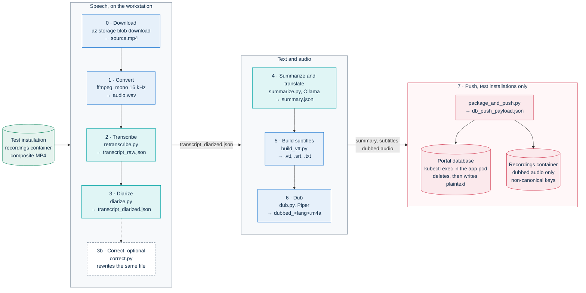

# Running post-production off-cluster (development tool)

This folder holds scripts that run the stages of PA Webinar's
[AI post-production](../../../docs/POSTPROD.md) pipeline on a developer
workstation with an NVIDIA GPU, and then write the results into a test
installation. Use it to try a model, a prompt or a voice on one recording, or
to compare its output with the in-cluster worker, without a GPU node pool.

The tool is not part of the worker image (`../Dockerfile.worker` copies only
`worker/`), and no workflow builds or tests it. For the production code path,
read the [worker README](../worker/README.md).

> [!WARNING]
> **Test and development data only.** Never run this tool on a real event's
> recording, and never point the push at an installation that holds real
> participants' data.
>
> - **The push writes personal data in plain text.** Transcript, subtitles and
>   summaries go into `PostprodArtifact.inlineBody` without encryption at rest.
>   The portal reads them anyway, because its decryption helper falls back to
>   plain text.
> - **The push deletes what the recording already has.** For the target
>   recording it deletes every post-production artifact, including the
>   revised versions (manual corrections) and the saved machine versions
>   (`PostprodOriginalBody`) of the transcript, every `Speaker` row (with its
>   address-book link) and every `PostprodJob`.
> - **The push publishes and switches on.** It sets the event's
>   `recordingPublished`, so the video becomes public, and the transcript,
>   summary, subtitles and dubbed audio become public too wherever the event's
>   post-event page is public (`postEventPublic`). It also sets the site-wide
>   `aiPipelineEnabled` switch. That switch gates public access to the AI
>   outputs of every event, so outputs that were hidden become visible again
>   on every event whose recording and post-event page are public. It also
>   lets the orchestrator start any jobs already waiting in the queue, which
>   can wake the GPU node pool, and it lets the automatic paths enqueue work
>   for events that opt in.
> - **Storage keys are non-canonical.** They do not follow
>   `app/src/lib/ai/paths.ts`, and no file is uploaded behind the text rows'
>   keys ([What the push writes](#what-the-push-writes)).
> - **The recording leaves the cluster.** The workstation downloads the media
>   and processes it outside the installation. That contradicts the
>   [data sovereignty](../../../docs/POSTPROD.md#data-sovereignty) rule and
>   what the platform's privacy texts tell participants.
> - **Nothing checks the target.** The push writes into whatever installation
>   runs in `K8S_NAMESPACE`, and uploads to whatever `STORAGE_ACCOUNT` names,
>   without checking that the two belong together or that `EVENT_ID` is the
>   recording's event.

## Off-cluster flow



Teal steps use the GPU and blue steps run on the CPU. The dashed step is
optional; it also calls the language model, like step 4. Red marks the step
that writes into an installation. Every step reads and writes files in this
folder, so run every command from here.

## Prerequisites

- **An NVIDIA GPU with about 24 GB of VRAM.** The language model served by
  Ollama is the largest consumer. faster-whisper on the GPU also needs the
  CUDA 12 cuBLAS and cuDNN 9 libraries (see its installation notes).
- **Python 3.12, [uv](https://docs.astral.sh/uv/), `ffmpeg` and
  [Ollama](https://ollama.com/)**, with `ollama serve` running.
- **A large enough Ollama context.** Step 4 sends up to 30,000 characters of
  transcript in one request, and the OpenAI-compatible endpoint the scripts
  call cannot set the context length per request. Ollama's default depends on
  its version and on the available VRAM (`ollama serve --help` shows it).
  Start Ollama with a larger context, for example
  `OLLAMA_CONTEXT_LENGTH=16384 ollama serve`, or set the variable in the
  service that runs it. With a shorter context, Ollama can cut the prompt
  without returning an error, and the summary covers even less of the event.
- **Azure storage only.** Step 0 and the dubbed-audio upload use the
  `az` CLI with the storage account key. The scripts assume the recordings
  container is named `recordings`, the default of `RECORDING_AZURE_CONTAINER`
  ([Object storage](../../../docs/configuration/storage.md)). An installation
  on S3-compatible storage cannot use them as written.
- **A Helm installation and `kubectl`.** The push copies a script into the app
  pod and runs it there, so you need `get` and `list` on `pods` and `create`
  on `pods/exec` in the target namespace (`kubectl cp` runs through exec). It
  has no Docker Compose variant.
- **An existing recording with a Jibri composite.** Its `Recording.blobKey`
  has the form `recordings/<room>_<timestamp>.mp4`, not
  `recordings/multitrack/...`: a multitrack recording keeps that placeholder
  key until a Jibri mix arrives. The input is the composite MP4;
  per-participant tracks are not supported. The push updates the `Recording`
  row and fails with `recording not found` when there is none. That check
  runs after the dubbed audio has been uploaded, so a wrong `RECORDING_ID`
  leaves those files in storage.
- **Italian speech.** `retranscribe.py` fixes the language to `it`, and the
  summary and translation prompts assume an Italian source.

## One-time setup

```sh
cd infra/ai/local-out
uv venv --python 3.12 .venv
source .venv/bin/activate
uv pip install "torch>=2.7" torchaudio --index-url https://download.pytorch.org/whl/cu128
uv pip install faster-whisper soundfile speechbrain scikit-learn requests piper-tts

# Piper voices, flat in piper-voices/ (dub.py groups them by language prefix).
# These are the en and fr voices baked into the worker image.
mkdir -p piper-voices
for v in en/en_US/lessac/medium/en_US-lessac-medium en/en_US/amy/medium/en_US-amy-medium \
         fr/fr_FR/siwis/medium/fr_FR-siwis-medium fr/fr_FR/tom/medium/fr_FR-tom-medium; do
  for ext in onnx onnx.json; do
    curl -fsSL -o "piper-voices/$(basename "$v").$ext" \
      "https://huggingface.co/rhasspy/piper-voices/resolve/main/$v.$ext"
  done
done

# The language model used in the examples below
ollama pull mistral-small3.2:24b
```

- Quote `"torch>=2.7"`: unquoted, the shell reads `>` as a redirection.
- `gender-guesser` is optional. When it is installed, `dub.py` uses it to
  guess the gender of first names that are not in the worker's Italian table.
- On first use, faster-whisper downloads `large-v3` and SpeechBrain downloads
  `speechbrain/spkrec-ecapa-voxceleb` (cached in `/tmp/ecapa-cache`) from
  Hugging Face. Only model weights are downloaded; no audio or text is sent
  anywhere.
- `.gitignore` keeps the media, the voices, the virtual environment and every
  intermediate output out of git.

## Per-event flow

Set the variables once per event. Values in angle brackets are placeholders.

```sh
export AZURE_KEY=<storage-account-key>      # also used by the push
export STORAGE_ACCOUNT=<storage-account>
export RECORDING_ID=<recording-id>          # Recording.id
export EVENT_ID=<event-id>                  # the recording's Event.id
export K8S_NAMESPACE=<namespace>            # namespace of the app pod
export LLM_MODEL=mistral-small3.2:24b       # the two LLM scripts have different defaults
export PIPELINE_VERSION=<run-label>         # shown to viewers under AI processing transparency

# 0) Download the composite MP4. <recording-blob-key> is Recording.blobKey,
#    of the form recordings/<room>_<timestamp>.mp4 (never recordings/multitrack/...)
az storage blob download --account-name "$STORAGE_ACCOUNT" --account-key "$AZURE_KEY" \
  --container-name recordings --name "<recording-blob-key>" --file source.mp4

# 1) Mono 16 kHz audio
ffmpeg -y -i source.mp4 -ar 16000 -ac 1 audio.wav

# 2) Transcribe, with an event-specific prompt (names are personal data: keep them out of the code)
INITIAL_PROMPT="<title and context>. Speakers: <Speaker 1>, <Speaker 2>." python retranscribe.py

# 3) Diarize (EXPECTED_SPEAKERS is optional); 3b) optionally correct spelling, names and acronyms
EXPECTED_SPEAKERS=2 python diarize.py
GLOSSARY_NAMES="<Speaker 1>,<Speaker 2>" python correct.py

# 4) Summary, speaker-name guesses and translations
TARGET_LANGS=en,fr python summarize.py

# 5) Subtitles and text files
python build_vtt.py

# 6) Dubbed audio for every target language that has a voice
python dub.py

# 7) Push into the test installation (read "What the push writes" first)
python package_and_push.py
```

| Step | Reads | Writes |
|---|---|---|
| 0 Download | the blob `Recording.blobKey` | `source.mp4` |
| 1 Convert | `source.mp4` | `audio.wav` |
| 2 `retranscribe.py` | `audio.wav` | `transcript_raw.json` |
| 3 `diarize.py` | `audio.wav`, `transcript_raw.json` | `transcript_diarized.json` |
| 3b `correct.py` | `transcript_diarized.json` | the same file, with `text_raw` on changed segments |
| 4 `summarize.py` | `transcript_diarized.json` | `summary.json` |
| 5 `build_vtt.py` | `transcript_diarized.json`, `summary.json` | `transcript_<lang>.vtt` and `.srt` for the source and each target, `transcript_pretty.txt`, `transcript_named.json` |
| 6 `dub.py` | `summary.json`, `transcript_diarized.json`, `piper-voices/` | `dubbed_<lang>.wav` and `.m4a` |
| 7 `package_and_push.py` | the files above | `db_push_payload.json`, the database, one blob per dubbed language |

`diarize.py` rebuilds `transcript_diarized.json` from `transcript_raw.json`,
so running it again discards the corrections of step 3b. Run `correct.py`
again after it.

After the push, the result shows in the recording's page in the
administration area. It shows on the public event page (for example
`https://webinar.example.com/en/events/<slug>`) only when the event's
post-event page is public.

## What each stage does

### Transcription: `retranscribe.py`

faster-whisper `large-v3` in float16 on CUDA, beam size 5, VAD filter and
Whisper's own word timestamps. `INITIAL_PROMPT` steers spelling of names and
acronyms; without it, the script uses a generic Italian prompt. Segments with
`avg_logprob` below -1.0 or `no_speech_prob` above 0.6 are dropped as likely
hallucinations, the same thresholds as the worker. Both scores are kept on the
remaining segments.

### Diarization: `diarize.py`

The script does not use pyannote, so it needs no Hugging Face token. It
computes a SpeechBrain ECAPA-TDNN embedding for each segment, extending
segments shorter than one second around their center, and groups them by
agglomerative clustering on cosine distance. The number of speakers is the
best silhouette score between 2 and 6, or `EXPECTED_SPEAKERS`, capped at half
the number of embedded segments. Except for recordings with fewer than four
embedded segments, the result has at least two labels, even with
`EXPECTED_SPEAKERS=1`. Segments too short to embed inherit the previous label.
Map wrong or split labels to the right names in the recording page after the
push.

### Correction: `correct.py`

An optional LLM pass that fixes only spelling, proper names and the acronyms
in a glossary: a built-in technical glossary in the script plus
`GLOSSARY_NAMES`. It sends 40 numbered lines per request at temperature 0 and
keeps the original line when a batch fails or a line is missing. The
in-cluster job handlers have no such pass.

### Summary, names and translation: `summarize.py`

- **Summary.** One JSON-mode request over the first 30,000 characters of the
  transcript, compacted into speaker turns: overall summary, key decisions,
  action items and topics with a start time. Longer events are summarized
  only in part; the in-cluster worker sends the whole transcript.
- **Speaker names.** A second request guesses a real name for each label from
  the first 15,000 characters. The guesses become `Speaker.displayName` and
  appear in the published subtitles and transcript. Check them before the
  push.
- **Translation.** The structured summary, then the segments in batches of
  20 numbered lines, for each language in `TARGET_LANGS`. A line the model
  drops stays empty, so it gets no subtitle cue and no dubbed audio. The
  in-cluster worker retries such a batch segment by segment.

### Subtitles: `build_vtt.py`

Each cue carries a `<v Name>` voice tag and repeats the name in the text,
because browsers do not display the voice tag. Names come from the guesses of
step 4, and a label without a guess stays `SPEAKER_xx`. The SRT files are
carried in the payload but not stored, and `transcript_named.json` is not read
at all. The portal builds its `.txt` and `.srt` downloads from the pushed
transcript and subtitles.

### Dubbing: `dub.py`

`dub.py` imports `voice_pool.py` and `name_gender.py` from `../worker`, so it
follows the worker's voice pool: every voice for the language, multi-speaker
models up to 20 speakers, and pitch variants at 0, -300 and +300 cents. Unlike
the worker, it passes the guessed names, so voices are matched to the gender
inferred from each first name. Each line is synthesized by the `piper` CLI,
sped up when it overruns its slot by more than 5 percent, placed at its start
time and encoded as AAC at 96 kbit/s. A language without a voice in
`piper-voices/` is skipped. No watermark is applied.

## Environment variables

| Variable | Used by | Default | Purpose |
|---|---|---|---|
| `INITIAL_PROMPT` | `retranscribe.py` | a generic Italian prompt | Whisper context: title, topics, speaker names |
| `EXPECTED_SPEAKERS` | `diarize.py` | unset: chosen by silhouette score | Forces the number of speaker labels |
| `GLOSSARY_NAMES` | `correct.py` | empty | Comma-separated names added to the glossary |
| `OLLAMA_URL` | `correct.py`, `summarize.py` | `http://localhost:11434/v1` | OpenAI-compatible base URL. Keep it on your workstation: the transcript is sent there |
| `LLM_MODEL` | `correct.py`, `summarize.py` | `mistral-small3.2:24b` in `correct.py`, `qwen3.5:27b` in `summarize.py` | Model name on that server. The one used by `summarize.py` is recorded in the snapshot |
| `TARGET_LANGS` | `summarize.py` | `en,fr` | Target languages; later steps read the list from `summary.json` |
| `AZURE_KEY` | step 0, `package_and_push.py` | in `package_and_push.py`, read with `az storage account keys list` | Storage account key |
| `STORAGE_ACCOUNT` | `package_and_push.py` | placeholder | Storage account with the `recordings` container |
| `RECORDING_ID` | `package_and_push.py` | placeholder | The `Recording` to write |
| `EVENT_ID` | `package_and_push.py` | placeholder | Used only in the dubbed-audio key; must be the recording's event |
| `K8S_NAMESPACE` | `package_and_push.py` | placeholder | Namespace of the app pod |
| `LLM_ENGINE` | `package_and_push.py` | `ollama` | Engine name recorded in the snapshot |
| `PIPELINE_VERSION` | `package_and_push.py` | a fixed label | Run label recorded in the snapshot and shown to viewers |

`summarize.py` names English, French, German and Spanish in its prompts; any
other code is passed to the model as is.

## Differences from the in-cluster worker

| Aspect | In-cluster worker | This tool |
|---|---|---|
| Trigger | Queue jobs from Jibri's recording webhook, the recorder bot's multitrack manifest, and the admin actions **Generate AI**, **Re-run**, **Add language** and **Generate archive** ([How work enters the queue](../../../docs/POSTPROD.md#how-work-enters-the-queue)) | Manual, one script per step |
| Input | Composite MP4 or per-participant tracks, through presigned URLs | Composite MP4 only, downloaded from Azure Blob |
| Speech recognition | WhisperX `large-v3`, prompt built by the portal, wav2vec2 word alignment | faster-whisper `large-v3`, `INITIAL_PROMPT`, Whisper word timestamps |
| Diarization | pyannote `speaker-diarization-3.1` (needs `HF_TOKEN`), or none on multitrack | ECAPA-TDNN embeddings and agglomerative clustering |
| Speaker names | Mapped by an administrator, taken from the tracks on multitrack, or aligned with the live speaking timeline | Guessed by the LLM from the transcript |
| Language model | vLLM; model set by `AI_VLLM_MODEL_ID` (default in `app/src/lib/ai/providers.ts`) | Ollama or any OpenAI-compatible server; defaults differ per script |
| Source and target languages | `Recording.sourceLanguage` (`it` when empty); targets from the event's `aiTargetLocales` or the site default, only when translation is enabled for the event, never the source language | `it`, and `TARGET_LANGS` |
| Dubbing | Piper, voices in pool order, AudioSeal watermark when it succeeds | Piper, gender-matched to guessed names, no watermark |
| Extra outputs | `WAVEFORM_JSON`, optional `DUBBED_VIDEO`, `ARCHIVE_MKV` on demand | None |
| Storage | Every artifact uploaded under its canonical key; text up to 64 KiB also copied inline, encrypted | Text inline in plain text with no file behind it; only dubbed audio uploaded; non-canonical keys |
| Transparency snapshot | Built from the registered artifacts by `app/src/lib/ai/pipeline-snapshot.ts` | Written by `package_and_push.py`, partly with fixed values |

Defaults and model licenses for the worker are in
[Models](../../../docs/POSTPROD.md#models).

## What the push writes

`package_and_push.py` uploads each `dubbed_<lang>.m4a` with `az`, saves the
payload as `db_push_payload.json`, picks the first running pod labeled
`app.kubernetes.io/name=pa-webinar` in `K8S_NAMESPACE`, copies
`push_to_db.js` to `/tmp` in its `pa-webinar` container, and runs it with the
payload on standard input. The script uses the pod's own database
connection. The database steps are not in one transaction: a failure
part-way leaves the recording half-written until the next push.

The chart's CronJob and Job pods, the recorder bots and the recorder
controller carry the same label, and the script takes the first pod `kubectl`
returns, so the printed pod is not always an app pod. When it is not,
`kubectl cp` fails because the pod has no `pa-webinar` container. Neither
waiting nor re-running helps when the first pod is the recorder controller,
which runs permanently. In your working copy, change the selector to
`app.kubernetes.io/name=pa-webinar,!app.kubernetes.io/component`, which
matches only app pods because they are the only chart pods without a
component label. If the release sets `nameOverride`, use that value instead
of `pa-webinar`.

**Deleted, for the target recording.** All `PostprodArtifact` rows, which
takes the revised versions (manual corrections) and the saved machine
versions (`PostprodOriginalBody`) with them; all `Speaker` rows; all
`PostprodJob` rows. Files in storage are not deleted: files from earlier runs stay in the
container under `postprod/<eventId>/<recordingId>/`, and because no artifact
row points to them any more, no cleanup job removes them. Delete them by hand,
keeping the dubbed-audio files the push has just uploaded.

**Created.** Four `PostprodJob` rows (`TRANSCRIBE`, `SUMMARIZE`, `TRANSLATE`,
`DUB`) with status `DONE`, one `Speaker` row per label, and these artifacts,
all with `isSynthetic = true`:

| Artifact type | Language | Content | Stored as |
|---|---|---|---|
| `TRANSCRIPT_JSON` | none | `transcript_diarized.json`: segments, words, scores, speakers, diarization details | inline, plain text |
| `TRANSCRIPT_VTT` | source | `transcript_it.vtt` | inline, plain text |
| `TRANSCRIPT_TXT` | source | `transcript_pretty.txt` | inline, plain text |
| `SUMMARY_JSON` | source and each target | the structured summary | inline, plain text |
| `SUMMARY_MD` | source | Markdown rendered from the summary | inline, plain text |
| `TRANSLATION_VTT` | each target | `transcript_<lang>.vtt` | inline, plain text |
| `TRANSLATION_MD` | each target | Markdown of the translated summary | inline, plain text |
| `DUBBED_AUDIO` | each dubbed target | `dubbed_<lang>.m4a` | blob, `audio/mp4`, no inline copy |

Text rows carry a SHA-256 of their body. The Markdown headings are Italian for
`it` and English for every other language. The dubbed-audio row has no size,
and its hash is computed over the key, not the file. Rows have no `modelId`
or `modelVersion`.

**Updated.** The `Recording` gets status `POSTPROD_DONE`, `sourceLanguage` and
a `pipelineSnapshot`. The `Event` gets `recordingPublished = true` and
`recordingPublishedAt`. While it stays published, its outputs are exempt from
the event-bound purge
([Published recordings](../../../docs/privacy/recordings-and-ai.md#published-recordings)).
The `SiteSetting` singleton gets `aiPipelineEnabled = true`. That switch
gates public access to the AI outputs of every event: while it is off, the
public transcript, subtitle, download and dubbed-audio endpoints answer 404
on every event. Turning it on makes those outputs visible again on every
event with `recordingPublished` and a public post-event page. It also lets
the orchestrator start any jobs already waiting in the queue, which can wake
the GPU node pool, and it lets the automatic paths enqueue work for every
event that opts in.

**Keys.** Text rows get keys of the form
`postprod/<eventId>/<recordingId>/run-<runCount>/<type>-<lang>`, where
`<type>` is the artifact type in lowercase and `-<lang>` is absent for
`TRANSCRIPT_JSON`. Nothing is uploaded behind them. Dubbed audio goes to
`postprod/<EVENT_ID>/<RECORDING_ID>/run-1/dubbed_audio-<lang>.m4a` whatever
the run counter. The canonical layout is in
[Storage layout](../../../docs/POSTPROD.md#storage-layout). The portal serves
the inline copies and the dubbed audio correctly. In-cluster jobs that read
these rows as inputs find no file and fail until a **Re-run** replaces the
rows. This happens with **Add language**, and with **Generate archive** on a
recording that also has participant tracks. Without tracks, the archive
action is refused anyway.

**The transparency snapshot.** **AI processing transparency** shows it to
viewers. It records faster-whisper, the ECAPA-TDNN clustering with its speaker
count and silhouette score, the model from `summary.json`, the target and
dubbed languages, the speaker labels with the guessed names, and
`PIPELINE_VERSION`. The ASR version label, the LLM vendor, license and
country (Mistral AI, Apache-2.0, FR) and the TTS license (MIT) are fixed in
the script, and `initialPromptUsed` is always true. Keep the panel true: use a
Mistral model for step 4, set `PIPELINE_VERSION` to a neutral run label,
check the fixed ASR version label in the script before a push, and, with the
`piper1-gpl` engine installed by the setup above, change the fixed TTS
license in `build_pipeline_snapshot` to `GPL-3.0-or-later`.

**Cleaning up.** Delete the working files when you are done: `source.mp4`,
`audio.wav`, the transcripts, `summary.json` and `db_push_payload.json` hold
the recording and its text in plain text. On the installation, unpublish the
recording and set `aiPipelineEnabled` back to off if it was off.

## Piper voice licenses

Each voice carries its training dataset's license; check the `MODEL_CARD` of
every voice you download. The assessment of the voices listed above is in
[Third-party licenses](../../../THIRD-PARTY-LICENSES.md#piper-voices).

The engine differs too. The worker pins `piper-tts==1.2.0` (MIT). The
unpinned install above resolves to the newer `piper1-gpl` releases, licensed
GPL-3.0-or-later, while the snapshot still states MIT unless you change it
([The transparency snapshot](#what-the-push-writes)). The pinned release
does not install on Python 3.12, because its `piper-phonemize` dependency
has no wheel for it.

## Related pages

- [AI post-production](../../../docs/POSTPROD.md): the pipeline this tool
  imitates, with stub mode for end-to-end tests without a GPU in
  [Local development and tests](../../../docs/POSTPROD.md#local-development-and-tests).
- [AI post-production worker](../worker/README.md): the production handlers,
  voice pool and degradation paths.
- [Recordings, voice data and AI outputs](../../../docs/privacy/recordings-and-ai.md):
  why transcripts are encrypted, retention regimes, and the machine and revised
  versions.
- [Object storage](../../../docs/configuration/storage.md): containers, key
  layout and deletion ownership.
