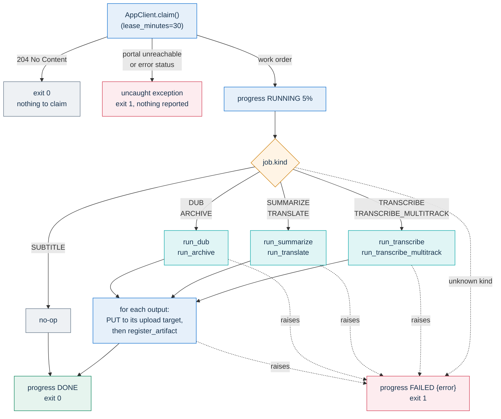
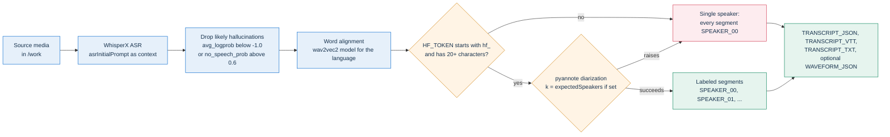

# AI post-production worker

This folder holds the Python worker that runs the jobs of PA Webinar's AI
post-production pipeline: speech recognition and diarization, summaries,
translations, dubbing, and multitrack archives. This page is for developers
who change the worker. The pipeline itself (job graph, queue semantics, the
portal's side of the protocol, models, data sovereignty and operations) is
described in [AI post-production](../../../docs/POSTPROD.md).

## Role: one Kubernetes Job, one queue job

- **One job per pod.** The orchestrator creates each worker Job from the
  suspended template in
  `infra/helm/pa-webinar/templates/cronjob-postprod-worker.yaml`; the pod
  claims one queue job, runs it and exits
  ([The worker Job](../../../docs/POSTPROD.md#the-worker-job)).
- **Entry point.** `python -m worker.main` under `tini`. The exit code is `0`
  when there was nothing to claim or the job succeeded, and `1` when the
  claim or the job failed. There is no HTTP surface and no health probe.
- **Retries belong to the queue.** `client.py` never retries an HTTP call
  ([Retries and backoff](../../../docs/POSTPROD.md#retries-and-backoff)).
- **Network peers.** The portal's internal Service, object storage through
  presigned URLs, and the in-cluster vLLM Service, with one exception
  described under [Runtime environment](#runtime-environment)
  ([Data sovereignty](../../../docs/POSTPROD.md#data-sovereignty)).

What `run_one()` in `main.py` does with one pod's claim:



A claim that fails reports nothing to the portal. If the portal had already
locked a job, the job waits for its lease to end and for the reclaim job.
The exchange as the portal sees it is drawn in
[Claim, progress, register](../../../docs/POSTPROD.md#claim-progress-register).

## Portal protocol

The worker calls three internal endpoints, all `POST` and all authenticated
with the header `x-api-key: <CRON_API_KEY>`, the shared key the cron jobs
use; an `Authorization: Bearer` header is refused. The base URL comes from
`APP_INTERNAL_URL`. What the portal does with each call is described in
[Claim, progress, register](../../../docs/POSTPROD.md#claim-progress-register).

| Endpoint | Call in `client.py` | When the worker calls it |
|---|---|---|
| `/api/internal/postprod-claim` | `AppClient.claim(lease_minutes=30)` | Once, at start. `204` means nothing to claim |
| `/api/internal/postprod-progress` | `AppClient.progress(job_id, status, ...)` | `RUNNING` right after the claim and between stages, then `DONE` or `FAILED` once |
| `/api/internal/postprod-artifact` | `AppClient.register_artifact(...)` | After each output is uploaded |

The pydantic models in `client.py` describe what
`app/src/app/api/internal/postprod-claim/route.ts` returns, and ignore fields
they do not know. `claimResponseSchema` in `app/src/lib/ai/schemas.ts`
documents the same shape, but the route does not validate its output against
it, and it lacks `speakerNames`, `asrInitialPrompt` and `expectedSpeakers`.
When you change the work order, update the route, the pydantic models and
the schema together.

### The work order

- **`kind` and `payload`.** The payload carries `sourceLanguage` and, for
  `TRANSLATE` and `DUB`, `targetLanguage`. For `SUMMARIZE` it also carries
  the event's `agenda` when the event uses one.
- **`sourceDownloadUrl`.** A presigned GET for the recording's composite
  media.
- **`inputs[]`.** Presigned GETs for dependencies, each with a `role`:
  - `transcript`: the `TRANSCRIPT_JSON`;
  - `summary`: the source-language `SUMMARY_JSON`, for `TRANSLATE`, when one
    exists;
  - `translatedTranscript`: the `TRANSLATION_VTT`, for `DUB`;
  - `track`: a per-participant audio track, with `participantId`, the
    decrypted `displayName` and `startOffsetMs`;
  - `subtitle`: the source `TRANSCRIPT_VTT`, for `ARCHIVE`.
- **`uploadTargets{}`.** One presigned PUT per expected artifact, keyed by
  role (`transcriptJson`, `transcriptVtt`, `transcriptTxt`, `summary`,
  `summaryJson`, `dubbedAudio`, `archive`), plus the optional `waveform` and
  `dubbedVideo`.
- **`speakerNames`.** Maps each diarization label to a name from the
  portal's `Speaker` rows. The portal fills it for `SUMMARIZE`, `TRANSLATE`
  and `DUB`, and leaves it empty for the other kinds. The summary and the
  translated subtitles use it to show names instead of `SPEAKER_00`; `DUB`
  ignores it.
- **`providerHints`.** See the next table.

| Hint | Where the portal gets it | When the hint is absent |
|---|---|---|
| `llmBaseUrl`, `llmModelId` | `AI_VLLM_BASE_URL` and `AI_VLLM_MODEL_ID`, with defaults in `app/src/lib/ai/providers.ts` | The LLM helpers return stub output |
| `asrModelId` | `AI_ASR_MODEL_ID` (default `large-v3` in `providers.ts`) | `large-v3` |
| `ttsVoicesPath` | `AI_TTS_VOICES_PATH` (default `/models/piper` in `providers.ts`) | `/models/piper` |
| `asrInitialPrompt` | Built from the event title, organizer name and speaker information, at most 800 characters. `TRANSCRIBE` only | No prompt |
| `expectedSpeakers` | The event's `expectedSpeakers`. `TRANSCRIBE` only | pyannote picks the number of speakers |
| `llmProvider`, `asrProvider`, `ttsProvider` | Site settings, which accept only `vllm`, `whisperx` and `piper` | The worker does not branch on these hints |

### Rules for handler code

- **Report progress during long stages.** Every `RUNNING` call moves the
  lease to 30 minutes from now. The reclaim job puts back to `PENDING` any
  claimed or running job whose lease ended more than a minute earlier, and
  another worker can then claim it. A stage that runs longer than 30 minutes
  without a progress call can therefore run twice
  ([Leases and reclaim](../../../docs/POSTPROD.md#leases-and-reclaim)). The
  vLLM wait sends no progress report, so keep `LLM_CONNECT_WAIT_S` well
  below 30 minutes. A long `TRANSLATE` runs all its batches after a single
  progress report and is exposed in the same way.
- **Presigned URLs do not follow the lease.** They expire `leaseMinutes`
  after the claim, and progress calls do not renew them. The worker picks
  `lease_minutes` before it knows the kind, so raising it (up to 120)
  applies to every claim. It lengthens the validity of the presigned URLs.
  It does not lengthen the lease, which every `RUNNING` report resets to
  30 minutes.
- **Register what the target was issued for.** Upload with the target's
  `contentType`. Then register with the same artifact `type` and `language`
  that the target was issued for: the portal recomputes the key from
  `app/src/lib/ai/paths.ts` and rejects any mismatch.
- **Keep optional outputs optional.** `waveform` and `dubbedVideo` are not in
  the expected set. Catch and log their failures, never raise them.
- **Inline copies.** `_write_and_upload` in `main.py` attaches an inline copy
  only to `text/*` and `application/json` bodies of at most 64 KiB. Binary
  outputs pass `inline_max_bytes=0`, or register directly with a streamed
  SHA-256, as the MKV and dubbed video do.
- **Azure Blob.** A presigned PUT to `*.blob.core.windows.net` needs
  `x-ms-blob-type: BlockBlob`. `client._put_headers` adds it.
  S3-compatible providers do not need it.

## Job kinds and handlers

| `kind` | Handler in `main.py` | Reads | Registers | Engine |
|---|---|---|---|---|
| `TRANSCRIBE` | `run_transcribe` | composite media | `TRANSCRIPT_JSON`, `TRANSCRIPT_VTT`, `TRANSCRIPT_TXT`, optional `WAVEFORM_JSON` | WhisperX, wav2vec2 alignment, pyannote |
| `TRANSCRIBE_MULTITRACK` | `run_transcribe_multitrack` | `track` inputs, and the composite media when it exists | The same three transcript artifacts, with model id `multitrack` | WhisperX loaded once, alignment models cached per language, track offsets refined by `align.py` |
| `SUMMARIZE` | `run_summarize` | `transcript` | `SUMMARY_JSON`, `SUMMARY_MD` | vLLM, one JSON-mode request |
| `TRANSLATE` | `run_translate` | `transcript`, and `summary` when present | `TRANSLATION_VTT`, `SUMMARY_JSON`, `TRANSLATION_MD` in the target language | vLLM, batched |
| `DUB` | `run_dub` | `translatedTranscript`, and the composite media for the video | `DUBBED_AUDIO`, optional `DUBBED_VIDEO` | Piper on CPU, AudioSeal |
| `ARCHIVE` | `run_archive` | composite media, `track`, `subtitle` | `ARCHIVE_MKV` | ffmpeg, with track offsets refined by `align.py` |
| `SUBTITLE` | none | - | - | Reported `DONE` with no artifacts: `TRANSCRIBE` already writes the source-language VTT, and the portal does not enqueue this kind |

**How dubbing picks voices.** A voice is an `.onnx` file plus its
`.onnx.json`. `voice_pool.build_voice_pool` lists every such voice for the
language and ignores an `.onnx` without its JSON. A multi-speaker model
contributes up to 20 voices. Each voice then gets pitch variants at 0, -300
and +300 cents. The pool lists all base voices first, then their variants.
`voice_pool.assign_voices` gives each speaker label its own voice, in order
of speaking time, and reuses voices only when the pool runs out. `run_dub`
passes no display names, so every speaker counts as gender-unknown and
receives the next unused voice in pool order. The first-name matching in
`name_gender.py` runs only when a caller supplies names. The output is
always a catalog synthetic voice, never a cloned one.

## Module map

- `main.py`: the entry point. It claims a job, dispatches on `kind` to a
  `run_*` handler, and reports `DONE` or `FAILED`.
- `client.py`: the portal client (pydantic models and the three endpoints)
  plus the presigned download and upload helpers. It never retries.
- `transcribe.py`: WhisperX transcription, the hallucination filter, word
  alignment, pyannote diarization with its single-speaker fallback, the
  model loaders that the multitrack path reuses, and stubs.
- `multitrack.py`: pure merge of per-participant transcripts onto one
  timeline. It flags segments that overlap another speaker as `concurrent`.
- `align.py`: refines a track's start offset by cross-correlating its energy
  envelope with the composite mix. The core, `xcorr_refine`, is pure numpy.
- `llm.py`: the OpenAI-compatible chat-completions client with the cold-start
  wait, the structured summary and its deterministic Markdown rendering,
  batched segment translation, summary translation, and stubs.
- `vtt.py`: WebVTT and plain-text writers with speaker labels, and the
  parser that turns a translated VTT back into segments for dubbing.
- `tts.py`: Piper dubbing, which covers voice-folder resolution, synthesis
  per cue, silence padding, pitch shifts, the AudioSeal watermark and the
  stub tone.
- `voice_pool.py`: builds the voice pool and assigns voices to speakers.
- `name_gender.py`: infers M, F or N from a first name, for voice matching.
- `archive.py`: builds and runs the ffmpeg command that muxes the composite
  video, the per-participant tracks and the subtitles into one MKV.
- `waveform.py`: a normalized peak envelope, drawn by the transcript editor.
- `conftest.py`: adds this folder to `sys.path` for pytest.
- `test_*.py`: the unit tests.

Some helpers are not called by any job handler: `summarize_transcript` and
`correct_transcript_segments` in `llm.py`, and `build_initial_prompt` and
`transcribe_single_speaker` (with the `load_models` combiner it uses) in
`transcribe.py`. The portal builds the initial prompt itself, and the
multitrack path calls `load_asr_model` and `load_align_model` directly.

## Runtime environment

The image starts from the NVIDIA NGC PyTorch image (build argument
`BASE_IMAGE` in `../Dockerfile.worker`). It adds ffmpeg and `tini` and runs as
UID 10001. In the cluster the root file system is read-only, so only two
mounts are writable: `/models`, which is the PVC named in
`postprod.worker.modelsPvc` or else an empty scratch volume, and `/work`, a
scratch volume of `postprod.worker.workSizeLimit`.

| Variable | Set by | Why |
|---|---|---|
| `HF_HOME=/models`, `TORCH_HOME=/models/torch`, `PYANNOTE_CACHE=/models/pyannote` | image | Model caches live on the models volume |
| `HF_HUB_OFFLINE=1` | image | Hugging Face libraries never download at run time, so the models must be seeded first ([Seeding the models volume](../../../docs/POSTPROD.md#seeding-the-models-volume)) |
| `HOME=/work`, `XDG_CACHE_HOME=/work/.cache`, `MPLCONFIGDIR=/work/.config/matplotlib` | image | Libraries that write under `~` land on the writable volume |
| `TMPDIR=/work` | chart | `tempfile` works on a read-only root. Every handler's working folder lives here |
| `LD_LIBRARY_PATH` starting with `/opt/cudnn8/nvidia/cudnn/lib` | image | CTranslate2 finds cuDNN 8 (see [Dependency constraints](#dependency-constraints)) |
| `APP_INTERNAL_URL`, `CRON_API_KEY` | chart | Portal URL and shared key. Both are required |
| `WORKER_ID` | not set | Defaults to the pod's host name. The portal records it as `leasedBy` |
| `HF_TOKEN` | chart, from `postprod.worker.hfTokenSecret` | Turns on diarization |
| `WORKER_STUB` | chart, from `postprod.worker.stub` | [Stub mode](#stub-mode) |
| `LLM_CONNECT_WAIT_S` | `postprod.worker.extraEnv` | How long an LLM call waits for vLLM. Default 720 seconds in `llm.py` |

`LLM_CONNECT_WAIT_S` covers connection errors and `503` answers. The wait
between retries grows by 2 seconds per attempt, up to 15 seconds. Any other
HTTP error fails the attempt at once
([Waiting for a cold language model](../../../docs/POSTPROD.md#waiting-for-a-cold-language-model)).
The other tunables (`AI_WATERMARK`, `AUDIOSEAL_CACHE_DIR`, `WHISPERX_VERSION`,
`PIPER_VERSION`, `LOG_LEVEL`) are listed in
[Worker environment](../../../docs/POSTPROD.md#worker-environment). Logs are
one JSON-shaped line per record on standard error; exception tracebacks
follow on additional lines.

**Baked voices.** The build downloads Piper voices for `en`, `fr` and `it`
from the public `rhasspy/piper-voices` repository into
`/opt/piper-voices/<lang>/`, and checks their size and JSON. The exact list
is in `../Dockerfile.worker`. No other model is baked into the image. The
speech, alignment and diarization models are read from the models volume.

**The one run-time download.** The AudioSeal watermark generator is loaded
with `torch.hub` from a `huggingface.co` URL, which `HF_HUB_OFFLINE` does not
cover. When the generator is not seeded under `AUDIOSEAL_CACHE_DIR`, every
`DUB` job tries to download it.

## Degradation paths

The worker prefers a usable result with less detail to a failed job. On the
`TRANSCRIBE` path, speaker labels come out like this:



| Situation | What the worker does | Result |
|---|---|---|
| `HF_TOKEN` is missing or a placeholder, or pyannote raises (for example, the gated weights are not in the offline cache) | Skips diarization | Single-speaker transcript, still valid for summaries, translations and dubbing ([Diarization and its fallback](../../../docs/POSTPROD.md#diarization-and-its-fallback)) |
| The configured voices folder has no `.onnx` for the target language | Uses `/opt/piper-voices/<lang>` | Dub in a baked voice |
| The configured voices folder has `.onnx` files for the language, but none with its `.onnx.json` | Still chooses that folder over the baked voices, then skips every voice in it | `FileNotFoundError: empty voice pool`, and the job fails on every attempt |
| Neither folder has an `.onnx` for the language | `FileNotFoundError` | The job fails on every attempt until voices (`.onnx` and `.onnx.json`) are added to `<path>/<lang>/`, where `<path>` is the folder named by the portal's `AI_TTS_VOICES_PATH` (default `/models/piper`, on the models volume) |
| AudioSeal cannot load or apply the watermark | Publishes the audio anyway | `watermarkType` stays empty |
| Waveform extraction or the `DUBBED_VIDEO` mux fails | Logs and skips that output | The job still completes |
| `TRANSCRIBE_MULTITRACK` or `ARCHIVE`: the cross-correlation confidence is below 0.30 (the default in `align.py`) or the envelopes cannot be decoded; for `TRANSCRIBE_MULTITRACK` also a missing composite mix | Keeps the recorder manifest's offset for that track | Tracks aligned by wall clock |
| vLLM unreachable or answering `503` | Waits up to `LLM_CONNECT_WAIT_S` | Then fails the attempt, which the queue retries |
| A translation batch errors or returns the wrong number of lines | Translates that batch segment by segment | Same output, more requests |
| `TRANSLATE` without a source summary, or the summary translation fails | Registers an empty structured summary and its Markdown | The expected artifacts always exist |

## Stub mode

`WORKER_STUB=1`, set by the Helm value `postprod.worker.stub: true`, replaces
the models with canned output. It exercises claim, upload, registration and
the public views without a GPU or a seeded models volume:

- `TRANSCRIBE` downloads the source media and emits two canned Italian
  segments with two speaker labels. The waveform is still computed with
  ffmpeg.
- `TRANSCRIBE_MULTITRACK` downloads each track and emits canned segments,
  with no model loading and no offset refinement.
- `SUMMARIZE` returns a canned summary. `TRANSLATE` keeps the source text
  and prefixes each line with `[stub translation to <lang>]`.
- `DUB` produces a sine tone as long as the subtitles, with engine `stub`.
  The watermark and the video mux are still attempted.
- `ARCHIVE` has no stub. It needs no models and runs the real ffmpeg mux.

The stub still needs ffmpeg, the portal and storage. With `gpu.enabled:
false` and an empty `nodeSelector` and `tolerations`, it runs on ordinary
nodes. `postprod.worker.hfTokenSecret.name` must still name an existing
Secret, even in stub mode. The values are shown in
[Local development and tests](../../../docs/POSTPROD.md#local-development-and-tests).
Stub mode applies to every job the pod claims, and stub artifacts replace a
recording's existing ones. Use it only on an installation whose recordings
are test data.

## Tests

```bash
cd infra/ai/worker
pip install -r requirements-test.txt
python -m pytest -q
```

- **Prefer `python -m pytest`.** It runs pytest under the interpreter where
  you installed `requirements-test.txt`. `conftest.py` puts this folder on
  `sys.path`, so the bare `pytest -q` that CI runs collects the same tests.
  A `ModuleNotFoundError` from a bare `pytest` means another interpreter is
  running it.
- **CPU only, with light dependencies.** `requirements-test.txt` holds only
  `numpy`, `httpx` and `pytest`. The modules import `torch`, `whisperx`,
  `piper` and `audioseal` inside functions, so the tests never load them.
  Keep it that way: a heavy import at module level breaks the suite.
  `client.py`, and `main.py` through it, import `pydantic` at module level,
  and `pydantic` is not in `requirements-test.txt`. A test that imports them
  must add it there.
- **What is covered.** The tests cover pure logic: offset cross-correlation,
  the archive command, LLM parsing, rendering and batching (with
  `_chat_completions` replaced), the multitrack merge, the transcription
  fallbacks (with a fake `whisperx` module in `sys.modules`), voice-folder
  resolution and the VTT round trip.
- **In CI.** The job **Unit Tests (worker AI)** in `.github/workflows/ci.yml`
  runs `pytest -q` on Python 3.11 for pull requests to `main`, pushes to
  `main` and manual runs; it does not run on `dev`. The job list is in
  [Testing](../../../docs/development/testing.md).
- **Code that needs models has no automated test.** Validate it by review
  and static analysis, and run the rest of the flow in stub mode on CPU
  nodes. Never turn on a cluster GPU to run tests: every worker Job can wake
  a GPU node.

## Building the image

From the repository root:

```bash
docker build -f infra/ai/Dockerfile.worker -t pa-webinar-postprod-worker:local infra/ai
```

The build context is `infra/ai`, and only `worker/` is copied into the image.
During the build the image imports the whole WhisperX chain, and the build
fails if any CUDA 13 wheel is installed. The image is very large (the NGC
PyTorch base alone is several GB), so a GPU node that scales up from zero
spends time pulling it before its first job, and the pod needs pull
credentials ([The worker Job](../../../docs/POSTPROD.md#the-worker-job)).

**Published images.** `.github/workflows/dev.yml` publishes the image only
as `ghcr.io/italia/pa-webinar-postprod-worker:dev` and `:dev-<sha>`, and the
chart's default `postprod.worker.image` is `:dev`, so pin a `:dev-<sha>` tag
for a reproducible installation. With `imagePullPolicy: IfNotPresent` and a
moving tag, a node that has already cached `:dev` keeps the old image.
Triggers and tags are in
[CI, images and releases](../../../docs/development/ci-and-release.md#components-published-only-from-dev);
rollback is in
[Upgrades and rollback](../../../docs/operations/upgrades.md#making-the-dev-components-roll-back).

### Dependency constraints

`requirements.txt` holds a balanced stack. Check these constraints before you
bump anything:

- The `torch`, `torchvision` and `torchaudio` trio is pinned from the CUDA
  12.4 wheel index and replaces the base image's PyTorch. Move to a newer
  CUDA index only after the GPU nodes' NVIDIA driver supports it.
- The Dockerfile uninstalls the base image's `flash-attn`, `apex` and
  `transformer-engine`, because they were built against the replaced
  PyTorch.
- `whisperx` is pinned to `>=3.3.0,<3.5.0`, and its faster-whisper pins a
  CTranslate2 build that links cuDNN 8. The image stages cuDNN 8 in
  `/opt/cudnn8` and puts it first on `LD_LIBRARY_PATH`, while PyTorch keeps
  its own cuDNN 9.
- `numpy<2` keeps pyannote and `transformers` on the 1.x ABI.
- `transformers` stays on the 4.x line, because the 5.x line breaks the
  stack.
- No package may call an external service at run time.

The CI filesystem scan (`trivy fs`) reads `requirements.txt`. The worker
image itself is not scanned. Scanner findings accepted for this stack, with
their rationale, are recorded in `.trivyignore` at the repository root.

## Related pages

- [AI post-production](../../../docs/POSTPROD.md): the pipeline, its
  configuration and troubleshooting.
- [ADR-016: In-cluster AI post-production](../../../docs/adr/016-in-cluster-ai-postproduction.md)
  and [ADR-013: Per-participant multitrack recording for speaker attribution](../../../docs/adr/013-multitrack-speaker-attribution.md).
- [Recording: composite video and per-speaker audio](../../../docs/architecture/recording.md):
  where the composite media and the per-participant tracks come from.
- [Recordings, voice data and AI outputs](../../../docs/privacy/recordings-and-ai.md):
  where the privacy view of what this worker produces is described.
- [Running post-production off-cluster](../local-out/README.md): a
  development tool, not part of the image.
