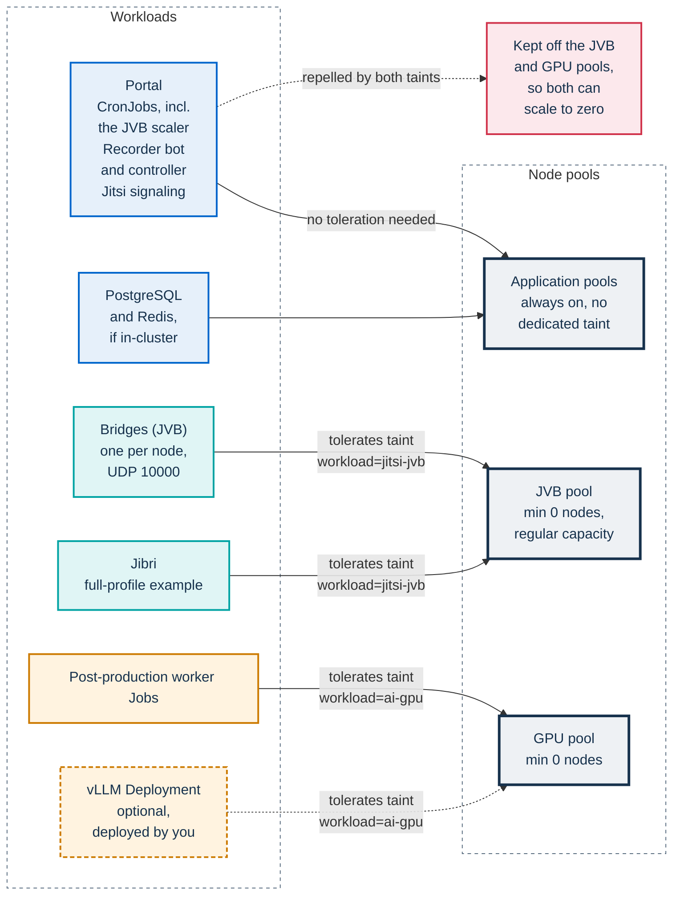

# AKS reference node pools

This page is for operators who run the Helm full profile (`jitsi.mode: full`)
on Azure Kubernetes Service (AKS). It states the contract that the bridge node
pool must meet, shows how the reference module in
[`infra/tofu/aks/`](../tofu/aks/README.md) creates that pool, and notes the
cluster-wide autoscaler profile that goes with it. The last section points to
the GPU pool for AI post-production.

The installation on AKS, from an empty subscription to a first event, with
the choice of machines, pool limits and zones, is in
[Installing on AKS](../../docs/install/aks.md). The contract below is the same
on every cloud: the [GKE](../../docs/install/gke.md) and
[EKS](../../docs/install/eks.md) modules meet it with their own pools, and
[Node pools and bridge exposure](../../docs/INFRASTRUCTURE.md#node-pools-and-bridge-exposure)
covers any other cluster. How the JVB scaler and the
cluster autoscaler take the pool to zero and back is explained in
[Node-pool scale to zero](../../docs/architecture/scaling.md#node-pool-scale-to-zero).
The simple and standard profiles need no dedicated pool: their bridge runs on
the existing nodes with a fixed replica count.

## Pools and workloads

Each pool has one job, and taints keep everything else off the two pools that
scale to zero. Apart from DaemonSets, a pod can run on the JVB or GPU pool
only if it tolerates that pool's taint; the node selector is what sends it
there.



The portal, the recorder controller and the chart's scheduled jobs, including
the JVB scaler and the post-production orchestrator, follow `app.nodeSelector`
and `app.tolerations`, so the scaler never wakes the pool that it scales. Two
workloads have their own placement keys: the post-production worker
(`postprod.worker.nodeSelector`, set to the GPU pool) and the per-participant
recorder bot (`recorder.nodeSelector`, empty by default, so it runs on the
ordinary pools). The Jitsi signaling components get no node selector from the
chart and land on any node without a taint they do not tolerate. If your AKS
system pool carries `CriticalAddonsOnly=true:NoSchedule`, none of these
workloads run there, so give them an application pool of their own.

## The JVB pool contract

Whatever tool creates the pool, it must meet these requirements:

| Requirement | Reference value | Matched by | Why |
|---|---|---|---|
| Node label | `workload=jitsi-jvb` | `jitsi-meet.jvb.nodeSelector` | Sends the bridges to this pool |
| Node taint | `workload=jitsi-jvb:NoSchedule` | `jitsi-meet.jvb.tolerations` | Keeps every other pod off, so the pool can empty |
| Autoscaling | on, minimum `0` nodes | cluster autoscaler | Removes the nodes once the bridges are gone |
| Maximum nodes | `2` in the reference module (`jvb_pool.max_count`) | `JVB_MAX_REPLICAS` (`app.env`) | Keep `JVB_MAX_REPLICAS` at `1` until each bridge has an address of its own; only then raise it, with the pool maximum at least as high. See below |
| Capacity type | regular, not spot | nothing in the chart | An eviction drops every participant on that bridge |
| Media port | UDP `10000` reachable from participants | `jitsi-meet.jvb.UDPPort` | Participants send media straight to the bridge |

- **Jibri shares the pool.** `infra/helm/pa-webinar/examples/values-full.yaml`
  gives Jibri the same node selector and toleration as the bridges. The scaler
  runs at most one Jibri pod, and only while a `PROVISIONING` or `LIVE` event
  has recording turned on.
- **One bridge per node, and one bridge per address.** First, keep
  `JVB_MAX_REPLICAS` at `1` until each bridge has an address of its own (see
  [Reaching UDP 10000](#reaching-udp-10000)). The variable is set in
  `app.env.JVB_MAX_REPLICAS`. The chart leaves it unset, so a default install
  gets the code default of `6` (`app/src/lib/jvb-sizing.ts`). Second, with
  `jitsi-meet.jvb.useHostPort: true`, the `values.yaml` default, each bridge
  binds UDP 10000 on its node, and Kubernetes cannot place two of them on the
  same node. Once each bridge has its own address, set the pool maximum to at
  least `JVB_MAX_REPLICAS`, plus room for the Jibri pod if it cannot fit next
  to a bridge. Bridge replicas above the pool maximum stay `Pending`. The
  mechanism is explained in
  [One bridge per node](../../docs/architecture/scaling.md#one-bridge-per-node),
  and the cap in
  [Capacity and caps](../../docs/operations/jvb-scaler.md#capacity-and-caps).
- **The profile name does not place pods.** `jitsi.mode: full` only turns on
  the scaler CronJob, together with `jitsi.enabled` and `jvbScaler.enabled`.
  The bridges reach the pool through the node selector and tolerations in your
  values, as the full-profile example sets them.

## Creating the pool

### With OpenTofu or Terraform

The reference module [`infra/tofu/aks/`](../tofu/aks/README.md) creates the
pool together with the cluster, the network rules for the media port, the
fixed public addresses and the storage account. The pool is the
`azurerm_kubernetes_cluster_node_pool.jvb` resource in
`infra/tofu/aks/node-pools.tf`, and the module's `helm_values` output carries
the matching node selector and tolerations.

To add the pool to a cluster that you already manage, copy that resource into
your own infrastructure code, set `kubernetes_cluster_id` and
`vnet_subnet_id` to your cluster and subnet, and keep its label, taint,
minimum of zero and regular priority. The module's `cluster.tf` holds the
`auto_scaler_profile` block that goes with it (see
[Autoscaler profile](#autoscaler-profile)).

### With the Azure CLI

The equivalent of the module's pool, for a cluster that has a bridge behind a
load-balancer address:

```bash
az aks nodepool add \
  --resource-group <resource-group> \
  --cluster-name <cluster> \
  --name jvb \
  --mode User \
  --node-vm-size Standard_D4s_v5 \
  --enable-cluster-autoscaler \
  --node-count 0 \
  --min-count 0 \
  --max-count 2 \
  --labels workload=jitsi-jvb \
  --node-taints workload=jitsi-jvb:NoSchedule \
  --os-type Linux \
  --os-sku AzureLinux \
  --max-pods 30 \
  --zones 1 2 3 \
  --max-surge 33%
```

For one public address per bridge node, add `--enable-node-public-ip` and
`--allowed-host-ports 10000/udp`, and allow UDP 10000 in the network security
group of the pool's subnet.

### Reaching UDP 10000

The module offers the two topologies described in
[Exposing the bridges over UDP](../../docs/INFRASTRUCTURE.md#exposing-the-bridges-over-udp),
through its `jvb_exposure` variable:

- `load_balancer`, the default: one bridge behind a fixed public address
  that the module creates, with `JVB_MAX_REPLICAS: "1"`. This is the topology
  that the reference installation runs.
- `node_public_ip`: a public address on every bridge node and UDP 10000 open
  on the host, so that `JVB_MAX_REPLICAS` can follow the pool maximum. Each
  bridge learns its node's address through a STUN server outside the cluster.
  Not yet verified.

Several bridges behind one address drop participants: see
[The single-IP pitfall](../../docs/architecture/scaling.md#the-single-ip-pitfall).

## Autoscaler profile

The `auto_scaler_profile` block in `infra/tofu/aks/cluster.tf` sets
`scale_down_unneeded = "10m"`, which is also the AKS default, and
`scale_down_delay_after_add = "10m"`. Both apply to the whole cluster, not
only to this pool: an emptied bridge node stays until it has been unneeded for
10 minutes, and no node anywhere in the cluster is removed within 10 minutes
of a scale-up. You pay for an emptied node until it is removed.

Nothing in the pool pre-warms it; the JVB scaler's pre-scale window does, and
no separate CronJob or KEDA object is needed. See
[Cold start and the pre-scale window](../../docs/architecture/scaling.md#cold-start-and-the-pre-scale-window),
[Lead time and cold start](../../docs/operations/jvb-scaler.md#lead-time-and-cold-start)
and [Why not KEDA](../../docs/architecture/scaling.md#why-not-keda).

The autoscaler can also evict a bridge to consolidate nodes. Protecting bridge
and Jibri pods with an annotation is recommended in
[Settings for autoscaled pools](../../docs/INFRASTRUCTURE.md#settings-for-autoscaled-pools);
`infra/helm/pa-webinar/examples/values-aks.yaml` sets it.

## Machine size and `jvbCpuCoresPerPod`

The reference module's pool uses 4-vCPU `Standard_D4s_v5` machines
(`jvb_pool.vm_size`), while
**vCPU per JVB pod** (`jvbCpuCoresPerPod`) defaults to `16` in
`app/prisma/schema.prisma`, so the scaler provisions too few bridges until the
two are aligned. How to align them is in
[Align the defaults with your bridges](../../docs/architecture/scaling.md#align-the-defaults-with-your-bridges),
and choosing the machine in
[How big the bridge must be](../../docs/install/aks.md#how-big-the-bridge-must-be).

## The GPU pool

AI post-production runs its worker Jobs, and optionally a vLLM server that you
deploy, on a separate pool with the label and taint `workload=ai-gpu`, also
scaling from zero. The post-production queue drives it, not the JVB scaler.
The reference module creates it with `gpu_pool = { enabled = true }`
(`azurerm_kubernetes_cluster_node_pool.gpu` in `infra/tofu/aks/node-pools.tf`),
on an 80 GB A100 machine by default. With `gpu_pool.spot`, the module's
`helm_values` output adds the AKS spot taint to `postprod.worker.tolerations`;
add it to the vLLM Deployment yourself. The pool, the
device plugin and quotas are covered in
[Provisioning a GPU node pool](../../docs/POSTPROD.md#provisioning-a-gpu-node-pool),
and the models volume in
[Seeding the models volume](../../docs/POSTPROD.md#seeding-the-models-volume).

## Related pages

- [AKS reference infrastructure](../tofu/aks/README.md): the OpenTofu module
  that creates the cluster, the pools, the network rules and the storage.
- [Installing on AKS](../../docs/install/aks.md): the whole installation,
  with the module and the chart overlay.
- [Infrastructure reference](../../docs/INFRASTRUCTURE.md#node-pools-and-bridge-exposure):
  node pools and bridge exposure on any cluster, and networking.
- [Scaling the media plane](../../docs/architecture/scaling.md): the capacity
  model and node-pool scale to zero.
- [Running the JVB scaler](../../docs/operations/jvb-scaler.md): enabling,
  tuning, validating and pausing the scaler.
- [Deploying with Helm](../../docs/DEPLOYMENT.md#full-profile): the full-profile
  walkthrough.
- [AI post-production](../../docs/POSTPROD.md): the pipeline that uses the GPU
  pool.
