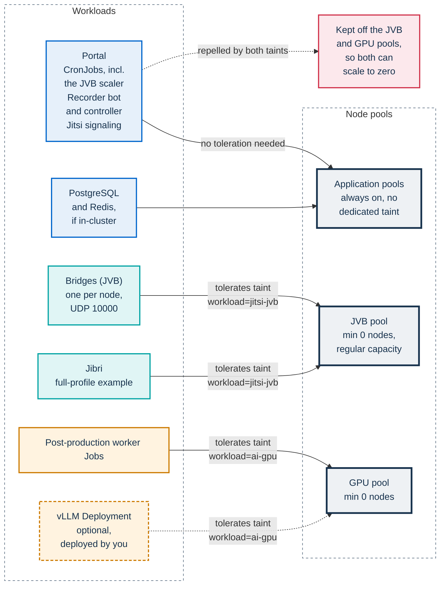

# AKS reference node pools

This page is for operators who run the Helm full profile (`jitsi.mode: full`)
on Azure Kubernetes Service (AKS). It states the contract that the bridge node
pool must meet, shows how to create that pool from the reference definition in
`infra/tofu/`, and notes the cluster-wide autoscaler profile that goes with it.
The last section points to the GPU pool for AI post-production.

It does not cover sizing. Choosing machines, pool limits, zones, network
topology and the equivalents on GKE and EKS are covered in
[Infrastructure](../../docs/INFRASTRUCTURE.md). How the JVB scaler and the
cluster autoscaler take the pool to zero and back is explained in
[Node-pool scale to zero](../../docs/architecture/scaling.md#node-pool-scale-to-zero).
The simple and standard profiles need no dedicated pool: their bridge runs on
the existing nodes with a fixed replica count.

## Pools and workloads

Each pool has one job, and taints keep everything else off the two pools that
scale to zero. Apart from DaemonSets, a pod can run on the JVB or GPU pool
only if it tolerates that pool's taint; the node selector is what sends it
there.



The portal, the recorder controller and the chart's scheduled jobs, including
the JVB scaler and the post-production orchestrator, follow `app.nodeSelector`
and `app.tolerations`, so the scaler never wakes the pool that it scales. Two
workloads have their own placement keys: the post-production worker
(`postprod.worker.nodeSelector`, set to the GPU pool) and the per-participant
recorder bot (`recorder.nodeSelector`, empty by default, so it runs on the
ordinary pools). The Jitsi signaling components get no node selector from the
chart and land on any node without a taint they do not tolerate. If your AKS
system pool carries `CriticalAddonsOnly=true:NoSchedule`, none of these
workloads run there, so give them an application pool of their own.

## The JVB pool contract

Whatever tool creates the pool, it must meet these requirements:

| Requirement | Reference value | Matched by | Why |
|---|---|---|---|
| Node label | `workload=jitsi-jvb` | `jitsi-meet.jvb.nodeSelector` | Sends the bridges to this pool |
| Node taint | `workload=jitsi-jvb:NoSchedule` | `jitsi-meet.jvb.tolerations` | Keeps every other pod off, so the pool can empty |
| Autoscaling | on, minimum `0` nodes | cluster autoscaler | Removes the nodes once the bridges are gone |
| Maximum nodes | `4` in the reference | `JVB_MAX_REPLICAS` (`app.env`) | Keep `JVB_MAX_REPLICAS` at `1` until each bridge has an address of its own; only then raise it, with the pool maximum at least as high. See below |
| Capacity type | regular, not spot | nothing in the chart | An eviction drops every participant on that bridge |
| Media port | UDP `10000` reachable from participants | `jitsi-meet.jvb.UDPPort` | Participants send media straight to the bridge |

- **Jibri shares the pool.** `infra/helm/pa-webinar/examples/values-full.yaml`
  gives Jibri the same node selector and toleration as the bridges. The scaler
  runs at most one Jibri pod, and only while a `PROVISIONING` or `LIVE` event
  has recording turned on.
- **One bridge per node, and one bridge per address.** First, keep
  `JVB_MAX_REPLICAS` at `1` until each bridge has an address of its own (see
  [Reaching UDP 10000](#reaching-udp-10000)). The variable is set in
  `app.env.JVB_MAX_REPLICAS`. The chart leaves it unset, so a default install
  gets the code default of `6` (`app/src/lib/jvb-sizing.ts`). Second, with
  `jitsi-meet.jvb.useHostPort: true`, the `values.yaml` default, each bridge
  binds UDP 10000 on its node, and Kubernetes cannot place two of them on the
  same node. Once each bridge has its own address, set the pool maximum to at
  least `JVB_MAX_REPLICAS`, plus room for the Jibri pod if it cannot fit next
  to a bridge. Bridge replicas above the pool maximum stay `Pending`. The
  mechanism is explained in
  [One bridge per node](../../docs/architecture/scaling.md#one-bridge-per-node),
  and the cap in
  [Capacity and caps](../../docs/operations/jvb-scaler.md#capacity-and-caps).
- **The profile name does not place pods.** `jitsi.mode: full` only turns on
  the scaler CronJob, together with `jitsi.enabled` and `jvbScaler.enabled`.
  The bridges reach the pool through the node selector and tolerations in your
  values, as the full-profile example sets them.

## Creating the pool

### With OpenTofu or Terraform

`infra/tofu/jvb-nodepool.tf` is a reference definition, not a module that this
repository applies. Copy the `azurerm_kubernetes_cluster_node_pool` resource
into your own infrastructure code and adapt it:

- declare the data source it references, which the file leaves to you:

  ```hcl
  data "azurerm_kubernetes_cluster" "main" {
    name                = "<cluster>"
    resource_group_name = "<resource-group>"
  }
  ```

- set `max_count` according to the pool contract above;
- replace the example `tags` with your own;
- ignore the file's comment that a node can run one or two bridges: with host
  ports, each bridge takes a node of its own.

The file also carries, as a comment, an `auto_scaler_profile` block to merge
into your `azurerm_kubernetes_cluster` resource. See
[Autoscaler profile](#autoscaler-profile).

### With the Azure CLI

The equivalent of the reference definition:

```bash
az aks nodepool add \
  --resource-group <resource-group> \
  --cluster-name <cluster> \
  --name jvb \
  --mode User \
  --node-vm-size Standard_D4s_v3 \
  --enable-cluster-autoscaler \
  --node-count 0 \
  --min-count 0 \
  --max-count 4 \
  --labels workload=jitsi-jvb \
  --node-taints workload=jitsi-jvb:NoSchedule \
  --os-type Linux \
  --os-sku AzureLinux \
  --max-pods 30 \
  --zones 1 2 3 \
  --max-surge 33%
```

### Reaching UDP 10000

The reference definition gives the nodes no public IP address and opens no
host port. As written, it fits a single bridge exposed through a
load-balancer IP, with `JVB_MAX_REPLICAS: "1"` in `app.env`. Running several
bridges needs an address of their own for each of them, typically a public IP
on every bridge node with UDP 10000 allowed to it. Both topologies, and the
values that go with them, are in
[Exposing the bridges over UDP](../../docs/INFRASTRUCTURE.md#exposing-the-bridges-over-udp).
Several bridges behind one address drop participants: see
[The single-IP pitfall](../../docs/architecture/scaling.md#the-single-ip-pitfall).

## Autoscaler profile

The `auto_scaler_profile` block in `infra/tofu/jvb-nodepool.tf` sets
`scale_down_unneeded = "10m"`, which is also the AKS default, and
`scale_down_delay_after_add = "10m"`. Both apply to the whole cluster, not
only to this pool: an emptied bridge node stays until it has been unneeded for
10 minutes, and no node anywhere in the cluster is removed within 10 minutes
of a scale-up. You pay for an emptied node until it is removed.

Nothing in the pool pre-warms it; the JVB scaler's pre-scale window does, and
no separate CronJob or KEDA object is needed. See
[Cold start and the pre-scale window](../../docs/architecture/scaling.md#cold-start-and-the-pre-scale-window),
[Lead time and cold start](../../docs/operations/jvb-scaler.md#lead-time-and-cold-start)
and [Why not KEDA](../../docs/architecture/scaling.md#why-not-keda).

The autoscaler can also evict a bridge to consolidate nodes. Protecting bridge
and Jibri pods with an annotation is recommended in
[Installing on a managed cluster](../../docs/INFRASTRUCTURE.md#installing-on-a-managed-cluster).

## Machine size and `jvbCpuCoresPerPod`

The reference pool uses 4-vCPU `Standard_D4s_v3` machines, while
**vCPU per JVB pod** (`jvbCpuCoresPerPod`) defaults to `16` in
`app/prisma/schema.prisma`, so the scaler provisions too few bridges until the
two are aligned. How to align them is in
[Align the defaults with your bridges](../../docs/architecture/scaling.md#align-the-defaults-with-your-bridges),
and choosing the machine in [Sizing](../../docs/INFRASTRUCTURE.md#sizing).

## The GPU pool

AI post-production runs its worker Jobs, and optionally a vLLM server that you
deploy, on a separate pool with the label and taint `workload=ai-gpu`, also
scaling from zero. The post-production queue drives it, not the JVB scaler.
The AKS reference is `infra/tofu/ai-gpu-nodepool.tf`, which, like the JVB
pool, references a `data.azurerm_kubernetes_cluster.main` that you declare.
If you choose spot capacity for this pool, add your platform's spot taint to
`postprod.worker.tolerations` and to the vLLM Deployment. The pool, the
device plugin and quotas are covered in
[Provisioning a GPU node pool](../../docs/POSTPROD.md#provisioning-a-gpu-node-pool),
and the models volume in
[Seeding the models volume](../../docs/POSTPROD.md#seeding-the-models-volume).

## Related pages

- [Infrastructure](../../docs/INFRASTRUCTURE.md): choosing and sizing a
  setup, node pools on other clouds, networking.
- [Scaling the media plane](../../docs/architecture/scaling.md): the capacity
  model and node-pool scale to zero.
- [Running the JVB scaler](../../docs/operations/jvb-scaler.md): enabling,
  tuning, validating and pausing the scaler.
- [Deploying with Helm](../../docs/DEPLOYMENT.md#full-profile): the full-profile
  walkthrough.
- [AI post-production](../../docs/POSTPROD.md): the pipeline that uses the GPU
  pool.
