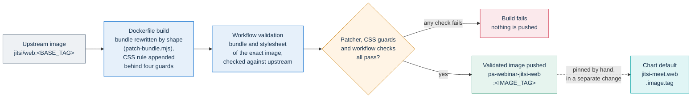
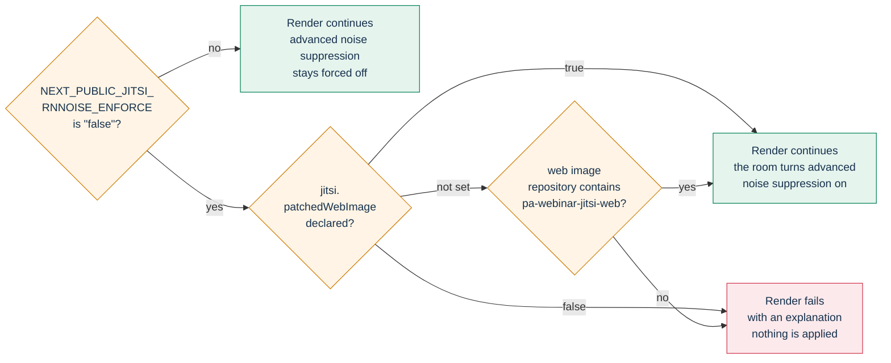

# Patched jitsi/web image

This directory builds `ghcr.io/italia/pa-webinar-jitsi-web`: the upstream `jitsi/web` image with three
fixes applied to its built front-end assets. It is written for maintainers who move PA Webinar to a new
Jitsi release and for operators who choose which web image their conference serves.

| File | Role |
|---|---|
| `Dockerfile` | Multi-stage build: takes `jitsi/web:${BASE_TAG}`, runs the bundle patcher, appends one CSS rule |
| `patch-bundle.mjs` | Rewrites `app.bundle.min.js` by shape, with an exactly-one-match assertion per patch |
| [`.github/workflows/jitsi-web.yml`](../../.github/workflows/jitsi-web.yml) | Builds the image, validates the exact image, then pushes it |

The concept and its place among the other extension points are in
[How PA Webinar extends Jitsi Meet](../../docs/architecture/jitsi-integration.md#the-patched-web-image).
The decision is recorded in [ADR-017](../../docs/adr/017-patched-jitsi-web-image.md).

## Why the image exists

PA Webinar extends Jitsi Meet only from the outside: the IFrame API, configuration overrides, JWT
authentication and a Prosody module (see
[the extension ladder](../../docs/architecture/jitsi-integration.md#the-extension-ladder) and
[ADR-001](../../docs/adr/001-jitsi-iframe-api.md)). Three defects in the Jitsi web client have
no configuration point, so the only way to fix them is to change the built assets that the web
container serves to browsers. This image is the one sanctioned modification of a Jitsi artifact.

The scope is deliberately narrow:

- only the web image changes; Prosody, Jicofo and Jitsi Videobridge (JVB) run the stock images of the
  `jitsi-meet` subchart;
- the patch edits the built bundle and stylesheet of an official image. It does not rebuild Jitsi Meet
  from source and does not carry a fork;
- every change is a single, located, verified edit. If upstream moves the code, the build stops.

## The three fixes

| Fix | File in the image | Without it |
|---|---|---|
| Noise suppression at 48 kHz | `/usr/share/jitsi-meet/libs/app.bundle.min.js` | Advanced noise suppression silences some microphones, so it must stay off |
| Recoverable self view | `/usr/share/jitsi-meet/libs/app.bundle.min.js` | People who hid their own tile earlier cannot get it back |
| Click-through reaction emoji | `/usr/share/jitsi-meet/css/all.css` | Flying emoji swallow clicks on the toolbar underneath |

### Noise suppression at 48 kHz

Jitsi's advanced noise suppression (rnnoise) runs as an audio worklet on a shared `AudioContext`. The
stock client creates that context without an explicit sample rate, so it takes the preferred sample
rate of the default audio output device. The worklet does not resample: it assumes 48 kHz. On a device
that runs at another rate, such as 44.1 kHz, it processes the samples at the wrong rate and the
microphone goes silent. There is no error, no log and no warning in the interface. The problem shows up
only when someone cannot be heard during an event.

The patch creates that context with `{sampleRate:48000}`. The Web Audio graph then resamples the
microphone signal, and the worklet receives the rate it expects. The separate context of the local audio
mixer (`this.audioContext=new AudioContext`) has a different shape and is left alone on purpose.

The fix makes the filter safe to run; it does not switch it on. The portal keeps advanced noise
suppression off unless the operator enables it (see
[Coupling with the noise-suppression setting](#coupling-with-the-noise-suppression-setting)).

### Recoverable self view

Jitsi remembers a "hide self view" choice in local storage on the conference origin. The portal embeds
the conference in an iframe from another origin, so it cannot read or clear that storage. The stock
selector combines three sources with a logical OR: `config.disableSelfView`, the stored setting, and the
rule that hides self view for Jitsi's view-only visitors. A stored `true` therefore wins over any
configuration.

The portal handles this in two steps, both in `app/src/lib/jitsi/config.ts`:

- `disableSelfViewSettings: true` removes the "hide self view" controls, so nobody new can get stuck.
  This works on the stock image too.
- `disableSelfView: false` asks for the tile to be shown. Only the patched selector honors it over the
  stored value, so the browsers of people who hid their tile earlier recover on their next join.

| `config.disableSelfView` | Stored choice | Stock `jitsi/web` | Patched image |
|---|---|---|---|
| `false` (the portal's value) | hidden | hidden | shown |
| `false` | not hidden | shown | shown |
| `true` or unset | any | hidden if either source hides it | unchanged from stock |

Visitors keep their self view hidden in every case, because the visitor rule is untouched.

### Click-through reaction emoji

With native Jitsi reactions, emoji float up across the conference, over the toolbar. The container of
that animation has no `pointer-events` rule, so while an emoji passes over a button, the click lands on
the emoji and the button does not respond. During a burst of reactions the toolbar can feel frozen.

The image appends one rule to `css/all.css` that makes the animation layer and everything inside it
click-through. The emoji are pure decoration, with nothing clickable inside, so no behavior is lost.

The problem exists only when the site setting **Reactions (emoji)** (`reactionsMode`) is **Jitsi native
(in the toolbar, ephemeral)**, which is the default. With **App custom (left-hand bar, with stats)** the
portal turns Jitsi's reactions off (`disableReactions: true`) and renders its own reaction bar. See
[runtime settings](../../docs/configuration/runtime-settings.md#public-features).

## How patching works

### Matching by shape, not by name

Every upstream build of the minified bundle renames its identifiers. A patch that searched for a
variable name would break on the next Jitsi release, and each bump would start with a search through
minified code. `patch-bundle.mjs` therefore never names an identifier. It describes the structure around
the target with a regular expression and captures the identifiers it needs.

Noise-suppression context. `X` is captured once and must be the same identifier on both sides:

```text
before:  X||(X=new AudioContext)
after:   X||(X=new AudioContext({sampleRate:48000}))
check:   the bundle also contains X.audioWorklet.addModule
```

The extra check confirms that the context found is the one that loads the noise-suppression worklet, and
not another shared context that a later upstream release might add.

Self-view selector. `F` is the minified visitor function, captured and kept; `!1` is minified `false`:

```text
before:  e["features/base/config"].disableSelfView||e["features/base/settings"].disableSelfView||F(e)
after:   (!1!==e["features/base/config"].disableSelfView&&(e["features/base/config"].disableSelfView||e["features/base/settings"].disableSelfView))||F(e)
```

Reaction overlay. The Dockerfile appends a comment carrying the marker `pa-webinar reactions overlay`,
followed by this rule:

```css
.reactions-animations-container,.reactions-animations-container *{pointer-events:none!important}
```

### Exactly one match

Each bundle patch goes through one helper, `sostituisciUnica` ("replace exactly once"). It:

1. counts the matches of the shape and stops the build unless there is exactly one;
2. checks that the matched text itself occurs only once in the bundle;
3. replaces it;
4. checks that the old text is gone and the new text occurs exactly once.

Zero matches means that upstream changed the structure or fixed the problem. More than one match means
that the shape is ambiguous. In both cases the patcher exits with an error instead of guessing. On an
image where a wrong edit silences microphones, stopping is the only acceptable outcome.

### An added CSS rule, not an edited one

The reaction fix appends a new rule instead of editing an upstream one. If upstream reorders or rewrites
its stylesheet, the appended rule still applies, as long as the selector exists.

### Fail-loud guards

The CSS step in the Dockerfile runs four shell guards. Any failure stops the build:

| Guard | Why |
|---|---|
| `css/all.css` exists | The layout of the base image changed |
| The marker is **not** already there | The guards are deliberately not idempotent: a marker in the base means the base is not the pristine upstream image, and a second copy would hide that |
| `.reactions-animations-container` exists | Upstream renamed the reactions container, and the rule would be inert |
| The marker is there after the append | The write did not happen |

## Building and publishing



### The Dockerfile stages

1. `base` is `jitsi/web:${BASE_TAG}`. The `BASE_TAG` build argument has a default in the Dockerfile,
   which local builds use; the workflow passes its own value.
2. `patcher` is a Node.js image. It copies `libs/app.bundle.min.js` out of the base and runs
   `patch-bundle.mjs` on it.
3. The final stage is the base image with the patched bundle copied back and the CSS rule appended.

To build locally from the repository root:

```sh
docker build --build-arg BASE_TAG=<jitsi-build> -t pa-webinar-jitsi-web:local infra/jitsi-web-patched
```

With `--progress=plain`, a successful build shows one `OK:` line from the patcher and one from the CSS
step. A failing guard prints a `FATALE:` line (Italian for "fatal") and stops the build.

### The workflow

`.github/workflows/jitsi-web.yml` runs on pushes to `dev` that change `infra/jitsi-web-patched/` or the
workflow itself, and on manual dispatch. It does not run for pull requests or for release tags: the
image has its own tag and is not tied to an application release. The job runs on the project's
self-hosted runner, like the other build workflows, with `contents: read` and `packages: write`.

1. **Build without pushing.** The image is built into the local Docker daemon (`load: true`,
   `push: false`), with `provenance: false`, because the local exporter cannot load an image that carries
   attestations.
2. **Validate the exact image.** The job extracts the bundle and the stylesheet from the new image and
   from `BASE_IMAGE`, and repeats the patch checks on them (see the table below).
3. **Push the validated image.** It runs `docker push` on the image it validated. It does not rebuild,
   so the published artifact cannot drift from the validated one through a moved base tag or a cache.
4. **Summary.** It writes the published reference and its base to the job summary.

| Check on the extracted files | Passes when |
|---|---|
| Noise-suppression context | `=new AudioContext({sampleRate:48000}))` occurs once in the patched bundle; `=new AudioContext)` occurs zero times in the patched bundle and once in the original, so a missing target is not mistaken for "already fixed" |
| Bundle syntax | `node --check` accepts the patched bundle. If the runner's Node.js cannot parse the original bundle either, the job logs a warning and relies on the other checks |
| Reaction overlay | The marker occurs once in the patched stylesheet and zero times in the original; the full rule is present; `.reactions-animations-container{` is still in the original |
| Self-view selector | The patched form occurs once; the upstream form occurs zero times in the patched bundle and once in the original |

Two details matter if you reproduce these checks by hand. Extract files with
`docker run --rm --entrypoint cat`: with the default entrypoint, the image's init system runs first and
prepends its own output to the file. Count occurrences with `grep -oF … | wc -l`, not `grep -c`: the
minified bundle is a single line, so `grep -c` always returns 1.

The mechanics of all workflows, including this one, are in
[CI, images and releases](../../docs/development/ci-and-release.md#jitsi-webyml-the-patched-jitsi-web-image).

### Tags

The workflow's `env` block holds every name the build uses:

| Variable | Meaning |
|---|---|
| `REGISTRY`, `IMAGE_NAME` | Where the image is pushed (`ghcr.io`, `italia/pa-webinar-jitsi-web`) |
| `BASE_TAG` | The upstream `jitsi/web` tag, passed to the Dockerfile as a build argument |
| `BASE_IMAGE` | The upstream image the validation step compares against. It must name the same build as `BASE_TAG` |
| `IMAGE_TAG` | The published tag, named after the upstream build (`<BASE_TAG>-rnnoise`), with a revision suffix when a patch changes on the same base |

The workflow pushes whatever `IMAGE_TAG` says. If a patch changes and `IMAGE_TAG` does not, the new
image overwrites the old one under the same tag, the running build can no longer be identified from the
tag, and a rollback to the previous image is impossible. Give every patch change a new, unused tag, for
example with a revision suffix, in the same commit as the change. The chart pulls the web image with
`pullPolicy: Always`, as a safety net in case a tag is ever rewritten.

### Keeping the chart default aligned

The chart references the image in `jitsi-meet.web.image` in `infra/helm/pa-webinar/values.yaml`
(`repository`, `tag`, `pullPolicy: Always`). That default tag is maintained separately from `IMAGE_TAG`
and can lag behind it; a comment in `values.yaml` says when the two differ. Compare them before you rely
on the chart default.

Before aligning, check that the base build of `IMAGE_TAG` equals the `appVersion` of the vendored
`jitsi-meet` subchart, or the tag of any backend image you pin:

```sh
helm show chart infra/helm/pa-webinar/charts/jitsi-meet-*.tgz | grep appVersion
```

If they differ, the alignment belongs to the Jitsi upgrade and ships in the same rollout as the subchart
bump, following the
[Jitsi upgrade checklist](../../docs/architecture/jitsi-integration.md#jitsi-upgrade-checklist). A web
client from one Jitsi release against a backend from another is exactly the mismatch the
[bump procedure](#bumping-to-a-new-jitsi-release) rules out.

Aligning them is a rollout of the conference front end for every installation that uses the default.
When the releases match, do it in its own change, after the new image has passed the
[verification checklist](#verification-checklist), and roll it out with the
[drift-safe upgrade procedure](../../docs/operations/upgrades.md). An installation that pins the web tag
in its own values moves when its operator bumps that value, not when the chart default changes.

### Publishing from a fork

A fork that builds its own copy changes `IMAGE_NAME` to a namespace it can push to and `runs-on` to a
runner it has, then points `jitsi-meet.web.image.repository` at the result. The chart recognizes the
image as patched when the repository name contains `pa-webinar-jitsi-web`. Under any other name, declare
it with `jitsi.patchedWebImage: true` if you plan to switch advanced noise suppression on (see
[Coupling with the noise-suppression setting](#coupling-with-the-noise-suppression-setting)).

## Bumping to a new Jitsi release

A new web image is one step of the wider
[Jitsi upgrade checklist](../../docs/architecture/jitsi-integration.md#jitsi-upgrade-checklist). The
upstream web build must match the Jitsi release of the `jitsi-meet` subchart, because the web client and
the backend components are released together.

1. **Change the base in three places, in one commit:**
   - the default of `ARG BASE_TAG` in `Dockerfile`;
   - `BASE_TAG` and `BASE_IMAGE` in the `env` block of `.github/workflows/jitsi-web.yml`;
   - `IMAGE_TAG` in the same block, to a tag that has never been pushed.
2. **Build locally first**, with the command in [The Dockerfile stages](#the-dockerfile-stages). Bumping
   is normally just a change of tag: the shapes still match and the build passes.
3. **If an assertion fails, investigate. Do not loosen it.** Find out whether upstream restructured the
   code or fixed the problem, using the table below.
4. **Push to `dev`.** The workflow builds, validates and publishes the image.
5. **Verify** with the [checklist](#verification-checklist), then align the chart default together with
   the subchart bump (steps 1 and 3 of the
   [Jitsi upgrade checklist](../../docs/architecture/jitsi-integration.md#jitsi-upgrade-checklist)) and
   roll out.

Build messages are in Italian and are quoted verbatim below; `FATALE` means fatal.

| The build output mentions | Meaning | What to do |
|---|---|---|
| `contesto audio della soppressione rumore` with `trovate 0` | The noise-suppression context no longer has the expected shape | Look at how the new bundle creates the context. If upstream now passes a sample rate or resamples, the patch may be unnecessary: prove it with a real call on a device whose audio output runs at 44.1 kHz before removing it. Otherwise adapt the shape |
| `contesto audio della soppressione rumore` with `trovate 2` or more | The shape became ambiguous | Tighten the regular expression until it matches only the noise-suppression context. Never take the first match |
| `non carica nessun worklet audio` | The context found does not load the worklet | Upstream added another shared context with the same shape. Tighten the shape |
| `selettore della vista di se stessi` | The self-view selector changed | Check whether upstream now lets an explicit `disableSelfView: false` win. If it does, the patch can go; if not, adapt the shape |
| `il testo da sostituire non e' unico` or `verifica della sostituzione fallita` | The shape matched once, but the matched text also occurs elsewhere, or the bundle does not end up with exactly one patched form and no original one | The shape is ambiguous: tighten it. If the patched form was already in the bundle, check that the base is the pristine upstream image |
| `.reactions-animations-container non e' in` | The reactions container was renamed | Find the new container class and update the selector in the Dockerfile and in the workflow checks |
| `patch gia' presente` | The marker is already in the base | The base image is not the pristine upstream image. Check `BASE_TAG` and where the image comes from |
| `non trovato` | `css/all.css` is not where it was | The layout of the base image changed. Find the stylesheet before changing anything else |
| `l'aggiunta non e' arrivata` | The appended rule is not in the stylesheet after the write | The stylesheet could not be written as expected. Check the base image layout, for example whether `css/all.css` is still a regular file |
| No message: the workflow's **Validate patched bundle** step fails silently | One of its counts is off; a failing `test` exits without printing anything | Build the image locally, run the commands of [verification step 1](#verification-checklist) on it and on `BASE_IMAGE`, and compare the counts with the [workflow checks](#the-workflow) |

To look at the upstream code a failing shape was meant to find:

```sh
docker run --rm --entrypoint cat jitsi/web:<jitsi-build> /usr/share/jitsi-meet/libs/app.bundle.min.js > orig.js
grep -oE '.{0,80}new AudioContext.{0,80}' orig.js
grep -oE '.{0,80}audioWorklet\.addModule.{0,40}' orig.js
grep -oE '.{0,60}disableSelfView\|\|.{0,80}' orig.js
docker run --rm --entrypoint cat jitsi/web:<jitsi-build> /usr/share/jitsi-meet/css/all.css \
  | grep -oE '\.reactions-animations[^{]*\{'
```

Removing a patch that upstream has made unnecessary is a deliberate change: update the patcher, the
Dockerfile, the workflow checks, [ADR-017](../../docs/adr/017-patched-jitsi-web-image.md) and this page
together.

## Coupling with the noise-suppression setting

The patched image makes advanced noise suppression safe; the portal switches it on only when
`app.env.NEXT_PUBLIC_JITSI_RNNOISE_ENFORCE` is exactly `"false"`. How the room applies the setting is in
[Noise suppression and the patched image](../../docs/architecture/jitsi-integration.md#noise-suppression-and-the-patched-image).

The two settings live far apart in the values file, so the chart checks them together. The
`pa-webinar.validateRnnoise` guard in `infra/helm/pa-webinar/templates/_guards.tpl` runs when the app
Deployment is rendered:



`jitsi.patchedWebImage` has no default in `values.yaml`; set it only when you publish the patched image
under a name the automatic check does not recognize. The guard looks at the repository name, not at the
tag or the image content: it catches the common mistake of pointing the chart at stock `jitsi/web`, not
every possible mismatch. The Docker Compose stack has no such guard. It serves stock `jitsi/web` and
does not set the variable, so advanced suppression stays off there.

A bundle check proves that the patch is present, not that people can be heard. Switch advanced
suppression on only after a real call on the image you serve, as described in the
[verification checklist](#verification-checklist). The variable itself is listed in the
[configuration reference](../../docs/CONFIGURATION.md).

## Verification checklist

Run it on a test installation for every new `IMAGE_TAG`, before aligning the chart default and before
switching advanced noise suppression on anywhere.

**1. The image carries every patch.** The workflow already does this; to repeat it by hand on a local
build or on the published image:

```sh
IMG=ghcr.io/italia/pa-webinar-jitsi-web:<image-tag>   # or pa-webinar-jitsi-web:local
docker run --rm --entrypoint cat "$IMG" /usr/share/jitsi-meet/libs/app.bundle.min.js > patched.js
docker run --rm --entrypoint cat "$IMG" /usr/share/jitsi-meet/css/all.css > patched.css
grep -oF '=new AudioContext({sampleRate:48000}))' patched.js | wc -l                  # expect 1
grep -oF '=new AudioContext)' patched.js | wc -l                                       # expect 0
grep -oE '\(!1!==e\["features/base/config"\]\.disableSelfView&&' patched.js | wc -l   # expect 1
grep -oF 'pa-webinar reactions overlay' patched.css | wc -l                            # expect 1
node --check patched.js && echo "bundle parses"
```

**2. The web pod can pull the image.** The Jitsi pods use only `jitsi-meet.imagePullSecrets`. They run
under the subchart's own ServiceAccount, so they inherit neither `app.imagePullSecrets` nor a pull secret
attached to another ServiceAccount. A failed pull leaves the new web pod in `ImagePullBackOff`, and
conferences stop opening once the old pod goes. Test the pull before the rollout in the next step, as
described in
[Check that every image can be pulled](../../docs/operations/upgrades.md#check-that-every-image-can-be-pulled).

**3. The test installation serves the new image.** Point the test installation at the new tag
(`jitsi-meet.web.image.tag: <image-tag>` in its values), on a backend of the same Jitsi release as
`BASE_TAG`, and roll it out with the [drift-safe procedure](../../docs/operations/upgrades.md). Otherwise
the next steps test the old tag, or a web client against a backend from another Jitsi release.

**4. A real call, with real microphones.** Set `NEXT_PUBLIC_JITSI_RNNOISE_ENFORCE: "false"` in `app.env`
on the test installation and apply it. Then join one event from several devices:

- at least one participant whose default audio output device runs at 44.1 kHz (the `AudioContext` takes
  the output device's rate), with the microphone also set to 44.1 kHz in the operating system's audio
  settings, and one at 48 kHz;
- each of them unmutes and speaks, and the others hear them clearly, with background noise reduced;
- repeat after muting and unmuting, because the portal turns suppression on at every unmute.

**5. Self view recovers.** In the browser's developer tools, open the local storage of the conference
origin (the iframe's origin, for example `https://meet.webinar.example.com`). In the
`features/base/settings` entry, set `disableSelfView` to `true`, then rejoin the event. Your own tile must
be visible, and the "hide self view" controls must be absent.

**6. Reactions do not block the toolbar.** With **Reactions (emoji)** set to **Jitsi native (in the
toolbar, ephemeral)**, send a burst of reactions from one participant. While the emoji cross the toolbar,
the microphone and camera buttons must respond on the first click.

If a step fails, do not align the chart default and do not switch advanced suppression on. Open an issue
that names the image tag and the failing step, and investigate as in
[Bumping to a new Jitsi release](#bumping-to-a-new-jitsi-release).

## Using stock jitsi/web instead

An installation that cannot or does not want to pull the patched image serves the upstream one. The
values override is in [Deploying with Helm](../../docs/DEPLOYMENT.md#web-image-and-pull-secrets); leave
`NEXT_PUBLIC_JITSI_RNNOISE_ENFORCE` unset and do not declare `jitsi.patchedWebImage`.

| What you lose | What remains |
|---|---|
| Advanced noise suppression (rnnoise) | The browser's standard noise suppression, echo cancellation and gain control stay on |
| Self-view recovery | Nobody new can hide their tile, because the portal removes the control on any image. People who hid it earlier stay stuck until they clear the site data of the conference origin or use a private window |
| Click-through reaction emoji | With native reactions, emoji can briefly block toolbar clicks. Setting **Reactions (emoji)** to **App custom (left-hand bar, with stats)** avoids the problem, because Jitsi's reactions are then off |

The Docker Compose development stack uses stock `jitsi/web`, with
the same trade-offs.

## License

The image redistributes the Jitsi Meet web client, which is licensed under Apache-2.0, with the
modifications described on this page. `patch-bundle.mjs` and the `Dockerfile` are the complete record
of what changes. The appended stylesheet rule carries a comment marking the change; the rewritten
JavaScript bundle carries no in-file notice, an open point recorded in
[THIRD-PARTY-LICENSES](../../THIRD-PARTY-LICENSES.md#modified-third-party-code).

## Related pages

- [How PA Webinar extends Jitsi Meet](../../docs/architecture/jitsi-integration.md): the extension ladder,
  the embedding model and the Jitsi upgrade checklist
- [ADR-017: Patch the jitsi/web bundle by shape](../../docs/adr/017-patched-jitsi-web-image.md)
- [ADR-001: Embed Jitsi Meet through the IFrame API](../../docs/adr/001-jitsi-iframe-api.md)
- [Deploying with Helm](../../docs/DEPLOYMENT.md#web-image-and-pull-secrets): the web image and pull-secret keys
- [Upgrades and rollback](../../docs/operations/upgrades.md): rolling out a new web tag
- [CI, images and releases](../../docs/development/ci-and-release.md): all workflows and image tags
- [Testing](../../docs/development/testing.md#patched-jitsiweb-bundle): where the shape assertions sit among the test layers
