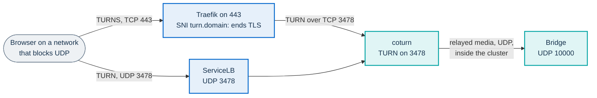

# Single-server add-ons: object storage and TURN

Two optional components for PA Webinar on one k3s server, each installed by a
script in this folder:

| Script | Adds | You need it for |
|---|---|---|
| `storage.sh` | An S3-compatible object store (Garage) on the node, with its own public name `s3.<your domain>` | Uploads (logos, covers, materials, chat attachments), uploading and publishing videos. Without it the portal hides every upload control |
| `turn.sh` | TURN on UDP 3478 and TURN over TLS on port 443, shared with the portal | Participants whose networks block UDP towards the bridge. Without it they join the room but hear and see nobody |

**Status: tested in lab.** Both were installed on a one-node k3s lab VM
(Debian 12, 4 vCPU, 8 GiB) with the chart in `existing` secrets mode and a
private certificate authority, and exercised with real browsers (see
[What was tested](#what-was-tested)). Neither has run a real event yet. The
statuses are defined in [Installing PA Webinar](../../../../docs/install/README.md).

The step-by-step installation is [Installing on k3s](../../../../docs/install/k3s.md);
this page is the reference for the two scripts. Each script also has a
`--help`, and prints its messages in Italian.

## What the scripts do and do not do

- They run from the workstation that holds the kubeconfig, or on the server
  itself, and use only the kubeconfig and context you pass. They never change
  your current kubectl context.
- They create Kubernetes objects in the release namespace, generate their
  secrets once into a state folder outside the repository, and write a values
  file for the chart. They **do not run helm**: the chart is upgraded
  afterwards, with the add-on's example file and the generated values file
  added to the usual ones (see each section).
- Running a script again with the same options changes nothing and restarts
  nothing. The secrets are never regenerated: if the state folder is lost, the
  scripts rebuild it from the Secrets already in the cluster, with the same
  values.
- They never print a secret and never put one on a command line: secrets go
  from files readable only by you (mode 0600) to kubectl.

The state folder defaults to `~/.config/pa-webinar/k3s/<release>`
(`--state-dir` to change it). The scripts create it readable only by you. They
refuse a folder inside the repository, your home folder itself, and an existing
folder that belongs to someone else or that other users can read (except under
`~/.config/pa-webinar/`, which they tighten to 0700): they never change the
permissions of a folder they did not create elsewhere.

Both examples in the chart need the file their script writes: the order is
the profile files, then `values-k3s.yaml`, then the add-on's example, then your
site file, then the add-on's generated file. The TURN example alone does not
even render, on purpose (see [TURN](#turn-turnsh)).

Requirements on the machine that runs them: bash 3.2 or later, `kubectl`,
`openssl`, `base64`, `od`; for `storage.sh` also `curl` with `--aws-sigv4`
(7.75 or later; tested with 7.88, the Debian 12 version, and 8.18), which it
uses to sign S3 requests; for `turn.sh --check` also `timeout`, and `getent`
unless you pass `--resolve`. A Debian 12 node has all of them, so the scripts
also run on the server itself with its kubeconfig
(`/etc/rancher/k3s/k3s.yaml`, as root): tested.

## Names, certificates and ports

Each add-on needs one more DNS name pointing at the node that serves 80 and
443, like the portal's:

| Add-on | Name (example) | Ports to open towards that node |
|---|---|---|
| Storage | `s3.webinar.example.com` | None: 443 is already open |
| TURN | `turn.webinar.example.com` | UDP 3478 (TURN); 443 is already open (TURNS) |

Both names need the same kind of certificate as the portal. Pass exactly one
of:

- `--tls-secret <name>`: a `kubernetes.io/tls` Secret in the namespace whose
  certificate covers the name. Your organization's certificate, or one signed
  by a private authority. A wildcard `*.webinar.example.com` covers `s3.` and
  `turn.` of that domain. The scripts check the certificate with
  `openssl x509 -checkhost` and stop if it does not cover the name.
- `--cert-resolver <name>`: a Traefik ACME resolver (Let's Encrypt), when the
  portal uses one. Traefik obtains the certificate for the name by itself.
  The manifests were validated against the API server; issuing a certificate
  was not tested (the lab had no public DNS).

With a private authority, pass `--cacert <ca.pem>` so that the final checks
verify the certificate, and make the portal trust the authority
(`app.extraCaCerts`, which `storage.sh --ca-configmap` can set).

## Object storage (`storage.sh`)

The portal keeps every file in an object store: small files go through the
portal, but browsers upload videos and play recordings **directly** from the
store with signed URLs. On one server the store therefore needs a public HTTPS
name that browsers and the portal both reach
([Object storage](../../../../docs/configuration/storage.md)).

`storage.sh` installs [Garage](https://garagehq.deuxfleurs.fr/) v2.1.0 (pinned
by digest), a small S3-compatible server that runs as one process:

| Object | What it is |
|---|---|
| Deployment and PVC `<release>-garage`, `<release>-garage-data` | Garage, one replica, data and metadata on a local-path volume on the node's disk. Runs as a non-root user with a read-only root filesystem |
| Buckets `pa-webinar-files`, `pa-webinar-recordings` | The portal's two storage domains. Private: every read goes through a signed URL or the portal |
| One access key | Read and write on both buckets, no bucket administration. Stored in `storage.env` and in the portal's Secret |
| CORS rules | `GET`, `HEAD` and `PUT` from the portal's origin, for browser uploads |
| Lifecycle rule | Multipart uploads left incomplete are aborted after three days |
| Ingress `<release>-garage` | `https://s3.<domain>` through Traefik, with the certificate you chose |
| NetworkPolicy `<release>-garage` | Only Traefik reaches the S3 port; the admin API is reachable only through `kubectl port-forward`; Garage makes no outbound connection |

### Install

```bash
infra/onprem/k3s/addons/storage.sh \
  --kubeconfig <kubeconfig> \
  --host s3.webinar.example.com \
  --portal-url https://webinar.example.com \
  --tls-secret <tls-secret>            # or --cert-resolver <resolver>
  # --resolve <node-ip>   while DNS is not ready
  # --cacert <ca.pem>     with a private authority
```

It waits for Garage, configures it, and finishes with a check from outside,
through the public name, the way a browser does: a CORS preflight from the
portal's origin, then a signed upload and delete with the portal's key. The
first run took 13 s in the lab, a second run about 5 s.

It writes to the state folder:

- `storage.env`: the four keys the portal reads
  (`STORAGE_FILES_S3_ACCESS_KEY_ID`, `STORAGE_FILES_S3_SECRET_ACCESS_KEY`,
  `RECORDING_S3_ACCESS_KEY_ID`, `RECORDING_S3_SECRET_ACCESS_KEY`). With
  `secrets.mode: existing`, if the portal's Secret (`<release>-secrets`, or
  `--app-secret`) already exists, the script adds them to it; otherwise add them
  when you create it. They must stay there every time the Secret is recreated.
  With `secrets.mode: generate` the chart renders that Secret from your
  secrets file: the script leaves it alone and says so, and the four keys go
  under `secrets.generate` in that file.
- `values-storage.yaml`: the public address for the chart.
- `garage.env`: Garage's own secrets. Nothing else reads it.

Then upgrade the chart with two more files: the example right after
`values-k3s.yaml`, the generated file after your site file.

```bash
  -f infra/helm/pa-webinar/examples/values-k3s.yaml \
  -f infra/helm/pa-webinar/examples/values-k3s-storage.yaml \
  -f <your site file> \
  -f <state folder>/values-storage.yaml
```

After the upgrade, check the path the portal itself uses:

```bash
infra/onprem/k3s/addons/storage.sh --check --kubeconfig <kubeconfig> \
  --host s3.webinar.example.com --portal-url https://webinar.example.com \
  [--resolve <node-ip>] [--cacert <ca.pem>]
```

It repeats the CORS preflight from outside, then runs a request from inside the
portal's pod: the name must resolve in the cluster, the certificate must be
trusted by the portal (`app.extraCaCerts` for a private authority) and the
portal's NetworkPolicy must let it through. It also checks that the portal
received the storage address and the four keys, without showing them. The
first check, before the upgrade, cannot prove this: with `--resolve` it does
not even use DNS.

`values-k3s-storage.yaml` sets the provider, the region and the bucket names.
It deliberately leaves `RECORDING_STORAGE_TYPE` unset: that variable tells the
portal that Jibri records, and there is no Jibri on k3s. The recordings domain
is still enabled from its bucket, so video upload and publication work, and
the room shows **Recording not configured in infrastructure**, which is true.

### Operations

- **Where the data is.** In the PVC `<release>-garage-data`, a folder under
  `/var/lib/rancher/k3s/storage` on the node. Garage also takes a snapshot of
  its metadata every six hours in the same volume. Nothing copies the volume
  off the node: back it up with the database, and restore both from the same
  moment, because an older database next to a newer store lets the recordings
  reconciliation delete recordings
  ([Backups](../../../../docs/REUSE.md#backups)).
- **Disk.** local-path does not enforce the volume size. Watch the free space
  on the node, as for the database.
- **Behind NAT, or with split DNS.** The portal reaches `s3.<domain>` at the
  address its name resolves to from inside the cluster. If the node cannot
  reach its own public address (NAT without hairpin), make the name resolve to
  the node's internal address inside your network. Not tested.
- **Removal.** Delete the objects labeled
  `app.kubernetes.io/managed-by=pa-webinar-addons` and named `<release>-garage*`
  in the namespace; the PVC deletion removes the data. Remove the storage files
  from the helm command and the four keys from the portal's Secret.

### Limits

- One node, no replication: a lost disk loses the files, as for the database.
- The script manages one key for both domains, and does not rotate it.
- Uploaded videos not saved as a publication are listed as orphans by the
  recordings reconciliation and deleted after the grace period, as on any S3
  service with an endpoint ([Deletion](../../../../docs/configuration/storage.md#deletion-who-removes-what)).

## TURN (`turn.sh`)

A participant whose network blocks UDP cannot reach the bridge on UDP 10000.
TURN relays that participant's media through a server they can reach: on UDP
3478, or, when all UDP is blocked, over TLS on TCP 443, which looks like web
traffic to most firewalls.

The chart's coturn relays; `values-k3s-turn.yaml` turns it on and
`turn.sh` prepares what the chart cannot:



- **TURN on UDP 3478.** The chart's coturn Service is a LoadBalancer with UDP
  3478 only, which k3s's ServiceLB publishes on the node's address.
- **TURNS on 443, shared with the portal.** An `IngressRouteTCP` makes Traefik
  recognize `turn.<domain>` in the TLS handshake (SNI), terminate TLS with the
  certificate you chose, and pass TURN over TCP to coturn. Every other
  connection on 443 goes to the portal and the conference as before. coturn
  holds no certificate, so all three certificate modes work the same way, and
  a renewal needs no coturn restart. In the lab one TURNS connection carried a
  call for over two minutes without interruption.
- **The address coturn announces for its relays.** The chart makes coturn
  listen on every address, and the coturn image looks up its public address
  with an Internet DNS query. When it cannot, coturn announces its relays as
  `0.0.0.0`; browsers discard them, and a participant with all UDP blocked gets
  no media: measured in the lab. `turn.sh` writes the node's public address as
  `REAL_EXTERNAL_IP` into `values-turn.yaml`: `--public-ip`, else `--resolve`,
  else the node's external or internal address. Pass the public address when
  the node is behind NAT.
- **What coturn may relay to.** coturn refuses private addresses by default
  and accepts every public one. `turn.sh` allows the pod network of each node
  and each node's internal address, where the bridge answers, and a
  NetworkPolicy then limits coturn's outbound traffic to the bridge: its pods,
  those same networks and the node's public address, on UDP 10000 only. A
  participant's TURN credentials cannot reach DNS, the database, the Kubernetes
  API, any other service, or hosts on the Internet. Measured in the lab: DNS,
  PostgreSQL and the API were refused from the coturn pod, and a packet to an
  address outside those networks was dropped, while the same packet went
  through once that address was added with `--peer-range`.
- **The shared secret.** Prosody gives each participant short-lived TURN
  credentials derived from one secret, which coturn verifies. `turn.sh`
  generates it once (`turn.env`) and stores it in the Secret `<release>-turn`,
  so it does not change at every helm upgrade.

### Install

```bash
infra/onprem/k3s/addons/turn.sh \
  --kubeconfig <kubeconfig> \
  --host turn.webinar.example.com \
  --tls-secret <tls-secret> \          # or --cert-resolver <resolver>
  --resolve <node-public-ip>           # recommended: also the relay address
```

Then upgrade the chart with two more files: the example right after
`values-k3s.yaml`, the generated file after your site file.

```bash
  -f infra/helm/pa-webinar/examples/values-k3s.yaml \
  -f infra/helm/pa-webinar/examples/values-k3s-turn.yaml \
  -f <your site file> \
  -f <state folder>/values-turn.yaml
```

The TURN name and the Secret with coturn's secret are only in the generated
file. Without it the render stops on the chart's pinned-credentials check
(`jitsi-meet.coturn.staticAuth`), instead of installing a Prosody that waits
for a Secret that does not exist and so cannot start, which would stop every
conference.

The first upgrade with TURN restarts Prosody once, because its environment
changes: calls in progress drop. Jicofo and the bridge do not restart. Do it
with no event running. Later upgrades leave coturn and Prosody alone unless
their values change.

Then check from a machine outside the cluster:

```bash
infra/onprem/k3s/addons/turn.sh --check --host turn.webinar.example.com \
  [--resolve <node-ip>] [--cacert <ca.pem>]
```

It sends a STUN request to UDP 3478, and one inside a TLS connection to 443
with the TURN name, verifying the certificate. Both must answer. This proves
that the ports are open and the routing works, not that media flows: for that,
hold a call from a network that blocks UDP (below).

### Testing from a network that blocks UDP

A participant list that fills up is not enough: check that the two sides hear
and see each other.

1. On a test laptop, block outgoing UDP towards the node's address (for
   example with the laptop's firewall), or use a guest network that allows
   only web traffic. Block UDP 10000 first (TURN over UDP), then all UDP
   (TURNS only).
2. Join a room from that laptop and from a second device.
3. In Chrome, `chrome://webrtc-internals` shows the selected candidate pair:
   its local candidate must be of type `relay`, with relay protocol `udp` in
   the first case and `tls` in the second.

In the lab the same test was automated with two browsers and the node's
firewall dropping UDP 10000, then also UDP 3478: see
[What was tested](#what-was-tested).

### Coturn on its own address instead

If the node has a second public address, coturn can have port 443 to itself,
without Traefik: set `jitsi-meet.coturn.turns.enabled: true` with a
certificate, `service.ports.turns: 443`, and publish the Service on the second
address with a load balancer that can choose it (ServiceLB publishes every port
on all the node's addresses, and 443 already belongs to Traefik; MetalLB can).
Not tested, and not what `turn.sh` sets up.

### Limits

- One coturn on one node. It restarts with its node like everything else.
- IPv4 only.
- Relays reach only the bridge. The portal turns off Jitsi's peer-to-peer
  mode, so all media goes through the bridge anyway.
- `turn.sh` reads the pod networks of the nodes present when it runs: after
  adding a node, run it again and upgrade the chart. To allow another network
  for the bridge, pass `--peer-range <a.b.c.d/nn>` (repeatable).
- Removal: delete the objects labeled
  `app.kubernetes.io/managed-by=pa-webinar-addons` named `<release>-turn*` and
  `<release>-coturn-egress`, and remove the TURN files from the helm command.

## Before the first real event

- [ ] The two extra names resolve to the ingress node from outside and from
  inside your network, with a trusted certificate.
- [ ] Storage: an image uploaded in **Settings** shows, and a video uploaded in
  **New publication** plays.
- [ ] Storage: the Garage volume is in the backup, restored together with the
  database, and `storage.env` is kept with the other secrets files.
- [ ] TURN: UDP 3478 open towards the node, `turn.sh --check` answers on both
  paths.
- [ ] TURN: a call from a network that blocks all UDP has audio and video.
- [ ] The state folder backed up, apart from the database copies.

## What was tested

One k3s node (Debian 12, 4 vCPU, 8 GiB, the k3s version `install-server.sh`
pins), the chart in `existing` secrets mode with a private certificate
authority, the portal image built from the repository. Browsers: headless
Chrome with a fake camera and microphone.

| Test | Result |
|---|---|
| `storage.sh` first run, second run, run with an empty state folder | Done in 13 s and about 5 s, with no pod restarted; from an empty folder, `storage.env`, `garage.env` and `turn.env` were rebuilt identical to the originals, and no key or bucket was added |
| Image upload in the administration area (through the portal) | Stored and read back byte for byte |
| Video upload from **New publication**, 1 MiB (one signed `PUT`) and 40 MiB (three 16 MiB parts) | Every `PUT` from the browser to `s3.<domain>` answered 200 and the page reported the upload complete; the portal completed the multipart upload |
| Material upload from the live room (moderator) | The room offered the file upload, the file appeared in the list and read back identical |
| `storage.sh --check` after the upgrade | From outside: CORS preflight answered. From the portal's pod: Garage answered (403 to an unsigned request) through Traefik with the private authority trusted; storage address and four keys present. Its error reporting was checked with an unresolvable name and an unreachable host |
| Portal Secret rendered by the chart (`generate` mode) | Recognized and left untouched, with the instruction to use `secrets.generate` |
| Both scripts on the server itself, as root, with `/etc/rancher/k3s/k3s.yaml` and the node's curl 7.88 | Completed; the rebuilt files matched those of the workstation |
| Recordings reconciliation job | Listed the bucket and completed |
| Call with UDP 10000 blocked | Both browsers relayed through TURN over UDP 3478 to the bridge: same connection for 75 s, about 20 frames per second received |
| Call with UDP 10000 and 3478 blocked | Both browsers relayed through TURNS on 443 via Traefik: same connection for 135 s, about 20 frames per second received |
| Call with nothing blocked | Direct UDP to the bridge, as without TURN |
| NetworkPolicies | From the coturn pod, DNS, PostgreSQL and the Kubernetes API were refused, and UDP to an address outside the bridge's networks was dropped (delivered once that address was allowed); both relay calls above were repeated under this policy. Garage's S3 and admin ports refused from the release's other pods; from `kube-system` only the S3 port answered |
| `helm upgrade` again with nothing changed | coturn, Prosody, Jicofo and the bridge were not restarted |
| Error paths | A certificate that does not cover the name, a missing Secret, both or neither certificate option, an `http://` portal address, a state folder inside the repository: each stopped with a message naming the cause. The state folder is checked before anything is created |

The Garage volume is backed up and restored together with the database by
`scripts/backup.sh --include-storage` and `scripts/restore.sh --include-storage`:
in the lab a deleted file came back with the same checksum, on a store under
1 MiB. How long a large store stays stopped during the copy was not measured.

Not tested: a Traefik ACME resolver (manifests validated against the API
server only), a node behind NAT, a real network outside the lab host, three
nodes and IPv6.
