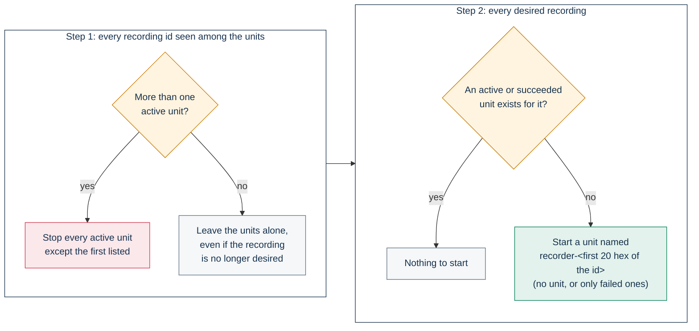

# Recorder controller

The recorder controller keeps one [multitrack recorder bot](../recorder/README.md) running for every
recording the portal wants captured. It is a small, long-running Node.js process. It reads the desired
state from the portal, compares it with the recorder units that exist, and starts or removes units until
the two match. It is part of per-participant recording, the optional capture path that gives AI
post-production a separate audio track for each participant who speaks
([ADR-013](../../docs/adr/013-multitrack-speaker-attribution.md)).

This page describes the component as implemented. The recording model, the consent gates and the bot's
claim flow are in [Recording](../../docs/architecture/recording.md#per-participant-audio-with-the-multitrack-recorder).
The Helm values that turn the path on are in
[Setting up recording](../../docs/operations/recording-setup.md#per-speaker-audio-with-the-recorder-bot).

## Purpose

- **One unit per wanted recording.** A unit is a Kubernetes `Job` or a Docker container that runs the
  recorder bot for one `recordingId`.
- **The portal decides, the controller converges.** The portal decides which events need a recorder in
  `GET /api/internal/recorder-desired`: events in status `LIVE` with `recordingEnabled`,
  `aiTranscriptEnabled` and `multitrackRecordingEnabled` all on. For each one the portal makes sure a
  multitrack `Recording` row exists and returns its id. The controller never reads the database and knows
  nothing about consent or storage.
- **It never stops a recorder because its event ended.** It stops units only to remove duplicates. When
  an event leaves `LIVE`, the controller leaves its unit alone. The bot ends by itself when the room stays
  empty or reaches its duration cap ([Capture inside the bot](../../docs/architecture/recording.md#capture-inside-the-bot)).
- **The same logic on a cluster and on a single VM.** Every decision is made by one pure function. Two
  runners turn those decisions into Kubernetes or Docker API calls.

## How it works

### The reconcile loop

```mermaid
flowchart LR
  timer["Interval tick<br/>at startup, then every<br/>RECONCILE_INTERVAL_MS"]:::trigger
  dispatch["POST /dispatch<br/>from the portal,<br/>best effort"]:::trigger
  gate{"A reconcile<br/>already running?"}:::decision
  drop["Trigger dropped:<br/>the next tick covers it"]:::neutral
  desired["Desired state<br/>GET /api/internal/recorder-desired<br/>x-api-key: CRON_API_KEY"]:::portal
  actual["Actual state<br/>runner.list(): units labeled<br/>app.kubernetes.io/component=recorder"]:::ctrl
  diff["reconcile(desired, actual)<br/>pure function in reconcile.ts"]:::ctrl
  create["runner.start()<br/>one per missing recording"]:::create
  del["runner.stop()<br/>one per duplicate unit"]:::delete
  k8s["Kubernetes runner<br/>a Job copied from the suspended<br/>&lt;fullname&gt;-recorder CronJob"]:::media
  docker["Docker runner, optional<br/>a container started<br/>through the Docker socket"]:::ext

  timer --> gate
  dispatch --> gate
  gate -- "yes" --> drop
  gate -- "no" --> desired
  gate -- "no" --> actual
  desired --> diff
  actual --> diff
  diff --> create
  diff --> del
  pick{"Which runner?<br/>RUNNER"}:::decision
  create --> pick
  del --> pick
  pick -- "kubernetes (default)" --> k8s
  pick -. "docker" .-> docker

  classDef trigger fill:#EEF1F4,stroke:#5C6F82,color:#17324D,stroke-width:1px
  classDef decision fill:#FFF4E0,stroke:#CC7A00,color:#17324D,stroke-width:1px
  classDef neutral fill:#F5F7F9,stroke:#5C6F82,color:#17324D,stroke-width:1px
  classDef portal fill:#E6F0FA,stroke:#0066CC,color:#17324D,stroke-width:2px
  classDef ctrl fill:#E8EDF3,stroke:#17324D,color:#17324D,stroke-width:2px
  classDef create fill:#E3F2EC,stroke:#008055,color:#17324D,stroke-width:1px
  classDef delete fill:#FBE8EB,stroke:#D1344C,color:#17324D,stroke-width:1px
  classDef media fill:#E0F5F5,stroke:#00A3A3,color:#17324D,stroke-width:2px
  classDef ext fill:#F5F7F9,stroke:#5C6F82,color:#17324D,stroke-width:1px,stroke-dasharray:5 3
```



### Triggers

- **Level-triggered: the backbone.** One reconcile runs at startup, then one every
  `RECONCILE_INTERVAL_MS` (default `30000`). The loop repairs lost triggers and catches up after a
  controller restart.
- **Edge-triggered: for latency.** `POST /dispatch` answers `202` at once and starts a reconcile in the
  background. The portal calls it, fire-and-forget and with no body, from
  `/api/internal/jvb-desired-replicas`. It does so when a JVB scaler tick moves at least one event from
  `PROVISIONING` to `LIVE` and the app has `RECORDER_CONTROLLER_URL` set. A failed call is only logged by
  the app (`[jvb] dispatch recorder best-effort fallito`).
- **What waits for the tick.** An event that becomes `LIVE` any other way waits up to one interval: a
  status set through the event API, a revival (see
  [Event lifecycle](../../docs/architecture/event-lifecycle.md)), or an event whose `recordingEnabled`,
  `aiTranscriptEnabled` or `multitrackRecordingEnabled` is switched on while it is already `LIVE`.
  Instant calls start with these flags off. Every event waits for the tick when the JVB scaler is off.
  The Compose stack has no scaler, so there the loop is the only trigger.
- **Serialized.** Only one reconcile runs at a time. A trigger that arrives while one is running is
  dropped, not queued, and the next tick covers it.

A reconcile reads the desired list and the runner's units in parallel. If either read fails, nothing
changes and the error is logged. Each start and stop is attempted on its own: a failure is logged and the
others still run.

### Reconcile rules

`src/reconcile.ts` exports `reconcile(desired, actual)`, which returns `{ toCreate, toDelete }`. It does no
I/O and is covered by unit tests.



- Units are matched to recordings by the `pa-webinar.it/recording-id` label. A unit without it is ignored.
- Unit names are deterministic: `recorder-` followed by the first 20 hexadecimal characters of the
  `recordingId` (`src/labels.ts`). A start that finds the name taken counts as success, which makes starts
  idempotent.
- Deterministic names and serialized reconciles mean the controller cannot create two units for one
  recording by itself. Step 1 removes duplicates created some other way, for example a unit copied by
  hand with the same labels under another name.
- The controller never deletes a finished unit. The runner's own cleanup removes it.

Each runner maps what it sees to three phases:

| Phase | Kubernetes `Job` | Docker container |
|---|---|---|
| `succeeded` | `status.succeeded > 0` | Exited, with a status of `Exited (0)` |
| `failed` | `status.failed > 0`, even while a retry pod is still running | Exited with any other code, or `dead` |
| `active` | Anything else, pending included | Anything else (`created`, `running`, `restarting` and so on) |

### When a recorder ends

The controller compares only "wanted" with "exists", so what follows a bot's exit depends on how long the
finished unit stays visible:

| Situation | Kubernetes | Docker |
|---|---|---|
| The bot exits normally, the event is still `LIVE` | The succeeded `Job` blocks a new start until `ttlSecondsAfterFinished` (600 s in `values.yaml`) deletes it. Then a new run starts for the same recording | The container is removed on exit (`AutoRemove`), and a new run starts at the next reconcile |
| The bot fails | Kubernetes retries inside the Job (`recorder.backoffLimit`, `1` in `values.yaml`; node disruptions do not count, through the template's `podFailurePolicy`). The controller's replacement hits the existing name, so it starts only after the TTL deletes the failed Job | A new container starts at the next reconcile. A bot that fails at startup restarts on every tick for as long as the event is `LIVE` |
| The bot never starts (for example, the image cannot be pulled) | The Job counts as `active`. Nothing replaces it until Kubernetes ends the Job at `recorder.activeDeadlineSeconds` (6 hours in `values.yaml`) and the TTL deletes it | If creation fails, nothing is left behind and the next tick tries again. A container that was created but failed to start stays `created`, counts as `active` and blocks the recording until it is removed by hand |
| The event leaves `LIVE` | Nothing. The running bot finishes by itself | Nothing |

A second run for the same recording stores its tracks under the same `Recording`. What that means for
transcription is in Recording's
[known limitations](../../docs/architecture/recording.md#known-limitations).

## Runners

`RUNNER` selects the runner. Both implement `RecorderRunner` (`src/runner.ts`) with three calls:
`list()`, `start(desired)` and `stop(handle)`.

### Kubernetes (`RUNNER=kubernetes`, the default)

`src/k8s.ts` uses `@kubernetes/client-node` and only the standard `batch/v1` API, so it runs on any
conformant cluster.

- **Credentials.** The runner authenticates with the in-cluster ServiceAccount (`loadFromCluster()`). It
  never reads a kubeconfig, so it works only inside a pod.
- **List.** It lists the Jobs in `NAMESPACE` labeled `app.kubernetes.io/component=recorder`.
- **Start.** It reads the suspended CronJob named by `RECORDER_CRONJOB_NAME` (the chart renders it as
  `<fullname>-recorder`) and copies its `jobTemplate.spec`. It sets `RECORDING_ID` and `EVENT_ID` on the
  first container, replacing any existing values. Then it creates a `Job` named `recorder-<id>`.
  The Job and its pod template get exactly three labels, `app.kubernetes.io/component=recorder`,
  `pa-webinar.it/recording-id` and `pa-webinar.it/event-id`. The pod template's metadata is replaced, so
  the template's own labels and annotations are not carried over. The bot's image, resources, deadlines,
  security context and volumes all come from the template. Change them through the chart's `recorder.*`
  values ([Recorder values](../../docs/operations/recording-setup.md#recorder-values)), not in the
  controller.
- **Stop.** It deletes the Job with `propagationPolicy: Background`, so the Job's pods go too. A `404`
  counts as success.

How the chart uses a suspended CronJob as a template is described in
[Scheduled and background jobs](../../docs/architecture/background-jobs.md#suspended-cronjobs-as-job-templates).

### Docker (`RUNNER=docker`)

`src/docker.ts` uses `dockerode`. It serves a single VM without Kubernetes.

- **Engine access.** The runner talks to the Docker socket, `/var/run/docker.sock` by default. The client
  library also honors `DOCKER_HOST`.
- **List.** It lists every container, running or stopped, labeled `app.kubernetes.io/component=recorder`.
  The handle is the container's name.
- **Start.** It creates and starts a container from `RECORDER_IMAGE`, named `recorder-<id>` and carrying
  the same three labels. The container has `AutoRemove` on and joins the network in `DOCKER_NETWORK`, if
  set. Its environment is every `RECORDER_ENV_<NAME>` variable of the controller, passed as `<NAME>`, plus
  `RECORDING_ID` and `EVENT_ID`. Nothing else is passed and there is no template, so the passthrough must
  carry everything the bot needs ([Recorder environment in Docker mode](#recorder-environment-in-docker-mode)).
  No volume is mounted: the bot writes its tracks inside the container, and they disappear with it if the
  upload fails. No CPU or memory limits are set. A `409` on the name counts as success.
- **Images.** The runner never pulls. `RECORDER_IMAGE` must already be on the host, pulled or built
  beforehand; otherwise every start fails with the engine's "no such image" error. A moving tag such as
  `:dev` stays at whatever version the host last pulled.
- **Stop.** It force-removes the container. A `404` counts as success.

## Credentials and trust

- **The controller mints nothing.** It adds only `RECORDING_ID` and `EVENT_ID` to each unit. The portal
  mints the bot's Jitsi token and upload URLs when the bot calls `POST /api/internal/recorder-claim` and
  `/api/internal/recorder-upload-url`, scoped to that one recording
  ([The claim model](../../docs/architecture/recording.md#the-claim-model)).
- **Where the bot's static secrets come from.** On Kubernetes the chart renders them into the CronJob
  template as Secret references (`CRON_API_KEY` and, for the invisible bot, the hidden-domain XMPP
  account), and the controller never sees their values. In Docker mode the controller holds them itself,
  as `RECORDER_ENV_*` variables, and hands them to every bot.
- **`CRON_API_KEY` is still a secret.** The controller uses it only to read the desired state, but it is
  the installation's shared machine key. It also opens every other `/api/internal/*` and `/api/cron/*`
  route, `recorder-claim` included, as well as `GET /api/metrics` and the recording webhook
  (`POST /api/webhooks/recording`), where it travels as a bearer token; the webhook also requires its
  signature when `RECORDING_WEBHOOK_SECRET` is set
  ([Machine credentials](../../docs/architecture/identity-and-access.md#machine-credentials)). Protect the
  controller like any other holder of that key.
- **The HTTP endpoints are unauthenticated.** `POST /dispatch` only makes the controller re-read the
  desired state, and `GET /healthz` returns `ok`. Neither changes what is wanted. The chart exposes them
  on a `ClusterIP` Service only.
- **Kubernetes.** The controller gets a namespaced Role and nothing cluster-wide
  ([Kubernetes permissions](#kubernetes-permissions)). The bot pods get no ServiceAccount token
  (`automountServiceAccountToken: false` in the template).
- **Docker.** Access to the Docker socket is root-equivalent on the host. Whoever controls the controller
  controls every container on the VM.

## Configuration

Every setting comes from an environment variable, read once at startup (`src/config.ts`). A missing
required variable or an unknown `RUNNER` stops the process with an error.

| Variable | Required | Default | Description |
|---|---|---|---|
| `RUNNER` | No | `kubernetes` | `kubernetes` or `docker`. Any other value is an error |
| `PORTAL_URL` | Always | | Base URL of the portal as the controller reaches it. Trailing slashes are removed. The chart sets the internal Service URL, `http://<fullname>:<service.port>` |
| `CRON_API_KEY` | Always | | Sent as `x-api-key` to `recorder-desired` |
| `RECONCILE_INTERVAL_MS` | No | `30000` | Interval of the level-triggered loop, in milliseconds. It is not validated: an empty or non-numeric value makes Node.js run the loop back to back |
| `PORT` | No | `8080` | Port of the HTTP server (`/dispatch`, `/healthz`) |
| `NAMESPACE` | With `RUNNER=kubernetes` | | Namespace where recorder Jobs are listed and created. The chart sets the release namespace |
| `RECORDER_CRONJOB_NAME` | With `RUNNER=kubernetes` | | Suspended CronJob used as the Job template. The chart sets `<fullname>-recorder` |
| `RECORDER_IMAGE` | With `RUNNER=docker` | | Recorder bot image to start. It must be present on the host |
| `DOCKER_NETWORK` | No, Docker only | | Network the bot containers join, so that they can reach the portal and Jitsi |
| `RECORDER_ENV_<NAME>` | See the next table, Docker only | | Passed to every bot container as `<NAME>` |
| `DOCKER_HOST` | No, Docker only | The local socket | Standard Docker client variable, honored by `dockerode` |

Variables that belong to the other runner are ignored.

### Recorder environment in Docker mode

The bot reads its own settings from its environment ([`infra/recorder/README.md`](../recorder/README.md)).
In Docker mode they reach it only through `RECORDER_ENV_*`:

| Bot variable | Set on the controller as | Needed |
|---|---|---|
| `JITSI_DOMAIN` | `RECORDER_ENV_JITSI_DOMAIN` | Yes. A Jitsi host that the bot's container reaches over HTTPS, with a certificate its browser trusts |
| `PORTAL_URL` | `RECORDER_ENV_PORTAL_URL` | Yes. The portal as seen from the bot's network, for example `http://app:3000` in Compose |
| `CRON_API_KEY` | `RECORDER_ENV_CRON_API_KEY` | Yes. The same value as the app's |
| `OUTPUT_DIR`, `IDLE_TIMEOUT_SEC`, `INITIAL_GRACE_SEC`, `MAX_DURATION_SEC` | `RECORDER_ENV_` plus the name | No. The image and bot defaults apply. The bot's initial grace is 900 s, where the chart sets 300 s (`recorder.initialGraceSec`): pass `RECORDER_ENV_INITIAL_GRACE_SEC=300` for the same behavior |
| `JITSI_XMPP_DOMAIN`, `JITSI_XMPP_USER`, `JITSI_XMPP_PASSWORD` | `RECORDER_ENV_` plus the name | Only for the invisible bot ([The invisible bot](../../docs/architecture/recording.md#the-invisible-bot-hidden-prosody-domain)) |

In Kubernetes mode none of this applies: the chart renders the bot's environment into the CronJob template.

## Kubernetes permissions

The chart binds the controller's ServiceAccount to a namespaced Role
([`recorder-controller.yaml`](../helm/pa-webinar/templates/recorder-controller.yaml)). Nothing is
cluster-wide.

| API group | Resources | Verbs granted | Used by the code |
|---|---|---|---|
| `batch` | `cronjobs` | `get`, `list` | `get`, to read the template on every start |
| `batch` | `jobs` | `get`, `list`, `create`, `delete` | `list`, `create`, `delete` |
| core (`""`) | `pods`, `pods/log` | `get`, `list` | Not used by the current code |

## Enabling the controller

### With the Helm chart

The controller is off by default. Setting `recorder.enabled: true`, with `recorder.controller.enabled` at
its default of `true`, renders:

- a ServiceAccount, Role and RoleBinding named `<fullname>-recorder-controller`;
- a one-replica Deployment with the `Recreate` strategy. There is no leader election: the reconcile is
  idempotent, and one replica is enough;
- a `ClusterIP` Service on `recorder.controller.port`. Its port is named `ctrl` on purpose. The controller
  pod carries the release's selector labels, which the app Service also selects on, and the app Service
  targets the port named `http`. The different name keeps the controller out of the app's endpoints;
- the suspended CronJob `<fullname>-recorder`, which the controller uses as its template.

Whenever `recorder.enabled` is true, the app also gets
`RECORDER_CONTROLLER_URL=http://<fullname>-recorder-controller:<port>`.

The chart sets every controller variable itself: `RUNNER=kubernetes`, `NAMESPACE`, `PORTAL_URL`,
`RECORDER_CRONJOB_NAME`, `PORT` and `RECONCILE_INTERVAL_MS`, plus `CRON_API_KEY` from the application
Secret. The `recorder.controller.*` values that feed them, with their defaults, are in
[Recorder values](../../docs/operations/recording-setup.md#recorder-values).

The pod follows `app.nodeSelector` and `app.tolerations`, so it runs where the app runs. It runs as UID
1000 and non-root, with a read-only root filesystem, all capabilities dropped and the `RuntimeDefault`
seccomp profile. Readiness and liveness probes call `GET /healthz`.

The image is built from this folder's `Dockerfile` on `node:22-bookworm-slim`, as the unprivileged `node`
user, with no browser in it. Only the development workflow publishes it, as `:dev` and `:dev-<sha>`. A
release tag produces no controller image, and rolling the app back does not roll the controller back (see
[CI, images and releases](../../docs/development/ci-and-release.md#components-published-only-from-dev) and
[Upgrades and rollback](../../docs/operations/upgrades.md#making-the-dev-components-roll-back)).

#### NetworkPolicy

With `networkPolicy.enabled: true`, the chart's policy
([`networkpolicy.yaml`](../helm/pa-webinar/templates/networkpolicy.yaml)) selects only the app pods: the
release's pods that carry no `app.kubernetes.io/component` label. Neither the controller pod (`component: recorder-controller`) nor the
bot pods are selected, so their own egress, the controller's calls to the Kubernetes API included, is not
restricted. Between the app and the controller both directions are open:

- the app's egress rules include the controller pod on `recorder.controller.port`, so `/dispatch` arrives;
- the app's ingress admits every pod that carries the release's selector labels on port 3000, and the
  controller pod carries them, so `recorder-desired` answers.

The bot pods are the gap. They carry only the three labels the controller sets
([Kubernetes](#kubernetes-runnerkubernetes-the-default)), not the release's selector labels, so the app's
ingress does not admit them. The bot's first call to `PORTAL_URL`, `POST /api/internal/recorder-claim`, is
dropped, the bot exits and nothing is recorded. The calls to `recorder-upload-url` and
`multitrack-manifest` would be dropped the same way. Admit the bot pods with an extra ingress rule:

```yaml
networkPolicy:
  ingress:
    extraRules:
      - from:
          - podSelector:
              matchLabels:
                app.kubernetes.io/component: recorder
        ports:
          - protocol: TCP
            port: 3000
```

The bots get through without the rule only when `networkPolicy.ingress.fromNamespaceSelectors` and
`fromPodSelectors` are both empty, which opens the app's port to every source. The recording side of the
policy is in [Network policy](../../docs/operations/recording-setup.md#network-policy).

<a id="with-docker-compose-on-a-single-vm"></a>

### With Docker Compose

The Compose file defines a `recorder-controller` service under the `recorder` profile:

```bash
docker compose --profile recorder up --build -d
```

The service builds from this folder and runs with `RUNNER=docker`. It mounts `/var/run/docker.sock` and
starts bots from `ghcr.io/italia/pa-webinar-recorder:dev` on the network
`${COMPOSE_PROJECT_NAME:-pa-webinar}_default`, which Compose resolves to the project's default network.
The `app` service already sets `RECORDER_CONTROLLER_URL=http://recorder-controller:8080`, but Compose runs
no JVB scaler, so only the 30-second loop starts recorders.

> **Warning:** the mounted Docker socket gives the controller root-equivalent control of the host, and
> gives the same control to anyone who compromises it. Enable the profile only on a VM dedicated to
> PA Webinar, and only when per-participant recording is wanted.

**As shipped, the profile records nothing.** The bot's environment is incomplete: the service passes
only `RECORDER_ENV_JITSI_DOMAIN`, set to a host the bot cannot use, and not the `PORTAL_URL` and
`CRON_API_KEY` the bot requires. A bot without them exits at startup, and because its event is still
wanted the controller starts a new one on every tick. The app also has no recordings storage in Compose,
and the Compose `cron` loop never purges tracks. The settings to add are in
[Docker Compose: the `recorder` profile](../../docs/operations/recording-setup.md#docker-compose-the-recorder-profile).
Two further gaps belong to the controller itself, and each stops it on its own:

1. **Socket permission.** The image runs as the unprivileged `node` user (UID 1000), and the service adds
   no supplementary group. On a Linux host where the socket belongs to `root:docker` with mode `0660`,
   the usual packaging, every Docker call fails with `EACCES`. Add the socket's group to the service with
   `group_add`, using the group id that `stat -c %g /var/run/docker.sock` prints.
2. **Bot image.** `docker compose up` does not pull `RECORDER_IMAGE`, because it is not a Compose
   service, and the runner never pulls. Run `docker pull ghcr.io/italia/pa-webinar-recorder:dev` on the
   host first, or build the bot from `infra/recorder` and point `RECORDER_IMAGE` at the local tag.

## Operating the controller

The Kubernetes examples use `pa-webinar` as both the release and the namespace, which makes `<fullname>`
equal to `pa-webinar`.

```bash
# Controller log
kubectl -n pa-webinar logs deploy/pa-webinar-recorder-controller

# Recorder units, with the event each one belongs to
kubectl -n pa-webinar get jobs -l app.kubernetes.io/component=recorder -L pa-webinar.it/event-id

# Force a reconcile now (a restart also runs one at startup)
kubectl -n pa-webinar port-forward svc/pa-webinar-recorder-controller 8080:8080 &
curl -X POST http://localhost:8080/dispatch
```

On a single VM:

```bash
docker compose logs -f recorder-controller
docker ps -a --filter label=app.kubernetes.io/component=recorder
```

Log lines start with `[controller]`. The messages are in Italian, so search for these strings:

| Log text | Meaning |
|---|---|
| `runner=<kind> reconcile ogni <ms>ms` | Startup: the runner in use and the loop interval |
| `in ascolto su :<port>` | The HTTP server is listening |
| `avviato recorder per recording=<id>` | A start call returned without error: a unit was created, or one with the same name already existed. On Kubernetes the line repeats on every tick while a failed Job waits for its TTL |
| `fermato recorder duplicato <name>` | A duplicate unit was removed |
| `start fallita per <id>` or `stop fallita per <name>` | A runner call failed. It is retried at the next reconcile |
| `reconcile (<trigger>) errore` | A whole reconcile failed, usually because the portal was unreachable. `<trigger>` is `startup`, `interval` or `dispatch` |
| `errore fatale` | The process could not start, usually because of a missing variable (`variabile d'ambiente mancante`) or an invalid `RUNNER` |

To stop new recorders without touching the chart, scale the Deployment to zero. Running bots carry on
until they finish. The next `helm upgrade` sets the replica count back to one. When a bot does not join, or
joins visibly, see
[Troubleshooting](../../docs/operations/troubleshooting.md#the-recorder-bot-joins-visibly-or-not-at-all).

## Development and tests

This folder is a standalone npm project with its own lockfile, outside the repository's npm workspaces.

```bash
cd infra/recorder-controller
npm ci
npx tsc --noEmit -p tsconfig.json   # type check (test files are excluded)
npm test                            # Vitest
npm run build                       # compile src/ to dist/; `npm start` runs dist/index.js
```

CI runs the type check and the tests in the "Unit Tests (recorder, controller)" job of `ci.yml`. The
development workflow (`dev.yml`) builds and pushes the image when this folder changes. See
[Testing](../../docs/development/testing.md) and
[CI, images and releases](../../docs/development/ci-and-release.md).

The unit tests cover the pure reconcile function and the helpers `collectRecorderEnv`, `containerPhase`
and `recorderHandleName`. The Kubernetes runner, the Docker runner's engine calls, the HTTP server and
the portal client have no unit tests. The Kubernetes runner loads in-cluster credentials only, so validate
changes to it on a cluster, with a test event that has per-participant recording on.

| File | Role |
|---|---|
| `src/index.ts` | Entry point: reads the configuration, builds the runner, serves `/dispatch` and `/healthz`, serializes reconciles and runs the interval |
| `src/config.ts` | Reads and checks the environment; `collectRecorderEnv()` gathers the `RECORDER_ENV_*` passthrough |
| `src/reconcile.ts` | The pure decision function |
| `src/runner.ts` | The `RecorderRunner` interface |
| `src/k8s.ts` | `KubernetesRunner` |
| `src/docker.ts` | `DockerRunner` |
| `src/labels.ts` | Label keys and the deterministic unit name, shared by both runners |
| `src/portal.ts` | Client for `GET /api/internal/recorder-desired` |

When you change the controller, keep every decision in `reconcile.ts` and test it there. The runners stay
thin I/O. A new runner implements `RecorderRunner` and reuses `labels.ts`, so that listing and
de-duplication behave the same everywhere.

## Known limitations

- **The Compose profile does not work as shipped.** See [With Docker Compose](#with-docker-compose).
- **Slow replacement on Kubernetes.** A failed or finished Job keeps its deterministic name until
  `ttlSecondsAfterFinished` deletes it, so a replacement waits for the TTL. A bot pod that never starts
  holds the recording until `activeDeadlineSeconds`.
- **Restart storms on Docker.** A bot that exits at once is started again on every tick while its event is
  `LIVE`. Bot containers have no resource limits.
- **Stuck containers on Docker.** A container that was created but failed to start counts as active and
  blocks its recording until someone removes it.
- **No image management on Docker.** The runner never pulls, so the host keeps whatever image it has.
- **Dropped edge triggers.** A `/dispatch` that arrives during a reconcile is dropped. The next tick
  catches up, at most one interval later.
- **Bot pods blocked by the NetworkPolicy.** With `networkPolicy.enabled: true`, bot pods cannot reach
  the portal, because they lack the release's selector labels that the app's ingress admits. Nothing is
  recorded until a `networkPolicy.ingress.extraRules` entry admits them ([NetworkPolicy](#networkpolicy)).
- **Units outside the release.** Recorder Jobs carry no release labels and no owner reference.
  `helm uninstall` leaves running Jobs in place until they finish and their TTL expires. Two releases in
  one namespace list each other's units. This is harmless, because their recording ids differ.
- **Shallow health check.** `/healthz` reports only that the process is up. A controller that cannot reach
  the portal stays ready. Watch the log for `reconcile (…) errore`.
- **A dangling URL.** With `recorder.enabled: true` and `recorder.controller.enabled: false`, the app still
  gets `RECORDER_CONTROLLER_URL`. Each `LIVE` promotion by the scaler then logs a failed best-effort
  dispatch.

## Related pages

- [Recording](../../docs/architecture/recording.md): both capture paths, the claim model and the lifecycle.
- [Setting up recording](../../docs/operations/recording-setup.md): the values that turn each path on.
- [Multitrack recorder bot](../recorder/README.md): the unit this controller starts.
- [Scheduled and background jobs](../../docs/architecture/background-jobs.md#long-running-controllers): where the controller sits among the platform's background work.
- [ADR-013](../../docs/adr/013-multitrack-speaker-attribution.md): why per-participant recording exists.
