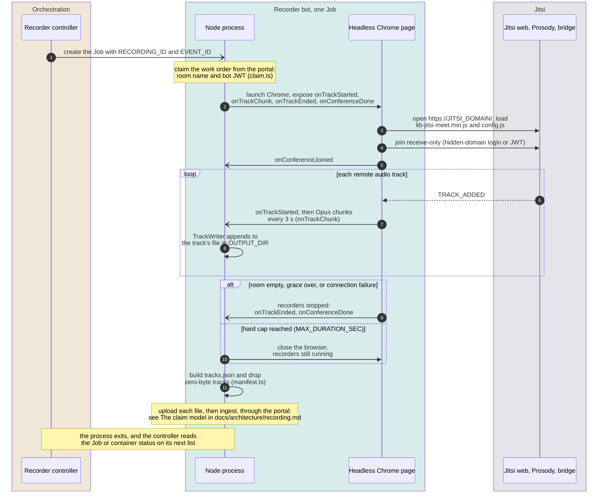
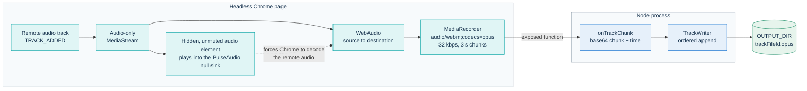

# Multitrack recorder bot

The recorder bot joins a live PA Webinar event as a receive-only participant
and records **one audio file per remote audio track**. The AI post-production
worker transcribes each file on its own, so every transcript segment carries
the name of the person who spoke, and overlapping speech stays separate.

- **Receive-only.** It publishes no microphone or camera. When the installation
  configures Prosody's hidden domain, Jitsi hides it from every participant.
  Otherwise it appears under a reserved display name, which the portal's own
  counts and lists leave out.
- **One file per remote audio track.** Every new remote audio track gets its
  own file, so a later track never overwrites an earlier one.
- **One bot at a time per recording.** The [recorder controller](../recorder-controller/README.md)
  starts one Kubernetes Job (or one Docker container) for each `LIVE` event that
  has per-participant recording on. The bot exits by itself when the room
  empties. If a run ends while the event is still `LIVE`, the controller starts
  another run for the same recording
  ([Reconcile rules](../../docs/architecture/recording.md#reconcile-rules)).
- **No UI and no listening port.** It only makes outbound connections, to the
  portal, to Jitsi and to object storage.

This README describes the implementation. How the two recording paths fit
together, the portal-side contracts and the trust boundaries are in
[Recording: composite video and per-speaker audio](../../docs/architecture/recording.md).
The Helm values that turn the bot on are in
[Setting up recording](../../docs/operations/recording-setup.md#per-speaker-audio-with-the-recorder-bot),
and the decision behind it is
[ADR-013](../../docs/adr/013-multitrack-speaker-attribution.md).

## Why headless Chrome

`lib-jitsi-meet`, the library the Jitsi web client is built on, is a browser
library. It relies on the DOM and on the browser's WebRTC stack
(`RTCPeerConnection`, `MediaStream`, `MediaRecorder`). The bot runs it where it
was designed to run: in headless Chrome, driven by Puppeteer. Jibri takes the
same approach.

- **The same stack as real participants.** Negotiation, the bridge channel and
  codecs behave as they do in a participant's browser. Per-track capture is a
  standard `MediaRecorder` on each remote audio track.
- **No vendored Jitsi code.** The bot loads `libs/lib-jitsi-meet.min.js` and
  `config.js` from the Jitsi web server it joins. The library therefore always
  matches the deployed Jitsi, and a Jitsi upgrade needs no new bot image.
- **Why not a Node WebRTC stack.** The alternatives and why they were set
  aside are in
  [ADR-013](../../docs/adr/013-multitrack-speaker-attribution.md#within-option-a-a-browser-not-a-node-webrtc-stack).
- **The cost.** The image carries Chrome and its system libraries, and each bot
  requests 1 CPU and 2 GiB (`recorder.resources` in
  `infra/helm/pa-webinar/values.yaml`).

The portal never uses `lib-jitsi-meet`: it embeds Jitsi through the IFrame API
([ADR-001](../../docs/adr/001-jitsi-iframe-api.md)). The recorder bot is the
sanctioned exception, together with test harnesses, because a bot has no user
interface to embed.

## One recording session

The diagram shows what happens inside one bot: the split between the Node
process and the Chrome page. The round-trips to the portal (claim, upload URLs,
ingest) are drawn in
[The claim model](../../docs/architecture/recording.md#the-claim-model).



1. **Start.** The controller starts the bot with `RECORDING_ID` and `EVENT_ID`.
   Nothing else in the bot's environment is specific to the run.
2. **Claim.** `claim.ts` gets the room name and a bot JWT from the portal, so
   the controller never holds a Jitsi or storage credential
   ([The claim model](../../docs/architecture/recording.md#the-claim-model)).
3. **Join.** `capture.ts` launches Chrome, opens `https://<JITSI_DOMAIN>/`,
   loads the library and the deployment's `config.js`, and joins the room. It
   uses the hidden-domain login when that is configured, and the JWT otherwise.
4. **Capture.** Every remote audio track gets its own `MediaRecorder`. Chunks
   stream to Node, which appends them to one file per track in `OUTPUT_DIR`.
5. **Manifest.** When the session ends, `manifest.ts` turns the per-track
   timing into `tracks.json`.
6. **Upload.** `upload.ts` uploads each file through a single-object URL that
   the portal signs for it, `tracks.json` last (see [Storage layout](#storage-layout)).
7. **Ingest.** `notifyPortal()` reports the uploaded tracks, and the portal
   stores them and enqueues transcription when the pipeline is on
   ([Ingest contract](../../docs/architecture/recording.md#ingest-contract)).

Every call to the portal carries `x-api-key: CRON_API_KEY`.

### Inside the browser, per track



- **The deployment's own configuration.** The bot passes the served
  `window.config` to the conference, so its bridge-channel settings match those
  of real clients. It overrides two things: ICE policy `all`, and no STUN or
  TURN. A `config.js` that forces relay-only ICE is meant for participants
  behind firewalls. The bot runs inside the network and reaches the bridge
  directly instead of looping back through the public TURN server
  ([Media path](../../docs/architecture/jitsi-integration.md#media-path)).
- **Receive-only.** The bot creates no local tracks. It asks the bridge for
  every participant (`lastN: -1`) and for video at height 0.
- **Why an audio element and a null sink.** Headless Chrome decodes a remote
  audio track only when a media element is also playing it, and plays only when
  it has an output device. Without both, `MediaRecorder` writes valid Opus that
  holds nothing but silence. Each track is therefore played by a hidden,
  unmuted `<audio>` element, and `entrypoint.sh` starts a PulseAudio null sink
  (`vsink`) before the bot. The sink is best-effort: if PulseAudio cannot
  start, the bot runs anyway.
- **Recorder settings.** `audio/webm;codecs=opus` at 32 kbps, with a 3-second
  timeslice. Chunks cross to Node as base64 through Puppeteer's exposed
  functions. `TrackWriter` appends them strictly in order and ignores chunks
  that arrive after its file is closed.
- **Track file ids.** Each `TRACK_ADDED` for a remote audio track gets a
  `trackFileId` of `<endpointId>-<n>`. The endpoint id is Jitsi's id for the
  participant's connection. `<n>` is a counter over all the tracks of the run.
- **Timing.** A track's origin is the moment its `MediaRecorder` starts
  (`onTrackStarted`), not its first chunk. Its end is the time of its last
  chunk. Together they give `startOffsetMs` and `durationMs` in the manifest.
- **Names.** Each track takes the participant's Jitsi display name, which the
  portal wrote into that participant's JWT.
- **Start-up.** The first page load is attempted up to four times, with a
  back-off of 2, 4 and 6 seconds, because a pod's network can settle after
  Chrome starts (`net::ERR_NETWORK_CHANGED`).

### When the session ends

| Trigger | Setting | What the bot does |
|---|---|---|
| Nobody visible arrives | `INITIAL_GRACE_SEC` | Leaves with nothing captured |
| The room stays empty after someone was seen | `IDLE_TIMEOUT_SEC` | Stops every recorder, flushes the last chunk, uploads |
| The session reaches the hard cap | `MAX_DURATION_SEC` | Closes the browser and uploads what was written |
| The connection or the conference fails | none | Stops, keeps and uploads what was captured |
| Kubernetes reaches `recorder.activeDeadlineSeconds` | Helm | Nothing: the pod is killed, and tracks not yet uploaded are lost. Keep `MAX_DURATION_SEC` below it |

Only visible remote participants count. The bot uses `getParticipants()` and
skips hidden ones, such as Jicofo's focus.

### Exit status

| Outcome | Exit code | Next |
|---|---|---|
| Joined, captured, uploaded and ingested | 0 | The Job completes |
| Joined, but nothing captured (the room stayed empty) | 0 | No upload and no ingest |
| Some uploads failed after their retries | 0 | Those tracks are skipped: `tracks.json` and the ingest list only the uploaded ones |
| Every track upload failed | 0 | Nothing is ingested. Only a warning in the log shows it |
| Never joined the conference, after the fallback if there is one | 1 | The Job fails and is retried |
| The claim, the `tracks.json` upload or the ingest is refused | 1 | The Job fails and is retried |

The **Next** column describes the Kubernetes runner. A failed pod is retried
up to `recorder.backoffLimit` times. Once the failed Job is cleaned up, the
controller starts a new run if the event is still `LIVE`
([Reconcile rules](../../docs/architecture/recording.md#reconcile-rules)).

With the Docker runner, containers are removed when they exit, so the
controller starts a new bot on its next reconcile (every
`RECONCILE_INTERVAL_MS`) for as long as the event is `LIVE`; there is no retry
limit. This holds for exit code 0 as well as 1. A bot that fails at start-up,
for example because `PORTAL_URL` or `CRON_API_KEY` is missing from the
controller's `RECORDER_ENV_*` variables, is therefore recreated in a loop.

The process ends with an explicit `process.exit`, because Chrome can keep
handles open after `browser.close()`, and the Job would otherwise stay running
until its deadline.

## Source layout

The rule: every piece of deterministic logic lives outside `capture.ts` and is
unit-tested with an injected `fetch`. `capture.ts` holds only the browser
orchestration and the file writer, and `vitest.config.ts` leaves it (and the
entry point) out of coverage.

| File | Role | Tests |
|---|---|---|
| `src/index.ts` | Entry point: reads the environment, claims, captures, falls back to the JWT, builds the manifest, uploads, ingests. Exports two pure helpers: `recorderJid`, which composes the bot's JID, and `shouldRetryWithJwt`, which decides the fallback | `src/jid.test.ts`, `src/retry.test.ts` |
| `src/claim.ts` | `claimWorkOrder()`: `POST /api/internal/recorder-claim`, returns the work order `{recordingId, eventId, roomName, jwt}` | `src/claim.test.ts` |
| `src/capture.ts` | `captureRoom()`: Puppeteer launch, the in-page bootstrap (connection, conference, one `MediaRecorder` per track, end-of-session timers) and `TrackWriter` | none: it needs a real conference |
| `src/paths.ts` | Storage keys and local file names, with segment sanitization | `src/paths.test.ts` |
| `src/manifest.ts` | `buildManifest()` and `serializeManifest()`: offsets, durations, zero-byte filtering, ordering | `src/manifest.test.ts` |
| `src/upload.ts` | `PresignStorageProvider` (one signed URL per object), `uploadRecording()` (bounded parallelism, retries, partial tolerance), `buildIngestBody()`, `notifyPortal()` | `src/upload.test.ts` |

`upload.ts` also contains a provider that writes under a prefix-signed base
URL (`SignedUrlStorageProvider`, selected by `createStorageProvider()` from
`RECORDING_UPLOAD_BASE_URL`) and a `NoopStorageProvider`. The entry point uses
neither. The tests use the no-op provider as a stand-in for storage.

## Configuration

The bot reads its settings from the environment. The timing defaults are in
`src/capture.ts`, the others in `src/index.ts`.

| Variable | Required | Default | Meaning |
|---|---|---|---|
| `RECORDING_ID` | yes | | The recording to claim. The controller injects it for each run |
| `EVENT_ID` | yes | | The event. Used in storage keys and in the ingest body. Injected for each run |
| `JITSI_DOMAIN` | yes | | Host, with an optional port, of the Jitsi web server. The bot opens `https://<JITSI_DOMAIN>/` |
| `PORTAL_URL` | yes | | Base URL of the portal, trailing slashes removed. The three internal endpoints are called under it |
| `CRON_API_KEY` | yes | | Sent as `x-api-key` on every portal call |
| `OUTPUT_DIR` | no | `/recordings` | Local folder for the track files before upload |
| `IDLE_TIMEOUT_SEC` | no | `90` | Seconds of empty room, after someone was seen, before the bot leaves |
| `INITIAL_GRACE_SEC` | no | `900` | Seconds to wait for the first visible participant. The chart sets `300` |
| `MAX_DURATION_SEC` | no | `14400` | Hard cap on one session (4 hours) |
| `JITSI_XMPP_USER` | no | | The recorder account on Prosody's hidden domain: a local part or a full JID |
| `JITSI_XMPP_DOMAIN` | no | | Prosody's hidden domain, appended to a local part |
| `JITSI_XMPP_PASSWORD` | no | | Password of the recorder account |

A missing required variable stops the bot at start-up, with an error that
names it. A timing value that is not a positive number is ignored, and the
default applies.

Where the values come from:

- **Kubernetes.** The suspended CronJob `<fullname>-recorder`, rendered from
  `recorder.*`, is the template for every Job. It sets `JITSI_DOMAIN`
  (`recorder.jitsiDomain`, falling back to `app.env.NEXT_PUBLIC_JITSI_DOMAIN`),
  `PORTAL_URL` (the app's internal service URL), `CRON_API_KEY` (from the
  release Secret) and `OUTPUT_DIR` on an `emptyDir` volume. It adds the timing
  variables when their values are set, and the three `JITSI_XMPP_*` variables
  when `recorder.hiddenDomain` is set. The full list of values is in
  [Recorder values](../../docs/operations/recording-setup.md#recorder-values).
- **Docker.** The controller passes `RECORDING_ID`, `EVENT_ID` and every
  `RECORDER_ENV_<NAME>` variable of its own environment as `<NAME>`. The
  shipped Compose file sets only `RECORDER_ENV_JITSI_DOMAIN`. What else a run
  needs is listed in
  [Docker Compose: the `recorder` profile](../../docs/operations/recording-setup.md#docker-compose-the-recorder-profile).

The Jitsi host must be served over HTTPS with a certificate that Chrome
trusts: the bot does not bypass certificate checks. The rest of what the bot
must reach is in
[What the bot must reach](../../docs/operations/recording-setup.md#what-the-bot-must-reach).

## Staying invisible

The bot joins in one of two ways:

| | Hidden-domain login | Portal JWT (default) |
|---|---|---|
| Turned on by | `recorder.hiddenDomain` and `recorder.xmppSecretName` | Nothing to configure |
| Identity | `<user>@<hiddenDomain>`, SASL login, no token | The claimed JWT: non-moderator, user id `rec-bot-<recordingId>` |
| Seen by participants | No. Every Jitsi client drops a participant whose JID is on `config.hiddenDomain`: no tile, no list entry, no join notification, not counted | Yes, under the reserved display name |
| Portal counts and lists | Unaffected: the bot never reaches the IFrame API | Excluded by name (`isHumanParticipant()` in `app/src/lib/jitsi/participants.ts`) |

The reserved display name is `RECORDER_DISPLAY_NAME` in
`app/src/lib/jitsi/participants.ts`, and the claim route writes it into the
bot's JWT. The bot does not read that constant. It sets its name itself, in
both modes, with `conference.setDisplayName()` and the `botDisplayName` default
in `src/capture.ts`, a separate copy of the same string. Change both together,
or the portal will start counting the bot.

The login is used only when the bot can form a JID and has a password. A
`JITSI_XMPP_USER` without `@` is combined with `JITSI_XMPP_DOMAIN`, and a full
JID is used as it is. A local part with no domain, or a missing password,
means the JWT.

The login also needs a pinned recorder account on Prosody and a MUC allowlist
entry for it; the values on both sides are in
[Make the bot invisible](../../docs/operations/recording-setup.md#make-the-bot-invisible),
and the mechanism in
[The invisible bot](../../docs/architecture/recording.md#the-invisible-bot-hidden-prosody-domain).

**Fallback.** A rejected login must not cost the event its audio. When the bot
never joined the conference with the hidden-domain login, `index.ts` runs the
whole capture again with the portal JWT, and the bot is visible for the rest of
the event. The check runs after the capture ends and looks at whether the bot
*joined*, not at whether it captured anything. A room that simply stayed empty
is therefore not retried. The bot does not reconnect from inside the page
either: there, a rejected login cannot be told apart from a connection lost in
mid-event, and a reconnect would make the bot reappear, visible, in front of
everyone.

**Compose.** The Compose file does not configure the hidden-domain login.
Bots started by the Docker runner join with the JWT and are visible, unless you
pass the three variables as `RECORDER_ENV_JITSI_XMPP_*` and prepare Prosody
as described in
[Make the bot invisible](../../docs/operations/recording-setup.md#make-the-bot-invisible).

## Storage layout

```text
recordings/multitrack/<eventId>/<recordingId>/
  audio/<trackFileId>.opus    one object per remote audio track
  tracks.json                 the manifest
```

- `paths.ts` builds every key. Each segment is sanitized to letters, digits,
  `_` and `-`, and any other character becomes `_`, so an endpoint id cannot
  escape the folder. The portal checks the prefix again on its side.
- The files are WebM containers carrying Opus. `.opus` is only a storage label,
  and the upload declares `Content-Type: audio/webm; codecs=opus`.
- The manifest holds `version` (`1`), `eventId`, `recordingId`, `roomName`,
  `recordingStartedAtMs` (the earliest track origin, in epoch milliseconds) and
  `tracks[]`. Each track entry holds `participantId`, `trackFileId`,
  `displayName`, `trackKey`, `startOffsetMs` and `durationMs`, sorted by start
  offset. An example is in
  [Storage layout and manifest](../../docs/architecture/recording.md#storage-layout-and-manifest).
- `displayName` is `null` when Jitsi reports no name for the participant.
- Tracks with zero bytes are dropped: they belong to a participant whose audio
  never produced data.
- Several entries can share a `participantId` when the same connection
  publishes a new audio track. Each has its own `trackFileId` and its own
  object. A participant who rejoins on a new connection gets a new endpoint id
  and appears as a separate `participantId`.
- Uploads run four at a time, with three attempts per object and a short
  back-off (300 ms, then 600 ms). Each attempt asks the portal for a new
  single-object URL, valid 30 minutes (`presignArtifactUpload` in
  `app/src/lib/storage/postprod.ts`). A refused presign, such as `409` for an
  `ARCHIVED` recording or `422` for an unconfined key, counts as a failed
  attempt. For a track the bot then skips it; for `tracks.json` the run fails.
  For Azure Blob URLs (hosts containing `blob.core.windows.net`) the `PUT`
  carries `x-ms-blob-type: BlockBlob`.
- Before uploading, the bot recomputes every `trackKey` with `paths.ts`. A
  mismatch is a programming error, and it stops the run before any upload.

The ingest body carries the same data for each track, shaped for the portal:
`blobKey` (the `trackKey`), `mimeType`, `sizeBytes`, `startOffsetMs` and
`durationMs`, with `participantId` and `displayName`. The `trackFileId` travels
inside `blobKey`. The portal ingests that body and never reads the stored
`tracks.json`.

This layout is a contract between `paths.ts` and the portal: the confinement
check in `recorder-upload-url` (`app/src/lib/recorder/blob-key.ts`, which also
fixes the allowed characters and depth), the prefix check in
`multitrack-manifest`, and `MULTITRACK_PREFIX` in
`app/src/lib/recorder/lifecycle.ts`. Change them together. The post-production
worker receives signed URLs and does not depend on the layout.

## Personal data

The isolated voice of one person is sensitive personal data, and the bot
handles it with the least it needs:

- **Names in plain text, keys elsewhere.** Display names travel in plain text
  in `tracks.json` and in the ingest body. This is deliberate: the bot holds no
  PII encryption key, so that key never reaches the media workload. The portal
  encrypts each name when it ingests the manifest, into
  `RecordingTrack.displayName`.
- **Tracks are an intermediate input.** `multitrack-purge` deletes the audio
  once the transcription has finished, unless the event keeps the tracks
  (**Keep per-participant tracks**). Durations, legal bases and consent are in
  [Recordings, voice data and AI outputs](../../docs/privacy/recordings-and-ai.md).
- **Orphan sweep.** `recordings-reconcile` knows only the composite-video
  links (`Event.recordingUrl`, `CallSession.recordingUrl`,
  `CallSession.recordingFilename`). Every object under `recordings/multitrack/`
  is therefore an orphan to it: `tracks.json` and any track audio still
  present, including tracks kept with **Keep per-participant tracks**. They
  are deleted after the orphan grace period unless an administrator marks them
  **Keep** ([Orphans](../../docs/operations/recording-setup.md#orphans)).
- **Local files.** In Kubernetes the tracks are written to an `emptyDir`
  capped by `recorder.workSizeLimit`, which is deleted with the pod.
- **Logs.** The bot logs one line per captured track with its `trackFileId`,
  endpoint id and display name. Job logs therefore contain participant names:
  keep `recorder.ttlSecondsAfterFinished` short and cover the logs in your
  retention policy.
- **The bot does not decide whether to record.** The portal lists an event only
  when recording, automatic transcription and per-participant recording are
  all on for it. Consent is collected by the portal
  ([Consent gates](../../docs/architecture/recording.md#consent-gates)).

## Development

The package is standalone: it has its own lockfile and is not an npm
workspace. `npm ci` also downloads the Chrome build that the installed
Puppeteer expects.

Use the Node.js version that CI uses for these checks (`node-version` in the
`test-infra-node` job of `.github/workflows/ci.yml`). The image runs on the
base named in the `Dockerfile`, which can be a different release, so keep the
code working on both.

```bash
cd infra/recorder
npm ci
npx tsc --noEmit -p tsconfig.json && npm test   # what CI runs
```

That pair is the **Unit Tests (recorder, controller)** job in
`.github/workflows/ci.yml`, and the local check to run whenever you change this
folder ([Testing](../../docs/development/testing.md#recorder-bot-and-controller)).
The package has no coverage floor.

| Script | Does |
|---|---|
| `npm run typecheck` | `tsc --noEmit -p tsconfig.json` |
| `npm test` / `npm run test:watch` | Vitest, once or in watch mode |
| `npm run build` | Compiles `src/` to `dist/`, test files excluded |
| `npm start` | Runs `dist/index.js` |
| `npm run dev` | Runs `src/index.ts` with `tsx`. Needs the environment above, a reachable portal and a real conference |

To run the bot by hand against a real installation, `RECORDING_ID` must be an
existing recording. `GET /api/internal/recorder-desired`, called with
`x-api-key`, makes sure a multitrack recording exists for every qualifying
`LIVE` event (reusing the existing one) and returns the ids. Run a bot by hand
only where no controller is running. Otherwise two bots record the same
recording, and they can overwrite each other's objects, because the claim takes
no lock and both track counters start at 0. On a machine without an audio
output device, headless Chrome may record silence: that is why the image
starts a null sink.

### The container image

From the repository root:

```bash
docker build -t pa-webinar-recorder:local infra/recorder
```

- A two-stage build on `node:22-bookworm-slim`. The build stage installs
  `unzip`, which Puppeteer needs to unpack Chrome, and fails if no Chrome
  executable ends up in `/app/.cache/puppeteer`, because an incomplete download
  otherwise surfaces only when a bot starts at an event.
- The runtime stage adds Chrome's system libraries and PulseAudio, copies the
  Chrome cache, `node_modules` and `dist/`, and runs as a non-root user.
  `HOME` and `XDG_RUNTIME_DIR` point under `/tmp`, so PulseAudio can start
  under any uid (the chart runs the pod as uid 1000).
- `entrypoint.sh` starts the null sink, never fatally, then runs
  `node dist/index.js`.
- `.github/workflows/dev.yml` publishes the image as
  `ghcr.io/italia/pa-webinar-recorder`, with the moving `:dev` tag and an
  immutable `:dev-<short sha>` tag. Release tags do not build it, so rolling
  the app back does not roll the bot back
  ([Components published only from `dev`](../../docs/development/ci-and-release.md#components-published-only-from-dev)).
  The chart default is `:dev` with `IfNotPresent`, and a node can keep serving
  a stale image under that tag: pin `:dev-<short sha>` or a digest.

## What needs a real Jitsi

Only capture. The unit tests cover the claim, the storage keys, the manifest,
the upload (including partial failures, retries and several tracks from one
participant), the ingest body, the JID composition and the fallback decision.
Nothing automated exercises `capture.ts`, so check a real run as described in
[Check that the recorder works](../../docs/operations/recording-setup.md#check-that-the-recorder-works).
What to look for:

- **The Job log.** It starts with the entrypoint's sink status
  (`[entrypoint] virtual audio sink: ready` or `unavailable`), then the claimed
  work order (`[recorder] work-order: room=… event=… recording=…`), then the
  number of tracks in the manifest, the upload result and the ingest.
- **Per-track diagnostics.** The page logs `[page] chunk <trackFileId> #<n>`
  and Node logs `[recorder] NODE recv <trackFileId> #<n>`, for the first two
  chunks of each track and every tenth after that. Comparing the two separates
  chunks lost between the page and Node from chunks lost while writing.
- **Silence.** When every track sits at the digital-silence floor, the portal's
  silence guard (`app/src/lib/ai/track-silence.ts`) marks the recording
  `POSTPROD_FAILED` instead of transcribing it. This points to a capture that
  decoded no audio. Check the sink line of the Job log first, then whether a
  node is serving a stale image under `:dev`.

## Known limitations

- **No reconnection in mid-event.** A failed connection or conference ends the
  session, and the bot uploads what it has.
- **The hard cap cuts the last chunk.** At `MAX_DURATION_SEC` the browser
  closes without stopping its recorders, so up to 3 seconds at the end of each
  open track can be lost. A kill at `activeDeadlineSeconds` loses every track
  not yet uploaded.
- **Track ids are unique within one run only.** The `<n>` in `trackFileId`
  restarts at 0 in every run. A second run for the same recording, which the
  controller starts when a run ends while the event is still `LIVE`, can
  produce a key that the first run already used, for a participant who stayed
  connected, and that object is then replaced.
- **A total upload failure looks like success.** When every track upload
  fails, the bot exits 0 and only its log shows that nothing was ingested.

## License

The repository is released under the European Union Public Licence
(EUPL-1.2). This package's `package.json` declares
`"license": "AGPL-3.0-or-later"` instead. The mismatch is recorded as an open
point in
[Third-party licenses](../../THIRD-PARTY-LICENSES.md#pa-webinars-license).

## Related pages

- [Recording: composite video and per-speaker audio](../../docs/architecture/recording.md): the two capture paths, the portal contracts and the trust boundaries.
- [Setting up recording](../../docs/operations/recording-setup.md): the values that turn the bot on and make it invisible.
- [Recorder controller](../recorder-controller/README.md): the component that starts one bot per recording.
- [How PA Webinar extends Jitsi Meet](../../docs/architecture/jitsi-integration.md#the-hidden-domain-for-the-recorder-bot): the Prosody side of the hidden domain.
- [AI post-production](../../docs/POSTPROD.md): what happens to the tracks after ingest.
- [Recordings, voice data and AI outputs](../../docs/privacy/recordings-and-ai.md): the privacy view of per-participant audio.
- [ADR-013](../../docs/adr/013-multitrack-speaker-attribution.md): why per-participant recording exists.
