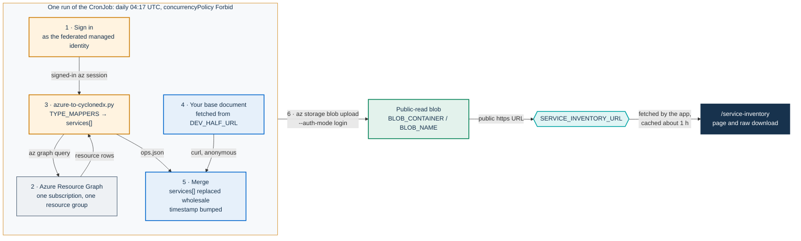

# Azure service-inventory generator

This folder holds a reference automation for the OPS half of the service inventory on Azure. The OPS half is the `services[]` part of the CycloneDX 1.6 document that PA Webinar shows at `/service-inventory`. A daily Kubernetes CronJob discovers the resources of one resource group and turns them into CycloneDX services. It merges them into a base document that you maintain, then uploads the result to a public Azure Blob container, where the portal reads it through `SERVICE_INVENTORY_URL`.

It is a starting point, not a turnkey component. The Helm chart does not render it, and no CI job runs or tests it. The shipped manifest also needs changes before its first run ([step 4](#4-edit-your-copy-of-the-manifest)). Copy it into your deployment configuration, adapt it, and review what it publishes.

**Audience:** operators who run PA Webinar on Azure Kubernetes Service (AKS) and want the OPS half kept current automatically.

For what the page shows and how the portal resolves the URL, see [Service inventory: publishing](../../../docs/SERVICE-INVENTORY.md). For the document model, the DEV half, the declarations and the recipes for other providers, see [Service inventory: generating the document](../../../docs/SERVICE-INVENTORY-GENERATION.md).

## What it does

The folder contains two files:

- **`scripts/azure-to-cyclonedx.py`** runs an Azure Resource Graph query for one subscription and one resource group. It turns every resource whose type matches an entry of `TYPE_MAPPERS` into a CycloneDX service tagged with `pa-webinar:layer`. It writes that `services` list, plus a few installation-level `properties`, to a JSON file. It lists the resource types it does not map on standard error.
- **`cronjob.yaml`** holds three Kubernetes objects:
  - a ConfigMap `service-inventory-scripts`, which holds only a placeholder until you load the script into it;
  - a ServiceAccount `service-inventory-generator` for Azure Workload Identity;
  - a CronJob `service-inventory-generator` that signs in, runs the script, merges the result into your base document and uploads it.

It does not build the DEV half (`components[]`) or the declarations. It expects a finished base document at a URL, and it only replaces that document's services. The CronJob does not call the portal and does not use `CRON_API_KEY`. It is listed with the other jobs that live outside the chart in [Scheduled and background jobs](../../../docs/architecture/background-jobs.md#jobs-outside-the-chart).

## Generation flow



**Schedule.** The schedule is `17 4 * * *`. The manifest sets no `timeZone`, so the time zone of the cluster's controller applies, which is UTC on AKS. Add `timeZone: Etc/UTC` to the CronJob spec if you want that explicit. `concurrencyPolicy: Forbid` skips a run while the previous one is still going. A failed container restarts in place (`restartPolicy: OnFailure`, `backoffLimit: 2`). Finished Jobs, with their pods and logs, are deleted after one day (`ttlSecondsAfterFinished: 86400`).

One run goes through these steps:

1. **Sign-in.** The container signs in to Microsoft Entra ID as the managed identity federated to its ServiceAccount. It then selects `SUBSCRIPTION_ID` with `az account set`. This works only with the federated-token sign-in described in [step 4 of the setup](#4-edit-your-copy-of-the-manifest). The line shipped in `cronjob.yaml`, `az login --identity`, does not read the Workload Identity token.
2. **Discovery.** The script queries Resource Graph for `SUBSCRIPTION_ID` and `RESOURCE_GROUP`, in pages of 1,000, following the skip token. The `az graph` command comes from the `resource-graph` Azure CLI extension, which the image does not include. In the pod, which has no terminal, the CLI installs it without asking on first use in every run and logs a warning saying so. If any `az` call fails, the script logs `az failed: <command>` and exits with code 2.
3. **Mapping.** The script maps each resource through `TYPE_MAPPERS` and writes `/tmp/ops.json`. On standard error it prints `generated <n> service entries`, followed by the resource types it skipped.
4. **Base document.** `curl -fsSL "$DEV_HALF_URL"` downloads your base document to `/tmp/dev.json`, without credentials. Any HTTP error fails the job.
5. **Merge.** An inline Python step writes `/tmp/bom.json` ([What the merge keeps and replaces](#what-the-merge-keeps-and-replaces)).
6. **Upload.** `az storage blob upload --auth-mode login --overwrite true --content-type application/json` writes the result to `BLOB_ACCOUNT` / `BLOB_CONTAINER` / `BLOB_NAME`. It uses the identity's own Entra ID token, so no storage key is involved. The log ends with `uploaded: https://<storage-account>.blob.core.windows.net/<container>/<blob-name>`.

The shell runs with `-euo pipefail`. Any failing step, or an unset variable, stops the run before the upload, and the previously published document stays in place.

### What the merge keeps and replaces

The base document is the skeleton. The merge changes only these fields:

| Field | What the merge does | Consequence |
|---|---|---|
| Everything else in the base document | Kept as downloaded | `components[]`, `declarations`, `definitions`, `annotations` and every other field are published as they are in the base |
| `services[]` | Replaced wholesale by the generated list | Services you list by hand in the base, such as the SMTP relay or a DNS provider outside Azure, disappear at every run ([Keeping hand-listed services](#keeping-hand-listed-services)) |
| `metadata.properties` | Merged by name, and generated values win | The generator sets `pa-webinar:tenant` (from `TENANT_NAME`), `pa-webinar:cloud-provider` (`Microsoft Azure`), `azure:subscription-id` and `azure:resource-group`. Keep `pa-webinar:region` and `pa-webinar:deployment-mode` in the base, because the generator does not produce them |
| `metadata.timestamp` | Set to the run time | The page shows it as **Generated at** |
| `serialNumber`, `version` | Unchanged | Consumers cannot tell regenerations apart by serial number |

The other top-level keys of the script's output (`generatedAt`, `tenant`, `subscription`, `resourceGroup`) are not copied.

### What a generated service looks like

This is the script's output for a PostgreSQL Flexible Server, with placeholders in place of real values. The description is generated in Italian, verbatim from the code:

```json
{
  "bom-ref": "svc:azure/subscriptions/<subscription-id>/resourcegroups/<resource-group>/providers/microsoft.dbforpostgresql/flexibleservers/<server>",
  "name": "Azure Database for PostgreSQL Flexible",
  "group": "microsoft.dbforpostgresql",
  "provider": { "name": "Microsoft Corporation", "url": ["https://azure.microsoft.com"] },
  "description": "Azure Database for PostgreSQL Flexible '<server>' (risorsa ARM: microsoft.dbforpostgresql/flexibleservers).",
  "authenticated": true,
  "x-trust-boundary": true,
  "properties": [
    { "name": "azure:resource-type", "value": "microsoft.dbforpostgresql/flexibleservers" },
    { "name": "azure:resource-name", "value": "<server>" },
    { "name": "azure:region", "value": "<location>" },
    { "name": "azure:resource-id", "value": "/subscriptions/<subscription-id>/resourceGroups/<resource-group>/providers/Microsoft.DBforPostgreSQL/flexibleServers/<server>" },
    { "name": "pa-webinar:tenant", "value": "<tenant>" },
    { "name": "pa-webinar:layer", "value": "data" },
    { "name": "azure:sku", "value": "<sku>" }
  ],
  "version": "<version>",
  "endpoints": ["<server-fqdn>:5432"],
  "data": [
    { "classification": "personal-data", "flow": "bi-directional", "description": "Dati applicativi; classificare caso per caso." }
  ]
}
```

Every mapped resource gets the common fields. `azure:sku` is added only when the resource has a SKU name. Three types get extra fields:

| Resource type | `version` | `endpoints` | `data[]` |
|---|---|---|---|
| AKS (`microsoft.containerservice/managedclusters`) | Kubernetes version | `https://<API server FQDN>` | None |
| PostgreSQL Flexible Server | Server version | `<server FQDN>:5432` | A generic `personal-data` flow with a placeholder description |
| Storage account | None | Primary blob endpoint | None, so no `recording` classification |

Every other mapped type, such as Key Vault, DNS zones, public IP addresses or load balancers, gets only the common fields. A public IP resource is published by name, without its address. `authenticated` and `x-trust-boundary` are always `true`, so every generated service card shows the **crosses trust boundary** badge. Review both, or change them in `to_service()` ([Enriching a service](#enriching-a-service)).

## Prerequisites

1. **AKS with the OIDC issuer and Workload Identity enabled**: `az aks update -g <cluster-resource-group> -n <cluster> --enable-oidc-issuer --enable-workload-identity`.
2. **A user-assigned managed identity** with two role assignments:
   - `Reader` on the resource group to inventory, or on the subscription. Resource Graph returns only the resources that the identity can read.
   - `Storage Blob Data Contributor` on the target storage account, or more narrowly on the container. The upload needs it.
3. **A federated credential** on that identity. It needs the cluster's OIDC issuer URL, the subject `system:serviceaccount:<namespace>:service-inventory-generator` and the audience `api://AzureADTokenExchange`.
4. **A storage account that allows anonymous blob access, and a container with public access level `blob`.** Anyone can then read a blob by its URL but cannot list the container. New storage accounts disallow anonymous access by default. `allowBlobPublicAccess` is a switch for the whole account, so use a dedicated account for public documents and never turn it on for the account that holds recordings. If an Azure Policy in your Microsoft Entra tenant or management group denies anonymous access, publish the document somewhere else ([Hosting options](../../../docs/SERVICE-INVENTORY.md#hosting-options)).
5. **A base document** at a URL that the pod can read without credentials, fixed to the release you deploy. Start it from [`docs/examples/service-inventory.example.json`](../../../docs/examples/service-inventory.example.json) and follow the [new-installation checklist](../../../docs/SERVICE-INVENTORY-GENERATION.md#new-installation-checklist). The template's placeholder text is in Italian, and its license entries need changing. Its `services[]` is overwritten at every run.
6. **Outbound HTTPS from the pod**, if your cluster restricts egress. The pod needs Microsoft Entra ID, Azure Resource Manager (which serves Resource Graph), the storage account, the host of `DEV_HALF_URL` and the Azure CLI extension download location. The node also pulls the image from `mcr.microsoft.com`.

## Setup

Run the commands from `infra/service-inventory/azure/`, or from your copy of it. Run the steps in this order. The values in angle brackets are placeholders:

- `<namespace>` is where the CronJob runs.
- `<tenant>` is the name that identifies your installation in the page header and in the blob path.
- `<location>` is the Azure region.
- `<resource-group>` is the resource group to inventory. The identity, the cluster and the storage account may each live in a different resource group.

### 1. Create the identity and its roles

```bash
az identity create --name id-service-inventory \
  --resource-group <identity-resource-group> --location <location>

MI_CLIENT_ID=$(az identity show -n id-service-inventory -g <identity-resource-group> --query clientId -o tsv)
MI_PRINCIPAL_ID=$(az identity show -n id-service-inventory -g <identity-resource-group> --query principalId -o tsv)

az role assignment create \
  --assignee-object-id "$MI_PRINCIPAL_ID" --assignee-principal-type ServicePrincipal \
  --role Reader \
  --scope /subscriptions/<subscription-id>/resourceGroups/<resource-group>

az role assignment create \
  --assignee-object-id "$MI_PRINCIPAL_ID" --assignee-principal-type ServicePrincipal \
  --role "Storage Blob Data Contributor" \
  --scope /subscriptions/<subscription-id>/resourceGroups/<storage-resource-group>/providers/Microsoft.Storage/storageAccounts/<storage-account>

OIDC_ISSUER=$(az aks show -n <cluster> -g <cluster-resource-group> --query oidcIssuerProfile.issuerUrl -o tsv)

az identity federated-credential create \
  --identity-name id-service-inventory --resource-group <identity-resource-group> \
  --name fc-service-inventory-<tenant> \
  --issuer "$OIDC_ISSUER" \
  --subject "system:serviceaccount:<namespace>:service-inventory-generator" \
  --audiences api://AzureADTokenExchange
```

Role assignments can take a few minutes to take effect.

### 2. Prepare the public container

```bash
az storage account update --name <storage-account> \
  --resource-group <storage-resource-group> --allow-blob-public-access true

az storage container-rm create --name service-inventory \
  --storage-account <storage-account> --resource-group <storage-resource-group> \
  --public-access blob
```

`container-rm` works through Azure Resource Manager, so it needs no storage account key. Keep this container for documents meant to be public: anyone who knows a blob's URL can read it.

### 3. Dry-run the generator on your workstation

The job publishes straight to the public blob, with no review step in between. Before the first scheduled run, reproduce a run locally and read what it would publish. The `jq` program below applies the same merge as the CronJob's Python step.

Install the `resource-graph` extension first, or let the CLI install it without asking (`az config set extension.use_dynamic_install=yes_without_prompt`). Otherwise, in a terminal, the CLI asks before installing it, and because the script captures the output of `az`, the question never shows: the dry-run just waits. Then select the subscription, as the CronJob does:

```bash
az login
az extension add --name resource-graph
az account set --subscription <subscription-id>

python3 scripts/azure-to-cyclonedx.py \
  --subscription <subscription-id> --resource-group <resource-group> \
  --tenant <tenant> --output ops.json

curl -fsSL "<base-document-url>" -o dev.json

jq -s '.[0] as $dev | .[1] as $ops
  | $dev
  | .services = $ops.services
  | .metadata.timestamp = (now | todate)
  | .metadata.properties = (reduce ($ops.properties // [])[] as $p
      (($dev.metadata.properties // []);
       if any(.[]; .name == $p.name)
       then map(if .name == $p.name then $p else . end)
       else . + [$p] end))
' dev.json ops.json > bom.json

jq '{header: .metadata.properties,
     services: [.services[] | {name, "bom-ref": .["bom-ref"], version, endpoints,
                ids: [.properties[] | select(.name | startswith("azure:"))]}]}' bom.json
```

Check the result against [What gets published](#what-gets-published). Then validate `bom.json` with the checks in [Validation](../../../docs/SERVICE-INVENTORY.md#validation).

### 4. Edit your copy of the manifest

Every value you must fill in `cronjob.yaml` is a `REPLACE_WITH_*` placeholder, so a search for `REPLACE_WITH` finds them all. The one change such a search does not find is the sign-in line, described below the table: it looks as if it works, but it uses the wrong credential. Set these values:

| In `cronjob.yaml` | Shipped value | Set it to |
|---|---|---|
| ServiceAccount annotation `azure.workload.identity/client-id` | `REPLACE_WITH_MI_CLIENT_ID` | `$MI_CLIENT_ID` from step 1 |
| `SUBSCRIPTION_ID` | `REPLACE_WITH_SUBSCRIPTION_ID` | `<subscription-id>`, in lowercase |
| `RESOURCE_GROUP` | `REPLACE_WITH_RESOURCE_GROUP` | `<resource-group>`, the group to inventory |
| `BLOB_ACCOUNT` | `REPLACE_WITH_STORAGE_ACCOUNT` | `<storage-account>` |
| `TENANT_NAME` | `REPLACE_WITH_TENANT_NAME` | `<tenant>`. It becomes `pa-webinar:tenant`, which the page shows as **Instance**, and it is set on every service |
| `BLOB_NAME` | `$(TENANT_NAME)/service-inventory.json` | Leave it, unless you want another path. Kubernetes expands `$(TENANT_NAME)` from the variable defined above it, so the blob lands at `<tenant>/service-inventory.json` |
| `DEV_HALF_URL` | `REPLACE_WITH_DEV_HALF_URL` | Your own base document, at a URL fixed to a release (see below) |
| `BLOB_CONTAINER` | `service-inventory` | Your container name, if different |

**`DEV_HALF_URL`.** Left unset, the run fails at the download with `curl: (6) Could not resolve host: REPLACE_WITH_DEV_HALF_URL`, and nothing is uploaded. Point it at your own base document, at a URL that names the release you deploy, for example `https://<storage-account>.blob.core.windows.net/service-inventory/<tenant>/base-<version>.json`. Change it in the same change that upgrades the portal. A moving URL, such as the head of a branch, changes what you publish without anyone deploying anything. `curl` fetches the URL anonymously, and every byte of the base ends up in the public document anyway.

**The sign-in line.** The shipped command is `az login --identity --allow-no-subscriptions`. It asks the node's instance metadata endpoint for a token and never reads the Workload Identity token that the webhook projects into the pod. The job then either fails to sign in or signs in as an identity attached to the node, not the one you federated. Replace the line with the federated-token sign-in:

```bash
az login --service-principal \
  -u "$AZURE_CLIENT_ID" -t "$AZURE_TENANT_ID" \
  --federated-token "$(cat "$AZURE_FEDERATED_TOKEN_FILE")" \
  --allow-no-subscriptions >/dev/null
```

The Workload Identity webhook injects the three variables, because the pod template carries the label `azure.workload.identity/use: "true"` and the ServiceAccount carries the client-ID annotation. If they are missing, `set -u` stops the run with an `unbound variable` error.

**The image.** The CronJob uses `mcr.microsoft.com/azure-cli` by tag. The image provides `az`, `python3` and `curl`, runs as root, and the manifest sets no `securityContext`. A namespace that enforces the `restricted` Pod Security Standard therefore rejects the pod. For a stable installation, pin the image by digest. Alternatively, build your own image with the `resource-graph` extension and the script baked in, then drop the ConfigMap and its volume.

### 5. Apply the manifest, then load the script

Order matters:

```bash
kubectl -n <namespace> apply -f cronjob.yaml

kubectl -n <namespace> create configmap service-inventory-scripts \
  --from-file=azure-to-cyclonedx.py=scripts/azure-to-cyclonedx.py \
  --dry-run=client -o yaml | kubectl -n <namespace> apply -f -
```

The manifest contains a ConfigMap with the same name that holds only a placeholder comment. Applying `cronjob.yaml` after you load the script resets the ConfigMap to that placeholder. The next run then fails at the merge step with a `FileNotFoundError` for `/tmp/ops.json`, because the placeholder writes nothing. Either reload the script after every `kubectl apply -f cronjob.yaml`, or delete the ConfigMap document from your copy of the manifest and let the second command create it.

### 6. Run it once and point the portal at the result

```bash
JOB=service-inventory-manual-$(date +%s)
kubectl -n <namespace> create job --from=cronjob/service-inventory-generator "$JOB"
kubectl -n <namespace> logs -f "job/$JOB"
```

When the log shows `uploaded: …`, set the URL in the Helm values of your installation, in your configuration repository:

```yaml
app:
  env:
    SERVICE_INVENTORY_URL: "https://<storage-account>.blob.core.windows.net/service-inventory/<tenant>/service-inventory.json"
```

A change to `app.env` rolls the app pods. Each pod caches the remote document with a one-hour revalidation, so a regeneration can take a little over an hour to show on the page ([Remote URLs](../../../docs/SERVICE-INVENTORY.md#remote-urls)). Open `https://webinar.example.com/<locale>/service-inventory` and check the header, the service cards and **Architecture at a glance**. Then, from outside the cluster, open the link shown next to **Download raw JSON** once (it points straight at the published URL) to confirm that it is the file you meant to publish.

## What gets published

Everything in the uploaded document is public, including the fields that the page does not render. The page links the raw file directly, next to **Download raw JSON**, and the storage host serves it whole to anyone who opens that link. On top of the base document, the generator adds:

| Field | Set by | Content |
|---|---|---|
| `metadata.properties` `azure:subscription-id`, `azure:resource-group` | `main()` | The subscription ID and the resource group name |
| Service `bom-ref` | `to_service()` | `svc:azure` followed by the full lowercase ARM resource ID, which contains the subscription ID and the resource group |
| `azure:resource-id`, `azure:resource-name`, `azure:region`, `azure:sku` | `to_service()` | The ARM ID, name, region and SKU of every mapped resource |
| `endpoints` | `to_service()` | The AKS API server FQDN, the PostgreSQL server FQDN and port, and the storage account's blob endpoint |
| `version` | `to_service()` | The Kubernetes and PostgreSQL versions |

Keep two properties of the discovery in mind:

- **No per-resource allowlist.** Every resource of a mapped type in the resource group is published, including resources that have nothing to do with PA Webinar but share the group.
- **Tags stay out.** The query reads each resource's tags, but the generator does not publish them.

The generator also writes values that may not be true for your installation. Check them before the first publication:

- `authenticated: true` and `x-trust-boundary: true` on every service, so every generated card shows the **crosses trust boundary** badge;
- the placeholder `personal-data` flow on PostgreSQL, which shows the **personal data** badge;
- the missing `recording` classification on a storage account that holds recordings, so the **recorded content** badge never appears;
- the Italian descriptions.

The general review checklist is in [Review, validate and publish](../../../docs/SERVICE-INVENTORY-GENERATION.md#review-validate-and-publish).

### Removing identifiers before publication

Decide with your security officer which of the fields above may be public, and remove the rest at the source, in the script. For example, to drop the subscription ID, the resource group and the endpoints:

```python
# In to_service(): a bom-ref without the subscription ID and the resource group.
# It stays deterministic, and unique, because a run reads one resource group.
bom_ref = f"svc:azure/{r['type'].lower()}/{r['name'].lower()}"

# At the end of to_service(), just before `return svc`:
svc["properties"] = [p for p in svc["properties"] if p["name"] != "azure:resource-id"]
svc.pop("endpoints", None)
```

In `main()`, delete the `azure:subscription-id` and `azure:resource-group` entries from the `properties` list. Keep `bom-ref` deterministic whatever form you choose. Claims in your base document may point to a service by its `bom-ref`, across regenerations, so update those claims when you change the form.

## Extending the generator

### Mapping more resource types

`TYPE_MAPPERS` in `scripts/azure-to-cyclonedx.py` is a list of tuples: a lowercase Azure resource type, the display name of the service, and the value of `pa-webinar:layer`. A resource matches when its type equals the entry, or starts with the entry followed by `/`. The first match wins. Add a tuple to surface a new type:

```python
("microsoft.web/sites", "Azure App Service", "app"),
```

The layer is one of `access`, `app`, `data` or `platform`. It decides where the service appears in **Architecture at a glance** ([Mapping a service to `services[]`](../../../docs/SERVICE-INVENTORY-GENERATION.md#mapping-a-service-to-services)). That block labels each item with its `pa-webinar:stack-label` property, or with the service name when the property is missing. Two storage accounts therefore both appear as "Azure Storage Account" unless you add a label in `to_service()`. The run log lists the types that no entry matches, which is the quickest way to find candidates.

### Enriching a service

`to_service()` builds the common fields for every mapped resource. It then runs one branch per resource type, keyed by the lowercase type, that adds `version`, `endpoints` or `data[]`. Add or change a branch to enrich a type, or to replace the generated description.

This example marks a storage account that holds recordings, so that the page shows the **recorded content** badge. It tells which account that is by a resource tag of your choice:

```python
elif t.startswith("microsoft.storage/storageaccounts"):
    prim = (props.get("primaryEndpoints") or {}).get("blob")
    if prim:
        svc["endpoints"] = [prim]
    if (r.get("tags") or {}).get("<tag-key>") == "recordings":
        svc["data"] = [{"classification": "recording", "flow": "inbound",
                        "description": "Recordings and their post-production outputs."}]
```

### Keeping hand-listed services

The merge replaces `services[]` wholesale. Services that no Azure API finds are therefore dropped at every run: the SMTP relay, the DNS registrar or the certificate authority ([What no API finds](../../../docs/SERVICE-INVENTORY-GENERATION.md#what-no-api-finds)). To keep the ones you list in the base document, replace the line `dev["services"] = ops["services"]` in the CronJob's merge step with a union by `bom-ref`. Keep the indentation of the surrounding lines. Generated entries win on a clash, and the last line gives every regeneration its own serial number:

```python
generated = {s["bom-ref"]: s for s in ops["services"]}
kept = [s for s in (dev.get("services") or []) if s.get("bom-ref") not in generated]
dev["services"] = list(generated.values()) + kept
import uuid; dev["serialNumber"] = f"urn:uuid:{uuid.uuid4()}"
```

Remove the template's sample services from your base first. Otherwise the union keeps them too.

### Covering more than one resource group

A run reads one resource group. AKS keeps the cluster's load balancers, public IP addresses and disks in a separate node resource group, which `az aks show -g <cluster-resource-group> -n <cluster> --query nodeResourceGroup -o tsv` names. To include it, extend the query in `query_resources()` to filter on several groups, and grant the identity `Reader` on each of them. If you also shortened `bom-ref` ([Removing identifiers before publication](#removing-identifiers-before-publication)), include the resource group in it, for example `svc:azure/{resourceGroup}/{type}/{name}`: two groups can each hold a resource of the same type and name, and the page uses `bom-ref` as the key of each card.

## Troubleshooting

| Symptom in the job log or on the page | Cause | Fix |
|---|---|---|
| `az login` fails, or later calls are denied although the roles are assigned | The shipped `az login --identity` does not use the Workload Identity token | Use the federated-token sign-in ([step 4](#4-edit-your-copy-of-the-manifest)) |
| `unbound variable` for `AZURE_CLIENT_ID` or `AZURE_FEDERATED_TOKEN_FILE` | The webhook did not inject them: Workload Identity is off on the cluster, or the pod label is missing | Enable it ([Prerequisites](#prerequisites)), and keep the label on the pod template |
| `az failed: graph query …` | The identity cannot read the subscription or the resource group, or the CLI could not download the `resource-graph` extension | Check the scope of the `Reader` assignment, and the egress rules |
| The dry-run on a workstation prints nothing and never ends | The CLI is waiting for an answer to its extension-install question, which the script captures | Install the extension first ([step 3](#3-dry-run-the-generator-on-your-workstation)) |
| `generated 0 service entries` | Wrong resource group, a subscription ID in uppercase (the query compares it exactly), or none of the group's types is in `TYPE_MAPPERS` | Read the skipped types in the log, and check `SUBSCRIPTION_ID` and `RESOURCE_GROUP` |
| `curl: (6) Could not resolve host: REPLACE_WITH_DEV_HALF_URL` | `DEV_HALF_URL` is not set | Set it to your base document ([step 4](#4-edit-your-copy-of-the-manifest)) |
| `curl: (22)` | `DEV_HALF_URL` answered with an HTTP error, or needs credentials | Make the base document readable anonymously from the pod |
| `FileNotFoundError` for `/tmp/ops.json` | The ConfigMap still holds the placeholder | Load the script again ([step 5](#5-apply-the-manifest-then-load-the-script)) |
| The upload fails with an authorization error | The identity lacks `Storage Blob Data Contributor`, or the assignment has not propagated yet | Check the assignment, and retry after a few minutes |
| The page shows **Inventory not yet published** | `SERVICE_INVENTORY_URL` is not set | Set `app.env.SERVICE_INVENTORY_URL` ([step 6](#6-run-it-once-and-point-the-portal-at-the-result)) |
| The page shows **Could not load the inventory** | The blob is not anonymously readable, or the app pods cannot reach the storage host | [How `SERVICE_INVENTORY_URL` is resolved](../../../docs/SERVICE-INVENTORY.md#how-service_inventory_url-is-resolved) |
| **Instance** shows `REPLACE_WITH_TENANT_NAME`, or the page shows **Could not load the inventory** because the blob went to `REPLACE_WITH_TENANT_NAME/service-inventory.json` instead of the configured URL | `TENANT_NAME` still holds its placeholder | Set it to `<tenant>` ([step 4](#4-edit-your-copy-of-the-manifest)), and run the job again |
| The page still shows an old **Generated at** | Each app pod caches the document for a little over an hour | Wait, or restart the app pods |

To see the latest runs, use `kubectl -n <namespace> get cronjob service-inventory-generator` for the last schedule time, and `kubectl -n <namespace> get jobs` for the individual runs. Jobs older than a day have already been deleted.

## Known limitations

- **Azure only.** Google Cloud, AWS and self-hosted installations have recipes, not tools, in [The OPS half](../../../docs/SERVICE-INVENTORY-GENERATION.md#the-ops-half-operational-services).
- **One subscription and one resource group per run.** A second group, such as the AKS node resource group, needs a code change.
- **No alerting.** A failed run leaves the previous document published. It shows only as a failed Job, which is deleted with its logs after a day. Nothing in the chart monitors this CronJob. Watch the **Generated at** date, or add a Job-failure alert to your cluster monitoring.
- **Hand-curated services are dropped** by the wholesale replacement of `services[]`, unless you change the merge.
- **No review gate and no signature.** Each run overwrites the public blob directly, and readers trust whoever serves the file.
- **Reference quality.** The sign-in line must be replaced and every `REPLACE_WITH_*` value set before use. The image is pinned by tag, runs as root, and downloads a CLI extension at every run. No CI job runs any of this.

## Related documents

- [Service inventory: publishing](../../../docs/SERVICE-INVENTORY.md): what the page shows, URL resolution, caching and validation.
- [Service inventory: generating the document](../../../docs/SERVICE-INVENTORY-GENERATION.md): the document model, the DEV half, declarations, merge recipes and cadence.
- [`docs/examples/service-inventory.example.json`](../../../docs/examples/service-inventory.example.json): the template for your base document.
- [Scheduled and background jobs](../../../docs/architecture/background-jobs.md): the jobs that the chart runs, and those it does not.
- [Infrastructure](../../../docs/INFRASTRUCTURE.md): choosing and sizing an installation, including on Azure.
