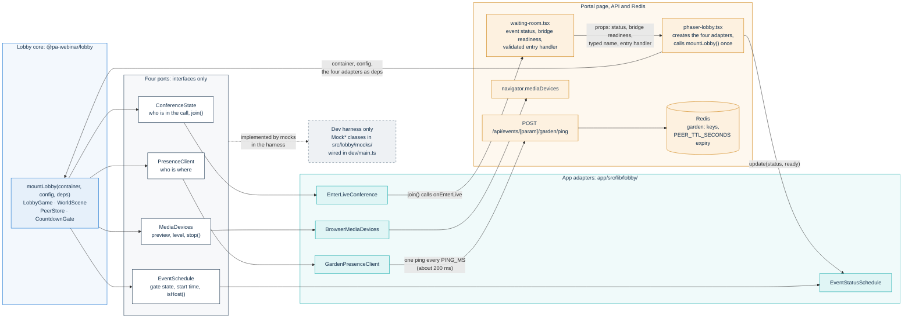
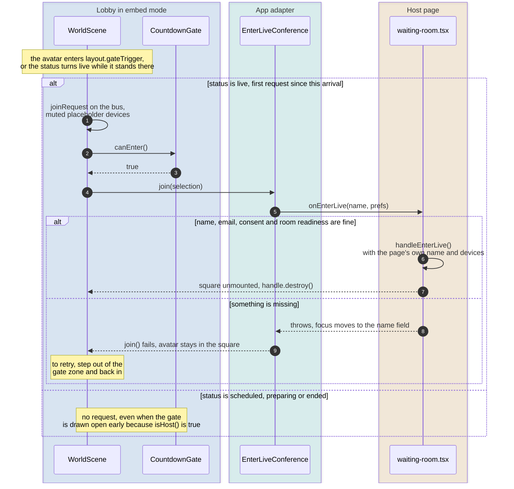
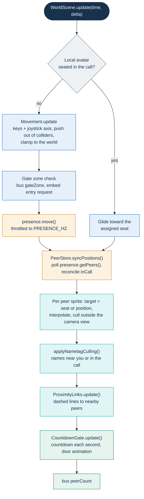

# Lobby: the waiting-room square

`@pa-webinar/lobby` is the npm workspace that draws **the square**, the optional 2D square in the waiting room of a PA Webinar event. People waiting for an event can walk around it as avatars and see each other. When the event is live, walking up to the gate is one way to enter the room.

This page is for front-end and game developers working inside `lobby/`. It covers the module's contract, its public API, the ports and the constraints on their adapters, the development harness, the builds and the internal architecture. How the portal decides when to offer the square, the presence protocol and the accessibility contract that keeps the square optional are described in [The waiting room and the square](../docs/architecture/waiting-room.md). The decision to build it is recorded in [ADR-012](../docs/adr/012-garden-waiting-room.md).

## What it is, and the isolation contract

The lobby is a self-contained [Phaser 3](https://phaser.io/) game client with a small typed event bus ([mitt](https://github.com/developit/mitt)). Its contract with the outside world is strict:

- **No I/O of its own.** The lobby never imports Jitsi, never opens a socket and never calls `fetch`. It knows nothing about the portal's routes or data model.
- **Four ports.** Everything it needs from outside comes through four interfaces in `src/lobby/ports/`: `PresenceClient`, `ConferenceState`, `EventSchedule` and `MediaDevices`. The host application builds the implementations and passes them to `mountLobby()`.
- **Two wiring sites.** Concrete implementations are wired in exactly two places: `dev/main.ts` (the harness, with the `Mock*` classes) and `app/src/components/live/garden/phaser-lobby.tsx` (the portal, with the app adapters).
- **Local conveniences only.** The only state the lobby persists is in `localStorage`, through `src/lobby/storage.ts`: `pawebinar.lobby.profile` (name, avatar color, accessories) and `pawebinar.lobby.onboardingDismissed`. Every read and write is wrapped, so blocked storage falls back to defaults.



## Integration in the app

The square lives inside the waiting room. It never opens by itself: the visitor presses **Step into the square** (or **Head to the square meanwhile** while the room is being prepared). How the portal packages and loads it is described in [How it is built](../docs/architecture/waiting-room.md#how-it-is-built). In short:

- **Dependency.** The app compiles this workspace's TypeScript source (`exports` points at `src/lobby/index.ts`, and `app/next.config.ts` lists the package in `transpilePackages`), so neither build output is used.
- **Lazy, client-only load.** `app/src/components/live/waiting-room.tsx` loads `phaser-lobby.tsx` through `next/dynamic` with `ssr: false`.
- **Error boundary.** `PhaserLobbyBoundary` switches to the classic view if the chunk fails to load, or if rendering or `mountLobby()` throws (see [Failure falls back to the classic view](../docs/architecture/waiting-room.md#failure-falls-back-to-the-classic-view)). It does not see errors thrown later inside Phaser's frame loop, because that loop runs in `requestAnimationFrame` callbacks, outside React.
- **Embed mode, always.** The app mounts with `embed: true` (its `hostOwnsEntry` prop), so the host page keeps the only set of controls. See [Embed and full-screen modes](#embed-and-full-screen-modes).

What the wrapper does that matters when you change the lobby:

- **Mount once, push changes.** `phaser-lobby.tsx` creates the four adapters and calls `mountLobby()` once. After that it pushes changes in without remounting: event status and bridge readiness go to `EventStatusSchedule.update()`, and name edits go to `handle.setProfile()`. On unmount it calls `handle.destroy()` and disposes the schedule adapter's start-time timer.
- **The page owns the exits.** The app passes `onExitToClassic`, but the lobby draws that button only in full-screen mode. In the app, the stage bar under the scene provides **Back to the waiting room** and **Classic version** instead.
- **Keyboard focus.** The element that hosts the scene (`.wr-piazza-stage`) has `tabIndex={0}` and `role="application"`. The game gives its keys to any focused control (see [Keys belong to the focused control](#the-frame-loop)), and Tab brings them back to the scene.
- **Translated gate texts.** The app passes `labels` from the `waiting.gate` i18n namespace. `startsIn` is passed with a literal `{time}` placeholder, which the gate fills in every second.
- **Sizing.** The container fills its positioned parent element (`.wr-piazza-stage`). Phaser runs in `RESIZE` scale mode, which listens for window resizes. The wrapper therefore observes its own box with a `ResizeObserver` and dispatches a synthetic `resize` event when the box changes.

The page, not the lobby, decides whether the square is offered at all. The inputs are the waiting-room engine setting, the `?engine=` override, phones, the saved classic preference, the event status (never once it is `ENDED`) and whether the page asks this visitor for per-participant recording consent. See [Engines: classic view and the square](../docs/architecture/waiting-room.md#engines-classic-view-and-the-square) and [When the square is not offered](../docs/architecture/waiting-room.md#when-the-square-is-not-offered).

## Public API

`src/lobby/index.ts` is the only module a host application imports. It exports `mountLobby()` and re-exports the types of the contract:

- the config, deps and handle types: `LobbyConfig`, `LobbyDeps`, `LobbyHandle`, `AssetConfig` and `GateLabels`;
- the four port interfaces, plus `EventStatus` and `MediaDeviceLists`;
- the shared shapes: `PlayerProfile`, `PeerState`, `DeviceSelection`, `Facing`, `EmoteType` and `Unsub`.

```ts
import { mountLobby } from '@pa-webinar/lobby';

const handle = mountLobby(container, config, { presence, conference, schedule, media });

handle.setProfile({ name: 'Speaker 1', color: '#0066CC', accessories: { glasses: true } });
handle.destroy();
```

`mountLobby(container, config, deps)` returns a `LobbyHandle`. It starts connecting presence (without waiting for it), starts the Phaser game inside `container`, and adds the DOM overlays for the chosen mode.

### `LobbyConfig`

All fields are optional. The types and their comments are in `src/lobby/public-types.ts`. The numeric defaults are in `src/lobby/constants.ts`.

| Field | Effect |
|---|---|
| `worldSize` | World size in pixels. The world is larger than the viewport, and the camera pans. Defaults to `DEFAULT_WORLD`. |
| `initialProfile` | Seed for the local player. `id` defaults to a new random `self_…` id on every mount. `name`, `color` and `accessories` fall back to the stored profile. Without one, the player gets an empty name, the first avatar color and no accessories. |
| `map` | `'piazza'` (default) is the square drawn by `systems/PiazzaMap.ts`. `'classic'` is an alternative map, a theater with a stage and rows of seats next to lawns with themed zones, drawn by `systems/WorldMap.ts`. |
| `embed` | `true` hides the full-screen chrome and makes the open gate the way in. Default `false`. |
| `labels` | Partial `GateLabels`: the texts drawn over the gate and on the stage screen. Missing keys fall back to the Italian `DEFAULT_GATE_LABELS`. `startsIn` must contain `{time}`. |
| `onExitToClassic` | Handler for the top bar's classic-version button. The button appears only when this is set, and only in full-screen mode. |
| `capacityHint` | Accepted and resolved, but no system reads it. |
| `assets` | `AssetConfig` with `tilemapUrl`, `tilesetUrl` and `avatarSpriteUrl`. Accepted, but no scene loads it yet. See [Art seams](#art-seams). |

### `LobbyHandle`

| Method | Effect |
|---|---|
| `setProfile(partial)` | Updates the local name, color or accessories, and does nothing after `destroy()`. Name and color go out only when they change. Accessories go out whenever they are passed. The result is saved in `localStorage`, sent through `presence.setProfile()` and redrawn on the avatar. |
| `destroy()` | Teardown, safe to call twice. It releases its bus subscriptions and gesture listeners, closes the audio context and removes the overlays. It then asks Phaser to destroy the game with `game.destroy(true)`; Phaser does so on its next frame, stopping the loop and removing the canvas. That destruction emits the scene's `DESTROY` event, not `SHUTDOWN`, so `WorldScene`'s own teardown, registered on `SHUTDOWN`, does not run (see [Known scope and limitations](#known-scope-and-limitations)). Next it calls `presence.disconnect()` and `media.stop()`, clears the bus, removes the two DOM roots and the injected `<style>`, and resets the container's `position` (see [Container requirements](#container-requirements)). |

### Container requirements

The container must have its own size. If its computed `position` is `static`, the lobby sets `relative` and puts back the previous inline value on `destroy()`. If it is not `static`, the lobby leaves it alone at mount, but `destroy()` still clears the container's inline `position`. A host application that positions the container with an inline style and mounts into the same element again must set that style again first. The lobby appends two children: a canvas root and a UI overlay root with class `pawl`. It also injects one `<style data-pawebinar-lobby>` element whose rules use `.pawl`-prefixed classes, so the module ships no stylesheet of its own.

### Embed and full-screen modes

The in-game texts are Italian literals. They are quoted below with an English gloss.

| | Full-screen (`embed: false`, the harness default) | Embed (`embed: true`, the app) |
|---|---|---|
| Overlays | Onboarding dialog, top bar, status badge, personalization bar, device panel, touch joystick | Touch joystick only |
| Name and look | Chosen in the game (onboarding, personalization bar) | Pushed by the host page with `setProfile()` |
| Device choice | In-game device panel. It opens in the gate zone or from the top bar's **Entra nella videocall** ("Join the video call") | Owned by the host page |
| Entering | **Entra** ("Enter") in the device panel. It is enabled when the gate is open, including [early entry](#ports-and-adapter-constraints) when `isHost()` is true | Walking into the gate zone while the status is `live` |
| Sound | Muted at start, toggled from the top bar | Muted, with no toggle, so the square is silent |

In embed mode, the lobby's `join()` call carries muted placeholder devices. A host page must therefore take the real name and device choice from its own controls and ignore the arguments it receives. `waiting-room.tsx` does exactly that.



The gate itself is always a wall: its bar is in the collider list in every state. Entry happens through the request, never by walking through. The scene makes one request per arrival in the zone, for two reasons: the status comes from polling and can flicker, and each rejected attempt moves the page's focus to the name field.

## Ports and adapter constraints

| Port | Contract | App adapter (`app/src/lib/lobby/`) | Harness mock (`src/lobby/mocks/`) |
|---|---|---|---|
| `PresenceClient` | `connect`, `setProfile`, `move`, `emote`, `getPeers` (everyone except self), `on('peerJoin' \| 'peerLeave' \| 'peerMove' \| 'peerEmote' \| 'peerProfile')`, `disconnect` | `GardenPresenceClient`: polls `POST /api/events/[param]/garden/ping` | `MockPresenceClient`: bots that walk at random, a few of them drifting into the call |
| `ConferenceState` | `getParticipants`, `join(devices)`, `leave`, `on('participantJoin' \| 'participantLeave')` | `EnterLiveConference`: `join()` hands over to the page | `MockConferenceState`: two participants already in the call, and `join()` resolves after a short delay |
| `EventSchedule` | `getStatus`, `getStartsAt` (epoch ms), `isHost`, `on('statusChange')` | `EventStatusSchedule`: maps app status, start time and bridge readiness | `MockEventSchedule`: counts down, then turns `live` |
| `MediaDevices` | `enumerate`, `preview(selection)`, `level` (0 to 1), `stop` | `BrowserMediaDevices`: `getUserMedia` plus an `AnalyserNode` | `MockMediaDevices`: real `getUserMedia` when allowed, otherwise simulated device lists and level |

Every `on(...)` returns an `Unsub`. The presence protocol, its rate limit and its exposure are documented in [Presence](../docs/architecture/waiting-room.md#presence). Keep these constraints in mind when you write or change an adapter:

- **`EventStatus` has four values.**
  - `scheduled` means it is not time yet: a padlock and a countdown.
  - `preparing` means it is time, but the room does not exist yet: a rope across the gate and no countdown.
  - `live` opens the gate, and `ended` closes it.

  `EventStatusSchedule` returns `ended` for `ENDED`. For `LIVE` it returns `live` once the bridge is ready and `preparing` while the bridge is starting. Every other status maps to `scheduled` before the start time and to `preparing` after it. When the start is less than 24 hours away, the adapter sets a timer for it. The gate then changes from `scheduled` to `preparing` without a status change.
- **Early entry for `isHost()`.** In the portal, `isHost()` is true for moderators (`isHost={isModerator}` in `waiting-room.tsx`: the moderator link or a `MODERATOR` named grant, not speakers). When it is true, the gate opens during `scheduled` only, never during `preparing`: with the bridge off, even a moderator would find an empty room. In embed mode this is visual only, because the scene requests entry only at `live`.
- **No in-call presence channel.** The ping carries no in-call field, and `EnterLiveConference` reports no participants. In the app, everyone in the square is therefore shown as waiting. `PeerStore` still reconciles `inCall` as "presence says so, or the conference lists the id". Amphitheater seating works in the harness, where bots join the call.
- **Positions are percentages.** The ping sends `x` and `y` as 0 to 100 percent of the full world. Every client of the same event must mount the same `worldSize` and `map` to see the same scene. The app uses the `WORLD` constant in `phaser-lobby.tsx`.
- **Payloads must pass the route's schema.** `pingSchema` in `app/src/app/api/events/[param]/garden/ping/route.ts` accepts a `userId` of 8 to 48 characters (the lobby's `self_…` ids fit), a `displayName` of 1 to 80 characters, an `avatarId` of 1 to 16 characters and positions from 0 to 100. The adapter truncates the name to 80 characters and sends `Ospite` for an empty one. A rejected ping is a `400`, which the adapter drops without an error, so the avatar never appears to others.
- **Avatar packing.** The ping has no color or accessory fields, so `avatarId` packs them: six hex digits of the color, then `h` for the helmet and `g` for the glasses. An `avatarId` that does not match this pattern decodes to a default slate-gray look.
- **Moves are polled, not evented.** The scene calls `move()` on a throttle (`PRESENCE_HZ` in `constants.ts`). The app adapter sends the latest position on its own timer (`PING_MS` in `presence-adapter.ts`), with one request in flight at a time. `PeerStore` reads positions from `getPeers()` every frame and never subscribes to `peerMove`, so an adapter does not need to emit it. Because `getPeers()` runs every frame, it should return its current array rather than build a new one on each call.
- **Unknown is not empty.** When the route answers `degraded: true`, the adapter keeps the current avatars instead of treating the answer as an empty square. An adapter that turned a failed read into "everyone left" would make every avatar vanish and then reappear. An `active: false` answer (for an event that is `DRAFT`, `IDLE` or `ENDED`) is a real empty list, so the square empties while the event is idle.
- **Emotes.** For a peer seen for the first time, emit `peerEmote` after `peerJoin`, because `PeerStore` drops emotes for peers it does not know yet. The app adapter attaches a local emote to the pings sent during its animation time, throttles key auto-repeat, and deduplicates incoming emotes on the sender's timestamp.
- **Leaving is explicit.** `disconnect()` in the app adapter sends a final ping with `leave: true` through `navigator.sendBeacon`, so the avatar disappears for others at once instead of expiring after `PEER_TTL_SECONDS` (10 seconds, in `app/src/lib/garden/pubsub.ts`).
- **A failed `join()` means "not joined".** If `join()` rejects or throws, the scene clears its joining flag and does not seat the avatar. It tries again only after the avatar leaves the gate zone and comes back.
- **Never `lib-jitsi-meet`.** Some port comments mention it as a possible implementation of `ConferenceState`. The portal talks to Jitsi only through the IFrame API ([ADR-001](../docs/adr/001-jitsi-iframe-api.md)). `lib-jitsi-meet` is allowed only in the recorder bot and in test harnesses.

## Development harness

The harness is a Vite page that mounts the lobby with the four mocks. Beside it are a mock chat and a control panel with a real camera preview, a name field, a consent checkbox and an entry button. The side panels are demo scaffolding: the entry and classic-view buttons only show a message, and the chat answers with canned replies. The harness suppresses the in-game onboarding dialog. It seeds the name from `pawebinar.participant.name` in `localStorage`, or uses `Ospite`.

```bash
npm run lobby:dev    # from the repository root, serves http://localhost:5180 and opens a browser
npm run dev          # the same, from inside lobby/
```

| Query parameter | Effect |
|---|---|
| `?in=20` | Seconds until the mock event turns `live`. Default `60`. `0` starts live. |
| `?host=1` | `isHost()` returns true, as for a moderator in the portal: the gate opens early during `scheduled`. |
| `?bots=120` | Number of simulated peers. Default `80`. |
| `?map=classic` | Uses the older `classic` map instead of the square. |
| `?embed=1` | Embed mode, as in the portal: no in-game chrome, and walking to the open gate enters. This is the only place to try that path outside the portal. |
| `?ctx=app` | Hides the chat and control panels, so you can judge the scene at the width it has in the app. |

The harness mounts the square with a world of 1800 × 1120 pixels and the classic map with 2400 × 1600 (both in `dev/main.ts`). The app mounts the square with the world set in `phaser-lobby.tsx`. When you compare proportions with the app, check which size each one uses.

Console helpers live on `window.lobby`: `addBots(50)`, `preparing()`, `live()`, `end()` and `destroy()`. The object also exposes `handle`, `presence` and `schedule`.

Controls:

- **Move:** WASD or the arrow keys. A touch joystick appears unless the device has a hover-capable fine pointer, such as a mouse.
- **Emotes and jump:** **Space** jumps, **E** waves and **H** sends a heart.
- **Enter (full-screen mode):** stepping into the gate zone, or pressing **Entra nella videocall** in the top bar, opens the device panel. Its **Entra** button joins when the gate is open.

The harness page loads Titillium Web and Roboto Mono from Google Fonts. It is a development tool, and the portal never serves it. The portal self-hosts its fonts.

## Builds

| Command (inside `lobby/`) | Output | Purpose |
|---|---|---|
| `npm run build` (from the root: `npm run lobby:build`) | `dist-harness/` | Static build of the harness |
| `npm run build:lib` | `dist/lobby.js`, an ES module with `phaser` left external | Checks that the module builds as a consumable package |
| `npm run preview` | None | Serves the last harness build |

Both build configurations live in `vite.config.ts`, and `--mode lib` selects the library build. Git ignores the build outputs. The portal uses neither of them, because it compiles the source.

## Architecture

| Area | Files | Responsibility |
|---|---|---|
| Entry and bootstrap | `index.ts`, `public-types.ts`, `LobbyGame.ts`, `context.ts` | The public API. Builds the DOM roots, injects the CSS and creates the Phaser game and the overlays. Hands the dependencies to the scenes through the Phaser registry (`LobbyContext`), and tears everything down |
| Bus | `bus.ts` | Typed `mitt` bus between the scene and the DOM overlays. The UI never reaches into Phaser, and the scene never touches DOM controls |
| Scenes | `scenes/BootScene.ts`, `scenes/WorldScene.ts` | `BootScene` hands over to `WorldScene`. `WorldScene` builds the map, runs the frame loop, manages sprites and seats, and owns the local entry flow |
| Maps | `systems/PiazzaMap.ts` (default), `systems/WorldMap.ts` | Draw the world in code and return the same `WorldLayout`: spawn point, gate, gate trigger zone, amphitheater, stage screen, seats and colliders. `WorldMap.ts` also defines the `WorldLayout` and `Collider` types |
| Input and motion | `systems/Movement.ts`, `ui/Joystick.ts` | Keyboard and joystick input, integration, collision push-out and world clamping |
| Peers | `systems/PeerStore.ts`, `systems/AvatarSprite.ts`, `systems/NametagCulling.ts`, `systems/ProximityLinks.ts` | Merge presence and conference into one map. Animate and interpolate avatars. Show names only when near or in the call. Draw dashed lines to nearby peers |
| Gate | `systems/CountdownGate.ts` | Turns `EventSchedule` into doors, padlock or rope, labels and the bus signals `statusChange`, `canEnter` and `countdown` |
| Art | `systems/AvatarTextureFactory.ts` | The only place avatar art is drawn |
| Sound | `systems/AudioSystem.ts` | Procedural Web Audio music and effects |
| Overlays | `ui/TopBar.ts`, `ui/StatusBadge.ts`, `ui/PersonalizationBar.ts`, `ui/ConfigPanel.ts`, `ui/Onboarding.ts`, `ui/styles.ts`, `ui/dom.ts` | Full-screen chrome and its scoped CSS |
| Ports and mocks | `ports/`, `mocks/` | Interfaces only, and the harness implementations |
| Utilities | `constants.ts`, `storage.ts`, `util.ts` | Tuning constants, local persistence and clock formatting |

All paths are under `src/lobby/`, except the harness in `dev/`.

### The frame loop

`WorldScene.update()` runs every frame. Each step reads the state left by the previous one:



These design points keep the loop cheap with many peers:

- **Lifecycle is evented, positions are polled.** `PeerStore` turns join, leave, profile, in-call and emote changes into events, so the scene creates or recycles sprites only when needed. Positions are read in place every frame.
- **Remote smoothing.** Remote avatars move toward their latest sample with exponential catch-up (`INTERP_RATE`). Short dead reckoning, capped by `DEAD_RECKON_CAP_MS` in `AvatarSprite.ts`, means a stale sample never throws an avatar across the map. The local avatar is authoritative and moves immediately.
- **Culling and pooling.** Sprites outside the camera view, plus a margin, are not animated. Sprites of peers who leave are parked in a pool and reused.
- **Shared textures.** `AvatarTextureFactory` caches one texture per appearance (color, accessories, in-call visor). Many peers who share a few colors therefore allocate only a few textures.
- **Seats.** In-call avatars take amphitheater seats from the map layout. When the seats run out, the scene adds standing spots on the stage.
- **Camera.** The camera follows the local avatar with a dead zone. Its zoom fits the full world height within fixed limits (`applyCameraZoom` in `WorldScene.ts`), and the player reaches horizontal space by panning.
- **Keys belong to the focused control.** `Movement` listens on `document` in the capture phase. While a text field, button or link has focus, the game ignores every key, so the host page's controls keep working. The host page makes the scene reachable with Tab, so the player can get the keys back.

### Art seams

The world and the avatars are drawn in code. The default square uses the .italia pastel palette. Art is confined to three places:

- `AvatarTextureFactory.ts` draws avatars into cached textures. `AvatarSprite` only animates a texture key, so replacing the art means replacing the factory.
- `buildPiazzaMap()` and `buildPlaceholderMap()` return the same `WorldLayout`, so every system works with either map. A new map, drawn or loaded, must return that contract.
- `BootScene` is where asset loading would go. `AssetConfig` (`tilemapUrl`, `tilesetUrl`, `avatarSpriteUrl`) is part of the public types, but nothing reads it yet. To load a Tiled map or a sprite sheet, add the `load.*` calls in `BootScene` and a builder that returns `WorldLayout`.

## Device hygiene

`MediaDevices.preview()` acquires camera and microphone tracks for the in-game device panel. `stop()` releases them, together with the audio context used for the level meter. Device-contention bugs come from a camera that a preview still holds when the conference requests it again, so the lobby releases the preview at every exit:

- The device panel calls `stop()` when it closes (the avatar leaves the gate zone). It also calls it before every new preview (a camera change or the video toggle) and when the panel is destroyed.
- After a successful `join()`, the scene calls `stop()`, and the panel closes on the `joined` bus event.
- `destroy()` calls `stop()` once more.

`stop()` is therefore called several times and must be idempotent. The scene releases the preview after `join()` resolves, not before. An implementation of `join()` that acquires the camera or microphone before resolving must make sure the preview has been released first.

In the app, none of this competes with the room. Embed mode has no device panel, so the square never opens a preview. The page's own device check owns the camera, and entering the room unmounts the square. `BrowserMediaDevices` requests the chosen devices as `ideal` rather than `exact` constraints, so a device that has disappeared falls back to the default instead of failing.

`AudioSystem` creates its audio context only on the first pointer or key press, as browser autoplay rules require, and closes it on `destroy()`.

## Known scope and limitations

- **Jumps are local.** The presence protocol has no jump channel, so a jump is animated only on the jumper's screen.
- **Emotes are networked.** Waves and hearts travel on the presence ping and reach others about one ping later.
- **No proximity audio, video or chat.** The dashed lines between nearby avatars are a visual hint only. There is no realtime server either: presence is a polled HTTP route.
- **No one appears in the call** in the portal, because presence carries no in-call state (see [Ports and adapter constraints](#ports-and-adapter-constraints)).
- **Italian-only texts inside the game.** Only the gate labels can be translated, through `labels`. The full-screen chrome, the joystick's accessible name and the map signs drawn by `PiazzaMap.ts` are Italian literals. In embed mode the map signs and the joystick remain. Avatars with an empty name are labeled with the Italian literals `Tu` ("You", your own avatar) and `Ospite` ("Guest", others), and these appear in embed mode too: the app seeds the local name from the page's name field, which stays empty until the page prefills it or the visitor types a name, and the presence adapter sends `Ospite` for an empty name.
- **Key listeners outlive `destroy()`.** `WorldScene` releases its movement key listeners, its `PeerStore` subscriptions and the gate only on Phaser's scene `SHUTDOWN` event, and destroying the game emits `DESTROY` instead. After `destroy()`, the two capture-phase listeners of `Movement` therefore stay on `document`. Arrow keys, WASD and Space pressed while focus is not on a control still get `preventDefault()`, which blocks keyboard scrolling of the host page, and Space, E and H still call into the destroyed scene. Each mount and destroy cycle adds another pair of listeners. `PeerStore` and the gate also stay subscribed to their ports; the app's presence adapter drops its listeners on `disconnect()`.
- **Accessibility lives in the host page.** The canvas offers nothing to a screen reader and does not read `prefers-reduced-motion`. The square is acceptable because the page never depends on it. See the [accessibility contract](../docs/architecture/waiting-room.md#accessibility-contract).
- **Unused options.** `capacityHint` and `assets` are accepted but not read.
- **No unit tests in this workspace.** The canvas is checked by hand in the harness. The app's presence and schedule adapters have unit tests under `app/src/lib/lobby/`. See [Testing](../docs/development/testing.md#lobby).

## Type checking and license

```bash
npm run lobby:typecheck   # from the repository root
npm run typecheck         # the same, from inside lobby/
```

Both commands run `tsc --noEmit` with the strict options of `tsconfig.json`. The check covers the library source, the harness and the Vite configuration. CI runs the same check (`npx tsc --noEmit -p lobby/tsconfig.json`) in its **Typecheck (lobby)** job.

The workspace is released under the European Union Public Licence (EUPL-1.2), like the rest of PA Webinar (see [`LICENSE`](../LICENSE)). Its runtime dependencies, Phaser and mitt, are MIT-licensed.
