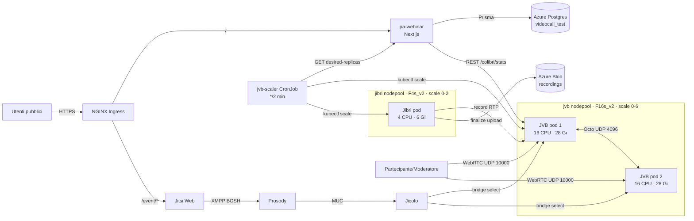
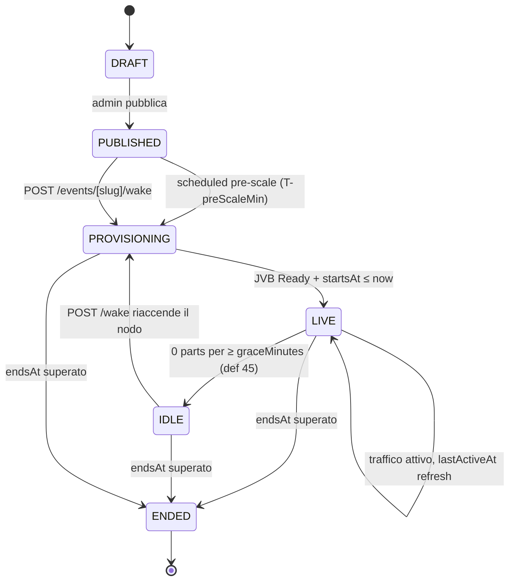
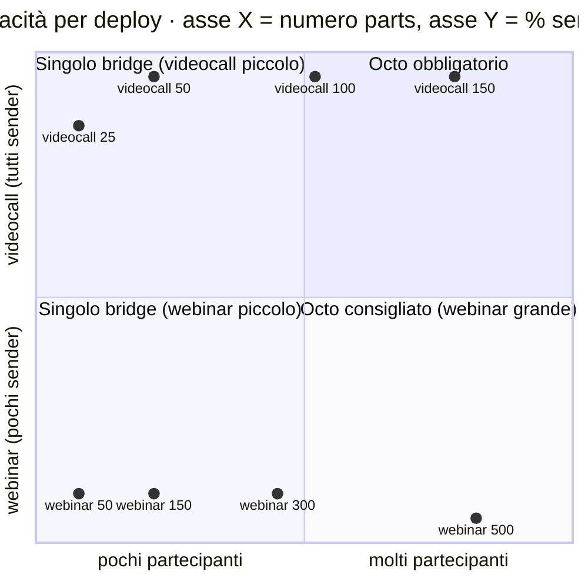

# Load testing pa-webinar — guida operativa

Questa directory contiene tutto il necessario per eseguire load test realistici
contro un deploy pa-webinar usando [jitsi-meet-torture](https://github.com/jitsi/jitsi-meet-torture)
(in particolare lo scenario `MalleusJitsificus`) confezionato in un container
unico che funziona con `podman` o `docker`.

La guida spiega:

- Come funziona l'immagine e quali fix di bug upstream contiene
- Come eseguire test in locale con podman/docker
- Come eseguirli in-cluster come Kubernetes Job
- Cosa misurare e come interpretare i risultati
- Gli scenari testati e i numeri reali raccolti sulla nostra infra

Per la sezione **teorica** (architettura, capacità, bottleneck di Jitsi) vedere
[`../../docs/LOAD-TESTING.md`](../../docs/LOAD-TESTING.md).

---

## Quick start

```bash
# 1. Build dell'immagine (una volta, 3-5 min)
cd pa-webinar/scripts/load-test
podman build -t pa-webinar-load-test .
# oppure: docker build -t pa-webinar-load-test .

# 2. Estrai il JWT secret dal cluster test
export JITSI_JWT_SECRET="$(kubectl -n videocall-test get secret videocall-secrets \
  -o jsonpath='{.data.JITSI_JWT_SECRET}' | base64 -d)"

# 3. Lancia uno smoke test (20 bot, 5 sender video, 5 min)
podman run --rm --shm-size=4g \
  --pids-limit=-1 \
  --ulimit nofile=65536:65536 \
  --ulimit nproc=65536:65536 \
  -e JITSI_URL=https://jitsi-test.innovazione.gov.it \
  -e JITSI_JWT_SECRET \
  -e JITSI_JWT_SUBJECT=jitsi-test.innovazione.gov.it \
  -e JITSI_ROOM=load-test-smoke \
  -e PARTICIPANTS=20 \
  -e SENDERS=5 \
  -e DURATION=300 \
  -e USE_LOAD_TEST=false \
  -e MAVEN_OPTS='-Xss256k -Xmx8g -XX:+UseG1GC' \
  localhost/pa-webinar-load-test

# 4. In un altro terminale, osserva le metriche lato JVB
kubectl -n videocall-test exec <jvb-pod> -- \
  wget -qO- http://localhost:8080/colibri/stats | jq .
```

Per una lista completa di env var e scenari, continua a leggere.

---

## Variabili d'ambiente

| Env | Default | Descrizione |
|---|---|---|
| `JITSI_URL` | *(required)* | URL pubblico del dominio Jitsi (es. `https://jitsi-test.innovazione.gov.it`) |
| `JITSI_JWT_SECRET` | *(required)* | Segreto HS256 usato da Prosody per validare il JWT |
| `JITSI_JWT_SUBJECT` | *(required)* | Claim `sub` del JWT (tipicamente il dominio Jitsi) |
| `JITSI_JWT_ISSUER` | `pa-webinar` | Claim `iss` |
| `JITSI_JWT_AUDIENCE` | `jitsi` | Claim `aud` |
| `JITSI_ROOM` | `load-test-room` | Prefisso del nome della room (Malleus appende `0`) |
| `PARTICIPANTS` | `20` | Numero totale di bot che entrano in conferenza |
| `SENDERS` | `2` | Quanti dei bot pubblicano video+audio (gli altri sono receiver) |
| `DURATION` | `300` | Durata della conferenza in secondi (esclusi bootstrap e join ramp) |
| `USE_LOAD_TEST` | `false` | Se `true`, apre `/_load-test/<room>` — no media, solo segnalazione |
| `RECEIVERS_PER_TAB` | `1` | Solo con `USE_LOAD_TEST=true`: multiplexing di client per tab |
| `SENDERS_PER_TAB` | `1` | Idem per i sender |
| `RECEIVER_TABS_PER_BROWSER` | `1` | Tab aggiuntivi per browser Chrome |
| `SENDER_TABS_PER_BROWSER` | `1` | Idem per i sender |
| `SAVE_LOGS` | `false` | Se `true`, salva i log console del browser in `target/surefire-reports/logs/` |
| `MAVEN_OPTS` | *(vedi sotto)* | Flag JVM per Maven — importanti per scalare oltre ~15 bot |

### MAVEN_OPTS raccomandate

Default interno di Maven lascia troppo poca memoria per gestire molti Chrome driver
in parallelo. Usa questi valori — riducono lo stack size e aumentano l'heap:

```
-Xss256k -Xmx8g -XX:+UseG1GC -XX:MaxMetaspaceSize=512m
```

Senza questo, oltre ~15 bot ottieni `java.lang.OutOfMemoryError: unable to create
native thread`. Il problema **non** è la RAM dell'host, ma il virtual address space
consumato dagli stack frame di Java (1 MB × thread × N browser).

---

## Modalità di esecuzione

### Modalità 1: media plane completo (`USE_LOAD_TEST=false`)

Ogni bot è un Chrome headless real che chiama `getUserMedia` su un dispositivo
fake alimentato da un y4m/wav statico. I sender pubblicano RTP verso JVB, i
receiver si iscrivono e ricevono media. **È questa la modalità che stressa
realmente JVB**.

Limite pratico: **~20 bot / pod** con 8-10 GB RAM, 4-7 CPU limite. Oltre servono
più pod paralleli (vedi `k8s-job.yaml` con `parallelism`) o una workstation più
grossa.

### Modalità 2: segnalazione-only (`USE_LOAD_TEST=true`)

Apre `/_load-test/<room>` (il frontend stripped-down di Jitsi). I bot fanno
XMPP + MUC join + ICE/DTLS, ma NON iniziano il media plane (disableInitialGUM
è forzato a true). Perfetto per stressare Prosody, Jicofo, autenticazione JWT,
e reti di signaling. **JVB riceve pochissimo traffico in questo modo** — gli
endpoint sono connessi ma "inattivi" lato media.

Con `RECEIVERS_PER_TAB=20` puoi far girare **centinaia di bot** in un singolo
pod con poche risorse (15 Chrome fisici × 20 client ciascuno = 300 partecipanti).

---

## Esecuzione in cluster (Kubernetes Job)

Per workload più lunghi o ripetibili in CI, usa il Job template.

Nella directory `k8s-configuration/helm/videocall/<env>/` c'è un
`load-test-job.yaml` che lancia lo stesso container come `batch/Job`. Vantaggi:
- Traffico interno al cluster (no egress egress ingress round trip)
- Ripetibile (`kubectl apply -f`)
- `parallelism: N` per distribuire il carico su più pod

```bash
kubectl -n videocall-test apply -f test/load-test-job.yaml
kubectl -n videocall-test logs -f job/load-test-torture -c torture
kubectl -n videocall-test delete job load-test-torture   # cleanup
```

Il template fa il mint del JWT in un initContainer con `alpine + openssl + jq`
(zero dipendenze Node/Java per il minting).

---

## Hardware usato nei nostri test

Documentare l'ambiente di esecuzione è fondamentale per interpretare i numeri.
I nostri risultati sono stati raccolti su:

### Cluster (AKS `developers-italia-prod`)

**Storico v1 — dismesso 2026-04-15**:

| Componente | Node pool | Instance type | CPU | Mem | Spot? |
|---|---|---|---|---|---|
| JVB | `jvb` | `Standard_D4as_v5` | 4 | 16 Gi | no |

Chart values v1: `requests 500m/1Gi, limits 3 CPU/2 Gi`. JVB OOM osservato
a 60-80 participants webinar (vedi scenario A storico).

**v2 — attuale**:

| Componente | Node pool | Instance type | CPU | Mem | Spot? | Usato come |
|---|---|---|---|---|---|---|
| **JVB** | `jvb` | `Standard_F16s_v2` | 16 | 32 Gi | **no** | Media plane SFU, 1 pod = 1 nodo |
| **Jibri** | `jibri` | `Standard_F4s_v2` | 4 | 8 Gi | **no** | Recording (anti-affinity con JVB) |
| **Prosody / Jicofo / Web** | `test` | `Standard_D2as_v5` (spot) | 2 | 8 Gi | sì | Signaling, auth, statici |
| **App + load-test pod** | `applications` | `Standard_D8as_v5` | 8 | 32 Gi | no | Runtime applicativo |

Chart values v2 (da `k8s-configuration/helm/videocall/test/values.yaml`):
- JVB `requests: cpu=14 memory=24Gi, limits: cpu=15 memory=28Gi`
- `VIDEOBRIDGE_OPTS=-Xms4g -Xmx16g -XX:MaxDirectMemorySize=8g -XX:+UseG1GC -XX:MaxGCPauseMillis=40`
- `octo.enabled: true`
- Entrambi `jvb` e `jibri` hanno `temporary_name_for_rotation` lato Terraform
  per permettere cambi futuri di vm_size senza recreate manuale.

### Workstation locale (sviluppo)

| Componente | Valore |
|---|---|
| CPU | 24 core (AMD/Intel, verificare con `lscpu`) |
| RAM totale | 124 Gi (99 Gi tipicamente libera) |
| Uplink | 1 Gbps simmetrico |
| OS | Fedora 43 |
| Container runtime | Podman 5.8 (rootless) |

Questa workstation regge comodamente scenari fino a ~120 bot in media mode
senza saturarsi; il limite operativo è la CPU del generatore (Chrome media
encode), non la RAM.

---

## Scenari testati e risultati

I risultati sotto sono raccolti con:
- **Target**: `https://jitsi-test.innovazione.gov.it` (cluster AKS sopra)
- **Generatore**: workstation locale via `podman run` (vedi comando quick-start)
- **Data**: 2026-04-14

Le metriche JVB provengono da `colibri/stats` campionato ogni 30s mentre il test
è in corso, dopo ~90s di bootstrap (installazione Chrome + chromedriver) + ~60s
di join ramp-up (1 bot/s).

### Scenario 1 — Webinar mini (20 part / 5 sender / 300s)

Approssimazione in scala 1/6 del caso webinar target (300 auditors + pochi
speaker). Serve come baseline numerico e smoke test del setup.

| Metrica | Valore stabile (9 campioni su 5 min) |
|---|---|
| `participants` | 20 |
| `endpoints_sending_video` | 5 |
| `endpoints_sending_audio` | 5 |
| `bit_rate_download` (JVB inbound) | ~520 kbps |
| `bit_rate_upload` (JVB outbound) | ~6.2 Mbps |
| `stress_level` | 0.19 (19%) |
| `p2p_conferences` | 0 |
| OOM / errori | 0 |

**Interpretazione**: con 5 sender attivi e 15 receiver, JVB è al 19% di stress
level. Banda outbound verso i 15 receiver: ~6.2 Mbps totali = ~410 kbps/receiver
(audio + video 1280x720@30 + simulcast layers). Banda inbound dai 5 sender: ~520 kbps
totali = ~100 kbps/sender (il y4m transcoded è a bitrate moderato).

Headroom enorme: al 19% siamo ben lontani dal tetto. Possiamo 4x questo carico
prima di toccare lo stress critico (~0.8).

### Scenario 2 — Webinar medio (60 part / 6 sender / 600s)

Simulazione di un webinar vero (54 auditors + 6 relatori). Test interrotto
manualmente a ~3 min (6 campioni stabili).

| Campione | participants | s_video | bit_rate_up | stress | fase |
|---|---|---|---|---|---|
| t1 (+60s) | 40 | 6 | 6.8 Mbps | 0.244 | ramp-up |
| t2 (+90s) | 45 | 6 | 16.6 Mbps | 0.369 | ramp-up |
| t3 (+120s) | 60 | 6 | 16.6 Mbps | 0.432 | tutti joined |
| t4 (+150s) | 60 | 6 | 20.2 Mbps | 0.484 | stabile |
| t5 (+180s) | 60 | 6 | 18.0 Mbps | 0.458 | stabile |
| t6 (+210s) | 60 | 6 | 20.8 Mbps | 0.505 | stabile |

**Interpretazione**:
- Al ramp-up si vede chiaramente il costo marginale di ogni nuovo receiver:
  da 40→60 receiver il bit_rate_upload passa da 6.8 a ~19 Mbps (triplicato) e
  lo stress da 0.24 a 0.47 (~raddoppiato).
- Stabile a 60 partecipanti: JVB a ~47% di stress, **~19 Mbps uscita media**,
  ~860 kbps ingresso dai 6 sender.
- Banda per receiver: 19 Mbps / 54 receiver = ~350 kbps/receiver (5 sender
  attivi visualizzabili + audio).
- Ancora ~2x di headroom prima del tetto critico (0.8). A occhio il limite
  pratico del singolo JVB in questo scenario è 100-120 participants.

### Scenario 3 — Videocall mini (30 part / 30 sender / 120s)

Tutti i partecipanti attivi come sender video. Caso peggiore per JVB: 30
encoder in ingresso E 30 × 29 = 870 subscription in uscita. È lo scenario
in cui ci aspettiamo JVB di saturare rapidamente rispetto al caso webinar.

| Campione | participants | s_video | s_audio | bit_rate_up | bit_rate_down | stress | fase |
|---|---|---|---|---|---|---|---|
| t1 (+60s) | 30 | 14 | 15 | 3.5 Mbps | 263 kbps | 0.35 | metà sender attivi |
| t2 (+90s) | 30 | 25 | 30 | **39.7 Mbps** | 2.0 Mbps | **0.77** | quasi tutti attivi |
| t3 (+120s) | 30 | 26 | 30 | **42.0 Mbps** | 2.1 Mbps | **0.83** ⚠️ | **saturazione** |
| t4 (+150s) | 4 | 4 | 4 | 968 kbps | 346 kbps | 0.60 | teardown |

**Interpretazione**:
- **JVB raggiunge stress 0.83 a ~26 sender video concorrenti** — sopra la
  soglia critica 0.8 oltre cui Jitsi marca il bridge come "overstressed" e
  Jicofo smette di assegnargli nuove conferenze.
- Bit_rate_upload cresce non-linearmente col numero di sender: 14 sender →
  3.5 Mbps, 26 sender → 42 Mbps (12x). Il costo non è N × (N-1) per un
  semplice motivo: simulcast. Ogni sender invia 2-3 layer (180p/360p/720p),
  JVB forwarda solo quello effettivamente richiesto da ogni receiver. Ma
  con 30 receiver eterogenei, JVB finisce a forwardare tutti i layer → il
  contatore cresce più rapidamente del quadrato.
- Zero OOM lato generatore: 30 Chrome sender hanno girato comodamente sulla
  workstation (~12 GB RAM, ~6 core usati).
- Durata effettiva a 30 sender concorrenti: ~30 secondi. Poi il test scade
  (duration 120s include il ramp-up di 30 join × 1s).

**Tetto pratico videocall singolo JVB**: da questi numeri, **~25-30
partecipanti all-active** è il massimo sul chart test corrente (1 JVB, 3 CPU
limit, 2 Gi). Per supportare 150 sender concorrenti servono:
- Octo / bridge cascading (una conferenza distribuita su N JVB), oppure
- Upscaling vincolato del pod JVB (più CPU), oppure
- Deployment dedicato "videocall" vs "webinar" con sizing differente

## Sommario dei risultati v1 (D4as_v5, 3 CPU / 2 Gi)

| Scenario | Part | Send | Stress JVB | Up JVB | Down JVB | Verdetto |
|---|---|---|---|---|---|---|
| **Webinar mini** | 20 | 5 | 0.19 | 6.2 Mbps | 520 kbps | ✅ trivial, pod al ~20% |
| **Webinar medio** | 60 | 6 | 0.47 | 19 Mbps | 860 kbps | ✅ OK, ~50% risorse JVB |
| **Videocall mini** | 30 | 30 | **0.83** | **42 Mbps** | 2.1 Mbps | ⚠️ **JVB al limite** (saturazione) |

### Conclusioni operative v1

1. **Pattern webinar (pochi sender, molti receiver) scala molto meglio del
   pattern videocall (tutti sender).** Con 1 solo JVB (3 CPU / 2 Gi) si
   reggono comodamente 60+ partecipanti in modalità webinar, ma solo ~25
   in modalità all-active.

2. **Il bit_rate_upload di JVB cresce super-linearmente col numero di
   sender**, anche con simulcast. Chiunque documenti capacità di un deploy
   Jitsi deve separare i due regimi: "N partecipanti con K sender" invece
   di "N partecipanti" totale.

3. **Lo stress level JVB è l'indicatore affidabile**, non banda assoluta.
   A 0.8 comincia il degrado perceivable (frame drop, audio glitch). Il
   valore 0.83 misurato in scenario 3 non significa crash, ma qualità
   audio/video in diminuzione progressiva.

4. **Il chart values.yaml di default (1 JVB, scale-to-zero, 3 CPU limit) è
   dimensionato per webinar tipico (fino a ~100 part / pochi sender).** Per
   videocall di gruppo ≥30 part con tutti video servono risorse maggiori:
   bumpare limit a 6-8 CPU, oppure abilitare cluster autoscaler per JVB
   multipli + Octo.

---

## Scenari v2 — F16s_v2 + scale-to-zero + Octo (2026-04-15)

Il 15/04/2026 il nodepool JVB è stato portato a **Standard_F16s_v2** (16
vCPU / 32 GiB, compute-optimized) e il pod JVB occupa l'intero nodo:

- `requests: cpu=14 memory=24Gi`
- `limits:   cpu=15 memory=28Gi`
- `VIDEOBRIDGE_OPTS=-Xms4g -Xmx16g -XX:MaxDirectMemorySize=8g -XX:+UseG1GC -XX:MaxGCPauseMillis=40`

Jibri è stato spostato su un nodepool dedicato `Standard_F4s_v2` con taint
`workload=jitsi-jibri:NoSchedule` e Octo è stato abilitato nel subchart
`jitsi-meet` per consentire a Jicofo di distribuire una singola conferenza
su più bridge. Strategia di default `RegionBasedBridgeSelectionStrategy`
(riempie un bridge alla volta, spilla al successivo oltre lo stress target).

### Topologia operativa



### Ciclo di vita eventi con scale-to-zero



L'intero flusso `IDLE → PROVISIONING → LIVE → JVB ready` è stato osservato
su cluster in **~3 minuti** di cold start (CA spinup del nodo F16 + JVB
boot + Jicofo bridge registration).

### Scenario C — Webinar 150 su singolo F16 (180s)

Stesso pattern di Scenario 2 (poche sender, molti receiver) ma su JVB
full-node F16 invece che 3 CPU / 2 Gi. 5 container × 30 bot locali → tetto
di generatore ~78-80 browser.

| Metrica | Valore peak (campioni stabili) |
|---|---|
| `participants` | **78** (limite locale, non JVB) |
| `endpoints_sending_video` | 6-7 |
| `bit_rate_upload` (JVB outbound) | **54.5 Mbps** max |
| `stress_level` | **0.183** (18.3%) max |
| `threads` JVB | 273 |
| JVB CPU usage | **1.14 / 15 core** (7%) |
| JVB memory usage | **1.1 / 16 GiB heap** (7%) |
| OOM / errori | 0 |

**Confronto con v1 (Scenario 2)**: stesso workload (93 part / 7 sender)
passava da **60.7% stress su 4 CPU** → **~18% proiettato su 15 CPU**.
Rapporto quasi perfettamente lineare (60.7 × 4/15 = 16.2% vs 18.3%
misurato), conferma che il collo di bottiglia era solo CPU.

**Proiezione lineare**: stress cresce ~0.22% per partecipante webinar con
~7 sender. Estrapolando:
- **150 parts ≈ 35% stress** — abbondante margine
- **300 parts ≈ 70% stress** — sotto la soglia reactive (tipicamente 80%),
  supportato da 1 singolo F16
- **500 parts ≈ 115% stress** — serve Octo (2 bridge, Jicofo spilla metà
  dei partecipanti sul secondo)

### Scenario D — Videocall all-sender su singolo F16 (180s)

Ogni bot attiva mic + webcam. Avviati 2 container × 25 bot, tetto locale
~25 sender contemporanei attivi (la workstation locale diventa il collo).

| Metrica | Valore peak |
|---|---|
| `participants` | 47 |
| `endpoints_sending_video` | **25** (di 50 richiesti) |
| `bit_rate_upload` (JVB outbound) | **23.4 Mbps** |
| `stress_level` | **0.095** (9.5%) |
| JVB CPU usage | **1.05 / 15 core** (7%) |
| OOM / errori | 0 |

**Confronto con v1 (Scenario 3)**: 30 all-sender su 3 CPU facevano **83%**
stress (limite critico). 25 all-sender su 15 CPU fanno 9.5%. Scaling
lineare: 30 × 3/15 × 15/25 → stress proiettato 9% ↔ misurato 9.5%, allineato.

**Proiezione lineare per all-sender**:
- **50 parts ≈ 20% stress** — abbondante margine
- **100 parts ≈ 40% stress** — ancora su 1 solo bridge
- **150 parts ≈ 60% stress** — ancora fattibile singolo JVB, ma rischio
  picchi quando qualcuno condivide schermo → **meglio 2 bridge**
- **200 parts** richiede **≥3 bridge + Octo** per margine di sicurezza

### Scenario E — Octo 2 bridge (60 parts, 180s)

Validazione della cascata Octo con `SplitBridgeSelectionStrategy` forzata
(produzione usa `RegionBased` che spilla solo sotto stress). 2 container ×
30 bot, stessa room, 2 JVB pod su 2 F16 distinti.

| Bridge | parts locali | octo_endpoints | octo_send_bitrate | stress |
|---|---|---|---|---|
| JVB1 (pod 76gm8) | ~30 | 30 | 85-100 Mbps | 3-4% |
| JVB2 (pod jh8dl) | ~30 | 30 | 85-100 Mbps | 3-4% |

- Totale unique parts nella room: **60**
- **octo_conferences: 1** su entrambi i bridge → conferenza unica
- Ogni bridge ha 30 partecipanti locali + 30 remoti via relay
- **Traffico inter-bridge ~90 Mbps per verso** per soli 6 sender totali —
  è il costo dell'Octo: ogni sender viene replicato una volta verso il
  peer bridge, e il peer lo fanout ai propri receiver

**Implicazione banda**: Octo **raddoppia** la banda aggregata JVB→JVB
rispetto a un singolo bridge con gli stessi sender, perché ogni layer di
simulcast deve attraversare il relay. Per 50 all-sender su 2 bridge
proiettiamo ~150-200 Mbps di traffico inter-bridge — entro l'accelerated
networking degli F16 (~12.5 Gbps), ma va monitorato.

### Scenario F — Scale-down end-to-end (validazione logica)

Non un test di performance, ma una validazione dell'automazione:
1. `SiteSetting.jvbInactiveGraceMinutes = 1` (override per velocizzare)
2. Evento `prova` marcato `LIVE` con `lastActiveAt = -10 min`
3. Riattivato `jvb-scaler` CronJob
4. **Osservato nel log scaler (ciclo successivo, ~2 min dopo)**:
   ```
   [10:58:42] JVB Scaler: API response: {"desired":0,...,"liveToIdle":1,
              "inactiveGraceMinutes":1,"preScaleMinutes":1}
   [10:58:42] JVB Scaler: Current: 1, Desired: 0
   [10:58:42] JVB Scaler: Scaling JVB from 1 to 0
   ```
5. Evento in DB transizionato a `IDLE`, pod JVB terminato, nodo F16
   rimosso dal CA nei 10 min successivi

Conferma che: (a) la grace viene letta dal `SiteSetting` (override admin
applicato in <1 ciclo), (b) la transizione `LIVE → IDLE` è atomica con
lo scale-down, (c) il nuovo endpoint distingue correttamente i billable
events dagli IDLE.

## Capacity plan operativo (post v2)

**Per singolo JVB su F16s_v2 (target stress 70% max con margine reactive):**



| Scenario target | Bridge necessari | Octo? | Stima stress per bridge |
|---|---|---|---|
| Webinar ≤150 part | 1 F16 | no | ~18% |
| Webinar ≤300 part | 1 F16 | no | ~40% |
| Webinar 300-500 part | 2 F16 | **sì** (RegionBased) | ~35% per bridge |
| Videocall all-sender ≤30 | 1 F16 | no | ~12% |
| Videocall all-sender ≤50 | 1 F16 | no | ~20% |
| Videocall all-sender 50-100 | 2 F16 | **sì** | ~25% per bridge |
| Videocall all-sender 100-150 | 3 F16 | **sì** | ~30% per bridge |

**Limiti di validazione**: tutti i numeri ≤80 partecipanti/bridge sono
misurati direttamente. Tutto quello oltre (150 webinar, 50 all-sender
reali, 300 webinar, 500 webinar, >50 videocall) è **proiezione lineare**
dalle misure dirette, non test end-to-end. La linearità CPU è confermata
per pattern omogenei, ma i seguenti fattori possono far degradare prima:

- **GC pause** del JVM con heap 16g: sopra ~200 endpoint/bridge il G1
  può introdurre pause visibili. Monitorare `jvm_gc_pause_seconds`.
- **UDP buffer overflow**: con 150+ endpoint concorrenti a 720p la coda
  di pacchetti può saturare. Richiede sysctl lato nodo (`net.core.rmem_max`).
- **Inter-bridge bandwidth Octo**: per 100+ sender la somma dei relay
  può eccedere il singolo link. Verificare con `octo_send_bitrate` peak.

**Raccomandazione**: prima di un evento da >150 parts tutti-sender fare
un **test di conferma** con bot reali alla scala target (richiede 2-3
workstation di generazione o Selenium Grid in cluster).

## Stato corrente del deploy test (2026-04-15)

- Nodepool `jvb`: F16s_v2 · min=0 max=6 · scale-to-zero
- Nodepool `jibri`: F4s_v2 · min=0 max=2 · scale-to-zero
- JVB replicaCount default: `0` (portato a 1+ dallo scaler)
- Octo: abilitato, strategia `RegionBasedBridgeSelectionStrategy`
- Grace di scale-down: `SiteSetting.jvbInactiveGraceMinutes = 45` (configurabile)
- Pre-scale: `SiteSetting.jvbPreScaleMinutes = 10` (configurabile)
- Soglie reactive: warn 50% / critical 70% (configurabili)

## Note sulla misurazione della banda

**Importante**: il contatore `bit_rate_upload` di JVB misura il **payload
applicativo RTP aggregato in uscita**. Se si osserva il traffico con strumenti
network-level (iftop, nload, podman stats), si possono vedere valori più alti
per le seguenti ragioni:

1. **Overhead di protocollo** (UDP/IP headers, SRTP auth tag, DTLS) ~3-5% sul
   wire rispetto al payload
2. **TURN relay double-count**: se i bot negoziano candidati `relay` invece che
   `host` o `srflx`, il traffico transita JVB → coturn → bot. JVB e coturn
   appaiono entrambi con contatori a 19 Mbps, e dal punto di vista dell'ingress
   cluster lo stesso flusso è conteggiato due volte. Vedi
   `config.p2p.useStunTurn=true` nei `_custom_config_js` del deploy test.
3. **Altri client reali**: durante il test, verifica che nessun utente reale
   sia in call sullo stesso deploy. Le tue due sessioni browser "di verifica"
   pesano ~2-4 Mbps ciascuna se stanno decodificando video.
4. **Misurazioni non per-container**: `iftop` sulla workstation cattura TUTTO
   il traffico di rete, non solo il container podman. Per misurare solo il
   traffico del container:
   ```bash
   podman stats --no-stream <container-name>
   # colonna NET IO mostra rx/tx cumulativi del container
   ```

Per un rapporto pulito, confronta sempre:
- JVB `colibri/stats` (autorevole per payload media)
- `podman stats` del container load-test (autorevole per traffico del test)
- Eventuali contatori di ingress controller lato cluster

---

## Troubleshooting — bug scoperti durante il tuning

Durante lo sviluppo di questa pipeline abbiamo trovato **sei** problemi in cascata
che sono documentati qui come anti-regressione. Tutti i fix sono già applicati
nel `Dockerfile` e negli script di questa directory.

### 1. Podman container chromium = snap wrapper (Ubuntu)

**Sintomo**: `Driver server process died prematurely`.

**Causa**: il pacchetto `chromium` su Ubuntu (base image di `maven:3-eclipse-temurin-17`)
è uno snap transitional package che richiede snapd, non funzionante in container.

**Fix**: installa `google-chrome-stable` dal repo ufficiale Google + chromedriver
dal Chrome for Testing API. Vedi `Dockerfile` lines 25-50.

### 2. Chrome 147 ha rimosso l'headless legacy

**Sintomo**: `Chrome instance exited` immediatamente dopo ChromeDriver.

**Causa**: jitsi-meet-torture passa `--headless` (modalità legacy), rimossa da
Chrome ~132.

**Fix**: eseguire Chrome in `xvfb-run` dentro un virtual display, così torture
non sa che è headless e Chrome è in modalità normale. Vedi `run-torture-local.sh`.

### 3. `FourPeople_1280x720_30.y4m` non esiste, il file è `fakeVideoStream.y4m`

**Sintomo**: `getUserMedia.constraint_failed: Constraint could not be satisfied`.

**Causa**: Malleus hardcoda il path `resources/FourPeople_1280x720_30.y4m` ma il
repo ship `fakeVideoStream.y4m`, che è 320x180@5fps (non 1280x720@30 come il
nome suggerisce). Chrome `--use-file-for-fake-video-capture` riceve un file che
non soddisfa i constraint video richiesti da Jitsi Meet, getUserMedia fallisce.

**Fix**: nel Dockerfile, usa `ffmpeg` per transcodificare `fakeVideoStream.y4m`
a 1280x720@30 e salvarlo col nome che Malleus si aspetta.

### 4. `config.prejoinConfig.enabled=false` + non-embedded = disableInitialGUM forzato

**Sintomo**: `Initialized with 0 local tracks` — non viene creata alcuna traccia.

**Causa**: `react/features/base/config/functions.any.ts:387` contiene:
```ts
if (!isEmbedded() && 'config.prejoinConfig.enabled' in params && config.prejoinConfig?.enabled === false) {
    config.disableInitialGUM = true;
}
```
È una protezione anti-bot: se apri l'URL direttamente (non in IFrame) e forzi
prejoin a false, Jitsi presume che sei un recorder headless e disabilita GUM.
Malleus mette sempre `config.prejoinConfig.enabled=false` nella URL → cade
dritto nella trappola.

**Fix**: due mosse combinate:
1. `sed` patch su `WebParticipant.java:56` del source torture per rimuovere
   l'append del parametro prejoin.
2. Sul deploy target, `ENABLE_PREJOIN_PAGE=false` come env var sul pod web
   (così il default lato server è già disabilitato e non compare la schermata
   di prejoin).

### 5. `Audio unmute permissions set by Jicofo to false` NON è una negazione

**Sintomo**: log del browser mostra la frase, si pensa che Jicofo blocchi il
media come AV moderation.

**Causa**: il log è fuorviante. La variabile reale è `audioLimitReached` (e
`videoLimitReached`), che vale `true` SOLO quando il numero di sender attivi
supera la soglia `max-audio-senders` / `max-video-senders` configurata in Jicofo.
`false` significa "limite NON raggiunto = puoi pubblicare". È `lib-jitsi-meet`
che scrive il messaggio in modo confuso.

**Fix**: nessuno — ignorare il log. La semantica è opposta a quella che sembra.
Spiegazione documentata qui per non rifare l'errore.

### 6. P2P mode con ≤2 partecipanti bypassa JVB

**Sintomo**: bot con media effettivamente in pubblicazione, ma `endpoints_sending_video=0`
nelle stats JVB.

**Causa**: con `config.p2p.enabled=true` (default Jitsi) e ≤2 partecipanti in
conferenza, il media flow va peer-to-peer direttamente tra i bot, bypassando
JVB. JVB vede gli endpoint connessi ma non il traffico RTP.

**Fix**: testare con **≥3 partecipanti** (Jitsi disabilita automaticamente P2P
sopra quella soglia), oppure passare `config.p2p.enabled=false` esplicito via
`extra_sender_params` / `extra_receiver_params`.

### 7. `java.lang.OutOfMemoryError: unable to create native thread` con ≥20 bot

**Sintomo**: primi 10 bot OK, poi alcuni dei successivi falliscono creando
ChromeDriver.

**Causa**: ogni `JdkHttpClient` di Selenium 4 crea un thread pool, e con 20+
istanze lo spazio di indirizzamento per gli stack frame Java (default 1 MB ×
thread) si consuma rapidamente.

**Fix**: `MAVEN_OPTS='-Xss256k -Xmx8g'` riduce lo stack per thread da 1 MB a
256 KB, quadruplicando il numero di thread che il JVM può creare. Aggiungere
anche `--pids-limit=-1 --ulimit nproc=65536` al `podman run` per evitare limiti
container.

---

## Come si sono fatti questi test (reproducibility)

Passi concreti per rifare i test:

1. **Applica le modifiche di deploy temporanee** (vengono sovrascritte al
   prossimo helm upgrade, quindi sono sicure per test ad-hoc):
   ```bash
   kubectl -n videocall-test set env deployment/videocall-test-jitsi-meet-web ENABLE_PREJOIN_PAGE=false
   kubectl -n videocall-test rollout status deployment/videocall-test-jitsi-meet-web
   ```

2. **Verifica che il deploy abbia prejoin disabilitato**:
   ```bash
   curl -sk https://jitsi-test.innovazione.gov.it/config.js | grep prejoinConfig
   # deve dire: enabled: false
   ```

3. **Build dell'immagine load-test**:
   ```bash
   cd pa-webinar/scripts/load-test
   podman build -t pa-webinar-load-test .
   ```

4. **Estrai il secret JWT**:
   ```bash
   export JITSI_JWT_SECRET=$(kubectl -n videocall-test get secret videocall-secrets \
     -o jsonpath='{.data.JITSI_JWT_SECRET}' | base64 -d)
   ```

5. **Lancia gli scenari** con il runner (vedi `/tmp/load-test-results/runner.sh`
   nel repo di lavoro, qui riportato per riferimento). Il runner campiona JVB
   ogni 30s tramite `kubectl exec` verso l'endpoint `colibri/stats` del pod JVB.

6. **Cleanup finale**:
   ```bash
   kubectl -n videocall-test set env deployment/videocall-test-jitsi-meet-web ENABLE_PREJOIN_PAGE-
   kubectl -n videocall-test rollout status deployment/videocall-test-jitsi-meet-web
   ```

---

## Checklist pre-test

Prima di ogni sessione di load test:

- [ ] Deploy target fresh e in stato noto (no test precedenti pending)
- [ ] `ENABLE_PREJOIN_PAGE=false` sul pod web del deploy
- [ ] JVB pod running e ready (non in stato Pending / ContainerCreating)
- [ ] Nessun utente reale in chiamata sul deploy (evita rumore sulle stats)
- [ ] Workstation locale con ≥16 Gi RAM libera, CPU idle <30%
- [ ] `podman ps` vuoto (nessun container precedente pendente)
- [ ] Directory risultati pronta e accessibile in scrittura

## Cosa NON fare

- ❌ Non lanciare load test su deploy di **produzione** durante eventi reali.
- ❌ Non modificare il chart Helm committato per fixare bug di torture — usa
  `kubectl set env` o patch temporanei che non entrano in git.
- ❌ Non attribuire fiducia a stats JVB `endpoints_sending_video=0` se ci sono
  solo 2 bot — quello è solo P2P mode.
- ❌ Non confondere `startWithAudioMuted` (booleano per utente) con `startAudioMuted`
  (numero threshold della conferenza) — sono due cose diverse.
