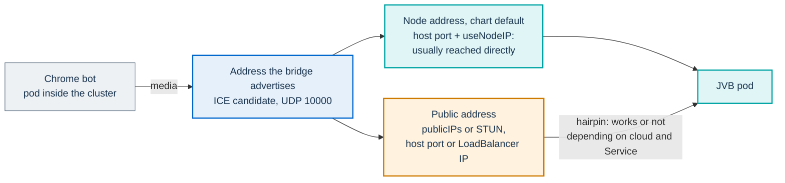

# In-cluster load test with Selenium Grid

This runbook runs the `MalleusJitsificus` scenario of
[jitsi-meet-torture](https://github.com/jitsi/jitsi-meet-torture) inside the
cluster, with the browsers on a Selenium Grid, against the conference of a
PA Webinar installation. It is written for operators.

The test method, the success criteria and the reference measurements are in
[Load testing and reference measurements](../../docs/LOAD-TESTING.md). The
toolkit's container image, its variables and its known failures are in the
[load-test toolkit](README.md).

> **Never run this test during a real event.** The bots share the ingress,
> Prosody, Jicofo and the bridge with real participants. The procedure also
> pauses the JVB scaler, which stops the automatic event lifecycle.

## Files

| File | What it contains |
|---|---|
| `selenium-grid.yaml` | A Selenium 4 hub (Deployment and Service `selenium-hub`) and the `selenium-node-chrome` Deployment. At the values in the file, 6 node replicas with `SE_NODE_MAX_SESSIONS=5` give 30 browser slots. |
| `torture-job-selenium.yaml` | The Job `torture-malleus`. It waits for the grid, clones jitsi-meet-torture and runs Malleus in Selenium remote mode: one conference, 30 participants, 3 senders, 180 seconds. |
| `mint-jwt.sh` | Mints the wildcard-room token that every bot carries. |
| `k8s-job.yaml` | A Job that runs Chrome inside the Maven container. It does not complete a run and is kept for reference only; see [Why Selenium Grid](#why-selenium-grid). |

Every object in the two grid manifests carries the label
`app.kubernetes.io/component=load-test`, and the procedure adds it to the
token Secret, so one selector removes everything the test creates.

## Why Selenium Grid

- **Chrome cannot run inside the Maven container.** `k8s-job.yaml` runs
  Malleus with a local Chrome. It gets as far as starting the browsers, and
  then Chrome exits on startup. jitsi-meet-torture has no property for the
  extra flags Chrome needs in that container, and the Jitsi project itself
  runs its browsers on Selenium nodes.
- **The grid removes the single-generator ceiling.** A workstation runs out
  of memory, CPU or uplink long before the bridge does (see
  [Where to run the bots](../../docs/LOAD-TESTING.md#where-to-run-the-bots)).
  The grid spreads the Chrome nodes across cluster nodes.
- **It has one cost.** A bot inside the cluster reaches the bridge through
  the address the bridge advertises, the same address participants on the
  internet use. Whether that path works from inside the cluster depends on
  how the bridge is exposed, which is why the smoke test in
  [step 7](#7-smoke-test-with-three-bots-mandatory) is mandatory.

The grid is not small. In `selenium-grid.yaml` each Chrome node requests one
CPU and 4 GiB of memory, with a limit of 4 CPUs and 6 GiB, plus a
memory-backed `/dev/shm` of up to 2 GiB. The hub and the Job's container
request about one and a half CPUs and 2 GiB more. The authoritative figures
are the `resources` blocks in the two manifests.

## Gotchas the manifests handle

Each of these stops a run. Keep them when you edit the manifests. The
limits the manifests do not solve are listed next, under
[Known limitations](#known-limitations).

### The token goes in `-Dorg.jitsi.token`

The conference requires a portal-signed JWT: Prosody runs with
`AUTH_TYPE: jwt`, and the chart sets `jitsi-meet.enableAuth: true` and
`jitsi-meet.enableGuests: false` (see
[Authentication bridge: the Prosody side](../../docs/architecture/jitsi-integration.md#authentication-bridge-the-prosody-side)).
A bot without a valid token fails in the browser before it opens the
signaling connection, so Prosody logs no connection at all.
jitsi-meet-torture reads the token from `-Dorg.jitsi.token`. A property named
`-Dorg.jitsi.malleus.jwt` does not exist and is ignored.

The token carries `room: "*"`. Malleus appends the conference index to the
room prefix (`loadtest` becomes `loadtest0`), so a token for the exact prefix
would never match.

### Pass the full `org.jitsi.malleus.*` set

Malleus reads its settings from `org.jitsi.malleus.*` system properties and
parses the numeric ones without a fallback. A missing property fails the run
before any browser starts. The Job passes the complete set, including
properties left empty such as `org.jitsi.malleus.regions`.

### Signaling goes through the public URL

`-Djitsi-meet.instance.url` must be the public conference URL. The Jitsi web
configuration points signaling (BOSH and the XMPP WebSocket) at the public
host, so a browser that loaded the room page from anywhere, even from a
ClusterIP inside the cluster, still signals through the public ingress.
Count the ingress as part of the system under test (see
[Signaling always crosses the public ingress](../../docs/LOAD-TESTING.md#signaling-always-crosses-the-public-ingress)).

### The grid readiness gate tolerates whitespace

The Job's `wait-for-grid` init container asks the hub's GraphQL endpoint for
`totalSlots` and waits until it reaches 30, polling every five seconds for
up to 60 attempts. The hub answers with a space after the colon
(`"totalSlots": 30`), so the gate strips whitespace before it matches. A
stricter pattern never sees the grid as ready.

## Known limitations

### The readiness gate always waits for 30 slots

The threshold is fixed in the `wait-for-grid` script, not derived from the
participant count. Every copy of the Job, including the three-bot smoke
copy, waits for 30 slots, so deploy the full grid before any run. The
comment in `selenium-grid.yaml` about starting with one node for the smoke
test does not hold unless you also lower the threshold.

### The torture source runs unpatched

The Job clones the default branch of jitsi-meet-torture on every run and
does not patch it. The toolkit's own image removes the
`config.prejoinConfig.enabled=false` parameter that jitsi-meet-torture adds
to every room URL. The grid Job keeps it, because removing it without also
disabling the prejoin page on the target can leave senders stuck on the
prejoin screen. Two consequences follow:

- With that parameter, Jitsi Meet skips the initial camera and microphone
  capture on a page that is not embedded (see
  [A room that behaves like a real one](../../docs/LOAD-TESTING.md#a-room-that-behaves-like-a-real-one)).
  The senders also get no video file. Expect little or no media, and judge
  the run on joins and ICE rather than on bitrates.
- The clone is not pinned. An upstream change can break the run or change
  what it measures, so record when each run was made next to its results.

## Before you start

- **A window with no event.** Nothing `LIVE`, nothing inside its pre-scale
  window, no `IDLE` room anyone may wake and no instant call about to start.
  [What a pause stops](../../docs/operations/jvb-scaler.md#what-a-pause-stops)
  lists what breaks otherwise.
- **Cluster rights** to patch the scaler CronJob, scale the JVB Deployment,
  read the application Secret, list pods and read their logs, exec into the
  JVB pod, and create, label and delete Deployments, Services, Jobs and
  Secrets in the namespace. Check them before step 2: a missing right found
  halfway through can leave the scaler suspended.
- **Local tools**: `kubectl`, `curl`, plus `openssl` and `jq` for
  `mint-jwt.sh`.
- **Outbound access from the cluster** to Docker Hub for the images, and to
  GitHub and Maven Central, which the Job reaches on every run. If the
  Maven image lacks `git`, the Job installs it from the distribution's
  package mirrors.
- **Node capacity** for the grid, as described in
  [Why Selenium Grid](#why-selenium-grid).
- **No Jitsi upgrade** in progress or planned during the test. A
  `helm upgrade` writes `jitsi-meet.jvb.replicaCount` back into the JVB
  Deployment, which undoes a manual scale.

If the installation does not run the scaler (a profile other than `full`,
or `jvbScaler.enabled: false`), skip the scaler lines in steps 1, 2, 3 and 9.
The bridge count is then set by `jitsi-meet.jvb.replicaCount`; see
[Bridge (JVB)](../../docs/DEPLOYMENT.md#bridge-jvb).

## Procedure

```mermaid
flowchart LR
  classDef step fill:#E6F0FA,stroke:#0066CC,stroke-width:2px,color:#17324D
  classDef risk fill:#FCE8EC,stroke:#D1344C,stroke-width:2px,color:#17324D
  classDef media fill:#E0F5F5,stroke:#00A3A3,stroke-width:2px,color:#17324D
  classDef gate fill:#FFF3E0,stroke:#CC7A00,stroke-width:2px,color:#17324D
  classDef data fill:#E3F2EC,stroke:#008055,stroke-width:2px,color:#17324D
  classDef neutral fill:#EEF1F4,stroke:#5C6F82,stroke-width:1px,color:#17324D

  BASE["1. Baseline<br/>no event due;<br/>note suspend flag and bridge count"]:::step
  SUSP["2-3. Suspend the scaler<br/>and wait out in-flight runs<br/>pauses the event lifecycle:<br/>never near a scheduled event"]:::risk
  SCALE["4. Scale the JVB<br/>one bridge, wait until ready"]:::media
  PREP["5-6. Token Secret<br/>and Selenium Grid"]:::step
  SMOKE{"7. Smoke test, 3 bots:<br/>ICE succeeded<br/>for every bot?"}:::gate
  FULL["8. Full run<br/>30 bots, one conference"]:::step
  REST["9. Restore<br/>delete load-test objects,<br/>bridge count, scaler flag"]:::data
  OFF["Run the bots<br/>outside the cluster"]:::neutral

  BASE --> SUSP --> SCALE --> PREP --> SMOKE
  SMOKE -->|"yes"| FULL --> REST
  SMOKE -->|"no: stop"| REST
  REST -.->|"after a failed smoke test"| OFF
```



Run every step from `scripts/load-test/`, in one shell, because later steps
use the variables set in step 0. If anything fails or you abort midway, go
straight to step 9: the restore is never optional.

### 0. Set the variables and prepare the manifests

```bash
NS=pa-webinar                          # namespace of the installation
REL=pa-webinar                         # Helm release name
APP_SECRET=<app-secret>                # secrets.existingSecretName; the chart's default name is videocall-secrets
JITSI_HOST=meet.webinar.example.com    # public conference host

SCALER=cronjob/$REL-jvb-scaler
JVB=deploy/$REL-jitsi-meet-jvb-0
WORK=$(mktemp -d)
```

The scaler name assumes a release name that contains `pa-webinar` and no
`nameOverride` or `fullnameOverride`; otherwise the chart names the CronJob
`<release>-pa-webinar-jvb-scaler`. The JVB Deployment comes from the
jitsi-meet subchart, which names it `<release>-jitsi-meet-jvb-0`: one
Deployment per UDP port, numbered from `-0`. That name changes only if the
release name contains `jitsi-meet` or the subchart's own `nameOverride` or
`fullnameOverride` is set. If `jvbScaler.jvbDeploymentName` is set, the
scaler drives that Deployment: use it for `JVB`. Confirm both by label:

```bash
kubectl -n $NS get cronjob -l app.kubernetes.io/component=jvb-scaler
kubectl -n $NS get deploy -l app.kubernetes.io/component=jvb
```

The manifests contain example values: `namespace: pa-webinar` and the
instance URL `https://jitsi.example.com`. Render working copies with yours:

```bash
for f in selenium-grid.yaml torture-job-selenium.yaml; do
  sed -e "s/namespace: pa-webinar/namespace: $NS/" \
      -e "s#https://jitsi.example.com#https://$JITSI_HOST#" \
      "$f" > "$WORK/$f"
done
```

Then open both copies and adapt the scheduling. The manifests pin every pod
to nodes labeled `nodepool: applications` and tolerate spot and
`workload=test` taints, which match one reference cluster. On a cluster
without that label the pods stay `Pending`. Set `nodeSelector` and
`tolerations` for your own node pools, or delete them. Keep the grid off the
bridge nodes.

The grid and the Job must share a namespace, because the Job reaches the hub
as `selenium-hub`.

### 1. Record the baseline

```bash
# Nothing live, nothing about to start. The endpoint reports LIVE events
# (active) and events not yet over (upcomingCount). Check the start times of
# upcoming events in the administration area as well.
curl -sSf https://webinar.example.com/api/status/infrastructure | jq -e '.events'

# Write both values down: step 9 restores them.
kubectl -n $NS get $SCALER -o jsonpath='{.spec.suspend}{"\n"}'
kubectl -n $NS get $JVB -o jsonpath='{.spec.replicas}{"\n"}'
```

If **Status page enabled** is off in the site settings, the endpoint
answers 404 to anonymous callers and the first command fails. Do not read
that as "no events": check `LIVE` and upcoming events in the administration
area instead.

### 2. Suspend the scaler

```bash
kubectl -n $NS patch $SCALER -p '{"spec":{"suspend":true}}'
```

In the `full` profile the scaler sets the bridge count from the events in
the database, not from the rooms in use. A test room has no event behind
it, so a running scaler scales the bridge down within a tick, in the middle
of the test.

Suspending the CronJob also stops the automatic lifecycle: no event moves
between statuses by itself until you resume it. This is why the test never
runs near a scheduled event. The full list of effects is in
[Pausing for maintenance or load tests](../../docs/operations/jvb-scaler.md#pausing-for-maintenance-or-load-tests).

### 3. Wait for in-flight scaler runs

A run that started before the suspension, even one still pending, can
still scale the bridge, so wait until no scaler pod is pending or running
(at most 240 seconds; see the
[pause procedure](../../docs/operations/jvb-scaler.md#procedure)). Do not
delete a scaler pod to save time: its Job can start a replacement that
finishes the run.

```bash
until [ -z "$(kubectl -n $NS get pods -l app.kubernetes.io/component=jvb-scaler \
    --field-selector=status.phase!=Succeeded,status.phase!=Failed -o name)" ]; do
  sleep 10
done
```

### 4. Scale the bridge

```bash
kubectl -n $NS scale $JVB --replicas=1
kubectl -n $NS rollout status $JVB --timeout=15m
```

One bridge is the right target. Without cascading, Jicofo places a
conference on a single bridge, and the test runs one conference. A run
across several bridges needs more than a higher replica count; see
[Adapting the run](#adapting-the-run). If the
bridge pool scales to zero, the first replica waits for a new node; see
[Cold start and the pre-scale window](../../docs/architecture/scaling.md#cold-start-and-the-pre-scale-window).

### 5. Mint the token into a Secret

```bash
secret_value() {
  kubectl -n $NS get secret $APP_SECRET -o jsonpath="{.data.$1}" | base64 -d
}
export JITSI_JWT_SECRET="$(secret_value JITSI_JWT_SECRET)"
export JITSI_JWT_ISSUER="$(secret_value JITSI_JWT_ISSUER)"
export JITSI_JWT_AUDIENCE="$(secret_value JITSI_JWT_AUDIENCE)"
: "${JITSI_JWT_ISSUER:=pa-webinar}" "${JITSI_JWT_AUDIENCE:=jitsi}"   # the portal's defaults
export JITSI_JWT_SUBJECT=$JITSI_HOST   # use the installation's JITSI_JWT_SUBJECT instead if app.env sets one
export JWT_TTL_SECONDS=7200

sh mint-jwt.sh "$WORK/jwt"
kubectl -n $NS create secret generic torture-jwt --from-file=jwt="$WORK/jwt"
kubectl -n $NS label secret torture-jwt app.kubernetes.io/component=load-test
rm -f "$WORK/jwt"; unset JITSI_JWT_SECRET
```

- The issuer and audience must be ones Prosody accepts
  (`JWT_ACCEPTED_ISSUERS` and `JWT_ACCEPTED_AUDIENCES` under
  `jitsi-meet.prosody.extraEnvs`). The fallbacks above are the portal's
  defaults in `app/src/lib/auth/jwt.ts`, which the chart's Prosody defaults
  in `values.yaml` accept.
- Set `sub` as the portal does: `JITSI_JWT_SUBJECT` if the installation sets
  it, otherwise the conference host (`NEXT_PUBLIC_JITSI_DOMAIN`).
- The token is a moderator token for any room of the installation, and a JWT
  cannot be revoked. Deleting the Secret does not invalidate it; only expiry
  does. Keep `JWT_TTL_SECONDS` just long enough for the test, keep the
  signing secret out of shared shells and logs, and mint a new token if the
  test outlasts it.

The claims the portal itself issues are described in
[The Jitsi JWT](../../docs/architecture/identity-and-access.md#the-jitsi-jwt).

### 6. Deploy the grid

```bash
kubectl -n $NS apply -f "$WORK/selenium-grid.yaml"
kubectl -n $NS rollout status deploy/selenium-hub --timeout=360s
kubectl -n $NS rollout status deploy/selenium-node-chrome --timeout=360s
```

Each Chrome node registers with the hub once it is ready. You do not need to
count the slots yourself: every Job waits for them in its `wait-for-grid`
init container.

### 7. Smoke test with three bots (mandatory)

This step answers one question before the full run: does media from a pod
inside the cluster reach the bridge? Three is the smallest useful room: with
two participants, Jitsi switches to peer-to-peer and the bridge carries no
media.

Define a helper that reads the bridge's own statistics:

```bash
jvb_stats() {
  kubectl -n $NS exec $JVB -- curl -s http://127.0.0.1:8080/colibri/stats | tr ',' '\n' \
    | grep -E '"(participants|conferences|total_ice_succeeded|total_ice_failed|endpoints_sending_audio|endpoints_sending_video|stress_level)"'
}
jvb_stats   # note total_ice_succeeded and total_ice_failed before the run
```

Start a three-bot copy of the Job. It keeps the `load-test` label, so the
cleanup removes it too:

```bash
sed -e 's/name: torture-malleus/name: torture-smoke/' \
    -e 's/malleus\.participants=30/malleus.participants=3/' \
    "$WORK/torture-job-selenium.yaml" | kubectl -n $NS apply -f -

kubectl -n $NS logs -f job/torture-smoke -c wait-for-grid   # ends with "grid ready: <n> slots"
kubectl -n $NS logs -f job/torture-smoke -c torture         # clone, Maven download, then the run
```

The pod appears a few seconds after the Job; repeat the first `logs` command
if it reports no pod yet. While the bots are in the room, sample the bridge
from a second terminal (define `NS`, `JVB` and `jvb_stats` there too):

```bash
while sleep 15; do date; jvb_stats; echo; done
```

The smoke test **passes** when:

- `participants` reaches 3 and `conferences` reaches 1;
- `total_ice_succeeded` has grown by at least three, one per bot;
- `total_ice_failed` has not grown;
- the Maven output ends without failures.

`participants` alone proves nothing: Jicofo allocates each bot's endpoint on
the bridge when the bot joins, before ICE runs. The ICE counters are the
evidence. If they show failures, or no success, **stop**: go to step 9 and
run the bots from outside the cluster instead, with the toolkit on a
workstation (see
[From a workstation](../../docs/LOAD-TESTING.md#from-a-workstation)).

#### Why the path can fail: the hairpin

A bot inside the cluster sends media to the address the bridge advertises
as its ICE candidate, exactly as a participant on the internet does. Whether
that address works from inside the cluster depends on how the bridge is
exposed.



- **Host port and node address, the chart default**
  (`jitsi-meet.jvb.useHostPort: true` and `jitsi-meet.jvb.useNodeIP: true`
  in `values.yaml`). The bridge listens on UDP 10000 of its node and
  advertises the node's address as Kubernetes reports it
  (`status.hostIP`). Other pods normally reach that address directly.
- **A public address.** When the bridge advertises a public IP, through
  `jitsi-meet.jvb.publicIPs` or through STUN, packets from inside the
  cluster must travel to that public address and come back in. This
  applies to a host port behind NAT and to a LoadBalancer Service
  (`jitsi-meet.jvb.useHostPort: false` with
  `jitsi-meet.jvb.service.type: LoadBalancer`; the subchart renders the JVB
  Service only when the host port is off). Depending on the cloud and the
  Service settings, that traffic is short-circuited inside the node, routed
  back through the load balancer, or dropped. The chart's own `values.yaml`
  sets `jitsi-meet.jvb.stunServers` to a third-party STUN server, and the
  example profiles keep it, so a public candidate can appear even in the
  default setup.

Participants on the internet are not affected by the answer: they never use
the hairpin. The topologies themselves are described in
[Exposing the bridges over UDP](../../docs/INFRASTRUCTURE.md#exposing-the-bridges-over-udp)
and [Advertised addresses and NAT](../../docs/INFRASTRUCTURE.md#advertised-addresses-and-nat).

### 8. Full run

```bash
jvb_stats   # new ICE baseline
kubectl -n $NS apply -f "$WORK/torture-job-selenium.yaml"
kubectl -n $NS logs -f job/torture-malleus -c wait-for-grid
kubectl -n $NS logs -f job/torture-malleus -c torture
```

Keep sampling `jvb_stats` every 15 to 30 seconds. The bots join two seconds
apart (`org.jitsi.malleus.join_delay=2000`) and stay for 180 seconds. The
Job gives up after `activeDeadlineSeconds` (1800 seconds in the manifest),
which also covers the clone and the Maven download.

Judge the run against
[Success criteria](../../docs/LOAD-TESTING.md#success-criteria), except the
video-sender criterion: this Job publishes little or no media, for the
reasons in [The torture source runs unpatched](#the-torture-source-runs-unpatched).
Read the JVB log for ICE failures:

```bash
kubectl -n $NS logs $JVB --since=15m | grep -i ice
```

### 9. Restore

Run this after every test, whatever its outcome:

```bash
kubectl -n $NS delete deploy,svc,job,secret -l app.kubernetes.io/component=load-test
kubectl -n $NS delete secret torture-jwt --ignore-not-found   # in case step 5 stopped before labeling it
kubectl -n $NS scale $JVB --replicas=<baseline replicas>
kubectl -n $NS patch $SCALER -p '{"spec":{"suspend":<baseline suspend flag>}}'
rm -rf "$WORK"
```

Restore the suspend flag you noted in step 1, which is normally `false`.
The first scaler run after the pause catches up with everything that became
due, and sets the bridge count to what the current events need, whatever you
set by hand; see
[After resuming](../../docs/operations/jvb-scaler.md#after-resuming).

## Cleaning up

Everything the test creates carries `app.kubernetes.io/component=load-test`:

- from `selenium-grid.yaml`, the `selenium-hub` Deployment and Service and
  the `selenium-node-chrome` Deployment;
- from `torture-job-selenium.yaml`, the `torture-malleus` Job and the
  `torture-smoke` copy;
- the `torture-jwt` Secret, once step 5 has labeled it.

Deleting the Deployments and Jobs also removes their ReplicaSets and pods.
Check that nothing is left:

```bash
kubectl -n $NS get all,secret -l app.kubernetes.io/component=load-test
```

A finished Job that you forget is removed by Kubernetes after
`ttlSecondsAfterFinished` (3600 seconds in the manifest). The grid is not:
its Deployments keep their nodes busy until you delete them.

## Reference result and what it validates

A run with these manifests put 30 bots in one conference on one bridge. The
platform was capped at one bridge with `JVB_MAX_REPLICAS=1`, and the bridge
was exposed behind a single load-balancer IP. All 30 bots joined and stayed
connected for the whole run, with no ICE failures, no packet loss reported
and bridge stress around 1%.

**What it validates**: token authentication, conference placement,
signaling through the public ingress, ICE through the advertised address
from inside the cluster, and connection stability with 30 endpoints on one
bridge behind one IP.

**What it does not validate**: media throughput or bridge capacity. The
bridge reported no endpoint sending video, for the reasons in
[The torture source runs unpatched](#the-torture-source-runs-unpatched).
Capacity figures come from full-media runs; see
[Reference measurements](../../docs/LOAD-TESTING.md#reference-measurements).

**What it says about topology**: one bridge behind one IP is stable. Several
bridges behind one IP are not. Each bridge advertises the same address, a
participant's flows can land on a bridge that does not host their
conference, ICE fails and the participant drops out, as explained in
[The single-IP pitfall](../../docs/architecture/scaling.md#the-single-ip-pitfall).
Until every bridge has its own address, keep the platform at one bridge.

`JVB_MAX_REPLICAS` is an application environment variable, set through
`app.env` in the chart values, not a chart key of its own. Its default is
`DEFAULT_MAX_REPLICAS` in `app/src/lib/jvb-sizing.ts`.

## Adapting the run

- **More bots.** The grid offers node replicas × `SE_NODE_MAX_SESSIONS`
  slots, and it needs one per browser. When you raise
  `org.jitsi.malleus.participants`, raise the node replicas, the hub's
  `SE_NEW_SESSION_THREAD_POOL_SIZE`, the threshold in the `wait-for-grid`
  script (both the `-ge 30` test and its messages), and the Job's
  `activeDeadlineSeconds`, which must cover the clone, the Maven download, a
  join ramp of `join_delay` × participants, and the duration. Budget at
  least half a gigabyte of memory per browser.
- **More bridges.** One conference always lands on one bridge, so a run
  with one conference never reaches a second bridge. To exercise several:
  - in step 4, scale the JVB Deployment to the number of bridges under
    test. With the host-port default each bridge takes a node of its own
    (see [One bridge per node](../../docs/architecture/scaling.md#one-bridge-per-node));
    with a LoadBalancer Service the subchart supports only one bridge;
  - give every bridge its own advertised address. Otherwise the run
    reproduces [the single-IP pitfall](../../docs/architecture/scaling.md#the-single-ip-pitfall)
    instead of measuring capacity;
  - raise `org.jitsi.malleus.conferences` so that Jicofo places conferences
    on different bridges. `org.jitsi.malleus.participants` counts the bots
    of each conference, so size the grid and the `wait-for-grid` threshold
    for conferences × participants browsers;
  - sample every bridge. `jvb_stats` execs into `deploy/...`, which picks a
    single pod, so loop over the pods that
    `kubectl -n $NS get pods -l app.kubernetes.io/component=jvb -o name`
    returns and run the same `curl` in each.

  Validate this before letting the scaler run more than one bridge
  (`JVB_MAX_REPLICAS`).
- **Real video.** This variant has not been run with these manifests.
  Malleus asks for the file `resources/FourPeople_1280x720_30.y4m`, a
  1280×720, 30 fps stream, and the file bundled with jitsi-meet-torture is
  smaller and named differently; the toolkit's `Dockerfile` shows how it
  transcodes one with `ffmpeg`. In remote mode jitsi-meet-torture resolves
  that relative path under `remote.resource.path` on the Chrome node, so
  bake the file into the Chrome node image at
  `<dir>/resources/FourPeople_1280x720_30.y4m`, with `<dir>` an absolute
  path, and add `-Dremote.resource.path=<dir>` to the Job. For senders to
  capture it, also remove the prejoin parameter: apply to the clone the
  same `sed` on
  `WebParticipant.java` that the toolkit's `Dockerfile` runs, and set
  `ENABLE_PREJOIN_PAGE=false` on the target, as the
  [toolkit](README.md#3-prepare-the-target) does for workstation runs.
- **A pinned torture version.** Replace the shallow clone of the default
  branch with a checkout of a specific commit, so that repeated runs measure
  the same thing.

## Related pages

- [Load testing and reference measurements](../../docs/LOAD-TESTING.md):
  method, what to watch, success criteria and published results.
- [Load-test toolkit](README.md): the image, its variables and its known
  failures.
- [Running the JVB scaler](../../docs/operations/jvb-scaler.md): pausing and
  resuming the scaler.
- [Scaling the media plane](../../docs/architecture/scaling.md): how bridge
  capacity is modeled, and the single-IP pitfall.
- [Infrastructure](../../docs/INFRASTRUCTURE.md): choosing and sizing a
  setup, and exposing the bridges.
